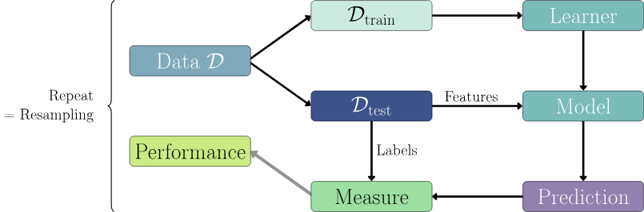
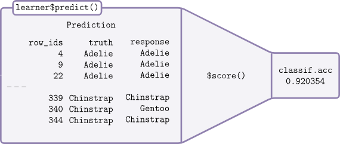
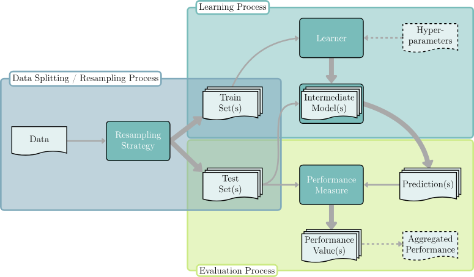
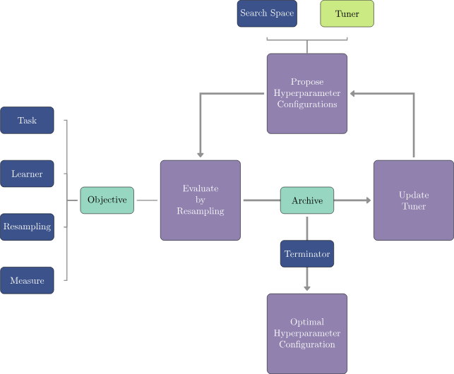
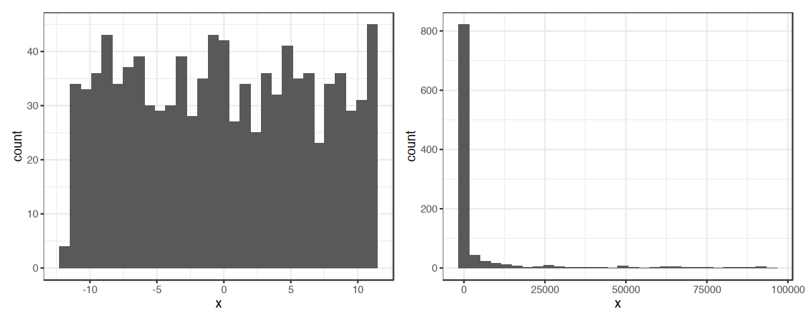

> - Cover Pic by [@抠肉肚脐](https://www.pixiv.net/artworks/126561187)  

> [Applied Machine Learning Using mlr3 in R](https://mlr3book.mlr-org.com/)

> [Applied Machine Learning Using mlr3 in R](https://mlr3book.mlr-org.com/)

## `mlr3`框架生态



## 机器学习流程



1. 将数据集拆分为训练集与测试集
2. 选择学习器，用训练集构建模型
3. 使用构建的模型对测试集进行预测
4. 基于预测的结果对模型用不同的评估器进行评估
5. 基于评估结果评价模型的性能

## 预设字典

### 预设的Task列表

```r
mlr_tasks
```

```js
<DictionaryTask> with 11 stored values
Keys: breast_cancer, california_housing, german_credit, iris, mtcars,
  penguins, pima, sonar, spam, wine, zoo
```

### 预设学习器列表

```r
mlr_learners
```

```js
<DictionaryLearner> with 27 stored values
Keys: classif.cv_glmnet, classif.debug, classif.featureless,
  classif.glmnet, classif.kknn, classif.lda, classif.log_reg,
  classif.multinom, classif.naive_bayes, classif.nnet, classif.qda,
  classif.ranger, classif.rpart, classif.svm, classif.xgboost,
  regr.cv_glmnet, regr.debug, regr.featureless, regr.glmnet, regr.kknn,
  regr.km, regr.lm, regr.nnet, regr.ranger, regr.rpart, regr.svm,
  regr.xgboost
```

### 预设的评估器列表

```r
# 1
mlr_measures
# 2
msr()
```

```js
<DictionaryMeasure> with 62 stored values
Keys: aic, bic, classif.acc, classif.auc, classif.bacc, classif.bbrier,
  classif.ce, classif.costs, classif.dor, classif.fbeta, classif.fdr,
  classif.fn, classif.fnr, classif.fomr, classif.fp, classif.fpr,
  classif.logloss, classif.mauc_au1p, classif.mauc_au1u,
  classif.mauc_aunp, classif.mauc_aunu, classif.mauc_mu,
  classif.mbrier, classif.mcc, classif.npv, classif.ppv, classif.prauc,
  classif.precision, classif.recall, classif.sensitivity,
  classif.specificity, classif.tn, classif.tnr, classif.tp,
  classif.tpr, debug_classif, internal_valid_score, oob_error,
  regr.bias, regr.ktau, regr.mae, regr.mape, regr.maxae, regr.medae,
  regr.medse, regr.mse, regr.msle, regr.pbias, regr.pinball, regr.rmse,
  regr.rmsle, regr.rsq, regr.sae, regr.smape, regr.srho, regr.sse,
  selected_features, sim.jaccard, sim.phi, time_both, time_predict,
  time_train
```

```r
msr() %>% as.data.table()
```

<table class='dataframe'>
<caption>A data.table: 62 x 7</caption>
<thead>
 <tr><th scope=col>key</th><th scope=col>label</th><th scope=col>task_type</th><th scope=col>packages</th><th scope=col>predict_type</th><th scope=col>properties</th><th scope=col>task_properties</th></tr>
 <tr><th scope=col>&lt;chr&gt;</th><th scope=col>&lt;chr&gt;</th><th scope=col>&lt;chr&gt;</th><th scope=col>&lt;list&gt;</th><th scope=col>&lt;chr&gt;</th><th scope=col>&lt;list&gt;</th><th scope=col>&lt;list&gt;</th></tr>
</thead>
<tbody>
 <tr><td>aic                </td><td>Akaike Information Criterion              </td><td>NA     </td><td>mlr3</td><td>NA      </td><td>na_score              , requires_learner      , requires_model        , requires_no_prediction</td><td></td></tr>
 <tr><td>bic                </td><td>Bayesian Information Criterion            </td><td>NA     </td><td>mlr3</td><td>NA      </td><td>na_score              , requires_learner      , requires_model        , requires_no_prediction</td><td></td></tr>
 <tr><td>classif.acc        </td><td>Classification Accuracy                   </td><td>classif</td><td>mlr3        , mlr3measures</td><td>response</td><td>weights</td><td></td></tr>
 <tr><td>classif.auc        </td><td>Area Under the ROC Curve                  </td><td>classif</td><td>mlr3        , mlr3measures</td><td>prob    </td><td></td><td>twoclass</td></tr>
 <tr><td>classif.bacc       </td><td>Balanced Accuracy                         </td><td>classif</td><td>mlr3        , mlr3measures</td><td>response</td><td>weights</td><td></td></tr>
 <tr><td>classif.bbrier     </td><td>Binary Brier Score                        </td><td>classif</td><td>mlr3        , mlr3measures</td><td>prob    </td><td>weights</td><td>twoclass</td></tr>
 <tr><td>classif.ce         </td><td>Classification Error                      </td><td>classif</td><td>mlr3        , mlr3measures</td><td>response</td><td>weights</td><td></td></tr>
 <tr><td>classif.costs      </td><td>Cost-sensitive Classification             </td><td>classif</td><td>mlr3</td><td>response</td><td>weights</td><td></td></tr>
 <tr><td>classif.dor        </td><td>Diagnostic Odds Ratio                     </td><td>classif</td><td>mlr3        , mlr3measures</td><td>response</td><td></td><td>twoclass</td></tr>
 <tr><td>classif.fbeta      </td><td>F-beta score                              </td><td>classif</td><td>mlr3        , mlr3measures</td><td>response</td><td></td><td>twoclass</td></tr>
 <tr><td>classif.fdr        </td><td>False Discovery Rate                      </td><td>classif</td><td>mlr3        , mlr3measures</td><td>response</td><td></td><td>twoclass</td></tr>
 <tr><td>classif.fn         </td><td>False Negatives                           </td><td>classif</td><td>mlr3        , mlr3measures</td><td>response</td><td></td><td>twoclass</td></tr>
 <tr><td>classif.fnr        </td><td>False Negative Rate                       </td><td>classif</td><td>mlr3        , mlr3measures</td><td>response</td><td></td><td>twoclass</td></tr>
 <tr><td>classif.fomr       </td><td>False Omission Rate                       </td><td>classif</td><td>mlr3        , mlr3measures</td><td>response</td><td></td><td>twoclass</td></tr>
 <tr><td>classif.fp         </td><td>False Positives                           </td><td>classif</td><td>mlr3        , mlr3measures</td><td>response</td><td></td><td>twoclass</td></tr>
 <tr><td>classif.fpr        </td><td>False Positive Rate                       </td><td>classif</td><td>mlr3        , mlr3measures</td><td>response</td><td></td><td>twoclass</td></tr>
 <tr><td>classif.logloss    </td><td>Log Loss                                  </td><td>classif</td><td>mlr3        , mlr3measures</td><td>prob    </td><td>weights</td><td></td></tr>
 <tr><td>classif.mauc_au1p  </td><td>Weighted average 1 vs. 1 multiclass AUC   </td><td>classif</td><td>mlr3        , mlr3measures</td><td>prob    </td><td></td><td></td></tr>
 <tr><td>classif.mauc_au1u  </td><td>Average 1 vs. 1 multiclass AUC            </td><td>classif</td><td>mlr3        , mlr3measures</td><td>prob    </td><td></td><td></td></tr>
 <tr><td>classif.mauc_aunp  </td><td>Weighted average 1 vs. rest multiclass AUC</td><td>classif</td><td>mlr3        , mlr3measures</td><td>prob    </td><td></td><td></td></tr>
 <tr><td>classif.mauc_aunu  </td><td>Average 1 vs. rest multiclass AUC         </td><td>classif</td><td>mlr3        , mlr3measures</td><td>prob    </td><td></td><td></td></tr>
 <tr><td>classif.mauc_mu    </td><td>Multiclass mu AUC                         </td><td>classif</td><td>mlr3        , mlr3measures</td><td>prob    </td><td></td><td></td></tr>
 <tr><td>classif.mbrier     </td><td>Multiclass Brier Score                    </td><td>classif</td><td>mlr3        , mlr3measures</td><td>prob    </td><td></td><td></td></tr>
 <tr><td>classif.mcc        </td><td>Matthews Correlation Coefficient          </td><td>classif</td><td>mlr3        , mlr3measures</td><td>response</td><td></td><td></td></tr>
 <tr><td>classif.npv        </td><td>Negative Predictive Value                 </td><td>classif</td><td>mlr3        , mlr3measures</td><td>response</td><td></td><td>twoclass</td></tr>
 <tr><td>classif.ppv        </td><td>Positive Predictive Value                 </td><td>classif</td><td>mlr3        , mlr3measures</td><td>response</td><td></td><td>twoclass</td></tr>
 <tr><td>classif.prauc      </td><td>Precision-Recall Curve                    </td><td>classif</td><td>mlr3        , mlr3measures</td><td>prob    </td><td></td><td>twoclass</td></tr>
 <tr><td>classif.precision  </td><td>Precision                                 </td><td>classif</td><td>mlr3        , mlr3measures</td><td>response</td><td></td><td>twoclass</td></tr>
 <tr><td>classif.recall     </td><td>Recall                                    </td><td>classif</td><td>mlr3        , mlr3measures</td><td>response</td><td></td><td>twoclass</td></tr>
 <tr><td>classif.sensitivity</td><td>Sensitivity                               </td><td>classif</td><td>mlr3        , mlr3measures</td><td>response</td><td></td><td>twoclass</td></tr>
 <tr><td>...</td><td>...</td><td>...</td><td>...</td><td>...</td><td>...</td><td>...</td></tr>
 <tr><td>classif.tnr         </td><td>True Negative Rate                                 </td><td>classif</td><td>mlr3        , mlr3measures</td><td>response </td><td></td><td>twoclass</td></tr>
 <tr><td>classif.tp          </td><td>True Positives                                     </td><td>classif</td><td>mlr3        , mlr3measures</td><td>response </td><td></td><td>twoclass</td></tr>
 <tr><td>classif.tpr         </td><td>True Positive Rate                                 </td><td>classif</td><td>mlr3        , mlr3measures</td><td>response </td><td></td><td>twoclass</td></tr>
 <tr><td>debug_classif       </td><td>Debug Classification Measure                       </td><td>NA     </td><td>mlr3</td><td>response </td><td>na_score</td><td></td></tr>
 <tr><td>internal_valid_score</td><td>Internal Validation Score                          </td><td>NA     </td><td>mlr3</td><td>NA       </td><td>na_score              , requires_learner      , requires_no_prediction</td><td></td></tr>
 <tr><td>oob_error           </td><td>Out-of-bag Error                                   </td><td>NA     </td><td>mlr3</td><td>NA       </td><td>na_score              , requires_learner      , requires_no_prediction</td><td></td></tr>
 <tr><td>regr.bias           </td><td>Bias                                               </td><td>regr   </td><td>mlr3        , mlr3measures</td><td>response </td><td>weights</td><td></td></tr>
 <tr><td>regr.ktau           </td><td>Kendall's tau                                      </td><td>regr   </td><td>mlr3        , mlr3measures</td><td>response </td><td></td><td></td></tr>
 <tr><td>regr.mae            </td><td>Mean Absolute Error                                </td><td>regr   </td><td>mlr3        , mlr3measures</td><td>response </td><td>weights</td><td></td></tr>
 <tr><td>regr.mape           </td><td>Mean Absolute Percent Error                        </td><td>regr   </td><td>mlr3        , mlr3measures</td><td>response </td><td>weights</td><td></td></tr>
 <tr><td>regr.maxae          </td><td>Max Absolute Error                                 </td><td>regr   </td><td>mlr3        , mlr3measures</td><td>response </td><td></td><td></td></tr>
 <tr><td>regr.medae          </td><td>Median Absolute Error                              </td><td>regr   </td><td>mlr3        , mlr3measures</td><td>response </td><td></td><td></td></tr>
 <tr><td>regr.medse          </td><td>Median Squared Error                               </td><td>regr   </td><td>mlr3        , mlr3measures</td><td>response </td><td></td><td></td></tr>
 <tr><td>regr.mse            </td><td>Mean Squared Error                                 </td><td>regr   </td><td>mlr3        , mlr3measures</td><td>response </td><td>weights</td><td></td></tr>
 <tr><td>regr.msle           </td><td>Mean Squared Log Error                             </td><td>regr   </td><td>mlr3        , mlr3measures</td><td>response </td><td>weights</td><td></td></tr>
 <tr><td>regr.pbias          </td><td>Percent Bias                                       </td><td>regr   </td><td>mlr3        , mlr3measures</td><td>response </td><td>weights</td><td></td></tr>
 <tr><td>regr.pinball        </td><td>NA                                                 </td><td>regr   </td><td>mlr3</td><td>quantiles</td><td></td><td></td></tr>
 <tr><td>regr.rmse           </td><td>Root Mean Squared Error                            </td><td>regr   </td><td>mlr3        , mlr3measures</td><td>response </td><td>weights</td><td></td></tr>
 <tr><td>regr.rmsle          </td><td>Root Mean Squared Log Error                        </td><td>regr   </td><td>mlr3        , mlr3measures</td><td>response </td><td>weights</td><td></td></tr>
 <tr><td>regr.rsq            </td><td>NA                                                 </td><td>regr   </td><td>mlr3</td><td>response </td><td>weights</td><td></td></tr>
 <tr><td>regr.sae            </td><td>Sum of Absolute Errors                             </td><td>regr   </td><td>mlr3        , mlr3measures</td><td>response </td><td></td><td></td></tr>
 <tr><td>regr.smape          </td><td>Symmetric Mean Absolute Percent Error              </td><td>regr   </td><td>mlr3        , mlr3measures</td><td>response </td><td></td><td></td></tr>
 <tr><td>regr.srho           </td><td>Spearman's rho                                     </td><td>regr   </td><td>mlr3        , mlr3measures</td><td>response </td><td></td><td></td></tr>
 <tr><td>regr.sse            </td><td>Sum of Squared Errors                              </td><td>regr   </td><td>mlr3        , mlr3measures</td><td>response </td><td></td><td></td></tr>
 <tr><td>selected_features   </td><td>Absolute or Relative Frequency of Selected Features</td><td>NA     </td><td>mlr3</td><td>NA       </td><td>requires_task         , requires_learner      , requires_model        , requires_no_prediction</td><td></td></tr>
 <tr><td>sim.jaccard         </td><td>Jaccard Similarity Index                           </td><td>NA     </td><td>mlr3        , mlr3measures</td><td>NA       </td><td>requires_model        , requires_no_prediction</td><td></td></tr>
 <tr><td>sim.phi             </td><td>Phi Coefficient Similarity                         </td><td>NA     </td><td>mlr3        , mlr3measures</td><td>NA       </td><td>requires_model        , requires_no_prediction</td><td></td></tr>
 <tr><td>time_both           </td><td>Elapsed Time                                       </td><td>NA     </td><td>mlr3</td><td>NA       </td><td>requires_learner      , requires_no_prediction</td><td></td></tr>
 <tr><td>time_predict        </td><td>Elapsed Time                                       </td><td>NA     </td><td>mlr3</td><td>NA       </td><td>requires_learner      , requires_no_prediction</td><td></td></tr>
 <tr><td>time_train          </td><td>Elapsed Time                                       </td><td>NA     </td><td>mlr3</td><td>NA       </td><td>requires_learner      , requires_no_prediction</td><td></td></tr>
</tbody>
</table>

### 调取详情

```r
mlr_tasks$get('california_housing')
mlr_learners$get('classif.xgboost')
mlr_measures$get('regr.mse')
```

```js
-- <TaskRegr> (20640x10): California House Value -------------------------------
* Target: median_house_value
* Properties: -
* Features (9):
  * dbl (8): households, housing_median_age, latitude, longitude,
  median_income, population, total_bedrooms, total_rooms
  * fct (1): ocean_proximity


-- <LearnerClassifXgboost> (classif.xgboost): Extreme Gradient Boosting --------
* Model: -
* Parameters: nrounds=1000, nthread=1, verbose=0
* Validate: <NULL>
* Packages: mlr3, mlr3learners, and xgboost
* Predict Types: [response] and prob
* Feature Types: logical, integer, and numeric
* Encapsulation: none (fallback: -)
* Properties: hotstart_forward, importance, internal_tuning, missings,
multiclass, offset, twoclass, validation, and weights
* Other settings: use_weights = 'use'


-- <MeasureRegrSimple> (regr.mse): Mean Squared Error --------------------------
* Packages: mlr3 and mlr3measures
* Range: [0, Inf]
* Minimize: TRUE
* Average: macro
* Parameters: list()
* Properties: weights
* Predict type: response
* Predict sets: test
* Aggregator: mean()
```

---

## 简单的回归的流程

### 任务化

#### 创建任务

- `as_task_*()`
  - target：outcome
  - id：任务名称
- 这里就用`as_task_regr()`代替下

```r
dt.tskR <- as_task_regr(dt, target = 'outcome')
```

- 对outcome与特征值的图形化概括
  - 特征值过多不建议，又慢又看不清

```r
library(mlr3viz)
autoplot(dt.tskR, type = 'pairs')
```

#### 数据检索及数据处理

- 可以通过`$`探索任务里的各种信息
- 对于导入的原始数据而言
  - `dt.tskR$nrow`
  - `dt.tskR$ncol`
  - `dt.tskR$feature_names`
  - `dt.tskR$target_names`
  - `dt.tskR$row_ids`
  - `dt.tskR$col_info`
  - ......
- 有些是函数
  - `dt.tskR$clone()`
  - `dt.tskR$data()`
  - `dt.tskR$cbind()`
  - `dt.tskR$rbind()`
  - `dt.tskR$filter()`
  - `dt.tskR$select()`
  - `dt.tskR$head()`
  - ......

- 这两个虽然结果一样，  
  但是第一个是先调取整个data再筛选，  
  第二个则是直接充task里调取第二行

```r
housing.tskR$data()[2]
housing.tskR$data(rows = housing.tskR$row_ids[2])
```

- 函数的用法和平时的类似，只是集成到了Task里面而已

#### 数据处理的实例

- 注意，`dt.tskR$func()`是对`dt.tsk`的就地修改，  
  **不需要保存到新的变量里**

```r
# 克隆一个一模一样的任务
dt.tskR2 <- dt.tskR$clone()
# 选择第1–2行
dt.tskR2$filter(1:2)
```

```r
# 添加列
dt.tskR$cbind( 
  data.frame(x = c(150, 160))
)
# 添加行
dt.tskR_small$rbind( 
  data.frame(x1 = 23, x2 = 5, x3 = 170)
)
dt.tskR_small$data()
```

### 学习器
>
> [mlr-org: Learners](https://mlr-org.com/learners.html)

- 学习器的类型是`Learner`

#### 包的分类

- **mlr3**：仅包含一些基础的学习器
- **mlr3learners**：比`mlr3`包更丰富且常用的学习器
- **mlr3proba**：生存学习器
- **mlr3cluster**：聚类学习器
- **mlr3extralearners**：一些不稳定或者CRAN上不可用的学习器
- **mlr3torch**：神经网络相关学习器

#### 查看学习器

- `lrn()`可以调取对应学习器的信息，并且包含下列数据
  - `$feature_types`：学习器可以处理的特征类型
  - `$packages`：使用该学习器需要安装的软件包
  - `$properties`：学习器的属性；例如，**'missings'** 属性表示模型可以处理缺失数据，而 **'importance'** 表示它可以计算每个特征的相对重要性
  - `$predict_types`：模型能够做出的预测类型
  - `$param_set`：可用超参数集

```r
lrn('regr.rpart')
```

```js
-- <LearnerRegrRpart> (regr.rpart): Regression Tree ----------------------------
* Model: -
* Parameters: xval=0
* Packages: mlr3 and rpart
* Predict Types: [response]
* Feature Types: logical, integer, numeric, factor, and ordered
* Encapsulation: none (fallback: -)
* Properties: importance, missings, selected_features, and weights
* Other settings: use_weights = 'use'
```

#### 传递多个学习器

- `lrn()`的复数形`lrns()`可以调取多个学习器
- 其他的类似的还有`tsks()`和后续出现的`msrs()`，`rsmps()`

```r
dt.lrnR.rpart_lm <- lrns(c('regr.rpart', 'regr.lm'))
dt.lrnR.rpart_lm
```

### 分割训练集和测试集

- `partition()`中`ratio`为训练集占整个数据集比例

```r
dt.tskR.splits <- partition(dt.tsk, ratio = 0.7)
dt.tskR.splits
```

### 训练模型

- `Learner`作用于`Task`

```r
dt.lrnR.rpart <- lrn('regr.rpart')
dt.lrnR.rpart$train(dt.tsk)
```

- 拟合的模型储存在`Learner$model`中

```r
dt.lrnR.rpart$model
```

- 通过指定参数`row_ids`分配训练集

```r
dt.lrnR.rpart$train(dt.tskR, row_ids = dt.tskR.splits$train)
```

- 也可以指定预测类型
  - `regr.rpart`不能选择response以外的类型
  - 这里选择用 `regr.lm`来预测标准误差

```r
dt.lrnR.lm <- lrn('regr.lm', predict_type = 'se')
```

- 可以随便看看区别
  - 在指定了**se**后output里`Predict Types`的框框给到了`[se]`

```r
lrn('regr.lm')
lrn('regr.lm', predict_type = 'se')
```

```js

-- <LearnerRegrLM> (regr.lm): Linear Model -------------------------------------
* Model: -
* Parameters: use_pred_offset=TRUE
* Packages: mlr3, mlr3learners, and stats
* Predict Types: [response] and se
* Feature Types: logical, integer, numeric, character, and factor
* Encapsulation: none (fallback: -)
* Properties: offset and weights
* Other settings: use_weights = 'use'


-- <LearnerRegrLM> (regr.lm): Linear Model -------------------------------------
* Model: -
* Parameters: use_pred_offset=TRUE
* Packages: mlr3, mlr3learners, and stats
* Predict Types: response and [se]
* Feature Types: logical, integer, numeric, character, and factor
* Encapsulation: none (fallback: -)
* Properties: offset and weights
* Other settings: use_weights = 'use'
```

### 预测数据

- 由于`Learner$predict()`会返回一个新的对象，所以需要另外保存

```r
dt.lrnR.rpart.pred <- dt.lrnR.rpart$predict(dt.tskR, row_ids = dt.tskR.splits$test)
```

- 可以简单看看这些对象的类别

```r
dt.tskR %>% class()
dt.lrnR.rpart %>% class()
dt.lrnR.rpart.pred %>% class()
```

```js
'TaskRegr''TaskSupervised''Task''R6'
'LearnerRegrRpart''LearnerRegr''Learner''R6'
'PredictionRegr''Prediction''R6'
```

- `dt.lrnR.rpart.pred`：返回一个预测结果的文本输出
- `dt.lrnR.rpart.pred$truth`：返回真实值向量
- `dt.lrnR.rpart.pred$responese`：返回预测响应值向量

### 对真实值-预测值进行绘图

```r
autoplot(dt.lrnR.rpart.pred)
```

### 超参数

- 训练模型前需要**预先指定的参数**

#### 获取超参数

```r
# 1
dt.lrnR.rpart$param_set
# 2
lrn('regr.rpart')$param_set
```

```js
<ParamSet(10)>
                id    class lower upper nlevels        default  value
            <char>   <char> <num> <num>   <num>         <list> <list>
 1:             cp ParamDbl     0     1     Inf           0.01 [NULL]
 2:     keep_model ParamLgl    NA    NA       2          FALSE [NULL]
 3:     maxcompete ParamInt     0   Inf     Inf              4 [NULL]
 4:       maxdepth ParamInt     1    30      30             30 [NULL]
 5:   maxsurrogate ParamInt     0   Inf     Inf              5 [NULL]
 6:      minbucket ParamInt     1   Inf     Inf <NoDefault[0]> [NULL]
 7:       minsplit ParamInt     1   Inf     Inf             20 [NULL]
 8: surrogatestyle ParamInt     0     1       2              0 [NULL]
 9:   usesurrogate ParamInt     0     2       3              2 [NULL]
10:           xval ParamInt     0   Inf     Inf             10      0
```

- 其中
  - **id**：超参数名
  - **class**：类别
  - **lower**：最小可设定值
  - **upper**：最大可设定值
  - **nlevels**：可设定值的种类数目
  - **default**：原函数的默认取值
  - **value**：当前取值，`[NULL]`时使用`default`的值

- 当`cp`设置为`0.5`后，可以看到output中`cp`的value变成了`0.5`

```r
lrn('regr.rpart', cp = 0.5)$param_set
```

```js
<ParamSet(10)>
                id    class lower upper nlevels        default  value
            <char>   <char> <num> <num>   <num>         <list> <list>
 1:             cp ParamDbl     0     1     Inf           0.01    0.5
 2:     keep_model ParamLgl    NA    NA       2          FALSE [NULL]
 3:     maxcompete ParamInt     0   Inf     Inf              4 [NULL]
 4:       maxdepth ParamInt     1    30      30             30 [NULL]
 5:   maxsurrogate ParamInt     0   Inf     Inf              5 [NULL]
 6:      minbucket ParamInt     1   Inf     Inf <NoDefault[0]> [NULL]
 7:       minsplit ParamInt     1   Inf     Inf             20 [NULL]
 8: surrogatestyle ParamInt     0     1       2              0 [NULL]
 9:   usesurrogate ParamInt     0     2       3              2 [NULL]
10:           xval ParamInt     0   Inf     Inf             10      0
```

- 查看当前模型的超参数设定情况

```r
dt.lrnR.rpart$param_set$values
```

- 对查看当前模型的超参数设定就地修改

```r
dt.lrnR.rpart$param_set$set_values(cp = 0.02，minsplit = 10)
```

#### 超参数依赖关系

- 支持向量机中的超参数更加复杂

```r
lrn('regr.svm')$param_set
```

```js
<ParamSet(14)>
Key: <id>
           id    class lower upper nlevels        default parents  value
       <char>   <char> <num> <num>   <num>         <list>  <list> <list>
 1: cachesize ParamDbl  -Inf   Inf     Inf             40  [NULL] [NULL]
 2:     coef0 ParamDbl  -Inf   Inf     Inf              0  kernel [NULL]
 3:      cost ParamDbl     0   Inf     Inf              1    type [NULL]
 4:     cross ParamInt     0   Inf     Inf              0  [NULL] [NULL]
 5:    degree ParamInt     1   Inf     Inf              3  kernel [NULL]
 6:   epsilon ParamDbl     0   Inf     Inf            0.1    type [NULL]
 7:    fitted ParamLgl    NA    NA       2           TRUE  [NULL] [NULL]
 8:     gamma ParamDbl     0   Inf     Inf <NoDefault[0]>  kernel [NULL]
 9:    kernel ParamFct    NA    NA       4         radial  [NULL] [NULL]
10:        nu ParamDbl  -Inf   Inf     Inf            0.5    type [NULL]
11:     scale ParamUty    NA    NA     Inf           TRUE  [NULL] [NULL]
12: shrinking ParamLgl    NA    NA       2           TRUE  [NULL] [NULL]
13: tolerance ParamDbl     0   Inf     Inf          0.001  [NULL] [NULL]
14:      type ParamFct    NA    NA       2 eps-regression  [NULL] [NULL]
```

- 可以从`Learner$param_set$deps`中获得超参数之间的依赖关系总结

```r
lrn('regr.svm')$param_set$deps
```

<table class='dataframe'>
<caption>A data.table: 6 x 3</caption>
<thead>
 <tr><th scope=col>id</th><th scope=col>on</th><th scope=col>cond</th></tr>
 <tr><th scope=col>&lt;chr&gt;</th><th scope=col>&lt;chr&gt;</th><th scope=col>&lt;list&gt;</th></tr>
</thead>
<tbody>
 <tr><td>coef0  </td><td>kernel</td><td>polynomial    , sigmoid       , %s %%in%% {%s}</td></tr>
 <tr><td>cost   </td><td>type  </td><td>eps-regression, nu-regression , %s %%in%% {%s}</td></tr>
 <tr><td>degree </td><td>kernel</td><td>polynomial, %s == %s  </td></tr>
 <tr><td>epsilon</td><td>type  </td><td>eps-regression, %s == %s      </td></tr>
 <tr><td>gamma  </td><td>kernel</td><td>polynomial    , radial        , sigmoid       , %s %%in%% {%s}</td></tr>
 <tr><td>nu     </td><td>type  </td><td>nu-regression, %s == %s     </td></tr>
</tbody>
</table>

- 查看一下设置的条件

```r
for (i in 1:6){
 print(lrn('regr.svm')$param_set$deps[[i, 'cond']])
}
```

```js
CondAnyOf: x %in% {polynomial, sigmoid}
CondAnyOf: x %in% {eps-regression, nu-regression}
CondEqual: x == polynomial
CondEqual: x == eps-regression
CondAnyOf: x %in% {polynomial, radial, sigmoid}
CondEqual: x == nu-regression
```

- 输出中`x`是`on`的指代，  
  当被依赖的超参数`on`的设置满足某条件时，  
  `id`中的超参数才能被设置
- 如果`on`超参数不满足条件，设置`id`超参数会报错

#### 基准学习器

- `regr.featureless`
  - 它总是将新值预测为训练数据中目标的均值
  - 如果 `robust` 超参数设置为 `TRUE`，则为中位数
- 用于
  - 模型比较
  - 回退学习器

```r
lrn('regr.featureless')
```

### 模型评估

- `msr()`用于单个评估器的评估
- `msrs()`可以输入使用多个评估器名称的向量

```r
# 1
msrR.mse_mae <- msrs(c('regr.mse', 'regr.mae'))
housing.lrnR.rpart.pred$score(msrR.mse_mae)
# 2
housing.lrnR.rpart.pred$score(msrs(c('regr.mse', 'regr.mae')))
```

- `mlr3`还有一些其他非质量评价的评估指标
  - `msr('time_train')`：训练模型所花费的时间
  - `msr('time_predict')`：模型进行预测所需的时间
  - `msr('time_both')`：训练模型然后进行预测所花费的总时间
  - `msr('selected_features')`：  
   模型选择的特征数量，仅当模型具有`selected_features`属性时才可使用

- `Measure$properties`提供了评估器的属性

```r
msr('regr.mse')$properties
msr('time_train')$properties
```

```js
'weights'
'requires_learner''requires_no_prediction'
```

- 评估器的超参数
  - 可以注意到`time_train`的`Parameters`是`list()`，  
   这代表是空的
  - `selected_features`的`Parameters`有`normalize=FALSE`，  
   说明可以提前设置

```r
msr('time_train')
msr('selected_features')
```

```js
-- <MeasureElapsedTime> (time_train): Elapsed Time -----------------------------
* Packages: mlr3
* Range: [0, Inf]
* Minimize: TRUE
* Average: macro
* Parameters: list()
* Properties: requires_learner and requires_no_prediction
* Predict type: NA
* Predict sets:
* Aggregator: mean()


-- <MeasureSelectedFeatures> (selected_features): Absolute or Relative Frequency
* Packages: mlr3
* Range: [0, Inf]
* Minimize: TRUE
* Average: macro
* Parameters: normalize=FALSE
* Properties: requires_task, requires_learner, requires_model, and
requires_no_prediction
* Predict type: NA
* Predict sets:
* Aggregator: mean()
```

- 访问评估器的超参数也是用`$param_set`

```r
msr.sf <- msr('selected_features')
msr.sf$param_set
```

```js
<ParamSet(1)>
          id    class lower upper nlevels        default  value
      <char>   <char> <num> <num>   <num>         <list> <list>
1: normalize ParamLgl    NA    NA       2 <NoDefault[0]>  FALSE
```

- 修改

```r
# 1
msr.sf$param_set$set_values(normalize = TRUE)
# 2
msr.sf$param_set$normalize <- TRUE
```

---

## 简单的分类的流程

- 与回归的流程相同，  
  只是基础对象分别继承自 `TaskClassif`、`LearnerClassif` 和 `MeasureClassif`
- 分类有**二元分类**和**多元分类**两种

### 任务化

- 这里就直接调取预设的任务进行练习

```r
mlr_tasks %>% as.data.table()
```

<table class='dataframe'>
<caption>A data.table: 11 x 14</caption>
<thead>
 <tr><th scope=col>key</th><th scope=col>label</th><th scope=col>task_type</th><th scope=col>nrow</th><th scope=col>ncol</th><th scope=col>properties</th><th scope=col>lgl</th><th scope=col>int</th><th scope=col>dbl</th><th scope=col>chr</th><th scope=col>fct</th><th scope=col>ord</th><th scope=col>pxc</th><th scope=col>dte</th></tr>
 <tr><th scope=col>&lt;chr&gt;</th><th scope=col>&lt;chr&gt;</th><th scope=col>&lt;chr&gt;</th><th scope=col>&lt;int&gt;</th><th scope=col>&lt;int&gt;</th><th scope=col>&lt;list&gt;</th><th scope=col>&lt;int&gt;</th><th scope=col>&lt;int&gt;</th><th scope=col>&lt;int&gt;</th><th scope=col>&lt;int&gt;</th><th scope=col>&lt;int&gt;</th><th scope=col>&lt;int&gt;</th><th scope=col>&lt;int&gt;</th><th scope=col>&lt;int&gt;</th></tr>
</thead>
<tbody>
 <tr><td>breast_cancer     </td><td>Wisconsin Breast Cancer</td><td>classif</td><td>  683</td><td>10</td><td>twoclass</td><td> 0</td><td>0</td><td> 0</td><td>0</td><td> 0</td><td>9</td><td>0</td><td>0</td></tr>
 <tr><td>california_housing</td><td>California House Value </td><td>regr   </td><td>20640</td><td>10</td><td></td><td> 0</td><td>0</td><td> 8</td><td>0</td><td> 1</td><td>0</td><td>0</td><td>0</td></tr>
 <tr><td>german_credit     </td><td>German Credit          </td><td>classif</td><td> 1000</td><td>21</td><td>twoclass</td><td> 0</td><td>3</td><td> 0</td><td>0</td><td>14</td><td>3</td><td>0</td><td>0</td></tr>
 <tr><td>iris              </td><td>Iris Flowers           </td><td>classif</td><td>  150</td><td> 5</td><td>multiclass</td><td> 0</td><td>0</td><td> 4</td><td>0</td><td> 0</td><td>0</td><td>0</td><td>0</td></tr>
 <tr><td>mtcars            </td><td>Motor Trends           </td><td>regr   </td><td>   32</td><td>11</td><td></td><td> 0</td><td>0</td><td>10</td><td>0</td><td> 0</td><td>0</td><td>0</td><td>0</td></tr>
 <tr><td>penguins          </td><td>Palmer Penguins        </td><td>classif</td><td>  344</td><td> 8</td><td>multiclass</td><td> 0</td><td>3</td><td> 2</td><td>0</td><td> 2</td><td>0</td><td>0</td><td>0</td></tr>
 <tr><td>pima              </td><td>Pima Indian Diabetes   </td><td>classif</td><td>  768</td><td> 9</td><td>twoclass</td><td> 0</td><td>0</td><td> 8</td><td>0</td><td> 0</td><td>0</td><td>0</td><td>0</td></tr>
 <tr><td>sonar             </td><td>Sonar: Mines vs. Rocks </td><td>classif</td><td>  208</td><td>61</td><td>twoclass</td><td> 0</td><td>0</td><td>60</td><td>0</td><td> 0</td><td>0</td><td>0</td><td>0</td></tr>
 <tr><td>spam              </td><td>HP Spam Detection      </td><td>classif</td><td> 4601</td><td>58</td><td>twoclass</td><td> 0</td><td>0</td><td>57</td><td>0</td><td> 0</td><td>0</td><td>0</td><td>0</td></tr>
 <tr><td>wine              </td><td>Wine Regions           </td><td>classif</td><td>  178</td><td>14</td><td>multiclass</td><td> 0</td><td>2</td><td>11</td><td>0</td><td> 0</td><td>0</td><td>0</td><td>0</td></tr>
 <tr><td>zoo               </td><td>Zoo Animals            </td><td>classif</td><td>  101</td><td>17</td><td>multiclass</td><td>15</td><td>1</td><td> 0</td><td>0</td><td> 0</td><td>0</td><td>0</td><td>0</td></tr>
</tbody>
</table>

- 分别用`german_credit`和`penguins`作为二元分类和多元分类的例子

```r
gc.tskC <- tsk('german_credit')
peng.tskC <- tsk('penguins')

gc.tskC
peng.tskC
```

```js
-- <TaskClassif> (1000x21): German Credit --------------------------------------
* Target: credit_risk
* Target classes: good (positive class, 70%), bad (30%)
* Properties: twoclass
* Features (20):
  * fct (14): credit_history, employment_duration, foreign_worker, housing,
  job, other_debtors, other_installment_plans, people_liable,
  personal_status_sex, property, purpose, savings, status, telephone
  * int (3): age, amount, duration
  * ord (3): installment_rate, number_credits, present_residence


-- <TaskClassif> (344x8): Palmer Penguins --------------------------------------
* Target: species
* Target classes: Adelie (44%), Gentoo (36%), Chinstrap (20%)
* Properties: multiclass
* Features (7):
  * int (3): body_mass, flipper_length, year
  * dbl (2): bill_depth, bill_length
  * fct (2): island, sex
```

### 二元分类

#### Outcome的分类

```r
gc.tskC$class_names
gc.tskC$properties
```

```js
'good''bad'
'twoclass'
```

#### 定义正类

```r
gc.tskC$positive <- 'good'
```

- 如果不设置，默认第一个级别是正类

#### 对真实值-预测值进行绘图

```r
autoplot(gc.tskC, type = 'duo') +
  theme(strip.text.y = element_text(angle = -45, size = 8))
```

#### 预测结果

- `predict_type`可以选择预测响应类别`'response'`或者概率`'prob'`
  - 选择概率也会给出`response`的结果
  - 所以对于分类问题，用概率会更好

```r
lrn('classif.rpart') # 'response'是默认
lrn('classif.rpart', predict_type = 'prob')
```

```r
# gc.tskC.splits <- partition(gc.tskC,ratio = 0.7) # 事先设定好

gc.lrnC.rpart <- lrn('classif.rpart', predict_type = 'response')
gc.lrnC.rpart$train(gc.tskC, gc.tskC.splits$train)
gc.lrnC.rpart.pred <- gc.lrnC.rpart$predict(gc.tskC, gc.tskC.splits$test)
gc.lrnC.rpart.pred
```

```js
-- <PredictionClassif> for 300 observations: -----------------------------------
 row_ids truth response
       6  good     good
       8  good      bad
      10   bad      bad
     ---   ---      ---
     992  good     good
     995  good     good
    1000  good      bad
```

```r
# gc.tskC.splits <- partition(gc.tskC,ratio = 0.7) # 事先设定好

gc.lrnC.rpart <- lrn('classif.rpart', predict_type = 'prob')
gc.lrnC.rpart$train(gc.tskC, gc.tskC.splits$train)
gc.lrnC.rpart.pred <- gc.lrnC.rpart$predict(gc.tskC, gc.tskC.splits$test)
gc.lrnC.rpart.pred
```

```js
-- <PredictionClassif> for 300 observations: -----------------------------------
 row_ids truth response  prob.good  prob.bad
       6  good     good 0.85667752 0.1433225
       8  good      bad 0.21739130 0.7826087
      10   bad      bad 0.29411765 0.7058824
     ---   ---      ---        ---       ---
     992  good     good 0.85667752 0.1433225
     995  good     good 0.85667752 0.1433225
    1000  good      bad 0.07692308 0.9230769
```

#### 模型评估

- 不同种类的评估器对于`response`和`prob`的适用性是不同的，  
  需要找到合适的评估器

- 寻找支持分类并用于评估概率的评估器

```r
as.data.table(msr())[
    task_type == 'classif' & predict_type == 'prob']
```

<table class='dataframe'>
<caption>A data.table: 7 x 7</caption>
<thead>
 <tr><th scope=col>key</th><th scope=col>label</th><th scope=col>task_type</th><th scope=col>packages</th><th scope=col>predict_type</th><th scope=col>properties</th><th scope=col>task_properties</th></tr>
 <tr><th scope=col>&lt;chr&gt;</th><th scope=col>&lt;chr&gt;</th><th scope=col>&lt;chr&gt;</th><th scope=col>&lt;list&gt;</th><th scope=col>&lt;chr&gt;</th><th scope=col>&lt;list&gt;</th><th scope=col>&lt;list&gt;</th></tr>
</thead>
<tbody>
 <tr><td>classif.logloss  </td><td>Log Loss                                  </td><td>classif</td><td>mlr3        , mlr3measures</td><td>prob</td><td>weights</td><td></td></tr>
 <tr><td>classif.mauc_au1p</td><td>Weighted average 1 vs. 1 multiclass AUC   </td><td>classif</td><td>mlr3        , mlr3measures</td><td>prob</td><td></td><td></td></tr>
 <tr><td>classif.mauc_au1u</td><td>Average 1 vs. 1 multiclass AUC            </td><td>classif</td><td>mlr3        , mlr3measures</td><td>prob</td><td></td><td></td></tr>
 <tr><td>classif.mauc_aunp</td><td>Weighted average 1 vs. rest multiclass AUC</td><td>classif</td><td>mlr3        , mlr3measures</td><td>prob</td><td></td><td></td></tr>
 <tr><td>classif.mauc_aunu</td><td>Average 1 vs. rest multiclass AUC         </td><td>classif</td><td>mlr3        , mlr3measures</td><td>prob</td><td></td><td></td></tr>
 <tr><td>classif.mauc_mu  </td><td>Multiclass mu AUC                         </td><td>classif</td><td>mlr3        , mlr3measures</td><td>prob</td><td></td><td></td></tr>
 <tr><td>classif.mbrier   </td><td>Multiclass Brier Score                    </td><td>classif</td><td>mlr3        , mlr3measures</td><td>prob</td><td></td><td></td></tr>
</tbody>
</table>

- 这里使用了3种评估器
  - `classif.mbrier`：用预测概率与真实值之间的平方差评估`prob`的预测结果
  - `classif.logloss`：用真实类别的预测概率的负对数评估`prob`的预测结果
  - `classif.acc`：评估`response`的预测分类结果

```r
gc.lrnC.rpart.pred$score(msrs(c('classif.mbrier', 'classif.logloss', 'classif.acc')))
```

#### 混淆矩阵

- `Prediction$confution`查看混淆矩阵

```r
gc.lrnC.rpart.pred$confusion
```

```js
        truth
response good bad
    good  177  45
    bad    41  37
```

- 通过`autoplot(Prediction)`可视化混淆矩阵

```r
autoplot(gc.lrnC.rpart.pred)
```

#### 阈值设定

- `Prediction$set_threshold()`设定阈值
  - 阈值是**判断为正类**的阈值，因此需要正确设置正类

```r
gc.lrnC.rpart.pred$set_threshold(YourThreshold)
```

### 多元分类

#### Outcome的分类

```r
peng.tskC$class_names
peng.tskC$properties
```

```js
'Adelie''Chinstrap''Gentoo'
'multiclass'
```

#### 没有定义正类

- 定义了反而会报错的

```r
peng.tskC$positive <- 'Adelie'
```

```js
Error in (function (rhs) : Setting the positive class is only feasible for binary classification
```

#### 对真实值-预测值进行绘图

```r
autoplot(peng.tskC, type = 'duo') +
  theme(strip.text.y = element_text(angle = -45, size = 8))
```

#### 预测结果

```r
# peng.tskC.splits <- partition(peng.tskC,ratio = 0.7) # 事先设定好

peng.lrnC.rpart <- lrn('classif.rpart', predict_type = 'response')
peng.lrnC.rpart$train(peng.tskC, peng.tskC.splits$train)
peng.lrnC.rpart.pred <- peng.lrnC.rpart$predict(peng.tskC, peng.lrnC.splits$test)
peng.lrnC.rpart.pred
```

```js
-- <PredictionClassif> for 103 observations: -----------------------------------
 row_ids     truth  response
      11    Adelie    Adelie
      13    Adelie    Adelie
      14    Adelie    Adelie
     ---       ---       ---
     326 Chinstrap Chinstrap
     331 Chinstrap    Adelie
     338 Chinstrap Chinstrap
```

```r
# peng.tskC.splits <- partition(peng.tskC,ratio = 0.7) # 事先设定好

peng.lrnC.rpart <- lrn('classif.rpart', predict_type = 'prob')
peng.lrnC.rpart$train(peng.tskC, peng.tskC.splits$train)
peng.lrnC.rpart.pred <- peng.lrnC.rpart$predict(peng.tskC, peng.lrnC.splits$test)
peng.lrnC.rpart.pred
```

```js
-- <PredictionClassif> for 103 observations: -----------------------------------
 row_ids     truth  response prob.Adelie prob.Chinstrap prob.Gentoo
      11    Adelie    Adelie   0.9537037     0.01851852  0.02777778
      13    Adelie    Adelie   0.9537037     0.01851852  0.02777778
      14    Adelie    Adelie   0.9537037     0.01851852  0.02777778
     ---       ---       ---         ---            ---         ---
     326 Chinstrap Chinstrap   0.0000000     1.00000000  0.00000000
     331 Chinstrap    Adelie   0.9537037     0.01851852  0.02777778
     338 Chinstrap Chinstrap   0.0000000     1.00000000  0.00000000
```

#### 模型评估

- 寻找支持多元分类并用于评估概率的评估器

```r
as.data.table(msr())[
    task_type == 'classif' & predict_type == 'prob' &
    !sapply(task_properties, function(x) return('twoclass' %in% x))]
```

```r
peng.lrnC.rpart.pred$score(msrs(c('classif.mbrier', 'classif.logloss', 'classif.acc')))
```

#### 混淆矩阵

- `Prediction$confution`查看混淆矩阵

```r
gc.lrnC.rpart.pred$confusion
```

```js
        truth
response good bad
    good  177  45
    bad    41  37
```

- 通过`autoplot(Prediction)`可视化混淆矩阵

```r
autoplot(gc.lrnC.rpart.pred)
```

#### 阈值设定

- `Prediction$set_threshold()`设定阈值
  - 与二元分类不同的是，多元分类需要**给每一个分类**单独设置一个阈值

- 在多分类问题中阈值化的工作原理
  - 首先为 `n` 个类别中的每个类别分配一个阈值，  
   将每个类别的预测概率除以这些阈值，  
   以返回 `n` 个比率，然后选择比率最高的类别  
   （这里的阈值其实就是权重了，阈值越小，权重越高）

- 通过传递一个命名向量进行更改

```r
# 随便设置
peng.lrnC.rpart.pred$set_threshold(c(
 'Adelie' = 0.8,
 'Chinstrap' = 0.5,
 'Gentoo' = 0.2
))
```

- 逆加权设定阈值
  - 将新阈值设置为训练集中每个类别的比例
  - 在选择比率最高的标签之前，用预测概率除以这些类别比例

```r
# 逆加权法设置
peng.lrnC.rpart.pred$set_threshold(
 peng.tskC$truth(peng.tskC.splits$train) %>% 
  table() %>% 
  proportions()
)
```

## 定义数据role

- `Task$col_roles`能显示所有的role

```r
peng.tskC$col_roles
```

```js
$feature
'bill_depth''bill_length''flipper_length''island''sex''year''body_mass'
$target
'species'
$name
$order
$stratum
$group
$offset
$weights_learner
$weights_measure
```

- 通过`Task$set_col_roles('col', roles = 'role')`来重新定义

```r
set_col_roles('body_mass', roles = 'feature')
```

---

## 留出法与评估

- 留出法就是`partition()`的简单划分方法
- 评估`Prediction$score`是用来估计最终模型的**泛化能力**


---

## 重采样

### 简介


- **k折交叉验证（k-fold cross-validation, CV）**
  - 将数据集拆分为k折，其中k-1折用于模型训练，剩下1折用于测试数据
  - 过程重复进行，直到每一折都被作为测试集使用一次
  - 将k个模型的性估计值汇总，通常取平均值
- **留一法交叉验证（leave-one-out cross-validation, LOO-CV）**
  - CV的变体，用于测试集的数据不是一折而是**一个样本**
- **子采样（subsampling）**
  - 按一定比例**无放回**地抽取数据用作训练集，剩余的样本作为测试集
  - 与CV不同的是，每次抽取都是随机的，意味着有的样本会被重复抽取
  - 平均而言，在自助采样过程中，  
   $1-e^{-1} \simeq 63.2\%$ 的数据点将包含在训练集中，  
   这些数据点被称为 “袋内” 样本（另外36.8% 被称为 “袋外” 样本）
- **自助采样（bootstrapping）**
  - 类似于子采样，但是抽取样本是**有放回的**
  - 自助法已经不太常用，  
   因为训练数据中的重复观测在某些机器学习设置中会导致问题，  
   特别是与模型选择方法和嵌套重采样结合时  
   （因为在嵌套方案中，重复观测可能会同时出现在训练集和测试集中）


> [三重交叉验证示意图](https://mlr3book.mlr-org.com/chapters/chapter3/evaluation_and_benchmarking.html)

### 构建重采样策略

- 查看所有重采样策略

```r
mlr_resamplings %>% as.data.table()
```

<table class='dataframe'>
<caption>A data.table: 9 x 4</caption>
<thead>
 <tr><th scope=col>key</th><th scope=col>label</th><th scope=col>params</th><th scope=col>iters</th></tr>
 <tr><th scope=col>&lt;chr&gt;</th><th scope=col>&lt;chr&gt;</th><th scope=col>&lt;list&gt;</th><th scope=col>&lt;int&gt;</th></tr>
</thead>
<tbody>
 <tr><td>bootstrap  </td><td>Bootstrap                    </td><td>ratio  , repeats</td><td> 30</td></tr>
 <tr><td>custom     </td><td>Custom Splits                </td><td></td><td> NA</td></tr>
 <tr><td>custom_cv  </td><td>Custom Split Cross-Validation</td><td></td><td> NA</td></tr>
 <tr><td>cv         </td><td>Cross-Validation             </td><td>folds</td><td> 10</td></tr>
 <tr><td>holdout    </td><td>Holdout                      </td><td>ratio</td><td>  1</td></tr>
 <tr><td>insample   </td><td>Insample Resampling          </td><td></td><td>  1</td></tr>
 <tr><td>loo        </td><td>Leave-One-Out                </td><td></td><td> NA</td></tr>
 <tr><td>repeated_cv</td><td>Repeated Cross-Validation    </td><td>folds  , repeats</td><td>100</td></tr>
 <tr><td>subsampling</td><td>Subsampling                  </td><td>ratio  , repeats</td><td> 30</td></tr>
</tbody>
</table>

- 创建`Resampling`对象

```r
rsmp('cv', folds = 5)
```

```js
-- <ResamplingCV> : Cross-Validation -------------------------------------------
* Iterations: 5
* Instantiated: FALSE
* Parameters: folds=5
```

- `Resampling`对象也有参数可以设定  
  - 可以用`Resampling$param_set`查看
  - 也能用`rsmp.cv$param_set$set_values()`重新设定参数

```r
rsmp.cv <- rsmp('cv')
rsmp.cv$param_set
```

```js
<ParamSet(1)>
       id    class lower upper nlevels        default  value
   <char>   <char> <int> <num>   <num>         <list> <list>
1:  folds ParamInt     2   Inf     Inf <NoDefault[0]>     10
```

```r
rsmp.cv$param_set$set_values(folds = 5)
rsmp.cv$param_set
```

```js
<ParamSet(1)>
       id    class lower upper nlevels        default  value
   <char>   <char> <int> <num>   <num>         <list> <list>
1:  folds ParamInt     2   Inf     Inf <NoDefault[0]>      5
```

- `Resampling$instantiate(Task)`可以手动构建重采样策略，  
  生成所有的训练集-测试集拆分

```r
rsmp.cv <- rsmp('cv', folds = 5)
rsmp.cv$instantiate(peng.tskC)

# 第一个训练集中前五个样本
rsmp.cv$train_set(1)[1:5]
# 第三个测试集中前五个样本
rsmp.cv$test_set(3)[1:5]
```

### 执行重采样

- 使用`resample()`执行重采样，参数依次为`Task`，`Learner`，`Resampling`
  - 注意，这里的`Learner`

```r
peng.lrnC.rpart.rr <- resample(peng.tskC, peng.lrnC.rpart, rsmp.cv)
peng.lrnC.rpart.rr
```

```js

-- <ResampleResult> with 5 resampling iterations -------------------------------
  task_id    learner_id resampling_id iteration     prediction_test warnings
 penguins classif.rpart            cv         1 <PredictionClassif>        0
 penguins classif.rpart            cv         2 <PredictionClassif>        0
 penguins classif.rpart            cv         3 <PredictionClassif>        0
 penguins classif.rpart            cv         4 <PredictionClassif>        0
 penguins classif.rpart            cv         5 <PredictionClassif>        0
 errors
      0
      0
      0
      0
      0
```

- 默认是不储存所有训练出来的模型的，  
  如果要储存，则需要指定参数`store_models = TRUE`

```r
peng.lrnC.rpart.rr <- resample(peng.tskC, peng.lrnC.rpart, rsmp.cv, store_models = TRUE)
```

- 查看精准度评估结果

```r
# 分开的结果
peng.lrnC.rpart.rr$score(msr('classif.acc'))
# 整合结果
peng.lrnC.rpart.rr$aggregate(msr('classif.acc'))
```

<table class='dataframe'>
<caption>A rr_score: 5 x 9</caption>
<thead>
 <tr><th scope=col>task</th><th scope=col>task_id</th><th scope=col>learner</th><th scope=col>learner_id</th><th scope=col>resampling</th><th scope=col>resampling_id</th><th scope=col>iteration</th><th scope=col>prediction_test</th><th scope=col>classif.acc</th></tr>
 <tr><th scope=col>&lt;list&gt;</th><th scope=col>&lt;chr&gt;</th><th scope=col>&lt;list&gt;</th><th scope=col>&lt;chr&gt;</th><th scope=col>&lt;list&gt;</th><th scope=col>&lt;chr&gt;</th><th scope=col>&lt;int&gt;</th><th scope=col>&lt;list&gt;</th><th scope=col>&lt;dbl&gt;</th></tr>
</thead>
<tbody>
 <tr><td>&lt;environment: 0x10a09dc58&gt;</td><td>penguins</td><td>&lt;environment: 0x10c5640f0&gt;</td><td>classif.rpart</td><td>&lt;environment: 0x118978278&gt;</td><td>cv</td><td>1</td><td>&lt;environment: 0x11964f5b8&gt;</td><td>0.9130435</td></tr>
 <tr><td>&lt;environment: 0x10a09dc58&gt;</td><td>penguins</td><td>&lt;environment: 0x139a15978&gt;</td><td>classif.rpart</td><td>&lt;environment: 0x118978278&gt;</td><td>cv</td><td>2</td><td>&lt;environment: 0x119767f20&gt;</td><td>0.9130435</td></tr>
 <tr><td>&lt;environment: 0x10a09dc58&gt;</td><td>penguins</td><td>&lt;environment: 0x1395c69e0&gt;</td><td>classif.rpart</td><td>&lt;environment: 0x118978278&gt;</td><td>cv</td><td>3</td><td>&lt;environment: 0x1099dbc90&gt;</td><td>0.9710145</td></tr>
 <tr><td>&lt;environment: 0x10a09dc58&gt;</td><td>penguins</td><td>&lt;environment: 0x1391f6740&gt;</td><td>classif.rpart</td><td>&lt;environment: 0x118978278&gt;</td><td>cv</td><td>4</td><td>&lt;environment: 0x11a3bea58&gt;</td><td>0.9710145</td></tr>
 <tr><td>&lt;environment: 0x10a09dc58&gt;</td><td>penguins</td><td>&lt;environment: 0x1380535f0&gt;</td><td>classif.rpart</td><td>&lt;environment: 0x118978278&gt;</td><td>cv</td><td>5</td><td>&lt;environment: 0x10d1c6e00&gt;</td><td>0.9411765</td></tr>
</tbody>
</table>

```js
classif.acc: 0.941858482523444
```

- 默认的整合方式是使用平均值，这里也可以指定其他方式
  - 这里用的是微平均（micro average）
    - 把重采样迭代中的预测结果合并到一个 `Prediction` 对象中，  
    然后直接在此对象上计算指标
  - 默认的聚合方法类型可以通过查询`Measure`对象的`$average`字段来找到

```r
peng.lrnC.rpart.rr$aggregate(msr('classif.acc', average = 'micro'))
```

```js
classif.acc: 0.941860465116279
```

```r
msr('classif.ce')$average
```

```js
'macro'
```

- 宏平均和微平均的详细

```r
# macro
mean(mean(c(3, 5, 9)), mean(c(1, 5)))

# micro
mean(c(3, 5, 9, 1, 5))
 ```


> `$score()` 与 `$aggregate()` 之间差异的示例：前者在每次重采样迭代中将预测结果聚合为单个分数，而后者则在所有重采样迭代中聚合分数

- 可以用`autoplot.ResampleResult()`生成重采样的结果

```r
autoplot(peng.lrnC.rpart.rr, type = 'boxplot')
autoplot(peng.lrnC.rpart.rr, type = 'histogram')
```

### 重采样结果对象

- `ResampleResult$$prediction()`打印单个模型的预测结果，  
  这个结果是整合了全部模型预测的结果
  - 组合后的预测对象可用于手动计算微平均性能估计值
- `ResampleResult$$predictions()`分别打印所有模型的预测结果

```r
peng.lrnC.rpart.rr$prediction()
peng.lrnC.rpart.rr$predictions()
```

```js
-- <PredictionClassif> for 344 observations: -----------------------------------
 row_ids     truth  response prob.Adelie prob.Chinstrap prob.Gentoo
       7    Adelie    Adelie  0.98290598     0.01709402  0.00000000
       9    Adelie    Adelie  0.98290598     0.01709402  0.00000000
      16    Adelie    Adelie  0.98290598     0.01709402  0.00000000
     ---       ---       ---         ---            ---         ---
     320 Chinstrap Chinstrap  0.05454545     0.92727273  0.01818182
     338 Chinstrap Chinstrap  0.05454545     0.92727273  0.01818182
     344 Chinstrap Chinstrap  0.05454545     0.92727273  0.01818182
```

```js
[[1]]

-- <PredictionClassif> for 69 observations: ------------------------------------
 row_ids     truth  response prob.Adelie prob.Chinstrap prob.Gentoo
       7    Adelie    Adelie  0.98290598     0.01709402  0.00000000
       9    Adelie    Adelie  0.98290598     0.01709402  0.00000000
      16    Adelie    Adelie  0.98290598     0.01709402  0.00000000
     ---       ---       ---         ---            ---         ---
     315 Chinstrap Chinstrap  0.05882353     0.92156863  0.01960784
     317 Chinstrap Chinstrap  0.28571429     0.57142857  0.14285714
     335 Chinstrap Chinstrap  0.05882353     0.92156863  0.01960784

[[2]]

-- <PredictionClassif> for 69 observations: ------------------------------------
 row_ids     truth  response prob.Adelie prob.Chinstrap prob.Gentoo
       4    Adelie    Adelie  0.97580645     0.02419355    0.000000
      12    Adelie    Adelie  0.97580645     0.02419355    0.000000
      25    Adelie    Adelie  0.97580645     0.02419355    0.000000
     ---       ---       ---         ---            ---         ---
     334 Chinstrap Chinstrap  0.08000000     0.92000000    0.000000
     340 Chinstrap    Gentoo  0.00990099     0.02970297    0.960396
     343 Chinstrap    Gentoo  0.00990099     0.02970297    0.960396

[[3]]

-- <PredictionClassif> for 69 observations: ------------------------------------
 row_ids     truth  response prob.Adelie prob.Chinstrap prob.Gentoo
       5    Adelie    Adelie   0.9669421     0.03305785  0.00000000
      10    Adelie    Adelie   0.9669421     0.03305785  0.00000000
      14    Adelie    Adelie   0.9669421     0.03305785  0.00000000
     ---       ---       ---         ---            ---         ---
     322 Chinstrap Chinstrap   0.0754717     0.90566038  0.01886792
     337 Chinstrap Chinstrap   0.2500000     0.50000000  0.25000000
     339 Chinstrap Chinstrap   0.0754717     0.90566038  0.01886792

[[4]]

-- <PredictionClassif> for 69 observations: ------------------------------------
 row_ids     truth  response prob.Adelie prob.Chinstrap prob.Gentoo
       8    Adelie    Adelie  0.96124031     0.03875969   0.0000000
      21    Adelie    Adelie  0.96124031     0.03875969   0.0000000
      22    Adelie    Adelie  0.96124031     0.03875969   0.0000000
     ---       ---       ---         ---            ---         ---
     336 Chinstrap Chinstrap  0.06382979     0.91489362   0.0212766
     341 Chinstrap    Adelie  0.96124031     0.03875969   0.0000000
     342 Chinstrap Chinstrap  0.06382979     0.91489362   0.0212766

[[5]]

-- <PredictionClassif> for 68 observations: ------------------------------------
 row_ids     truth  response prob.Adelie prob.Chinstrap prob.Gentoo
       1    Adelie    Adelie  0.96363636     0.03636364  0.00000000
       2    Adelie    Adelie  0.96363636     0.03636364  0.00000000
       3    Adelie    Adelie  0.96363636     0.03636364  0.00000000
     ---       ---       ---         ---            ---         ---
     320 Chinstrap Chinstrap  0.05454545     0.92727273  0.01818182
     338 Chinstrap Chinstrap  0.05454545     0.92727273  0.01818182
     344 Chinstrap Chinstrap  0.05454545     0.92727273  0.01818182
```

- 如果在重采样时指定了 `store_models = TRUE`，  
  也可以同理调出学习器
- `ResampleResult$learner`并不是聚合后的学习器，  
  而是**最终选择出来的模型**

```r
peng.lrnC.rpart.rr$learner
peng.lrnC.rpart.rr$learners
```

```js
-- <LearnerClassifRpart> (classif.rpart): Classification Tree ------------------
* Model: -
* Parameters: xval=0
* Packages: mlr3 and rpart
* Predict Types: response and [prob]
* Feature Types: logical, integer, numeric, factor, and ordered
* Encapsulation: none (fallback: -)
* Properties: importance, missings, multiclass, selected_features, twoclass,
and weights
* Other settings: use_weights = 'use'
```

```js
[[1]]

-- <LearnerClassifRpart> (classif.rpart): Classification Tree ------------------
* Model: rpart
* Parameters: xval=0
* Packages: mlr3 and rpart
* Predict Types: response and [prob]
* Feature Types: logical, integer, numeric, factor, and ordered
* Encapsulation: none (fallback: -)
* Properties: importance, missings, multiclass, selected_features, twoclass,
and weights
* Other settings: use_weights = 'use'

[[2]]

-- <LearnerClassifRpart> (classif.rpart): Classification Tree ------------------
* Model: rpart
* Parameters: xval=0
* Packages: mlr3 and rpart
* Predict Types: response and [prob]
* Feature Types: logical, integer, numeric, factor, and ordered
* Encapsulation: none (fallback: -)
* Properties: importance, missings, multiclass, selected_features, twoclass,
and weights
* Other settings: use_weights = 'use'

[[3]]

-- <LearnerClassifRpart> (classif.rpart): Classification Tree ------------------
* Model: rpart
* Parameters: xval=0
* Packages: mlr3 and rpart
* Predict Types: response and [prob]
* Feature Types: logical, integer, numeric, factor, and ordered
* Encapsulation: none (fallback: -)
* Properties: importance, missings, multiclass, selected_features, twoclass,
and weights
* Other settings: use_weights = 'use'

[[4]]

-- <LearnerClassifRpart> (classif.rpart): Classification Tree ------------------
* Model: rpart
* Parameters: xval=0
* Packages: mlr3 and rpart
* Predict Types: response and [prob]
* Feature Types: logical, integer, numeric, factor, and ordered
* Encapsulation: none (fallback: -)
* Properties: importance, missings, multiclass, selected_features, twoclass,
and weights
* Other settings: use_weights = 'use'

[[5]]

-- <LearnerClassifRpart> (classif.rpart): Classification Tree ------------------
* Model: rpart
* Parameters: xval=0
* Packages: mlr3 and rpart
* Predict Types: response and [prob]
* Feature Types: logical, integer, numeric, factor, and ordered
* Encapsulation: none (fallback: -)
* Properties: importance, missings, multiclass, selected_features, twoclass,
and weights
* Other settings: use_weights = 'use'
```

- 可以用`lapply()`查看每个模型中变量重要度

```r
# 查看全部
lapply(
 peng.lrnC.rpart.rr$learners[2:3], 
 function(x) return(x$model$variable.importance)
)

# 选择子集
lapply(
 peng.lrnC.rpart.rr$learners[2:3], 
 function(x) return(x$model$variable.importance)
)
```

### 自定义重采样

- `rsmp('custom')`用于构建**留出重采样**
  - 留出重采样需要手动构建样本ID

```r
peng.rs.ho <- rsmp('custom')
peng.rs.ho.trainSets <- c(1:5, 153:158, 277:280)
peng.rs.ho$instantiate(
 peng.tskC,
 train = list(peng.rs.ho.trainSets, peng.rs.ho.trainSets + 5),
 test = list(peng.rs.ho.trainSets + 15, peng.rs.ho.trainSets + 25)
)
resample(peng.tskC, peng.lrnC.rpart, peng.rr.ho)$prediction()
```

```js
-- <PredictionClassif> for 30 observations: ------------------------------------
 row_ids     truth response prob.Adelie prob.Chinstrap prob.Gentoo
      16    Adelie   Gentoo   0.3333333      0.2666667         0.4
      17    Adelie   Gentoo   0.3333333      0.2666667         0.4
      18    Adelie   Gentoo   0.3333333      0.2666667         0.4
     ---       ---      ---         ---            ---         ---
     303 Chinstrap   Gentoo   0.3333333      0.2666667         0.4
     304 Chinstrap   Gentoo   0.3333333      0.2666667         0.4
     305 Chinstrap   Gentoo   0.3333333      0.2666667         0.4
```

- `rsmp('custom_cv')`用于构建**CV重采样**

```r
# 仅选用4个样本，分别是第1，100，200，300行
peng.tskC_small <- peng.tskC$filter(c(1, 100, 200, 300))
peng.rs.ccv <- rsmp('custom_cv')
# 第1，3行为训练集，2，4行为测试集
peng.rs.ccv.folds <- as.factor(c(1, 2, 1, 2))
peng.rs.ccv$instantiate(tskC_small, f = peng.rs.ccv.folds)
resample(peng.tskC_small, peng.lrnC.rpart, peng.rs.ccv)$predictions()
```

```js
Error in frame$yval2[where, 1L + nclass + 1L:nclass, drop = FALSE]: subscript out of bounds
```

- 由于上面莫名其妙地报错，所以用了个新的

```r
# `$filter`是就地修改，如果改了的话运行：
# peng.tskC <- tsk('penguins')
peng.tskC2 <- peng.tskC$clone()
peng.rs.ccv <- rsmp('custom_cv')
peng.rs.ccv.folds <- as.factor(c(rep(1,244),rep(2,100)))
peng.rs.ccv$instantiate(peng.tskC2, f = peng.rs.ccv.folds)
resample(peng.tskC2, peng.lrnC.rpart, peng.rs.ccv)$predictions()
```

```js
[[1]]

-- <PredictionClassif> for 244 observations: -----------------------------------
 row_ids  truth  response prob.Adelie prob.Chinstrap prob.Gentoo
       1 Adelie Chinstrap           0              1           0
       2 Adelie Chinstrap           0              1           0
       3 Adelie Chinstrap           0              1           0
     ---    ---       ---         ---            ---         ---
     242 Gentoo    Gentoo           0              0           1
     243 Gentoo    Gentoo           0              0           1
     244 Gentoo    Gentoo           0              0           1

[[2]]

-- <PredictionClassif> for 100 observations: -----------------------------------
 row_ids     truth response prob.Adelie prob.Chinstrap prob.Gentoo
     245    Gentoo   Gentoo   0.0212766              0   0.9787234
     246    Gentoo   Gentoo   0.0212766              0   0.9787234
     247    Gentoo   Gentoo   0.0212766              0   0.9787234
     ---       ---      ---         ---            ---         ---
     342 Chinstrap   Adelie   1.0000000              0   0.0000000
     343 Chinstrap   Gentoo   0.0212766              0   0.9787234
     344 Chinstrap   Adelie   1.0000000              0   0.0000000
```

### 重采样中的分组与分层

#### 分组重采样

- 在一些特定的情形下，分组是至关重要的：
  - 纵向研究中，对同一个个体进行多个时间点测量，  
   如果不分组，可能会高估模型的泛化，  
   因为同一个个体的观测值可能同时出现在训练集和测试集中

```r
peng.tskC <-  tsk('penguins')
peng.tskC$set_col_roles('year', 'group')

peng.rs.loo <- rsmp('loo')
peng.rs.loo$instantiate(peng.tskC)

table(peng.tskC$data(rows = peng.rs.loo$train_set(1), cols = 'year'))
table(peng.tskC$data(rows = peng.rs.loo$test_set(1), cols = 'year'))
```

```js
year
2007 2008 
 110  114 

year
2009 
 120 
```

- 用CV试了下

```r
peng.tskC <-  tsk('penguins')
peng.tskC$set_col_roles('year', 'group')

peng.rs.cv <- rsmp('cv')
peng.rs.cv$instantiate(peng.tskC)

table(peng.tskC$data(rows = peng.rs.cv$train_set(1), cols = 'year'))
table(peng.tskC$data(rows = peng.rs.cv$test_set(1), cols = 'year'))
```

```js
year
2008 2009 
 114  120 

year
2007 
 110 
```

- 上面可以看得出，  
  2008，2009年的数据分配到了**训练集**，  
  而2007的数据分配到了**测试集**
  - 所以`factor`的第一级会分配到测试集中

### 分层重采样

- 分层能够确保在训练集与测试集中样本的**特征分布是相同**的，  
  以保证泛化能力较小的偏差
- 当不平衡情况严重时，少数类**可能根本不会出现**在训练集中
  - 因此，这些重采样迭代中的中间模型将永远不会预测缺失的类，  
   从而导致对任何没有分层的重采样策略的性能估计产生误导
- 依然用`Task$set_col_roles()`指定

```r
peng.tskC <-  tsk('penguins')
peng.tskC$set_col_roles('species', c('target', 'stratum'))

peng.rs.cv <- rsmp('cv', folds = 10)
peng.rs.cv$instantiate(peng.tskC)

fold1 = prop.table(table(peng.tskC$data(rows = peng.rs.cv$test_set(1),
  cols = 'species')))
fold2 = prop.table(table(peng.tskC$data(rows = peng.rs.cv$test_set(2),
  cols = 'species')))

rbind('Fold 1' = fold1, 'Fold 2' = fold2)
```

<table class='dataframe'>
<caption>A matrix: 2 x 3 of type dbl</caption>
<thead>
 <tr><th></th><th scope=col>Adelie</th><th scope=col>Chinstrap</th><th scope=col>Gentoo</th></tr>
</thead>
<tbody>
 <tr><th scope=row>Fold 1</th><td>0.4444444</td><td>0.1944444</td><td>0.3611111</td></tr>
 <tr><th scope=row>Fold 2</th><td>0.4444444</td><td>0.1944444</td><td>0.3611111</td></tr>
</tbody>
</table>

---

## 基准测试

### `benchmark()`

- `benchmark()`可以执行在每个`Task`和`Learner`上的重采样`resample()`，  
  然后手机它们的结果
- 首先调用`benchmark_grid()`函数构建一个  
  不同`Task`，`Learner`，和`Resampling`的策略组合
- （懒得改变量名了，就用教程给的）

```r
# 这里`tasks`是一个`list`
# 使用本地文件可以先`as_task_*()`构建好任务，再用`list()`列表化
tasks <- tsks(c('german_credit', 'sonar')) 
learners <- lrns(c('classif.rpart', 'classif.ranger',
  'classif.featureless'), predict_type = 'prob')
rsmp_cv5 <- rsmp('cv', folds = 5)

design <- benchmark_grid(tasks, learners, rsmp_cv5)
```

- 本来用`head()`可以看的，但是在VS code的 jupyter 里好像用不了，  
  所以换了种`print()`的方式

```r
design %>% head()
```

<table class='dataframe'>
<caption>A benchmark_grid: 6 x 3</caption>
<thead>
 <tr><th scope=col>task</th><th scope=col>learner</th><th scope=col>resampling</th></tr>
 <tr><th scope=col>&lt;list&gt;</th><th scope=col>&lt;list&gt;</th><th scope=col>&lt;list&gt;</th></tr>
</thead>
<tbody>
 <tr><td>&lt;environment: 0x14a4fe818&gt;</td><td>&lt;environment: 0x13ad80320&gt;</td><td>&lt;environment: 0x10b13e698&gt;</td></tr>
 <tr><td>&lt;environment: 0x14a4fe818&gt;</td><td>&lt;environment: 0x139489040&gt;</td><td>&lt;environment: 0x10b13e698&gt;</td></tr>
 <tr><td>&lt;environment: 0x14a4fe818&gt;</td><td>&lt;environment: 0x10df71690&gt;</td><td>&lt;environment: 0x10b13e698&gt;</td></tr>
 <tr><td>&lt;environment: 0x14c562668&gt;</td><td>&lt;environment: 0x13ad80320&gt;</td><td>&lt;environment: 0x10fe429c0&gt;</td></tr>
 <tr><td>&lt;environment: 0x14c562668&gt;</td><td>&lt;environment: 0x139489040&gt;</td><td>&lt;environment: 0x10fe429c0&gt;</td></tr>
 <tr><td>&lt;environment: 0x14c562668&gt;</td><td>&lt;environment: 0x10df71690&gt;</td><td>&lt;environment: 0x10fe429c0&gt;</td></tr>
</tbody>
</table>

```r
print(design, cols =ncol(design))
```

```js
            task             learner resampling
          <char>              <char>     <char>
1: german_credit       classif.rpart         cv
2: german_credit      classif.ranger         cv
3: german_credit classif.featureless         cv
4:         sonar       classif.rpart         cv
5:         sonar      classif.ranger         cv
6:         sonar classif.featureless         cv
```

- 这里可以看到`design`就是一个`data.table`，  
  生成的原理也类似于`expand_grid()`
- 内容也可以手动进行修改

- 默认情况下，`benchmark_grid()` 会在任务上实例化重采样，  
  这意味着会生成具体的训练 - 测试分割
  - 由于此过程是随机的，因此有必要在调用 `benchmark_grid()` 之前  
   **设置随机种子**，以确保数据分割的可重复性

- 在`benchmark_grid()`创建基准测试设计后，  
  将设计表格传递给`benchmark()`

```r
bmr <- benchmark(design)
bmr
```

```js
-- <BenchmarkResult> of 30 rows with 6 resampling run --------------------------
 nr       task_id          learner_id resampling_id iters warnings errors
  1 german_credit       classif.rpart            cv     5        0      0
  2 german_credit      classif.ranger            cv     5        0      0
  3 german_credit classif.featureless            cv     5        0      0
  4         sonar       classif.rpart            cv     5        0      0
  5         sonar      classif.ranger            cv     5        0      0
  6         sonar classif.featureless            cv     5        0      0
```

- 可以用`BenchmarkResult$score()`查看每个学习器/任务/重采样组合的每一折的结果，  
  用`BenchmarkResult$aggregate()`查看每个学习器/任务/重采样组合的每一折的结果
- 注意，这里的`x.[rowVector,.(var1,var2,...)]`用法是`data.table`的独有用法

```r
bmr$score()[c(1, 7, 13), .(iteration, task_id, learner_id, classif.ce)]
```

<table class='dataframe'>
<caption>A bmr_score: 3 x 4</caption>
<thead>
 <tr><th scope=col>iteration</th><th scope=col>task_id</th><th scope=col>learner_id</th><th scope=col>classif.ce</th></tr>
 <tr><th scope=col>&lt;int&gt;</th><th scope=col>&lt;chr&gt;</th><th scope=col>&lt;chr&gt;</th><th scope=col>&lt;dbl&gt;</th></tr>
</thead>
<tbody>
 <tr><td>1</td><td>german_credit</td><td>classif.rpart      </td><td>0.29</td></tr>
 <tr><td>2</td><td>german_credit</td><td>classif.ranger     </td><td>0.25</td></tr>
 <tr><td>3</td><td>german_credit</td><td>classif.featureless</td><td>0.31</td></tr>
</tbody>
</table>

```r
bmr$aggregate()[, .(task_id, learner_id, classif.ce)]
```

<table class='dataframe'>
<caption>A bmr_aggregate: 6 x 3</caption>
<thead>
 <tr><th scope=col>task_id</th><th scope=col>learner_id</th><th scope=col>classif.ce</th></tr>
 <tr><th scope=col>&lt;chr&gt;</th><th scope=col>&lt;chr&gt;</th><th scope=col>&lt;dbl&gt;</th></tr>
</thead>
<tbody>
 <tr><td>german_credit</td><td>classif.rpart      </td><td>0.2720000</td></tr>
 <tr><td>german_credit</td><td>classif.ranger     </td><td>0.2420000</td></tr>
 <tr><td>german_credit</td><td>classif.featureless</td><td>0.3000000</td></tr>
 <tr><td>sonar        </td><td>classif.rpart      </td><td>0.2792102</td></tr>
 <tr><td>sonar        </td><td>classif.ranger     </td><td>0.1782811</td></tr>
 <tr><td>sonar        </td><td>classif.featureless</td><td>0.4670151</td></tr>
</tbody>
</table>

- 这里也可以改成其他的评估器

```r
bmr$aggregate(msr('classif.acc'))[, .(task_id, learner_id, classif.acc)]
```

<table class='dataframe'>
<caption>A bmr_aggregate: 6 x 3</caption>
<thead>
 <tr><th scope=col>task_id</th><th scope=col>learner_id</th><th scope=col>classif.acc</th></tr>
 <tr><th scope=col>&lt;chr&gt;</th><th scope=col>&lt;chr&gt;</th><th scope=col>&lt;dbl&gt;</th></tr>
</thead>
<tbody>
 <tr><td>german_credit</td><td>classif.rpart      </td><td>0.7280000</td></tr>
 <tr><td>german_credit</td><td>classif.ranger     </td><td>0.7580000</td></tr>
 <tr><td>german_credit</td><td>classif.featureless</td><td>0.7000000</td></tr>
 <tr><td>sonar        </td><td>classif.rpart      </td><td>0.7207898</td></tr>
 <tr><td>sonar        </td><td>classif.ranger     </td><td>0.8217189</td></tr>
 <tr><td>sonar        </td><td>classif.featureless</td><td>0.5329849</td></tr>
</tbody>
</table>

### `BenchmarkResult`对象

- `BenchmarkResult`对象其实就是多个`ResampleResult`对象的集合

```r
bmrdt <- as.data.table(bmr)
bmrdt[1:2, .(task, learner, resampling, iteration)]
```

<table class='dataframe'>
<caption>A data.table: 2 x 4</caption>
<thead>
 <tr><th scope=col>task</th><th scope=col>learner</th><th scope=col>resampling</th><th scope=col>iteration</th></tr>
 <tr><th scope=col>&lt;list&gt;</th><th scope=col>&lt;list&gt;</th><th scope=col>&lt;list&gt;</th><th scope=col>&lt;int&gt;</th></tr>
</thead>
<tbody>
 <tr><td>&lt;environment: 0x164aae688&gt;</td><td>&lt;environment: 0x14c201600&gt;</td><td>&lt;environment: 0x13ff88320&gt;</td><td>1</td></tr>
 <tr><td>&lt;environment: 0x164aae688&gt;</td><td>&lt;environment: 0x14a63e1b8&gt;</td><td>&lt;environment: 0x13ff88320&gt;</td><td>2</td></tr>
</tbody>
</table>

- 存储的 `ResampleResult` 可以通过 `ResampleResult$resample_result(i)` 方法提取
  - `i`是执行的重采样实验的索引

```r
rr1 <- bmr$resample_result(1)
rr2 <- bmr$resample_result(2)

rr1
rr2
```

```js
-- <ResampleResult> with 5 resampling iterations -------------------------------
       task_id    learner_id resampling_id iteration     prediction_test
 german_credit classif.rpart            cv         1 <PredictionClassif>
 german_credit classif.rpart            cv         2 <PredictionClassif>
 german_credit classif.rpart            cv         3 <PredictionClassif>
 german_credit classif.rpart            cv         4 <PredictionClassif>
 german_credit classif.rpart            cv         5 <PredictionClassif>
 warnings errors
        0      0
        0      0
        0      0
        0      0
        0      0


-- <ResampleResult> with 5 resampling iterations -------------------------------
       task_id     learner_id resampling_id iteration     prediction_test
 german_credit classif.ranger            cv         1 <PredictionClassif>
 german_credit classif.ranger            cv         2 <PredictionClassif>
 german_credit classif.ranger            cv         3 <PredictionClassif>
 german_credit classif.ranger            cv         4 <PredictionClassif>
 german_credit classif.ranger            cv         5 <PredictionClassif>
 warnings errors
        0      0
        0      0
        0      0
        0      0
        0      0
```

- `ResampleResult$resample_results()`也可以打印所有的重采样

```r
bmr$resample_results
```

<table class='dataframe'>
<caption>A data.table: 6 x 3</caption>
<thead>
 <tr><th scope=col>uhash</th><th scope=col>nr</th><th scope=col>resample_result</th></tr>
 <tr><th scope=col>&lt;chr&gt;</th><th scope=col>&lt;int&gt;</th><th scope=col>&lt;list&gt;</th></tr>
</thead>
<tbody>
 <tr><td>e3e12f28-dbeb-491f-9053-bf542a1a6eb7</td><td>1</td><td>&lt;environment: 0x13ae1b7c0&gt;</td></tr>
 <tr><td>01b8d3a8-9d06-4520-b3d9-a43dfe6eb620</td><td>2</td><td>&lt;environment: 0x13ae79ba0&gt;</td></tr>
 <tr><td>f859c5f2-80ba-4b18-8074-9fa3007c8e16</td><td>3</td><td>&lt;environment: 0x13ab7e918&gt;</td></tr>
 <tr><td>c844f002-4add-428c-9bc0-6f1cd7439ffb</td><td>4</td><td>&lt;environment: 0x148f66558&gt;</td></tr>
 <tr><td>bba8375a-f30e-4b44-8caa-c7b572d5b151</td><td>5</td><td>&lt;environment: 0x148ff9b30&gt;</td></tr>
 <tr><td>78cfe007-fbfd-4f2d-bcd2-3fba990295b5</td><td>6</td><td>&lt;environment: 0x13a9f3368&gt;</td></tr>
</tbody>
</table>

- `as_benchmark_result()` 可用于将对象从 `ResampleResult` 转换为 `BenchmarkResult`
- `c()` 方法可用于合并多个 `BenchmarkResult` 对象
  - 这在多台机器上进行实验时可能会很有用

```r
bmr1 <- as_benchmark_result(rr1)
bmr2 <- as_benchmark_result(rr2)

c(bmr1, bmr2)
```

```js
-- <BenchmarkResult> of 10 rows with 2 resampling run --------------------------
 nr       task_id     learner_id resampling_id iters warnings errors
  1 german_credit  classif.rpart            cv     5        0      0
  2 german_credit classif.ranger            cv     5        0      0
```

### 可视化`BenchmarkResult`的评估结果

```r
autoplot(bmr, measure = msr('classif.acc'))
```

## 二元分类器的评估

### 混淆矩阵（Confusion Matrix）

- 基于混淆矩阵，可以计算以下指标
  - True Positive Rate (TPR), Sensitivity or Recall
  - True Negative Rate (TNR) or Specificity
  - False Positive Rate (FPR), or 1- Specificity
  - Positive Predictive Value (PPV) or Precision
  - Negative Predictive Value (NPV)
  - Accuracy (ACC)
  - F1-score
   $$2 \times \frac{Precision \times Recall}{Precision + Recall}$$



- `mlr3measures::confusion_matrix()`可以生成混淆矩阵

```r
# 准备一下数据
gc.tskC <- tsk('german_credit')
gc.tskC.splits <- partition(gc.tskC)
gc.lrnC.ranger <- lrn('classif.ranger', predict_type = 'prob')
gc.lrnC.ranger$train(gc.tskC, row_ids = gc.tskC.splits$train)
gc.lrnC.ranger.pred <- gc.lrnC.ranger$predict(gc.tskC, row_ids = gc.tskC.splits$test)

# 混淆矩阵
gc.cm.ranger <- mlr3measures::confusion_matrix(
    truth = gc.lrnC.ranger.pred$truth,
    response = gc.lrnC.ranger.pred$response, 
    positive = gc.tskC$positive
)
gc.cm.ranger
```

```js
        truth
response good bad
    good  207  60
    bad    26  37
acc :  0.7394; ce  :  0.2606; dor :  4.9096; f1  :  0.8280 
fdr :  0.2247; fnr :  0.1116; fomr:  0.4127; fpr :  0.6186 
mcc :  0.3128; npv :  0.5873; ppv :  0.7753; tnr :  0.3814 
tpr :  0.8884 
```

### 受试者工作特征曲线（ROC curve）分析

- 对于二元分类问题最常用的评估器
- 由不同阈值进行分类截断时的FPR与TPR构成的一条曲线

- ROC曲线可以由`autoplot(Prediction)`生成
  - **注意**：`Learner <- lrn('classif.*', predict_type = 'prob')`  
   必须指定预测的类型为`'prob'`

```r
autoplot(gc.lrnC.ranger.pred, type = 'roc')
```

- 使用`msr('classif.auc')`调用评估器AUC分析

```r
gc.lrnC.ranger.pred$score(msr('classif.auc'))
```

```js
classif.auc: 0.772628921745402
```

### 精确率 - 召回率曲线（PRC）

- PRC能够可视化阳性预测值/精确率与真阳性率/召回率的关系
- PRC忽略了真阴性的数量，这在不平衡总体中很有用，  
  因为阳性类别总是少见的，因此具有高真阳性率的分类器可能仍然提供的信息不多

```r
autoplot(gc.lrnC.ranger.pred, type = 'prc')
```

- 使用`msr('classif.prauc')`调用评估器PRC AUC分析

```r
gc.lrnC.ranger.pred$score(msr('classif.prauc'))
```

```js
classif.prauc: 0.891557073290125
```

### 其他的可视化

- 可视化其他性能指标随阈值变化的关系
  - 这里是误报率（FPR）和准确率为例

```r
autoplot(gc.lrnC.ranger.pred, type = 'threshold', measure = msr('classif.fpr'))
autoplot(gc.lrnC.ranger.pred, type = 'threshold', measure = msr('classif.acc'))
```

- 上述的可视化方法同样适用于`ResampleResult`对象
