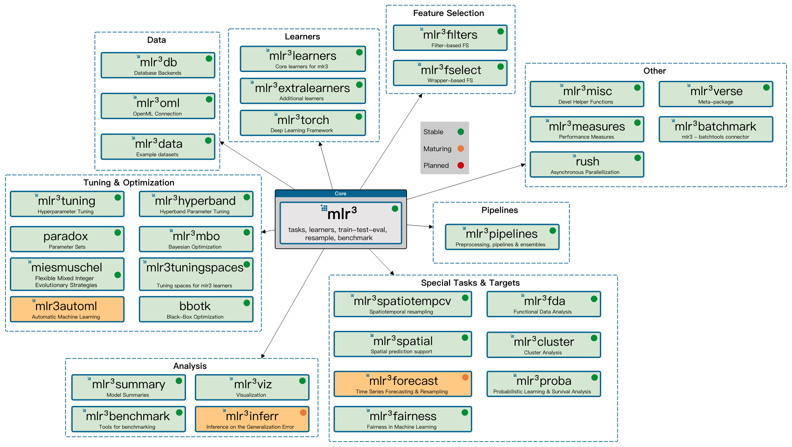

> - Cover Pic by [@抠肉肚脐](https://www.pixiv.net/artworks/126561187)
> [Applied Machine Learning Using mlr3 in R](https://mlr3book.mlr-org.com/)

## 机器学习流程



## 预设字典

### 预设的Task列表

```r
mlr_tasks
```

```css
<DictionaryTask> with 11 stored values
Keys: breast_cancer, california_housing, german_credit, iris, mtcars,
  penguins, pima, sonar, spam, wine, zoo
```

### 预设学习器列表

```r
mlr_learners
```

```css
<DictionaryLearner> with 27 stored values
Keys: classif.cv_glmnet, classif.debug, classif.featureless,
  classif.glmnet, classif.kknn, classif.lda, classif.log_reg,
  classif.multinom, classif.naive_bayes, classif.nnet, classif.qda,
  classif.ranger, classif.rpart, classif.svm, classif.xgboost,
  regr.cv_glmnet, regr.debug, regr.featureless, regr.glmnet, regr.kknn,
  regr.km, regr.lm, regr.nnet, regr.ranger, regr.rpart, regr.svm,
  regr.xgboost
```

### 预设的评估器列表

```r
# 1
mlr_measures
# 2
msr()
```

```css
<DictionaryMeasure> with 62 stored values
Keys: aic, bic, classif.acc, classif.auc, classif.bacc, classif.bbrier,
  classif.ce, classif.costs, classif.dor, classif.fbeta, classif.fdr,
  classif.fn, classif.fnr, classif.fomr, classif.fp, classif.fpr,
  classif.logloss, classif.mauc_au1p, classif.mauc_au1u,
  classif.mauc_aunp, classif.mauc_aunu, classif.mauc_mu,
  classif.mbrier, classif.mcc, classif.npv, classif.ppv, classif.prauc,
  classif.precision, classif.recall, classif.sensitivity,
  classif.specificity, classif.tn, classif.tnr, classif.tp,
  classif.tpr, debug_classif, internal_valid_score, oob_error,
  regr.bias, regr.ktau, regr.mae, regr.mape, regr.maxae, regr.medae,
  regr.medse, regr.mse, regr.msle, regr.pbias, regr.pinball, regr.rmse,
  regr.rmsle, regr.rsq, regr.sae, regr.smape, regr.srho, regr.sse,
  selected_features, sim.jaccard, sim.phi, time_both, time_predict,
  time_train
```

```r
msr() %>% as.data.table()
```

<table class='dataframe'>
<caption>A data.table: 62 x 7</caption>
<thead>
 <tr><th scope=col>key</th><th scope=col>label</th><th scope=col>task_type</th><th scope=col>packages</th><th scope=col>predict_type</th><th scope=col>properties</th><th scope=col>task_properties</th></tr>
 <tr><th scope=col>&lt;chr&gt;</th><th scope=col>&lt;chr&gt;</th><th scope=col>&lt;chr&gt;</th><th scope=col>&lt;list&gt;</th><th scope=col>&lt;chr&gt;</th><th scope=col>&lt;list&gt;</th><th scope=col>&lt;list&gt;</th></tr>
</thead>
<tbody>
 <tr><td>aic                </td><td>Akaike Information Criterion              </td><td>NA     </td><td>mlr3</td><td>NA      </td><td>na_score              , requires_learner      , requires_model        , requires_no_prediction</td><td></td></tr>
 <tr><td>bic                </td><td>Bayesian Information Criterion            </td><td>NA     </td><td>mlr3</td><td>NA      </td><td>na_score              , requires_learner      , requires_model        , requires_no_prediction</td><td></td></tr>
 <tr><td>classif.acc        </td><td>Classification Accuracy                   </td><td>classif</td><td>mlr3        , mlr3measures</td><td>response</td><td>weights</td><td></td></tr>
 <tr><td>classif.auc        </td><td>Area Under the ROC Curve                  </td><td>classif</td><td>mlr3        , mlr3measures</td><td>prob    </td><td></td><td>twoclass</td></tr>
 <tr><td>classif.bacc       </td><td>Balanced Accuracy                         </td><td>classif</td><td>mlr3        , mlr3measures</td><td>response</td><td>weights</td><td></td></tr>
 <tr><td>classif.bbrier     </td><td>Binary Brier Score                        </td><td>classif</td><td>mlr3        , mlr3measures</td><td>prob    </td><td>weights</td><td>twoclass</td></tr>
 <tr><td>classif.ce         </td><td>Classification Error                      </td><td>classif</td><td>mlr3        , mlr3measures</td><td>response</td><td>weights</td><td></td></tr>
 <tr><td>classif.costs      </td><td>Cost-sensitive Classification             </td><td>classif</td><td>mlr3</td><td>response</td><td>weights</td><td></td></tr>
 <tr><td>classif.dor        </td><td>Diagnostic Odds Ratio                     </td><td>classif</td><td>mlr3        , mlr3measures</td><td>response</td><td></td><td>twoclass</td></tr>
 <tr><td>classif.fbeta      </td><td>F-beta score                              </td><td>classif</td><td>mlr3        , mlr3measures</td><td>response</td><td></td><td>twoclass</td></tr>
 <tr><td>classif.fdr        </td><td>False Discovery Rate                      </td><td>classif</td><td>mlr3        , mlr3measures</td><td>response</td><td></td><td>twoclass</td></tr>
 <tr><td>classif.fn         </td><td>False Negatives                           </td><td>classif</td><td>mlr3        , mlr3measures</td><td>response</td><td></td><td>twoclass</td></tr>
 <tr><td>classif.fnr        </td><td>False Negative Rate                       </td><td>classif</td><td>mlr3        , mlr3measures</td><td>response</td><td></td><td>twoclass</td></tr>
 <tr><td>classif.fomr       </td><td>False Omission Rate                       </td><td>classif</td><td>mlr3        , mlr3measures</td><td>response</td><td></td><td>twoclass</td></tr>
 <tr><td>classif.fp         </td><td>False Positives                           </td><td>classif</td><td>mlr3        , mlr3measures</td><td>response</td><td></td><td>twoclass</td></tr>
 <tr><td>classif.fpr        </td><td>False Positive Rate                       </td><td>classif</td><td>mlr3        , mlr3measures</td><td>response</td><td></td><td>twoclass</td></tr>
 <tr><td>classif.logloss    </td><td>Log Loss                                  </td><td>classif</td><td>mlr3        , mlr3measures</td><td>prob    </td><td>weights</td><td></td></tr>
 <tr><td>classif.mauc_au1p  </td><td>Weighted average 1 vs. 1 multiclass AUC   </td><td>classif</td><td>mlr3        , mlr3measures</td><td>prob    </td><td></td><td></td></tr>
 <tr><td>classif.mauc_au1u  </td><td>Average 1 vs. 1 multiclass AUC            </td><td>classif</td><td>mlr3        , mlr3measures</td><td>prob    </td><td></td><td></td></tr>
 <tr><td>classif.mauc_aunp  </td><td>Weighted average 1 vs. rest multiclass AUC</td><td>classif</td><td>mlr3        , mlr3measures</td><td>prob    </td><td></td><td></td></tr>
 <tr><td>classif.mauc_aunu  </td><td>Average 1 vs. rest multiclass AUC         </td><td>classif</td><td>mlr3        , mlr3measures</td><td>prob    </td><td></td><td></td></tr>
 <tr><td>classif.mauc_mu    </td><td>Multiclass mu AUC                         </td><td>classif</td><td>mlr3        , mlr3measures</td><td>prob    </td><td></td><td></td></tr>
 <tr><td>classif.mbrier     </td><td>Multiclass Brier Score                    </td><td>classif</td><td>mlr3        , mlr3measures</td><td>prob    </td><td></td><td></td></tr>
 <tr><td>classif.mcc        </td><td>Matthews Correlation Coefficient          </td><td>classif</td><td>mlr3        , mlr3measures</td><td>response</td><td></td><td></td></tr>
 <tr><td>classif.npv        </td><td>Negative Predictive Value                 </td><td>classif</td><td>mlr3        , mlr3measures</td><td>response</td><td></td><td>twoclass</td></tr>
 <tr><td>classif.ppv        </td><td>Positive Predictive Value                 </td><td>classif</td><td>mlr3        , mlr3measures</td><td>response</td><td></td><td>twoclass</td></tr>
 <tr><td>classif.prauc      </td><td>Precision-Recall Curve                    </td><td>classif</td><td>mlr3        , mlr3measures</td><td>prob    </td><td></td><td>twoclass</td></tr>
 <tr><td>classif.precision  </td><td>Precision                                 </td><td>classif</td><td>mlr3        , mlr3measures</td><td>response</td><td></td><td>twoclass</td></tr>
 <tr><td>classif.recall     </td><td>Recall                                    </td><td>classif</td><td>mlr3        , mlr3measures</td><td>response</td><td></td><td>twoclass</td></tr>
 <tr><td>classif.sensitivity</td><td>Sensitivity                               </td><td>classif</td><td>mlr3        , mlr3measures</td><td>response</td><td></td><td>twoclass</td></tr>
 <tr><td>...</td><td>...</td><td>...</td><td>...</td><td>...</td><td>...</td><td>...</td></tr>
 <tr><td>classif.tnr         </td><td>True Negative Rate                                 </td><td>classif</td><td>mlr3        , mlr3measures</td><td>response </td><td></td><td>twoclass</td></tr>
 <tr><td>classif.tp          </td><td>True Positives                                     </td><td>classif</td><td>mlr3        , mlr3measures</td><td>response </td><td></td><td>twoclass</td></tr>
 <tr><td>classif.tpr         </td><td>True Positive Rate                                 </td><td>classif</td><td>mlr3        , mlr3measures</td><td>response </td><td></td><td>twoclass</td></tr>
 <tr><td>debug_classif       </td><td>Debug Classification Measure                       </td><td>NA     </td><td>mlr3</td><td>response </td><td>na_score</td><td></td></tr>
 <tr><td>internal_valid_score</td><td>Internal Validation Score                          </td><td>NA     </td><td>mlr3</td><td>NA       </td><td>na_score              , requires_learner      , requires_no_prediction</td><td></td></tr>
 <tr><td>oob_error           </td><td>Out-of-bag Error                                   </td><td>NA     </td><td>mlr3</td><td>NA       </td><td>na_score              , requires_learner      , requires_no_prediction</td><td></td></tr>
 <tr><td>regr.bias           </td><td>Bias                                               </td><td>regr   </td><td>mlr3        , mlr3measures</td><td>response </td><td>weights</td><td></td></tr>
 <tr><td>regr.ktau           </td><td>Kendall's tau                                      </td><td>regr   </td><td>mlr3        , mlr3measures</td><td>response </td><td></td><td></td></tr>
 <tr><td>regr.mae            </td><td>Mean Absolute Error                                </td><td>regr   </td><td>mlr3        , mlr3measures</td><td>response </td><td>weights</td><td></td></tr>
 <tr><td>regr.mape           </td><td>Mean Absolute Percent Error                        </td><td>regr   </td><td>mlr3        , mlr3measures</td><td>response </td><td>weights</td><td></td></tr>
 <tr><td>regr.maxae          </td><td>Max Absolute Error                                 </td><td>regr   </td><td>mlr3        , mlr3measures</td><td>response </td><td></td><td></td></tr>
 <tr><td>regr.medae          </td><td>Median Absolute Error                              </td><td>regr   </td><td>mlr3        , mlr3measures</td><td>response </td><td></td><td></td></tr>
 <tr><td>regr.medse          </td><td>Median Squared Error                               </td><td>regr   </td><td>mlr3        , mlr3measures</td><td>response </td><td></td><td></td></tr>
 <tr><td>regr.mse            </td><td>Mean Squared Error                                 </td><td>regr   </td><td>mlr3        , mlr3measures</td><td>response </td><td>weights</td><td></td></tr>
 <tr><td>regr.msle           </td><td>Mean Squared Log Error                             </td><td>regr   </td><td>mlr3        , mlr3measures</td><td>response </td><td>weights</td><td></td></tr>
 <tr><td>regr.pbias          </td><td>Percent Bias                                       </td><td>regr   </td><td>mlr3        , mlr3measures</td><td>response </td><td>weights</td><td></td></tr>
 <tr><td>regr.pinball        </td><td>NA                                                 </td><td>regr   </td><td>mlr3</td><td>quantiles</td><td></td><td></td></tr>
 <tr><td>regr.rmse           </td><td>Root Mean Squared Error                            </td><td>regr   </td><td>mlr3        , mlr3measures</td><td>response </td><td>weights</td><td></td></tr>
 <tr><td>regr.rmsle          </td><td>Root Mean Squared Log Error                        </td><td>regr   </td><td>mlr3        , mlr3measures</td><td>response </td><td>weights</td><td></td></tr>
 <tr><td>regr.rsq            </td><td>NA                                                 </td><td>regr   </td><td>mlr3</td><td>response </td><td>weights</td><td></td></tr>
 <tr><td>regr.sae            </td><td>Sum of Absolute Errors                             </td><td>regr   </td><td>mlr3        , mlr3measures</td><td>response </td><td></td><td></td></tr>
 <tr><td>regr.smape          </td><td>Symmetric Mean Absolute Percent Error              </td><td>regr   </td><td>mlr3        , mlr3measures</td><td>response </td><td></td><td></td></tr>
 <tr><td>regr.srho           </td><td>Spearman's rho                                     </td><td>regr   </td><td>mlr3        , mlr3measures</td><td>response </td><td></td><td></td></tr>
 <tr><td>regr.sse            </td><td>Sum of Squared Errors                              </td><td>regr   </td><td>mlr3        , mlr3measures</td><td>response </td><td></td><td></td></tr>
 <tr><td>selected_features   </td><td>Absolute or Relative Frequency of Selected Features</td><td>NA     </td><td>mlr3</td><td>NA       </td><td>requires_task         , requires_learner      , requires_model        , requires_no_prediction</td><td></td></tr>
 <tr><td>sim.jaccard         </td><td>Jaccard Similarity Index                           </td><td>NA     </td><td>mlr3        , mlr3measures</td><td>NA       </td><td>requires_model        , requires_no_prediction</td><td></td></tr>
 <tr><td>sim.phi             </td><td>Phi Coefficient Similarity                         </td><td>NA     </td><td>mlr3        , mlr3measures</td><td>NA       </td><td>requires_model        , requires_no_prediction</td><td></td></tr>
 <tr><td>time_both           </td><td>Elapsed Time                                       </td><td>NA     </td><td>mlr3</td><td>NA       </td><td>requires_learner      , requires_no_prediction</td><td></td></tr>
 <tr><td>time_predict        </td><td>Elapsed Time                                       </td><td>NA     </td><td>mlr3</td><td>NA       </td><td>requires_learner      , requires_no_prediction</td><td></td></tr>
 <tr><td>time_train          </td><td>Elapsed Time                                       </td><td>NA     </td><td>mlr3</td><td>NA       </td><td>requires_learner      , requires_no_prediction</td><td></td></tr>
</tbody>
</table>

### 调取详情

```r
mlr_tasks$get('california_housing')
mlr_learners$get('classif.xgboost')
mlr_measures$get('regr.mse')
```

```css
-- <TaskRegr> (20640x10): California House Value -------------------------------
* Target: median_house_value
* Properties: -
* Features (9):
  * dbl (8): households, housing_median_age, latitude, longitude,
  median_income, population, total_bedrooms, total_rooms
  * fct (1): ocean_proximity


-- <LearnerClassifXgboost> (classif.xgboost): Extreme Gradient Boosting --------
* Model: -
* Parameters: nrounds=1000, nthread=1, verbose=0
* Validate: <NULL>
* Packages: mlr3, mlr3learners, and xgboost
* Predict Types: [response] and prob
* Feature Types: logical, integer, and numeric
* Encapsulation: none (fallback: -)
* Properties: hotstart_forward, importance, internal_tuning, missings,
multiclass, offset, twoclass, validation, and weights
* Other settings: use_weights = 'use'


-- <MeasureRegrSimple> (regr.mse): Mean Squared Error --------------------------
* Packages: mlr3 and mlr3measures
* Range: [0, Inf]
* Minimize: TRUE
* Average: macro
* Parameters: list()
* Properties: weights
* Predict type: response
* Predict sets: test
* Aggregator: mean()
```

## 回归的流程

### 任务化

#### 创建任务

- `as_task_*()`
 	- target：outcome
 	- id：任务名称
- 这里就用`as_task_regr()`代替下

```r
dt.tskR <- as_task_regr(dt, target = 'outcome')
```

- 对outcome与特征值的图形化概括
 	- 特征值过多不建议，又慢又看不清

```r
library(mlr3viz)
autoplot(dt.tskR, type = 'pairs')
```

#### 数据检索及数据处理

- 可以通过`$`探索任务里的各种信息
- 对于导入的原始数据而言
 	- `dt.tskR$nrow`
 	- `dt.tskR$ncol`
 	- `dt.tskR$feature_names`
 	- `dt.tskR$target_names`
 	- `dt.tskR$row_ids`
 	- `dt.tskR$col_info`
 	- ......
- 有些是函数
 	- `dt.tskR$clone()`
 	- `dt.tskR$data()`
 	- `dt.tskR$cbind()`
 	- `dt.tskR$rbind()`
 	- `dt.tskR$filter()`
 	- `dt.tskR$select()`
 	- `dt.tskR$head()`
 	- ......

- 这两个虽然结果一样，  
  但是第一个是先调取整个data再筛选，  
  第二个则是直接充task里调取第二行

```r
housing.tskR$data()[2]
housing.tskR$data(rows = housing.tskR$row_ids[2])
```

- 函数的用法和平时的类似，只是集成到了Task里面而已

#### 数据处理的实例

- 注意，`dt.tskR$func()`是对`dt.tsk`的就地修改，  
  **不需要保存到新的变量里**

```r
# 克隆一个一模一样的任务
dt.tskR2 <- dt.tskR$clone()
# 选择第1–2行
dt.tskR2$filter(1:2)
```

```r
# 添加列
dt.tskR$cbind( 
  data.frame(x = c(150, 160))
)
# 添加行
dt.tskR_small$rbind( 
  data.frame(x1 = 23, x2 = 5, x3 = 170)
)
dt.tskR_small$data()
```

### 学习器
>
> [mlr-org: Learners](https://mlr-org.com/learners.html)

- 学习器的类型是`Learner`

#### 包的分类

- **mlr3**：仅包含一些基础的学习器
- **mlr3learners**：比`mlr3`包更丰富且常用的学习器
- **mlr3proba**：生存学习器
- **mlr3cluster**：聚类学习器
- **mlr3extralearners**：一些不稳定或者CRAN上不可用的学习器
- **mlr3torch**：神经网络相关学习器

#### 查看学习器

- `lrn()`可以调取对应学习器的信息，并且包含下列数据
 	- `$feature_types`：学习器可以处理的特征类型
 	- `$packages`：使用该学习器需要安装的软件包
 	- `$properties`：学习者的属性；例如，**'missings'** 属性表示模型可以处理缺失数据，而 **'importance'** 表示它可以计算每个特征的相对重要性
 	- `$predict_types`：模型能够做出的预测类型
 	- `$param_set`：可用超参数集

```r
lrn('regr.rpart')
```

```css
-- <LearnerRegrRpart> (regr.rpart): Regression Tree ----------------------------
* Model: -
* Parameters: xval=0
* Packages: mlr3 and rpart
* Predict Types: [response]
* Feature Types: logical, integer, numeric, factor, and ordered
* Encapsulation: none (fallback: -)
* Properties: importance, missings, selected_features, and weights
* Other settings: use_weights = 'use'
```

#### 传递多个学习器

- `lrn()`的复数形`lrns()`可以调取多个学习器
- 其他的类似的还有`tsks()`和后续出现的`msrs()`

```r
dt.lrnR.rpart_lm <- lrns(c('regr.rpart', 'regr.lm'))
dt.lrnR.rpart_lm
```

### 分割训练集和测试集

- `partition()`中`ratio`为训练集占整个数据集比例

```r
dt.tskR.splits <- partition(dt.tsk, ratio = 0.7)
dt.tskR.splits
```

### 训练模型

- `Learner`作用于`Task`

```r
dt.lrnR.rpart <- lrn('regr.rpart')
dt.lrnR.rpart$train(dt.tsk)
```

- 拟合的模型储存在`Learner$model`中

```r
dt.lrnR.rpart$model
```

- 通过指定参数`row_ids`分配训练集

```r
dt.lrnR.rpart$train(dt.tskR, row_ids = dt.tskR.splits$train)
```

- 也可以指定预测类型
 	- `regr.rpart`不能选择response以外的类型
 	- 这里选择用 `regr.lm`来预测标准误差

```r
dt.lrnR.lm <- lrn('regr.lm', predict_type = 'se')
```

- 可以随便看看区别
 	- 在指定了**se**后output里`Predict Types`的框框给到了`[se]`

```r
lrn('regr.lm')
lrn('regr.lm', predict_type = 'se')
```

```css

-- <LearnerRegrLM> (regr.lm): Linear Model -------------------------------------
* Model: -
* Parameters: use_pred_offset=TRUE
* Packages: mlr3, mlr3learners, and stats
* Predict Types: [response] and se
* Feature Types: logical, integer, numeric, character, and factor
* Encapsulation: none (fallback: -)
* Properties: offset and weights
* Other settings: use_weights = 'use'


-- <LearnerRegrLM> (regr.lm): Linear Model -------------------------------------
* Model: -
* Parameters: use_pred_offset=TRUE
* Packages: mlr3, mlr3learners, and stats
* Predict Types: response and [se]
* Feature Types: logical, integer, numeric, character, and factor
* Encapsulation: none (fallback: -)
* Properties: offset and weights
* Other settings: use_weights = 'use'
```

### 预测数据

- 由于`Learner$predict()`会返回一个新的对象，所以需要另外保存

```r
dt.lrnR.rpart.pred <- dt.lrnR.rpart$predict(dt.tskR, row_ids = dt.tskR.splits$test)
```

- 可以简单看看这些对象的类别

```r
dt.tskR %>% class()
dt.lrnR.rpart %>% class()
dt.lrnR.rpart.pred %>% class()
```

```css
'TaskRegr''TaskSupervised''Task''R6'
'LearnerRegrRpart''LearnerRegr''Learner''R6'
'PredictionRegr''Prediction''R6'
```

- `dt.lrnR.rpart.pred`：返回一个预测结果的文本输出
- `dt.lrnR.rpart.pred$truth`：返回真实值向量
- `dt.lrnR.rpart.pred$responese`：返回预测响应值向量

### 对真实值-预测值进行绘图

```r
autoplot(dt.lrnR.rpart.pred)
```

### 超参数

- 训练模型前需要**预先指定的参数**

#### 获取超参数

```r
# 1
dt.lrnR.rpart$param_set
# 2
lrn('regr.rpart')$param_set
```

```css
<ParamSet(10)>
                id    class lower upper nlevels        default  value
            <char>   <char> <num> <num>   <num>         <list> <list>
 1:             cp ParamDbl     0     1     Inf           0.01 [NULL]
 2:     keep_model ParamLgl    NA    NA       2          FALSE [NULL]
 3:     maxcompete ParamInt     0   Inf     Inf              4 [NULL]
 4:       maxdepth ParamInt     1    30      30             30 [NULL]
 5:   maxsurrogate ParamInt     0   Inf     Inf              5 [NULL]
 6:      minbucket ParamInt     1   Inf     Inf <NoDefault[0]> [NULL]
 7:       minsplit ParamInt     1   Inf     Inf             20 [NULL]
 8: surrogatestyle ParamInt     0     1       2              0 [NULL]
 9:   usesurrogate ParamInt     0     2       3              2 [NULL]
10:           xval ParamInt     0   Inf     Inf             10      0
```

- 其中
 	- **id**：超参名
 	- **class**：类别
 	- **lower**：最小可设定值
 	- **upper**：最大可设定值
 	- **nlevels**：可设定值的种类数目
 	- **default**：原函数的默认取值
 	- **value**：当前取值，`[NULL]`时使用`default`的值

- 当`cp`设置为`0.5`后，可以看到output中`cp`的value变成了`0.5`

```r
lrn('regr.rpart', cp = 0.5)$param_set
```

```css
<ParamSet(10)>
                id    class lower upper nlevels        default  value
            <char>   <char> <num> <num>   <num>         <list> <list>
 1:             cp ParamDbl     0     1     Inf           0.01    0.5
 2:     keep_model ParamLgl    NA    NA       2          FALSE [NULL]
 3:     maxcompete ParamInt     0   Inf     Inf              4 [NULL]
 4:       maxdepth ParamInt     1    30      30             30 [NULL]
 5:   maxsurrogate ParamInt     0   Inf     Inf              5 [NULL]
 6:      minbucket ParamInt     1   Inf     Inf <NoDefault[0]> [NULL]
 7:       minsplit ParamInt     1   Inf     Inf             20 [NULL]
 8: surrogatestyle ParamInt     0     1       2              0 [NULL]
 9:   usesurrogate ParamInt     0     2       3              2 [NULL]
10:           xval ParamInt     0   Inf     Inf             10      0
```

- 查看当前模型的超参设定情况

```r
dt.lrnR.rpart$param_set$values
```

- 对查看当前模型的超参设定就地修改

```r
dt.lrnR.rpart$param_set$set_values(cp = 0.02，minsplit = 10)
```

#### 超参依赖关系

- 支持向量机中的超参更加复杂

```r
lrn('regr.svm')$param_set
```

```css
<ParamSet(14)>
Key: <id>
           id    class lower upper nlevels        default parents  value
       <char>   <char> <num> <num>   <num>         <list>  <list> <list>
 1: cachesize ParamDbl  -Inf   Inf     Inf             40  [NULL] [NULL]
 2:     coef0 ParamDbl  -Inf   Inf     Inf              0  kernel [NULL]
 3:      cost ParamDbl     0   Inf     Inf              1    type [NULL]
 4:     cross ParamInt     0   Inf     Inf              0  [NULL] [NULL]
 5:    degree ParamInt     1   Inf     Inf              3  kernel [NULL]
 6:   epsilon ParamDbl     0   Inf     Inf            0.1    type [NULL]
 7:    fitted ParamLgl    NA    NA       2           TRUE  [NULL] [NULL]
 8:     gamma ParamDbl     0   Inf     Inf <NoDefault[0]>  kernel [NULL]
 9:    kernel ParamFct    NA    NA       4         radial  [NULL] [NULL]
10:        nu ParamDbl  -Inf   Inf     Inf            0.5    type [NULL]
11:     scale ParamUty    NA    NA     Inf           TRUE  [NULL] [NULL]
12: shrinking ParamLgl    NA    NA       2           TRUE  [NULL] [NULL]
13: tolerance ParamDbl     0   Inf     Inf          0.001  [NULL] [NULL]
14:      type ParamFct    NA    NA       2 eps-regression  [NULL] [NULL]
```

- 可以从`Learner$param_set$deps`中获得超参之间的依赖关系总结

```r
lrn('regr.svm')$param_set$deps
```

<table class='dataframe'>
<caption>A data.table: 6 x 3</caption>
<thead>
 <tr><th scope=col>id</th><th scope=col>on</th><th scope=col>cond</th></tr>
 <tr><th scope=col>&lt;chr&gt;</th><th scope=col>&lt;chr&gt;</th><th scope=col>&lt;list&gt;</th></tr>
</thead>
<tbody>
 <tr><td>coef0  </td><td>kernel</td><td>polynomial    , sigmoid       , %s %%in%% {%s}</td></tr>
 <tr><td>cost   </td><td>type  </td><td>eps-regression, nu-regression , %s %%in%% {%s}</td></tr>
 <tr><td>degree </td><td>kernel</td><td>polynomial, %s == %s  </td></tr>
 <tr><td>epsilon</td><td>type  </td><td>eps-regression, %s == %s      </td></tr>
 <tr><td>gamma  </td><td>kernel</td><td>polynomial    , radial        , sigmoid       , %s %%in%% {%s}</td></tr>
 <tr><td>nu     </td><td>type  </td><td>nu-regression, %s == %s     </td></tr>
</tbody>
</table>

- 查看一下设置的条件

```r
for (i in 1:6){
 print(lrn('regr.svm')$param_set$deps[[i, 'cond']])
}
```

```css
CondAnyOf: x %in% {polynomial, sigmoid}
CondAnyOf: x %in% {eps-regression, nu-regression}
CondEqual: x == polynomial
CondEqual: x == eps-regression
CondAnyOf: x %in% {polynomial, radial, sigmoid}
CondEqual: x == nu-regression
```

- 输出中`x`是`on`的指代，  
  当被依赖的超参`on`的设置满足某条件时，  
  `id`中的超参才能被设置
- 如果`on`超参不满足条件，设置`id`超参会报错

#### 基准学习器

- `regr.featureless`
 	- 它总是将新值预测为训练数据中目标的均值
 	- 如果 `robust` 超参数设置为 `TRUE`，则为中位数
- 用于
 	- 模型比较
 	- 备用学习器

```r
lrn('regr.featureless')
```

### 模型评估

- `msr()`用于单个评估器的评估
- `msrs()`可以输入使用多个评估器名称的向量

```r
# 1
msrR.mse_mae <- msrs(c('regr.mse', 'regr.mae'))
housing.lrnR.rpart.pred$score(msrR.mse_mae)
# 2
housing.lrnR.rpart.pred$score(msrs(c('regr.mse', 'regr.mae')))
```

- `mlr3`还有一些其他非质量评价的评估指标
 	- `msr('time_train')`：训练模型所花费的时间
 	- `msr('time_predict')`：模型进行预测所需的时间
 	- `msr('time_both')`：训练模型然后进行预测所花费的总时间
 	- `msr('selected_features')`：  
   模型选择的特征数量，仅当模型具有`selected_features`属性时才可使用

- `Measure$properties`提供了评估器的属性

```r
msr('regr.mse')$properties
msr('time_train')$properties
```

```css
'weights'
'requires_learner''requires_no_prediction'
```

- 评估器的超参
 	- 可以注意到`time_train`的`Parameters`是`list()`，  
   这代表是空的
 	- `selected_features`的`Parameters`有`normalize=FALSE`，  
   说明可以提前设置

```r
msr('time_train')
msr('selected_features')
```

```css
-- <MeasureElapsedTime> (time_train): Elapsed Time -----------------------------
* Packages: mlr3
* Range: [0, Inf]
* Minimize: TRUE
* Average: macro
* Parameters: list()
* Properties: requires_learner and requires_no_prediction
* Predict type: NA
* Predict sets:
* Aggregator: mean()


-- <MeasureSelectedFeatures> (selected_features): Absolute or Relative Frequency
* Packages: mlr3
* Range: [0, Inf]
* Minimize: TRUE
* Average: macro
* Parameters: normalize=FALSE
* Properties: requires_task, requires_learner, requires_model, and
requires_no_prediction
* Predict type: NA
* Predict sets:
* Aggregator: mean()
```

- 访问评估器的超参也是用`$param_set`

```r
msr.sf <- msr('selected_features')
msr.sf$param_set
```

```css
<ParamSet(1)>
          id    class lower upper nlevels        default  value
      <char>   <char> <num> <num>   <num>         <list> <list>
1: normalize ParamLgl    NA    NA       2 <NoDefault[0]>  FALSE
```

- 修改

```r
# 1
msr.sf$param_set$set_values(normalize = TRUE)
# 2
msr.sf$param_set$normalize <- TRUE
```

## 分类的流程

- 与回归的流程相同，  
  只是基础对象分别继承自 `TaskClassif`、`LearnerClassif` 和 `MeasureClassif`
- 分类有**二元分类**和**多元分类**两种

### 任务化

- 这里就直接调取预设的任务进行练习

```r
mlr_tasks %>% as.data.table()
```

<table class='dataframe'>
<caption>A data.table: 11 x 14</caption>
<thead>
 <tr><th scope=col>key</th><th scope=col>label</th><th scope=col>task_type</th><th scope=col>nrow</th><th scope=col>ncol</th><th scope=col>properties</th><th scope=col>lgl</th><th scope=col>int</th><th scope=col>dbl</th><th scope=col>chr</th><th scope=col>fct</th><th scope=col>ord</th><th scope=col>pxc</th><th scope=col>dte</th></tr>
 <tr><th scope=col>&lt;chr&gt;</th><th scope=col>&lt;chr&gt;</th><th scope=col>&lt;chr&gt;</th><th scope=col>&lt;int&gt;</th><th scope=col>&lt;int&gt;</th><th scope=col>&lt;list&gt;</th><th scope=col>&lt;int&gt;</th><th scope=col>&lt;int&gt;</th><th scope=col>&lt;int&gt;</th><th scope=col>&lt;int&gt;</th><th scope=col>&lt;int&gt;</th><th scope=col>&lt;int&gt;</th><th scope=col>&lt;int&gt;</th><th scope=col>&lt;int&gt;</th></tr>
</thead>
<tbody>
 <tr><td>breast_cancer     </td><td>Wisconsin Breast Cancer</td><td>classif</td><td>  683</td><td>10</td><td>twoclass</td><td> 0</td><td>0</td><td> 0</td><td>0</td><td> 0</td><td>9</td><td>0</td><td>0</td></tr>
 <tr><td>california_housing</td><td>California House Value </td><td>regr   </td><td>20640</td><td>10</td><td></td><td> 0</td><td>0</td><td> 8</td><td>0</td><td> 1</td><td>0</td><td>0</td><td>0</td></tr>
 <tr><td>german_credit     </td><td>German Credit          </td><td>classif</td><td> 1000</td><td>21</td><td>twoclass</td><td> 0</td><td>3</td><td> 0</td><td>0</td><td>14</td><td>3</td><td>0</td><td>0</td></tr>
 <tr><td>iris              </td><td>Iris Flowers           </td><td>classif</td><td>  150</td><td> 5</td><td>multiclass</td><td> 0</td><td>0</td><td> 4</td><td>0</td><td> 0</td><td>0</td><td>0</td><td>0</td></tr>
 <tr><td>mtcars            </td><td>Motor Trends           </td><td>regr   </td><td>   32</td><td>11</td><td></td><td> 0</td><td>0</td><td>10</td><td>0</td><td> 0</td><td>0</td><td>0</td><td>0</td></tr>
 <tr><td>penguins          </td><td>Palmer Penguins        </td><td>classif</td><td>  344</td><td> 8</td><td>multiclass</td><td> 0</td><td>3</td><td> 2</td><td>0</td><td> 2</td><td>0</td><td>0</td><td>0</td></tr>
 <tr><td>pima              </td><td>Pima Indian Diabetes   </td><td>classif</td><td>  768</td><td> 9</td><td>twoclass</td><td> 0</td><td>0</td><td> 8</td><td>0</td><td> 0</td><td>0</td><td>0</td><td>0</td></tr>
 <tr><td>sonar             </td><td>Sonar: Mines vs. Rocks </td><td>classif</td><td>  208</td><td>61</td><td>twoclass</td><td> 0</td><td>0</td><td>60</td><td>0</td><td> 0</td><td>0</td><td>0</td><td>0</td></tr>
 <tr><td>spam              </td><td>HP Spam Detection      </td><td>classif</td><td> 4601</td><td>58</td><td>twoclass</td><td> 0</td><td>0</td><td>57</td><td>0</td><td> 0</td><td>0</td><td>0</td><td>0</td></tr>
 <tr><td>wine              </td><td>Wine Regions           </td><td>classif</td><td>  178</td><td>14</td><td>multiclass</td><td> 0</td><td>2</td><td>11</td><td>0</td><td> 0</td><td>0</td><td>0</td><td>0</td></tr>
 <tr><td>zoo               </td><td>Zoo Animals            </td><td>classif</td><td>  101</td><td>17</td><td>multiclass</td><td>15</td><td>1</td><td> 0</td><td>0</td><td> 0</td><td>0</td><td>0</td><td>0</td></tr>
</tbody>
</table>

- 分别用`german_credit`和`penguins`作为二元分类和多元分类的例子

```R
gc.tskC <- tsk('german_credit')
peng.tskC <- tsk('penguins')

gc.tskC
peng.tskC
```

```css
-- <TaskClassif> (1000x21): German Credit --------------------------------------
* Target: credit_risk
* Target classes: good (positive class, 70%), bad (30%)
* Properties: twoclass
* Features (20):
  * fct (14): credit_history, employment_duration, foreign_worker, housing,
  job, other_debtors, other_installment_plans, people_liable,
  personal_status_sex, property, purpose, savings, status, telephone
  * int (3): age, amount, duration
  * ord (3): installment_rate, number_credits, present_residence


-- <TaskClassif> (344x8): Palmer Penguins --------------------------------------
* Target: species
* Target classes: Adelie (44%), Gentoo (36%), Chinstrap (20%)
* Properties: multiclass
* Features (7):
  * int (3): body_mass, flipper_length, year
  * dbl (2): bill_depth, bill_length
  * fct (2): island, sex
```

### 二元分类

#### Outcome的分类

```r
gc.tskC$class_names
gc.tskC$properties
```

```css
'good''bad'
'twoclass'
```

#### 定义正类

```r
gc.tskC$positive <- 'good'
```

- 如果不设置，默认第一个级别是正类

#### 对真实值-预测值进行绘图

```r
autoplot(gc.tskC, type = 'duo') +
  theme(strip.text.y = element_text(angle = -45, size = 8))
```

#### 预测结果

- `predict_type`可以选择预测响应类别`'response'`或者概率`'prob'`
 	- 选择概率也会给出`response`的结果
 	- 所以对于分类问题，用概率会更好

```r
lrn('classif.rpart') # 'response'是默认
lrn('classif.rpart', predict_type = 'prob')
```

```r
# gc.tskC.splits <- partition(gc.tskC,ratio = 0.7) # 事先设定好

gc.lrnC.rpart <- lrn('classif.rpart', predict_type = 'response')
gc.lrnC.rpart$train(gc.tskC, gc.tskC.splits$train)
gc.lrnC.rpart.pred <- gc.lrnC.rpart$predict(gc.tskC, gc.tskC.splits$test)
gc.lrnC.rpart.pred
```

```css
-- <PredictionClassif> for 300 observations: -----------------------------------
 row_ids truth response
       6  good     good
       8  good      bad
      10   bad      bad
     ---   ---      ---
     992  good     good
     995  good     good
    1000  good      bad
```

```r
# gc.tskC.splits <- partition(gc.tskC,ratio = 0.7) # 事先设定好

gc.lrnC.rpart <- lrn('classif.rpart', predict_type = 'prob')
gc.lrnC.rpart$train(gc.tskC, gc.tskC.splits$train)
gc.lrnC.rpart.pred <- gc.lrnC.rpart$predict(gc.tskC, gc.tskC.splits$test)
gc.lrnC.rpart.pred
```

```css
-- <PredictionClassif> for 300 observations: -----------------------------------
 row_ids truth response  prob.good  prob.bad
       6  good     good 0.85667752 0.1433225
       8  good      bad 0.21739130 0.7826087
      10   bad      bad 0.29411765 0.7058824
     ---   ---      ---        ---       ---
     992  good     good 0.85667752 0.1433225
     995  good     good 0.85667752 0.1433225
    1000  good      bad 0.07692308 0.9230769
```

#### 模型评估

- 不同种类的评估器对于`response`和`prob`的适用性是不同的，  
  需要找到合适的评估器

- 寻找支持分类并用于评估概率的评估器

```r
as.data.table(msr())[
    task_type == 'classif' & predict_type == 'prob']
```

<table class='dataframe'>
<caption>A data.table: 7 x 7</caption>
<thead>
 <tr><th scope=col>key</th><th scope=col>label</th><th scope=col>task_type</th><th scope=col>packages</th><th scope=col>predict_type</th><th scope=col>properties</th><th scope=col>task_properties</th></tr>
 <tr><th scope=col>&lt;chr&gt;</th><th scope=col>&lt;chr&gt;</th><th scope=col>&lt;chr&gt;</th><th scope=col>&lt;list&gt;</th><th scope=col>&lt;chr&gt;</th><th scope=col>&lt;list&gt;</th><th scope=col>&lt;list&gt;</th></tr>
</thead>
<tbody>
 <tr><td>classif.logloss  </td><td>Log Loss                                  </td><td>classif</td><td>mlr3        , mlr3measures</td><td>prob</td><td>weights</td><td></td></tr>
 <tr><td>classif.mauc_au1p</td><td>Weighted average 1 vs. 1 multiclass AUC   </td><td>classif</td><td>mlr3        , mlr3measures</td><td>prob</td><td></td><td></td></tr>
 <tr><td>classif.mauc_au1u</td><td>Average 1 vs. 1 multiclass AUC            </td><td>classif</td><td>mlr3        , mlr3measures</td><td>prob</td><td></td><td></td></tr>
 <tr><td>classif.mauc_aunp</td><td>Weighted average 1 vs. rest multiclass AUC</td><td>classif</td><td>mlr3        , mlr3measures</td><td>prob</td><td></td><td></td></tr>
 <tr><td>classif.mauc_aunu</td><td>Average 1 vs. rest multiclass AUC         </td><td>classif</td><td>mlr3        , mlr3measures</td><td>prob</td><td></td><td></td></tr>
 <tr><td>classif.mauc_mu  </td><td>Multiclass mu AUC                         </td><td>classif</td><td>mlr3        , mlr3measures</td><td>prob</td><td></td><td></td></tr>
 <tr><td>classif.mbrier   </td><td>Multiclass Brier Score                    </td><td>classif</td><td>mlr3        , mlr3measures</td><td>prob</td><td></td><td></td></tr>
</tbody>
</table>

- 这里使用了3种评估器
 	- `classif.mbrier`：用预测概率与真实值之间的平方差评估`prob`的预测结果
 	- `classif.logloss`：用真实类别的预测概率的负对数评估`prob`的预测结果
 	- `classif.acc`：评估`response`的预测分类结果

```R
gc.lrnC.rpart.pred$score(msrs(c('classif.mbrier', 'classif.logloss', 'classif.acc')))
```

#### 混淆矩阵

- `Prediction$confution`查看混淆矩阵

```r
gc.lrnC.rpart.pred$confusion
```

```css
        truth
response good bad
    good  177  45
    bad    41  37
```

- 通过`autoplot(Prediction)`可视化混淆矩阵

```R
autoplot(gc.lrnC.rpart.pred)
```

#### 阈值设定

- `Prediction$set_threshold()`设定阈值
 	- 阈值是**判断为正类**的阈值，因此需要正确设置正类

```r
gc.lrnC.rpart.pred$set_threshold(YourThreshold)
```

### 多元分类

#### Outcome的分类

```r
peng.tskC$class_names
peng.tskC$properties
```

```css
'Adelie''Chinstrap''Gentoo'
'multiclass'
```

#### 没有定义正类

- 定义了反而会报错的

```r
peng.tskC$positive <- 'Adelie'
```

```css
Error in (function (rhs) : Setting the positive class is only feasible for binary classification
```

#### 对真实值-预测值进行绘图

```r
autoplot(peng.tskC, type = 'duo') +
  theme(strip.text.y = element_text(angle = -45, size = 8))
```

#### 预测结果

```r
# peng.tskC.splits <- partition(peng.tskC,ratio = 0.7) # 事先设定好

peng.lrnC.rpart <- lrn('classif.rpart', predict_type = 'response')
peng.lrnC.rpart$train(peng.tskC, peng.tskC.splits$train)
peng.lrnC.rpart.pred <- peng.lrnC.rpart$predict(peng.tskC, peng.lrnC.splits$test)
peng.lrnC.rpart.pred
```

```css
-- <PredictionClassif> for 103 observations: -----------------------------------
 row_ids     truth  response
      11    Adelie    Adelie
      13    Adelie    Adelie
      14    Adelie    Adelie
     ---       ---       ---
     326 Chinstrap Chinstrap
     331 Chinstrap    Adelie
     338 Chinstrap Chinstrap
```

```r
# peng.tskC.splits <- partition(peng.tskC,ratio = 0.7) # 事先设定好

peng.lrnC.rpart <- lrn('classif.rpart', predict_type = 'prob')
peng.lrnC.rpart$train(peng.tskC, peng.tskC.splits$train)
peng.lrnC.rpart.pred <- peng.lrnC.rpart$predict(peng.tskC, peng.lrnC.splits$test)
peng.lrnC.rpart.pred
```

```css
-- <PredictionClassif> for 103 observations: -----------------------------------
 row_ids     truth  response prob.Adelie prob.Chinstrap prob.Gentoo
      11    Adelie    Adelie   0.9537037     0.01851852  0.02777778
      13    Adelie    Adelie   0.9537037     0.01851852  0.02777778
      14    Adelie    Adelie   0.9537037     0.01851852  0.02777778
     ---       ---       ---         ---            ---         ---
     326 Chinstrap Chinstrap   0.0000000     1.00000000  0.00000000
     331 Chinstrap    Adelie   0.9537037     0.01851852  0.02777778
     338 Chinstrap Chinstrap   0.0000000     1.00000000  0.00000000
```

#### 模型评估

- 寻找支持多元分类并用于评估概率的评估器

```r
as.data.table(msr())[
    task_type == 'classif' & predict_type == 'prob' &
    !sapply(task_properties, function(x) 'twoclass' %in% x)]
```

```r
peng.lrnC.rpart.pred$score(msrs(c('classif.mbrier', 'classif.logloss', 'classif.acc')))
```

#### 混淆矩阵

- `Prediction$confution`查看混淆矩阵

```r
gc.lrnC.rpart.pred$confusion
```

```css
        truth
response good bad
    good  177  45
    bad    41  37
```

- 通过`autoplot(Prediction)`可视化混淆矩阵

```R
autoplot(gc.lrnC.rpart.pred)
```

#### 阈值设定

- `Prediction$set_threshold()`设定阈值
 	- 与二元分类不同的是，多元分类需要**给每一个分类**单独设置一个阈值

- 在多分类问题中阈值化的工作原理
 	- 首先为 `n` 个类别中的每个类别分配一个阈值，  
   将每个类别的预测概率除以这些阈值，  
   以返回 `n` 个比率，然后选择比率最高的类别  
   （这里的阈值其实就是权重了，阈值越小，权重越高）

- 通过传递一个命名向量进行更改

```r
# 随便设置
peng.lrnC.rpart.pred$set_threshold(c(
 'Adelie' = 0.8,
 'Chinstrap' = 0.5,
 'Gentoo' = 0.2
))
```

- 逆加权设定阈值
 	- 将新阈值设置为训练集中每个类别的比例
 	- 在选择比率最高的标签之前，用预测概率除以这些类别比例

```r
# 逆加权法设置
peng.lrnC.rpart.pred$set_threshold(
 peng.tskC$truth(peng.tskC.splits$train) %>% 
  table() %>% 
  proportions()
)
```

## 定义数据role

- `Task$col_roles`能显示所有的role

```r
peng.tskC$col_roles
```

```css
$feature
'bill_depth''bill_length''flipper_length''island''sex''year''body_mass'
$target
'species'
$name
$order
$stratum
$group
$offset
$weights_learner
$weights_measure
```

- 通过`Task$set_col_roles('col', roles = 'role')`来重新定义

```r
set_col_roles('body_mass', roles = 'feature')
```

## 评估与基准测试

### 留出法与评分

- 留出法就是`partition()`的简单划分方法
- 评估`Prediction$score`是用来估计最终模型的**泛化能力**


### 重采样


