> - Cover Pic by [@晕欧欧](https://www.pixiv.net/artworks/132528204)  

> [Applied Machine Learning Using mlr3 in R](https://mlr3book.mlr-org.com/)

## 基本调优方法

### 调优的整体流程

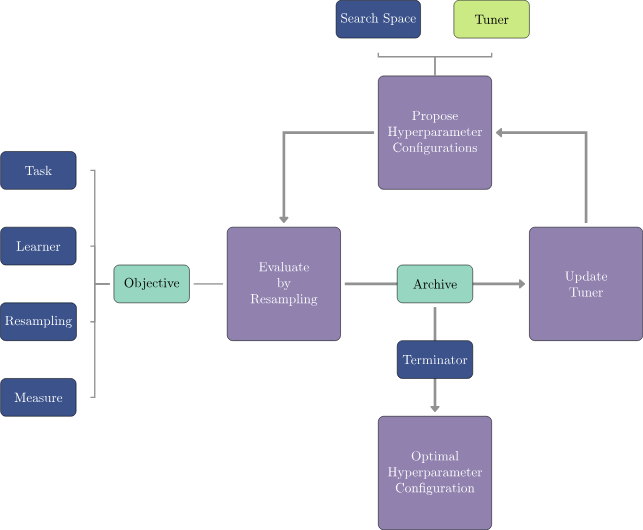

### 模型调优（Model Tuning）

- **搜索空间（search space）/调优空间（tuning space）**
  - 可供调整的超参数集合
- **不可调超参数**
  - 少数模型的训练函数提供了和训练模型不相干的超参数
  - 例如`lrn('classif.ranger')` 中的 `verbose` 控制训练期间向用户显示多少信息

- 对于数值型的超参数，需要指定调整的范围
- 使用`to_tune()`来构建调整范围的下限与上限

```r
learner <- lrn('classif.svm',
  type  = 'C-classification',
  kernel = 'radial',
  cost  = to_tune(1e-1, 1e5),
  gamma = to_tune(1e-1, 1)
)
learner
```

- 如果对用`to_tune()`标记了超参数的学习器调用`Learner$train()`的话会抛出错误

### 终止器（Terminator）

- ~~终结者~~
- `mlr_terminators`存储了所有终止器的种类，  
  使用 `trm()` 创建终止器

| Terminator <br>终止器             | Function call and default parameters <br>函数调用和默认参数 |
| ------------------------------ | -------------------------------------------------- |
| Clock Time <br>时钟时间            | `trm('clock_time')`                                |
| Combo <br>组合                   | `trm('combo', any = TRUE)`                         |
| None <br>无                     | `trm('none')`                                      |
| Number of Evaluations <br>评估次数 | `trm('evals', n_evals = 100, k = 0)`               |
| Performance Level <br>性能水平     | `trm('perf_reached', level = 0.1)`                 |
| Run Time <br>运行时间              | `trm('run_time', secs = 30)`                       |
| Stagnation <br>停滞              | `trm('stagnation', iters = 10, threshold = 0)`     |

```r
mlr_terminators %>% as.data.table()
```

<table class='dataframe'>
<caption>A data.table: 9 x 4</caption>
<thead>
 <tr><th scope=col>key</th><th scope=col>label</th><th scope=col>properties</th><th scope=col>unit</th></tr>
 <tr><th scope=col>&lt;chr&gt;</th><th scope=col>&lt;chr&gt;</th><th scope=col>&lt;list&gt;</th><th scope=col>&lt;chr&gt;</th></tr>
</thead>
<tbody>
 <tr><td>clock_time            </td><td>Clock Time            </td><td>single-crit, multi-crit </td><td>seconds    </td></tr>
 <tr><td>combo                 </td><td>Combination           </td><td>single-crit, multi-crit </td><td>percent    </td></tr>
 <tr><td>evals                 </td><td>Number of Evaluation  </td><td>single-crit, multi-crit </td><td>evaluations</td></tr>
 <tr><td>none                  </td><td>None                  </td><td>single-crit, multi-crit </td><td>percent    </td></tr>
 <tr><td>perf_reached          </td><td>Performance Level     </td><td>single-crit</td><td>percent    </td></tr>
 <tr><td>run_time              </td><td>Run Time              </td><td>single-crit, multi-crit </td><td>seconds    </td></tr>
 <tr><td>stagnation            </td><td>Stagnation            </td><td>single-crit</td><td>percent    </td></tr>
 <tr><td>stagnation_batch      </td><td>Stagnation Batch      </td><td>single-crit</td><td>percent    </td></tr>
 <tr><td>stagnation_hypervolume</td><td>Stagnation Hypervolume</td><td>multi-crit</td><td>percent    </td></tr>
</tbody>
</table>

- 最常用的终止条件是在特定时间（`trm('run_time'`），  
  或给定评估次数（`trm('evals')`）后停止调优
  - 选择运行时间通常基于实际考虑和直觉
    - 在计算集群上，使用时间限制可能很重要，  
    因为可能需要为计算任务指定最长运行时间
  - `trm('perf_reached')`在达到指定性能水平时停止调优
    - 如果某个性能水平被认为足以满足模型的实际应用，这会很有帮助
    - 但是，如果设置得过于乐观，调优可能永远不会终止
- `trm('stagnation')`在设定数量的`iterations`中没有取得大于`threshold`的进展时停止
  - 对于复杂的搜索空间，阈值可能很难选择
  - 因为尽管仍有（可能很大的）改进空间，但优化可能会过早停止
- `trm('none')`用于自行控制终止的调谐器，因此此终止条件不起作用
- 这些终止条件中的任何一个都可以通过使用`trm('combo')`自由组合，  
  可用于指定超参数优化在任何终止条件触发时完成（`any = TRUE`），  
  或者在所有终止条件触发时完成（`any = FALSE`）

### 使用`ti()`进行实例调优（Tuning Instance）

- 这里用`ti()`创建了一个单目标调优的`TuningInstanceBatchSingleCrit`对象
- 所谓的实例，就是将`Task`，`Learner`，`Resampling`，`Measure`，和`Terminator`这些要素打包在一起，提供给`Tuner`进行调优
- 调优的结果也会储存在`Instance`里面

```r
# 调取预设任务`'sonar'`
tsk_sonar <-  tsk('sonar')
# 构建学习器
learner <-  lrn('classif.svm',
 # 指定调优的超参数`cose`和`gamma`
 cost  = to_tune(1e-1, 1e5),
 gamma = to_tune(1e-1, 1),
 # 设置其他的超参数
 kernel = 'radial',
 type = 'C-classification'
)
# 进行实例调优
instance <-  ti(
 task = tsk_sonar,
 learner = learner,
 resampling = rsmp('cv', folds = 3),
 # 这里只有一个`Measure`，所以是单目标调优
 # 如果这里是`msrs(c('msr1','msr2'))`，那么就是多目标调优
 measures = msr('classif.ce'),
 # 遍历整个网格，不过早停止，因此不设定终止器
 terminator = trm('none')
)
# 查看实例
instance
```

```js
<TuningInstanceBatchSingleCrit>
* State:  Not optimized
* Objective: <ObjectiveTuningBatch:classif.svm_on_sonar>
* Search Space:
       id    class lower upper nlevels
   <char>   <char> <num> <num>   <num>
1:   cost ParamDbl   0.1 1e+05     Inf
2:  gamma ParamDbl   0.1 1e+00     Inf
* Terminator: <TerminatorNone>
```

- 其实这里`<TuningInstanceBatchSingleCrit>`已经看得出是单目标调优对象了
- 可以随便看看`instance`的类

```r
instance %>% class()
```

```js
'TuningInstanceBatchSingleCrit''OptimInstanceBatchSingleCrit''OptimInstanceBatch''OptimInstance''R6'
```

### 调优器（Tuner）

#### 调优器种类

- 下表给出了可用的`Tuner`

| Tuner <br>调谐器                                | Function call <br>函数调用 | Package <br>包   |
| -------------------------------------------- | ---------------------- | --------------- |
| Random Search <br>随机搜索                       | `tnr('random_search')` | `mlr3tuning`    |
| Grid Search <br>网格搜索                         | `tnr('grid_search')`   | `mlr3tuning`    |
| Bayesian Optimization <br>贝叶斯优化              | `tnr('mbo')`           | `mlr3mbo`       |
| CMA-ES <br>协方差矩阵自适应进化策略                      | `tnr('cmaes')`         | `adagio`        |
| Iterated Racing <br>迭代竞赛                     | `tnr('irace')`         | `irace`         |
| Hyperband <br>超参数优化算法                        | `tnr('hyperband')`     | `mlr3hyperband` |
| Generalized Simulated Annealing <br>广义模拟退火算法 | `tnr('gensa')`         | `GenSA`         |
| Nonlinear Optimization <br>非线性优化             | `tnr('nloptr')`        | `nloptr`        |

- 使用`tnr()`来调用调优器

```r
tnr('grid_search')
```

```js
<TunerBatchGridSearch>: Grid Search
* Parameters: batch_size=1, resolution=10
* Parameter classes: ParamLgl, ParamInt, ParamDbl, ParamFct
* Properties: dependencies, single-crit, multi-crit
* Packages: mlr3tuning, bbotk
```

#### 调优策略

- **搜索策略（Search strategies）**
  - 网格搜索和随机搜索是最基本的算法，在初始实验中通常首先被选用
  - **网格搜索**
    - 思路是详尽地评估给定超参数值的每一种可能组合
    - 分类超参数通常会在其所有可能取值上进行评估
    - 数值型和整型超参数值会根据给定的分辨率  
    （即每个超参数要尝试的不同值的数量），  
    在其边界约束（上限和下限）内等距分布
  - **随机搜索**
    - 从预先指定的分布（通常是均匀分布）中为每个超参数独立地随机选择值
  - 这两种方法都不具备适应性，  
   也就是说每次提出的配置都忽略了先前配置的性能
  - 由于其简单性，  
   网格搜索和随机搜索都可以处理混合搜索空间
   （即超参数可以是数值型、整型或分类型）以及分层搜索空间

- **自适应算法（Adaptive Algorithms）**
  - 自适应算法从**先前评估**的配置中学习，以快速找到良好的配置
  - **贝叶斯优化（Bayesian Optimization）**
    - 使用**代理模型**来近似待优化的未知函数
      - 在超参数优化中，这将是从超参数配置到估计的泛化性能的映射
    - 如果选择了合适的代理模型，例如随机森林，  
    贝叶斯优化可以相当灵活，甚至可以处理混合和分层搜索空间
  - **协方差矩阵自适应进化策略**  
   **（Covariance Matrix Adaptation Evolution Strategy）**
    - 在候选点上维持一个概率分布，该分布由一个均值向量和协方差矩阵表示  
    通过从这个分布中采样生成一组新的候选点，每个候选点被选中的概率与其性能成正比
    - 协方差矩阵会随着时间进行调整，以反映性能态势
    - 通过`miesmuschel`包，在mlr3中还可使用更多进化策略
  - **迭代竞赛算法（Iterated Racing）**
    - 迭代舍弃那些经统计检验显示性能不佳的配置
    - 首先从参数化密度中随机采样的初始配置群体中进行 “竞赛”，  
    然后利用竞赛中幸存的配置来随机更新后续竞赛的密度，  
    以便聚焦于搜索空间中有前景的区域，  
    依此类推
  - **超带算法（Hyperband）/ 多保真度超参数优化（Multi-fidelity HPO）**
    - 一种自适应方法，  
    利用计算成本较低的低保真度评估的预测能力  
    （即质量较差的预测例如那些由训练轮数较少的神经网络产生的预测）  
    来提高整体优化效率

#### 策略选择

- **搜索策略**
  - 如果搜索空间**较小**或结构**不复杂**，  
   网格搜索或许能够在合理时间内详尽评估整个搜索空间
  - 由于高纬度的搜索空间导致的的**维度灾难**以及对数值**搜索空间的覆盖不足**，  
   通常**不推荐使用网格搜索**
    - 此时，**随机搜索**往往是更好的选择，  
    因为可以考虑更多独特值
- **更优的算法**
  - 适用于高维度或结构更复杂的搜索空间
  - **进化策略和贝叶斯优化**间的选择
    - 根据函数评估的成本进行选择
    - **进化策略（evolutionary strategies）**
      - 超参数配置能够快速评估时
    - **贝叶斯优化（Bayesian optimization）**
      - 模型评估耗时且优化预算有限时
    - 通常推荐在超参数优化中使用**贝叶斯优化**
      - 虽然贝叶斯优化的优化成本相对较大  
     （例如，在每次迭代中，都要训练代理模型并优化采集函数），  
     但在诸如机器学习模型重采样等函数评估成本相对较高的情况下，  
     这种影响较小
  - 在超参数优化问题涉及有意义的**保真度参数**（例如，轮数、树的数量、提升轮数）  
   且需要**高效使用优化预算**的情况下，  
   像Hyperband这样的多保真度超参数优化算法可能值得考虑

#### 调优器处理的类型

- `Learner$param_classes`
  - 提供可以处理哪些类别的超参数
- `Learner$param_classes`
  - 提供可以处理哪些特性

```r
tnr('grid_search')$param_classes
tnr('grid_search')$properties
```

```js
'ParamLgl''ParamInt''ParamDbl''ParamFct'
'dependencies''single-crit''multi-crit'
```

- （重新回顾一下如何去看超参数类型）
  - 这里的`class`就是了

```r
lrn('classif.svm')$param_set
```

```js
<ParamSet(16)>
Key: <id>
                 id    class lower upper nlevels          default parents
             <char>   <char> <num> <num>   <num>           <list>  <list>
 1:       cachesize ParamDbl  -Inf   Inf     Inf               40  [NULL]
 2:   class.weights ParamUty    NA    NA     Inf           [NULL]  [NULL]
 3:           coef0 ParamDbl  -Inf   Inf     Inf                0  kernel
 4:            cost ParamDbl     0   Inf     Inf                1    type
 5:           cross ParamInt     0   Inf     Inf                0  [NULL]
 6: decision.values ParamLgl    NA    NA       2            FALSE  [NULL]
 7:          degree ParamInt     1   Inf     Inf                3  kernel
 8:         epsilon ParamDbl     0   Inf     Inf              0.1  [NULL]
 9:          fitted ParamLgl    NA    NA       2             TRUE  [NULL]
10:           gamma ParamDbl     0   Inf     Inf   <NoDefault[0]>  kernel
11:          kernel ParamFct    NA    NA       4           radial  [NULL]
12:              nu ParamDbl  -Inf   Inf     Inf              0.5    type
13:           scale ParamUty    NA    NA     Inf             TRUE  [NULL]
14:       shrinking ParamLgl    NA    NA       2             TRUE  [NULL]
15:       tolerance ParamDbl     0   Inf     Inf            0.001  [NULL]
16:            type ParamFct    NA    NA       2 C-classification  [NULL]
     value
    <list>
 1: [NULL]
 2: [NULL]
 3: [NULL]
 4: [NULL]
 5: [NULL]
 6: [NULL]
 7: [NULL]
 8: [NULL]
 9: [NULL]
10: [NULL]
11: [NULL]
12: [NULL]
13: [NULL]
14: [NULL]
15: [NULL]
16: [NULL]
```

```r
lrn('classif.svm')$param_set$deps
```

<table class='dataframe'>
<caption>A data.table: 5 x 3</caption>
<thead>
 <tr><th scope=col>id</th><th scope=col>on</th><th scope=col>cond</th></tr>
 <tr><th scope=col>&lt;chr&gt;</th><th scope=col>&lt;chr&gt;</th><th scope=col>&lt;list&gt;</th></tr>
</thead>
<tbody>
 <tr><td>coef0 </td><td>kernel</td><td>polynomial    , sigmoid       , %s %%in%% {%s}</td></tr>
 <tr><td>cost  </td><td>type  </td><td>C-classification, %s == %s        </td></tr>
 <tr><td>degree</td><td>kernel</td><td>polynomial, %s == %s  </td></tr>
 <tr><td>gamma </td><td>kernel</td><td>polynomial    , radial        , sigmoid       , %s %%in%% {%s}</td></tr>
 <tr><td>nu    </td><td>type  </td><td>nu-classification, %s == %s         </td></tr>
</tbody>
</table>

#### 触发调优过程

- 这个是之前构建好的实例

```r
tsk_sonar <-  tsk('sonar')
# 构建学习器
learner <-  lrn('classif.svm',
 # 指定调优的超参数`cose`和`gamma`
 cost  = to_tune(1e-1, 1e5),
 gamma = to_tune(1e-1, 1),
 # 设置其他的超参数
 kernel = 'radial',
 type = 'C-classification'
)
# 进行实例调优
instance <-  ti(
 task = tsk_sonar,
 learner = learner,
 resampling = rsmp('cv', folds = 3),
 measures = msr('classif.ce'),
 terminator = trm('none')
)
```

- 创建调优器
  - `resolution`：控制网格搜索中每个超参数的候选值数量，决定搜索的细致程度
  - `batch_size`：控制评估超参数组合时的分批规模，平衡计算资源与效率

```r
tuner <- tnr('grid_search', resolution = 5, batch_size = 10)
```

- 接下来使用`Tuner$optimize(TuningInstanceBatchSingleCrit)`进行调优
  - 结果返回了最佳的调优参数，并且储存在了  
   `TuningInstanceBatchSingleCrit$result`中

```r
tuner$optimize(instance)
```

<table class='dataframe'>
<caption>A data.table: 1 x 5</caption>
<thead>
 <tr><th scope=col>cost</th><th scope=col>gamma</th><th scope=col>learner_param_vals</th><th scope=col>x_domain</th><th scope=col>classif.ce</th></tr>
 <tr><th scope=col>&lt;dbl&gt;</th><th scope=col>&lt;dbl&gt;</th><th scope=col>&lt;list&gt;</th><th scope=col>&lt;list&gt;</th><th scope=col>&lt;dbl&gt;</th></tr>
</thead>
<tbody>
 <tr><td>25000.08</td><td>0.1</td><td>radial          , C-classification, 25000.075       , 0.1             </td><td>25000.08, 0.10</td><td>0.27902</td></tr>
</tbody>
</table>

```r
instance$result
instance$result$learner_param_vals
```

<table class='dataframe'>
<caption>A data.table: 1 x 5</caption>
<thead>
 <tr><th scope=col>cost</th><th scope=col>gamma</th><th scope=col>learner_param_vals</th><th scope=col>x_domain</th><th scope=col>classif.ce</th></tr>
 <tr><th scope=col>&lt;dbl&gt;</th><th scope=col>&lt;dbl&gt;</th><th scope=col>&lt;list&gt;</th><th scope=col>&lt;list&gt;</th><th scope=col>&lt;dbl&gt;</th></tr>
</thead>
<tbody>
 <tr><td>25000.08</td><td>0.1</td><td>radial          , C-classification, 25000.075       , 0.1             </td><td>25000.08, 0.10</td><td>0.27902</td></tr>
</tbody>
</table>

```js
$kernel
'radial'
$type
'C-classification'
$cost
25000.075
$gamma
0.1
```

### 对数变换

- 对于许多具有较大上界的非负超参数，  
  在对数尺度上进行调优可能比在线性尺度上更有效
- 对数变化之后可以让备选参数的范围更集中

```r
cost <- runif(1000, log(1e-5), log(1e5))
exp_cost <- exp(cost)

# library(patchwork)
data.frame(x=cost) %>% ggplot(aes(x=x)) + geom_histogram() + theme_bw() & data.frame(x=exp_cost) %>% ggplot(aes(x=x)) + geom_histogram() + theme_bw()
```

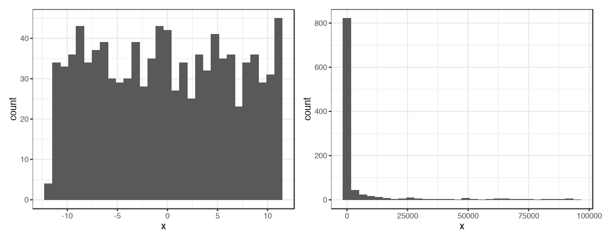

- 左边是`Tuner`中采样的结果频数
- 右边

- 在调优时，只用将`logscale = TRUE` 传递给 `to_tune()` 即可

```r
# 调取任务
tsk_sonar <-  tsk('sonar')
# 构建学习器
learner <-  lrn('classif.svm',
 # 指定调优的超参数`cose`和`gamma`
 # 选择将对数变换的结果传递给`Learner`
 cost  = to_tune(1e-1, 1e5, logscale = TRUE),
 gamma = to_tune(1e-1, 1e5, logscale = TRUE),
 # 设置其他的超参数
 kernel = 'radial',
 type = 'C-classification'
)
# 进行实例调优
instance <-  ti(
 task = tsk_sonar,
 learner = learner,
 resampling = rsmp('cv', folds = 3),
 measures = msr('classif.ce'),
 terminator = trm('none')
)
# 构建调优器
tuner <- tnr('grid_search', resolution = 5, batch_size = 10)
# 调优实例
tuner$optimize(instance)
```

<table class='dataframe'>
<caption>A data.table: 1 x 5</caption>
<thead>
 <tr><th scope=col>cost</th><th scope=col>gamma</th><th scope=col>learner_param_vals</th><th scope=col>x_domain</th><th scope=col>classif.ce</th></tr>
 <tr><th scope=col>&lt;dbl&gt;</th><th scope=col>&lt;dbl&gt;</th><th scope=col>&lt;list&gt;</th><th scope=col>&lt;list&gt;</th><th scope=col>&lt;dbl&gt;</th></tr>
</thead>
<tbody>
 <tr><td>1.151293</td><td>-2.302585</td><td>radial          , C-classification, 3.16227766016838, 0.1             </td><td>3.162278, 0.100000</td><td>0.2408558</td></tr>
</tbody>
</table>

- `cost`和`gamma`是对数变换前的最优值，  
  而`learner_param_vals`和`x_domain`包含的是是对数变换后的

```r
instance$result_learner_param_vals
instance$result$learner_param_vals
```

```js
$kernel
'radial'
$type
'C-classification'
$cost
3.16227766016838
$gamma
0.1
```

```r
instance$result_x_domain
instance$result$x_domain
```

```js
$cost
3.16227766016838
$gamma
0.1
```

- 可以简单验算一下结果
  - 结果和上方的结果完全一致

```r
instance$result$cost
exp(instance$result$cost)
```

```js
1.15129254649702
3.16227766016838
```

### 分析和使用结果

- 评估完的结果储存在`Instance$archive`里面
- 一共有25组，这是因为设定的`Tuner`的`resulution`是5，  
  所以可以得到$5^{2}= 25$

```r
instance$archive
```

<table class='dataframe'>
<caption>A data.table: 25 x 10</caption>
<thead>
 <tr><th scope=col>cost</th><th scope=col>gamma</th><th scope=col>classif.ce</th><th scope=col>runtime_learners</th><th scope=col>timestamp</th><th scope=col>warnings</th><th scope=col>errors</th><th scope=col>x_domain</th><th scope=col>batch_nr</th><th scope=col>resample_result</th></tr>
 <tr><th scope=col>&lt;dbl&gt;</th><th scope=col>&lt;dbl&gt;</th><th scope=col>&lt;dbl&gt;</th><th scope=col>&lt;dbl&gt;</th><th scope=col>&lt;dttm&gt;</th><th scope=col>&lt;int&gt;</th><th scope=col>&lt;int&gt;</th><th scope=col>&lt;list&gt;</th><th scope=col>&lt;int&gt;</th><th scope=col>&lt;list&gt;</th></tr>
</thead>
<tbody>
 <tr><td>-2.302585</td><td>11.512925</td><td>0.4665286</td><td>0.039</td><td>2025-06-17 14:29:56</td><td>0</td><td>0</td><td>1e-01, 1e+05</td><td>1</td><td>&lt;environment: 0x1734a6650&gt;</td></tr>
 <tr><td> 1.151293</td><td>-2.302585</td><td>0.2408558</td><td>0.046</td><td>2025-06-17 14:29:56</td><td>0</td><td>0</td><td>3.162278, 0.100000</td><td>1</td><td>&lt;environment: 0x173467a08&gt;</td></tr>
 <tr><td> 1.151293</td><td> 1.151293</td><td>0.4665286</td><td>0.030</td><td>2025-06-17 14:29:56</td><td>0</td><td>0</td><td>3.162278, 3.162278</td><td>1</td><td>&lt;environment: 0x173430338&gt;</td></tr>
 <tr><td> 1.151293</td><td> 8.059048</td><td>0.4665286</td><td>0.026</td><td>2025-06-17 14:29:56</td><td>0</td><td>0</td><td>3.162278, 3162.277660</td><td>1</td><td>&lt;environment: 0x1733e7c38&gt;</td></tr>
 <tr><td> 1.151293</td><td>11.512925</td><td>0.4665286</td><td>0.030</td><td>2025-06-17 14:29:56</td><td>0</td><td>0</td><td>3.162278e+00, 1.000000e+05</td><td>1</td><td>&lt;environment: 0x1733b1f48&gt;</td></tr>
 <tr><td> 4.605170</td><td>-2.302585</td><td>0.2408558</td><td>0.100</td><td>2025-06-17 14:29:56</td><td>0</td><td>0</td><td>100.0, 0.1</td><td>1</td><td>&lt;environment: 0x173087ad0&gt;</td></tr>
 <tr><td> 8.059048</td><td>-2.302585</td><td>0.2408558</td><td>0.030</td><td>2025-06-17 14:29:56</td><td>0</td><td>0</td><td>3162.278, 0.100</td><td>1</td><td>&lt;environment: 0x17361d128&gt;</td></tr>
 <tr><td> 8.059048</td><td>11.512925</td><td>0.4665286</td><td>0.027</td><td>2025-06-17 14:29:56</td><td>0</td><td>0</td><td>3162.278, 100000.000</td><td>1</td><td>&lt;environment: 0x173397c08&gt;</td></tr>
 <tr><td>11.512925</td><td>11.512925</td><td>0.4665286</td><td>0.030</td><td>2025-06-17 14:29:56</td><td>0</td><td>0</td><td>1e+05, 1e+05</td><td>1</td><td>&lt;environment: 0x173350e78&gt;</td></tr>
 <tr><td>-2.302585</td><td>-2.302585</td><td>0.4665286</td><td>0.029</td><td>2025-06-17 14:29:56</td><td>0</td><td>0</td><td>0.1, 0.1</td><td>2</td><td>&lt;environment: 0x173313660&gt;</td></tr>
 <tr><td>-2.302585</td><td> 8.059048</td><td>0.4665286</td><td>0.026</td><td>2025-06-17 14:29:56</td><td>0</td><td>0</td><td>0.100, 3162.278</td><td>2</td><td>&lt;environment: 0x1732e5170&gt;</td></tr>
 <tr><td> 1.151293</td><td> 4.605170</td><td>0.4665286</td><td>0.025</td><td>2025-06-17 14:29:56</td><td>0</td><td>0</td><td>3.162278, 100.000000</td><td>2</td><td>&lt;environment: 0x1732b32b0&gt;</td></tr>
 <tr><td> 4.605170</td><td> 1.151293</td><td>0.4665286</td><td>0.038</td><td>2025-06-17 14:29:56</td><td>0</td><td>0</td><td>100.000000, 3.162278</td><td>2</td><td>&lt;environment: 0x1732860c8&gt;</td></tr>
 <tr><td> 8.059048</td><td> 1.151293</td><td>0.4665286</td><td>0.030</td><td>2025-06-17 14:29:56</td><td>0</td><td>0</td><td>3162.277660, 3.162278</td><td>2</td><td>&lt;environment: 0x171620ab0&gt;</td></tr>
 <tr><td> 8.059048</td><td> 8.059048</td><td>0.4665286</td><td>0.031</td><td>2025-06-17 14:29:56</td><td>0</td><td>0</td><td>3162.278, 3162.278</td><td>2</td><td>&lt;environment: 0x1715e60b0&gt;</td></tr>
 <tr><td>11.512925</td><td> 1.151293</td><td>0.4665286</td><td>0.035</td><td>2025-06-17 14:29:56</td><td>0</td><td>0</td><td>1.000000e+05, 3.162278e+00</td><td>2</td><td>&lt;environment: 0x173054958&gt;</td></tr>
 <tr><td>11.512925</td><td> 8.059048</td><td>0.4665286</td><td>0.029</td><td>2025-06-17 14:29:56</td><td>0</td><td>0</td><td>100000.000, 3162.278</td><td>2</td><td>&lt;environment: 0x173214b00&gt;</td></tr>
 <tr><td>-2.302585</td><td> 1.151293</td><td>0.4665286</td><td>0.031</td><td>2025-06-17 14:29:57</td><td>0</td><td>0</td><td>0.100000, 3.162278</td><td>3</td><td>&lt;environment: 0x1731baa20&gt;</td></tr>
 <tr><td>-2.302585</td><td> 4.605170</td><td>0.4665286</td><td>0.027</td><td>2025-06-17 14:29:57</td><td>0</td><td>0</td><td>0.1, 100.0</td><td>3</td><td>&lt;environment: 0x173160e10&gt;</td></tr>
 <tr><td> 4.605170</td><td> 4.605170</td><td>0.4665286</td><td>0.026</td><td>2025-06-17 14:29:57</td><td>0</td><td>0</td><td>100, 100</td><td>3</td><td>&lt;environment: 0x1730f8d98&gt;</td></tr>
 <tr><td> 4.605170</td><td> 8.059048</td><td>0.4665286</td><td>0.040</td><td>2025-06-17 14:29:57</td><td>0</td><td>0</td><td>100.000, 3162.278</td><td>3</td><td>&lt;environment: 0x173064ba0&gt;</td></tr>
 <tr><td> 4.605170</td><td>11.512925</td><td>0.4665286</td><td>0.064</td><td>2025-06-17 14:29:57</td><td>0</td><td>0</td><td>1e+02, 1e+05</td><td>3</td><td>&lt;environment: 0x13a1f7410&gt;</td></tr>
 <tr><td> 8.059048</td><td> 4.605170</td><td>0.4665286</td><td>0.033</td><td>2025-06-17 14:29:57</td><td>0</td><td>0</td><td>3162.278, 100.000</td><td>3</td><td>&lt;environment: 0x176b02dd8&gt;</td></tr>
 <tr><td>11.512925</td><td>-2.302585</td><td>0.2408558</td><td>0.035</td><td>2025-06-17 14:29:57</td><td>0</td><td>0</td><td>1e+05, 1e-01</td><td>3</td><td>&lt;environment: 0x176c46388&gt;</td></tr>
 <tr><td>11.512925</td><td> 4.605170</td><td>0.4665286</td><td>0.039</td><td>2025-06-17 14:29:57</td><td>0</td><td>0</td><td>1e+05, 1e+02</td><td>3</td><td>&lt;environment: 0x176bf3e68&gt;</td></tr>
</tbody>
</table>

- 可以根据不同的性能指标对内部`ResampleResult`进行评分
  - zhe l这里是考察漏报率、误报率以及分类错误

```r
as.data.table(
 instance$archive,
 measures = msrs(c('classif.fpr', 'classif.fnr'))
)
```

<table class='dataframe'>
<caption>A data.table: 25 x 12</caption>
<thead>
 <tr><th scope=col>cost</th><th scope=col>gamma</th><th scope=col>classif.ce</th><th scope=col>classif.fpr</th><th scope=col>classif.fnr</th><th scope=col>runtime_learners</th><th scope=col>timestamp</th><th scope=col>warnings</th><th scope=col>errors</th><th scope=col>x_domain</th><th scope=col>batch_nr</th><th scope=col>resample_result</th></tr>
 <tr><th scope=col>&lt;dbl&gt;</th><th scope=col>&lt;dbl&gt;</th><th scope=col>&lt;dbl&gt;</th><th scope=col>&lt;dbl&gt;</th><th scope=col>&lt;dbl&gt;</th><th scope=col>&lt;dbl&gt;</th><th scope=col>&lt;dttm&gt;</th><th scope=col>&lt;int&gt;</th><th scope=col>&lt;int&gt;</th><th scope=col>&lt;list&gt;</th><th scope=col>&lt;int&gt;</th><th scope=col>&lt;list&gt;</th></tr>
</thead>
<tbody>
 <tr><td>-2.302585</td><td>11.512925</td><td>0.4665286</td><td>1.0000000</td><td>0.00000000</td><td>0.039</td><td>2025-06-17 14:29:56</td><td>0</td><td>0</td><td>1e-01, 1e+05</td><td>1</td><td>&lt;environment: 0x17b2d4438&gt;</td></tr>
 <tr><td> 1.151293</td><td>-2.302585</td><td>0.2408558</td><td>0.4606607</td><td>0.03397436</td><td>0.046</td><td>2025-06-17 14:29:56</td><td>0</td><td>0</td><td>3.162278, 0.100000</td><td>1</td><td>&lt;environment: 0x17b2bce48&gt;</td></tr>
 <tr><td> 1.151293</td><td> 1.151293</td><td>0.4665286</td><td>1.0000000</td><td>0.00000000</td><td>0.030</td><td>2025-06-17 14:29:56</td><td>0</td><td>0</td><td>3.162278, 3.162278</td><td>1</td><td>&lt;environment: 0x17b2a6070&gt;</td></tr>
 <tr><td> 1.151293</td><td> 8.059048</td><td>0.4665286</td><td>1.0000000</td><td>0.00000000</td><td>0.026</td><td>2025-06-17 14:29:56</td><td>0</td><td>0</td><td>3.162278, 3162.277660</td><td>1</td><td>&lt;environment: 0x17b288a58&gt;</td></tr>
 <tr><td> 1.151293</td><td>11.512925</td><td>0.4665286</td><td>1.0000000</td><td>0.00000000</td><td>0.030</td><td>2025-06-17 14:29:56</td><td>0</td><td>0</td><td>3.162278e+00, 1.000000e+05</td><td>1</td><td>&lt;environment: 0x17b2719e0&gt;</td></tr>
 <tr><td> 4.605170</td><td>-2.302585</td><td>0.2408558</td><td>0.4606607</td><td>0.03397436</td><td>0.100</td><td>2025-06-17 14:29:56</td><td>0</td><td>0</td><td>100.0, 0.1</td><td>1</td><td>&lt;environment: 0x17b254208&gt;</td></tr>
 <tr><td> 8.059048</td><td>-2.302585</td><td>0.2408558</td><td>0.4606607</td><td>0.03397436</td><td>0.030</td><td>2025-06-17 14:29:56</td><td>0</td><td>0</td><td>3162.278, 0.100</td><td>1</td><td>&lt;environment: 0x17b23cb00&gt;</td></tr>
 <tr><td> 8.059048</td><td>11.512925</td><td>0.4665286</td><td>1.0000000</td><td>0.00000000</td><td>0.027</td><td>2025-06-17 14:29:56</td><td>0</td><td>0</td><td>3162.278, 100000.000</td><td>1</td><td>&lt;environment: 0x17b19f510&gt;</td></tr>
 <tr><td>11.512925</td><td>11.512925</td><td>0.4665286</td><td>1.0000000</td><td>0.00000000</td><td>0.030</td><td>2025-06-17 14:29:56</td><td>0</td><td>0</td><td>1e+05, 1e+05</td><td>1</td><td>&lt;environment: 0x17b17e0e0&gt;</td></tr>
 <tr><td>-2.302585</td><td>-2.302585</td><td>0.4665286</td><td>1.0000000</td><td>0.00000000</td><td>0.029</td><td>2025-06-17 14:29:56</td><td>0</td><td>0</td><td>0.1, 0.1</td><td>2</td><td>&lt;environment: 0x17b1639e0&gt;</td></tr>
 <tr><td>-2.302585</td><td> 8.059048</td><td>0.4665286</td><td>1.0000000</td><td>0.00000000</td><td>0.026</td><td>2025-06-17 14:29:56</td><td>0</td><td>0</td><td>0.100, 3162.278</td><td>2</td><td>&lt;environment: 0x17b140828&gt;</td></tr>
 <tr><td> 1.151293</td><td> 4.605170</td><td>0.4665286</td><td>1.0000000</td><td>0.00000000</td><td>0.025</td><td>2025-06-17 14:29:56</td><td>0</td><td>0</td><td>3.162278, 100.000000</td><td>2</td><td>&lt;environment: 0x17b1184e0&gt;</td></tr>
 <tr><td> 4.605170</td><td> 1.151293</td><td>0.4665286</td><td>1.0000000</td><td>0.00000000</td><td>0.038</td><td>2025-06-17 14:29:56</td><td>0</td><td>0</td><td>100.000000, 3.162278</td><td>2</td><td>&lt;environment: 0x17b0ffee8&gt;</td></tr>
 <tr><td> 8.059048</td><td> 1.151293</td><td>0.4665286</td><td>1.0000000</td><td>0.00000000</td><td>0.030</td><td>2025-06-17 14:29:56</td><td>0</td><td>0</td><td>3162.277660, 3.162278</td><td>2</td><td>&lt;environment: 0x17b0e54d8&gt;</td></tr>
 <tr><td> 8.059048</td><td> 8.059048</td><td>0.4665286</td><td>1.0000000</td><td>0.00000000</td><td>0.031</td><td>2025-06-17 14:29:56</td><td>0</td><td>0</td><td>3162.278, 3162.278</td><td>2</td><td>&lt;environment: 0x17b0c9120&gt;</td></tr>
 <tr><td>11.512925</td><td> 1.151293</td><td>0.4665286</td><td>1.0000000</td><td>0.00000000</td><td>0.035</td><td>2025-06-17 14:29:56</td><td>0</td><td>0</td><td>1.000000e+05, 3.162278e+00</td><td>2</td><td>&lt;environment: 0x17b0ae860&gt;</td></tr>
 <tr><td>11.512925</td><td> 8.059048</td><td>0.4665286</td><td>1.0000000</td><td>0.00000000</td><td>0.029</td><td>2025-06-17 14:29:56</td><td>0</td><td>0</td><td>100000.000, 3162.278</td><td>2</td><td>&lt;environment: 0x17b0978c8&gt;</td></tr>
 <tr><td>-2.302585</td><td> 1.151293</td><td>0.4665286</td><td>1.0000000</td><td>0.00000000</td><td>0.031</td><td>2025-06-17 14:29:57</td><td>0</td><td>0</td><td>0.100000, 3.162278</td><td>3</td><td>&lt;environment: 0x17b07ce80&gt;</td></tr>
 <tr><td>-2.302585</td><td> 4.605170</td><td>0.4665286</td><td>1.0000000</td><td>0.00000000</td><td>0.027</td><td>2025-06-17 14:29:57</td><td>0</td><td>0</td><td>0.1, 100.0</td><td>3</td><td>&lt;environment: 0x17b062f60&gt;</td></tr>
 <tr><td> 4.605170</td><td> 4.605170</td><td>0.4665286</td><td>1.0000000</td><td>0.00000000</td><td>0.026</td><td>2025-06-17 14:29:57</td><td>0</td><td>0</td><td>100, 100</td><td>3</td><td>&lt;environment: 0x17b049820&gt;</td></tr>
 <tr><td> 4.605170</td><td> 8.059048</td><td>0.4665286</td><td>1.0000000</td><td>0.00000000</td><td>0.040</td><td>2025-06-17 14:29:57</td><td>0</td><td>0</td><td>100.000, 3162.278</td><td>3</td><td>&lt;environment: 0x17b02c320&gt;</td></tr>
 <tr><td> 4.605170</td><td>11.512925</td><td>0.4665286</td><td>1.0000000</td><td>0.00000000</td><td>0.064</td><td>2025-06-17 14:29:57</td><td>0</td><td>0</td><td>1e+02, 1e+05</td><td>3</td><td>&lt;environment: 0x17b015b30&gt;</td></tr>
 <tr><td> 8.059048</td><td> 4.605170</td><td>0.4665286</td><td>1.0000000</td><td>0.00000000</td><td>0.033</td><td>2025-06-17 14:29:57</td><td>0</td><td>0</td><td>3162.278, 100.000</td><td>3</td><td>&lt;environment: 0x1797f0da0&gt;</td></tr>
 <tr><td>11.512925</td><td>-2.302585</td><td>0.2408558</td><td>0.4606607</td><td>0.03397436</td><td>0.035</td><td>2025-06-17 14:29:57</td><td>0</td><td>0</td><td>1e+05, 1e-01</td><td>3</td><td>&lt;environment: 0x1797d1698&gt;</td></tr>
 <tr><td>11.512925</td><td> 4.605170</td><td>0.4665286</td><td>1.0000000</td><td>0.00000000</td><td>0.039</td><td>2025-06-17 14:29:57</td><td>0</td><td>0</td><td>1e+05, 1e+02</td><td>3</td><td>&lt;environment: 0x1797b2a90&gt;</td></tr>
</tbody>
</table>

- 只挑前五个的一部分

```r
as.data.table(
 instance$archive,
 measures = msrs(c('classif.fpr', 'classif.fnr'))
)[1:5 ,.(cost, gamma, classif.ce, classif.fpr, classif.fnr)]
```

<table class='dataframe'>
<caption>A data.table: 5 x 5</caption>
<thead>
 <tr><th scope=col>cost</th><th scope=col>gamma</th><th scope=col>classif.ce</th><th scope=col>classif.fpr</th><th scope=col>classif.fnr</th></tr>
 <tr><th scope=col>&lt;dbl&gt;</th><th scope=col>&lt;dbl&gt;</th><th scope=col>&lt;dbl&gt;</th><th scope=col>&lt;dbl&gt;</th><th scope=col>&lt;dbl&gt;</th></tr>
</thead>
<tbody>
 <tr><td>-2.302585</td><td>11.512925</td><td>0.4665286</td><td>1.0000000</td><td>0.00000000</td></tr>
 <tr><td> 1.151293</td><td>-2.302585</td><td>0.2408558</td><td>0.4606607</td><td>0.03397436</td></tr>
 <tr><td> 1.151293</td><td> 1.151293</td><td>0.4665286</td><td>1.0000000</td><td>0.00000000</td></tr>
 <tr><td> 1.151293</td><td> 8.059048</td><td>0.4665286</td><td>1.0000000</td><td>0.00000000</td></tr>
 <tr><td> 1.151293</td><td>11.512925</td><td>0.4665286</td><td>1.0000000</td><td>0.00000000</td></tr>
</tbody>
</table>

- `Instance$archive$benchmark_result`中储存了所有的`BenchmarkResult`对象

```r
{instance$archive$benchmark_result %>% as.data.table()}[1:5]
```

<table class='dataframe'>
<caption>A data.table: 5 x 9</caption>
<thead>
 <tr><th scope=col>uhash</th><th scope=col>task</th><th scope=col>learner</th><th scope=col>resampling</th><th scope=col>iteration</th><th scope=col>prediction</th><th scope=col>task_id</th><th scope=col>learner_id</th><th scope=col>resampling_id</th></tr>
 <tr><th scope=col>&lt;chr&gt;</th><th scope=col>&lt;list&gt;</th><th scope=col>&lt;list&gt;</th><th scope=col>&lt;list&gt;</th><th scope=col>&lt;int&gt;</th><th scope=col>&lt;list&gt;</th><th scope=col>&lt;chr&gt;</th><th scope=col>&lt;chr&gt;</th><th scope=col>&lt;chr&gt;</th></tr>
</thead>
<tbody>
 <tr><td>e31b69c6-41d4-4d7f-81c2-ed3b4bd3b75f</td><td>&lt;environment: 0x17cd32908&gt;</td><td>&lt;environment: 0x3064c38c0&gt;</td><td>&lt;environment: 0x17269e738&gt;</td><td>1</td><td>&lt;environment: 0x3202d2ac0&gt;</td><td>sonar</td><td>classif.svm</td><td>cv</td></tr>
 <tr><td>e31b69c6-41d4-4d7f-81c2-ed3b4bd3b75f</td><td>&lt;environment: 0x17cd32908&gt;</td><td>&lt;environment: 0x306425260&gt;</td><td>&lt;environment: 0x17269e738&gt;</td><td>2</td><td>&lt;environment: 0x32023dcf0&gt;</td><td>sonar</td><td>classif.svm</td><td>cv</td></tr>
 <tr><td>e31b69c6-41d4-4d7f-81c2-ed3b4bd3b75f</td><td>&lt;environment: 0x17cd32908&gt;</td><td>&lt;environment: 0x30a0e4660&gt;</td><td>&lt;environment: 0x17269e738&gt;</td><td>3</td><td>&lt;environment: 0x32019c9d0&gt;</td><td>sonar</td><td>classif.svm</td><td>cv</td></tr>
 <tr><td>5413c20f-f67c-4741-bc1e-6535ac83e266</td><td>&lt;environment: 0x17cd32908&gt;</td><td>&lt;environment: 0x300847120&gt;</td><td>&lt;environment: 0x17269e738&gt;</td><td>1</td><td>&lt;environment: 0x320379c40&gt;</td><td>sonar</td><td>classif.svm</td><td>cv</td></tr>
 <tr><td>5413c20f-f67c-4741-bc1e-6535ac83e266</td><td>&lt;environment: 0x17cd32908&gt;</td><td>&lt;environment: 0x31f42b8c0&gt;</td><td>&lt;environment: 0x17269e738&gt;</td><td>2</td><td>&lt;environment: 0x17ede9278&gt;</td><td>sonar</td><td>classif.svm</td><td>cv</td></tr>
</tbody>
</table>

- 可以将`type = 'surface'`传递给`autoplot.TuningInstanceBatchSingleCrit`来可视化实例调优的结果
  - 蓝色的区域表示`classif.ce`评估器的较小结果，表明模型更优

```r
autoplot(instance, type = 'surface')
```

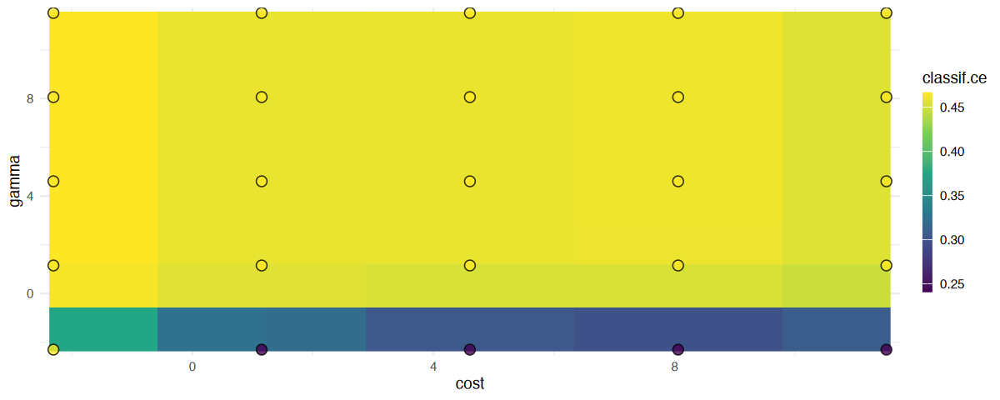

### 训练优化模型

- 当确定好超参数后，将`Instance`中的超参数传递给新建学习器中

```r
lrn_svm_tuned <- lrn('classif.svm')
lrn_svm_tuned$param_set$values <- instance$result_learner_param_vals
```

- 之后进行最基础的训练流程即可

```r
lrn_svm_tuned$train(tsk_sonar)$model
```

```r
Call:
svm.default(x = data, y = task$truth(), type = 'C-classification', 
    kernel = 'radial', gamma = 0.1, cost = 3.16227766016838, probability = (self$predict_type == 
        'prob'))


Parameters:
   SVM-Type:  C-classification 
 SVM-Kernel:  radial 
       cost:  3.162278 

Number of Support Vectors:  205
```

---

## 更便捷的调优方法

- 基本调优方法中用的是`ti()`创建调优实例，  
  之后用`Tuner$optimize()`进行调优

### `tune()`

- `tune()`可以在创建实例后直接进行调优，  
  省略手动先创建调优实例，后
- 下面的例子可以进行简单的对比

```r
# 调取任务
tsk_sonar <-  tsk('sonar')

# ---------------之前的方法
# 构建学习器
learner <-  lrn('classif.svm',
 # 指定调优的超参数`cose`和`gamma`
 # 选择将对数变换的结果传递给`Learner`
 cost  = to_tune(1e-1, 1e5, logscale = TRUE),
 gamma = to_tune(1e-1, 1e5, logscale = TRUE),
 # 设置其他的超参数
 kernel = 'radial',
 type = 'C-classification'
)
# 进行实例调优
instance <-  ti(
 task = tsk_sonar,
 learner = learner,
 resampling = rsmp('cv', folds = 3),
 measures = msr('classif.ce'),
 terminator = trm('none')
)
# 构建调优器
tuner <- tnr('grid_search', resolution = 5, batch_size = 10)
# 调优实例
tuner$optimize(instance)

# ---------------`tune()`的方法
# 构建学习器
lrn_svm <- lrn('classif.svm',
  cost  = to_tune(1e-5, 1e5, logscale = TRUE),
  gamma = to_tune(1e-5, 1e5, logscale = TRUE),
  kernel = 'radial',
  type = 'C-classification'
)
# [构建调优器]
# 需要先构建调优器，之后传递到`tune()`中
tnr_grid_search <- tnr('grid_search', resolution = 5, batch_size = 5)
# 进行实例调优
instance <- tune(
 # [这里多了`tuner`参数]
 # 所以先构建的调优器，后传递到`tune()`中
 # 也可以直接输入`tnr('grid_search', resolution = 5, batch_size = 5)`
 tuner = tnr_grid_search,
 task = tsk_sonar,
 learner = lrn_svm,
 resampling = rsmp('cv', folds = 3),
 measures = msr('classif.ce')
)
instance$result
```

### `auto_tune()`

- `auto_tune()` 创建一个`AutoTuner`类的对象
- `AutoTuner`继承自Learner类，并封装了调优所需的所有信息，  
  这意味着`AutoTuner`就是一个`Learner`
- 在底层，`AutoTuner`本质上是在调用`Learner$train()`时传递给模型的数据上运行`tune()`，然后将`Learner$param_set`参数设置为最优配置

```r
# 调取任务
tsk_sonar <-  tsk('sonar')

# ---------------之前的方法
# 构建学习器
learner <-  lrn('classif.svm',
 # 指定调优的超参数`cose`和`gamma`
 # 选择将对数变换的结果传递给`Learner`
 cost  = to_tune(1e-1, 1e5, logscale = TRUE),
 gamma = to_tune(1e-1, 1e5, logscale = TRUE),
 # 设置其他的超参数
 kernel = 'radial',
 type = 'C-classification'
)
# 进行实例调优
instance <-  ti(
 task = tsk_sonar,
 learner = learner,
 resampling = rsmp('cv', folds = 3),
 measures = msr('classif.ce'),
 terminator = trm('none')
)
# 构建调优器
tuner <- tnr('grid_search', resolution = 5, batch_size = 10)
# 调优实例
tuner$optimize(instance)

# ---------------`auto_tune()`的方法
# 构建学习器
lrn_svm <- lrn('classif.svm',
 cost  = to_tune(1e-5, 1e5, logscale = TRUE),
 gamma = to_tune(1e-5, 1e5, logscale = TRUE),
 kernel = 'radial',
 type = 'C-classification'
)
# [构建调优器]
# 需要先构建调优器，之后传递到`auto_tune()`中
tnr_grid_search <- tnr('grid_search', resolution = 5, batch_size = 5)
# 创建`AutoTuner`
at <- auto_tuner(
 tuner = tnr_grid_search,
 learner = lrn_svm,
 resampling = rsmp('cv', folds = 3),
 measure = msr('classif.ce')
)
# 分割`Task`的数据
split <- partition(tsk_sonar) 
# 训练模型，在此过程中自动调优选择出最佳的超参数
at$train(tsk_sonar, row_ids = split$train) 
# 预测模型，获得评估结果
pred <- at$predict(tsk_sonar, row_ids = split$test)
pred$score()
```

```js
classif.ce: 0.159420289855072
```

- `AutoTuner`中还包含一个调优实例`Intance`
  - 用法和前述一样

```r
at$tuning_instance$result %>% as.data.table()
```

<table class='dataframe'>
<caption>A data.table: 1 x 5</caption>
<thead>
 <tr><th scope=col>cost</th><th scope=col>gamma</th><th scope=col>learner_param_vals</th><th scope=col>x_domain</th><th scope=col>classif.ce</th></tr>
 <tr><th scope=col>&lt;dbl&gt;</th><th scope=col>&lt;dbl&gt;</th><th scope=col>&lt;list&gt;</th><th scope=col>&lt;list&gt;</th><th scope=col>&lt;dbl&gt;</th></tr>
</thead>
<tbody>
 <tr><td>11.51293</td><td>-5.756463</td><td>radial             , C-classification   , 1e+05              , 0.00316227766016838</td><td>1.000000e+05, 3.162278e-03</td><td>0.2008942</td></tr>
</tbody>
</table>

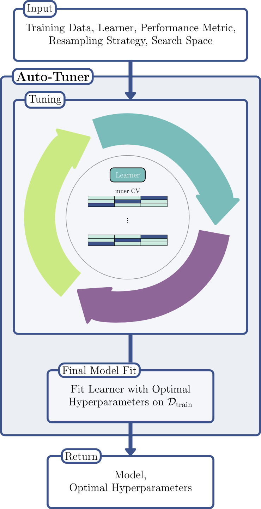

> Illustration of an Auto-Tuner.

---

## 嵌套重采样（Nested Resampling）

### 简介

- 超参数优化在不进行额外的重采样时会产生训练误差导致的乐观偏差

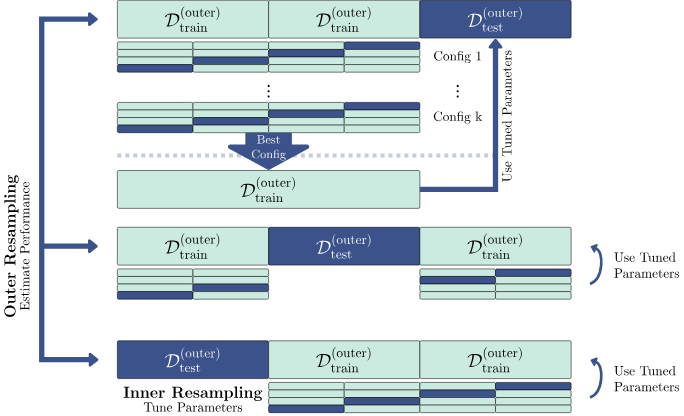

> 嵌套重采样示意图大块代表用于模型评估的外部重采样的三折交叉验证，小块代表用于调优的内部重采样的四折交叉验证浅蓝色块为训练集，深蓝色块为测试集

- 看着挺挺复杂的，在本例中：
  - 其实就是先对整个数据集进行3折交叉验证的切分，  
   这个里面2/3的用于训练集，1/3的用于验证集  
   （本质是测试集，不过一般测试集是纯用于测试的那种），
   这个部分叫**外部重采样（outer resampling）**
    - 对2/3训练集中再进行4折交叉验证的切分，  
    这个部分叫**内部重采样（inner resampling）**
    - 内部重采样训练出来的N个模型用外部的验证集进行评估，  
    选出最佳超参数，  
    这个部分叫**超参数优化（HPO）**
      - N取决于超参数个数以及网格搜索分辨率，  
     2个超参数，网格搜索分辨率为2就是$2^2=4$，  
     2个超参数，网格搜索分辨率为3就是$3^2=9$，  
     这个结果再乘以内部重采样的k值
      - 本例中假设内部重采样是4折，2个参数，2个网格，  
     那么共产生 $4\times2^2=16$ 个模型
      - 这些模型不直接用于1/3数据的验证集，  
     而是用内部重采样的小验证集进行性能评估，  
     最终选出16个模型里在自己小验证集上表现最好的模型的超参数
    - 用选择的超参数在**整个**2/3数据的的训练集进行模型训练，  
    再在1/3数据的测试集上进行模型评估
  - 上述一轮的内外重采样结束后，再重复两轮
  - 三次结束后，获得最终3个模型，  
   最这三个模型进行综合评估并选择最佳参数建模，  
   并最终用测试集评估最终性能

- **注意**：嵌套重采样的计算成本很高
  - 正如上所述，超参数的个数和网格数分辨率决定了训练模型的迭代次数；  
   如果2超参数外3折内4折为5的分辨率，那么总共需要迭代 $3\times4\times5^{2}= 300$次
  - 如果计算资源支持，可以通过并行化提高速度

### 使用`auto_tuner()`进行嵌套重采样

- 只需将 `AutoTuner` 传递给 `resample()`或 `benchmark()` 即可

```r
# 调取任务
tsk_sonar <-  tsk('sonar')
# 构建学习器
lrn_svm <- lrn('classif.svm',
 cost  = to_tune(1e-5, 1e5, logscale = TRUE),
 gamma = to_tune(1e-5, 1e5, logscale = TRUE),
 kernel = 'radial',
 type = 'C-classification'
)
# 构建调优器
tnr_grid_search <- tnr('grid_search', resolution = 5, batch_size = 5)
# 构建`AutoTuner`
at <- auto_tuner(
 tuner = tnr_grid_search,
 learner = lrn_svm,
 # 构建内部`Resampling`
 resampling = rsmp('cv', folds = 4),
 measure = msr('classif.ce')
)
# 构建外部`Resampling`
rsmp_cv3 <- rsmp('cv', folds = 3)
# 将`AutoTuner`传递给`resample()`
# 这里的`store_models=TRUE`仅能储存外部重采样的3个模型
rr <- resample(tsk_sonar, at, rsmp_cv3, store_models = TRUE)
# 打印
rr
```

```js
-- <ResampleResult> with 3 resampling iterations -------------------------------
 task_id        learner_id resampling_id iteration     prediction_test warnings
   sonar classif.svm.tuned            cv         1 <PredictionClassif>        0
   sonar classif.svm.tuned            cv         2 <PredictionClassif>        0
   sonar classif.svm.tuned            cv         3 <PredictionClassif>        0
 errors
      0
      0
      0
```

- 查看最终模型的

```r
rr$aggregate()
```

```js
classif.ce: 0.163285024154589
```

- `extract_inner_tuning_results(ResampleResult)` 返回外部重采样的全部结果  
- `extract_inner_tuning_archives(ResampleResult)` 返回内外部重采样的全部结果

```r
extract_inner_tuning_results(rr)
```

<table class='dataframe'>
<caption>A data.table: 3 x 9</caption>
<thead>
 <tr><th scope=col>iteration</th><th scope=col>cost</th><th scope=col>gamma</th><th scope=col>classif.ce</th><th scope=col>learner_param_vals</th><th scope=col>x_domain</th><th scope=col>task_id</th><th scope=col>learner_id</th><th scope=col>resampling_id</th></tr>
 <tr><th scope=col>&lt;int&gt;</th><th scope=col>&lt;dbl&gt;</th><th scope=col>&lt;dbl&gt;</th><th scope=col>&lt;dbl&gt;</th><th scope=col>&lt;list&gt;</th><th scope=col>&lt;list&gt;</th><th scope=col>&lt;chr&gt;</th><th scope=col>&lt;chr&gt;</th><th scope=col>&lt;chr&gt;</th></tr>
</thead>
<tbody>
 <tr><td>1</td><td>5.756463</td><td> -5.756463</td><td>0.1882353</td><td>radial             , C-classification   , 316.227766016838   , 0.00316227766016838</td><td>3.162278e+02, 3.162278e-03</td><td>sonar</td><td>classif.svm.tuned</td><td>cv</td></tr>
 <tr><td>2</td><td>5.756463</td><td>-11.512925</td><td>0.2376050</td><td>radial          , C-classification, 316.227766016838, 1e-05           </td><td>316.22777, 0.00001</td><td>sonar</td><td>classif.svm.tuned</td><td>cv</td></tr>
 <tr><td>3</td><td>5.756463</td><td> -5.756463</td><td>0.2006303</td><td>radial             , C-classification   , 316.227766016838   , 0.00316227766016838</td><td>3.162278e+02, 3.162278e-03</td><td>sonar</td><td>classif.svm.tuned</td><td>cv</td></tr>
</tbody>
</table>

```r
extract_inner_tuning_archives(rr)
```

<table class='dataframe'>
<caption>A data.table: 75 x 15</caption>
<thead>
 <tr><th scope=col>iteration</th><th scope=col>cost</th><th scope=col>gamma</th><th scope=col>classif.ce</th><th scope=col>x_domain_cost</th><th scope=col>x_domain_gamma</th><th scope=col>runtime_learners</th><th scope=col>timestamp</th><th scope=col>warnings</th><th scope=col>errors</th><th scope=col>batch_nr</th><th scope=col>resample_result</th><th scope=col>task_id</th><th scope=col>learner_id</th><th scope=col>resampling_id</th></tr>
 <tr><th scope=col>&lt;int&gt;</th><th scope=col>&lt;dbl&gt;</th><th scope=col>&lt;dbl&gt;</th><th scope=col>&lt;dbl&gt;</th><th scope=col>&lt;dbl&gt;</th><th scope=col>&lt;dbl&gt;</th><th scope=col>&lt;dbl&gt;</th><th scope=col>&lt;dttm&gt;</th><th scope=col>&lt;int&gt;</th><th scope=col>&lt;int&gt;</th><th scope=col>&lt;int&gt;</th><th scope=col>&lt;list&gt;</th><th scope=col>&lt;chr&gt;</th><th scope=col>&lt;chr&gt;</th><th scope=col>&lt;chr&gt;</th></tr>
</thead>
<tbody>
 <tr><td>1</td><td>-11.512925</td><td><span style=white-space:pre-wrap>  5.756463</span></td><td>0.4632353</td><td>1.000000e-05</td><td>3.162278e+02</td><td>0.088</td><td>2025-06-17 23:57:50</td><td>0</td><td>0</td><td>1</td><td>&lt;environment: 0x16ec87bc8&gt;</td><td>sonar</td><td>classif.svm.tuned</td><td>cv</td></tr>
 <tr><td>1</td><td><span style=white-space:pre-wrap>  0.000000</span></td><td> -5.756463</td><td>0.2689076</td><td>1.000000e+00</td><td>3.162278e-03</td><td>0.042</td><td>2025-06-17 23:57:50</td><td>0</td><td>0</td><td>1</td><td>&lt;environment: 0x16ec63f78&gt;</td><td>sonar</td><td>classif.svm.tuned</td><td>cv</td></tr>
 <tr><td>1</td><td><span style=white-space:pre-wrap>  0.000000</span></td><td><span style=white-space:pre-wrap>  0.000000</span></td><td>0.4632353</td><td>1.000000e+00</td><td>1.000000e+00</td><td>0.074</td><td>2025-06-17 23:57:50</td><td>0</td><td>0</td><td>1</td><td>&lt;environment: 0x16ec47d10&gt;</td><td>sonar</td><td>classif.svm.tuned</td><td>cv</td></tr>
 <tr><td>1</td><td><span style=white-space:pre-wrap>  5.756463</span></td><td>-11.512925</td><td>0.3126050</td><td>3.162278e+02</td><td>1.000000e-05</td><td>0.033</td><td>2025-06-17 23:57:50</td><td>0</td><td>0</td><td>1</td><td>&lt;environment: 0x16ec1b1c8&gt;</td><td>sonar</td><td>classif.svm.tuned</td><td>cv</td></tr>
 <tr><td>1</td><td><span style=white-space:pre-wrap>  5.756463</span></td><td><span style=white-space:pre-wrap>  0.000000</span></td><td>0.4632353</td><td>3.162278e+02</td><td>1.000000e+00</td><td>0.035</td><td>2025-06-17 23:57:50</td><td>0</td><td>0</td><td>1</td><td>&lt;environment: 0x16ebf3920&gt;</td><td>sonar</td><td>classif.svm.tuned</td><td>cv</td></tr>
 <tr><td>1</td><td> -5.756463</td><td> -5.756463</td><td>0.4632353</td><td>3.162278e-03</td><td>3.162278e-03</td><td>0.026</td><td>2025-06-17 23:57:50</td><td>0</td><td>0</td><td>2</td><td>&lt;environment: 0x16ebda1e0&gt;</td><td>sonar</td><td>classif.svm.tuned</td><td>cv</td></tr>
 <tr><td>1</td><td> -5.756463</td><td><span style=white-space:pre-wrap>  0.000000</span></td><td>0.4632353</td><td>3.162278e-03</td><td>1.000000e+00</td><td>0.029</td><td>2025-06-17 23:57:50</td><td>0</td><td>0</td><td>2</td><td>&lt;environment: 0x16eba3970&gt;</td><td>sonar</td><td>classif.svm.tuned</td><td>cv</td></tr>
 <tr><td>1</td><td> -5.756463</td><td><span style=white-space:pre-wrap>  5.756463</span></td><td>0.4632353</td><td>3.162278e-03</td><td>3.162278e+02</td><td>0.037</td><td>2025-06-17 23:57:50</td><td>0</td><td>0</td><td>2</td><td>&lt;environment: 0x16eb76288&gt;</td><td>sonar</td><td>classif.svm.tuned</td><td>cv</td></tr>
 <tr><td>1</td><td><span style=white-space:pre-wrap>  0.000000</span></td><td> 11.512925</td><td>0.4632353</td><td>1.000000e+00</td><td>1.000000e+05</td><td>0.028</td><td>2025-06-17 23:57:50</td><td>0</td><td>0</td><td>2</td><td>&lt;environment: 0x16eb1ca18&gt;</td><td>sonar</td><td>classif.svm.tuned</td><td>cv</td></tr>
 <tr><td>1</td><td> 11.512925</td><td><span style=white-space:pre-wrap>  5.756463</span></td><td>0.4632353</td><td>1.000000e+05</td><td>3.162278e+02</td><td>0.034</td><td>2025-06-17 23:57:50</td><td>0</td><td>0</td><td>2</td><td>&lt;environment: 0x16eaf0358&gt;</td><td>sonar</td><td>classif.svm.tuned</td><td>cv</td></tr>
 <tr><td>1</td><td>-11.512925</td><td> -5.756463</td><td>0.4632353</td><td>1.000000e-05</td><td>3.162278e-03</td><td>0.035</td><td>2025-06-17 23:57:51</td><td>0</td><td>0</td><td>3</td><td>&lt;environment: 0x16eac7780&gt;</td><td>sonar</td><td>classif.svm.tuned</td><td>cv</td></tr>
 <tr><td>1</td><td>-11.512925</td><td><span style=white-space:pre-wrap>  0.000000</span></td><td>0.4632353</td><td>1.000000e-05</td><td>1.000000e+00</td><td>0.029</td><td>2025-06-17 23:57:51</td><td>0</td><td>0</td><td>3</td><td>&lt;environment: 0x16e7cc3a0&gt;</td><td>sonar</td><td>classif.svm.tuned</td><td>cv</td></tr>
 <tr><td>1</td><td>-11.512925</td><td> 11.512925</td><td>0.4632353</td><td>1.000000e-05</td><td>1.000000e+05</td><td>0.055</td><td>2025-06-17 23:57:51</td><td>0</td><td>0</td><td>3</td><td>&lt;environment: 0x134617800&gt;</td><td>sonar</td><td>classif.svm.tuned</td><td>cv</td></tr>
 <tr><td>1</td><td><span style=white-space:pre-wrap>  0.000000</span></td><td><span style=white-space:pre-wrap>  5.756463</span></td><td>0.4632353</td><td>1.000000e+00</td><td>3.162278e+02</td><td>0.044</td><td>2025-06-17 23:57:51</td><td>0</td><td>0</td><td>3</td><td>&lt;environment: 0x164f9f808&gt;</td><td>sonar</td><td>classif.svm.tuned</td><td>cv</td></tr>
 <tr><td>1</td><td> 11.512925</td><td><span style=white-space:pre-wrap>  0.000000</span></td><td>0.4632353</td><td>1.000000e+05</td><td>1.000000e+00</td><td>0.039</td><td>2025-06-17 23:57:51</td><td>0</td><td>0</td><td>3</td><td>&lt;environment: 0x164f80080&gt;</td><td>sonar</td><td>classif.svm.tuned</td><td>cv</td></tr>
 <tr><td>1</td><td> -5.756463</td><td> 11.512925</td><td>0.4632353</td><td>3.162278e-03</td><td>1.000000e+05</td><td>0.029</td><td>2025-06-17 23:57:52</td><td>0</td><td>0</td><td>4</td><td>&lt;environment: 0x164f5c5f8&gt;</td><td>sonar</td><td>classif.svm.tuned</td><td>cv</td></tr>
 <tr><td>1</td><td><span style=white-space:pre-wrap>  5.756463</span></td><td> -5.756463</td><td>0.1882353</td><td>3.162278e+02</td><td>3.162278e-03</td><td>0.025</td><td>2025-06-17 23:57:52</td><td>0</td><td>0</td><td>4</td><td>&lt;environment: 0x164f362f0&gt;</td><td>sonar</td><td>classif.svm.tuned</td><td>cv</td></tr>
 <tr><td>1</td><td><span style=white-space:pre-wrap>  5.756463</span></td><td> 11.512925</td><td>0.4632353</td><td>3.162278e+02</td><td>1.000000e+05</td><td>0.050</td><td>2025-06-17 23:57:52</td><td>0</td><td>0</td><td>4</td><td>&lt;environment: 0x164f0c570&gt;</td><td>sonar</td><td>classif.svm.tuned</td><td>cv</td></tr>
 <tr><td>1</td><td> 11.512925</td><td> -5.756463</td><td>0.1882353</td><td>1.000000e+05</td><td>3.162278e-03</td><td>0.024</td><td>2025-06-17 23:57:52</td><td>0</td><td>0</td><td>4</td><td>&lt;environment: 0x164eec7c8&gt;</td><td>sonar</td><td>classif.svm.tuned</td><td>cv</td></tr>
 <tr><td>1</td><td> 11.512925</td><td> 11.512925</td><td>0.4632353</td><td>1.000000e+05</td><td>1.000000e+05</td><td>0.792</td><td>2025-06-17 23:57:52</td><td>0</td><td>0</td><td>4</td><td>&lt;environment: 0x164ec0b48&gt;</td><td>sonar</td><td>classif.svm.tuned</td><td>cv</td></tr>
 <tr><td>1</td><td>-11.512925</td><td>-11.512925</td><td>0.4632353</td><td>1.000000e-05</td><td>1.000000e-05</td><td>0.030</td><td>2025-06-17 23:57:52</td><td>0</td><td>0</td><td>5</td><td>&lt;environment: 0x164e8ab88&gt;</td><td>sonar</td><td>classif.svm.tuned</td><td>cv</td></tr>
 <tr><td>1</td><td> -5.756463</td><td>-11.512925</td><td>0.4632353</td><td>3.162278e-03</td><td>1.000000e-05</td><td>0.029</td><td>2025-06-17 23:57:52</td><td>0</td><td>0</td><td>5</td><td>&lt;environment: 0x164e5e2d0&gt;</td><td>sonar</td><td>classif.svm.tuned</td><td>cv</td></tr>
 <tr><td>1</td><td><span style=white-space:pre-wrap>  0.000000</span></td><td>-11.512925</td><td>0.4632353</td><td>1.000000e+00</td><td>1.000000e-05</td><td>0.043</td><td>2025-06-17 23:57:52</td><td>0</td><td>0</td><td>5</td><td>&lt;environment: 0x164e34400&gt;</td><td>sonar</td><td>classif.svm.tuned</td><td>cv</td></tr>
 <tr><td>1</td><td><span style=white-space:pre-wrap>  5.756463</span></td><td><span style=white-space:pre-wrap>  5.756463</span></td><td>0.4632353</td><td>3.162278e+02</td><td>3.162278e+02</td><td>0.074</td><td>2025-06-17 23:57:52</td><td>0</td><td>0</td><td>5</td><td>&lt;environment: 0x164e02020&gt;</td><td>sonar</td><td>classif.svm.tuned</td><td>cv</td></tr>
 <tr><td>1</td><td> 11.512925</td><td>-11.512925</td><td>0.2542017</td><td>1.000000e+05</td><td>1.000000e-05</td><td>0.026</td><td>2025-06-17 23:57:52</td><td>0</td><td>0</td><td>5</td><td>&lt;environment: 0x164de4160&gt;</td><td>sonar</td><td>classif.svm.tuned</td><td>cv</td></tr>
 <tr><td>2</td><td> -5.756463</td><td>-11.512925</td><td>0.4672269</td><td>3.162278e-03</td><td>1.000000e-05</td><td>0.030</td><td>2025-06-17 23:57:53</td><td>0</td><td>0</td><td>1</td><td>&lt;environment: 0x16e41f860&gt;</td><td>sonar</td><td>classif.svm.tuned</td><td>cv</td></tr>
 <tr><td>2</td><td><span style=white-space:pre-wrap>  0.000000</span></td><td><span style=white-space:pre-wrap>  5.756463</span></td><td>0.4672269</td><td>1.000000e+00</td><td>3.162278e+02</td><td>0.050</td><td>2025-06-17 23:57:53</td><td>0</td><td>0</td><td>1</td><td>&lt;environment: 0x16e3e9f40&gt;</td><td>sonar</td><td>classif.svm.tuned</td><td>cv</td></tr>
 <tr><td>2</td><td><span style=white-space:pre-wrap>  5.756463</span></td><td><span style=white-space:pre-wrap>  5.756463</span></td><td>0.4672269</td><td>3.162278e+02</td><td>3.162278e+02</td><td>0.035</td><td>2025-06-17 23:57:53</td><td>0</td><td>0</td><td>1</td><td>&lt;environment: 0x16e3c77f8&gt;</td><td>sonar</td><td>classif.svm.tuned</td><td>cv</td></tr>
 <tr><td>2</td><td> 11.512925</td><td><span style=white-space:pre-wrap>  5.756463</span></td><td>0.4672269</td><td>1.000000e+05</td><td>3.162278e+02</td><td>0.032</td><td>2025-06-17 23:57:53</td><td>0</td><td>0</td><td>1</td><td>&lt;environment: 0x1345eef68&gt;</td><td>sonar</td><td>classif.svm.tuned</td><td>cv</td></tr>
 <tr><td>2</td><td> 11.512925</td><td> 11.512925</td><td>0.4672269</td><td>1.000000e+05</td><td>1.000000e+05</td><td>0.029</td><td>2025-06-17 23:57:53</td><td>0</td><td>0</td><td>1</td><td>&lt;environment: 0x1345c8a18&gt;</td><td>sonar</td><td>classif.svm.tuned</td><td>cv</td></tr>
 <tr><td>...</td><td>...</td><td>...</td><td>...</td><td>...</td><td>...</td><td>...</td><td>...</td><td>...</td><td>...</td><td>...</td><td>...</td><td>...</td><td>...</td><td>...</td></tr>
 <tr><td>2</td><td>-11.512925</td><td><span style=white-space:pre-wrap>  5.756463</span></td><td>0.4672269</td><td>1.000000e-05</td><td>3.162278e+02</td><td>0.027</td><td>2025-06-17 23:57:54</td><td>0</td><td>0</td><td>5</td><td>&lt;environment: 0x164ca6460&gt;</td><td>sonar</td><td>classif.svm.tuned</td><td>cv</td></tr>
 <tr><td>2</td><td> -5.756463</td><td> -5.756463</td><td>0.4672269</td><td>3.162278e-03</td><td>3.162278e-03</td><td>0.029</td><td>2025-06-17 23:57:54</td><td>0</td><td>0</td><td>5</td><td>&lt;environment: 0x164c86108&gt;</td><td>sonar</td><td>classif.svm.tuned</td><td>cv</td></tr>
 <tr><td>2</td><td> -5.756463</td><td><span style=white-space:pre-wrap>  5.756463</span></td><td>0.4672269</td><td>3.162278e-03</td><td>3.162278e+02</td><td>0.023</td><td>2025-06-17 23:57:54</td><td>0</td><td>0</td><td>5</td><td>&lt;environment: 0x13452b258&gt;</td><td>sonar</td><td>classif.svm.tuned</td><td>cv</td></tr>
 <tr><td>2</td><td><span style=white-space:pre-wrap>  0.000000</span></td><td><span style=white-space:pre-wrap>  0.000000</span></td><td>0.4672269</td><td>1.000000e+00</td><td>1.000000e+00</td><td>0.026</td><td>2025-06-17 23:57:54</td><td>0</td><td>0</td><td>5</td><td>&lt;environment: 0x1345010e8&gt;</td><td>sonar</td><td>classif.svm.tuned</td><td>cv</td></tr>
 <tr><td>2</td><td> 11.512925</td><td><span style=white-space:pre-wrap>  0.000000</span></td><td>0.4672269</td><td>1.000000e+05</td><td>1.000000e+00</td><td>0.028</td><td>2025-06-17 23:57:54</td><td>0</td><td>0</td><td>5</td><td>&lt;environment: 0x1344dd2a8&gt;</td><td>sonar</td><td>classif.svm.tuned</td><td>cv</td></tr>
 <tr><td>3</td><td>-11.512925</td><td><span style=white-space:pre-wrap>  0.000000</span></td><td>0.4680672</td><td>1.000000e-05</td><td>1.000000e+00</td><td>0.033</td><td>2025-06-17 23:57:55</td><td>0</td><td>0</td><td>1</td><td>&lt;environment: 0x16e8c96d8&gt;</td><td>sonar</td><td>classif.svm.tuned</td><td>cv</td></tr>
 <tr><td>3</td><td> -5.756463</td><td><span style=white-space:pre-wrap>  0.000000</span></td><td>0.4680672</td><td>3.162278e-03</td><td>1.000000e+00</td><td>0.042</td><td>2025-06-17 23:57:55</td><td>0</td><td>0</td><td>1</td><td>&lt;environment: 0x16e8a5b28&gt;</td><td>sonar</td><td>classif.svm.tuned</td><td>cv</td></tr>
 <tr><td>3</td><td><span style=white-space:pre-wrap>  0.000000</span></td><td> -5.756463</td><td>0.2518908</td><td>1.000000e+00</td><td>3.162278e-03</td><td>0.025</td><td>2025-06-17 23:57:55</td><td>0</td><td>0</td><td>1</td><td>&lt;environment: 0x16e87db78&gt;</td><td>sonar</td><td>classif.svm.tuned</td><td>cv</td></tr>
 <tr><td>3</td><td><span style=white-space:pre-wrap>  5.756463</span></td><td><span style=white-space:pre-wrap>  0.000000</span></td><td>0.4680672</td><td>3.162278e+02</td><td>1.000000e+00</td><td>0.026</td><td>2025-06-17 23:57:55</td><td>0</td><td>0</td><td>1</td><td>&lt;environment: 0x164b0ec00&gt;</td><td>sonar</td><td>classif.svm.tuned</td><td>cv</td></tr>
 <tr><td>3</td><td> 11.512925</td><td>-11.512925</td><td>0.2371849</td><td>1.000000e+05</td><td>1.000000e-05</td><td>0.051</td><td>2025-06-17 23:57:55</td><td>0</td><td>0</td><td>1</td><td>&lt;environment: 0x164aede90&gt;</td><td>sonar</td><td>classif.svm.tuned</td><td>cv</td></tr>
 <tr><td>3</td><td>-11.512925</td><td> -5.756463</td><td>0.4680672</td><td>1.000000e-05</td><td>3.162278e-03</td><td>0.027</td><td>2025-06-17 23:57:55</td><td>0</td><td>0</td><td>2</td><td>&lt;environment: 0x164aadb78&gt;</td><td>sonar</td><td>classif.svm.tuned</td><td>cv</td></tr>
 <tr><td>3</td><td>-11.512925</td><td> 11.512925</td><td>0.4680672</td><td>1.000000e-05</td><td>1.000000e+05</td><td>0.026</td><td>2025-06-17 23:57:55</td><td>0</td><td>0</td><td>2</td><td>&lt;environment: 0x164a8cee8&gt;</td><td>sonar</td><td>classif.svm.tuned</td><td>cv</td></tr>
 <tr><td>3</td><td> -5.756463</td><td><span style=white-space:pre-wrap>  5.756463</span></td><td>0.4680672</td><td>3.162278e-03</td><td>3.162278e+02</td><td>0.024</td><td>2025-06-17 23:57:55</td><td>0</td><td>0</td><td>2</td><td>&lt;environment: 0x164a46ef8&gt;</td><td>sonar</td><td>classif.svm.tuned</td><td>cv</td></tr>
 <tr><td>3</td><td><span style=white-space:pre-wrap>  5.756463</span></td><td> -5.756463</td><td>0.2006303</td><td>3.162278e+02</td><td>3.162278e-03</td><td>0.024</td><td>2025-06-17 23:57:55</td><td>0</td><td>0</td><td>2</td><td>&lt;environment: 0x164a275b0&gt;</td><td>sonar</td><td>classif.svm.tuned</td><td>cv</td></tr>
 <tr><td>3</td><td><span style=white-space:pre-wrap>  5.756463</span></td><td><span style=white-space:pre-wrap>  5.756463</span></td><td>0.4680672</td><td>3.162278e+02</td><td>3.162278e+02</td><td>0.025</td><td>2025-06-17 23:57:55</td><td>0</td><td>0</td><td>2</td><td>&lt;environment: 0x164a0a2e0&gt;</td><td>sonar</td><td>classif.svm.tuned</td><td>cv</td></tr>
 <tr><td>3</td><td> -5.756463</td><td>-11.512925</td><td>0.4823529</td><td>3.162278e-03</td><td>1.000000e-05</td><td>0.025</td><td>2025-06-17 23:57:56</td><td>0</td><td>0</td><td>3</td><td>&lt;environment: 0x1649ea238&gt;</td><td>sonar</td><td>classif.svm.tuned</td><td>cv</td></tr>
 <tr><td>3</td><td> -5.756463</td><td> -5.756463</td><td>0.4680672</td><td>3.162278e-03</td><td>3.162278e-03</td><td>0.030</td><td>2025-06-17 23:57:56</td><td>0</td><td>0</td><td>3</td><td>&lt;environment: 0x1649d0c80&gt;</td><td>sonar</td><td>classif.svm.tuned</td><td>cv</td></tr>
 <tr><td>3</td><td> -5.756463</td><td> 11.512925</td><td>0.4680672</td><td>3.162278e-03</td><td>1.000000e+05</td><td>0.052</td><td>2025-06-17 23:57:56</td><td>0</td><td>0</td><td>3</td><td>&lt;environment: 0x1649b6c10&gt;</td><td>sonar</td><td>classif.svm.tuned</td><td>cv</td></tr>
 <tr><td>3</td><td><span style=white-space:pre-wrap>  0.000000</span></td><td>-11.512925</td><td>0.4823529</td><td>1.000000e+00</td><td>1.000000e-05</td><td>0.029</td><td>2025-06-17 23:57:56</td><td>0</td><td>0</td><td>3</td><td>&lt;environment: 0x16e865190&gt;</td><td>sonar</td><td>classif.svm.tuned</td><td>cv</td></tr>
 <tr><td>3</td><td><span style=white-space:pre-wrap>  0.000000</span></td><td> 11.512925</td><td>0.4680672</td><td>1.000000e+00</td><td>1.000000e+05</td><td>0.028</td><td>2025-06-17 23:57:56</td><td>0</td><td>0</td><td>3</td><td>&lt;environment: 0x16e84baf8&gt;</td><td>sonar</td><td>classif.svm.tuned</td><td>cv</td></tr>
 <tr><td>3</td><td>-11.512925</td><td>-11.512925</td><td>0.4823529</td><td>1.000000e-05</td><td>1.000000e-05</td><td>0.037</td><td>2025-06-17 23:57:56</td><td>0</td><td>0</td><td>4</td><td>&lt;environment: 0x16e82a278&gt;</td><td>sonar</td><td>classif.svm.tuned</td><td>cv</td></tr>
 <tr><td>3</td><td>-11.512925</td><td><span style=white-space:pre-wrap>  5.756463</span></td><td>0.4680672</td><td>1.000000e-05</td><td>3.162278e+02</td><td>0.025</td><td>2025-06-17 23:57:56</td><td>0</td><td>0</td><td>4</td><td>&lt;environment: 0x133ff9c88&gt;</td><td>sonar</td><td>classif.svm.tuned</td><td>cv</td></tr>
 <tr><td>3</td><td><span style=white-space:pre-wrap>  5.756463</span></td><td>-11.512925</td><td>0.2802521</td><td>3.162278e+02</td><td>1.000000e-05</td><td>0.025</td><td>2025-06-17 23:57:56</td><td>0</td><td>0</td><td>4</td><td>&lt;environment: 0x133fde710&gt;</td><td>sonar</td><td>classif.svm.tuned</td><td>cv</td></tr>
 <tr><td>3</td><td><span style=white-space:pre-wrap>  5.756463</span></td><td> 11.512925</td><td>0.4680672</td><td>3.162278e+02</td><td>1.000000e+05</td><td>0.026</td><td>2025-06-17 23:57:56</td><td>0</td><td>0</td><td>4</td><td>&lt;environment: 0x133fc2fd0&gt;</td><td>sonar</td><td>classif.svm.tuned</td><td>cv</td></tr>
 <tr><td>3</td><td> 11.512925</td><td><span style=white-space:pre-wrap>  5.756463</span></td><td>0.4680672</td><td>1.000000e+05</td><td>3.162278e+02</td><td>0.027</td><td>2025-06-17 23:57:56</td><td>0</td><td>0</td><td>4</td><td>&lt;environment: 0x133f06cb0&gt;</td><td>sonar</td><td>classif.svm.tuned</td><td>cv</td></tr>
 <tr><td>3</td><td><span style=white-space:pre-wrap>  0.000000</span></td><td><span style=white-space:pre-wrap>  0.000000</span></td><td>0.4680672</td><td>1.000000e+00</td><td>1.000000e+00</td><td>0.025</td><td>2025-06-17 23:57:56</td><td>0</td><td>0</td><td>5</td><td>&lt;environment: 0x133eca480&gt;</td><td>sonar</td><td>classif.svm.tuned</td><td>cv</td></tr>
 <tr><td>3</td><td><span style=white-space:pre-wrap>  0.000000</span></td><td><span style=white-space:pre-wrap>  5.756463</span></td><td>0.4680672</td><td>1.000000e+00</td><td>3.162278e+02</td><td>0.024</td><td>2025-06-17 23:57:56</td><td>0</td><td>0</td><td>5</td><td>&lt;environment: 0x133e9dd28&gt;</td><td>sonar</td><td>classif.svm.tuned</td><td>cv</td></tr>
 <tr><td>3</td><td> 11.512925</td><td> -5.756463</td><td>0.2006303</td><td>1.000000e+05</td><td>3.162278e-03</td><td>0.033</td><td>2025-06-17 23:57:56</td><td>0</td><td>0</td><td>5</td><td>&lt;environment: 0x133e7f238&gt;</td><td>sonar</td><td>classif.svm.tuned</td><td>cv</td></tr>
 <tr><td>3</td><td> 11.512925</td><td><span style=white-space:pre-wrap>  0.000000</span></td><td>0.4680672</td><td>1.000000e+05</td><td>1.000000e+00</td><td>0.029</td><td>2025-06-17 23:57:56</td><td>0</td><td>0</td><td>5</td><td>&lt;environment: 0x16e33a6d8&gt;</td><td>sonar</td><td>classif.svm.tuned</td><td>cv</td></tr>
 <tr><td>3</td><td> 11.512925</td><td> 11.512925</td><td>0.4680672</td><td>1.000000e+05</td><td>1.000000e+05</td><td>0.027</td><td>2025-06-17 23:57:56</td><td>0</td><td>0</td><td>5</td><td>&lt;environment: 0x16e319e18&gt;</td><td>sonar</td><td>classif.svm.tuned</td><td>cv</td></tr>
</tbody>
</table>

### 评估性能的正确（与错误）方式

- 这里进行一个对比，看看为什么要用嵌套重采样而不是简单的无嵌套重采样

```r
# ---------------准备数据
# 设置随机数种子
set.seed(5)
# 构建学习器
lrn_xgboost <- lrn(
 # 选择xgboost算法作为学习器
 'classif.xgboost',
 # 设置超参数的选择范围
 eta = to_tune(1e-4, 1, logscale = TRUE),
 max_depth = to_tune(1, 20),
 colsample_bytree  = to_tune(1e-1, 1),
 colsample_bylevel = to_tune(1e-1, 1),
 lambda = to_tune(1e-3, 1e3, logscale = TRUE),
 alpha = to_tune(1e-3, 1e3, logscale = TRUE),
 subsample = to_tune(1e-1, 1)
)
# 构建任务生成器，命名为'moons'
tsk_moons <- tgen('moons')
# 随机生成100个训练样本和1000000个测试样本
tsk_moons_train <- tsk_moons$generate(100)
tsk_moons_test <- tsk_moons$generate(1000000)
# 构建评估器
msr_ce <- msr('classif.ce')
# 调优器用随机搜索法
tnr_random <- tnr('random_search')
# 使用留出法重采样
rsmp_holdout <- rsmp('holdout')
# 设置终止器，使用次数限制法，随机搜索700次终止
trm_evals700 <- trm('evals', n_evals = 700)

# -------无嵌套重采样
# 使用`tune()`进行实例调优
instance <- tune(
 tuner = tnr_random,
 task = tsk_moons_train,
 learner = lrn_xgboost,
 resampling = rsmp_holdout,
 measures = msr_ce,
 terminator = trm_evals700
)
# 记录最优参数在调优集上的性能
insample <- instance$result_y

# -------嵌套重采样
# 使用`auto_tuner()`创建一个调优学习器`AutoTuner`
at <- auto_tuner(
 tuner = tnr_random,
 learner = lrn_xgboost,
 # 这里的留出法用于内部重采样
 resampling = rsmp_holdout,
 measure = msr_ce,
 terminator = trm_evals700
)
# 创建一个5折CV，用于后续的外部重采样
rsmp_cv5 <- rsmp('cv', folds = 5)
# 将`Task`，`AutoTuner`和外部重采样器`Resampling`传递给`resample()`
# `ResampleResult$aggregate()`给出整合结果
rr <- resample(tsk_moons_train, at, rsmp_cv5)
outsample <- rr$aggregate()

# ------用无嵌套重采样的超参数建模
# 创建xgboost的学习器
lrn_xgboost_tuned <- lrn('classif.xgboost')
# 将无嵌套重采样的实例调优得到的最佳超参数传递给xgboost学习器
lrn_xgboost_tuned$param_set$set_values(
 # `instance`是无嵌套重采样的调优实例
 .values = instance$result_learner_param_vals
)
# 训练模型 -> 测试模型 -> 评估
generalization <- lrn_xgboost_tuned$train(
 tsk_moons_train
)$
 predict(tsk_moons_test)$
 score()

# 汇总一下结果
round(
 c(
  # 用无嵌套重采样选择的最佳超参数构建的模型在测试集上的评估结果
  true_generalization = as.numeric(generalization),
  # 无嵌套重采样选择的最佳超参数构建的模型在内部训练的评估结果
  # 这里的内部是仅在训练集上生成的调优模型得到的结果
  without_nested_resampling = as.numeric(insample),
  # 嵌套重采样选择的最佳超参数构建的模型在内部训练的评估结果
  with_nested_resampling = as.numeric(outsample)
 ), 
 2
)
```

```js
true_generalization 0.1 
without_nested_resampling 0.06 
with_nested_resampling 0.14
```

- **从上面得到什么结果？**
  - 无嵌套重采样的内部评估得到的交叉熵很低，与实际在测试集的评估结果差异很大
  - 这可能表明对特定的内部留出划分存在**元过拟合（meta-overfitting）**
  - 相比之下嵌套重采样得到的外部估计效果更稳健

---

## 更高级的搜索空间

### 标量参数调优（Scalar Parameter Tuning）

- 当在学习器中使用`to_tune()`时，会隐式地为调优搜索空间创建一个`ParamSet`

```r
learner <- lrn('classif.svm',
  cost  = to_tune(1e-1, 1e5),
  kernel = to_tune(c('radial', 'linear')),
  shrinking = to_tune(),
  type = 'C-classification'
)

learner$param_set$search_space()
```

```js
<ParamSet(3)>
          id    class lower upper nlevels        default  value
      <char>   <char> <num> <num>   <num>         <list> <list>
1:      cost ParamDbl   0.1 1e+05     Inf <NoDefault[0]> [NULL]
2:    kernel ParamFct    NA    NA       2 <NoDefault[0]> [NULL]
3: shrinking ParamLgl    NA    NA       2           TRUE [NULL]
```

- 可以看到
  - `kernel`是因子，只需要传入想要调整的水平相对应的向量
  - `shrinking`超参数是一个逻辑值，它只有两种可能的值，  
   所以不需要向`to_tune()`传递任何内容，  
   它会自动从`learner$param_set`中识别出这是一个逻辑值，  
   并将这个细节传递给`learner$param_set$search_space()`
  - 对于因子参数，如果想在所有可能的值上进行调整，  
   也可以在不传递任何参数的情况下使用`to_tune()`
  - 如果想在一小部分可能的值上离散化数值参数，  
   可以使用to_tune()将数值参数视为因子
    - 例如，想找到随机森林中最优的树的数量，  
    我们可能只考虑三种情况：100棵、200棵或400棵树

```r
lrn('classif.ranger', num.trees = to_tune(c(100, 200, 400)))
```

- 将**整数变做因子**会导致超参数**无序**
  - 因此，利用顺序信息的算法在忽略顺序时性能会变差
  - 对于这些算法，  
   使用自定义变换定义一个 `ParamDbl` 或 `ParamInt`更有意义
   （后续内容）

### 定义搜索空间

- 下列`p_*()`创建`Param`对象

| Constructor 构造函数 | Description 描述                       | Underlying Class 基础类 |
| ---------------- | ------------------------------------ | -------------------- |
| `p_dbl()`        | Real valued parameter (“double”)     | `ParamDbl`           |
| `p_int()`        | Integer parameter                    | `ParamInt`           |
| `p_fct()`        | Discrete valued parameter (“factor”) | `ParamFct`           |
| `p_lgl()`        | Logical / Boolean parameter          | `ParamLgl`           |
| `p_uty()`        | Untyped parameter                    | `ParamUty`           |

- 使用`ps()`手动创造搜索空间，对象为`ParamSet`

```r
search_space <- ps(
 cost  = p_dbl(lower = 1e-1, upper = 1e5),
 kernel = p_fct(c('radial', 'linear')),
 shrinking = p_lgl()
)
```

- 将搜索空间传递给`ti()`
  - 官方文档写错了，他给的例子是`ti()`
   `auto_tuner()`应该传递了`Tuner`但是例子里没有`Tuner`

```r
tsk_sonar <- tsk('sonar')
rsmp_cv3 <- rsmp('cv', folds = 3)
msr_ce <- msr('classif.ce')

ists <- ti(
    tsk_sonar, 
    lrn('classif.svm', type = 'C-classification'), 
    rsmp_cv3,
    msr_ce, 
    trm('none'), 
    # 将搜索空间传递到参数`search_space`
    search_space = search_space
)

ists
```

```js
-- <TuningInstanceBatchSingleCrit> ---------------------------------------------
* State: Not optimized
* Objective: <ObjectiveTuningBatch>
* Search Space:
          id    class lower upper nlevels
      <char>   <char> <num> <num>   <num>
1:      cost ParamDbl   0.1 1e+05     Inf
2:    kernel ParamFct    NA    NA       2
3: shrinking ParamLgl    NA    NA       2
* Terminator: <TerminatorNone>
```

- **有界搜索空间**
  - 手动创建搜索空间时，对搜索空间中的所有超参数是否有边界保持谨慎
  - 如果没有给`p_dbl()` 或 `p_int()` 传递下限和上限，  
   几乎所有调谐器在调优过程中都会抛出错误
  - 如果不确定，您可以在构造的 `ParamSet` （`ps()`创建的对象）上  
   使用`ParamSet$is_bounded`查看是否设置了下限和上限

```r
ps(cost = p_dbl(lower = 0.1, upper = 1))$is_bounded
ps(cost = p_dbl(lower = 0.1, upper = Inf))$is_bounded
search_space
```

```js
cost: TRUE

cost: FALSE

cost TRUE 
kernel TRUE 
shrinking TRUE
```

### 向量上的变换与调优

#### 使用`p_*()`的自定义变换

- 之前讨论过对数变换的用法
- 简单回顾一下之前用给`lrn()`传递用`to_tune()`创建的学习器的搜索空间

```r
svm <- lrn(
 'classif.svm',
 cost = to_tune(1e-5,1e5, logscale = TRUE)
)
svm$param_set
```

```js
<ParamSet(1)>
       id    class     lower    upper nlevels        default  value
   <char>   <char>     <num>    <num>   <num>         <list> <list>
1:   cost ParamDbl -11.51293 11.51293     Inf <NoDefault[0]> [NULL]
Trafo is set.
```

- 可以看到这里的`lower`和`upper`并非`1e-5`和`1e5`而是`-11.5`和`11.5` 　
  所以输入到学习器的范围其实是`log(1e-5)`和`log(1e5)`

- 手动创建对数变换
  - `trafo`中传递的是对采样结果的操作函数
  - 这里的输出结果和`svm$param_set`一致

```r
ss <- ps(
 cost = p_dbl(
  # 注意：这里是log(1e-5)和log(1e5)
  log(1e-5), log(1e5),
  # 对结果做指数变换
  trafo = function(x) ruturn(exp(x))
 )
) 
ss
```

```js
<ParamSet(1)>
       id    class     lower    upper nlevels        default  value
   <char>   <char>     <num>    <num>   <num>         <list> <list>
1:   cost ParamDbl -11.51293 11.51293     Inf <NoDefault[0]> [NULL]
Trafo is set.
```

- 虽然`ParamSet`给出了`Trafo is set.`的信息，  
  也可以通过`ParamSet$trafo()`手动输入信息来查看是否有转换
- 看看`ParamSet$trafo()`的转换
  - 结果也是完全一致

```r
svm$param_set$search_space()$trafo(list(cost = 1))
ss$trafo(list(cost = 1))
```

```r
$cost = 2.71828182845905
$cost = 2.71828182845905
```

- 从上面的例子可以看出，`to_tune(1e-5,1e5, logscale = TRUE)`的原理是：
  - 将下限与上限做对数变换
  - 在对数变换后的上下限形成的区间做均匀取样
  - 将均匀取样的结果进行指数变换，传递给`Learner`

- `to_tune()`除了接受`to_tune(1e-5, 1e5, logscale = TRUE)`这样的格式外，  
  也接受`Param`对象
- 在下面例子中，取样在区间$[0,3]$均匀取样，将取样的结果$+2$传递到`Learner`中

```r
lrn(
 'classif.svm',
 cost = to_tune(
  p_dbl(
   0, 3, 
   trafo = function(x) return(x + 2)
  )
 )
)
```

- 对于多个复杂变换，需要将函数传递到`.extra_trafo`中
  - `.extra_trafo`接受一个带有参数`x`和`param_set`的函数
  - 在调优过程中，  
   `x`是一个包含正在测试的配置的列表，  
   `param_set`是整个参数集
  - 测试了一下，在这个例子里省略`param_set`也是可以的，  
   但是不确定其他用法中能不能省，我觉得还是别省了

```r
search_space <- ps(
 # `cost`在区间[-1,1]均匀取样，取样结果做指数转换
 cost = p_dbl(-1, 1, trafo = function(x) return(exp(x))),
 # `kernel`有'polynomial'和'radial'两种选择
 kernel = p_fct(c('polynomial', 'radial')),
 # 传递一个函数：当kernel == 'polynomial'时，
 # `cost`抽样后指数转换的最终结果+2；否则就保持最终结果
 .extra_trafo = function(x, param_set) {
     if (x$kernel == 'polynomial') {
       x$cost = x$cost + 2
  }
  return(x)
 }
)

search_space$trafo(list(cost = 1, kernel = 'polynomial'))
search_space$trafo(list(cost = 1, kernel = 'radial'))
```

```js
$cost
4.71828182845904
$kernel
'polynomial'


$cost
2.71828182845905
$kernel
'radial'
```

#### 向量变换

- 任何函数都可以传递给`trafo`和`.extra_trafo`，  
  这使得可以调整`ParamUty`类参数，  
  这些参数可以是向量、函数或任何非原子类
- 下例中，支持向量机（SVM）的`class.weights`参数接受一个类权重的命名向量，  
  每个目标类都有一个条目
  - 为了调整这个参数，可以调整一个标量，然后将其转换为一个向量
  - 下面的代码将采样一个介于`0.1`和`0.9`之间的值`x`，  
   然后将结果转换为(`x`, `1 - x`)，然后传递给`Learner`

- 先看看`class.weights`长什么样
  - 它的类型是`ParamUty`，所以可以传递任何东西给它

```r
{
    lrn('classif.svm')$param_set %>% 
        as.data.table()
} %>% 
    filter(id == 'class.weights')
```

<table class='dataframe'>
<caption>A data.table: 1 x 11</caption>
<thead>
 <tr><th scope=col>id</th><th scope=col>class</th><th scope=col>lower</th><th scope=col>upper</th><th scope=col>levels</th><th scope=col>nlevels</th><th scope=col>is_bounded</th><th scope=col>special_vals</th><th scope=col>default</th><th scope=col>storage_type</th><th scope=col>tags</th></tr>
 <tr><th scope=col>&lt;chr&gt;</th><th scope=col>&lt;chr&gt;</th><th scope=col>&lt;dbl&gt;</th><th scope=col>&lt;dbl&gt;</th><th scope=col>&lt;list&gt;</th><th scope=col>&lt;dbl&gt;</th><th scope=col>&lt;lgl&gt;</th><th scope=col>&lt;list&gt;</th><th scope=col>&lt;list&gt;</th><th scope=col>&lt;chr&gt;</th><th scope=col>&lt;list&gt;</th></tr>
</thead>
<tbody>
 <tr><td>class.weights</td><td>ParamUty</td><td>NA</td><td>NA</td><td>NULL</td><td>Inf</td><td>FALSE</td><td>NULL</td><td>NULL</td><td>list</td><td>train</td></tr>
</tbody>
</table>

- 对于`ParamUty`而言，要慎重确定它**原本接受什么形式的输入**
  - `class.weights`接受一个命名向量，  
   其中包含分类的level以及希望分配的权重（0–1之间）

```r
search_space <- ps(
 class.weights = p_dbl(
  lower = 0.1, upper = 0.9,
  # 这里的M和R是`tsk_sonar`里的分类
  # M是Mines，R是Rocks
  trafo = function(x) return(c(M = x, R = 1 - x))
 )
)
```

- 有时候需要调节多个不存在学习器`param_set`里的**伪参数**
  - 这些伪参数会被用于调整向量参数
- 下例中以`lrn('surv.coxtime')`为例
  - `num_nodes`需要给每个层传递节点，  
   如果有5个层，每个层生成4个节点，那么就要输入向量：  
   `num_nodes = c(4, 4, 4, 4, 4)`，
   当然也可以这样传递：`num_nodes = rep(4, 5)
  - 所以`num_nodes`实际依赖两个参数：
    - 层数
    - 每层节点数
  - 因此可以自定义层数和每层节点数的两个伪参数，  
   通过组合这两个伪函数来生成目标超参数`num_nodes`
- `num_nodes`并不会在`ParamSet`的打印结果中出现，  
  因为我们并没有在`ps()`中直接定义它

```r
search_space <- ps(
 num_layers = p_int(lower = 1, upper = 20),
 num_nodes_per_layer = p_int(4, 64),
 .extra_trafo = function(x, param_set) {
  x$num_nodes = rep(x$num_nodes_per_layer, x$num_layers)
  x$num_layers = NULL
  x$num_nodes_per_layer = NULL
  return(x)
  }
)

search_space
```

```js
<ParamSet(2)>
                    id    class lower upper nlevels        default  value
                <char>   <char> <num> <num>   <num>         <list> <list>
1:          num_layers ParamInt     1    20      20 <NoDefault[0]> [NULL]
2: num_nodes_per_layer ParamInt     4    64      61 <NoDefault[0]> [NULL]
Trafo is set.
```

- 但是可以通过`ParamSet$trafo()`来验证
  - 结果也是很清晰了，  
   在实际的运算中要传递给`Learner`的是生成的`num_nodes`

```r
search_space$trafo(list(num_layers = 4, num_nodes_per_layer = 12))
```

```js
$num_nodes =
12 12 12 12
```

- 可以通过`Learner$param_set$set_values()`传递上述自定义的搜索空间

```r
learner <- lrn('surv.coxtime')
learner$param_set$search_space()

learner$param_set$set_values(num_nodes = to_tune(search_space))
learner$param_set$search_space()
```

```js
<ParamSet(0)>
Empty.


<ParamSet(2)>
                    id    class lower upper nlevels        default  value
                <char>   <char> <num> <num>   <num>         <list> <list>
1:          num_layers ParamInt     1    20      20 <NoDefault[0]> [NULL]
2: num_nodes_per_layer ParamInt     4    64      61 <NoDefault[0]> [NULL]
Trafo is set.
```

### 超参数依赖关系

- 例如，SVM中的`degree`参数仅在`kernel`为`'polynomial'`时才有效
  - 在`ps()`函数中，使用`depends`参数来指定这种依赖关系，  
   该参数接受一个命名参数，  
   形式为`<param> == value` 或 `<param> %in% <vector>`

- 下面例子中，对3个超参数进行调优
- 先简单看看`lrn('classif.svm')`中的依赖关系
  - `degree`和`gamma`都依赖于`kernel`

```r
learner <- lrn('classif.svm')
learner$param_set$deps
```

<table class='dataframe'>
<caption>A data.table: 5 x 3</caption>
<thead>
 <tr><th scope=col>id</th><th scope=col>on</th><th scope=col>cond</th></tr>
 <tr><th scope=col>&lt;chr&gt;</th><th scope=col>&lt;chr&gt;</th><th scope=col>&lt;list&gt;</th></tr>
</thead>
<tbody>
 <tr><td>coef0 </td><td>kernel</td><td>polynomial    , sigmoid       , %s %%in%% {%s}</td></tr>
 <tr><td>cost  </td><td>type  </td><td>C-classification, %s == %s        </td></tr>
 <tr><td>degree</td><td>kernel</td><td>polynomial, %s == %s  </td></tr>
 <tr><td>gamma </td><td>kernel</td><td>polynomial    , radial        , sigmoid       , %s %%in%% {%s}</td></tr>
 <tr><td>nu    </td><td>type  </td><td>nu-classification, %s == %s         </td></tr>
</tbody>
</table>

- 使用`depends`参数来指定这种依赖关系
  - 该参数接受一个命名参数，形式为`<param> == value` 或 `<param> %in% <vector>`

```r
ps(
 kernel = p_fct(c('polynomial', 'radial')),
 degree = p_int(1, 3, depends = (kernel == 'polynomial')),
 gamma = p_dbl(
  1e-5, 1e5,
  depends = (kernel %in% c('polynomial', 'radial'))
 )
)
```

```js
<ParamSet(3)>
Key: <id>
       id    class lower upper nlevels        default parents  value
   <char>   <char> <num> <num>   <num>         <list>  <list> <list>
1: degree ParamInt 1e+00 3e+00       3 <NoDefault[0]>  kernel [NULL]
2:  gamma ParamDbl 1e-05 1e+05     Inf <NoDefault[0]>  kernel [NULL]
3: kernel ParamFct    NA    NA       2 <NoDefault[0]>  [NULL] [NULL]
```

- 也可以直接传递到`to_tune()`函数

```r
lrn(
 'classif.svm',
 kernel = to_tune(c('polynomial', 'radial')),
 degree = to_tune(
  p_int(
   1, 3, 
   depends = (kernel == 'polynomial')
  )
 ),
 gamma = to_tune(
  p_dbl(
   1e-5, 1e5,
   depends = (kernel %in% c('polynomial', 'radial'))
  )
 )
)$param_set$search_space()
```

```js
<ParamSet(3)>
Key: <id>
       id    class lower upper nlevels        default       parents  value
   <char>   <char> <num> <num>   <num>         <list>        <list> <list>
1: degree ParamInt 1e+00 3e+00       3 <NoDefault[0]> kernel,kernel [NULL]
2:  gamma ParamDbl 1e-05 1e+05     Inf <NoDefault[0]> kernel,kernel [NULL]
3: kernel ParamFct    NA    NA       2 <NoDefault[0]>        [NULL] [NULL]
```

### 使用 `mlr3tuningspaces` 推荐的搜索空间

- 选定的搜索空间可能需要大量的背景知识或专业技能
- `mlr3tuningspaces` 包为许多流行的机器学习算法提供已发布搜索空间的实现，  
  让超参数优化更容易上手
- 搜索空间存储在字典 `mlr_tuning_spaces` 中

```r
# library(mlr3tuningspaces)
mlr_tuning_spaces
```

<table class='dataframe'>
<caption>A data.table: 30 x 4</caption>
<thead>
 <tr><th scope=col>key</th><th scope=col>label</th><th scope=col>learner</th><th scope=col>n_values</th></tr>
 <tr><th scope=col>&lt;chr&gt;</th><th scope=col>&lt;chr&gt;</th><th scope=col>&lt;chr&gt;</th><th scope=col>&lt;int&gt;</th></tr>
</thead>
<tbody>
 <tr><td>classif.glmnet.default </td><td>Classification GLM with Default      </td><td>classif.glmnet </td><td> 2</td></tr>
 <tr><td>classif.glmnet.rbv1    </td><td>Classification GLM with RandomBot    </td><td>classif.glmnet </td><td> 2</td></tr>
 <tr><td>classif.glmnet.rbv2    </td><td>Classification GLM with RandomBot    </td><td>classif.glmnet </td><td> 2</td></tr>
 <tr><td>classif.ranger.default </td><td>Classification Ranger with Default   </td><td>classif.ranger </td><td> 4</td></tr>
 <tr><td>classif.ranger.rbv1    </td><td>Classification Ranger with RandomBot </td><td>classif.ranger </td><td> 6</td></tr>
 <tr><td>classif.ranger.rbv2    </td><td>Classification Ranger with RandomBot </td><td>classif.ranger </td><td> 8</td></tr>
 <tr><td>classif.rpart.default  </td><td>Classification Rpart with Default    </td><td>classif.rpart  </td><td> 3</td></tr>
 <tr><td>classif.rpart.rbv1     </td><td>Classification Rpart with RandomBot  </td><td>classif.rpart  </td><td> 4</td></tr>
 <tr><td>classif.rpart.rbv2     </td><td>Classification Rpart with RandomBot  </td><td>classif.rpart  </td><td> 4</td></tr>
 <tr><td>classif.svm.default    </td><td>Classification SVM with Default      </td><td>classif.svm    </td><td> 4</td></tr>
 <tr><td>classif.svm.rbv1       </td><td>Classification SVM with RandomBot    </td><td>classif.svm    </td><td> 4</td></tr>
 <tr><td>classif.svm.rbv2       </td><td>Classification SVM with RandomBot    </td><td>classif.svm    </td><td> 5</td></tr>
 <tr><td>classif.xgboost.default</td><td>Classification XGBoost with Default  </td><td>classif.xgboost</td><td> 8</td></tr>
 <tr><td>classif.xgboost.rbv1   </td><td>Classification XGBoost with RandomBot</td><td>classif.xgboost</td><td>10</td></tr>
 <tr><td>classif.xgboost.rbv2   </td><td>Classification XGBoost with RandomBot</td><td>classif.xgboost</td><td>13</td></tr>
 <tr><td>regr.glmnet.default    </td><td>Regression GLM with Default          </td><td>regr.glmnet    </td><td> 2</td></tr>
 <tr><td>regr.glmnet.rbv1       </td><td>Regression GLM with RandomBot        </td><td>regr.glmnet    </td><td> 2</td></tr>
 <tr><td>regr.glmnet.rbv2       </td><td>Regression GLM with RandomBot        </td><td>regr.glmnet    </td><td> 2</td></tr>
 <tr><td>regr.ranger.default    </td><td>Regression Ranger with Default       </td><td>regr.ranger    </td><td> 4</td></tr>
 <tr><td>regr.ranger.rbv1       </td><td>Regression Ranger with RandomBot     </td><td>regr.ranger    </td><td> 6</td></tr>
 <tr><td>regr.ranger.rbv2       </td><td>Regression Ranger with RandomBot     </td><td>regr.ranger    </td><td> 7</td></tr>
 <tr><td>regr.rpart.default     </td><td>Regression Rpart with Default        </td><td>regr.rpart     </td><td> 3</td></tr>
 <tr><td>regr.rpart.rbv1        </td><td>Regression Rpart with RandomBot      </td><td>regr.rpart     </td><td> 4</td></tr>
 <tr><td>regr.rpart.rbv2        </td><td>Regression Rpart with RandomBot      </td><td>regr.rpart     </td><td> 4</td></tr>
 <tr><td>regr.svm.default       </td><td>Regression SVM with Default          </td><td>regr.svm       </td><td> 4</td></tr>
 <tr><td>regr.svm.rbv1          </td><td>Regression SVM with RandomBot        </td><td>regr.svm       </td><td> 4</td></tr>
 <tr><td>regr.svm.rbv2          </td><td>Regression SVM with RandomBot        </td><td>regr.svm       </td><td> 5</td></tr>
 <tr><td>regr.xgboost.default   </td><td>Regression XGBoost with Default      </td><td>regr.xgboost   </td><td> 8</td></tr>
 <tr><td>regr.xgboost.rbv1      </td><td>Regression XGBoost with RandomBot    </td><td>regr.xgboost   </td><td>10</td></tr>
 <tr><td>regr.xgboost.rbv2      </td><td>Regression XGBoost with RandomBot    </td><td>regr.xgboost   </td><td>13</td></tr>
</tbody>
</table>

- `lts()`（learner tuning space）可以快速调取推荐的搜索空间

```r
lts_rpart <- lts('classif.rpart.default')
lts_rpart
```

```js
-- <TuningSpace> (classif.rpart.default): Classification Rpart with Default ----
          id lower upper levels logscale
      <char> <num> <num> <list>   <lgcl>
1:  minsplit 2e+00 128.0 [NULL]     TRUE
2: minbucket 1e+00  64.0 [NULL]     TRUE
3:        cp 1e-04   0.1 [NULL]     TRUE
```

- 之后可以传递给`ti()`或`auto_tuner()`中的`search_space`参数，  
  也可以直接调取`TuningSpace$values`（`TuneToken`类）传递到`Learner$param_set`中

```r
# `ti()`
instance <- ti(
 task = tsk_sonar,
 learner = lrn('classif.rpart'),
 resampling = rsmp('cv', folds = 3),
 measures = msr('classif.ce'),
 terminator = trm('evals', n_evals = 20),
 # 在这里
 search_space = lts_rpart
)

# `auto_tuner()`
at <- auto_tuner(
 learner = lrn('classif.rpart'),
 resampling = rsmp('cv', folds = 3),
 measures = msr('classif.ce'),
 terminator = trm('evals', n_evals = 20),
 # # 在这里
 search_space = lts_rpart
)

# 直接传递给`Learner`
learner <- lrn('classif.rpart')
learner$param_set$set_values(.values = lts_rpart$values)
learner$param_set
```

- 也可以直接将`Learner`传递给`lts()`来调用默认的搜索空间，  
  以及在`lts()`调用默认搜索空间的时候自定义更改超参数调优内容

```r
lts(lrn('classif.rpart'))
lts('classif.rpart.rbv2', maxdepth = to_tune(1, 20))
```

---

## 错误处理与内存管理

### 封装与回退学习器

- 即使在简单的机器学习问题中，也有很大的出错可能性
  - 例如，当学习器无法收敛、内存耗尽，  
   或者由于底层数据的问题而出现错误并终止运行
- 作为一个常见问题：如果测试数据中存在训练数据中没有的因子水平，  
  学习器可能会失败，在这种情况下建模会失败，  
  因为没有针对这些新的因子水平训练权重/系数：

```r
# 调取`Task`
tsk_pen <- tsk('penguins')
# 去除有缺损值的行
tsk_pen$filter(tsk_pen$row_ids[complete.cases(tsk_pen$data())])
# 创建一个custom方法的重采样器(ResamplingCustom类)：
# custom需要手动提供的索引将数据拆分为训练集和测试集
rsmp_custom <- rsmp('custom')
# 为了举例子，这里选择手动分配训练集和测试集：
# 不包含“Torgersen”和仅包含“Torgersen”的行的数据集
rsmp_custom$instantiate(
 task = tsk_pen,
 # 选择所有`island`不为'Torgersen'的行的数据集作为训练集
 train_sets = list(
  tsk_pen$
   row_ids[
    tsk_pen$
     data()$
     island != 'Torgersen'
   ]
 ),
 # 选择所有`island`为'Torgersen'的行的数据集作为测试集
 test_sets = list(
  tsk_pen$
   row_ids[
    tsk_pen$
     data()$
     island == 'Torgersen'
   ]
 )
)
# 这样分配完后，测试集中的`island`是没有'Torgersen'的（缺乏因子）
# 这种结果会导致后面的`tune()`失败

# 创建交叉熵评估器
msr_ce <- msr('classif.ce')
# 创建随机搜索调优器
tnr_random <- tnr('random_search')
# 创建lda学习器
learner <- lrn(
 'classif.lda', 
 method = 't', 
 nu = to_tune(3, 10)
)

# ----------由于训练集没有测试集的因子“Torgersen”
# ----------下面报错
# 进行实例调优
tune(
 tuner = tnr_random, 
 task = tsk_pen, 
 learner = learner, 
 resampling = rsmp_custom, 
 measure = msr_ce, 
 term_evals = 10)
```

```js
Error in lda.default(x, grouping, ...): variable 6 appears to be constant within groups
```

- 封装（encapsulation）允许在不干扰调优过程的情况下隔离和处理错误
- 可以使用 `$encapsulate()` 方法让学习器封装错误
  - 传递的`method = 'evaluate'`是告诉学习器在训练和预测阶段都设置封装

```r
learner$encapsulate(
 method = 'evaluate', 
 fallback = lrn('classif.featureless')
)
```

- 在HPO过程中，学习器不收敛是比较常见的问题，  
  这导致进程无限期运行
  - 可以通过在学习器中设置 `timeout`字段来避免这种情况发生
  - 如果学习器运行了指定的时长（以秒为单位），  
   该字段会向学习器发出停止信号
  - 可以分别针对训练和预测进行设置

```r
learner$timeout = c(train = 30, predict = 30)
```

- 如果出现错误，或者达到模型超时阈值，  
  那么学习者不会中断，而是在发现错误时不进行预测
  - 对于出现错误的重采样迭代，结果将显示为`NA`
- 上述情况时，超参数优化将会失败
  - 因为无法汇总不同重采样迭代的结果
  - 通过使用备择学习器，可以解决这个问题
    - 常见的方法是使用无特征基线  
    `lrn('regr.featureless')` 或  
     `lrn('classif.featureless')`
    - `lrn('classif.featureless')`总是预测多数类（占比最高的分类）

```r
instance <- tune(
 tuner = tnr_random, 
 task = tsk_pen, 
 learner = learner, 
 resampling = rsmp_custom, 
 measure = msr_ce,
 term_evals = 10
)

as.data.table(instance$archive)
```

<table class='dataframe'>
<caption>A data.table: 10 x 9</caption>
<thead>
 <tr><th scope=col>nu</th><th scope=col>classif.ce</th><th scope=col>runtime_learners</th><th scope=col>timestamp</th><th scope=col>warnings</th><th scope=col>errors</th><th scope=col>x_domain</th><th scope=col>batch_nr</th><th scope=col>resample_result</th></tr>
 <tr><th scope=col>&lt;int&gt;</th><th scope=col>&lt;dbl&gt;</th><th scope=col>&lt;dbl&gt;</th><th scope=col>&lt;dttm&gt;</th><th scope=col>&lt;int&gt;</th><th scope=col>&lt;int&gt;</th><th scope=col>&lt;list&gt;</th><th scope=col>&lt;int&gt;</th><th scope=col>&lt;list&gt;</th></tr>
</thead>
<tbody>
 <tr><td>8</td><td>1</td><td>NA</td><td>2025-06-20 18:42:40</td><td>0</td><td>1</td><td>8</td><td> 1</td><td>&lt;environment: 0x16642a5a8&gt;</td></tr>
 <tr><td>9</td><td>1</td><td>NA</td><td>2025-06-20 18:42:40</td><td>0</td><td>1</td><td>9</td><td> 2</td><td>&lt;environment: 0x165f622c8&gt;</td></tr>
 <tr><td>5</td><td>1</td><td>NA</td><td>2025-06-20 18:42:40</td><td>0</td><td>1</td><td>5</td><td> 3</td><td>&lt;environment: 0x165f7da40&gt;</td></tr>
 <tr><td>5</td><td>1</td><td>NA</td><td>2025-06-20 18:42:40</td><td>0</td><td>1</td><td>5</td><td> 4</td><td>&lt;environment: 0x165f9bbc8&gt;</td></tr>
 <tr><td>6</td><td>1</td><td>NA</td><td>2025-06-20 18:42:40</td><td>0</td><td>1</td><td>6</td><td> 5</td><td>&lt;environment: 0x165fbb758&gt;</td></tr>
 <tr><td>9</td><td>1</td><td>NA</td><td>2025-06-20 18:42:40</td><td>0</td><td>1</td><td>9</td><td> 6</td><td>&lt;environment: 0x165fd78a8&gt;</td></tr>
 <tr><td>5</td><td>1</td><td>NA</td><td>2025-06-20 18:42:40</td><td>0</td><td>1</td><td>5</td><td> 7</td><td>&lt;environment: 0x165fedbc8&gt;</td></tr>
 <tr><td>4</td><td>1</td><td>NA</td><td>2025-06-20 18:42:40</td><td>0</td><td>1</td><td>4</td><td> 8</td><td>&lt;environment: 0x16644c068&gt;</td></tr>
 <tr><td>8</td><td>1</td><td>NA</td><td>2025-06-20 18:42:40</td><td>0</td><td>1</td><td>8</td><td> 9</td><td>&lt;environment: 0x16646a458&gt;</td></tr>
 <tr><td>6</td><td>1</td><td>NA</td><td>2025-06-20 18:42:41</td><td>0</td><td>1</td><td>6</td><td>10</td><td>&lt;environment: 0x166ac1458&gt;</td></tr>
</tbody>
</table>

- 用`Instance$archive$resample_result()`调取重采样中发生的错误

```r
instance$archive$resample_result(1)$errors
```

<table class='dataframe'>
<caption>A data.table: 1 x 2</caption>
<thead>
 <tr><th scope=col>iteration</th><th scope=col>msg</th></tr>
 <tr><th scope=col>&lt;int&gt;</th><th scope=col>&lt;chr&gt;</th></tr>
</thead>
<tbody>
 <tr><td>1</td><td>variable 6 appears to be constant within groups</td></tr>
</tbody>
</table>

- 调优则是可以进行的，并且得到最终选择出来的超参数

```r
instance$result
```

<table class='dataframe'>
<caption>A data.table: 1 x 4</caption>
<thead>
 <tr><th scope=col>nu</th><th scope=col>learner_param_vals</th><th scope=col>x_domain</th><th scope=col>classif.ce</th></tr>
 <tr><th scope=col>&lt;int&gt;</th><th scope=col>&lt;list&gt;</th><th scope=col>&lt;list&gt;</th><th scope=col>&lt;dbl&gt;</th></tr>
</thead>
<tbody>
 <tr><td>8</td><td>t, 8</td><td>8</td><td>1</td></tr>
</tbody>
</table>

### 内存管理

- `ti()`和`auto_tuner()`中的`store_models`参数  
  可以选择是否储存训练中生成的模型
- `ti()` 和 `auto_tuner()`中的`store_benchmark_result`参数  
  可以选择是否储存重采样结果
  - 但如果没有重采样结果，  
   就无法再用其他指标对配置进行评分
- 当使用大量外部重采样迭代运行嵌套重采样时，  
  如果在 `auto_tuner()` 函数中设置 `store_tuning_instance = FALSE`，  
  则可以节省额外的内存
  - 但是，  
   `extract_inner_tuning_results()` 和  
    `extract_inner_tuning_archives()` 函数将不再起作用
- 选项`store_models = TRUE`会将  
  `store_benchmark_result`和  
  `store_tuning_instance`设置为`TRUE`
  - 因为模型存储在基准测试结果中，  
   而基准测试结果又是实例的一部分
  - 这也意味着`store_benchmark_result = TRUE`会将  
   `store_tuning_instance`设置为`TRUE`
- 在 `resample()` 或 `benchmark()` 中设置 `store_models = FALSE`，  
  以在运行嵌套重采样时禁用自动调谐器的存储
   仍然可以通过`ResampleResult$aggregate()` 查看整合评估的结果，  
   但会丢失有关内部重采样的信息

---

## 多目标调优

- 更多时候，比起模型在单一评估指标上优秀，  
  在多个评估指标上都有较好的评估结果是我们想看到的
- 从定义上讲，对多个评估指标进行优化意味着这些指标之间会相互竞争  
  （否则我们只需优化其中一个指标）
  - 因此一般来说，不存在一种能优化所有指标的单一评估器
- **帕累托最优（Pareto optimality）**
  - 假设要最小化分类误差$CE$和复杂度$CP$，  
   配置A和配置B的分类误差分别为$CE_A$和$CE_B$，复杂度分别为$CP_A$和$CP_B$
  - 若满足以下条件，则A帕累托支配B：
    - 1）CEA≤CEB且CPA<CPB；或者  
    2）CEA<CEB且CPA≤CPB
    - 所有不被其他任何配置帕累托支配的配置称为  
    **帕累托有效配置（Pareto-efficient）**
    - 所有这些配置的集合就是**帕累托集（Pareto set）**
    - 与帕累托集相对应的指标值称为**帕累托前沿（Pareto front）**
- 多目标超参数优化的目标是找到一组非支配解，  
  使其对应的指标值**逼近帕累托前沿**

- 下例中，对 `tsk('sonar')` 数据集上调整决策树来演示多目标超参数优化
  - 其中分类误差作为模型性能的度量
  - 所选特征的数量作为模型复杂度的度量

```r
learner <- lrn(
 'classif.rpart', 
 cp = to_tune(1e-04, 1e-1),
 minsplit = to_tune(2, 64), 
 maxdepth = to_tune(1, 30)
)

measures <- msrs(c('classif.ce', 'selected_features'))
```

- 用`ti()`调优
  - 由于是多评估指标调优，所以创建的不是  
    `TuningInstanceBatchSingleCrit`，而是  
    `TuningInstanceBatchMultiCrit`

```r
# 创建调优实例
instance <- ti(
 task = tsk('sonar'),
 learner = learner,
 resampling = rsmp('cv', folds = 3),
 # 注意不是`measure`而是`measures`复数
 measures = measures,
 terminator = trm('evals', n_evals = 30),
 # 
 store_models = TRUE
)

# 创建调优器
tuner <- tnr('random_search')
# 调优
tuner$optimize(instance)
```

<table class='dataframe'>
<caption>A data.table: 16 x 7</caption>
<thead>
 <tr><th scope=col>cp</th><th scope=col>maxdepth</th><th scope=col>minsplit</th><th scope=col>learner_param_vals</th><th scope=col>x_domain</th><th scope=col>classif.ce</th><th scope=col>selected_features</th></tr>
 <tr><th scope=col>&lt;dbl&gt;</th><th scope=col>&lt;int&gt;</th><th scope=col>&lt;int&gt;</th><th scope=col>&lt;list&gt;</th><th scope=col>&lt;list&gt;</th><th scope=col>&lt;dbl&gt;</th><th scope=col>&lt;dbl&gt;</th></tr>
</thead>
<tbody>
 <tr><td>0.05426979</td><td> 2</td><td>28</td><td>0.00000000, 0.05426979, 2.00000000, 28.00000000</td><td>0.05426979, 2.00000000, 28.00000000</td><td>0.2739821</td><td>1.666667</td></tr>
 <tr><td>0.08910768</td><td>24</td><td>44</td><td>0.00000000, 0.08910768, 24.00000000, 44.00000000</td><td>0.08910768, 24.00000000, 44.00000000</td><td>0.2835749</td><td>1.000000</td></tr>
 <tr><td>0.08880381</td><td> 4</td><td> 9</td><td>0.00000000, 0.08880381, 4.00000000, 9.00000000</td><td>0.08880381, 4.00000000, 9.00000000</td><td>0.2835749</td><td>1.000000</td></tr>
 <tr><td>0.07884068</td><td> 4</td><td>36</td><td>0.00000000, 0.07884068, 4.00000000, 36.00000000</td><td>0.07884068, 4.00000000, 36.00000000</td><td>0.2787440</td><td>1.333333</td></tr>
 <tr><td>0.07125967</td><td> 8</td><td>16</td><td>0.00000000, 0.07125967, 8.00000000, 16.00000000</td><td>0.07125967, 8.00000000, 16.00000000</td><td>0.2692892</td><td>3.000000</td></tr>
 <tr><td>0.09373661</td><td>15</td><td>32</td><td>0.00000000, 0.09373661, 15.00000000, 32.00000000</td><td>0.09373661, 15.00000000, 32.00000000</td><td>0.2835749</td><td>1.000000</td></tr>
 <tr><td>0.09580900</td><td> 3</td><td>47</td><td>0.000000, 0.095809, 3.000000, 47.000000</td><td>0.095809, 3.000000, 47.000000</td><td>0.2835749</td><td>1.000000</td></tr>
 <tr><td>0.09714774</td><td> 6</td><td>57</td><td>0.00000000, 0.09714774, 6.00000000, 57.00000000</td><td>0.09714774, 6.00000000, 57.00000000</td><td>0.2835749</td><td>1.000000</td></tr>
 <tr><td>0.09435243</td><td>26</td><td>33</td><td>0.00000000, 0.09435243, 26.00000000, 33.00000000</td><td>0.09435243, 26.00000000, 33.00000000</td><td>0.2835749</td><td>1.000000</td></tr>
 <tr><td>0.01511812</td><td> 1</td><td>20</td><td>0.00000000, 0.01511812, 1.00000000, 20.00000000</td><td>0.01511812, 1.00000000, 20.00000000</td><td>0.2835749</td><td>1.000000</td></tr>
 <tr><td>0.06956784</td><td>18</td><td> 9</td><td>0.00000000, 0.06956784, 18.00000000, 9.00000000</td><td>0.06956784, 18.00000000, 9.00000000</td><td>0.2692892</td><td>3.000000</td></tr>
 <tr><td>0.05564576</td><td> 3</td><td>51</td><td>0.00000000, 0.05564576, 3.00000000, 51.00000000</td><td>0.05564576, 3.00000000, 51.00000000</td><td>0.2739821</td><td>1.666667</td></tr>
 <tr><td>0.08578581</td><td> 1</td><td>64</td><td>0.00000000, 0.08578581, 1.00000000, 64.00000000</td><td>0.08578581, 1.00000000, 64.00000000</td><td>0.2835749</td><td>1.000000</td></tr>
 <tr><td>0.07160058</td><td>24</td><td>12</td><td>0.00000000, 0.07160058, 24.00000000, 12.00000000</td><td>0.07160058, 24.00000000, 12.00000000</td><td>0.2692892</td><td>3.000000</td></tr>
 <tr><td>0.06709319</td><td>14</td><td>15</td><td>0.00000000, 0.06709319, 14.00000000, 15.00000000</td><td>0.06709319, 14.00000000, 15.00000000</td><td>0.2644582</td><td>3.333333</td></tr>
 <tr><td>0.06516315</td><td> 8</td><td>59</td><td>0.00000000, 0.06516315, 8.00000000, 59.00000000</td><td>0.06516315, 8.00000000, 59.00000000</td><td>0.2835749</td><td>1.000000</td></tr>
</tbody>
</table>

<table class='dataframe'>
<caption>A data.table: 16 x 12</caption>
<thead>
 <tr><th scope=col>cp</th><th scope=col>maxdepth</th><th scope=col>minsplit</th><th scope=col>classif.ce</th><th scope=col>selected_features</th><th scope=col>warnings</th><th scope=col>errors</th><th scope=col>runtime_learners</th><th scope=col>uhash</th><th scope=col>x_domain</th><th scope=col>timestamp</th><th scope=col>batch_nr</th></tr>
 <tr><th scope=col>&lt;dbl&gt;</th><th scope=col>&lt;int&gt;</th><th scope=col>&lt;int&gt;</th><th scope=col>&lt;dbl&gt;</th><th scope=col>&lt;dbl&gt;</th><th scope=col>&lt;int&gt;</th><th scope=col>&lt;int&gt;</th><th scope=col>&lt;dbl&gt;</th><th scope=col>&lt;chr&gt;</th><th scope=col>&lt;list&gt;</th><th scope=col>&lt;dttm&gt;</th><th scope=col>&lt;int&gt;</th></tr>
</thead>
<tbody>
 <tr><td>0.05426979</td><td> 2</td><td>28</td><td>0.2739821</td><td>1.666667</td><td>0</td><td>0</td><td>0.021</td><td>6be71e58-e259-4c8b-878b-e29817f2a6d8</td><td>0.05426979, 2.00000000, 28.00000000</td><td>2025-06-20 19:51:32</td><td> 2</td></tr>
 <tr><td>0.08910768</td><td>24</td><td>44</td><td>0.2835749</td><td>1.000000</td><td>0</td><td>0</td><td>0.025</td><td>9e2e9e87-1080-47a8-b919-76d94a86dda6</td><td>0.08910768, 24.00000000, 44.00000000</td><td>2025-06-20 19:51:32</td><td> 3</td></tr>
 <tr><td>0.08880381</td><td> 4</td><td> 9</td><td>0.2835749</td><td>1.000000</td><td>0</td><td>0</td><td>0.020</td><td>a97a1800-f583-43fa-9598-98e94f489fc3</td><td>0.08880381, 4.00000000, 9.00000000</td><td>2025-06-20 19:51:33</td><td> 4</td></tr>
 <tr><td>0.07884068</td><td> 4</td><td>36</td><td>0.2787440</td><td>1.333333</td><td>0</td><td>0</td><td>0.024</td><td>d068028d-b167-4a10-868c-0ad4dc41645e</td><td>0.07884068, 4.00000000, 36.00000000</td><td>2025-06-20 19:51:33</td><td> 5</td></tr>
 <tr><td>0.07125967</td><td> 8</td><td>16</td><td>0.2692892</td><td>3.000000</td><td>0</td><td>0</td><td>0.026</td><td>36f4c7a7-1d1f-4bc8-93ca-f3a4554e1ac0</td><td>0.07125967, 8.00000000, 16.00000000</td><td>2025-06-20 19:51:33</td><td> 6</td></tr>
 <tr><td>0.09373661</td><td>15</td><td>32</td><td>0.2835749</td><td>1.000000</td><td>0</td><td>0</td><td>0.019</td><td>556f9677-9b7f-4141-83a9-b60005fa7b13</td><td>0.09373661, 15.00000000, 32.00000000</td><td>2025-06-20 19:51:33</td><td> 8</td></tr>
 <tr><td>0.09580900</td><td> 3</td><td>47</td><td>0.2835749</td><td>1.000000</td><td>0</td><td>0</td><td>0.019</td><td>86f908bf-3e82-4520-af3a-44f79b6dc187</td><td>0.095809, 3.000000, 47.000000</td><td>2025-06-20 19:51:33</td><td> 9</td></tr>
 <tr><td>0.09714774</td><td> 6</td><td>57</td><td>0.2835749</td><td>1.000000</td><td>0</td><td>0</td><td>0.019</td><td>9e15d7b5-70ed-4ad5-a25c-1a977bbe7c02</td><td>0.09714774, 6.00000000, 57.00000000</td><td>2025-06-20 19:51:33</td><td>11</td></tr>
 <tr><td>0.09435243</td><td>26</td><td>33</td><td>0.2835749</td><td>1.000000</td><td>0</td><td>0</td><td>0.019</td><td>b6c82dee-e800-4ac2-92f4-3fed0ad3d7d7</td><td>0.09435243, 26.00000000, 33.00000000</td><td>2025-06-20 19:51:33</td><td>13</td></tr>
 <tr><td>0.01511812</td><td> 1</td><td>20</td><td>0.2835749</td><td>1.000000</td><td>0</td><td>0</td><td>0.020</td><td>9624b63b-5a6e-4e33-b3d6-3c7d3f019c11</td><td>0.01511812, 1.00000000, 20.00000000</td><td>2025-06-20 19:51:34</td><td>15</td></tr>
 <tr><td>0.06956784</td><td>18</td><td> 9</td><td>0.2692892</td><td>3.000000</td><td>0</td><td>0</td><td>0.022</td><td>42137ac1-5ae4-4b5e-b115-a6595affbb7c</td><td>0.06956784, 18.00000000, 9.00000000</td><td>2025-06-20 19:51:34</td><td>20</td></tr>
 <tr><td>0.05564576</td><td> 3</td><td>51</td><td>0.2739821</td><td>1.666667</td><td>0</td><td>0</td><td>0.018</td><td>9474b0f3-4b88-45dd-a47f-d74b270d4b42</td><td>0.05564576, 3.00000000, 51.00000000</td><td>2025-06-20 19:51:34</td><td>24</td></tr>
 <tr><td>0.08578581</td><td> 1</td><td>64</td><td>0.2835749</td><td>1.000000</td><td>0</td><td>0</td><td>0.017</td><td>d43220b1-93b9-44c7-84b4-7d3b59874a5e</td><td>0.08578581, 1.00000000, 64.00000000</td><td>2025-06-20 19:51:34</td><td>25</td></tr>
 <tr><td>0.07160058</td><td>24</td><td>12</td><td>0.2692892</td><td>3.000000</td><td>0</td><td>0</td><td>0.019</td><td>5bc304de-e3c7-4b7f-8e6a-34d8656effaf</td><td>0.07160058, 24.00000000, 12.00000000</td><td>2025-06-20 19:51:35</td><td>27</td></tr>
 <tr><td>0.06709319</td><td>14</td><td>15</td><td>0.2644582</td><td>3.333333</td><td>0</td><td>0</td><td>0.018</td><td>2f5dee32-6999-40cf-8587-0d3160c01c87</td><td>0.06709319, 14.00000000, 15.00000000</td><td>2025-06-20 19:51:35</td><td>29</td></tr>
 <tr><td>0.06516315</td><td> 8</td><td>59</td><td>0.2835749</td><td>1.000000</td><td>0</td><td>0</td><td>0.017</td><td>6227972f-90ad-4963-8fed-102fb71e697f</td><td>0.06516315, 8.00000000, 59.00000000</td><td>2025-06-20 19:51:35</td><td>30</td></tr>
</tbody>
</table>

- 使用`Instance$archive$best()`调用所有的可用配置
  - 从帕累托前沿中确定部署哪种配置取决于个人偏好
    - 根据定义，不存在最优配置
  - 例如，如果宁愿以较高错误率为代价来换取较低的复杂度，  
   那么可以选择 `selected_features = 1` 的配置

```r
instance$archive$best()[
 , 
 .(
  cp, minsplit, 
  maxdepth, 
  classif.ce,
  selected_features
 )
]
```

<table class='dataframe'>
<caption>A data.table: 16 x 5</caption>
<thead>
 <tr><th scope=col>cp</th><th scope=col>minsplit</th><th scope=col>maxdepth</th><th scope=col>classif.ce</th><th scope=col>selected_features</th></tr>
 <tr><th scope=col>&lt;dbl&gt;</th><th scope=col>&lt;int&gt;</th><th scope=col>&lt;int&gt;</th><th scope=col>&lt;dbl&gt;</th><th scope=col>&lt;dbl&gt;</th></tr>
</thead>
<tbody>
 <tr><td>0.05426979</td><td>28</td><td> 2</td><td>0.2739821</td><td>1.666667</td></tr>
 <tr><td>0.08910768</td><td>44</td><td>24</td><td>0.2835749</td><td>1.000000</td></tr>
 <tr><td>0.08880381</td><td> 9</td><td> 4</td><td>0.2835749</td><td>1.000000</td></tr>
 <tr><td>0.07884068</td><td>36</td><td> 4</td><td>0.2787440</td><td>1.333333</td></tr>
 <tr><td>0.07125967</td><td>16</td><td> 8</td><td>0.2692892</td><td>3.000000</td></tr>
 <tr><td>0.09373661</td><td>32</td><td>15</td><td>0.2835749</td><td>1.000000</td></tr>
 <tr><td>0.09580900</td><td>47</td><td> 3</td><td>0.2835749</td><td>1.000000</td></tr>
 <tr><td>0.09714774</td><td>57</td><td> 6</td><td>0.2835749</td><td>1.000000</td></tr>
 <tr><td>0.09435243</td><td>33</td><td>26</td><td>0.2835749</td><td>1.000000</td></tr>
 <tr><td>0.01511812</td><td>20</td><td> 1</td><td>0.2835749</td><td>1.000000</td></tr>
 <tr><td>0.06956784</td><td> 9</td><td>18</td><td>0.2692892</td><td>3.000000</td></tr>
 <tr><td>0.05564576</td><td>51</td><td> 3</td><td>0.2739821</td><td>1.666667</td></tr>
 <tr><td>0.08578581</td><td>64</td><td> 1</td><td>0.2835749</td><td>1.000000</td></tr>
 <tr><td>0.07160058</td><td>12</td><td>24</td><td>0.2692892</td><td>3.000000</td></tr>
 <tr><td>0.06709319</td><td>15</td><td>14</td><td>0.2644582</td><td>3.333333</td></tr>
 <tr><td>0.06516315</td><td>59</td><td> 8</td><td>0.2835749</td><td>1.000000</td></tr>
</tbody>
</table>

- 使用`Instance$result_learner_param_vals传递给`Learner`
  - 例如这里选择第二项配置

```r
learner <- lrn('classif.rpart')
learner$param_set$values <- instance$result_learner_param_vals[[2]]
```

- 因为多目标调优需要人为手动配置，  
  所以不能使用`auto_tuner()`

## 超带算法（Hyperband）进行多保真度（Fidelity）调优

### 简介

- **保真度：**  
  核心指模型或算法在处理数据、进行预测或迁移时对原始信息的保留程度
- 对于超大的数据集和搜索空间，  
  调优的计算成本会非常高
- 类似于**Hyperband**的方法目的在于：  
  用**低保真度**模型的性能可以代替**全保真度**模型的性能
  - 对于预期进行1000轮梯度提升算法实验时，  
   1000轮的训练就是全保真，  
   轮数越低保真度就越低
- 一些算法具有天然的保真度参数
  - 神经网络：number of epochs
  - 随机森林：number of trees

### 超带算法与连续减半算法（Successive Halving）

- **超带算法**
  - 对低保真度下随机采样的配置进行评估后，  
   超带算法会迭代地将更多资源分配给有前景的配置，  
   并尽早终止性能不佳的配置
  - 基于Jamieson和Talwalkar提出的连续减半算法
    - 简介
      - 初始化时需要一些起始配置数量$m_0$，  
     每个阶段丢弃配置的比例$η$，  
     以及单次评估的最小预算（budget，= 保真度）$r_0$和  
     最大预算$r_{max}$
      - 该算法首先对$m_0$个随机配置进行采样，并为它们分配最小预算$r_0$
      - 对这些配置进行评估，然后丢弃表现最差的$\frac{η-1}{η}$的配置
      - 剩余的配置进入下一阶段（bracket），并在更大的预算下进行评估；  
     这个过程持续进行，直到一个或多个配置在最大预算$r_{max}$下进行评估，  
     然后选择表现最佳的配置
      - 计算阶段总数，以便每个阶段消耗大致相同的总预算
      - 这种方法的一个很大缺点是，  
     不清楚是从大量配置（较大的$r_0$）和较小预算开始，  
     还是从较少配置（较小的$r_0$）但较大预算开始更好
    - 超带算法中对其的优化
      - 通过在不同的起始配置数量下运行连续减半法，  
     每个起始配置数量对应不同的预算水平 $r_0$，  
     解决上述问题
      - 使用相同的 $η$ 和 $r_{max}$ 参数进行初始化（但不是 $m_0$）
      - 每个bracket从不同的预算 $r_0$ 开始，  
     较小的值意味着可以评估更多的配置，  
     因此最具探索性的括号（即bracket最多的那个）被分配全局最小预算 $r_{min}$
      - 在每个括号中，起始预算以 $η$ 倍的因子增加，  
     直到最后一个括号基本上使用完整预算 $r_{max}$ 进行随机搜索
      - 括号的总数 $s_{max} + 1$ 计算为 $s_{max}=log_η{\frac{r_max}{r_min}}$
      - 每个括号的起始配置数量 $m_0$ 经过计算，  
     使得每个括号使用的预算大致相同
      - 每个括号中的最优超参数配置是最后阶段性能最佳的配置
      - 调优结束时的最优超参数配置是所有括号中性能最佳的配置

- 下表例子为：当$η=2$，$r_{min}=1$， $r_{max}=8$时，  
  每个bracket $s$ ，阶段 $i$ 的超带调度，  
  包含配置数量 $m_i$ 和资源量 $r_i$

|     | s=3 |     | s=2 |     | s=1 |     | s=0 |     |
| --- | --- | --- | --- | --- | --- | --- | --- | --- |
| i   | mi  | ri  | mi  | ri  | mi  | ri  | mi  | ri  |
| 0   | 8   | 1   | 6   | 2   | 4   | 4   | 4   | 8   |
| 1   | 4   | 2   | 3   | 4   | 2   | 8   |     |     |
| 2   | 2   | 4   | 1   | 8   |     |     |     |     |
| 3   | 1   | 8   |     |     |     |     |     |     |
|     |     |     |     |     |     |     |     |     |

- 下表是商标中具体的超参数配置
  - `HPCs∗` 是bracket $s$ 中的最优超参数配置
  - `HPC∗` 是所有bracket中的最优超参数配置

|       | s=3               | s=2                | s=1           | s=0           |
| ----- | ----------------- | ------------------ | ------------- | ------------- |
| i=0   | {1,2,3,4,5,6,7,8} | {9,10,11,12,13,14} | {15,16,17,18} | {19,20,21,22} |
| i=1   | {1,2,7,8}         | {9,14,15}          | {20,21}       |               |
| i=2   | {1,8}             | {15}               |               |               |
| i=3   | {1}               |                    |               |               |
| HPCs∗ | {1}               | {15}               | {21}          | {22}          |
| HPC∗  | {15}              |                    |               |               |

### `mlr3hyperband`包

- 调用的方法为
  - `tnr('successive_halving')`
  - `tnr('hyperband')`
- 下面的例子为使用超带算法

```r
# 超带算法需要单独加载'mlr3hyperband'包
# library(mlr3hyperband)

# 构建学习器，这里是xgboost算法
learner <- lrn('classif.xgboost')
# 设置超级参数的调整范围
# 这里是先创建学习器，再设定参数
# 直接在`lrn()`中传递设置也行
learner$param_set$set_values(
 nrounds = to_tune(p_int(16, 128, tags = 'budget')),
 eta = to_tune(1e-4, 1, logscale = TRUE),
 max_depth = to_tune(1, 20),
 colsample_bytree = to_tune(1e-1, 1),
 colsample_bylevel = to_tune(1e-1, 1),
 lambda = to_tune(1e-3, 1e3, logscale = TRUE),
 alpha = to_tune(1e-3, 1e3, logscale = TRUE),
 subsample = to_tune(1e-1, 1)
)
```

- 构建超带算法调优器
  - `eta`，$\eta$
  - `reprtitions`，brackets评估的次数
    - 如果希望终止器基于运行时间等条件允许，  
    可以设置为`Inf`

```r
# 创建调优实例
instance <- ti(
 task = tsk('sonar'),
 learner = learner,
 resampling = rsmp('holdout'),
 measures = msr('classif.ce'),
 terminator = trm('none')
)

# 将调优器选择为'hyperband'
tuner <- tnr('hyperband', eta = 2, repetitions = 1)
# 显示给定保真度级别和预算增加因子的调度情况
hyperband_schedule(r_min = 16, r_max = 128, eta = 2)
```

<table class='dataframe'>
<caption>A data.table: 10 x 4</caption>
<thead>
 <tr><th scope=col>bracket</th><th scope=col>stage</th><th scope=col>budget</th><th scope=col>n</th></tr>
 <tr><th scope=col>&lt;int&gt;</th><th scope=col>&lt;int&gt;</th><th scope=col>&lt;dbl&gt;</th><th scope=col>&lt;dbl&gt;</th></tr>
</thead>
<tbody>
 <tr><td>3</td><td>0</td><td> 16</td><td>8</td></tr>
 <tr><td>3</td><td>1</td><td> 32</td><td>4</td></tr>
 <tr><td>3</td><td>2</td><td> 64</td><td>2</td></tr>
 <tr><td>3</td><td>3</td><td>128</td><td>1</td></tr>
 <tr><td>2</td><td>0</td><td> 32</td><td>6</td></tr>
 <tr><td>2</td><td>1</td><td> 64</td><td>3</td></tr>
 <tr><td>2</td><td>2</td><td>128</td><td>1</td></tr>
 <tr><td>1</td><td>0</td><td> 64</td><td>4</td></tr>
 <tr><td>1</td><td>1</td><td>128</td><td>2</td></tr>
 <tr><td>0</td><td>0</td><td>128</td><td>4</td></tr>
</tbody>
</table>

- 开调
  - 超带算法运行生成的存档包含额外的` `bracket`和`stage`可供查询

```r
tuner$optimize(instance)
```

<table class='dataframe'>
<caption>A data.table: 1 x 11</caption>
<thead>
 <tr><th scope=col>alpha</th><th scope=col>colsample_bylevel</th><th scope=col>colsample_bytree</th><th scope=col>eta</th><th scope=col>lambda</th><th scope=col>max_depth</th><th scope=col>nrounds</th><th scope=col>subsample</th><th scope=col>learner_param_vals</th><th scope=col>x_domain</th><th scope=col>classif.ce</th></tr>
 <tr><th scope=col>&lt;dbl&gt;</th><th scope=col>&lt;dbl&gt;</th><th scope=col>&lt;dbl&gt;</th><th scope=col>&lt;dbl&gt;</th><th scope=col>&lt;dbl&gt;</th><th scope=col>&lt;int&gt;</th><th scope=col>&lt;dbl&gt;</th><th scope=col>&lt;dbl&gt;</th><th scope=col>&lt;list&gt;</th><th scope=col>&lt;list&gt;</th><th scope=col>&lt;dbl&gt;</th></tr>
</thead>
<tbody>
 <tr><td>-6.172833</td><td>0.3635065</td><td>0.8039435</td><td>-2.811107</td><td>-2.935965</td><td>10</td><td>32</td><td>0.8351367</td><td>1.00000000, 0.00000000, 0.00208532, 0.36350653, 0.80394345, 0.06013836, 0.05307950, 10.00000000, 32.00000000, 0.83513674</td><td>0.00208532, 0.36350653, 0.80394345, 0.06013836, 0.05307950, 10.00000000, 32.00000000, 0.83513674</td><td>0.08695652</td></tr>
</tbody>
</table>

- 查看结果

```r
instance$result[, .(classif.ce, nrounds)]
```

<table class='dataframe'>
<caption>A data.table: 1 x 2</caption>
<thead>
 <tr><th scope=col>classif.ce</th><th scope=col>nrounds</th></tr>
 <tr><th scope=col>&lt;dbl&gt;</th><th scope=col>&lt;dbl&gt;</th></tr>
</thead>
<tbody>
 <tr><td>0.08695652</td><td>32</td></tr>
</tbody>
</table>

-

```r
as.data.table(
 instance$
  archive
)[
 ,
 .(
  bracket, 
  stage, 
  classif.ce, 
  eta, 
  max_depth, 
  colsample_bytree
 )
]
```

<table class='dataframe'>
<caption>A data.table: 35 x 6</caption>
<thead>
 <tr><th scope=col>bracket</th><th scope=col>stage</th><th scope=col>classif.ce</th><th scope=col>eta</th><th scope=col>max_depth</th><th scope=col>colsample_bytree</th></tr>
 <tr><th scope=col>&lt;int&gt;</th><th scope=col>&lt;dbl&gt;</th><th scope=col>&lt;dbl&gt;</th><th scope=col>&lt;dbl&gt;</th><th scope=col>&lt;int&gt;</th><th scope=col>&lt;dbl&gt;</th></tr>
</thead>
<tbody>
 <tr><td>3</td><td>0</td><td>0.18840580</td><td>-8.4184092</td><td>14</td><td>0.1132001</td></tr>
 <tr><td>3</td><td>0</td><td>0.14492754</td><td>-2.8111074</td><td>10</td><td>0.8039435</td></tr>
 <tr><td>3</td><td>0</td><td>0.17391304</td><td>-8.9243113</td><td>12</td><td>0.4971439</td></tr>
 <tr><td>3</td><td>0</td><td>0.47826087</td><td>-3.6697481</td><td> 3</td><td>0.8741933</td></tr>
 <tr><td>3</td><td>0</td><td>0.43478261</td><td>-4.3152031</td><td>13</td><td>0.5225918</td></tr>
 <tr><td>3</td><td>0</td><td>0.36231884</td><td>-8.4627255</td><td>19</td><td>0.1774070</td></tr>
 <tr><td>3</td><td>0</td><td>0.17391304</td><td>-4.0383421</td><td> 5</td><td>0.6494958</td></tr>
 <tr><td>3</td><td>0</td><td>0.49275362</td><td>-6.6481889</td><td> 4</td><td>0.2036302</td></tr>
 <tr><td>2</td><td>0</td><td>0.36231884</td><td>-1.6321229</td><td>16</td><td>0.8125073</td></tr>
 <tr><td>2</td><td>0</td><td>0.59420290</td><td>-2.9741057</td><td>12</td><td>0.9270787</td></tr>
 <tr><td>2</td><td>0</td><td>0.21739130</td><td>-3.5983812</td><td>12</td><td>0.4030144</td></tr>
 <tr><td>2</td><td>0</td><td>0.20289855</td><td>-8.9486226</td><td> 2</td><td>0.5908226</td></tr>
 <tr><td>2</td><td>0</td><td>0.20289855</td><td>-5.9648847</td><td>13</td><td>0.3665838</td></tr>
 <tr><td>2</td><td>0</td><td>0.52173913</td><td>-1.2237877</td><td>10</td><td>0.2762483</td></tr>
 <tr><td>3</td><td>1</td><td>0.08695652</td><td>-2.8111074</td><td>10</td><td>0.8039435</td></tr>
 <tr><td>3</td><td>1</td><td>0.18840580</td><td>-8.9243113</td><td>12</td><td>0.4971439</td></tr>
 <tr><td>3</td><td>1</td><td>0.17391304</td><td>-4.0383421</td><td> 5</td><td>0.6494958</td></tr>
 <tr><td>3</td><td>1</td><td>0.23188406</td><td>-8.4184092</td><td>14</td><td>0.1132001</td></tr>
 <tr><td>1</td><td>0</td><td>0.13043478</td><td>-4.2164773</td><td> 6</td><td>0.9656635</td></tr>
 <tr><td>1</td><td>0</td><td>0.15942029</td><td>-2.6815217</td><td>14</td><td>0.2158201</td></tr>
 <tr><td>1</td><td>0</td><td>0.43478261</td><td>-0.2845524</td><td>14</td><td>0.2034910</td></tr>
 <tr><td>1</td><td>0</td><td>0.47826087</td><td>-8.0905822</td><td> 6</td><td>0.4738960</td></tr>
 <tr><td>3</td><td>2</td><td>0.11594203</td><td>-2.8111074</td><td>10</td><td>0.8039435</td></tr>
 <tr><td>3</td><td>2</td><td>0.18840580</td><td>-4.0383421</td><td> 5</td><td>0.6494958</td></tr>
 <tr><td>2</td><td>1</td><td>0.18840580</td><td>-8.9486226</td><td> 2</td><td>0.5908226</td></tr>
 <tr><td>2</td><td>1</td><td>0.15942029</td><td>-5.9648847</td><td>13</td><td>0.3665838</td></tr>
 <tr><td>2</td><td>1</td><td>0.17391304</td><td>-3.5983812</td><td>12</td><td>0.4030144</td></tr>
 <tr><td>0</td><td>0</td><td>0.52173913</td><td>-5.9619021</td><td>16</td><td>0.6184736</td></tr>
 <tr><td>0</td><td>0</td><td>0.17391304</td><td>-5.1422637</td><td>16</td><td>0.1687332</td></tr>
 <tr><td>0</td><td>0</td><td>0.15942029</td><td>-5.7223769</td><td> 9</td><td>0.6430624</td></tr>
 <tr><td>0</td><td>0</td><td>0.17391304</td><td>-6.1107773</td><td>19</td><td>0.7558739</td></tr>
 <tr><td>3</td><td>3</td><td>0.10144928</td><td>-2.8111074</td><td>10</td><td>0.8039435</td></tr>
 <tr><td>2</td><td>2</td><td>0.14492754</td><td>-5.9648847</td><td>13</td><td>0.3665838</td></tr>
 <tr><td>1</td><td>1</td><td>0.15942029</td><td>-4.2164773</td><td> 6</td><td>0.9656635</td></tr>
 <tr><td>1</td><td>1</td><td>0.13043478</td><td>-2.6815217</td><td>14</td><td>0.2158201</td></tr>
</tbody>
</table>

## 贝叶斯优化（Bayesian Optimization, BO）

### 简介

- 贝叶斯优化是基于模型的优化（Model Based Optimization）
- **黑盒优化**
  - 简单来说，虽然超参数的设定影响模型的性能，  
   但我们无法判断什么样的超参数和带来什么样的性能
  - 这种只能通过输入输出试错并且不能了解内部原理的优化过程，  
   称作黑盒优化
- **贝叶斯优化**
  - 一类样本高效的迭代全局黑盒优化算法，  
   这类算法依赖于在观测数据上训练的 **代理模型** 来对黑盒函数进行建模
    - 代理模型一般是一个非线性回归模型
    - 利用有限的观测数据来捕捉未知函数
  - 每次迭代中，贝叶斯优化算法采用一个 **采集函数（acquisition function’）**
   来确定下一个待评估的候选点
    - 采集函数基于代理模型的预测来衡量搜索空间内每个点的预期 **效用（utility）**
    - 算法选择具有最佳采集函数值的候选点，并在该点评估黑盒函数，进而更新代理模型
    - 这个迭代过程持续进行，直到满足终止条件
      - 例如达到预先指定的最大评估次数或实现所需的性能水平
  - 贝叶斯优化是一种强大的方法，通常能产生良好的优化性能，  
   特别是当黑盒**评估成本高昂且优化预算紧张**时

- 在后续中，以优化下方正弦函数$f$为示例；  
  该函数具有两个局部最小值和一个全局最小值
$$f:[0,1] \rightarrow \mathbb{R}, x \mapsto 2x \times sin(14x) $$

### 黑箱优化

- `bbotk`是用于黑箱优化工具包， 在`mlr3`生态环境中主力调用用于调优
  - `OptimInstanceBatchSingleCrit`类和`OptimInstanceBatchMultiCrit`类
    - `TuningInstanceBatchSingleCrit` 和 `TuningInstanceBatchMultiCrit`  
    分别继承于它们
    - 用于构建描述优化问题并且存储结果的优化实例
    - 依赖于目标函数类（`Objective`类）
      - 包含从定义域（所有可能的函数输入）到陪域（所有可能的函数输出）的实际映射
      - 目标函数可以通过不同的类来创建
      - 这些类都继承自`Objective`
      - 这些类提供了不同的方式来定义和评估目标函数；  
     选择合适的类将减少类型转换开销
        - ObjectiveRFun：
          - 封装了一个函数，该函数将描述 **单个配置** 的列表作为输入，  
       其中元素可以是任何类型
          - 当底层函数评估机制是通过一次评估单个配置来实现时，它很适用
        - ObjectiveRFunMany：
          - 封装了一个函数，该函数接受一个包含 **多种配置** 的列表作为输入，  
       其中元素可以是任何类型，甚至是混合类型
          - 当对多种配置的函数求值可以并行化时，这很有用
        - ObjectiveRFunDt：
          - 封装了一个对 `data.table` 进行操作的函数
          - 它允许直接在 `data.table` 对象上进行高效的向量化或批处理评估，  
       避免不必要的数据类型转换
  - `OptimizerBatch`类
    - 用于构建和配置优化算法

- 创建`ObjectiveRFun`类，以单个配置作为输入
- `Objective`需要指定要优化的函数及其定义域和值域
- 通过使用`'minimize'`或`'maximize'`标记值域来指定优化方向
- 下面的优化函数如何以一个名为`x`的单元素`list`作为输入

```r
# library(bbotk)

# 创建上述的函数f
sinus_1D <- function(xs) 2 * xs$x * sin(14 * xs$x)

# 定义域
domain <- ps(x = p_dbl(lower = 0, upper = 1))
# 陪域
codomain <- ps(y = p_dbl(tags = 'minimize'))

# 创建一个
objective <- ObjectiveRFun$new(
 sinus_1D,
 domain = domain, 
 codomain = codomain
)
```

- 再定义域范围内将函数可视化

```r
# 加载`ggplot2`包
# library(ggplot2)

# 生成1001个观测，范围在`domain`定义的定义域范围
xydt <- generate_design_grid(domain, resolution = 1001)$data
# `:=`是`data.table`类的特殊用法：
# 就地修改，将`objective$eval_dt(xydt)$y`赋值到`y`
xydt[, y := objective$eval_dt(xydt)$y]

# 这里是预先计算好的局部和全局最小值
# 用于作图
optima <- data.table(x = c(0, 0.3509406, 0.7918238))
optima[, y := objective$eval_dt(optima)$y]
optima[, type := c('local', 'local', 'global')]

# 作图
ggplot(aes(x = x, y = y), data = xydt) +
  geom_line() +
  geom_point(
   aes(pch = type), 
   color = 'black', 
   size = 4, 
   data = optima
  ) +
  theme_minimal() +
  theme(legend.position = 'none')
```

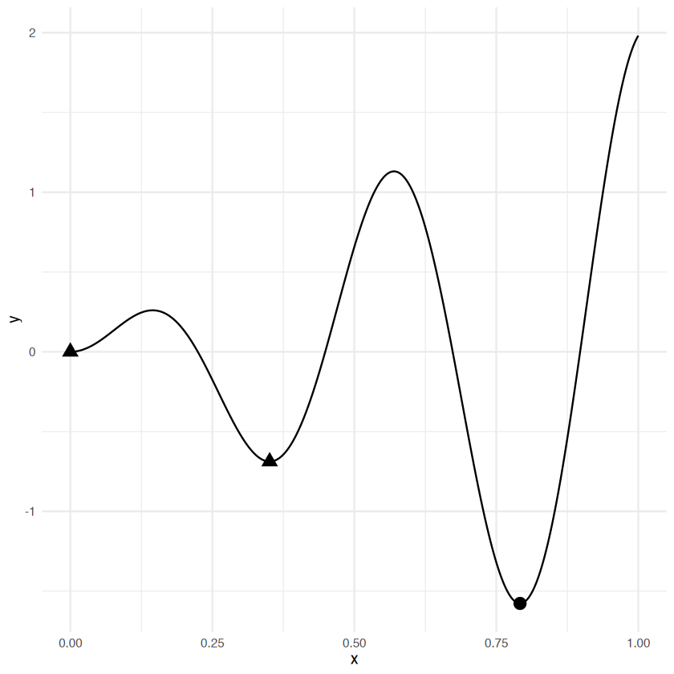

- 定义了目标函数后，可以使用`OptimInstanceBatchSingleCrit`类对其进行优化
  - 这个类允许我们封装目标函数，并显式指定搜索空间
  - 搜索空间定义了我们想要优化的输入值集合，  
   它通常是定义域的一个子集或变换，  
   尽管默认情况下整个定义域被用作搜索空间
  - 在黑盒优化中，定义域以及因此的搜索空间通常具有有限的盒约束
  - 与超参数优化类似，有时可以使用变换来更有效地搜索空间

- 接下来，使用简单随机搜索在整个域上优化正弦函数，并以常规方式检查`instance`的结果
  - 使用`oi()`函数（optimization instance）构建一个优化实例
  - 与`Tuner`类似，`bbotk`中的`Optimizer`存储在`mlr_optimizers`字典中，  
   并且可以使用`opt()`进行构建

- 首先看看`mlr_optimizers`储存了哪些优化器（`Optimizer`类）

```r
mlr_optimizers
```

<table class='dataframe'>
<caption>A data.table: 15 x 5</caption>
<thead>
 <tr><th scope=col>key</th><th scope=col>label</th><th scope=col>param_classes</th><th scope=col>properties</th><th scope=col>packages</th></tr>
 <tr><th scope=col>&lt;chr&gt;</th><th scope=col>&lt;chr&gt;</th><th scope=col>&lt;list&gt;</th><th scope=col>&lt;list&gt;</th><th scope=col>&lt;list&gt;</th></tr>
</thead>
<tbody>
 <tr><td>async_design_points</td><td>Asynchronous Design Points                     </td><td>ParamLgl, ParamInt, ParamDbl, ParamFct, ParamUty</td><td>dependencies, single-crit , multi-crit  , async       </td><td>bbotk, rush </td></tr>
 <tr><td>async_grid_search  </td><td>Asynchronous Grid Search                       </td><td>ParamLgl, ParamInt, ParamDbl, ParamFct</td><td>dependencies, single-crit , multi-crit  , async       </td><td>bbotk, rush </td></tr>
 <tr><td>async_random_search</td><td>Asynchronous Random Search                     </td><td>ParamLgl, ParamInt, ParamDbl, ParamFct</td><td>dependencies, single-crit , multi-crit  , async       </td><td>bbotk, rush </td></tr>
 <tr><td>chain              </td><td>Chain Multiple Optimizers Sequentially         </td><td>ParamLgl, ParamInt, ParamDbl, ParamFct</td><td>dependencies, single-crit , multi-crit  </td><td>bbotk</td></tr>
 <tr><td>cmaes              </td><td>Covariance Matrix Adaptation Evolution Strategy</td><td>ParamDbl</td><td>single-crit</td><td>bbotk , adagio</td></tr>
 <tr><td>design_points      </td><td>Design Points                                  </td><td>ParamLgl, ParamInt, ParamDbl, ParamFct, ParamUty</td><td>dependencies, single-crit , multi-crit  </td><td>bbotk</td></tr>
 <tr><td>focus_search       </td><td>Focus Search                                   </td><td>ParamLgl, ParamInt, ParamDbl, ParamFct</td><td>dependencies, single-crit </td><td>bbotk</td></tr>
 <tr><td>gensa              </td><td>Generalized Simulated Annealing                </td><td>ParamDbl</td><td>single-crit</td><td>bbotk, GenSA</td></tr>
 <tr><td>grid_search        </td><td>Grid Search                                    </td><td>ParamLgl, ParamInt, ParamDbl, ParamFct</td><td>dependencies, single-crit , multi-crit  </td><td>bbotk</td></tr>
 <tr><td>hyperband          </td><td>Hyperband                                      </td><td>ParamLgl, ParamInt, ParamDbl, ParamFct</td><td>dependencies, single-crit , multi-crit  </td><td>bbotk        , mlr3hyperband</td></tr>
 <tr><td>irace              </td><td>Iterated Racing                                </td><td>ParamDbl, ParamInt, ParamFct, ParamLgl</td><td>dependencies, single-crit </td><td>bbotk, irace</td></tr>
 <tr><td>local_search       </td><td>Local Search                                   </td><td>ParamLgl, ParamInt, ParamDbl, ParamFct</td><td>dependencies, single-crit </td><td>bbotk</td></tr>
 <tr><td>nloptr             </td><td>Non-linear Optimization                        </td><td>ParamDbl</td><td>single-crit</td><td>bbotk , nloptr</td></tr>
 <tr><td>random_search      </td><td>Random Search                                  </td><td>ParamLgl, ParamInt, ParamDbl, ParamFct</td><td>dependencies, single-crit , multi-crit  </td><td>bbotk</td></tr>
 <tr><td>successive_halving </td><td>Successive Halving                             </td><td>ParamLgl, ParamInt, ParamDbl, ParamFct</td><td>dependencies, single-crit , multi-crit  </td><td>bbotk        , mlr3hyperband</td></tr>
</tbody>
</table>
- 使用`oi()`构建优化实例并进行优化（类似于`vi()`）
```r
# 构建优化实例
instance <- oi(
 objective,
 # 定义域传递到搜索空间
 search_space = domain,
 # 设定终止器，迭代20次后终止
 terminator = trm('evals', n_evals = 20)
)
# 构建优化器，算法为随机搜索
optimizer <- opt('random_search', batch_size = 20)
optimizer$optimize(instance)
```

<table class='dataframe'>
<caption>A data.table: 1 x 3</caption>
<thead>
 <tr><th scope=col>x</th><th scope=col>x_domain</th><th scope=col>y</th></tr>
 <tr><th scope=col>&lt;dbl&gt;</th><th scope=col>&lt;list&gt;</th><th scope=col>&lt;dbl&gt;</th></tr>
</thead>
<tbody>
 <tr><td>0.7732799</td><td>0.7732799</td><td>-1.524356</td></tr>
</tbody>
</table>

- 也可以使用`bb_optimize`进行实例优化（类似于`tune()`）

```r
optimal <- bb_optimize(
 objective, 
 method = 'random_search',
 max_evals = 20
)
optimal$instance$result
```

<table class='dataframe'>
<caption>A data.table: 1 x 3</caption>
<thead>
 <tr><th scope=col>x</th><th scope=col>x_domain</th><th scope=col>y</th></tr>
 <tr><th scope=col>&lt;dbl&gt;</th><th scope=col>&lt;list&gt;</th><th scope=col>&lt;dbl&gt;</th></tr>
</thead>
<tbody>
 <tr><td>0.7530768</td><td>0.7530768</td><td>-1.35457</td></tr>
</tbody>
</table>

### 贝叶斯优化的构建模块（Building Blocks）

- 步骤：

1. 生成并评估初始设计
2. 循环：
1. 在目前所做的所有观测数据存档上拟合一个代理模型，以对未知的黑箱函数进行建模
2. 优化采集函数，以确定搜索空间中的哪些点是有前景的候选点，应在下一步进行评估
3. 评估下一个候选对象，并更新到目前为止所做的所有观察记录档案
4. 检查是否满足给定的终止条件，如果不满足，则返回步骤 (1)

- 采集函数（acquisition function）依赖于代理模型的均值和标准差预测，  
  无需对真实黑箱函数进行评估，因此优化成本相对较低
- 好的采集函数会在两方面取得平衡：
  - 利用观察到性能良好且代理模型不确定性较低的区域的知识
  - 探索尚未评估过的点且因此代理模型不确定性较高的区域

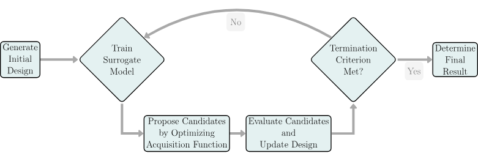

- **构建模块**：`OptimizerMbo`类
  - BO算法循环结构（`loop_function`）
  - 代理模型（`Surrogate`）
  - 采集函数（`AcqFunction`）
  - 采集函数优化器（`AcqOptimizer`）
- 模块由`mlr3mbo`设计并反映

#### 初步设计

- 在拟合代理模型之前评估的初始点集称为**初始设计（Initial Design）**
- 可以用`mlr3mbo` 手动构建初始设计，  
  也可以用 loop_function 为构建并评估初始设计
  - 用`mlr3mbo` 手动构建初始设计可以对初始设计进行更多控制

- 构建初始设计的一种简单方法是使用 `paradox` 中的四个设计生成器之一
  - `generate_design_random()`：随机均匀生成点
  - `generate_design_grid()`：在大小均匀的网格中生成点
  - `generate_design_lhs()`：拉丁超立方抽样（Latin hypercube sampling, LHS）
    - 将每个输入变量划分为大小相等的区间，  
    并确保每个区间恰好由一个采样点表示，从而得到均匀的边缘分布
    - 在LHS设计中，两点之间的最小距离通常会最大化，从而实现对空间的空间填充覆盖
  - `generate_design_sobol()`：Sobol序列（Sobol sequence）
    - 与LHS的工作方式类似，但在维度数量较大时，它能比LHS提供更好的覆盖
- 通常建议在贝叶斯优化（BO）中使用LHS或Sobol设计，  
  但与BO的其他设计选择相比，初始设计的影响通常较小

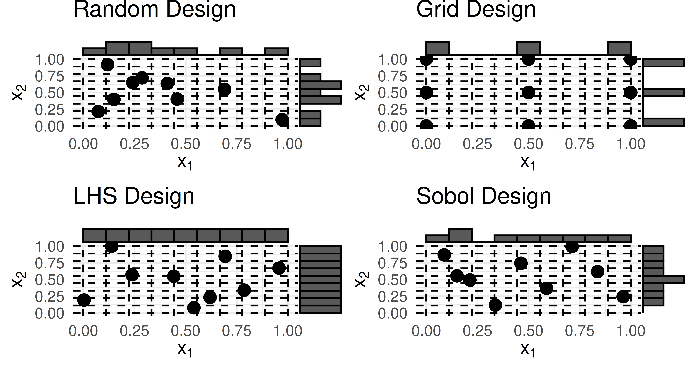

- 生成的`Design`对象是围绕`data.table`的包装器

```r
sample_domain <- ps(x1 = p_dbl(0, 1), x2 = p_dbl(0, 1))
generate_design_random(sample_domain, n = 3)
generate_design_random(sample_domain, n = 3)$data
```

```js
<Design> with 3 rows:
          x1        x2
       <num>     <num>
1: 0.5406415 0.3784440
2: 0.9641830 0.3064937
3: 0.2573565 0.7557893
```

<table class='dataframe'>
<caption>A data.table: 3 x 2</caption>
<thead>
 <tr><th scope=col>x1</th><th scope=col>x2</th></tr>
 <tr><th scope=col>&lt;dbl&gt;</th><th scope=col>&lt;dbl&gt;</th></tr>
</thead>
<tbody>
 <tr><td>0.8539652</td><td>0.1333672</td></tr>
 <tr><td>0.8623679</td><td>0.1129187</td></tr>
 <tr><td>0.1020241</td><td>0.8403042</td></tr>
</tbody>
</table>

- 初始设计也可以通过自定义`data.table`完成

- 在构建初始设计后，进行优化前，  
  需要在`OptimInstance`上进行评估

```r
# 构建目标函数的优化实例
instance <- OptimInstanceSingleCrit$new(
 objective,
 terminator = trm('evals', n_evals = 20)
)
# 构建一个`data.table`类的设计矩阵
design <- data.table(x = c(0.1, 0.34, 0.65, 1))
# 输入设计的矩阵
instance$eval_batch(design)

# 查看输入的定义域数值对应产生的陪域数值
instance$archive$data
```

```js
INFO  [16:59:32.257] [bbotk] Evaluating 4 configuration(s)
INFO  [16:59:32.287] [bbotk] Result of batch 1:
INFO  [16:59:32.288] [bbotk]     x          y
INFO  [16:59:32.288] [bbotk]  0.10  0.1970899
INFO  [16:59:32.288] [bbotk]  0.34 -0.6792294
INFO  [16:59:32.288] [bbotk]  0.65  0.4148279
INFO  [16:59:32.288] [bbotk]  1.00  1.9812147
```

<table class='dataframe'>
<caption>A data.table: 4 x 5</caption>
<thead>
 <tr><th scope=col>x</th><th scope=col>y</th><th scope=col>x_domain</th><th scope=col>timestamp</th><th scope=col>batch_nr</th></tr>
 <tr><th scope=col>&lt;dbl&gt;</th><th scope=col>&lt;dbl&gt;</th><th scope=col>&lt;list&gt;</th><th scope=col>&lt;dttm&gt;</th><th scope=col>&lt;int&gt;</th></tr>
</thead>
<tbody>
 <tr><td>0.10</td><td> 0.1970899</td><td>0.1</td><td>2025-06-23 16:59:32</td><td>1</td></tr>
 <tr><td>0.34</td><td>-0.6792294</td><td>0.34</td><td>2025-06-23 16:59:32</td><td>1</td></tr>
 <tr><td>0.65</td><td> 0.4148279</td><td>0.65</td><td>2025-06-23 16:59:32</td><td>1</td></tr>
 <tr><td>1.00</td><td> 1.9812147</td><td>1</td><td>2025-06-23 16:59:32</td><td>1</td></tr>
</tbody>
</table>

#### 代理模型

- 在`mlr3mbo`中，`SurrogateLearner`是一个R6类
  - 继承自基础`Surrogate`类
  - 旨在构建和管理代理模型，  包括自动构建`TaskRegr`
    - `TaskRegr`在每次BO循环的迭代中被训练
- 代理模型包装了一个回归学习器，  
  该学习器基于观测数据对未知的黑盒函数进行建模
  - 回归学习器可以用任何`mlr3`中的回归学习器
  - 大多数采集函数既依赖于代理模型的**均值预测**，  
   也依赖于**标准差预测**，而后者要求支持`predict_type = 'se'`
- 代理模型的回归学习器的典型选择
  - `lrn('regr.km')`：高斯过程（Gaussian processes）  
   对于低到中等维度的数值搜索空间
  - `lrn('regr.ranger')`：随机森林  
   对于高维度混合（和/或分层）搜索空间

- 下面以高斯过程作为代理模型的算法为例

```r
lrn_gp <- lrn(
 # 选择高斯过程为学习器
 'regr.km', 
 # 使用具有Matérn 5/2核的高斯过程
 covtype = 'matern5_2', 
 # 使用BFGS作为优化器来寻找最优核参数
 optim.method = 'BFGS',
 # 设置`trace = FALSE`以防止在拟合过程中产生过多输出
 control = list(trace = FALSE)
)
```

- 构建`SurrogateLearner`对象：`srlrn()`
  - 需要传递`LearnerRegr`对象与`Instance$archive`

```r
# 需要`mlr3mbo`包
# library(mlr3mbo)

# 构建`SurrogateLearner`对象
surrogate <- srlrn(
 lrn_gp, 
 archive = instance$archive
)

# 通过`SurrogateLearner$update()`的更新来拟合高斯过程
surrogate$update() 
# 访问拟合后的模型
surrogate$learner$model
```

```js
Call:
DiceKriging::km(design = data, response = truth, covtype = 'matern5_2', 
    optim.method = 'BFGS', control = pv$control)

Trend  coeff.:
               Estimate
 (Intercept)     0.7899

Covar. type  : matern5_2 
Covar. coeff.:
               Estimate
    theta(x)     0.3014

Variance estimate: 1.069737
```

#### 采集函数

- 采集函数依赖于代理模型的预测，  
  并量化搜索空间中每个点在下次迭代中进行评估时的预期 **效用（utility）**
- 以下方的 **期望改善（expected improvement）** 为例
  - 在给定代理模型的性能预测的情况下，  
   与目前观察到的最佳函数值（**当前最优值**）相比，  
   可以期望一个候选点提升多少
  - 下方公式中：
    - $Y(x)$：给定输入点 $x$ 的代理模型预测值  
    （一个随机变量，在使用高斯过程时服从正态分布）
    - $f_{min}$ ：目前观测到的最佳函数值（假设为最小化问题）
  - 计算期望提升需要模型给出**均值**和**标准差**预测

$$
\alpha_{\mathrm{EI}}(\mathbf{x}) = \mathbb{E} \left[ \max \left( f_{\mathrm{min}} - Y(\mathbf{x}), 0 \right) \right]
$$

- 在 `mlr3mbo` 中，采集函数为`AcqFunction`类
  - 存储在 `mlr_acqfunctions` 字典中，可以通过 `acqf()` 来构建
  - 在本示例中，使用期望改善（`acqf('ei')`）来选择下一个待评估的候选对象
  - 如之前示例一样，  
   必须更新（`AcqFunction$update()`）`AcqFunction` 对当前最优解的看法，  
   以确保它仍然使用目前观察到的最佳值

```r
acq_function <- acqf('ei', surrogate = surrogate)
acq_function$update()
acq_function$y_best
```

- 使用 `Objective$eval_dt()` 对作为 `data.table` 给出的域评估采集函数
  - 使用高斯过程预测均值和标准误差
  - 在0到1区间的均匀点网格上评估期望改善

```r
# 在0到1间生成1001个数据点
xydt <- generate_design_grid(domain, resolution = 1001)$data
# 用函数f生成x对应的真实y值
xydt[, y := objective$eval_dt(xydt)$y]
# 使用高斯过程计算期望改善
xydt[, ei :=  acq_function$eval_dt(xydt[, 'x'])]
# 使用代理函数预测x对应的y的均值及标准误差
xydt[, c('mean', 'se') :=  surrogate$predict(xydt[, 'x'])]
xydt[1:3]
```

- 通过作图可以发现：  
  在高斯过程的平均预测（灰色点线）较低或不确定性较高的区域，期望提升较高

```r
ggplot(xydt, mapping = aes(x = x, y = y)) +
 geom_point(
  size = 2, 
  data = instance$archive$data
 ) +
 # 目标函数（黑色）
 geom_line() +
 # 代理模型预测均值（灰色点线）
 geom_line(
  aes(y = mean), 
  colour = 'gray', 
  linetype = 2
 ) +
 # 代理模型标准误差范围（灰色点线的条带）
 geom_ribbon(
  aes(min = mean - se, max = mean + se),
  fill = 'gray',
  alpha = 0.3
 ) +
 # 期待提升曲线（灰色实线）
 geom_line(
  aes(y = ei * 40), 
  linewidth = 1, 
  colour = 'darkgray'
 ) +
 scale_y_continuous(
  'y',
     sec.axis = sec_axis(
      ~ . * 0.025, 
      name = 'EI',
      breaks = c(0, 0.025, 0.05)
  )
 ) +
 theme_minimal()
```

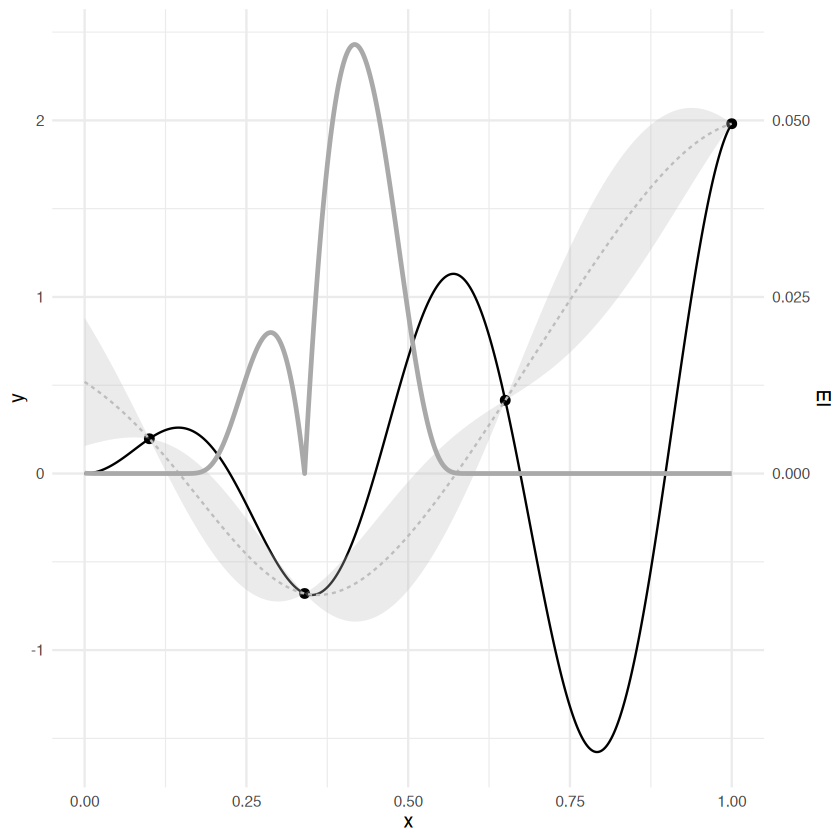

#### 采集函数优化器

- 大多数常用的采集函数具有**非凸性  
  （顺着梯度方向走到底只能保证是局部最优，不能保证是全局最优）**，  
  因此通常采用全局优化技术来优化采集函数
- 优化采集函数的广泛使用方法包括无导数全局优化方法，如：
  - 分支定界算法，如DIRECT算法
  - 多起点局部优化方法，如  
   多次从不同起点运行L - BFGS - B算法或进行局部搜索
- 因此，采集函数的优化问题本身可以作为一个黑盒优化问题来处理，  
  但它比原始问题的成本要低得多
- `AcqOptimizer`类
  - 用于在有限的计算资源内，通过高效搜索潜在候选空间来优化采集函数
  - 用 `acqo()` 构建
    - 该函数将 `Optimizer`、`Terminator`和采集函数作为输入
    - 优化器存储在 `mlr_optimizers` 字典中，并且可以通过便捷函数 `opt()` 构建

```r
mlr_optimizers %>% as.data.table()
```

<table class='dataframe'>
<caption>A data.table: 18 x 5</caption>
<thead>
 <tr><th scope=col>key</th><th scope=col>label</th><th scope=col>param_classes</th><th scope=col>properties</th><th scope=col>packages</th></tr>
 <tr><th scope=col>&lt;chr&gt;</th><th scope=col>&lt;chr&gt;</th><th scope=col>&lt;list&gt;</th><th scope=col>&lt;list&gt;</th><th scope=col>&lt;list&gt;</th></tr>
</thead>
<tbody>
 <tr><td>adbo               </td><td>Asynchronous Decentralized Bayesian Optimization</td><td>ParamLgl, ParamInt, ParamDbl, ParamFct</td><td>dependencies, single-crit </td><td>mlr3mbo, rush   </td></tr>
 <tr><td>async_design_points</td><td>Asynchronous Design Points                      </td><td>ParamLgl, ParamInt, ParamDbl, ParamFct, ParamUty</td><td>dependencies, single-crit , multi-crit  , async       </td><td>bbotk, rush </td></tr>
 <tr><td>async_grid_search  </td><td>Asynchronous Grid Search                        </td><td>ParamLgl, ParamInt, ParamDbl, ParamFct</td><td>dependencies, single-crit , multi-crit  , async       </td><td>bbotk, rush </td></tr>
 <tr><td>async_mbo          </td><td>Asynchronous Model Based Optimization           </td><td>ParamLgl, ParamInt, ParamDbl, ParamFct</td><td>dependencies, single-crit </td><td>mlr3mbo, rush   </td></tr>
 <tr><td>async_random_search</td><td>Asynchronous Random Search                      </td><td>ParamLgl, ParamInt, ParamDbl, ParamFct</td><td>dependencies, single-crit , multi-crit  , async       </td><td>bbotk, rush </td></tr>
 <tr><td>chain              </td><td>Chain Multiple Optimizers Sequentially          </td><td>ParamLgl, ParamInt, ParamDbl, ParamFct</td><td>dependencies, single-crit , multi-crit  </td><td>bbotk</td></tr>
 <tr><td>cmaes              </td><td>Covariance Matrix Adaptation Evolution Strategy </td><td>ParamDbl</td><td>single-crit</td><td>bbotk , adagio</td></tr>
 <tr><td>design_points      </td><td>Design Points                                   </td><td>ParamLgl, ParamInt, ParamDbl, ParamFct, ParamUty</td><td>dependencies, single-crit , multi-crit  </td><td>bbotk</td></tr>
 <tr><td>focus_search       </td><td>Focus Search                                    </td><td>ParamLgl, ParamInt, ParamDbl, ParamFct</td><td>dependencies, single-crit </td><td>bbotk</td></tr>
 <tr><td>gensa              </td><td>Generalized Simulated Annealing                 </td><td>ParamDbl</td><td>single-crit</td><td>bbotk, GenSA</td></tr>
 <tr><td>grid_search        </td><td>Grid Search                                     </td><td>ParamLgl, ParamInt, ParamDbl, ParamFct</td><td>dependencies, single-crit , multi-crit  </td><td>bbotk</td></tr>
 <tr><td>hyperband          </td><td>Hyperband                                       </td><td>ParamLgl, ParamInt, ParamDbl, ParamFct</td><td>dependencies, single-crit , multi-crit  </td><td>bbotk        , mlr3hyperband</td></tr>
 <tr><td>irace              </td><td>Iterated Racing                                 </td><td>ParamDbl, ParamInt, ParamFct, ParamLgl</td><td>dependencies, single-crit </td><td>bbotk, irace</td></tr>
 <tr><td>local_search       </td><td>Local Search                                    </td><td>ParamLgl, ParamInt, ParamDbl, ParamFct</td><td>dependencies, single-crit </td><td>bbotk</td></tr>
 <tr><td>mbo                </td><td>Model Based Optimization                        </td><td>ParamLgl, ParamInt, ParamDbl, ParamFct</td><td>dependencies, single-crit , multi-crit  </td><td>mlr3mbo</td></tr>
 <tr><td>nloptr             </td><td>Non-linear Optimization                         </td><td>ParamDbl</td><td>single-crit</td><td>bbotk , nloptr</td></tr>
 <tr><td>random_search      </td><td>Random Search                                   </td><td>ParamLgl, ParamInt, ParamDbl, ParamFct</td><td>dependencies, single-crit , multi-crit  </td><td>bbotk</td></tr>
 <tr><td>successive_halving </td><td>Successive Halving                              </td><td>ParamLgl, ParamInt, ParamDbl, ParamFct</td><td>dependencies, single-crit , multi-crit  </td><td>bbotk        , mlr3hyperband</td></tr>
</tbody>
</table>

```r
acq_optimizer <- acqo(
 # 调优器是非线性调优
 # 算法是'NLOPT_GN_ORIG_DIRECT'
 optimizer = opt('nloptr', algorithm = 'NLOPT_GN_ORIG_DIRECT'),
 # 使用停滞超体积终止器，迭代100次，当提升小于1e-5时终止
 terminator = trm('stagnation', iters = 100, threshold = 1e-5),
 # 传递要调优的
 acq_function = acq_function
)

candidate <- acq_optimizer$optimize()
candidate
```

<table class='dataframe'>
<caption>A data.table: 1 x 4</caption>
<thead>
 <tr><th scope=col>x</th><th scope=col>acq_ei</th><th scope=col>x_domain</th><th scope=col>.already_evaluated</th></tr>
 <tr><th scope=col>&lt;dbl&gt;</th><th scope=col>&lt;dbl&gt;</th><th scope=col>&lt;list&gt;</th><th scope=col>&lt;lgl&gt;</th></tr>
</thead>
<tbody>
 <tr><td>0.417289</td><td>0.06074387</td><td>0.417289</td><td>FALSE</td></tr>
</tbody>
</table>

#### 使用和构建循环函数

- 使用`loop_function`可以在全局层面决定贝叶斯优化算法的行为
  - 通过定义每次迭代时执行的子例程（subroutine），  
   以生成新的待评估候选对象
- `loop_function`储存在`mlr_loop_functions`字典中

```r
as.data.table(mlr_loop_functions)[, .(key, label, instance)]
```

<table class='dataframe'>
<caption>A data.table: 5 x 3</caption>
<thead>
 <tr><th scope=col>key</th><th scope=col>label</th><th scope=col>instance</th></tr>
 <tr><th scope=col>&lt;chr&gt;</th><th scope=col>&lt;chr&gt;</th><th scope=col>&lt;chr&gt;</th></tr>
</thead>
<tbody>
 <tr><td>bayesopt_ego   </td><td>Efficient Global Optimization</td><td>single-crit</td></tr>
 <tr><td>bayesopt_emo   </td><td>Multi-Objective EGO          </td><td>multi-crit </td></tr>
 <tr><td>bayesopt_mpcl  </td><td>Multipoint Constant Liar     </td><td>single-crit</td></tr>
 <tr><td>bayesopt_parego</td><td>ParEGO                       </td><td>multi-crit </td></tr>
 <tr><td>bayesopt_smsego</td><td>SMS-EGO                      </td><td>multi-crit </td></tr>
</tbody>
</table>

- 可以使用上述的循环函数，也可以自行编写
- 下面使用 **高效全局优化（Efficient Global Optimization, EGO）** 进行循环全局优化
  - 在设定好了贝叶斯优化组件后，循环执行：
    - 更新代理模型
    - 更新采集函数
    - 优化采集函数以生成新的候选解
    - 评估候选解并添加到存档`archive`中
  - 如果在循环过程中出现错误，则会使用回退机制，  
   即随机均匀地提出下一个候选解，  
   确保即使存在潜在问题，该过程仍能继续进行

- 这里是手动构建一个简化版的EGO算法代码，  
  也可以**用来回顾上方的流程**

```r
my_simple_ego <- function(
 # 设定了贝叶斯优化部件
 instance, # 实例
 surrogate, # 代理模型
 acq_function, # 采集函数
 acq_optimizer, # 采集函数调优器
 # 这里的初始设计是`generate_design_sobol()`的参数`n`
 init_design_size 
  ) {

 # 下面这段可以看清楚这几个部件之间的传递关系
 # 实例存档传递到代理模型存档
 surrogate$archive <- instance$archive 
 # 代理模型传递到采集函数
 acq_function$surrogate <- surrogate
 # 采集函数传递到采集函数调整器
 acq_optimizer$acq_function <- acq_function 
 # 调取搜索空间
 search_space <- instance$search_space

  # 初始设计
  design <- generate_design_sobol(
   search_space, 
   n = init_design_size
  )$data
  # 生成y
  instance$eval_batch(design)

  # 基于模型的优化（MBO）的循环
  repeat {
 candidate <- tryCatch({
  # 更新代理模型
  acq_function$surrogate$update()
  # 更新采集函数
  acq_function$update()
  # 采集函数调优器调优
  acq_optimizer$optimize()
 }, 
 # 当发生错误时，使用备选方法：随机搜索
 mbo_error = function(mbo_error_condition) {
      generate_design_random(search_space, n = 1L)$data
 }) # 1L 表示整数型的 1

    # 评估候选点并保存到存档中
    tryCatch({
      instance$eval_batch(candidate)
    }, 
    terminated_error = function(cond) {
      # 这里写终止条件（如达到最大评估次数）
      # ......
    })
    # 检查终止条件
    if (instance$is_terminated) break
  }

  return(instance)
}
```

### 使用OptimizerMbo实现贝叶斯优化自动化

- 上面是手动构建贝叶斯优化的流程
- 可以将上述构建模块封装到`opt()`构建的`OptimizerMbo`对象中执行自动化贝叶斯优化

```r
# 构建循环函数
bayesopt_ego <- mlr_loop_functions$get('bayesopt_ego')
# 构建代理模型
surrogate <- srlrn(
 lrn(
  'regr.km', 
  covtype = 'matern5_2',
  optim.method = 'BFGS', 
  control = list(trace = FALSE)
 )
)
# 构建采集函数
acq_function <- acqf('ei')
# 构建采集函数模拟器优化器
acq_optimizer <- acqo(
 # 优化器算法
 opt(
  'nloptr', 
  algorithm = 'NLOPT_GN_ORIG_DIRECT'
 ),
 # 终止器算法
 terminator = trm(
  'stagnation', 
  iters = 100, 
  threshold = 1e-5
 )
)
# 用`opt()`进行自动化BO封装
optimizer <- opt(
 'mbo',
 loop_function = bayesopt_ego,
 surrogate = surrogate,
 acq_function = acq_function,
 acq_optimizer = acq_optimizer
)
```

- 构建优化实例

```r
instance <- OptimInstanceBatchSingleCrit$new(
 objective,
 terminator = trm('evals', n_evals = 20)
)
```

-

```r
design <- data.table(x = c(0.1, 0.34, 0.65, 1))
instance$eval_batch(design)
optimizer$optimize(instance)
```

<table class='dataframe'>
<caption>A data.table: 1 x 3</caption>
<thead>
 <tr><th scope=col>x</th><th scope=col>x_domain</th><th scope=col>y</th></tr>
 <tr><th scope=col>&lt;dbl&gt;</th><th scope=col>&lt;list&gt;</th><th scope=col>&lt;dbl&gt;</th></tr>
</thead>
<tbody>
 <tr><td>0.7921811</td><td>0.7921811</td><td>-1.577224</td></tr>
</tbody>
</table>

- 如果用`Instance$archive`做图的话可以得到下面这个：
  - 贝叶斯优化算法的采样轨迹初始设计的点用黑色三角形表示；  
   随着算法的推进，采样点用圆点表示，颜色从黑色逐渐变为白色
  - 在第17轮迭代的时候，采样点就来到了全局最优值的地方
- 然而，即使在优化的后期阶段，该算法仍在探索新的区域
  - 这表明期望提升采集函数确实如我们所要求的那样，  
   在探索和利用之间取得了平衡

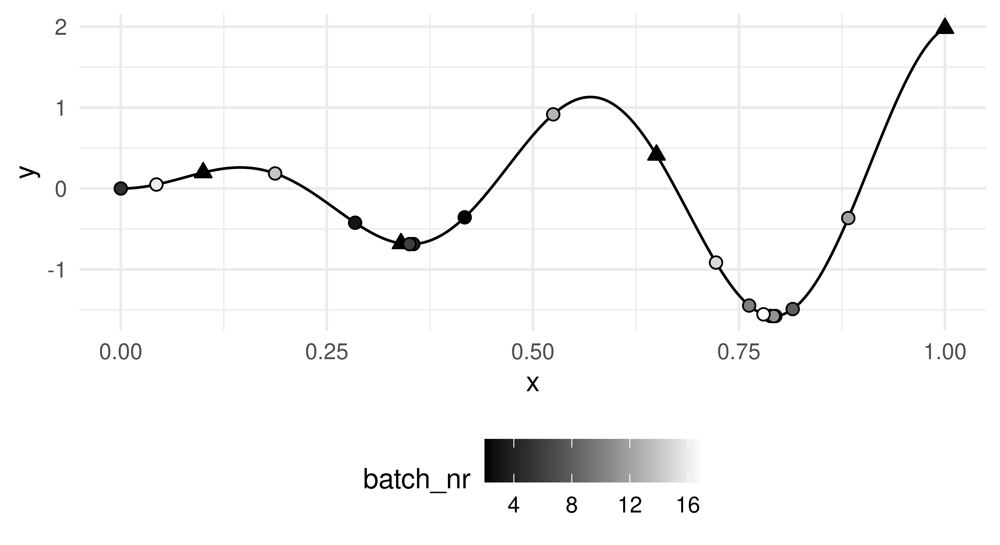

-　顺便看看`Instance$archive` 的结果

```r
instance$archive %>% as.data.table()
```

<table class='dataframe'>
<caption>A data.table: 20 x 7</caption>
<thead>
 <tr><th scope=col>x</th><th scope=col>y</th><th scope=col>timestamp</th><th scope=col>batch_nr</th><th scope=col>acq_ei</th><th scope=col>.already_evaluated</th><th scope=col>x_domain_x</th></tr>
 <tr><th scope=col>&lt;dbl&gt;</th><th scope=col>&lt;dbl&gt;</th><th scope=col>&lt;dttm&gt;</th><th scope=col>&lt;int&gt;</th><th scope=col>&lt;dbl&gt;</th><th scope=col>&lt;lgl&gt;</th><th scope=col>&lt;dbl&gt;</th></tr>
</thead>
<tbody>
 <tr><td>1.000000e-01</td><td> 1.970899e-01</td><td>2025-06-24 19:19:37</td><td> 1</td><td>           NA</td><td>   NA</td><td>1.000000e-01</td></tr>
 <tr><td>3.400000e-01</td><td>-6.792294e-01</td><td>2025-06-24 19:19:37</td><td> 1</td><td>           NA</td><td>   NA</td><td>3.400000e-01</td></tr>
 <tr><td>6.500000e-01</td><td> 4.148279e-01</td><td>2025-06-24 19:19:37</td><td> 1</td><td>           NA</td><td>   NA</td><td>6.500000e-01</td></tr>
 <tr><td>1.000000e+00</td><td> 1.981215e+00</td><td>2025-06-24 19:19:37</td><td> 1</td><td>           NA</td><td>   NA</td><td>1.000000e+00</td></tr>
 <tr><td>4.172890e-01</td><td>-3.563394e-01</td><td>2025-06-24 19:19:38</td><td> 2</td><td> 6.074387e-02</td><td>FALSE</td><td>4.172890e-01</td></tr>
 <tr><td>2.843317e-01</td><td>-4.230907e-01</td><td>2025-06-24 19:19:39</td><td> 3</td><td> 6.085101e-02</td><td>FALSE</td><td>2.843317e-01</td></tr>
 <tr><td>3.549510e-01</td><td>-6.866001e-01</td><td>2025-06-24 19:19:40</td><td> 4</td><td> 9.136180e-03</td><td>FALSE</td><td>3.549510e-01</td></tr>
 <tr><td>2.540263e-05</td><td> 1.806822e-08</td><td>2025-06-24 19:19:41</td><td> 5</td><td> 1.969525e-03</td><td>FALSE</td><td>2.540263e-05</td></tr>
 <tr><td>3.503277e-01</td><td>-6.877539e-01</td><td>2025-06-24 19:19:42</td><td> 6</td><td> 1.806029e-03</td><td>FALSE</td><td>3.503277e-01</td></tr>
 <tr><td>7.881166e-01</td><td>-1.575092e+00</td><td>2025-06-24 19:19:42</td><td> 7</td><td> 3.460028e-05</td><td>FALSE</td><td>7.881166e-01</td></tr>
 <tr><td>8.152467e-01</td><td>-1.490192e+00</td><td>2025-06-24 19:19:43</td><td> 8</td><td> 4.368291e-02</td><td>FALSE</td><td>8.152467e-01</td></tr>
 <tr><td>7.942641e-01</td><td>-1.576307e+00</td><td>2025-06-24 19:19:44</td><td> 9</td><td> 4.720211e-03</td><td>FALSE</td><td>7.942641e-01</td></tr>
 <tr><td>7.624092e-01</td><td>-1.446524e+00</td><td>2025-06-24 19:19:45</td><td>10</td><td> 6.985420e-09</td><td>FALSE</td><td>7.624092e-01</td></tr>
 <tr><td>7.921811e-01</td><td>-1.577224e+00</td><td>2025-06-24 19:19:47</td><td>11</td><td> 9.251675e-04</td><td>FALSE</td><td>7.921811e-01</td></tr>
 <tr><td>8.827160e-01</td><td>-3.651653e-01</td><td>2025-06-24 19:19:49</td><td>12</td><td> 7.987685e-20</td><td>FALSE</td><td>8.827160e-01</td></tr>
 <tr><td>5.246914e-01</td><td> 9.167112e-01</td><td>2025-06-24 19:19:50</td><td>13</td><td> 5.535251e-21</td><td>FALSE</td><td>5.246914e-01</td></tr>
 <tr><td>1.872428e-01</td><td> 1.861373e-01</td><td>2025-06-24 19:19:51</td><td>14</td><td> 1.408867e-24</td><td>FALSE</td><td>1.872428e-01</td></tr>
 <tr><td>7.222222e-01</td><td>-9.153515e-01</td><td>2025-06-24 19:19:53</td><td>15</td><td> 7.389664e-67</td><td>FALSE</td><td>7.222222e-01</td></tr>
 <tr><td>4.320988e-02</td><td> 4.914789e-02</td><td>2025-06-24 19:19:54</td><td>16</td><td>8.721303e-111</td><td>FALSE</td><td>4.320988e-02</td></tr>
 <tr><td>7.798354e-01</td><td>-1.554943e+00</td><td>2025-06-24 19:19:55</td><td>17</td><td>1.960345e-163</td><td>FALSE</td><td>7.798354e-01</td></tr>
</tbody>
</table>

- 如果将贝叶斯优化算法运行十次（采用随机初始设计和不同的随机种子），  
  并与随机搜索进行比较
  - 可以看到，贝叶斯优化的性能更好，平均在大约15次函数评估后就能达到全局最优
  - 正如预期的那样，初始设计规模的性能与随机搜索的性能相近

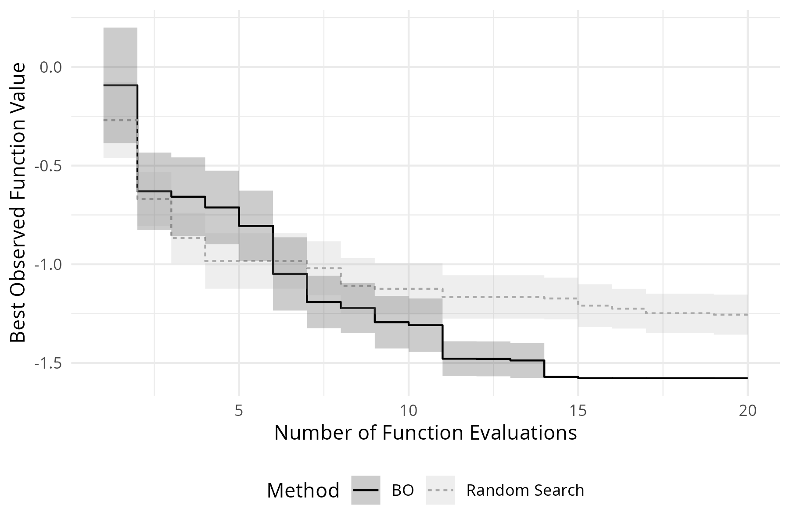

### 用于超参数优化的贝叶斯优化

- 使用`mlr3mbo`的`TunerMbo`类可以进行超参数优化
  - `TunerMbo`类是`OptimizerMbo`的包装器
- 下面例子中，在`tsk('sonar'`)上使用径向核，通过3折CV来调整  
   `lrn('classif.svm')` 的 `cost` 和 `gamma` 参数

```r
# 构建调优器
tuner <- tnr(
 # 选择基于模型的调优
 'mbo',
 # 选择贝叶斯优化的EGO算法
 loop_function = bayesopt_ego,
 # 传递代理模型
 surrogate = surrogate,
 # 传递采集函数
 acq_function = acq_function,
 # 传递采集函数调优器
 acq_optimizer = acq_optimizer
)

# 构建学习器
lrn_svm <- lrn(
 # 选择支持向量机
 'classif.svm', 
 # 选择radial内核
 kernel = 'radial',
 # 选择分类问题
 type = 'C-classification',
 # 选择`cost`和`gamma`的调优范围
 cost  = to_tune(1e-5, 1e5, logscale = TRUE),
 gamma = to_tune(1e-5, 1e5, logscale = TRUE)
)

# 进行实例调优
instance <- tune(
 tuner, 
 tsk('sonar'), 
 lrn_svm, 
 # 使用3折CV进行重采样
 rsmp('cv', folds = 3),
 # 使用交叉熵评估器
 msr('classif.ce'), 
 # 迭代次数25次
 25
)

instance$result
```

<table class='dataframe'>
<caption>A data.table: 1 x 5</caption>
<thead>
 <tr><th scope=col>cost</th><th scope=col>gamma</th><th scope=col>learner_param_vals</th><th scope=col>x_domain</th><th scope=col>classif.ce</th></tr>
 <tr><th scope=col>&lt;dbl&gt;</th><th scope=col>&lt;dbl&gt;</th><th scope=col>&lt;list&gt;</th><th scope=col>&lt;list&gt;</th><th scope=col>&lt;dbl&gt;</th></tr>
</thead>
<tbody>
 <tr><td>8.287107</td><td>-3.762188</td><td>radial            , C-classification  , 3972.32580037573  , 0.0232328628271241</td><td>3.972326e+03, 2.323286e-02</td><td>0.110628</td></tr>
</tbody>
</table>

- 接下来是多评估标准的例子
  - 评估的标准是 真阳性率（TPR），假阳性率（FPR）
    - 前者越大越好，后者越小越好

```r
tuner <- tnr(
 'mbo',
 loop_function = bayesopt_parego,
 surrogate = surrogate,
 acq_function = acq_function,
 acq_optimizer = acq_optimizer
)

lrn_rpart <- lrn(
 'classif.rpart',
 cp = to_tune(1e-04, 1e-1),
 minsplit = to_tune(2, 64),
 maxdepth = to_tune(1, 30)
)

instance <- tune(
 tuner, 
 tsk('sonar'), 
 lrn_svm, 
 rsmp('cv', folds = 3),
 # 这里就是2个评估器：
 # 真阳性率（TPR），假阳性率（FPR）
 msrs(c('classif.tpr', 'classif.fpr')), 
 25
)

instance$result
```

<table class='dataframe'>
<caption>A data.table: 4 x 6</caption>
<thead>
 <tr><th scope=col>cost</th><th scope=col>gamma</th><th scope=col>learner_param_vals</th><th scope=col>x_domain</th><th scope=col>classif.tpr</th><th scope=col>classif.fpr</th></tr>
 <tr><th scope=col>&lt;dbl&gt;</th><th scope=col>&lt;dbl&gt;</th><th scope=col>&lt;list&gt;</th><th scope=col>&lt;list&gt;</th><th scope=col>&lt;dbl&gt;</th><th scope=col>&lt;dbl&gt;</th></tr>
</thead>
<tbody>
 <tr><td>-2.078838</td><td>-4.156062</td><td>radial            , C-classification  , 0.125075520793627 , 0.0156691447439775</td><td>0.12507552, 0.01566914</td><td>1.0000000</td><td>0.7383860</td></tr>
 <tr><td> 3.126967</td><td>-4.221932</td><td>radial            , C-classification  , 22.8047172214673  , 0.0146702678401885</td><td>22.80471722, 0.01467027</td><td>0.9081787</td><td>0.1999920</td></tr>
 <tr><td> 3.411237</td><td>-4.264046</td><td>radial            , C-classification  , 30.302710828664   , 0.0140652724210524</td><td>30.30271083, 0.01406527</td><td>0.9081787</td><td>0.1999920</td></tr>
 <tr><td> 6.395485</td><td>-2.990097</td><td>radial            , C-classification  , 599.133704193403  , 0.0502825699974251</td><td>599.13370419, 0.05028257</td><td>0.9264098</td><td>0.2588602</td></tr>
</tbody>
</table>

### 含噪声贝叶斯优化

- 现实生活中模型是受到噪声影响的 -> 误差
  - 在`bbotk`中，可以通过将`'noisy'`标签传递给`properties`参数，  
   将`Objective`对象标记为有噪声的
    - 这使我们能够使用可以对这类目标进行不同处理的方法

```r
# 定义一个受到误差干扰的目标函数
sinus_1D_noisy <- function(xs) {
  y <- 2 * xs$x * sin(14 * xs$x) + 
   # 这里以正态随机分布随机生成1个均值为0标准偏差为0.1的误差项为例
   rnorm(1, mean = 0, sd = 0.1)
  return(y)
}
# 定义域
domain <- ps(x = p_dbl(lower = 0, upper = 1))
# 陪域
codomain <- ps(y = p_dbl(tags = 'minimize'))
# 
objective_noisy <- ObjectiveRFun$new(
 sinus_1D_noisy,
 domain = domain, 
 codomain = codomain, 
 # 对目标函数标记有噪声
 properties = 'noisy'
)
```

- 对于带有噪声的目标函数，处理方法有：
  - 使用代理模型来考虑噪声
  - 使用一种考虑噪声的采集函数
  - 优化后的最终最佳点（即实例的 `Instance$result` 字段）的选择方式  
   可以反映噪声情况

- 如果使用代理模型来考虑噪声，  
  可以不用插值高斯过程（interpolating Gaussian process），  
  而是使用高斯过程回归（Gaussian process regression）
  - 这将导致高斯过程无法完美地对训练数据进行插值，  
   并且与训练数据相关的标准差预测将不为零
    - 这反映了由于测量误差导致的观测函数值的不确定性

```r
srlrn(
 lrn(
  'regr.km', 
  # 设置`nugget.estim = TRUE`使用高斯过程回归
  nugget.estim = TRUE
 )
)
```

- 如果使用一种考虑噪声的采集函数，  
  可以使用增强期望提升（Augmented expected improvement）
  - 本质上是对期望提升进行重新缩放，同时考虑了测量误差

```r
acq_function <- acqf('aei')
```

- 最后，`mlr3mbo` 允许通过结果分配器（assigner）  
  明确指定优化后的最终结果如何分配给优化实例（即 `Instance$result` 中保存的内容）
  - 可以在构建 `OptimizerMbo` 或 `TunerMbo` 时指定结果分配器
  - `ResultAssignerSurrogate` 使用代理模型预测所有评估点的均值，  
   然后选择均值预测最佳的点作为最终优化结果
  - 默认方法 `ResultAssignerArchive` 仅根据 `archive` 中记录的评估结果选择最佳点
  - 结果分配器存储在 `mlr_result_assigners` 字典中，  
   可以使用 `ras()` 构建

```r
opt(
 'mbo',
 loop_function = bayesopt_ego,
 surrogate = surrogate,
 acq_function = acq_function,
 acq_optimizer = acq_optimizer,
 result_assigner = ras('surrogate')
)
```

- 其实结果分配器就两种

```r
mlr_result_assigners %>% as.data.table()
```

<table class='dataframe'>
<caption>A data.table: 2 x 3</caption>
<thead>
 <tr><th scope=col>key</th><th scope=col>label</th><th scope=col>man</th></tr>
 <tr><th scope=col>&lt;chr&gt;</th><th scope=col>&lt;chr&gt;</th><th scope=col>&lt;chr&gt;</th></tr>
</thead>
<tbody>
 <tr><td>archive  </td><td>Archive                  </td><td>mlr3mbo::mlr_result_assigners_archive  </td></tr>
 <tr><td>surrogate</td><td>Mean Surrogate Prediction</td><td>mlr3mbo::mlr_result_assigners_surrogate</td></tr>
</tbody>
</table>

### 贝叶斯优化中的实际考量

- `mlr3mbo`包在代理模型、采集函数、采集函数优化器甚至循环函数的选择上使用合理的默认值
  - 例如在纯数值搜索空间的情况下，  
   `mlr3mbo` 默认将使用高斯过程作为代理模型，  
   并使用随机森林作为回退学习器，  
   此外还封装了学习器
  - 在不指定任何与默认值不同的情况下执行贝叶斯优化，并且仍然期望获得不错的优化性能
  -  [`mbo_defaults`](https://mlr3mbo.mlr-org.com/reference/mbo_defaults.html) 的帮助页面给出了这些默认值

#### 错误处理（Error Handling）

- 在贝叶斯优化的背景下，构建模块有**很大的潜在失败空间**，这可能会破坏整个过程
  - 例如，如果训练数据中的两个点彼此**过于接近**，拟合高斯过程代理模型可能会失败
- mlr3mbo 有几个内置的安全机制来捕获错误
  - `Surrogate` 包含 `catch_errors` 配置控制参数，  
   如果将其设置为 TRUE，则会捕获在代理模型训练或更新期间发生的所有错误
  - `AcqOptimizer` 也有 `catch_errors` 配置控制参数，  
   可用于捕获在采集函数优化期间发生的所有错误，  
   无论是由于代理模型预测失败还是采集函数优化器出错
  - 如果在这些步骤中的任何一步捕获到错误，  
   任何 `loop_function` 的标准行为是**触发回退学习器**，  
   即随机均匀地提出下一个候选解
  - 注意：为 `AcqOptimizer` 设置 `catch_errors = TRUE` 时，  
   通常无需也为 `Surrogate` 显式设置 `catch_errors = TRUE`
    - 不过这在调试时可能会有用
  - 在**最坏**的情况下，如果所有迭代都出错，贝叶斯优化算法将**直接进行随机搜索**
  - **理想**情况下，还应使用**回退学习器**，在随机提出下一个候选解之前将采用该学习器
  - 采集函数的值也始终记录在优化实例的存档中，  
   因此检查该值是个好主意，以确保算法按预期运行

#### 代理模型

- 在实践中，用户可能更喜欢一种更稳健的贝叶斯优化变体，  
  而不是一种可能性能更好但不稳定的变体
- 即使`catch_errors`参数已打开且从未触发，也不能保证BO算法按预期运行
  - 例如，高斯过程对核函数及其参数的选择很敏感，  
   这些参数通常通过最大似然估计来估算，  
   次优的参数值可能会导致具有恒定均值和标准差预测的白噪声模型
  - 在这种情况下，代理模型将无法提供有用的均值和标准差预测，  
   从而导致BO算法的整体性能不佳
- 关于代理模型选择的另一个实际考虑因素可能是开销
  - 拟合一个普通高斯过程的计算量与数据点的数量呈三次方关系，  
   因此BO算法的开销会随着迭代次数的增加而增长
- 普通高斯过程本身无法处理分类输入变量或搜索空间中的依赖关系  
  （在超参数优化中，我们经常处理混合层次空间）
  - 相比之下，随机森林（在SMAC中广泛用作代理模型）训练成本低，  
   在某种意义上相当稳健
    - 因为它不像高斯过程那样对其超参数敏感
    - 并且可以轻松处理混合层次空间
  - 不利的一面是，随机森林并非真正的贝叶斯模型（即不存在后验预测分布），  
   并且在不确定性估计和外推方面表现不佳

#### 热启动（Warmstarting）

- 热启动是优化中的一种技术
  - 它利用先前的优化运行来提高新的相关优化运行的收敛速度和最终解决方案
- 在贝叶斯优化中，热启动可以通过在初始设计中  
  提供一组可能表现良好的配置来实现
  - 这种方法特别有利，因为它允许代理模型在相关区域中利用优化空间的先验知识开始
- 在`mlr3mbo`中，通过指定自定义初始设计，热启动很简单
- 此外，`mlr3mbo`的一个便捷功能是，即使在优化运行终止后，  
  也能够以在线方式继续优化
  - `OptimizerMbo`和`TunerMbo`都支持此功能，  
   即使先前的优化被中断或终止，也能在给定实例上恢复优化

#### 终止

- 常见的终止准则包括：
  - 在固定次数的评估后停止
  - 一旦达到给定的时间预算
  - 当性能达到一定水平时
  - 当性能提升停滞时
- 在贝叶斯优化的背景下，  
  如果最佳采集函数值降至某个阈值以下，停止优化也是合理的
  - 例如，如果下一个候选解的预期改进可以忽略不计，  
   终止优化可能是一种合理的方法
- *然而目前基于采集函数的终止器尚未实现*

#### 并行化

- 大多数贝叶斯优化算法的标准行为是  
  按顺序提出下一个应评估的单个候选方案
- 如果将贝叶斯优化用于超参数优化，那么最有效的方法是对嵌套重采样进行并行化
- 如果循环函数支持批量提出候选方案（例如`bayesopt_parego()`），  
  那么可以设置循环函数的 `q` 参数，  
  以便在每次迭代中提出 `q` 个候选方案
  - 如果 `Objective` 实现得当，这些候选方案可以并行评估
