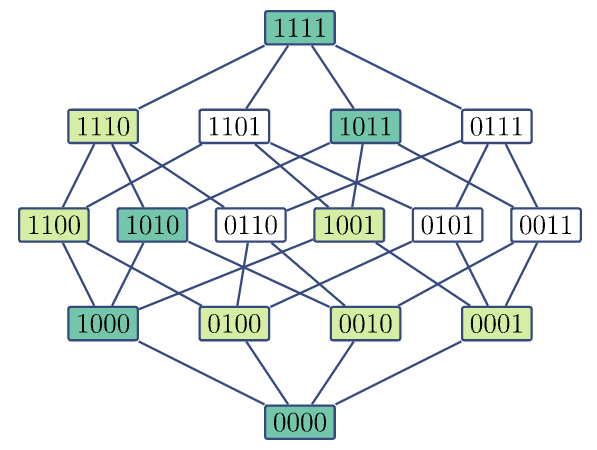
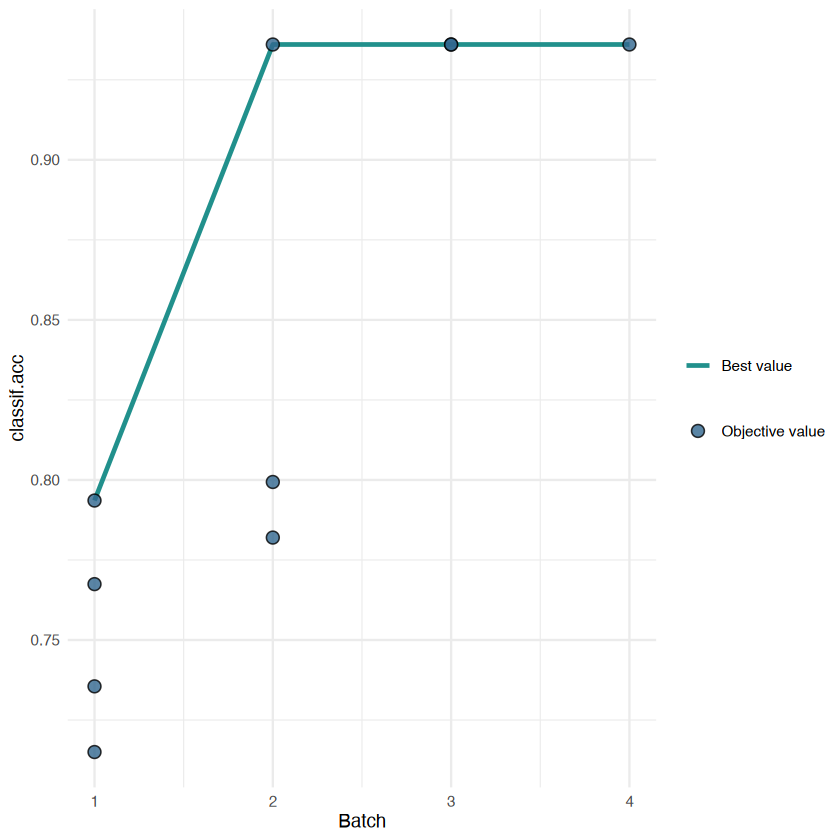

> - Cover Pic by [@humugo](https://www.pixiv.net/artworks/131750399)  

> [Applied Machine Learning Using mlr3 in R](https://mlr3book.mlr-org.com/)

## 特征选择

- 特征选择的目的
  - 提高预测性能，因为我们减少了对无关特征的过拟合
  - 不依赖噪声特征的稳健模型
  - 更简单且易于解释的模型
  - 更快的模型拟合，例如用于模型更新
  - 无需收集可能成本高昂的特征

### 过滤器（Filter）

- 设置过滤器可以在训练模型前简单筛除一些无关特征变量，例如：
  - 计算每个特征与数值型目标变量相关系数$\rho$，  
   并选择$\rho > 2$的特征变量
- 一些更先进的方法，例如基于特征重要性的多变量过滤器通常表现更好
- 单变量过滤器的一个优点是，它们通常比更复杂的过滤或包装方法计算成本更低

- 过滤算法通过为每个特征分配数值分数来选择特征
  - 例如，特征与目标变量之间的相关性，  
   使用这些分数对特征进行排序，  
   并根据排序选择特征子集，  
   在后续建模步骤中，得分较低的特征将被忽略
- 所有过滤器（`Filter`类）均通过包 `mlr3filters` 实现
- 可以通过`mlr_filters`字典查询所有过滤器，  
  通过`flt()`函数来调取对应过滤器

```r
mlr_filters %>% as.data.table()
```

<table class='dataframe'>
<caption>A data.table: 23 x 7</caption>
<thead>
 <tr><th scope=col>key</th><th scope=col>label</th><th scope=col>task_types</th><th scope=col>task_properties</th><th scope=col>params</th><th scope=col>feature_types</th><th scope=col>packages</th></tr>
 <tr><th scope=col>&lt;chr&gt;</th><th scope=col>&lt;chr&gt;</th><th scope=col>&lt;list&gt;</th><th scope=col>&lt;list&gt;</th><th scope=col>&lt;list&gt;</th><th scope=col>&lt;list&gt;</th><th scope=col>&lt;list&gt;</th></tr>
</thead>
<tbody>
 <tr><td>anova            </td><td>ANOVA F-Test                                            </td><td>classif</td><td></td><td></td><td>integer, numeric</td><td>stats</td></tr>
 <tr><td>auc              </td><td>Area Under the ROC Curve Score                          </td><td>classif</td><td>twoclass</td><td></td><td>integer, numeric</td><td>mlr3measures</td></tr>
 <tr><td>boruta           </td><td>Burota                                                  </td><td>regr   , classif</td><td></td><td>pValue     , mcAdj      , maxRuns    , doTrace    , holdHistory, getImp     , keep       , num.threads</td><td>integer, numeric</td><td>Boruta</td></tr>
 <tr><td>carscore         </td><td>Correlation-Adjusted coRrelation Score                  </td><td>regr</td><td></td><td>lambda  , diagonal, verbose </td><td>logical, integer, numeric</td><td>care</td></tr>
 <tr><td>carsurvscore     </td><td>Correlation-Adjusted coRrelation Survival Score         </td><td>surv</td><td></td><td>maxIPCweight, denom       </td><td>integer, numeric</td><td>carSurv  , mlr3proba</td></tr>
 <tr><td>cmim             </td><td>Minimal Conditional Mutual Information Maximization     </td><td>classif, regr   </td><td></td><td>threads</td><td>integer, numeric, factor , ordered</td><td>praznik</td></tr>
 <tr><td>correlation      </td><td>Correlation                                             </td><td>regr</td><td></td><td>use   , method</td><td>integer, numeric</td><td>stats</td></tr>
 <tr><td>disr             </td><td>Double Input Symmetrical Relevance                      </td><td>classif, regr   </td><td></td><td>threads</td><td>integer, numeric, factor , ordered</td><td>praznik</td></tr>
 <tr><td>find_correlation </td><td>Correlation-based Score                                 </td><td>NA</td><td></td><td>use   , method</td><td>integer, numeric</td><td>stats</td></tr>
 <tr><td>importance       </td><td>Importance Score                                        </td><td>classif</td><td></td><td>method</td><td>logical    , integer    , numeric    , character  , factor     , ordered    , POSIXct    , Date       , lazy_tensor</td><td>mlr3</td></tr>
 <tr><td>information_gain </td><td>Information Gain                                        </td><td>classif, regr   </td><td></td><td>type        , equal       , discIntegers, threads     </td><td>integer, numeric, factor , ordered</td><td>FSelectorRcpp</td></tr>
 <tr><td>jmi              </td><td>Joint Mutual Information                                </td><td>classif, regr   </td><td></td><td>threads</td><td>integer, numeric, factor , ordered</td><td>praznik</td></tr>
 <tr><td>jmim             </td><td>Minimal Joint Mutual Information Maximization           </td><td>classif, regr   </td><td></td><td>threads</td><td>integer, numeric, factor , ordered</td><td>praznik</td></tr>
 <tr><td>kruskal_test     </td><td>Kruskal-Wallis Test                                     </td><td>classif</td><td></td><td>na.action</td><td>integer, numeric</td><td>stats</td></tr>
 <tr><td>mim              </td><td>Mutual Information Maximization                         </td><td>classif, regr   </td><td></td><td>threads</td><td>integer, numeric, factor , ordered</td><td>praznik</td></tr>
 <tr><td>mrmr             </td><td>Minimum Redundancy Maximal Relevancy                    </td><td>classif, regr   </td><td></td><td>threads</td><td>integer, numeric, factor , ordered</td><td>praznik</td></tr>
 <tr><td>njmim            </td><td>Minimal Normalised Joint Mutual Information Maximization</td><td>classif, regr   </td><td></td><td>threads</td><td>integer, numeric, factor , ordered</td><td>praznik</td></tr>
 <tr><td>performance      </td><td>Predictive Performance                                  </td><td>classif</td><td></td><td>method</td><td>logical    , integer    , numeric    , character  , factor     , ordered    , POSIXct    , Date       , lazy_tensor</td><td>mlr3        , mlr3measures</td></tr>
 <tr><td>permutation      </td><td>Permutation Score                                       </td><td>classif</td><td></td><td>standardize, nmc        </td><td>logical    , integer    , numeric    , character  , factor     , ordered    , POSIXct    , Date       , lazy_tensor</td><td>mlr3        , mlr3measures</td></tr>
 <tr><td>relief           </td><td>RELIEF                                                  </td><td>classif, regr   </td><td></td><td>neighboursCount, sampleSize     </td><td>integer, numeric, factor , ordered</td><td>FSelectorRcpp</td></tr>
 <tr><td>selected_features</td><td>Embedded Feature Selection                              </td><td>classif</td><td></td><td>method</td><td>logical    , integer    , numeric    , character  , factor     , ordered    , POSIXct    , Date       , lazy_tensor</td><td>mlr3</td></tr>
 <tr><td>univariate_cox   </td><td>Univariate Cox Survival Score                           </td><td>surv</td><td></td><td></td><td>integer, numeric, logical</td><td>survival</td></tr>
 <tr><td>variance         </td><td>Variance                                                </td><td>NA</td><td></td><td>na.rm</td><td>integer, numeric</td><td>stats</td></tr>
</tbody>
</table>

- 几种常用的过滤器：
  - `flt('correlation')`：  相关性，  
   计算数值特征与数值目标之间的皮尔逊（Pearson）或  
   斯皮尔曼（Spearman）相关性
  - `flt('information_gain')`：信息增益，  
   即特征与目标之间的互信息，  
   或者由于某个特征导致目标不确定性的降低
  - `flt('jmim')`：最小联合互信息最大化
  - `flt('permutation')`：排列分数，  
   它使用给定的学习器为每个特征计算排列特征重要性
  - `flt('auc')`：分别为每个特征计算的ROC曲线下面积
- 大多数过滤方法都有一些局限性  
   例如，相关性过滤器只能用于具有数值特征的回归任务
  - 建议不要依赖单一的过滤方法，  
    如果可用的计算资源允许，尝试**多种方法**；  
    如果只能使用一种过滤方法，  
    建议使用基于随机森林排列重要性的特征重要性过滤器

#### 计算过滤器值

- 每一个`Filter`类的对象都有一个`Filter$calculate()`的方法
  - 本例用的是**信息增益过滤器**（其实就是stepwise法）

```r
# 加载R包
# library(mlr3filters)

# 创建`Task`
tsk_pen <- tsk('penguins')
# 创建信息增益过滤器
flt_gain <- flt('information_gain')

# 将`Filter`作用于`Task`
flt_gain$calculate(tsk_pen)

# 获取结果
as.data.table(flt_gain)
```

<table class='dataframe'>
<caption>A data.table: 7 x 2</caption>
<thead>
 <tr><th scope=col>feature</th><th scope=col>score</th></tr>
 <tr><th scope=col>&lt;chr&gt;</th><th scope=col>&lt;dbl&gt;</th></tr>
</thead>
<tbody>
 <tr><td>flipper_length</td><td>0.581167901</td></tr>
 <tr><td>bill_length   </td><td>0.544896584</td></tr>
 <tr><td>bill_depth    </td><td>0.538718879</td></tr>
 <tr><td>island        </td><td>0.520157171</td></tr>
 <tr><td>body_mass     </td><td>0.442879511</td></tr>
 <tr><td>sex           </td><td>0.007244168</td></tr>
 <tr><td>year          </td><td>0.000000000</td></tr>
</tbody>
</table>

- 可以看到
  - 结果保存在`Filter`中
  - `sex`和`year`是最无关的变量

- 对于有参数的过滤器，也可以用`Filter$param_set`调取

```r
# 创建相关性过滤器，方法选择'spearman相关性检验'
flt_cor <- flt('correlation', method = 'spearman')
flt_cor$param_set
```

```js
<ParamSet(2)>
       id    class lower upper nlevels    default    value
   <char>   <char> <num> <num>   <num>     <list>   <list>
1:    use ParamFct    NA    NA       5 everything   [NULL]
2: method ParamFct    NA    NA       3    pearson spearman
```

#### 特征重要性过滤器

- 要使用特征重要性过滤器，我们可以使用具有 `Filter$importance()` 方法的学习器
  - 简单看看哪些`Learner`支持特征重要性计算

```r
as.data.table(mlr_learners)[
 sapply(properties, function(x) 'importance' %in% x)
]
```

<table class='dataframe'>
<caption>A data.table: 34 x 7</caption>
<thead>
 <tr><th scope=col>key</th><th scope=col>label</th><th scope=col>task_type</th><th scope=col>feature_types</th><th scope=col>packages</th><th scope=col>properties</th><th scope=col>predict_types</th></tr>
 <tr><th scope=col>&lt;chr&gt;</th><th scope=col>&lt;chr&gt;</th><th scope=col>&lt;chr&gt;</th><th scope=col>&lt;list&gt;</th><th scope=col>&lt;list&gt;</th><th scope=col>&lt;list&gt;</th><th scope=col>&lt;list&gt;</th></tr>
</thead>
<tbody>
 <tr><td>classif.aorsf           </td><td>Oblique Random Forest Classifier  </td><td>classif</td><td>integer, numeric, factor , ordered</td><td>mlr3             , mlr3extralearners, aorsf            </td><td>importance, multiclass, oob_error , twoclass  , weights   </td><td>response, prob    </td></tr>
 <tr><td>classif.catboost        </td><td>Gradient Boosting                 </td><td>classif</td><td>numeric, factor , ordered</td><td>mlr3             , mlr3extralearners, catboost         </td><td>importance     , internal_tuning, missings       , multiclass     , twoclass       , validation     , weights        </td><td>response, prob    </td></tr>
 <tr><td>classif.featureless     </td><td>Featureless Classification Learner</td><td>classif</td><td>logical    , integer    , numeric    , character  , factor     , ordered    , POSIXct    , Date       , lazy_tensor</td><td>mlr3</td><td>featureless      , importance       , missings         , multiclass       , selected_features, twoclass         , weights          </td><td>response, prob    </td></tr>
 <tr><td>classif.gbm             </td><td>Gradient Boosting                 </td><td>classif</td><td>integer, numeric, factor , ordered</td><td>mlr3             , mlr3extralearners, gbm              </td><td>importance, missings  , twoclass  , weights   </td><td>response, prob    </td></tr>
 <tr><td>classif.imbalanced_rfsrc</td><td>Imbalanced Random Forest          </td><td>classif</td><td>logical, integer, numeric, factor , ordered</td><td>mlr3           , randomForestSRC</td><td>importance, missings  , oob_error , twoclass  , weights   </td><td>response, prob    </td></tr>
 <tr><td>classif.lightgbm        </td><td>Gradient Boosting                 </td><td>classif</td><td>logical, integer, numeric, factor </td><td>mlr3             , mlr3extralearners, lightgbm         </td><td>hotstart_forward, importance      , internal_tuning , missings        , multiclass      , twoclass        , validation      , weights         </td><td>response, prob    </td></tr>
 <tr><td>classif.randomForest    </td><td>Random Forest                     </td><td>classif</td><td>logical, integer, numeric, factor , ordered</td><td>mlr3             , mlr3extralearners, randomForest     </td><td>importance, multiclass, oob_error , twoclass  , weights   </td><td>response, prob    </td></tr>
 <tr><td>classif.ranger          </td><td>Random Forest                     </td><td>classif</td><td>logical  , integer  , numeric  , character, factor   , ordered  </td><td>mlr3        , mlr3learners, ranger      </td><td>hotstart_backward, importance       , missings         , multiclass       , oob_error        , selected_features, twoclass         , weights          </td><td>response, prob    </td></tr>
 <tr><td>classif.rfsrc           </td><td>Random Forest                     </td><td>classif</td><td>logical, integer, numeric, factor </td><td>mlr3             , mlr3extralearners, randomForestSRC  </td><td>importance, missings  , multiclass, oob_error , twoclass  , weights   </td><td>response, prob    </td></tr>
 <tr><td>classif.rpart           </td><td>Classification Tree               </td><td>classif</td><td>logical, integer, numeric, factor , ordered</td><td>mlr3 , rpart</td><td>importance       , missings         , multiclass       , selected_features, twoclass         , weights          </td><td>response, prob    </td></tr>
 <tr><td>classif.torch_model     </td><td>Torch Model                       </td><td>classif</td><td>logical    , integer    , numeric    , character  , factor     , ordered    , POSIXct    , Date       , lazy_tensor</td><td>mlr3     , mlr3torch, torch    </td><td>featureless      , hotstart_backward, hotstart_forward , importance       , internal_tuning  , marshal          , missings         , multiclass       , offset           , oob_error        , selected_features, twoclass         , validation       , weights          </td><td>response, prob    </td></tr>
 <tr><td>classif.xgboost         </td><td>Extreme Gradient Boosting         </td><td>classif</td><td>logical, integer, numeric</td><td>mlr3        , mlr3learners, xgboost     </td><td>hotstart_forward, importance      , internal_tuning , missings        , multiclass      , offset          , twoclass        , validation      , weights         </td><td>response, prob    </td></tr>
 <tr><td>regr.aorsf              </td><td>Oblique Random Forest Regressor   </td><td>regr   </td><td>logical, integer, numeric, factor , ordered</td><td>mlr3             , mlr3extralearners, aorsf            </td><td>importance, oob_error , weights   </td><td>response</td></tr>
 <tr><td>regr.catboost           </td><td>Gradient Boosting                 </td><td>regr   </td><td>numeric, factor , ordered</td><td>mlr3             , mlr3extralearners, catboost         </td><td>importance     , internal_tuning, missings       , validation     , weights        </td><td>response</td></tr>
 <tr><td>regr.featureless        </td><td>Featureless Regression Learner    </td><td>regr   </td><td>logical    , integer    , numeric    , character  , factor     , ordered    , POSIXct    , Date       , lazy_tensor</td><td>mlr3 , stats</td><td>featureless      , importance       , missings         , selected_features, weights          </td><td>response , se       , quantiles</td></tr>
 <tr><td>regr.gbm                </td><td>Gradient Boosting                 </td><td>regr   </td><td>integer, numeric, factor , ordered</td><td>mlr3             , mlr3extralearners, gbm              </td><td>importance, missings  , weights   </td><td>response , quantiles</td></tr>
 <tr><td>regr.lightgbm           </td><td>Gradient Boosting                 </td><td>regr   </td><td>logical, integer, numeric, factor </td><td>mlr3             , mlr3extralearners, lightgbm         </td><td>hotstart_forward, importance      , internal_tuning , missings        , validation      , weights         </td><td>response</td></tr>
 <tr><td>regr.randomForest       </td><td>Random Forest                     </td><td>regr   </td><td>logical, integer, numeric, factor , ordered</td><td>mlr3             , mlr3extralearners, randomForest     </td><td>importance, oob_error , weights   </td><td>response</td></tr>
 <tr><td>regr.ranger             </td><td>Random Forest                     </td><td>regr   </td><td>logical  , integer  , numeric  , character, factor   , ordered  </td><td>mlr3        , mlr3learners, ranger      </td><td>hotstart_backward, importance       , missings         , oob_error        , selected_features, weights          </td><td>response , se       , quantiles</td></tr>
 <tr><td>regr.rfsrc              </td><td>Random Forest                     </td><td>regr   </td><td>logical, integer, numeric, factor </td><td>mlr3             , mlr3extralearners, randomForestSRC  </td><td>importance, missings  , oob_error , weights   </td><td>response</td></tr>
 <tr><td>regr.rpart              </td><td>Regression Tree                   </td><td>regr   </td><td>logical, integer, numeric, factor , ordered</td><td>mlr3 , rpart</td><td>importance       , missings         , selected_features, weights          </td><td>response</td></tr>
 <tr><td>regr.torch_model        </td><td>Torch Model                       </td><td>regr   </td><td>logical    , integer    , numeric    , character  , factor     , ordered    , POSIXct    , Date       , lazy_tensor</td><td>mlr3     , mlr3torch, torch    </td><td>featureless      , hotstart_backward, hotstart_forward , importance       , internal_tuning  , marshal          , missings         , offset           , oob_error        , selected_features, validation       , weights          </td><td>response</td></tr>
 <tr><td>regr.xgboost            </td><td>Extreme Gradient Boosting         </td><td>regr   </td><td>logical, integer, numeric</td><td>mlr3        , mlr3learners, xgboost     </td><td>hotstart_forward, importance      , internal_tuning , missings        , offset          , validation      , weights         </td><td>response</td></tr>
 <tr><td>surv.aorsf              </td><td>Oblique Random Forest             </td><td>surv   </td><td>integer, numeric, factor , ordered</td><td>mlr3             , mlr3proba        , mlr3extralearners, aorsf            , pracma           </td><td>importance, missings  , oob_error , weights   </td><td>crank   , distr   , response</td></tr>
 <tr><td>surv.bart               </td><td>Bayesian Additive Regression Trees</td><td>surv   </td><td>logical, integer, numeric</td><td>mlr3     , mlr3proba, BART     </td><td>importance, missings  </td><td>crank, distr</td></tr>
 <tr><td>surv.gamboost           </td><td>Boosted Generalized Additive Model</td><td>surv   </td><td>logical, integer, numeric, factor </td><td>mlr3             , mlr3proba        , mlr3extralearners, mboost           , pracma           </td><td>importance       , offset           , selected_features, weights          </td><td>crank, distr, lp   </td></tr>
 <tr><td>surv.gbm                </td><td>Gradient Boosting                 </td><td>surv   </td><td>integer, numeric, factor , ordered</td><td>mlr3             , mlr3proba        , mlr3extralearners, gbm              </td><td>importance, missings  , weights   </td><td>crank, lp   </td></tr>
 <tr><td>surv.glmboost           </td><td>Boosted Generalized Linear Model  </td><td>surv   </td><td>logical, integer, numeric, factor </td><td>mlr3             , mlr3proba        , mlr3extralearners, mboost           , pracma           </td><td>importance       , offset           , selected_features, weights          </td><td>crank, distr, lp   </td></tr>
 <tr><td>surv.mboost             </td><td>Boosted Generalized Additive Model</td><td>surv   </td><td>logical, integer, numeric, factor </td><td>mlr3             , mlr3proba        , mlr3extralearners, mboost           </td><td>importance       , offset           , selected_features, weights          </td><td>crank, distr, lp   </td></tr>
 <tr><td>surv.ranger             </td><td>Random Forest                     </td><td>surv   </td><td>logical  , integer  , numeric  , character, factor   , ordered  </td><td>mlr3             , mlr3proba        , mlr3extralearners, ranger           </td><td>importance, oob_error , weights   </td><td>crank, distr</td></tr>
 <tr><td>surv.rfsrc              </td><td>Random Forest                     </td><td>surv   </td><td>logical, integer, numeric, factor </td><td>mlr3             , mlr3proba        , mlr3extralearners, randomForestSRC  , pracma           </td><td>importance, missings  , oob_error , weights   </td><td>crank, distr</td></tr>
 <tr><td>surv.rpart              </td><td>Survival Tree                     </td><td>surv   </td><td>logical  , integer  , numeric  , character, factor   , ordered  </td><td>mlr3     , mlr3proba, rpart    , distr6   , survival </td><td>importance       , missings         , selected_features, weights          </td><td>crank</td></tr>
 <tr><td>surv.xgboost.aft        </td><td>Extreme Gradient Boosting AFT     </td><td>surv   </td><td>integer, numeric</td><td>mlr3             , mlr3proba        , mlr3extralearners, xgboost          </td><td>importance     , internal_tuning, missings       , validation     , weights        </td><td>crank   , lp      , response</td></tr>
 <tr><td>surv.xgboost.cox        </td><td>Extreme Gradient Boosting Cox     </td><td>surv   </td><td>integer, numeric</td><td>mlr3             , mlr3proba        , mlr3extralearners, xgboost          </td><td>importance     , internal_tuning, marshal        , missings       , validation     , weights        </td><td>crank, distr, lp   </td></tr>
</tbody>
</table>

- 对于一些学习器来说，需要将所需的过滤方法设置为一个超参数
  - `lrn('classif.ranger')` 带有多种集成方法，  
   可以在构建过程中进行选择
    - 要使用特征重要性方法 `'impurity'`，可在构建`Learner`时选择它
- `lrn('classif.ranger')`的`importance`有哪些

```r
lrn('classif.ranger')$param_set$levels$importance
```

- 选择用不纯度`'impurity'`做为特征重要性计算方法的`lrn('classif.ranger')`

```r
lrn_ranger <- lrn('classif.ranger', importance = 'impurity')
```

- 由于`lrn('classif.ranger')`不具备处理缺失数据的`'missing'`属性，  
  所以先删除一下有缺失数据的行

```r
# 创建`Task`
tsk_pen <- tsk('penguins')
# 删除缺失数据行
# 注意：运行`Task$filter()`后会就地修改数据
tsk_pen$filter(tsk_pen$row_ids[complete.cases(tsk_pen$data())])
```

- 之后就可以用`flt('importance')` 来计算重要性值了
  - `learner`参数会调取传递的`Learner`的计算方式

```r
# 创建特征重要性过滤器
# 并将指定计算方法为`'importance'`的`Learner`传递过去
flt_importance <- flt('importance', learner = lrn_ranger)
# 计算特征重要性
flt_importance$calculate(tsk_pen)
# 获取结果
as.data.table(flt_importance)
```

<table class='dataframe'>
<caption>A data.table: 7 x 2</caption>
<thead>
 <tr><th scope=col>feature</th><th scope=col>score</th></tr>
 <tr><th scope=col>&lt;chr&gt;</th><th scope=col>&lt;dbl&gt;</th></tr>
</thead>
<tbody>
 <tr><td>bill_length   </td><td>77.391297</td></tr>
 <tr><td>flipper_length</td><td>48.663869</td></tr>
 <tr><td>bill_depth    </td><td>32.345189</td></tr>
 <tr><td>island        </td><td>27.669237</td></tr>
 <tr><td>body_mass     </td><td>25.625846</td></tr>
 <tr><td>sex           </td><td> 1.259613</td></tr>
 <tr><td>year          </td><td> 1.146758</td></tr>
</tbody>
</table>

#### 嵌入法（ Embedded Methods）

- 许多学习器会在内部选择一部分它们认为对预测有帮助的特征，而忽略其他特征
  - 决策树可能永远不会选择某些特征进行分裂
- 这些子集可用于特征选择，称之为嵌入法，因为**特征选择嵌入在学习器中**

```r
as.data.table(mlr_learners)[
 sapply(properties, function(x) 'selected_features' %in% x)
]
```

<table class='dataframe'>
<caption>A data.table: 23 x 7</caption>
<thead>
 <tr><th scope=col>key</th><th scope=col>label</th><th scope=col>task_type</th><th scope=col>feature_types</th><th scope=col>packages</th><th scope=col>properties</th><th scope=col>predict_types</th></tr>
 <tr><th scope=col>&lt;chr&gt;</th><th scope=col>&lt;chr&gt;</th><th scope=col>&lt;chr&gt;</th><th scope=col>&lt;list&gt;</th><th scope=col>&lt;list&gt;</th><th scope=col>&lt;list&gt;</th><th scope=col>&lt;list&gt;</th></tr>
</thead>
<tbody>
 <tr><td>classif.abess         </td><td>Fast Best Subset Selection for Classification</td><td>classif</td><td>integer, numeric</td><td>mlr3 , abess</td><td>multiclass       , selected_features, twoclass         , weights          </td><td>response, prob    </td></tr>
 <tr><td>classif.cv_glmnet     </td><td>GLM with Elastic Net Regularization          </td><td>classif</td><td>logical, integer, numeric</td><td>mlr3        , mlr3learners, glmnet      </td><td>multiclass       , offset           , selected_features, twoclass         , weights          </td><td>response, prob    </td></tr>
 <tr><td>classif.featureless   </td><td>Featureless Classification Learner           </td><td>classif</td><td>logical    , integer    , numeric    , character  , factor     , ordered    , POSIXct    , Date       , lazy_tensor</td><td>mlr3</td><td>featureless      , importance       , missings         , multiclass       , selected_features, twoclass         , weights          </td><td>response, prob    </td></tr>
 <tr><td>classif.priority_lasso</td><td>Priority Lasso                               </td><td>classif</td><td>logical, integer, numeric</td><td>mlr3         , prioritylasso</td><td>selected_features, twoclass         , weights          </td><td>response, prob    </td></tr>
 <tr><td>classif.ranger        </td><td>Random Forest                                </td><td>classif</td><td>logical  , integer  , numeric  , character, factor   , ordered  </td><td>mlr3        , mlr3learners, ranger      </td><td>hotstart_backward, importance       , missings         , multiclass       , oob_error        , selected_features, twoclass         , weights          </td><td>response, prob    </td></tr>
 <tr><td>classif.rpart         </td><td>Classification Tree                          </td><td>classif</td><td>logical, integer, numeric, factor , ordered</td><td>mlr3 , rpart</td><td>importance       , missings         , multiclass       , selected_features, twoclass         , weights          </td><td>response, prob    </td></tr>
 <tr><td>classif.torch_model   </td><td>Torch Model                                  </td><td>classif</td><td>logical    , integer    , numeric    , character  , factor     , ordered    , POSIXct    , Date       , lazy_tensor</td><td>mlr3     , mlr3torch, torch    </td><td>featureless      , hotstart_backward, hotstart_forward , importance       , internal_tuning  , marshal          , missings         , multiclass       , offset           , oob_error        , selected_features, twoclass         , validation       , weights          </td><td>response, prob    </td></tr>
 <tr><td>regr.abess            </td><td>Fast Best Subset Selection for Regression    </td><td>regr   </td><td>integer, numeric</td><td>mlr3 , abess</td><td>selected_features, weights          </td><td>response</td></tr>
 <tr><td>regr.cv_glmnet        </td><td>GLM with Elastic Net Regularization          </td><td>regr   </td><td>logical, integer, numeric</td><td>mlr3        , mlr3learners, glmnet      </td><td>offset           , selected_features, weights          </td><td>response</td></tr>
 <tr><td>regr.featureless      </td><td>Featureless Regression Learner               </td><td>regr   </td><td>logical    , integer    , numeric    , character  , factor     , ordered    , POSIXct    , Date       , lazy_tensor</td><td>mlr3 , stats</td><td>featureless      , importance       , missings         , selected_features, weights          </td><td>response , se       , quantiles</td></tr>
 <tr><td>regr.priority_lasso   </td><td>Priority Lasso                               </td><td>regr   </td><td>logical, integer, numeric</td><td>mlr3         , prioritylasso</td><td>selected_features, weights          </td><td>response</td></tr>
 <tr><td>regr.ranger           </td><td>Random Forest                                </td><td>regr   </td><td>logical  , integer  , numeric  , character, factor   , ordered  </td><td>mlr3        , mlr3learners, ranger      </td><td>hotstart_backward, importance       , missings         , oob_error        , selected_features, weights          </td><td>response , se       , quantiles</td></tr>
 <tr><td>regr.rpart            </td><td>Regression Tree                              </td><td>regr   </td><td>logical, integer, numeric, factor , ordered</td><td>mlr3 , rpart</td><td>importance       , missings         , selected_features, weights          </td><td>response</td></tr>
 <tr><td>regr.torch_model      </td><td>Torch Model                                  </td><td>regr   </td><td>logical    , integer    , numeric    , character  , factor     , ordered    , POSIXct    , Date       , lazy_tensor</td><td>mlr3     , mlr3torch, torch    </td><td>featureless      , hotstart_backward, hotstart_forward , importance       , internal_tuning  , marshal          , missings         , offset           , oob_error        , selected_features, validation       , weights          </td><td>response</td></tr>
 <tr><td>surv.coxboost         </td><td>Likelihood-based Boosting                    </td><td>surv   </td><td>integer, numeric</td><td>mlr3             , mlr3proba        , mlr3extralearners, CoxBoost         , pracma           </td><td>selected_features, weights          </td><td>crank, distr, lp   </td></tr>
 <tr><td>surv.cv_coxboost      </td><td>Likelihood-based Boosting                    </td><td>surv   </td><td>integer, numeric</td><td>mlr3             , mlr3proba        , mlr3extralearners, CoxBoost         , pracma           </td><td>selected_features, weights          </td><td>crank, distr, lp   </td></tr>
 <tr><td>surv.cv_glmnet        </td><td>Regularized Generalized Linear Model         </td><td>surv   </td><td>logical, integer, numeric</td><td>mlr3             , mlr3proba        , mlr3extralearners, glmnet           </td><td>offset           , selected_features, weights          </td><td>crank, distr, lp   </td></tr>
 <tr><td>surv.gamboost         </td><td>Boosted Generalized Additive Model           </td><td>surv   </td><td>logical, integer, numeric, factor </td><td>mlr3             , mlr3proba        , mlr3extralearners, mboost           , pracma           </td><td>importance       , offset           , selected_features, weights          </td><td>crank, distr, lp   </td></tr>
 <tr><td>surv.glmboost         </td><td>Boosted Generalized Linear Model             </td><td>surv   </td><td>logical, integer, numeric, factor </td><td>mlr3             , mlr3proba        , mlr3extralearners, mboost           , pracma           </td><td>importance       , offset           , selected_features, weights          </td><td>crank, distr, lp   </td></tr>
 <tr><td>surv.glmnet           </td><td>Regularized Generalized Linear Model         </td><td>surv   </td><td>logical, integer, numeric</td><td>mlr3             , mlr3proba        , mlr3extralearners, glmnet           </td><td>offset           , selected_features, weights          </td><td>crank, distr, lp   </td></tr>
 <tr><td>surv.mboost           </td><td>Boosted Generalized Additive Model           </td><td>surv   </td><td>logical, integer, numeric, factor </td><td>mlr3             , mlr3proba        , mlr3extralearners, mboost           </td><td>importance       , offset           , selected_features, weights          </td><td>crank, distr, lp   </td></tr>
 <tr><td>surv.priority_lasso   </td><td>Priority Lasso                               </td><td>surv   </td><td>logical, integer, numeric</td><td>mlr3         , mlr3proba    , prioritylasso</td><td>selected_features, weights          </td><td>crank, distr, lp   </td></tr>
 <tr><td>surv.rpart            </td><td>Survival Tree                                </td><td>surv   </td><td>logical  , integer  , numeric  , character, factor   , ordered  </td><td>mlr3     , mlr3proba, rpart    , distr6   , survival </td><td>importance       , missings         , selected_features, weights          </td><td>crank</td></tr>
</tbody>
</table>

- 对于嵌入式的过滤器，  
  首先要训练嵌入的学习器进行，  
  再调取选择的特征，  
  最后再用过滤器获取计算的结果

```r
# 创建`Task`
tsk_pen <- tsk('penguins')
# 构建学习器
lrn_rpart <- lrn('classif.rpart')
# 训练模型
lrn_rpart$train(tsk_pen)
# 调取选择的特征
lrn_rpart$selected_features()
```

```js
'flipper_length''bill_length''island'
```

- 这里计算得分算了个什么东西呢？
  - 就是算了个选择的特征变量在不在模型里头而已，，，

```r
# 构建
flt_selected <- flt('selected_features', learner = lrn_rpart)
# 计算得分
flt_selected$calculate(tsk_pen)
# 调取结果
as.data.table(flt_selected)
```

<table class='dataframe'>
<caption>A data.table: 7 x 2</caption>
<thead>
 <tr><th scope=col>feature</th><th scope=col>score</th></tr>
 <tr><th scope=col>&lt;chr&gt;</th><th scope=col>&lt;dbl&gt;</th></tr>
</thead>
<tbody>
 <tr><td>bill_length   </td><td>1</td></tr>
 <tr><td>flipper_length</td><td>1</td></tr>
 <tr><td>island        </td><td>1</td></tr>
 <tr><td>bill_depth    </td><td>0</td></tr>
 <tr><td>year          </td><td>0</td></tr>
 <tr><td>body_mass     </td><td>0</td></tr>
 <tr><td>sex           </td><td>0</td></tr>
</tbody>
</table>

#### 基于过滤的特征选择（Filter-Based Feature Selection）

- 在为每个特征计算得分后，需要选择保留的特征或从后续建模步骤中剔除的特征

##### 嵌入法的过滤

- 对于嵌入法而言，只需选择最后`score`为`1`的 特征即可

- 先看看特征变量选择前的变量名

```r
tsk_pen$feature_names
```

```js
'bill_depth''bill_length''body_mass''flipper_length''island''sex''year'
```

- 进行特征变量筛选

```r
# 计算得分
flt_selected$calculate(tsk_pen)
# 调取得分为`1`的特征变量
keep <- names(which(flt_selected$scores == 1))
# 进行选择
tsk_pen$select(keep)
# 查看选择后的特征变量名
tsk_pen$feature_names
```

```js
'bill_length''flipper_length''island'
```

##### 分配连续分数的过滤

- 两种方法
  - 按排名为前$k$个特征
  - 高于某阈值$\tau$的特征

- $k$个特征

```r
# 创建`Task`，`Filter`并计算得分
tsk_pen <- tsk('penguins')
flt_gain <- flt('information_gain')
flt_gain$calculate(tsk_pen)

# 设置k的个数
k = 3

# 筛选特征变量
keep <- names(head(flt_gain$scores, k))
tsk_pen$select(keep)
tsk_pen$feature_names
```

```js
'bill_depth''bill_length''flipper_length'
```

- $\tau > 0.5$ 的特征

```r
# 创建`Task`，`Filter`并计算得分
tsk_pen <- tsk('penguins')
flt_gain <- flt('information_gain')
flt_gain$calculate(tsk_pen)

# 设置阈值r
tau = 0.5

# 筛选特征变量
keep <- names(which(flt_gain$scores > tau))
tsk_pen$select(keep)
tsk_pen$feature_names
```

```js
'bill_depth''bill_length''flipper_length''island'
```

### 包装器方法（Wrapper Methods）

- 原理是在选定的特征子集上拟合模型并评估其性能
  - 可以按顺序进行，例如在顺序前向选择中通过迭代向模型添加特征
  - 或者以并行方式进行，例如在随机搜索中评估随机特征子集

- 下图表示具有四个特征的顺序前向选择的二进制表示
  - 绿色表示已评估的特征集，深绿色表示每次迭代中的最佳特征集，白色表示未评估的特征集
  - 从没有选择任何特征（所有特征均为“0”）的底部开始
  - 在下一次迭代中，分别测试所有特征（每个特征分别为“1”），  
   并选择最佳选项（第二行中颜色最深的）
  - 选择第二个、第三个和第四个特征时继续此过程



- 上述基于包装器的特征选择与超参数优化中的黑盒优化方法非常相似
  - 主要区别在于，我们搜索的是性能良好的特征子集，而非超参数配置
  - 这种相似性不仅体现在基本概念和结构上，在 `mlr3` 类和API方面也是如此；  
   API在很多地方几乎完全相同，我们可以使用相同的终止器，  
   结果以与调优类似的方式记录到存档中，  
   并且我们也可以通过类似的方式优化多个性能指标以创建帕累托最优解

#### 简单前向选择示例

- 类似于`tune()`的用法，这里也是`fselect()`的用法也很类似，  
  约等于包装一个选择实例

```r
# 加载R包
# library(mlr3fselect)

# 创建`Task`，并给予刚刚的选择结果进行特征筛选
tsk_pen <- tsk('penguins')
tsk_pen$select(
 c(
  'bill_depth', 
  'bill_length', 
  'body_mass', 
  'flipper_length'
 )
)

# 进行特征实例选择
instance <- fselect(
 # 类似于`tune()`，传递的不是`Tuner`而是`FSelector`
 fselector = fs('sequential'),
 # 和`tune()`一样，传递`Task`
 task =  tsk_pen,
 # 和`tune()`一样，传递`Learner`
 learner = lrn_rpart,
 # 和`tune()`一样，传递`Resampling`
 resampling = rsmp('cv', folds = 3),
 # # 和`tune()`一样，传递`Measure`
 measure = msr('classif.acc')
)
```

- 查看迭代的结果

```r
dt <- as.data.table(instance$archive)
dt
```

<table class='dataframe'>
<caption>A data.table: 10 x 13</caption>
<thead>
 <tr><th scope=col>bill_depth</th><th scope=col>bill_length</th><th scope=col>body_mass</th><th scope=col>flipper_length</th><th scope=col>classif.acc</th><th scope=col>runtime_learners</th><th scope=col>timestamp</th><th scope=col>batch_nr</th><th scope=col>warnings</th><th scope=col>errors</th><th scope=col>features</th><th scope=col>n_features</th><th scope=col>resample_result</th></tr>
 <tr><th scope=col>&lt;lgl&gt;</th><th scope=col>&lt;lgl&gt;</th><th scope=col>&lt;lgl&gt;</th><th scope=col>&lt;lgl&gt;</th><th scope=col>&lt;dbl&gt;</th><th scope=col>&lt;dbl&gt;</th><th scope=col>&lt;dttm&gt;</th><th scope=col>&lt;int&gt;</th><th scope=col>&lt;int&gt;</th><th scope=col>&lt;int&gt;</th><th scope=col>&lt;list&gt;</th><th scope=col>&lt;list&gt;</th><th scope=col>&lt;list&gt;</th></tr>
</thead>
<tbody>
 <tr><td> TRUE</td><td>FALSE</td><td>FALSE</td><td>FALSE</td><td>0.7355200</td><td>0.015</td><td>2025-06-25 15:04:09</td><td>1</td><td>0</td><td>0</td><td>bill_depth</td><td>1</td><td>&lt;environment: 0x301ed9928&gt;</td></tr>
 <tr><td>FALSE</td><td> TRUE</td><td>FALSE</td><td>FALSE</td><td>0.7674549</td><td>0.007</td><td>2025-06-25 15:04:09</td><td>1</td><td>0</td><td>0</td><td>bill_length</td><td>1</td><td>&lt;environment: 0x301efcbd0&gt;</td></tr>
 <tr><td>FALSE</td><td>FALSE</td><td> TRUE</td><td>FALSE</td><td>0.7150013</td><td>0.022</td><td>2025-06-25 15:04:09</td><td>1</td><td>0</td><td>0</td><td>body_mass</td><td>1</td><td>&lt;environment: 0x14a691150&gt;</td></tr>
 <tr><td>FALSE</td><td>FALSE</td><td>FALSE</td><td> TRUE</td><td>0.7935673</td><td>0.026</td><td>2025-06-25 15:04:09</td><td>1</td><td>0</td><td>0</td><td>flipper_length</td><td>1</td><td>&lt;environment: 0x16a7b79f0&gt;</td></tr>
 <tr><td> TRUE</td><td>FALSE</td><td>FALSE</td><td> TRUE</td><td>0.7819985</td><td>0.008</td><td>2025-06-25 15:04:10</td><td>2</td><td>0</td><td>0</td><td><span style=white-space:pre-wrap>bill_depth    , flipper_length</span></td><td>2</td><td>&lt;environment: 0x301f245e8&gt;</td></tr>
 <tr><td>FALSE</td><td> TRUE</td><td>FALSE</td><td> TRUE</td><td>0.9360285</td><td>0.009</td><td>2025-06-25 15:04:10</td><td>2</td><td>0</td><td>0</td><td><span style=white-space:pre-wrap>bill_length   , flipper_length</span></td><td>2</td><td>&lt;environment: 0x301f4d490&gt;</td></tr>
 <tr><td>FALSE</td><td>FALSE</td><td> TRUE</td><td> TRUE</td><td>0.7993644</td><td>0.008</td><td>2025-06-25 15:04:10</td><td>2</td><td>0</td><td>0</td><td><span style=white-space:pre-wrap>body_mass     , flipper_length</span></td><td>2</td><td>&lt;environment: 0x301f9eef0&gt;</td></tr>
 <tr><td> TRUE</td><td> TRUE</td><td>FALSE</td><td> TRUE</td><td>0.9360285</td><td>0.010</td><td>2025-06-25 15:04:10</td><td>3</td><td>0</td><td>0</td><td><span style=white-space:pre-wrap>bill_depth    , bill_length   , flipper_length</span></td><td>3</td><td>&lt;environment: 0x301fcdfc8&gt;</td></tr>
 <tr><td>FALSE</td><td> TRUE</td><td> TRUE</td><td> TRUE</td><td>0.9360285</td><td>0.007</td><td>2025-06-25 15:04:10</td><td>3</td><td>0</td><td>0</td><td><span style=white-space:pre-wrap>bill_length   , body_mass     , flipper_length</span></td><td>3</td><td>&lt;environment: 0x17bdd2f38&gt;</td></tr>
 <tr><td> TRUE</td><td> TRUE</td><td> TRUE</td><td> TRUE</td><td>0.9360285</td><td>0.008</td><td>2025-06-25 15:04:10</td><td>4</td><td>0</td><td>0</td><td><span style=white-space:pre-wrap>bill_depth    , bill_length   , body_mass     , flipper_length</span></td><td>4</td><td>&lt;environment: 0x17bdfaeb0&gt;</td></tr>
</tbody>
</table>

- 分别看1–3次迭代的结果
  - 特征 `flipper_length` 在第一次迭代中实现了最高的预测性能，因此被选中
  - 在第二次迭代中，`bill_length`加入后模型准确率高达93.6%
  - 第三次开始模型改善不大，  
   因此可选择一个稍差但只有两个特征的模型，以减小数据规模

```r
dt[batch_nr == 1, 1:5]
dt[batch_nr == 2, 1:5]
dt[batch_nr == 3, 1:5]
```

<table class='dataframe'>
<caption>A data.table: 4 x 5</caption>
<thead>
 <tr><th scope=col>bill_depth</th><th scope=col>bill_length</th><th scope=col>body_mass</th><th scope=col>flipper_length</th><th scope=col>classif.acc</th></tr>
 <tr><th scope=col>&lt;lgl&gt;</th><th scope=col>&lt;lgl&gt;</th><th scope=col>&lt;lgl&gt;</th><th scope=col>&lt;lgl&gt;</th><th scope=col>&lt;dbl&gt;</th></tr>
</thead>
<tbody>
 <tr><td> TRUE</td><td>FALSE</td><td>FALSE</td><td>FALSE</td><td>0.7355200</td></tr>
 <tr><td>FALSE</td><td> TRUE</td><td>FALSE</td><td>FALSE</td><td>0.7674549</td></tr>
 <tr><td>FALSE</td><td>FALSE</td><td> TRUE</td><td>FALSE</td><td>0.7150013</td></tr>
 <tr><td>FALSE</td><td>FALSE</td><td>FALSE</td><td> TRUE</td><td>0.7935673</td></tr>
</tbody>
</table>

<table class='dataframe'>
<caption>A data.table: 3 x 5</caption>
<thead>
 <tr><th scope=col>bill_depth</th><th scope=col>bill_length</th><th scope=col>body_mass</th><th scope=col>flipper_length</th><th scope=col>classif.acc</th></tr>
 <tr><th scope=col>&lt;lgl&gt;</th><th scope=col>&lt;lgl&gt;</th><th scope=col>&lt;lgl&gt;</th><th scope=col>&lt;lgl&gt;</th><th scope=col>&lt;dbl&gt;</th></tr>
</thead>
<tbody>
 <tr><td> TRUE</td><td>FALSE</td><td>FALSE</td><td>TRUE</td><td>0.7819985</td></tr>
 <tr><td>FALSE</td><td> TRUE</td><td>FALSE</td><td>TRUE</td><td>0.9360285</td></tr>
 <tr><td>FALSE</td><td>FALSE</td><td> TRUE</td><td>TRUE</td><td>0.7993644</td></tr>
</tbody>
</table>

<table class='dataframe'>
<caption>A data.table: 2 x 5</caption>
<thead>
 <tr><th scope=col>bill_depth</th><th scope=col>bill_length</th><th scope=col>body_mass</th><th scope=col>flipper_length</th><th scope=col>classif.acc</th></tr>
 <tr><th scope=col>&lt;lgl&gt;</th><th scope=col>&lt;lgl&gt;</th><th scope=col>&lt;lgl&gt;</th><th scope=col>&lt;lgl&gt;</th><th scope=col>&lt;dbl&gt;</th></tr>
</thead>
<tbody>
 <tr><td> TRUE</td><td>TRUE</td><td>FALSE</td><td>TRUE</td><td>0.9360285</td></tr>
 <tr><td>FALSE</td><td>TRUE</td><td> TRUE</td><td>TRUE</td><td>0.9360285</td></tr>
</tbody>
</table>

- 可以将每次迭代的评估结果可视化来看

```r
autoplot(instance, type = 'performance')
```



- 为了直接展示最佳特征集，  
  我们可以使用 `Instance$result_feature_set`
  - 它会按字母顺序（而非选择顺序）返回特征

```r
instance$result_feature_set
```

```js
'bill_length''flipper_length'
```

- 在内部，`fselect()`函数会创建一个`FSelectInstanceBatchSingleCrit`对象，  
  并基于所选方法，使用`FSelectorBatch`对象执行特征选择
  - 在本示例中是`FSelectorBatchSequential`对象
- 这与tune()函数中的情况类似
  - 它使用提供的重采样和度量方法，  
   在任务上评估由`FSelectorBatch`提供的所有特征子集

#### FSelectInstance类

- 我们使用简化函数 `fsi()` 创建一个 `FSelectInstanceBatchSingleCrit` 对象
  - 正如`fselect()`类似于`tune`，  
   `fsi()`类似于`vi()`

```r
instance <- fsi(
 task = tsk_pen,
 learner = lrn_rpart,
 resampling = rsmp('cv', folds = 3),
 measure = msr('classif.acc'),
 terminator = trm('evals', n_evals = 20)
)
```

#### FSelector类

- `FSelectorBatch`类是不同特征选择算法的基类
  - `fs()`创建
  - `fs()`类似于`tnr()`，调取一个特征选择的算法
- 目前在`mlr3fselect`中实现了以下算法：
  - `fs('random_search')`：随机搜索  
   尝试随机特征子集，直到终止
  - `fs('exhaustive_search')`：穷举搜索  
   尝试所有可能的特征子集
  - `fs('sequential')`：顺序搜索  
   即顺序向前或向后选择
  - `fs('rfe')`：递归特征消除  
   它使用学习器的重要性分数来迭代地删除特征重要性较低的特征
  - `fs('design_points')`设计点  
   尝试所有用户提供的特征集
  - `fs('genetic_search')`：遗传搜索  
   实现一种遗传算法，该算法将特征视为二进制序列，并尝试通过变异找到最佳子集
  - `fs('shadow_variable_search')`：影子变量搜索  
   即添加所有特征的排列副本（影子变量），执行前向选择，并在选择到影子变量时停止

- 下面使用简单的随机搜索算法

```r
fselector <- fs('random_search')
```

#### 开始特征选择

- 和`tnr()`创建`Tuner`，使用`Tuner$optimize()`一样，  
  `fs()`创建的`Fselector可以使用` `Fselector$optimize(Instance)`进行特征选择
- 基于实例中的元素，特征选择的算法将如下执行：
  - `FSelectorBatch` 会提出至少一个特征子集，  
   也可能提出多个子集以便并行评估，  
   这可以通过 `batch_size` 设置进行控制
  - 对于每个特征子集，  
   给定的学习器将使用提供的重采样方法在任务上进行拟合，  
   并使用给定的度量进行评估
  - 所有评估结果都存储在`FSelectInstanceBatchSingleCrit`对象的存档中
  - 查询终止条件；  
   如果未触发终止标准，则转到第一步
  - 确定观察到的性能最佳的特征子集
  - 将表现最佳的特征子集作为结果存储在实例对象中

```r
fselector$optimize(instance)
```

<table class='dataframe'>
<caption>A data.table: 1 x 7</caption>
<thead>
 <tr><th scope=col>bill_depth</th><th scope=col>bill_length</th><th scope=col>body_mass</th><th scope=col>flipper_length</th><th scope=col>features</th><th scope=col>n_features</th><th scope=col>classif.acc</th></tr>
 <tr><th scope=col>&lt;lgl&gt;</th><th scope=col>&lt;lgl&gt;</th><th scope=col>&lt;lgl&gt;</th><th scope=col>&lt;lgl&gt;</th><th scope=col>&lt;list&gt;</th><th scope=col>&lt;int&gt;</th><th scope=col>&lt;dbl&gt;</th></tr>
</thead>
<tbody>
 <tr><td>TRUE</td><td>TRUE</td><td>TRUE</td><td>TRUE</td><td>bill_depth    , bill_length   , body_mass     , flipper_length</td><td>4</td><td>0.941851</td></tr>
</tbody>
</table>

- 结果储存在`Instance$result`里面

```r
as.data.table(instance$result)[, .(features, classif.acc)]
```

<table class='dataframe'>
<caption>A data.table: 1 x 2</caption>
<thead>
 <tr><th scope=col>features</th><th scope=col>classif.acc</th></tr>
 <tr><th scope=col>&lt;list&gt;</th><th scope=col>&lt;dbl&gt;</th></tr>
</thead>
<tbody>
 <tr><td>bill_depth    , bill_length   , body_mass     , flipper_length</td><td>0.941851</td></tr>
</tbody>
</table>

- 也可以访问`FSelectInstanceBatchSingleCrit$archive`查看所有子集的评估结果

```r
as.data.table(instance$archive)[
 1:5,
 .(bill_depth, bill_length, body_mass, flipper_length, classif.acc)
]
```

- 经过优化的特征子集可用于对任务进行子集划分，并在所有观测数据上拟合模型

```r
# 创建任务
tsk_pen <- tsk('penguins')
# 使用过滤后的特征变量
tsk_pen$select(instance$result_feature_set)
# 训练模型
lrn_rpart$train(tsk_pen)
```

#### 优化多项性能指标

- `FSelectInstanceBatchMultiCrit`，不解释了，熟悉的味道

```r
instance <- fsi(
 task = tsk('sonar'),
 learner = lrn_rpart,
 resampling = rsmp('holdout'),
 # 这里是传递`用msrs()`给`measure`
 measure = msrs(c('classif.tpr', 'classif.tnr')),
 terminator = trm('evals', n_evals = 20)
)
```

- 熟悉的味道

```r
fselector <- fs('random_search')
fselector$optimize(instance)
```

- 熟悉的味道，，，

```r
as.data.table(instance$result)[, .(features, classif.tpr, classif.tnr)]
```

<table class='dataframe'>
<caption>A data.table: 9 x 3</caption>
<thead>
 <tr><th scope=col>features</th><th scope=col>classif.tpr</th><th scope=col>classif.tnr</th></tr>
 <tr><th scope=col>&lt;list&gt;</th><th scope=col>&lt;dbl&gt;</th><th scope=col>&lt;dbl&gt;</th></tr>
</thead>
<tbody>
 <tr><td>V10, V11, V12, V14, V15, V16, V2 , V20, V24, V26, V27, V3 , V34, V39, V4 , V46, V5 , V50, V51, V54, V55, V57, V59, V9 </td><td>0.7428571</td><td>0.7647059</td></tr>
 <tr><td>V11, V13, V14, V16, V20, V21, V24, V25, V27, V28, V31, V32, V33, V35, V38, V41, V42, V43, V48, V49, V5 , V50, V51, V54, V55, V57, V58, V9 </td><td>0.8285714</td><td>0.7352941</td></tr>
 <tr><td>V1 , V10, V11, V12, V14, V15, V16, V17, V18, V2 , V20, V21, V25, V26, V27, V28, V29, V3 , V32, V33, V36, V38, V39, V4 , V41, V45, V49, V50, V51, V52, V53, V54, V55, V56, V57, V58, V59, V6 , V60, V7 , V8 , V9 </td><td>0.9714286</td><td>0.5000000</td></tr>
 <tr><td>V1 , V10, V11, V12, V13, V14, V15, V16, V17, V18, V19, V2 , V20, V21, V22, V23, V24, V25, V26, V27, V28, V29, V3 , V30, V31, V32, V33, V34, V35, V36, V37, V38, V39, V4 , V40, V41, V42, V43, V44, V45, V46, V47, V48, V49, V5 , V50, V51, V52, V53, V54, V55, V56, V57, V58, V59, V6 , V60, V7 , V8 , V9 </td><td>0.9142857</td><td>0.5882353</td></tr>
 <tr><td>V1 , V10, V11, V12, V13, V14, V15, V16, V17, V18, V19, V2 , V20, V21, V22, V23, V24, V25, V26, V27, V28, V29, V3 , V31, V32, V33, V34, V35, V36, V37, V38, V39, V4 , V40, V41, V42, V43, V45, V47, V49, V51, V52, V53, V54, V55, V56, V57, V59, V6 , V60, V7 , V9 </td><td>0.9142857</td><td>0.5882353</td></tr>
 <tr><td>V1 , V10, V11, V12, V14, V15, V16, V18, V19, V2 , V20, V21, V22, V23, V24, V25, V29, V3 , V30, V31, V33, V34, V36, V37, V38, V39, V40, V42, V43, V46, V47, V48, V49, V5 , V50, V51, V52, V53, V54, V55, V56, V57, V58, V60, V7 , V8 , V9 </td><td>0.9428571</td><td>0.5588235</td></tr>
 <tr><td>V1 , V10, V11, V12, V13, V14, V15, V16, V17, V18, V19, V2 , V20, V21, V22, V23, V24, V25, V26, V27, V28, V29, V3 , V30, V31, V32, V33, V34, V35, V36, V37, V38, V39, V4 , V40, V41, V42, V43, V44, V45, V46, V47, V48, V49, V5 , V50, V51, V52, V53, V54, V55, V56, V57, V58, V59, V6 , V60, V7 , V8 , V9 </td><td>0.9142857</td><td>0.5882353</td></tr>
 <tr><td>V1 , V12, V14, V17, V18, V21, V23, V24, V25, V28, V29, V3 , V32, V36, V38, V39, V4 , V42, V43, V46, V5 , V50, V53, V54, V55, V57, V59, V6 , V7 , V8 , V9 </td><td>0.8571429</td><td>0.6176471</td></tr>
 <tr><td>V1 , V10, V11, V12, V13, V15, V16, V17, V18, V19, V2 , V20, V21, V22, V23, V24, V26, V27, V28, V29, V3 , V30, V31, V32, V33, V34, V35, V36, V37, V38, V39, V4 , V40, V41, V42, V43, V44, V45, V46, V47, V48, V49, V5 , V50, V51, V52, V53, V54, V55, V56, V58, V59, V6 , V60, V7 , V8 , V9 </td><td>0.9142857</td><td>0.5882353</td></tr>
</tbody>
</table>

#### 嵌套重采样

- 熟悉，就是`auto_tune()`换成`auto_fselector()`

```r
afs <- auto_fselector(
 fselector = fs('random_search'),
 learner = lrn('classif.log_reg'),
 resampling = rsmp('holdout'),
 measure = msr('classif.acc'),
 terminator = trm('evals', n_evals = 10)
)
afs
```

```js
<AutoFSelector:classif.log_reg.fselector>
* Model: list
* Packages: mlr3, mlr3fselect, mlr3learners, stats
* Predict Type: response
* Feature Types: logical, integer, numeric, character, factor, ordered
* Properties: offset, twoclass, weights
```

- `AutoFSelector` 可传递给 `benchmark()` 或 `resample()` 以进行嵌套重采样
- 下面将包装后的学习器 `afs` 与普通逻辑回归 `lrn('classif.log_reg')` 进行比较
  - 看得出用`afs`进行特征选择后，预测性能更好

```r
grid <- benchmark_grid(
 tsk('sonar'), 
 list(afs, lrn('classif.log_reg')),
 rsmp('cv', folds = 3)
)

bmr <- benchmark(grid)$aggregate(msr('classif.acc'))
as.data.table(bmr)[, .(learner_id, classif.acc)]
```

<table class='dataframe'>
<caption>A data.table: 2 x 2</caption>
<thead>
 <tr><th scope=col>learner_id</th><th scope=col>classif.acc</th></tr>
 <tr><th scope=col>&lt;chr&gt;</th><th scope=col>&lt;dbl&gt;</th></tr>
</thead>
<tbody>
 <tr><td>classif.log_reg.fselector</td><td>0.7497585</td></tr>
 <tr><td>classif.log_reg          </td><td>0.6443064</td></tr>
</tbody>
</table>
