> - Cover Pic by [@Rafa](https://www.pixiv.net/artworks/126490750)  

> [Applied Machine Learning Using mlr3 in R](https://mlr3book.mlr-org.com/)

## 顺序管道

### 简介

- `mlr3pipelines`包将模块化推进得更多，  
  使得包括在数据预处理，构建基层模型甚至更复杂的元模型更加流程化
- mlr3pipelines 使得利用构建模块在 `Learner` 中构建各个步骤成为可能，  
  这些构建模块继承自 `PipeOp` 类
  - `PipeOp` 可以使用有向边连接起来，形成表示操作之间的数据流 `Graph` 或 `pipeline`
  - 在模型训练期间，`Graph` 中的 `PipeOp` 会转换给定的 `Task`，  
   后续的 `PipeOp` 会接收转换后的 `Task` 作为输入
  - 除了转换数据，`PipeOp` 还会生成一个 状态
    - 该状态用于在预测期间指导 PipeOp 的操作，  
    这类似于学习器在训练期间学习并存储模型参数/权重，  
    以指导模型预测
- 下图中，通过 *缩放* `PipeOp` 进行了可视化展示
  - 该操作符在训练期间对特征进行缩放，  
   并将缩放因子保存为一种状态，以便在预测中使用

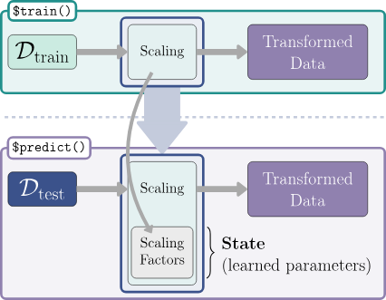

- 种类
  - **顺序管道**
    - 指数据在管道中从一个`PipeOp`直接移动到下一个，从头到尾依次进行
  - **非顺序管道**
    - 数据是通过可能有多个输入和/或输出的`PipeOp`进行处理的
    - 非顺序管道的特点是有多个分支，  
    因此数据可能在不同时间由不同的`PipeOp`进行处理

### `PipeOp`：管道操作符

- `PipeOp`是`mlr3pipelines`的基本类
  - 表示对输入（例如，训练`Task`）的转换操作，产生一些输出
  - 与学习器类似，它包括一个`$train()`和一个`$predict()`方法
    - 训练阶段通常会生成数据的特定模型，并将其保存为内部状态
    - 预测阶段`PipeOp`使用保存状态中的信息对预测`Task`
  - 与学习器一样，PipeOp具有经过训练的参数（即**状态**）
  - 除了参数之外，PipeOp还具有超参数，  
   用户可以在构造`PipeOp`时或通过访问其`PipeOp$param_set`来设置超参数
  - `PipeOp`可以使用便捷函数`po()`进行构造，  
   对于多个`PipeOp`可以使用`pos()`
    - 并且所有可用的`PipeOp`都可在字典`mlr_pipeops`中找到

- 看看有哪些管道操作符

```r
mlr_pipeops %>% as.data.table()
```

<table class='dataframe'>
<caption>A data.table: 174 x 11</caption>
<thead>
 <tr><th scope=col>key</th><th scope=col>label</th><th scope=col>packages</th><th scope=col>tags</th><th scope=col>feature_types</th><th scope=col>input.num</th><th scope=col>output.num</th><th scope=col>input.type.train</th><th scope=col>input.type.predict</th><th scope=col>output.type.train</th><th scope=col>output.type.predict</th></tr>
 <tr><th scope=col>&lt;chr&gt;</th><th scope=col>&lt;chr&gt;</th><th scope=col>&lt;list&gt;</th><th scope=col>&lt;list&gt;</th><th scope=col>&lt;list&gt;</th><th scope=col>&lt;int&gt;</th><th scope=col>&lt;int&gt;</th><th scope=col>&lt;list&gt;</th><th scope=col>&lt;list&gt;</th><th scope=col>&lt;list&gt;</th><th scope=col>&lt;list&gt;</th></tr>
</thead>
<tbody>
 <tr><td>adas                          </td><td>ADAS Balancing                                                                           </td><td>mlr3pipelines, smotefamily  </td><td>imbalanced data, data transform </td><td>logical    , integer    , numeric    , character  , factor     , ordered    , POSIXct    , Date       , lazy_tensor</td><td> 1</td><td> 1</td><td>TaskClassif</td><td>TaskClassif</td><td>TaskClassif</td><td>TaskClassif</td></tr>
 <tr><td>augment_center_crop           </td><td>Center Crop Augmentation                                                                 </td><td>mlr3pipelines, torchvision  , mlr3torch    </td><td>torch         , data transform</td><td>lazy_tensor</td><td> 1</td><td> 1</td><td>Task</td><td>Task</td><td>Task</td><td>Task</td></tr>
 <tr><td>augment_color_jitter          </td><td>Color Jitter Augmentation                                                                </td><td>mlr3pipelines, torchvision  , mlr3torch    </td><td>torch         , data transform</td><td>lazy_tensor</td><td> 1</td><td> 1</td><td>Task</td><td>Task</td><td>Task</td><td>Task</td></tr>
 <tr><td>augment_crop                  </td><td>Crop Augmentation                                                                        </td><td>mlr3pipelines, torchvision  , mlr3torch    </td><td>torch         , data transform</td><td>lazy_tensor</td><td> 1</td><td> 1</td><td>Task</td><td>Task</td><td>Task</td><td>Task</td></tr>
 <tr><td>augment_hflip                 </td><td>Horizontal Flip Augmentation                                                             </td><td>mlr3pipelines, torchvision  , mlr3torch    </td><td>torch         , data transform</td><td>lazy_tensor</td><td> 1</td><td> 1</td><td>Task</td><td>Task</td><td>Task</td><td>Task</td></tr>
 <tr><td>augment_random_affine         </td><td>Random Affine Augmentation                                                               </td><td>mlr3pipelines, torchvision  , mlr3torch    </td><td>torch         , data transform</td><td>lazy_tensor</td><td> 1</td><td> 1</td><td>Task</td><td>Task</td><td>Task</td><td>Task</td></tr>
 <tr><td>augment_random_choice         </td><td>Random Choice Augmentation                                                               </td><td>mlr3pipelines, torchvision  , mlr3torch    </td><td>torch         , data transform</td><td>lazy_tensor</td><td> 1</td><td> 1</td><td>Task</td><td>Task</td><td>Task</td><td>Task</td></tr>
 <tr><td>augment_random_crop           </td><td>Random Crop Augmentation                                                                 </td><td>mlr3pipelines, torchvision  , mlr3torch    </td><td>torch         , data transform</td><td>lazy_tensor</td><td> 1</td><td> 1</td><td>Task</td><td>Task</td><td>Task</td><td>Task</td></tr>
 <tr><td>augment_random_horizontal_flip</td><td>Random Horizontal Flip Augmentation                                                      </td><td>mlr3pipelines, torchvision  , mlr3torch    </td><td>torch         , data transform</td><td>lazy_tensor</td><td> 1</td><td> 1</td><td>Task</td><td>Task</td><td>Task</td><td>Task</td></tr>
 <tr><td>augment_random_order          </td><td>Random Order Augmentation                                                                </td><td>mlr3pipelines, torchvision  , mlr3torch    </td><td>torch         , data transform</td><td>lazy_tensor</td><td> 1</td><td> 1</td><td>Task</td><td>Task</td><td>Task</td><td>Task</td></tr>
 <tr><td>augment_random_resized_crop   </td><td>Random Resized Crop Augmentation                                                         </td><td>mlr3pipelines, torchvision  , mlr3torch    </td><td>torch         , data transform</td><td>lazy_tensor</td><td> 1</td><td> 1</td><td>Task</td><td>Task</td><td>Task</td><td>Task</td></tr>
 <tr><td>augment_random_vertical_flip  </td><td>Random Vertical Flip Augmentation                                                        </td><td>mlr3pipelines, torchvision  , mlr3torch    </td><td>torch         , data transform</td><td>lazy_tensor</td><td> 1</td><td> 1</td><td>Task</td><td>Task</td><td>Task</td><td>Task</td></tr>
 <tr><td>augment_resized_crop          </td><td>Resized Crop Augmentation                                                                </td><td>mlr3pipelines, torchvision  , mlr3torch    </td><td>torch         , data transform</td><td>lazy_tensor</td><td> 1</td><td> 1</td><td>Task</td><td>Task</td><td>Task</td><td>Task</td></tr>
 <tr><td>augment_rotate                </td><td>Rotate Augmentation                                                                      </td><td>mlr3pipelines, torchvision  , mlr3torch    </td><td>torch         , data transform</td><td>lazy_tensor</td><td> 1</td><td> 1</td><td>Task</td><td>Task</td><td>Task</td><td>Task</td></tr>
 <tr><td>augment_vflip                 </td><td>Vertical Flip Augmentation                                                               </td><td>mlr3pipelines, torchvision  , mlr3torch    </td><td>torch         , data transform</td><td>lazy_tensor</td><td> 1</td><td> 1</td><td>Task</td><td>Task</td><td>Task</td><td>Task</td></tr>
 <tr><td>blsmote                       </td><td>BLSMOTE Balancing                                                                        </td><td>mlr3pipelines, smotefamily  </td><td>imbalanced data, data transform </td><td>logical    , integer    , numeric    , character  , factor     , ordered    , POSIXct    , Date       , lazy_tensor</td><td> 1</td><td> 1</td><td>TaskClassif</td><td>TaskClassif</td><td>TaskClassif</td><td>TaskClassif</td></tr>
 <tr><td>boxcox                        </td><td>Box-Cox Transformation of Numeric Features                                               </td><td>mlr3pipelines, bestNormalize</td><td>data transform</td><td>numeric, integer</td><td> 1</td><td> 1</td><td>Task</td><td>Task</td><td>Task</td><td>Task</td></tr>
 <tr><td>branch                        </td><td>Path Branching                                                                           </td><td>mlr3pipelines</td><td>meta</td><td>NA</td><td> 1</td><td>NA</td><td>*</td><td>*</td><td>*</td><td>*</td></tr>
 <tr><td>breslowcompose                </td><td>Wrap a learner into a PipeOp with survival predictions estimated by the Breslow estimator</td><td>mlr3pipelines, mlr3         , mlr3proba    </td><td>abstract</td><td>NA</td><td> 1</td><td> 1</td><td>TaskSurv</td><td>TaskSurv</td><td>NULL</td><td>PredictionSurv</td></tr>
 <tr><td>chunk                         </td><td>Chunk Input into Multiple Outputs                                                        </td><td>mlr3pipelines</td><td>meta</td><td>NA</td><td> 1</td><td>NA</td><td>Task</td><td>Task</td><td>Task</td><td>Task</td></tr>
 <tr><td>classbalancing                </td><td>Class Balancing                                                                          </td><td>mlr3pipelines</td><td>imbalanced data, data transform </td><td>logical    , integer    , numeric    , character  , factor     , ordered    , POSIXct    , Date       , lazy_tensor</td><td> 1</td><td> 1</td><td>TaskClassif</td><td>TaskClassif</td><td>TaskClassif</td><td>TaskClassif</td></tr>
 <tr><td>classifavg                    </td><td>Majority Vote Prediction                                                                 </td><td>mlr3pipelines, stats        </td><td>ensemble</td><td>NA</td><td>NA</td><td> 1</td><td>NULL</td><td>PredictionClassif</td><td>NULL</td><td>PredictionClassif</td></tr>
 <tr><td>classweights                  </td><td>Class Weights for Sample Weighting                                                       </td><td>mlr3pipelines</td><td>imbalanced data, data transform </td><td>logical    , integer    , numeric    , character  , factor     , ordered    , POSIXct    , Date       , lazy_tensor</td><td> 1</td><td> 1</td><td>TaskClassif</td><td>TaskClassif</td><td>TaskClassif</td><td>TaskClassif</td></tr>
 <tr><td>colapply                      </td><td>Apply a Function to each Column of a Task                                                </td><td>mlr3pipelines</td><td>data transform</td><td>logical    , integer    , numeric    , character  , factor     , ordered    , POSIXct    , Date       , lazy_tensor</td><td> 1</td><td> 1</td><td>Task</td><td>Task</td><td>Task</td><td>Task</td></tr>
 <tr><td>collapsefactors               </td><td>Collapse Factors                                                                         </td><td>mlr3pipelines</td><td>data transform</td><td>factor , ordered</td><td> 1</td><td> 1</td><td>Task</td><td>Task</td><td>Task</td><td>Task</td></tr>
 <tr><td>colroles                      </td><td>Change Column Roles of a Task                                                            </td><td>mlr3pipelines</td><td>data transform</td><td>logical    , integer    , numeric    , character  , factor     , ordered    , POSIXct    , Date       , lazy_tensor</td><td> 1</td><td> 1</td><td>Task</td><td>Task</td><td>Task</td><td>Task</td></tr>
 <tr><td>compose_probregr              </td><td>PipeOpProbregr                                                                           </td><td>mlr3pipelines, mlr3proba    , distr6       </td><td>abstract</td><td>NA</td><td> 2</td><td> 1</td><td>NULL, NULL</td><td>PredictionRegr, PredictionRegr</td><td>NULL</td><td>PredictionRegr</td></tr>
 <tr><td>copy                          </td><td>Copy Input Multiple Times                                                                </td><td>mlr3pipelines</td><td>meta</td><td>NA</td><td> 1</td><td>NA</td><td>*</td><td>*</td><td>*</td><td>*</td></tr>
 <tr><td>crankcompose                  </td><td>PipeOpCrankCompositor                                                                    </td><td>mlr3pipelines, mlr3proba    </td><td>abstract</td><td>NA</td><td> 1</td><td> 1</td><td>NULL</td><td>PredictionSurv</td><td>NULL</td><td>PredictionSurv</td></tr>
 <tr><td>datefeatures                  </td><td>Preprocess Date Features                                                                 </td><td>mlr3pipelines</td><td>data transform</td><td>POSIXct</td><td> 1</td><td> 1</td><td>Task</td><td>Task</td><td>Task</td><td>Task</td></tr>
 <tr><td>...</td><td>...</td><td>...</td><td>...</td><td>...</td><td>...</td><td>...</td><td>...</td><td>...</td><td>...</td><td>...</td></tr>
 <tr><td>tomek                         </td><td>Tomek Down-Sampling                              </td><td>mlr3pipelines, themis       </td><td>imbalanced data, data transform </td><td>logical    , integer    , numeric    , character  , factor     , ordered    , POSIXct    , Date       , lazy_tensor</td><td> 1</td><td>1</td><td>TaskClassif</td><td>TaskClassif</td><td>TaskClassif</td><td>TaskClassif</td></tr>
 <tr><td>torch_callbacks               </td><td>Callback Configuration                           </td><td>mlr3pipelines</td><td>abstract</td><td>NA</td><td> 1</td><td>1</td><td>ModelDescriptor</td><td>Task</td><td>ModelDescriptor</td><td>Task</td></tr>
 <tr><td>torch_ingress_categ           </td><td>Torch Entry Point for Categorical Features       </td><td>mlr3pipelines, mlr3torch    </td><td>abstract</td><td>factor , ordered, logical</td><td> 1</td><td>1</td><td>Task</td><td>Task</td><td>ModelDescriptor</td><td>Task</td></tr>
 <tr><td>torch_ingress_ltnsr           </td><td>Ingress for Lazy Tensor                          </td><td>mlr3pipelines, mlr3torch    </td><td>abstract</td><td>lazy_tensor</td><td> 1</td><td>1</td><td>Task</td><td>Task</td><td>ModelDescriptor</td><td>Task</td></tr>
 <tr><td>torch_ingress_num             </td><td>Torch Entry Point for Numeric Features           </td><td>mlr3pipelines, mlr3torch    </td><td>abstract</td><td>numeric, integer</td><td> 1</td><td>1</td><td>Task</td><td>Task</td><td>ModelDescriptor</td><td>Task</td></tr>
 <tr><td>torch_loss                    </td><td>Loss Configuration                               </td><td>mlr3pipelines, torch        , mlr3torch    </td><td>abstract</td><td>NA</td><td> 1</td><td>1</td><td>ModelDescriptor</td><td>Task</td><td>ModelDescriptor</td><td>Task</td></tr>
 <tr><td>torch_model_classif           </td><td>PipeOp Torch Classifier                          </td><td>mlr3pipelines, mlr3         , mlr3torch    </td><td>learner</td><td>NA</td><td> 1</td><td>1</td><td>ModelDescriptor</td><td>TaskClassif</td><td>NULL</td><td>PredictionClassif</td></tr>
 <tr><td>torch_model_regr              </td><td>Torch Regression Model                           </td><td>mlr3pipelines, mlr3         , mlr3torch    </td><td>learner</td><td>NA</td><td> 1</td><td>1</td><td>ModelDescriptor</td><td>TaskRegr</td><td>NULL</td><td>PredictionRegr</td></tr>
 <tr><td>torch_optimizer               </td><td>Optimizer Configuration                          </td><td>mlr3pipelines, torch        , mlr3torch    </td><td>abstract</td><td>NA</td><td> 1</td><td>1</td><td>ModelDescriptor</td><td>Task</td><td>ModelDescriptor</td><td>Task</td></tr>
 <tr><td>trafo_adjust_brightness       </td><td>Adjust Brightness Transformation                 </td><td>mlr3pipelines, torchvision  , mlr3torch    </td><td>torch         , data transform</td><td>lazy_tensor</td><td> 1</td><td>1</td><td>Task</td><td>Task</td><td>Task</td><td>Task</td></tr>
 <tr><td>trafo_adjust_gamma            </td><td>Adjust Gamma Transformation                      </td><td>mlr3pipelines, torchvision  , mlr3torch    </td><td>torch         , data transform</td><td>lazy_tensor</td><td> 1</td><td>1</td><td>Task</td><td>Task</td><td>Task</td><td>Task</td></tr>
 <tr><td>trafo_adjust_hue              </td><td>Adjust Hue Transformation                        </td><td>mlr3pipelines, torchvision  , mlr3torch    </td><td>torch         , data transform</td><td>lazy_tensor</td><td> 1</td><td>1</td><td>Task</td><td>Task</td><td>Task</td><td>Task</td></tr>
 <tr><td>trafo_adjust_saturation       </td><td>Adjust Saturation Transformation                 </td><td>mlr3pipelines, torchvision  , mlr3torch    </td><td>torch         , data transform</td><td>lazy_tensor</td><td> 1</td><td>1</td><td>Task</td><td>Task</td><td>Task</td><td>Task</td></tr>
 <tr><td>trafo_grayscale               </td><td>Grayscale Transformation                         </td><td>mlr3pipelines, torchvision  , mlr3torch    </td><td>torch         , data transform</td><td>lazy_tensor</td><td> 1</td><td>1</td><td>Task</td><td>Task</td><td>Task</td><td>Task</td></tr>
 <tr><td>trafo_nop                     </td><td>No Transformation                                </td><td>mlr3pipelines, mlr3torch    </td><td>torch         , data transform</td><td>lazy_tensor</td><td> 1</td><td>1</td><td>Task</td><td>Task</td><td>Task</td><td>Task</td></tr>
 <tr><td>trafo_normalize               </td><td>Normalization Transformation                     </td><td>mlr3pipelines, torchvision  , mlr3torch    </td><td>torch         , data transform</td><td>lazy_tensor</td><td> 1</td><td>1</td><td>Task</td><td>Task</td><td>Task</td><td>Task</td></tr>
 <tr><td>trafo_pad                     </td><td>Padding Transformation                           </td><td>mlr3pipelines, torchvision  , mlr3torch    </td><td>torch         , data transform</td><td>lazy_tensor</td><td> 1</td><td>1</td><td>Task</td><td>Task</td><td>Task</td><td>Task</td></tr>
 <tr><td>trafo_reshape                 </td><td>Reshaping Transformation                         </td><td>mlr3pipelines, mlr3torch    </td><td>torch         , data transform</td><td>lazy_tensor</td><td> 1</td><td>1</td><td>Task</td><td>Task</td><td>Task</td><td>Task</td></tr>
 <tr><td>trafo_resize                  </td><td>Resizing Transformation                          </td><td>mlr3pipelines, torchvision  , mlr3torch    </td><td>torch         , data transform</td><td>lazy_tensor</td><td> 1</td><td>1</td><td>Task</td><td>Task</td><td>Task</td><td>Task</td></tr>
 <tr><td>trafo_rgb_to_grayscale        </td><td>RGB to Grayscale Transformation                  </td><td>mlr3pipelines, torchvision  , mlr3torch    </td><td>torch         , data transform</td><td>lazy_tensor</td><td> 1</td><td>1</td><td>Task</td><td>Task</td><td>Task</td><td>Task</td></tr>
 <tr><td>trafopred_classifsurv_IPCW    </td><td>PipeOpPredClassifSurvIPCW                        </td><td>mlr3pipelines</td><td>abstract</td><td>NA</td><td> 2</td><td>1</td><td>NULL, NULL</td><td>PredictionClassif, list             </td><td>NULL</td><td>PredictionSurv</td></tr>
 <tr><td>trafopred_classifsurv_disctime</td><td>PipeOpPredClassifSurvDiscTime                    </td><td>mlr3pipelines</td><td>abstract</td><td>NA</td><td> 2</td><td>1</td><td>NULL      , data.table</td><td>PredictionClassif, data.table       </td><td>NULL</td><td>PredictionSurv</td></tr>
 <tr><td>trafopred_regrsurv_pem        </td><td>PipeOpPredRegrSurvPEM                            </td><td>mlr3pipelines</td><td>abstract</td><td>NA</td><td> 2</td><td>1</td><td>NULL      , data.table</td><td>PredictionRegr, data.table    </td><td>NULL</td><td>PredictionSurv</td></tr>
 <tr><td>trafotask_survclassif_IPCW    </td><td>PipeOpTaskSurvClassifIPCW                        </td><td>mlr3pipelines</td><td>abstract</td><td>NA</td><td> 1</td><td>2</td><td>TaskSurv</td><td>TaskSurv</td><td>TaskClassif, NULL       </td><td>TaskClassif, list       </td></tr>
 <tr><td>trafotask_survclassif_disctime</td><td>PipeOpTaskSurvClassifDiscTime                    </td><td>mlr3pipelines, pammtools    </td><td>abstract</td><td>NA</td><td> 1</td><td>2</td><td>TaskSurv</td><td>TaskSurv</td><td>TaskClassif, data.table </td><td>TaskClassif, data.table </td></tr>
 <tr><td>trafotask_survregr_pem        </td><td>PipeOpTaskSurvRegrPEM                            </td><td>mlr3pipelines, pammtools    </td><td>abstract</td><td>NA</td><td> 1</td><td>2</td><td>TaskSurv</td><td>TaskSurv</td><td>TaskRegr  , data.table</td><td>TaskRegr  , data.table</td></tr>
 <tr><td>tunethreshold                 </td><td>Tune the Threshold of a Classification Prediction</td><td>mlr3pipelines, bbotk        </td><td>target transform</td><td>NA</td><td> 1</td><td>1</td><td>Task</td><td>Task</td><td>NULL</td><td>Prediction</td></tr>
 <tr><td>unbranch                      </td><td>Unbranch Different Paths                         </td><td>mlr3pipelines</td><td>meta</td><td>NA</td><td>NA</td><td>1</td><td>*</td><td>*</td><td>*</td><td>*</td></tr>
 <tr><td>vtreat                        </td><td>Interface to the vtreat Package                  </td><td>mlr3pipelines, vtreat       </td><td>encode        , missings      , data transform</td><td>logical    , integer    , numeric    , character  , factor     , ordered    , POSIXct    , Date       , lazy_tensor</td><td> 1</td><td>1</td><td>TaskSupervised</td><td>TaskSupervised</td><td>TaskSupervised</td><td>TaskSupervised</td></tr>
 <tr><td>yeojohnson                    </td><td>Yeo-Johnson Transformation of Numeric Features   </td><td>mlr3pipelines, bestNormalize</td><td>data transform</td><td>numeric, integer</td><td> 1</td><td>1</td><td>Task</td><td>Task</td><td>Task</td><td>Task</td></tr>
</tbody>
</table>

- 下面构建并查看一个PCA管道
- 在输出中
  - `not trained`：模型尚未被训练
  - `Input channels`的`input [Task,Task]`：  
   训练和预测都接受`Task`的输入
  - `Output channels`的`outnput [Task,Task]`：  
   训练和预测都输出为`Task`
- 与`Learner`类不同的是，`PipeOp`可以在训练阶段后返回结果

```r
# 加载R包
# library(mlr3pipelines)

# 选择'pca'管道
po_pca <- po('pca', center = TRUE)
po_pca
```

```js
PipeOp: <pca> (not trained)
values: <center=TRUE>
Input channels <name [train type, predict type]>:
  input [Task,Task]
Output channels <name [train type, predict type]>:
  output [Task,Task]
```

- 下面对`penguins_simple`任务的缩小版进行PCA分析

```r
# 创建任务
tsk_small <- tsk('penguins')
# 选择没有缺失值的数据
tsk_small$filter(
    tsk_small$
        row_ids[complete.cases(tsk_small$data())]
)

# 放到list里（必须）
poin <- list(tsk_small)
# 传递给`PipeOpPCA`训练
poout <- po_pca$train(poin)
# 查看结果
poout
```

```js
$output

-- <TaskClassif> (333x8): Palmer Penguins --------------------------------------
* Target: species
* Target classes: Adelie (44%), Gentoo (36%), Chinstrap (20%)
* Properties: multiclass
* Features (7):
  * dbl (5): PC1, PC2, PC3, PC4, PC5
  * fct (2): island, sex
```

- 查看PCA的结果

```r
# 调取开头5个样本PCA结果
poout[[1]]$head()

# 查看全部样本的PCA结果
# poout[[1]]$data()
```

- 训练得到的旋转矩阵也会保存在内部 `$state` 字段

```r
po_pca$state
```

```js
Standard deviations (1, .., p=5):
[1] 805.3157531   7.1258611   4.0205105   1.5392977   0.7748449

Rotation (n x k) = (5 x 5):
                         PC1         PC2          PC3           PC4
bill_depth     -1.154327e-03 -0.08678513  0.144143265  0.9837576340
bill_length     4.003162e-03  0.31883248  0.941332235 -0.1084192852
body_mass       9.998759e-01 -0.01571143  0.001020094 -0.0003315664
flipper_length  1.519455e-02  0.94325408 -0.304144443  0.1250176180
year            2.210512e-05  0.02896694 -0.024727723  0.0695461097
                         PC5
bill_depth     -0.0625351521
bill_length     0.0216496177
body_mass       0.0004828135
flipper_length -0.0436763258
year            0.9968514404
```

- 之后可以传递给`PipeOpPCA$predict()`，获取预测结果

```r
# 挑一个样本用于预测结果
# 注意使用`$clone()`，因为`filter()`是就地修改
tsk_onepenguin <- tsk_small$clone()$filter(42)
# 同样需要传入`list`
poin <- list(tsk_onepenguin)
# 预测
poout <- po_pca$predict(poin)
# 查看预测结果
poout[[1]]$data()
```

<table class='dataframe'>
<caption>A data.table: 1 x 8</caption>
<thead>
 <tr><th scope=col>species</th><th scope=col>island</th><th scope=col>sex</th><th scope=col>PC1</th><th scope=col>PC2</th><th scope=col>PC3</th><th scope=col>PC4</th><th scope=col>PC5</th></tr>
 <tr><th scope=col>&lt;fct&gt;</th><th scope=col>&lt;fct&gt;</th><th scope=col>&lt;fct&gt;</th><th scope=col>&lt;dbl&gt;</th><th scope=col>&lt;dbl&gt;</th><th scope=col>&lt;dbl&gt;</th><th scope=col>&lt;dbl&gt;</th><th scope=col>&lt;dbl&gt;</th></tr>
</thead>
<tbody>
 <tr><td>Adelie</td><td>Dream</td><td>male</td><td>-307.1238</td><td>-1.959404</td><td>-1.300082</td><td>0.8445978</td><td>-1.072759</td></tr>
</tbody>
</table>

### Graph：PipeOp网络

- `PipeOp`代表机器学习管道中的各个计算步骤，  
  这些管道本身由 `Graph` 对象定义
  - `Graph` 是 `PipeOp` 的集合，带有引导数据流的 **边**（edge）
- 构建`Graph`最便捷的方式是使用`%>>%`运算符（读作“双箭头”）连接一系列`PipeOp`
  - 给定两个`PipeOp`时，该运算符会创建一个`Graph`，  
   先执行左边的`PipeOp`，再执行右边的
  - 还可用于连接`Graph`与`PipeOp`，或连接另一个`Graph`

- 以下示例使用`po('mutate')`为任务添加一个新特征，  
  然后使用`po('scale')`对所有数值特征进行缩放和中心化

```r
# 构建`PipeOpMutate`
po_mutate <- po(
 'mutate',
 mutation = list(bill_ratio = ~ bill_length / bill_depth)
)
# 构建`PipeOpScale`
po_scale <- po('scale')
# 连接两个`PipeOp`构建`Graph`
graph <- po_mutate %>>% po_scale
# 查看`Graph`
graph
```

```js
Graph with 2 PipeOps:
     ID         State sccssors prdcssors
 <char>        <char>   <char>    <char>
 mutate <<UNTRAINED>>    scale          
  scale <<UNTRAINED>>             mutate
```

- `Graph$plot()`可以进行管道可视化

```r
graph$plot(horizontal = TRUE)
```

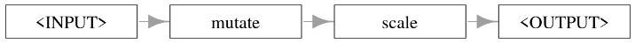

- `Graph$plot()`打印组成的`PipeOp`的详情

```r
graph$pipeops
```

```js
$mutate
PipeOp: <mutate> (not trained)
values: <mutation=<list>, delete_originals=FALSE>
Input channels <name [train type, predict type]>:
  input [Task,Task]
Output channels <name [train type, predict type]>:
  output [Task,Task]

$scale
PipeOp: <scale> (not trained)
values: <robust=FALSE>
Input channels <name [train type, predict type]>:
  input [Task,Task]
Output channels <name [train type, predict type]>:
  output [Task,Task]
```

- `Graph$edges`字段可用于访问边
  - 它返回一个`data.table`，  
   列出了沿每条边流动的数据的 **源**（`src_id`，`src_channel`）和  
    **目标**（`dst_id`，`dst_channel`）

```r
graph$edges
```

<table class='dataframe'>
<caption>A data.table: 1 x 4</caption>
<thead>
 <tr><th scope=col>src_id</th><th scope=col>src_channel</th><th scope=col>dst_id</th><th scope=col>dst_channel</th></tr>
 <tr><th scope=col>&lt;chr&gt;</th><th scope=col>&lt;chr&gt;</th><th scope=col>&lt;chr&gt;</th><th scope=col>&lt;chr&gt;</th></tr>
</thead>
<tbody>
 <tr><td>mutate</td><td>output</td><td>scale</td><td>input</td></tr>
</tbody>
</table>

- 除了使用 `%>>%`，还可以使用 `$add_pipeop()` 和 `$add_edge()` 方法  
  显式创建一个 `Graph`，以创建 `PipeOp` 以及连接它们的边

```r
graph <- Graph$new()$
 add_pipeop(po_mutate)$
 add_pipeop(po_scale)$
 add_edge('mutate', 'scale')
graph
```

```js
Graph with 2 PipeOps:
     ID         State sccssors prdcssors
 <char>        <char>   <char>    <char>
 mutate <<UNTRAINED>>    scale          
  scale <<UNTRAINED>>             mutate
```

- 构建完成后，`Graph` 可以像 `Learner` 一样，  
  通过调用 `$train()` 和 `$predict()` 来使用
  - 不过在训练和预测过程中，它仍然输出一个 `list`

```r
result <- graph$train(tsk_small)
result
```

```js
$scale.output

-- <TaskClassif> (333x9): Palmer Penguins --------------------------------------
* Target: species
* Target classes: Adelie (44%), Gentoo (36%), Chinstrap (20%)
* Properties: multiclass
* Features (8):
  * dbl (6): bill_depth, bill_length, bill_ratio, body_mass, flipper_length,
  year
  * fct (2): island, sex
```

```r
result[[1]]$data()[1:3]
```

<table class='dataframe'>
<caption>A data.table: 3 x 9</caption>
<thead>
 <tr><th scope=col>species</th><th scope=col>island</th><th scope=col>sex</th><th scope=col>bill_depth</th><th scope=col>bill_length</th><th scope=col>bill_ratio</th><th scope=col>body_mass</th><th scope=col>flipper_length</th><th scope=col>year</th></tr>
 <tr><th scope=col>&lt;fct&gt;</th><th scope=col>&lt;fct&gt;</th><th scope=col>&lt;fct&gt;</th><th scope=col>&lt;dbl&gt;</th><th scope=col>&lt;dbl&gt;</th><th scope=col>&lt;dbl&gt;</th><th scope=col>&lt;dbl&gt;</th><th scope=col>&lt;dbl&gt;</th><th scope=col>&lt;dbl&gt;</th></tr>
</thead>
<tbody>
 <tr><td>Adelie</td><td>Torgersen</td><td>male  </td><td>0.7795590</td><td>-0.8946955</td><td>-1.0421499</td><td>-0.5676206</td><td>-1.4246077</td><td>-1.281813</td></tr>
 <tr><td>Adelie</td><td>Torgersen</td><td>female</td><td>0.1194043</td><td>-0.8215515</td><td>-0.6804365</td><td>-0.5055254</td><td>-1.0678666</td><td>-1.281813</td></tr>
 <tr><td>Adelie</td><td>Torgersen</td><td>female</td><td>0.4240910</td><td>-0.6752636</td><td>-0.7434640</td><td>-1.1885721</td><td>-0.4257325</td><td>-1.281813</td></tr>
</tbody>
</table>

```r
result <- graph$predict(tsk_onepenguin)
result[[1]]$head()
```

<table class='dataframe'>
<caption>A data.table: 1 x 9</caption>
<thead>
 <tr><th scope=col>species</th><th scope=col>island</th><th scope=col>sex</th><th scope=col>bill_depth</th><th scope=col>bill_length</th><th scope=col>bill_ratio</th><th scope=col>body_mass</th><th scope=col>flipper_length</th><th scope=col>year</th></tr>
 <tr><th scope=col>&lt;fct&gt;</th><th scope=col>&lt;fct&gt;</th><th scope=col>&lt;fct&gt;</th><th scope=col>&lt;dbl&gt;</th><th scope=col>&lt;dbl&gt;</th><th scope=col>&lt;dbl&gt;</th><th scope=col>&lt;dbl&gt;</th><th scope=col>&lt;dbl&gt;</th><th scope=col>&lt;dbl&gt;</th></tr>
</thead>
<tbody>
 <tr><td>Adelie</td><td>Dream</td><td>male</td><td>0.6272156</td><td>-0.5838337</td><td>-0.7868552</td><td>-0.3813351</td><td>-0.4257325</td><td>-1.281813</td></tr>
</tbody>
</table>

### 顺序学习器管道

#### 简介

- `mlr3pipelines`最常见的应用是用它来执行预处理任务，  
  如缺失值插补或因子编码，  
  然后将处理后的数据输入到`Learner`中
- 此工作流程的`Graph`在训练期间对数据进行操作并拟合`Learner`模型，  
  以确保在预测阶段以相同的方式处理数据
- 下图表示顺序学习器管道内训练和预测过程的概念化
  - 在训练过程中（顶行），数据通过预处理算子，  
   每个算子都会修改数据并创建一个`$state`，  
   最后，学习器接收数据并创建一个模型
  - 在预测过程中（底行），数据同样由预处理算子进行转换，  
   在此过程中使用它们各自的`$state`（灰色框）信息；  
   然后，学习器接收与训练期间所见数据格式相同的数据，并进行预测

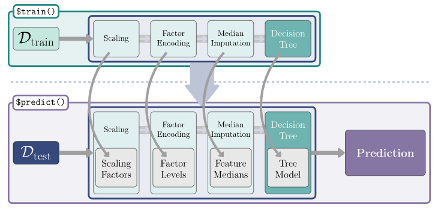

#### 将`Learner`转换为`PipeOp`，将`Graph`转换为`Learner`

- `Learner`可以通过`as_pipeop()`转换为`PipeOp`
- 使用`%>>%`时无需手动转换，  
  仅当需要把单独的`Learner`转换为`Graph`时，  
  需要事先转换成`PipeOp`过渡
  - 见下方例子：

```r
# Learner被串起来的例子
lrn_logreg <- lrn('classif.log_reg')
graph <- po('imputesample') %>>% lrn_logreg
graph$plot(horizontal = TRUE)
```


- 若要将`Graph`作为具有相同接口的`Learner`使用，  
  可以使用`as_learner()`将其包装在一个`GraphLearner`对象中，  
  然后，该`Graph`就可以像其他任何`Learner`一样使用
- 下面例子中分别建立两种`Graph`并进行benchmark比较
  - 重采样插补的`glrn_sample`
  - 众数插补的`glrn_mode`

```r
# 将两个`Graph`转换为`Learner`
glrn_sample <- as_learner(graph)
glrn_mode <- as_learner(po('imputemode') %>>% lrn_logreg)
```

- 即使转换成了`GraphLearner`类，  
  依然可以使用`GraphLearner$plot(horizontal = TRUE)`  
  对`Graph`可视化

```r
glrn_mode$plot(horizontal = TRUE)
```


- 转化为`GraphLearner`后可以和普通的`Learner`一样  
  传递到`benchmark()`中进行比较
  - 在下例中可以看出：

```r
# 创建一个benchmark矩阵
design <- benchmark_grid(
 tsk('pima'), 
 list(glrn_sample, glrn_mode),
 rsmp('cv', folds = 3)
)
# 执行benchmark比较
bmr <- benchmark(design)
# 储存聚合结果
aggr <- bmr$aggregate()[, .(learner_id, classif.ce)]
# 查看结果
aggr
```

<table class='dataframe'>
<caption>A bmr_aggregate: 2 x 2</caption>
<thead>
 <tr><th scope=col>learner_id</th><th scope=col>classif.ce</th></tr>
 <tr><th scope=col>&lt;chr&gt;</th><th scope=col>&lt;dbl&gt;</th></tr>
</thead>
<tbody>
 <tr><td>imputesample.classif.log_reg</td><td>0.2330729</td></tr>
 <tr><td>imputemode.classif.log_reg  </td><td>0.2278646</td></tr>
</tbody>
</table>

#### 检查`Graph`

- 如果相检查管道和数据流以进一步了解你的管道或对其进行调试
  - 首先需要将 `$keep_results` 标签设置为 `TRUE`，  
   以便保留中间结果，默认情况下该标志是关闭的，以节省内存

```r
# 可以在`as_learner()`前设定
graph$keep_results <- TRUE
glrn_sample$graph_model$keep_results <- TRUE
glrn_sample$train(tsk('pima'))
```

- `GraphLearner`中的`$graph_model`字段包含了`Graph`
  - 因此可以对`GraphLearner$graph_model`进行所有和`Graph`相同的操作

- 下列例子中可以查看全部中间结果
-

```r
imputesample_output <- glrn_sample$
 graph_model$
 pipeops$
 imputesample$
 .result
imputesample_output[[1]]$missings()
```

```js
diabetes      age pedigree pregnant  glucose  insulin     mass pressure 
       0        0        0        0        0        0        0        0 
 triceps 
       0 
```

- 可以通过`Graph$$pipeops`访问底层`Learner`
  - 下面分别显示了每一级的**类**，方便了解这些包装关系

```r
pipeop_logreg <- glrn_sample$ # GraphLearner
 graph_model$ # Graph
 pipeops$ # PipeOp
 classif.log_reg # PipeOpLearner
learner_logreg <- pipeop_logreg$learner_model # LearnerClassifLogReg
learner_logreg
```

- 到这里不妨我们再重新按顺序构建一遍，  
  并看看它们的类

```r
# 1
lrn('classif.log_reg') %>% class()
# 2
lrn('classif.log_reg') %>% po() %>% class()
# 3
po('imputesample') %>>% {lrn('classif.log_reg') %>% po()} %>% class()
# 4
po('imputesample') %>>% {lrn('classif.log_reg') %>% po()} %>% as_learner() %>% class()
```

```js
'LearnerClassifLogReg''LearnerClassif''Learner''R6'

'PipeOpLearner''PipeOp''R6'

'Graph''R6'

'GraphLearner''Learner''R6'
```

#### 配置管道超参数

- `PipeOp`的超参数集中收集在图的 `$param_set` 中
- 可以使用完全一样的`PipeOp`，前提是设置`id`，以避免参数名冲突

```r
graph <- po('scale', center = FALSE, scale = TRUE, id = 'scale') %>>%
  po('scale', center = TRUE, scale = FALSE, id = 'center') %>>%
  lrn('classif.rpart', cp = 1)
graph$param_set$values
```

- **注意**：
  - 如果你需要更改 `Graph` 中`PipeOp`的ID，  
   则使用`Graph`类中的`$set_names`方法
    - `some_graph$set_names(old = 'old_name', new = 'new_name')`
- 不可通过  
  `graph$pipeops$<old_id>$id <- <new_id>`更改`PipeOp`的ID
  - 因为这只会更改`PipeOp`对自身ID的记录，而不会更改`Graph`的记录，这将导致错误

```r
$scale.center
FALSE
$scale.scale
TRUE
$scale.robust
FALSE
$center.center
TRUE
$center.scale
FALSE
$center.robust
FALSE
$classif.rpart.cp
1
$classif.rpart.xval
0
```

- 无论将管道视为`Graph`还是`GraphLearner`，超参数的更新和访问方式都是相同的

```r
# `Graph`两种方法
graph$param_set$values$classif.rpart.maxdepth <- 6
graph$param_set$values
graph$param_set$set_values(classif.rpart.maxdepth = 1)
graph$param_set$values

# 转换成`GraphLearner`
graph_learner <- as_learner(graph)

# `GraphLearner`依然两种方法
graph_learner$param_set$values$classif.rpart.maxdepth <- 3
graph_learner$param_set$values
graph_learner$param_set$set_values(classif.rpart.maxdepth = 2)
graph_learner$param_set$values
```

## 非顺序管道及调优

### 简单演示

- `%>>%`能够将`PipeOp`排列成线性的`Graph`
- `gunion()`则可以将  
  `PipeOP`，`Graph`或它们的组合  
  拼接成可以并行的`Graph`

```r
# library(mlr3pipelines)

# 简单的并联
# 首先用scale开头
graph <- po('scale', center = TRUE, scale = FALSE) %>>%
    # `gunion()`接受`list`的传递
    gunion(
     # `list`内部则是要并联的管道元件
        list(
         # 辨别某特征是否存在缺失值
            po('missind'), 
            # 对缺失值用中位数填充
            po('imputemedian') 
        )
    ) %>>%
    # 最后再串联一个管道元件
    # 合并分支输出的结果
    po('featureunion')

graph$plot(horizontal = TRUE)
```

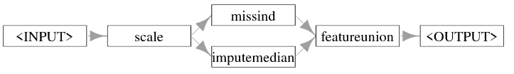

- `Graph$edges`依然可以查看输入与输出的表格

```r
graph$edges
```

<table class='dataframe'>
<caption>A data.table: 4 x 4</caption>
<thead>
 <tr><th scope=col>src_id</th><th scope=col>src_channel</th><th scope=col>dst_id</th><th scope=col>dst_channel</th></tr>
 <tr><th scope=col>&lt;chr&gt;</th><th scope=col>&lt;chr&gt;</th><th scope=col>&lt;chr&gt;</th><th scope=col>&lt;chr&gt;</th></tr>
</thead>
<tbody>
 <tr><td>scale       </td><td>output</td><td>missind     </td><td>input</td></tr>
 <tr><td>scale       </td><td>output</td><td>imputemedian</td><td>input</td></tr>
 <tr><td>missind     </td><td>output</td><td>featureunion</td><td>...  </td></tr>
 <tr><td>imputemedian</td><td>output</td><td>featureunion</td><td>...  </td></tr>
</tbody>
</table>

- 用刚刚构建的`graph`作用于`tsk('pima')`的前三行，  
  可以看到它如何估算缺失数据，并添加一个列来指示哪些值是缺失的

```r
tsk_pima_head <- tsk('pima')$filter(1:3)
tsk_pima_head$data(cols = c('diabetes', 'insulin', 'triceps'))

result <- graph$train(tsk_pima_head)[[1]]
result$data(
 cols = c(
  'diabetes', 
  'insulin', 
  'missing_insulin', 
  'triceps',
  'missing_triceps'
  )
)
```

<table class='dataframe'>
<caption>A data.table: 3 x 3</caption>
<thead>
 <tr><th scope=col>diabetes</th><th scope=col>insulin</th><th scope=col>triceps</th></tr>
 <tr><th scope=col>&lt;fct&gt;</th><th scope=col>&lt;dbl&gt;</th><th scope=col>&lt;dbl&gt;</th></tr>
</thead>
<tbody>
 <tr><td>pos</td><td>NA</td><td>35</td></tr>
 <tr><td>neg</td><td>NA</td><td>29</td></tr>
 <tr><td>pos</td><td>NA</td><td>NA</td></tr>
</tbody>
</table>

<table class='dataframe'>
<caption>A data.table: 3 x 5</caption>
<thead>
 <tr><th scope=col>diabetes</th><th scope=col>insulin</th><th scope=col>missing_insulin</th><th scope=col>triceps</th><th scope=col>missing_triceps</th></tr>
 <tr><th scope=col>&lt;fct&gt;</th><th scope=col>&lt;dbl&gt;</th><th scope=col>&lt;fct&gt;</th><th scope=col>&lt;dbl&gt;</th><th scope=col>&lt;fct&gt;</th></tr>
</thead>
<tbody>
 <tr><td>pos</td><td>0</td><td>missing</td><td> 3</td><td>present</td></tr>
 <tr><td>neg</td><td>0</td><td>missing</td><td>-3</td><td>present</td></tr>
 <tr><td>pos</td><td>0</td><td>missing</td><td> 0</td><td>missing</td></tr>
</tbody>
</table>

### 选择器与并行管道

- 下图展现了两种操作思路：
  - 第一个：先对一部分列进行操作1，再对剩余部分进行操作2
  - 第二个：对一部分列进行操作1和对剩余部分进行操作2是并行的，  
   最后用`po('featureunion')`进行整合

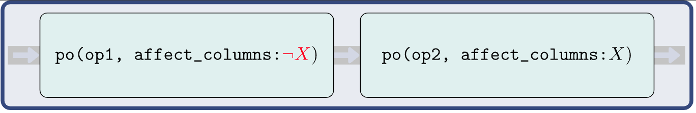
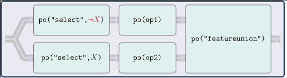
  
- 上述用了`Selector`系列的选择器函数
  - `selector_grep()`：  
   正则表达式匹配列
  - `selector_name`：  
   选择和名字完全匹配的列
  - `selector_type()`：  
   列类型匹配列
  - `selector_intersect`：  
   选择交集
  - `selector_union()`：  
   选择并集
  - `selector_setdiff()`：  
   选择差集
  - `selector_invert()`：  
   选择补集
  - `selector_missing()`：  
   选择有缺失值的列
  - `selector_cardinality_greater_than()`：  
   选择基数大雨给定阈值的**分类特征**
  - `selector_all()`：  
   选择所有列
  - `selector_none()`：  
   不选择任何列

- 下面是不使用`Task$select()`，  
  而是`select_grep()`和`select_invert()`的方便操作

```r
# tsk('penguins_simple')在`mlr3data`包中
# library(mlr3data)

# 建立两个选择器：
# 所有开头为`bill`
sel_bill <- selector_grep('^bill')
# 上面选择器的补集
sel_not_bill <- selector_invert(sel_bill)

# 建立一个`Graph`：
# 先对开头不为`bill`的列缩放
graph <- po('scale', affect_columns = sel_not_bill) %>>% 
 # 再对开头为`bill`的列进行PCA
 po('pca', affect_columns = sel_bill)

# 对`Task`运行`Graph`
result <- graph$train(tsk('penguins'))

# 查看前三行结果
result[[1]]$data()[1:3, ]
```

<table class='dataframe'>
<caption>A data.table: 3 x 11</caption>
<thead>
 <tr><th scope=col>species</th><th scope=col>PC1</th><th scope=col>PC2</th><th scope=col>body_mass</th><th scope=col>flipper_length</th><th scope=col>island.Biscoe</th><th scope=col>island.Dream</th><th scope=col>island.Torgersen</th><th scope=col>sex.female</th><th scope=col>sex.male</th><th scope=col>year</th></tr>
 <tr><th scope=col>&lt;fct&gt;</th><th scope=col>&lt;dbl&gt;</th><th scope=col>&lt;dbl&gt;</th><th scope=col>&lt;dbl&gt;</th><th scope=col>&lt;dbl&gt;</th><th scope=col>&lt;dbl&gt;</th><th scope=col>&lt;dbl&gt;</th><th scope=col>&lt;dbl&gt;</th><th scope=col>&lt;dbl&gt;</th><th scope=col>&lt;dbl&gt;</th><th scope=col>&lt;dbl&gt;</th></tr>
</thead>
<tbody>
 <tr><td>Adelie</td><td>-5.014734</td><td> 1.0716828</td><td>-0.5676206</td><td>-1.4246077</td><td>-0.977724</td><td>-0.7641697</td><td>2.463094</td><td>-0.9895421</td><td> 0.9895421</td><td>-1.281813</td></tr>
 <tr><td>Adelie</td><td>-4.495124</td><td>-0.1852998</td><td>-0.5055254</td><td>-1.0678666</td><td>-0.977724</td><td>-0.7641697</td><td>2.463094</td><td> 1.0075337</td><td>-1.0075337</td><td>-1.281813</td></tr>
 <tr><td>Adelie</td><td>-3.754628</td><td> 0.4867612</td><td>-1.1885721</td><td>-0.4257325</td><td>-0.977724</td><td>-0.7641697</td><td>2.463094</td><td> 1.0075337</td><td>-1.0075337</td><td>-1.281813</td></tr>
</tbody>
</table>

- 对于上面的串联`Graph`而言，如果顺序 弄混，则会导致结果出现重大错误
- 为了避免这种情况发生，更好的是建立一个并联`Graph`

```r
po_select_bill <- po(
 'select', 
 id = 's_bill', 
 selector = sel_bill
)
po_select_not_bill <- po(
 'select', 
 id = 's_notbill',
 selector = sel_not_bill
)

path_pca <-  po_select_bill %>>% po('pca')
path_scale <- po_select_not_bill %>>% po('scale')

graph <- gunion(list(path_pca, path_scale)) %>>% po('featureunion')

# 可视化`Graph`流程
graph$plot(horizontal = TRUE)
```

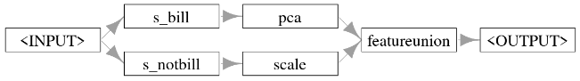

- 使用`po('nop')`表示不进行任何操作

```r
graph <- gunion(list(
 po_select_bill %>>% po('scale'),
 po_select_not_bill %>>% po('nop')
)) %>>% po('featureunion')

graph$plot(horizontal = TRUE)
```

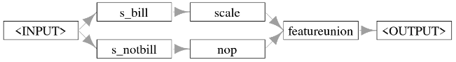

```r
graph$train(tsk('penguins_simple'))[[1]]$data()[1:3,]
```

<table class='dataframe'>
<caption>A data.table: 3 x 11</caption>
<thead>
 <tr><th scope=col>species</th><th scope=col>bill_depth</th><th scope=col>bill_length</th><th scope=col>body_mass</th><th scope=col>flipper_length</th><th scope=col>island.Biscoe</th><th scope=col>island.Dream</th><th scope=col>island.Torgersen</th><th scope=col>sex.female</th><th scope=col>sex.male</th><th scope=col>year</th></tr>
 <tr><th scope=col>&lt;fct&gt;</th><th scope=col>&lt;dbl&gt;</th><th scope=col>&lt;dbl&gt;</th><th scope=col>&lt;int&gt;</th><th scope=col>&lt;int&gt;</th><th scope=col>&lt;dbl&gt;</th><th scope=col>&lt;dbl&gt;</th><th scope=col>&lt;dbl&gt;</th><th scope=col>&lt;dbl&gt;</th><th scope=col>&lt;dbl&gt;</th><th scope=col>&lt;int&gt;</th></tr>
</thead>
<tbody>
 <tr><td>Adelie</td><td>0.7795590</td><td>-0.8946955</td><td>3750</td><td>181</td><td>0</td><td>0</td><td>1</td><td>0</td><td>1</td><td>2007</td></tr>
 <tr><td>Adelie</td><td>0.1194043</td><td>-0.8215515</td><td>3800</td><td>186</td><td>0</td><td>0</td><td>1</td><td>1</td><td>0</td><td>2007</td></tr>
 <tr><td>Adelie</td><td>0.4240910</td><td>-0.6752636</td><td>3250</td><td>195</td><td>0</td><td>0</td><td>1</td><td>1</td><td>0</td><td>2007</td></tr>
</tbody>
</table>

### 常见模式与`ppl()`

- 由于大部分的机器学习的一些处理是共同的，  
  `mlr3`预设了一些管道
  - `ppl()`可以快速调用

- 几种常用的
  - `ppl('bagging', graph)`：装袋  
    - 在`mlr3pipelines`中，  
    装袋是指在不同的数据样本上多次运行`graph`，  
    然后对结果取平均值的过程
  - `ppl('branch', graphs)`：  
    - 使用 `PipeOpBranch` 从给定的 `graphs` 中创建不同的路径分支，  
    其中只有一个分支会被求值
  - `ppl('greplicate', graph, n)`：
    - 创建一个 `Graph`，该图将 `graph`（也可以是单个 `PipeOp`）复制 `n` 次
    - 该管道通过向每个 `PipeOp` 添加后缀来避免ID冲突
  - `ppl('ovr', graph)`：一对多分类  
    - 用于将多分类任务转换为多个二分类任务，  
    每个任务对应原始任务中的一个类别
    - 然后，这些任务由给定的 `graph` 进行评估，  
    `graph` 应该是一个学习器  
    （或包含一个能生成预测结果的学习器的管道）
    - 对二分类任务所做的预测将合并为原始任务所需的多分类预测
  - `ppl('robustify')`：
    - 执行常见的预处理步骤，  
    使任何 `Task` 都能与给定的 `Learner` 兼容
  - `ppl('stacking', base_learners, super_learner)`：堆叠法
    - 是指将一个或多个模型（`base_learners`）的预测结果  
    作为后续模型（`super_learner`）的特征的过程
  - `ppl('targettrafo', graph)`：
    - 创建一个`Graph`，该`Graph`转换`Task`的预测目标，  
    并确保在训练期间应用的任何变换  
    （使用传递给`targetmutate.trafo`超参数的函数）  
    在最终预测中被反转  
    （使用传递给`targetmutate.inverter`超参数的函数）

### 例子

#### 使用`greplicate`和`subsample`进行装袋（Bagging）

- **装袋法**（源于“自助聚集”（**b**ootstrapp **agg**regat**ing**））
  - 基本思想即把多个预测器聚合成一个更强有力的单一预测器
  - 对于回归任务，预测结果通常通过算术平均进行聚合；  
   对于分类任务，则通过多数表决进行聚合
  - 装袋法背后的潜在直觉是，  
   对一组不稳定且多样（即仅弱相关）的预测器进行平均，  
   可以降低总体预测的方差
  - 每个学习器都在原始数据的不同随机样本上进行训练
- 下图表示了基本原理：  
  - 通过对数据进行独立子采样并拟合单个决策树学习器来执行装袋法的图
  - 最终的预测结果由多数投票 `PipeOp` 汇总得出

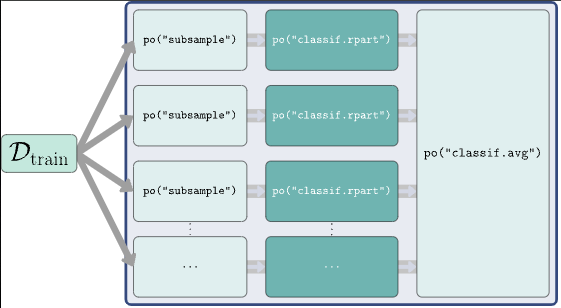

- 下面**手动构建**一个bagging的`Graph`

```r
# 建立一个`Graph`：
# 从样本中进行0.7比例的无放回采样
# 用采样后的样本训练rpart
gr_single_pred <- po('subsample', frac = 0.7) %>>% lrn('classif.rpart')

# 将`Graph``gr_single_pred`重复10次
gr_pred_set <- ppl('greplicate', graph = gr_single_pred, n = 10)

# 将`Graph``gr_pred_set`传递给`po('classifavg')
# 并输入`innum = 10`以传输重复10次的信息
gr_bagging <- gr_pred_set %>>% po('classifavg', innum = 10)

# 对最终的`Graph`可视化
gr_bagging$plot()
```

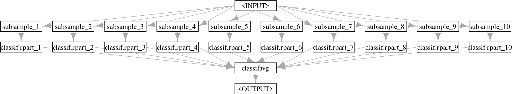

- 将刚构建的bagging`Graph`用于`tsk('sonar')
  - 可以看出bagging比决策树效果好，  
   但是差于随机森林

```r
# 将`Graph`转换成`GraphLearner`
glrn_bagging <- as_learner(gr_bagging)
glrn_bagging$id <- 'bagging'

lrn_rpart <- lrn('classif.rpart')
# 将`glrn_bagging`，`lrn_rpart`, 
# 以及`lrn('classif.ranger')`进行benchmark比较
learners <- c(glrn_bagging, lrn_rpart, lrn('classif.ranger'))

# 进行benchmark比较
bmr <- benchmark(
 benchmark_grid(
  tsk('sonar'), 
  learners,
  rsmp('cv', folds = 3)
 )
)

# 查看整合后的学习器结果
bmr$aggregate()[, .(learner_id, classif.ce)]
```

<table class='dataframe'>
<caption>A bmr_aggregate: 3 x 2</caption>
<thead>
 <tr><th scope=col>learner_id</th><th scope=col>classif.ce</th></tr>
 <tr><th scope=col>&lt;chr&gt;</th><th scope=col>&lt;dbl&gt;</th></tr>
</thead>
<tbody>
 <tr><td>bagging       </td><td>0.2404417</td></tr>
 <tr><td>classif.rpart </td><td>0.2979986</td></tr>
 <tr><td>classif.ranger</td><td>0.1878537</td></tr>
</tbody>
</table>

- 对于上面的bagging `Graph` 更简单的**自动构建**方法是用`ppl('bagging', ...)`
  - `collect_multiplicity`：是否收集跨路径预测结果

```r
ppl(
 'bagging', 
 rn('classif.rpart'),
 iterations = 10, frac = 0.7,
 averager = po(
  'classifavg', 
  collect_multiplicity = TRUE
 )
)
```

- 随机森林算法进行了特征变量的子采样
  - 为了模拟这一个过程，可以进行如下管道设定

```r
# 创建一个采样器
# 这里的采样器只是一个简单的函数：
# 从`Task`中特征变量中，
# 随机挑选特征变量数量的算术平方根个变量
selector_subsample <- function(task) {
 sample(
  task$feature_names, 
  sqrt(length(task$feature_names))
 )
}

# 创建一个bagging `Graph`
gr_bagging_quasi_rf <- ppl(
 'bagging',
 graph = po('select', selector = selector_subsample) %>>%
     lrn('classif.rpart', minsplit = 1),
 # 迭代100次
 iterations = 100,
 # 设置结果的整合方式
 averager = po('classifavg', collect_multiplicity = TRUE)
)

# 将重采样是否返回设定为TRUE
# 因此变成了自助法重采样
gr_bagging_quasi_rf$
 param_set$
 values$
 subsample.replace <- TRUE

# 将`Graph`转变为`GraphLearner`
glrn_quasi_rf <- as_learner(gr_bagging_quasi_rf)
# 设置一个唯一ID
glrn_quasi_rf$id <- 'quasi.rf'

# 进行benchmark比较
design <- benchmark_grid(
 tsks('sonar'),
 c(
  glrn_quasi_rf, 
  lrn('classif.ranger', num.trees = 100)
 ),
 rsmp('cv', folds = 5)
)
bmr <- benchmark(design)

# 查看聚合结果
bmr$aggregate()[, .(learner_id, classif.ce)]
```

<table class='dataframe'>
<caption>A bmr_aggregate: 2 x 2</caption>
<thead>
 <tr><th scope=col>learner_id</th><th scope=col>classif.ce</th></tr>
 <tr><th scope=col>&lt;chr&gt;</th><th scope=col>&lt;dbl&gt;</th></tr>
</thead>
<tbody>
 <tr><td>quasi.rf      </td><td>0.1732869</td></tr>
 <tr><td>classif.ranger</td><td>0.1681765</td></tr>
</tbody>
</table>

#### 使用`po(“learner_cv”)`进行堆叠

- 堆叠
  - 将多个模型（通常称为0层模型）的预测结果作为后续模型（1层模型）的特征，  
   而1层模型又会结合这些预测结果
- 一种简单的组合方式可以是线性模型（如果有许多0层模型，可能需要进行正则化），  
   因为0层模型的加权和通常是合理且足够好的
- 不过，也可以使用非线性的1层模型，  
  并且1层模型也有可能同时访问输入特征和0层模型的预测结果
- 从概念上讲，在`mlr3`中也可以构建超过两层的堆叠结构，  
  但在这里只局限于这种更简单的设置，因为它在实际应用中通常也表现良好

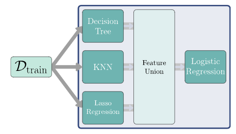

- 这里创建了3个学习器，并且通过连接CV重采样各自形成3个`Graph`

```r
lrn_rpart <- lrn('classif.rpart', predict_type = 'prob')
po_rpart_cv <- po(
 'learner_cv', 
 learner = lrn_rpart,
 resampling.folds = 2, 
 id = 'rpart_cv'
)

lrn_knn <- lrn('classif.kknn', predict_type = 'prob')
po_knn_cv <- po(
 'learner_cv',
 learner = lrn_knn,
 resampling.folds = 2, 
 id = 'knn_cv'
)

lrn_glmnet <- lrn('classif.glmnet', predict_type = 'prob')
po_glmnet_cv <- po(
 'learner_cv',
 learner = lrn_glmnet,
 resampling.folds = 2, 
 id = 'glmnet_cv'
)
```

- 将上述3个`Graph`并联，并连接一个整合结果的`PipeOp`
- 将这个构成的`Graph`训练`tsk('sonar')`并查看结果

```r
gr_level_0 <- gunion(list(po_rpart_cv, po_knn_cv, po_glmnet_cv))
gr_combined <- gr_level_0 %>>% po('featureunion')

# 由于`GraphLearner`接受和输出都是`list`
# 对于只有一个起点的输入而言输出也是只包含一个元素的`list`
# 因此用`list[[1]]`来调取
gr_combined$train(tsk('sonar'))[[1]]$head()
```

<table class='dataframe'>
<caption>A data.table: 6 x 7</caption>
<thead>
 <tr><th scope=col>Class</th><th scope=col>rpart_cv.prob.M</th><th scope=col>rpart_cv.prob.R</th><th scope=col>knn_cv.prob.M</th><th scope=col>knn_cv.prob.R</th><th scope=col>glmnet_cv.prob.M</th><th scope=col>glmnet_cv.prob.R</th></tr>
 <tr><th scope=col>&lt;fct&gt;</th><th scope=col>&lt;dbl&gt;</th><th scope=col>&lt;dbl&gt;</th><th scope=col>&lt;dbl&gt;</th><th scope=col>&lt;dbl&gt;</th><th scope=col>&lt;dbl&gt;</th><th scope=col>&lt;dbl&gt;</th></tr>
</thead>
<tbody>
 <tr><td>R</td><td>0.05555556</td><td>0.94444444</td><td>0.42308735</td><td>0.5769126</td><td>0.77722963</td><td>0.2227703659</td></tr>
 <tr><td>R</td><td>0.93333333</td><td>0.06666667</td><td>0.72902464</td><td>0.2709754</td><td>0.57270947</td><td>0.4272905324</td></tr>
 <tr><td>R</td><td>0.89473684</td><td>0.10526316</td><td>0.52294416</td><td>0.4770558</td><td>0.99908407</td><td>0.0009159289</td></tr>
 <tr><td>R</td><td>0.58333333</td><td>0.41666667</td><td>0.32588147</td><td>0.6741185</td><td>0.46964796</td><td>0.5303520359</td></tr>
 <tr><td>R</td><td>0.41666667</td><td>0.58333333</td><td>0.58797952</td><td>0.4120205</td><td>0.39418320</td><td>0.6058167974</td></tr>
 <tr><td>R</td><td>0.41666667</td><td>0.58333333</td><td>0.07610223</td><td>0.9238978</td><td>0.02457426</td><td>0.9754257401</td></tr>
</tbody>
</table>

- 由于这是一个二元分类的问题，只需要选择预测`M`或`R`即可
  - 这里只选择预测`M`的概率以及结果

```r
gr_stack <- gr_combined %>>%
  po('select', selector = selector_grep('\\.M$'))
```

- 连接1级学习器`lrn('classif.log_reg')}`，  
  并对`Graph`可视化

```r
gr_stack <- gr_stack %>>% po('learner', lrn('classif.log_reg'))
gr_stack$plot(horizontal = TRUE)
```

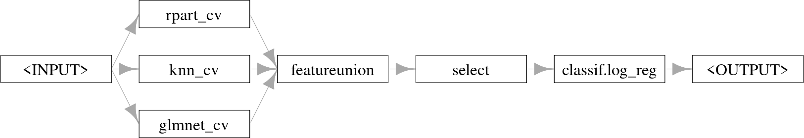

- `Graph`转换为`GraphLearner`，并用于训练`tsk('sonar')`，  
  再通过查看最终训练好的模型来检查0级学习器的权重
  - 模型权重表明，K近邻算法（KNN）以最大的系数对预测结果影响最大

```r
glrn_stack <- as_learner(gr_stack)
glrn_stack$train(tsk('sonar'))
glrn_stack$base_learner()$model
```

```js
Call:  stats::glm(formula = form, family = 'binomial', data = data, 
    model = FALSE)

Coefficients:
     (Intercept)   rpart_cv.prob.M     knn_cv.prob.M  glmnet_cv.prob.M  
          -4.863             1.423             6.058             1.095  

Degrees of Freedom: 207 Total (i.e. Null);  204 Residual
Null Deviance:     287.4 
Residual Deviance: 144  AIC: 152
```

- 将各个模型与堆叠管道一起进行基准测试以验证0级学习器中KNN的效果最佳

```r
glrn_stack$id <- 'stacking'

design <- benchmark_grid(
 tsk('sonar'),
 list(lrn_rpart, lrn_knn, lrn_glmnet, glrn_stack), 
 rsmp('repeated_cv')
)
bmr <- benchmark(design)

bmr$aggregate()[, .(learner_id, classif.ce)]
```

<table class='dataframe'>
<caption>A bmr_aggregate: 4 x 2</caption>
<thead>
 <tr><th scope=col>learner_id</th><th scope=col>classif.ce</th></tr>
 <tr><th scope=col>&lt;chr&gt;</th><th scope=col>&lt;dbl&gt;</th></tr>
</thead>
<tbody>
 <tr><td>classif.rpart </td><td>0.2884048</td></tr>
 <tr><td>classif.kknn  </td><td>0.1413095</td></tr>
 <tr><td>classif.glmnet</td><td>0.2471429</td></tr>
 <tr><td>stacking      </td><td>0.1296667</td></tr>
</tbody>
</table>

- `ppl('stacking', ...)`可以快速**自动创建**上述的堆叠`Graph`

```r
ppl(
 'stacking',
 base_learners = lrns(
  c(
   'classif.rpart', 
   'classif.kknn',
   'classif.glmnet')
  ),
 super_learner = lrn('classif.log_reg')
)
```

### 调优Graphs

- 可以进行2方面的调优工作：
  - 用给定的学习器进行预处理，通过固定的，通常为顺序执行的管道进行调优
  - 除了对管道的超参数调优以外，还要确定具体应将哪些PipeOp应用于数据
    - 组合算法选择与超参数优化  
    （Combined Algorithm Selection and Hyperparameter optimization）
    - 通过创建分支（branching）或代理（proxy），  
    可以方便地创建自己的微型自动化机器学习系统（mini AutoML systems），  
    甚至可以针对特定任务进行优化

#### 调优Graphs超参数

- 下面的例子中，我们要做的是：
  - 先构建一个PCA -> KKNN的`GraphLearner`
  - 再分别对PCA的`rank.`超参数和KKNN的`k`超参数进行调优

```r
# 设置调优范围并构建`GraphLearner`
po_pca <- po('pca', rank. = to_tune(2, 20))
lrn_knn <- lrn('classif.kknn', k = to_tune(1, 32))
graph_learner <- as_learner(po_pca %>>% lrn_knn)

# 简单确认`GraphLearner`的参数设置情况
graph_learner$param_set$values
```

- 可以看到被标记的待调优超参数

```js
$pca.rank.
Tuning over:
range [2, 20]


$classif.kknn.k
Tuning over:
range [1, 32]
```

- 接下来是熟悉的`auto_tuner()`构建一个预备调优的管道和一个不调优的管道，  
  通过benchmark比较两者性能的差异
  - 最后结果可以看出调优的管道性能更好（有更低的交叉熵）

```r
# 调优管道
glrn_tuned <- auto_tuner(
 tnr('random_search'), 
 graph_learner,
 rsmp('holdout'), 
 term_evals = 10
)
# 不调优管道
glrn_untuned <- po('pca') %>>% lrn('classif.kknn')

# Benchmark比较
design <- benchmark_grid(
 tsk('sonar'), 
 # 注意：
 # 这里的`glrn_tuned`是`autoTuner`和`Learner`类
 # `glrn_untuned`则是单纯的`Graph`
 # 依然可以作为`Learner`传递
 c(glrn_tuned, glrn_untuned),
 rsmp('cv', folds = 5))
benchmark(design)$aggregate()[, .(learner_id, classif.ce)]
```

<table class='dataframe'>
<caption>A bmr_aggregate: 2 x 2</caption>
<thead>
 <tr><th scope=col>learner_id</th><th scope=col>classif.ce</th></tr>
 <tr><th scope=col>&lt;chr&gt;</th><th scope=col>&lt;dbl&gt;</th></tr>
</thead>
<tbody>
 <tr><td>pca.classif.kknn.tuned</td><td>0.2062718</td></tr>
 <tr><td>pca.classif.kknn      </td><td>0.2307782</td></tr>
</tbody>
</table>

#### 使用`po('branch')`调整备选路径

- 如果只是单纯根据上面的流程对PCA参数进行调优，  
  是没有考虑调优后的PCA是否真的有利于构建后续模型
-

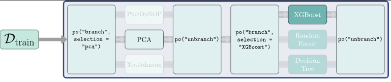

```r
# 加载R包
# library(mlr3oml)

# 下载例子数据
otsk_mnist <- otsk(id = 3573)
# 创建`Task`，通过子集化减少运行本例子的工作量
tsk_mnist <- as_task(otsk_mnist)$
 filter(sample(70000, 1000))$
 select(otsk_mnist$feature_names[sample(700, 100)])

# 创建3个预处理管道名称：
# 无操作，PCA，Yeo-Johnson变换
# 注意：这里只是指定名称而已，类似于id
# 也可以叫A，B，C
paths <- c('nop', 'pca', 'yeojohnson')

# 构建一个分支管道
graph <- po(
 'branch', # 指定为'branch'
 paths, # 传递需要分支的管道
 id = 'brnchPO' # 设置管道id
) %>>%
 # 传递需要并联的管道
 gunion(
  # 记得按照上面名称的顺序
  list(
   # 无操作管道
      po('nop'),
      # PCA管道
      po('pca'),
      # Yeo-Johnson变换管道
      po('removeconstants', id = 'rm_const') %>>%
       po('yeojohnson', id = 'YJ')
  )
) %>>% 
 # 接触分支
 po('unbranch', paths, id = 'unbrnchPO')

# 对`Graph`可视化观察一下
graph$plot(horizontal = TRUE)
```

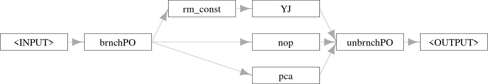

- 指定选定的管道的话，传递选用的管道名称到  
  `Graph$param_set$values$brnchPO.selection`即可
  - 下例为使用PCA管道
  - 可以看到结果是经过PCA降纬后的特征变量了

```r
# 指定管道为PCA
graph$
 param_set$
 values$
 brnchPO.selection <- 'pca'
# 查看选择PCA后的`Graph`的训练结果
head(graph$train(tsk_mnist)[[1]]$feature_names)
```

- 使用`ppl('branch', ...)`可以快速简化上面流程

```r
ppl('branch', graphs = pos(c('nop', 'pca', 'yeojohnson')))
```

- 构建一个后续包含学习器分支的`Graph`，并可视化

```r
graph_learner <- graph %>>%
 ppl('branch', lrns(c('classif.rpart', 'classif.kknn')))

graph_learner$plot(horizontal = TRUE)
```

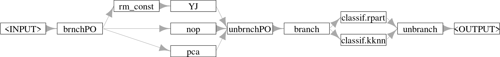

- 可以将`selection`看作超参数，用来选择最合适的管道

```r
# `Graph`将`GraphLearner`
graph_learner <- as_learner(graph_learner)

# 设置待调优的超参数
graph_learner$
 param_set$
 set_values(
  # 第一个branch：预处理branch
  brnchPO.selection = to_tune(paths),
  # 第二个branch：学习器branch
  branch.selection = to_tune(
    c('classif.rpart', 'classif.kknn')
  ),
  # 单独设置有依赖关系的kknn的`k`
  # 因为`k`仅在选择'classif.kknn'时生效
  classif.kknn.k = to_tune(
   p_int(
    1, 32,
    depends = branch.selection == 'classif.kknn'
   )
  )
 )

# 进行实例调优
instance <- tune(
 tnr('grid_search'), 
 tsk_mnist, 
 graph_learner,
 rsmp('repeated_cv', folds = 3, repeats = 3), 
 msr('classif.ce')
)

# 查看结果
instance$archive$data[order(classif.ce)[1:5],
  .(brnchPO.selection, classif.kknn.k, branch.selection, classif.ce)]
```

<table class='dataframe'>
<caption>A data.table: 5 x 4</caption>
<thead>
 <tr><th scope=col>brnchPO.selection</th><th scope=col>classif.kknn.k</th><th scope=col>branch.selection</th><th scope=col>classif.ce</th></tr>
 <tr><th scope=col>&lt;chr&gt;</th><th scope=col>&lt;int&gt;</th><th scope=col>&lt;chr&gt;</th><th scope=col>&lt;dbl&gt;</th></tr>
</thead>
<tbody>
 <tr><td>yeojohnson</td><td>11</td><td>classif.kknn</td><td>0.2533272</td></tr>
 <tr><td>yeojohnson</td><td>18</td><td>classif.kknn</td><td>0.2556648</td></tr>
 <tr><td>yeojohnson</td><td>15</td><td>classif.kknn</td><td>0.2556658</td></tr>
 <tr><td>yeojohnson</td><td> 8</td><td>classif.kknn</td><td>0.2563362</td></tr>
 <tr><td>yeojohnson</td><td>22</td><td>classif.kknn</td><td>0.2600015</td></tr>
</tbody>
</table>

```r
autoplot(instance)
```

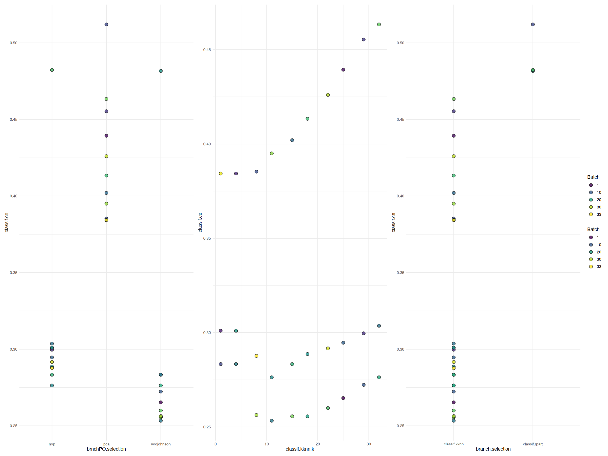

#### 使用`po(“proxy”)`进行调优

- `po('proxy')`
  - 一个元运算符，它执行存储在其 `content` 超参数中的操作
  - 超参数可以是另一个 `PipeOp` 或 `Graph`
  - 可用于调整和选择可以传递给此超参数的不同 `PipeOp` 或 `Graph`

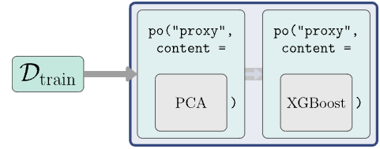

- 首先要用`po()'proxy')`创建占位符 `PipeOpProxy` 运算符

```r
graph_learner <- po('proxy', id = 'preproc') %>>%
 po('proxy', id = 'learner')
graph_learner <- as_learner(graph_learner)
```

- 超参数`content`需要传入`p_fct()`
  内容为一组带评估的离散元素
- 对于复杂的学习器而言，  不能直接对代理管道的内部的学习器超参数直接调优
  - 需要对学习器进行调优，因此要创建一个上层的超参数进行调优，  
   再把调优过的上层超参数传递给下层学习器里的超参数

```r
# -------预处理管道
# `p_fct()`创建`content`
preproc.content <- p_fct(
 list(
  nop = po('nop'),
  pca = po('pca'),
  yeojohnson = po('removeconstants') %>>% po('yeojohnson')
 )
)

# -------学习器管道
# `p_fct()`创建`content`
learner.content <- p_fct(
 list(
     classif.rpart = lrn('classif.rpart'),
     classif.kknn = lrn('classif.kknn')
 )
)
# 创建上层的超参数传递规则
trafo <- function(x, param_set) {
 if (!is.null(x$classif.kknn.k)) {
  # `$clone(deep = TRUE)`就是python的`.deepcopy()`
  # 一定要用深度复制，不然会修改掉原有`Learner`的超参数
  x$learner.content = x$learner.content$clone(deep = TRUE)
  # 将`classif.kknn.k`传递给原本KKNN学习器的`k`
  x$learner.content$param_set$values$k = x$classif.kknn.k
  # 清空`classif.kknn.k`
  x$classif.kknn.k = NULL
    }
    return(x)
}

# 创建搜索空间并将传递规则包装进去
search_space <- ps(
 preproc.content = preproc.content,
 learner.content = learner.content,
 # tune KKNN parameter as normal
 classif.kknn.k = p_int(
  1, 32,
  depends = learner.content == 'classif.kknn'
 ),
 .extra_trafo = trafo
)
```

- 将上面的构建用`tune()`包装并进行实例调优

```r
# 实例调优
instance <- tune(
 tnr('grid_search'), 
 tsk_mnist, 
 graph_learner,
 rsmp('repeated_cv', folds = 3, repeats = 3), 
 msr('classif.ce'),
 search_space = search_space
)

# 查看结果
as.data.table(instance$result)[,
 .(preproc.content,
 classif.kknn.k = x_domain[[1]]$learner.content$param_set$values$k,
 learner.content, classif.ce)
]
```

<table class='dataframe'>
<caption>A data.table: 1 x 4</caption>
<thead>
 <tr><th scope=col>preproc.content</th><th scope=col>classif.kknn.k</th><th scope=col>learner.content</th><th scope=col>classif.ce</th></tr>
 <tr><th scope=col>&lt;chr&gt;</th><th scope=col>&lt;int&gt;</th><th scope=col>&lt;chr&gt;</th><th scope=col>&lt;dbl&gt;</th></tr>
</thead>
<tbody>
 <tr><td>yeojohnson</td><td>11</td><td>classif.kknn</td><td>0.2583492</td></tr>
</tbody>
</table>

- 关于这里`$clone(deep = TRUE)`的用法，可以简单看看这个例子
  - 修改`lrn.clone`的`param_set`也会导致`lrn`被修改
  - 原因就是浅拷贝了`lrn`而没有复制`lrn`内部镶嵌的数据，  
   导致表层虽然被复制，当内部镶嵌的数据依然指向`lrn`的内部镶嵌数据
    - 意即：`lrn.clone`内部镶嵌的地址和`lrn`相同，  
    内部数据**并非复制**，而是**引用**

```r
lrn <- lrn('classif.rpart')
# Output 1
lrn$param_set

lrn.clone <- lrn$clone()
lrn.clone$param_set$set_values(cp = 0.5)

# Output 2
lrn.clone$param_set

# Output 3
lrn$param_set
```

```js
<ParamSet(10)>
                id    class lower upper nlevels        default  value
            <char>   <char> <num> <num>   <num>         <list> <list>
 1:             cp ParamDbl     0     1     Inf           0.01 [NULL]
 2:     keep_model ParamLgl    NA    NA       2          FALSE [NULL]
 3:     maxcompete ParamInt     0   Inf     Inf              4 [NULL]
 4:       maxdepth ParamInt     1    30      30             30 [NULL]
 5:   maxsurrogate ParamInt     0   Inf     Inf              5 [NULL]
 6:      minbucket ParamInt     1   Inf     Inf <NoDefault[0]> [NULL]
 7:       minsplit ParamInt     1   Inf     Inf             20 [NULL]
 8: surrogatestyle ParamInt     0     1       2              0 [NULL]
 9:   usesurrogate ParamInt     0     2       3              2 [NULL]
10:           xval ParamInt     0   Inf     Inf             10      

0<ParamSet(10)>
                id    class lower upper nlevels        default  value
            <char>   <char> <num> <num>   <num>         <list> <list>
 1:             cp ParamDbl     0     1     Inf           0.01    0.5
 2:     keep_model ParamLgl    NA    NA       2          FALSE [NULL]
 3:     maxcompete ParamInt     0   Inf     Inf              4 [NULL]
 4:       maxdepth ParamInt     1    30      30             30 [NULL]
 5:   maxsurrogate ParamInt     0   Inf     Inf              5 [NULL]
 6:      minbucket ParamInt     1   Inf     Inf <NoDefault[0]> [NULL]
 7:       minsplit ParamInt     1   Inf     Inf             20 [NULL]
 8: surrogatestyle ParamInt     0     1       2              0 [NULL]
 9:   usesurrogate ParamInt     0     2       3              2 [NULL]
10:           xval ParamInt     0   Inf     Inf             10      

0<ParamSet(10)>
                id    class lower upper nlevels        default  value
            <char>   <char> <num> <num>   <num>         <list> <list>
 1:             cp ParamDbl     0     1     Inf           0.01    0.5
 2:     keep_model ParamLgl    NA    NA       2          FALSE [NULL]
 3:     maxcompete ParamInt     0   Inf     Inf              4 [NULL]
 4:       maxdepth ParamInt     1    30      30             30 [NULL]
 5:   maxsurrogate ParamInt     0   Inf     Inf              5 [NULL]
 6:      minbucket ParamInt     1   Inf     Inf <NoDefault[0]> [NULL]
 7:       minsplit ParamInt     1   Inf     Inf             20 [NULL]
 8: surrogatestyle ParamInt     0     1       2              0 [NULL]
 9:   usesurrogate ParamInt     0     2       3              2 [NULL]
10:           xval ParamInt     0   Inf     Inf             10      0
```

#### 带子采样的超带算法

- 本例子中用SVM来建模

```r
# 加载R包
# library(mlr3tuning)

# 构建一个待调优的SVM学习器
learner <- lrn(
 'classif.svm', 
 id = 'svm', 
 type = 'C-classification',
 kernel = 'radial', 
 cost  = to_tune(1e-5, 1e5, logscale = TRUE),
 gamma = to_tune(1e-5, 1e5, logscale = TRUE)
)

# 构建`GraphLearner`
graph_learner <- as_learner(
 po(
  'subsample', 
  frac = to_tune(
   # `tags = 'budget'`是传递给超带算法的标签
   # 告诉超带算法`frac`是保真度参数
   p_dbl(3^-3, 1, tags = 'budget')
  )
 ) %>>%
 learner
)

# 封装函数并设立回退学习器
graph_learner$encapsulate('evaluate', lrn('classif.featureless'))
graph_learner$timeout <- c(train = 30, predict = 30)

# 实例调优
instance <- tune(
 tnr('hyperband', eta = 3), 
 tsk('sonar'), 
 graph_learner,
 rsmp('cv', folds = 3), 
 msr('classif.ce')
)

# 查看结果
instance$result_x_domain
```

```js
$subsample.frac
[1] 1

$svm.cost
[1] 48971.58

$svm.gamma
[1] 0.004148232
```

#### 使用过滤管道进行特征选择

- 选择3个特征变量

```r
# 加载R包
# library(mlr3filters)
# library(mlr3fselect)

# 创建`Task`
task_pen <- tsk('penguins')

# 创建连接过滤器和学习器的`Graph`
po_flt <- po(
 'filter', 
 filter = flt('information_gain'), 
 filter.nfeat = 3
)
graph <- po_flt %>>% po('learner', lrn('classif.rpart'))

# 先用`po_flt`训练`Task`，然后打印选择后的特征变量名
po('filter', filter = flt('information_gain'), filter.nfeat = 3)$
  train(list(task_pen))[[1]]$feature_names
```

```js
'bill_depth''bill_length''flipper_length'
```

- 对变量选择的数量进行调优

```r
# 对过滤器的特征数量标记调优
po_filter <- po(
 'filter', 
 filter = flt('information_gain'),
 filter.nfeat = to_tune(1, task_pen$ncol)
)

# 创建一个`GraphLearner`
graph <- as_learner(
 po_filter %>>% 
 po('learner', lrn('classif.rpart'))
)

# 实例调优
instance <- tune(
 tnr('random_search'), 
 task_pen, graph,
 rsmp('cv', folds = 3), 
 term_evals = 10
)

# 查看结果
instance$result
```

<table class='dataframe'>
<caption>A data.table: 1 x 4</caption>
<thead>
 <tr><th scope=col>information_gain.filter.nfeat</th><th scope=col>learner_param_vals</th><th scope=col>x_domain</th><th scope=col>classif.ce</th></tr>
 <tr><th scope=col>&lt;int&gt;</th><th scope=col>&lt;list&gt;</th><th scope=col>&lt;list&gt;</th><th scope=col>&lt;dbl&gt;</th></tr>
</thead>
<tbody>
 <tr><td>8</td><td>0, 8</td><td>8</td><td>0.06676837</td></tr>
</tbody>
</table>

- 可视化每次迭代的交叉熵
  - 虽然交叉熵最低的是选择8个变量，  
   但事实上变量少的模型的交叉熵也不是非常高，而是几乎接近
    - 从易解释性上而言，可以不使用最佳结果，  
    而是挑选更少的特征变量来建模

```r
autoplot(instance)
```

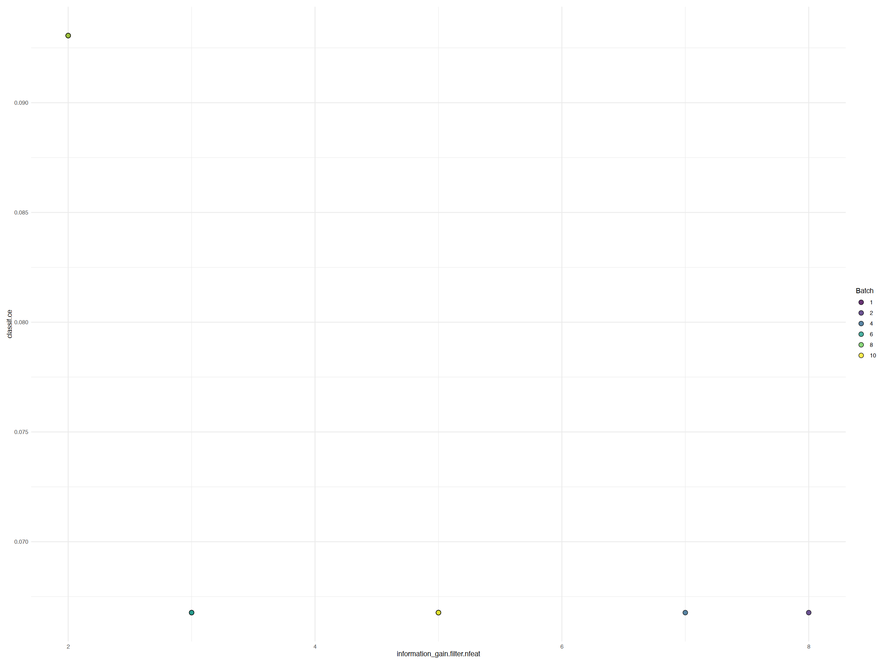

## 预处理

### 示例数据

- 示例数据为`ames_housing`

```r
ames <- mlr3data::ames_housing
```

```r
head(ames)
```

<table class='dataframe'>
<caption>A data.table: 6 x 82</caption>
<thead>
 <tr><th scope=col>Sale_Price</th><th scope=col>Alley</th><th scope=col>Bedroom_AbvGr</th><th scope=col>Bldg_Type</th><th scope=col>Bsmt_Cond</th><th scope=col>Bsmt_Exposure</th><th scope=col>Bsmt_Full_Bath</th><th scope=col>Bsmt_Half_Bath</th><th scope=col>Bsmt_Qual</th><th scope=col>Bsmt_Unf_SF</th><th scope=col>...</th><th scope=col>Second_Flr_SF</th><th scope=col>Street</th><th scope=col>Three_season_porch</th><th scope=col>Total_Bsmt_SF</th><th scope=col>TotRms_AbvGrd</th><th scope=col>Utilities</th><th scope=col>Wood_Deck_SF</th><th scope=col>Year_Built</th><th scope=col>Year_Remod_Add</th><th scope=col>Year_Sold</th></tr>
 <tr><th scope=col>&lt;int&gt;</th><th scope=col>&lt;fct&gt;</th><th scope=col>&lt;int&gt;</th><th scope=col>&lt;fct&gt;</th><th scope=col>&lt;fct&gt;</th><th scope=col>&lt;fct&gt;</th><th scope=col>&lt;int&gt;</th><th scope=col>&lt;int&gt;</th><th scope=col>&lt;fct&gt;</th><th scope=col>&lt;int&gt;</th><th scope=col>...</th><th scope=col>&lt;int&gt;</th><th scope=col>&lt;fct&gt;</th><th scope=col>&lt;int&gt;</th><th scope=col>&lt;int&gt;</th><th scope=col>&lt;int&gt;</th><th scope=col>&lt;fct&gt;</th><th scope=col>&lt;int&gt;</th><th scope=col>&lt;int&gt;</th><th scope=col>&lt;int&gt;</th><th scope=col>&lt;int&gt;</th></tr>
</thead>
<tbody>
 <tr><td>215000</td><td>NA</td><td>3</td><td>OneFam</td><td>Good   </td><td>Gd</td><td>1</td><td>0</td><td>Typical</td><td> 441</td><td>...</td><td>  0</td><td>Pave</td><td>0</td><td>1080</td><td>7</td><td>AllPub</td><td>210</td><td>1960</td><td>1960</td><td>2010</td></tr>
 <tr><td>105000</td><td>NA</td><td>2</td><td>OneFam</td><td>Typical</td><td>No</td><td>0</td><td>0</td><td>Typical</td><td> 270</td><td>...</td><td>  0</td><td>Pave</td><td>0</td><td> 882</td><td>5</td><td>AllPub</td><td>140</td><td>1961</td><td>1961</td><td>2010</td></tr>
 <tr><td>172000</td><td>NA</td><td>3</td><td>OneFam</td><td>Typical</td><td>No</td><td>0</td><td>0</td><td>Typical</td><td> 406</td><td>...</td><td>  0</td><td>Pave</td><td>0</td><td>1329</td><td>6</td><td>AllPub</td><td>393</td><td>1958</td><td>1958</td><td>2010</td></tr>
 <tr><td>244000</td><td>NA</td><td>3</td><td>OneFam</td><td>Typical</td><td>No</td><td>1</td><td>0</td><td>Typical</td><td>1045</td><td>...</td><td>  0</td><td>Pave</td><td>0</td><td>2110</td><td>8</td><td>AllPub</td><td>  0</td><td>1968</td><td>1968</td><td>2010</td></tr>
 <tr><td>189900</td><td>NA</td><td>3</td><td>OneFam</td><td>Typical</td><td>No</td><td>0</td><td>0</td><td>Good   </td><td> 137</td><td>...</td><td>701</td><td>Pave</td><td>0</td><td> 928</td><td>6</td><td>AllPub</td><td>212</td><td>1997</td><td>1998</td><td>2010</td></tr>
 <tr><td>195500</td><td>NA</td><td>3</td><td>OneFam</td><td>Typical</td><td>No</td><td>0</td><td>0</td><td>Typical</td><td> 324</td><td>...</td><td>678</td><td>Pave</td><td>0</td><td> 926</td><td>7</td><td>AllPub</td><td>360</td><td>1998</td><td>1998</td><td>2010</td></tr>
</tbody>
</table>

### 数据清洗

- 通过简单检查数据，可以发现几个问题：

1. 分类仅一种（常量特征）

```r
summary(ames$Misc_Feature_2)
```

```js
Othr: 2930
```

2. 数据完全一致

```r
identical(ames$Condition_2, ames$Condition_3)
```

```js
TRUE
```

3. 尺度上数据相同

```r
cor(ames$Lot_Area, ames$Lot_Area_m2)
```

```js
1
```

- 对于上述特征，最好的方法就是直接删除它们
- 可以简单先标记出来

```r
to_remove <- c('Lot_Area_m2', 'Condition_3', 'Misc_Feature_2')
```

- 除此以外还应该检查
  - 是否有**重复样本**：`ID`列是否全部的值是唯一的
  - 是否有**缺失值**：`NA`
  - 是否有**语义错误**：负的`Lot_Area`
  - 对于无法处理数值特征的学习器，  
   应该将数值特征**编码转换**为分类特征

```r
# 创建`Task`
tsk_ames <- as_task_regr(ames, target = 'Sale_Price', id = 'ames')
# 删除上述标记的有问题的特征变量
tsk_ames$select(setdiff(tsk_ames$feature_names, to_remove))

# 创建评估器
msr_mae <- msr('regr.mae')
# 创建重采样器
rsmp_cv3 <- rsmp('cv', folds = 3)
# 对需要重采样的`Task`构建重采样实例
rsmp_cv3$instantiate(tsk_ames)

# 创建一个无特征回归学习器，并对中位数进行预测
lrn_baseline <- lrn('regr.featureless', robust = TRUE) 
# 修改id名，以在后续流程中更容易识别
lrn_baseline$id <- 'Baseline' 
# 进行重采样
rr_baseline <- resample(tsk_ames, lrn_baseline, rsmp_cv3) 

# 获取整合结果
rr_baseline$aggregate(msr_mae)
```

```js
regr.mae: 56067.172671583
```

### 因子编码

- 分类变量可以基于基数（cardinality）进行分组：
  - 二元特征
    - 独热编码
  - 低基数特征
    - 独热编码
    - 虚拟编码
      - 广义线性模型（GLM）
      - 加法模型（GAM）
  - 高基数特征
    - 影响编码
      - 使用目标特征在分类特征和一个数值之间创建映射，  
     该数值反映其在预测目标特征时的重要性
      - 步骤
        - 按分类特征对目标变量进行分组
        - 计算每个组中目标变量的均值
        - 计算目标变量的全局均值
        - 计算每个组的影响得分，  
      即该组目标变量的均值与目标变量全局均值之间的差值
        - 用影响得分替换分类特征
      - 由于使用目标信息来计算影响分数，  
     编码过程必须嵌入到交叉验证中，  
     以避免训练数据和测试数据之间的信息泄露
    - 去除常量特征
    - 合并小类别
    - 分层
- 通常超过**10**个基数的可以被视为**高基数特征**

```r
# 找出高基数特征
names(which(lengths(tsk_ames$levels()) > 10))
# 找出二元特征
names(which(lengths(tsk_ames$levels()) == 2))
```

```js
'Exterior_1st''Exterior_2nd''MS_SubClass''Neighborhood'

'Alley''Central_Air''Street'
```

- 构建一个预处理的`Graph`，注意下面顺序

```r
factor_pipeline <-
 # 去除常量特征
    po('removeconstants') %>>%
    # 合并罕见类别
 po(
  # 合并
  'collapsefactors', 
  # 设置对频率低于1%的类别进行合并
  no_collapse_above_prevalence = 0.01
 ) %>>%
 # 对高基数特征数值编码
 po(
  # 对满足指定条件的特征进行数值编码
  'encodeimpact',
  # 指定作用于基数>2的特征
  affect_columns = selector_cardinality_greater_than(10),
  # 设置识别id
  id = 'high_card_enc'
 ) %>>%
 # 独热编码
 po(
  # 指定处理为因子编码
  'encode', 
  # 指定为独热编码
  method = 'one-hot',
  # 指定作用于基数>2的特征
  affect_columns = selector_cardinality_greater_than(2),
  # 设置识别id
  id = 'low_card_enc'
 ) %>>%
 # 将二元特征哑变量处理
 po(
  # 指定处理为因子编码
  'encode', 
  # 省略因子中第一个级别的变量
  method = 'treatment',
  # 指定类型为因子的特征
  # 到这一步都已经转化为数值了，
  # 所以直接筛选因子即可
  affect_columns = selector_type('factor'), 
  # 设置识别id
  id = 'binary_enc'
 )
```

- 将上述预处理与仅进行独热编码预处理两种方式进行benchmark比较
  - 可见上述预处理管道的平均绝对误差比仅进行独热编码预处理更好，  
   因为平均绝对误差更小

```r
# 构建xgboost学习器
lrn_xgb <- lrn('regr.xgboost', nrounds = 100)

# 将预处理管道与学习器连接并构建`GraphLearner`
glrn_xgb_impact <- as_learner(factor_pipeline %>>% lrn_xgb)
# 设置识别id
glrn_xgb_impact$id <- 'XGB_enc_impact'

# 将仅进行独热编码的管道与学习器连接并构建`GraphLearner`
glrn_xgb_one_hot <- as_learner(po('encode') %>>% lrn_xgb)
# 设置识别id
glrn_xgb_one_hot$id <- 'XGB_enc_onehot'

# benchmark比较
bmr <- benchmark(
 benchmark_grid(
  tsk_ames,
  c(lrn_baseline, glrn_xgb_impact, glrn_xgb_one_hot), 
  rsmp_cv3
 )
)

# 打印整合结果
bmr$aggregate(measure = msr_mae)[, .(learner_id, regr.mae)]
```

<table class='dataframe'>
<caption>A bmr_aggregate: 3 x 2</caption>
<thead>
 <tr><th scope=col>learner_id</th><th scope=col>regr.mae</th></tr>
 <tr><th scope=col>&lt;chr&gt;</th><th scope=col>&lt;dbl&gt;</th></tr>
</thead>
<tbody>
 <tr><td>Baseline      </td><td>56089.88</td></tr>
 <tr><td>XGB_enc_impact</td><td>15962.13</td></tr>
 <tr><td>XGB_enc_onehot</td><td>16500.48</td></tr>
</tbody>
</table>

### 缺失值

- 几种插补方法
  - `po('imputemean')`：均值插补
  - `po('imputemedian')`：中位数插补
  - `po('imputemode')`：众数插补
  - `po('imputehist')`：通过直方图估算数值特征插补
  - `po('imputeoor')`：  
   `.MISSING`，范围外插补（Out of Range Imputation ）  
   用低于最小值或高于最大值的常数值填补数值特征

- 下图为均值插补的示例

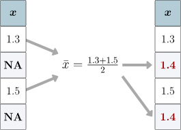

- 查看`Task`中包含缺失值的特征（）

```r
names(which(tsk_ames$missings() > 0))
```

```js
'Alley''BsmtFin_SF_1''BsmtFin_SF_2''BsmtFin_Type_1''BsmtFin_Type_2''Bsmt_Cond''Bsmt_Exposure''Bsmt_Full_Bath''Bsmt_Half_Bath''Bsmt_Qual''Bsmt_Unf_SF''Electrical''Fence''Fireplace_Qu''Garage_Area''Garage_Cars''Garage_Cond''Garage_Finish''Garage_Qual''Garage_Type''Garage_Yr_Blt''Lot_Frontage''Mas_Vnr_Area''Mas_Vnr_Type''Misc_Feature''Pool_QC''Total_Bsmt_SF'
```

```r
impute_hist <- list(
 # 跟踪缺失值
 po(
  # 对缺失值标记为1，否则为0
  'missind', 
  # 对数据里的整数型变量生成缺失值指示变量
  type = 'integer',
  # 选择整数列
  affect_columns = selector_type('integer')
 ),
 # 直方图插补
 po(
  # 选择为直方图插补
  'imputehist', 
  # 选择整数列
  affect_columns = selector_type('integer')
 )
) %>>%
 # 特征合并
 po('featureunion') %>>%
 # 范围外插补
 po(
  # 选择范围外插补
  'imputeoor', 
  # 选择因子列
  affect_columns = selector_type('factor')
 )

# 可视化一下`Graph`
impute_hist$plot(horizontal = TRUE)
```

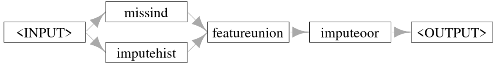

- 通过benchmark比较上述管道和纯imputeoor方法插补的模型的性能差异

```r
# 用上面的管道进行插补并连接随机森林
glrn_rf_impute_hist <- as_learner(impute_hist %>>% lrn('regr.ranger'))
glrn_rf_impute_hist$id <- 'RF_imp_Hist'

# 仅用imputeoor方法插补并连接随机森林
glrn_rf_impute_oor <- as_learner(po('imputeoor') %>>% lrn('regr.ranger'))
glrn_rf_impute_oor$id <- 'RF_imp_OOR'

# 进行两者的benchmark比较
design <- benchmark_grid(
 tsk_ames,
 c(glrn_rf_impute_hist, glrn_rf_impute_oor), 
 rsmp_cv3
)

# 这里代码有问题，会报错
# 以下为官网给出的结果
bmr_new <- benchmark(design)

# 查看结果
bmr$combine(bmr_new)
bmr$aggregate(measure = msr_mae)[, .(learner_id, regr.mae)]
```

```js
       learner_id regr.mae
1:       Baseline    56056
2: XGB_enc_impact    16068
3: XGB_enc_onehot    16098
4:    RF_imp_Hist    16400
5:     RF_imp_OOR    16395
```

### 管道稳健化

- `ppl('robustify')`包含以下的内容：
  - `po('removeconstants')`：  
   移除常量特征
  - `po('colapply')`：  
   字符和序号特征编码为分类特征，  
   日期/时间特征编码为数值特征
  - `po('imputehist')`：  
   数值特征通过直方图采样进行插补
  - `po('imputesample')`：  
   逻辑特征通过从经验分布中采样进行插补，  
   这仅影响 `$predict()` 步骤
  - `po('missind')`：  
   为估算的数值变量和逻辑变量添加缺失数据指示符
  - `po('imputeoor')`：  
   分类特征的缺失值用一个新的类别进行编码
  - `po('fixfactors')`：  
   修正分类特征的水平，  
   以便在预测和训练期间具有相同的水平（这可能涉及删除空因子水平）
  - `po('imputesample')`：  
   上一步中因删除类别而在分类特征中引入的缺失值，  
   通过从经验分布中采样来进行插补
  - `po('collapsefactors')`：  
   分类特征的水平会被合并（从训练数据中最罕见的因素开始），  
   直到水平数量少于某个特定数量，
   该数量由 `max_cardinality` 参数控制（保守默认值为 `1000`）
  - `po('encode')`：  
   分类特征进行独热编码
  - `po('removeconstants')`：  
   移除可能在先前步骤中创建的常量特征
- `ppl('robustify')` 有可选参数 `task` 和 `learner`
  - 如果提供了这些参数，  
   那么生成的管道将被设置为专门处理给定的任务和学习器
  - 例如，如果学习器具有 `'missings'` 属性，  
   或者如果任务中一开始就没有缺失值，  
   它将不会插补缺失值

- 这里用线性回归为例子

```r
# 构建一个`GraphLearner`并命名id
glrn_lm_robust <- as_learner(ppl('robustify') %>>% lrn('regr.lm'))
glrn_lm_robust$id <- 'lm_robust'

# benchmark比较
bmr_new <- benchmark(
 benchmark_grid(
  tsk_ames, 
  glrn_lm_robust,  
  rsmp_cv3
 )
)
# 新管道结果与之前的bmr结果合并
bmr$combine(bmr_new)
# 获取整合结果
bmr$aggregate(measure = msr_mae)[, .(learner_id, regr.mae)]
```

<table class='dataframe'>
<caption>A bmr_aggregate: 4 x 2</caption>
<thead>
 <tr><th scope=col>learner_id</th><th scope=col>regr.mae</th></tr>
 <tr><th scope=col>&lt;chr&gt;</th><th scope=col>&lt;dbl&gt;</th></tr>
</thead>
<tbody>
 <tr><td>Baseline      </td><td>56159.11</td></tr>
 <tr><td>XGB_enc_impact</td><td>15959.01</td></tr>
 <tr><td>XGB_enc_onehot</td><td>16374.55</td></tr>
 <tr><td>lm_robust     </td><td>16139.08</td></tr>
</tbody>
</table>

### 转换特征和目标

- 对特征和目标进行简单的变换，对于某些学习器可能是有益的
  - 对目标进行对数变换有助于使分布更加对称，并有助于减少异常值的影响
  - 对有偏态的特征进行对数变换也有助于降低异常值的影响
- 下面代码绘制了ames数据集中目标的分布，然后绘制了经过对数变换后的目标分布
 对变量取对数使分布更加对称，异常值也更少。

```r
# 加载合并plot的R包
# library(patchwork)

# 创建一个用于对数转换的
log_ames <- ames
# 对`Sale_Price`进行对数转换
log_ames[, logSalePrice := log(Sale_Price)]
# 绘图
autoplot(as_task_regr(log_ames, target = 'Sale_Price')) +
 autoplot(as_task_regr(log_ames, target = 'logSalePrice'))
```

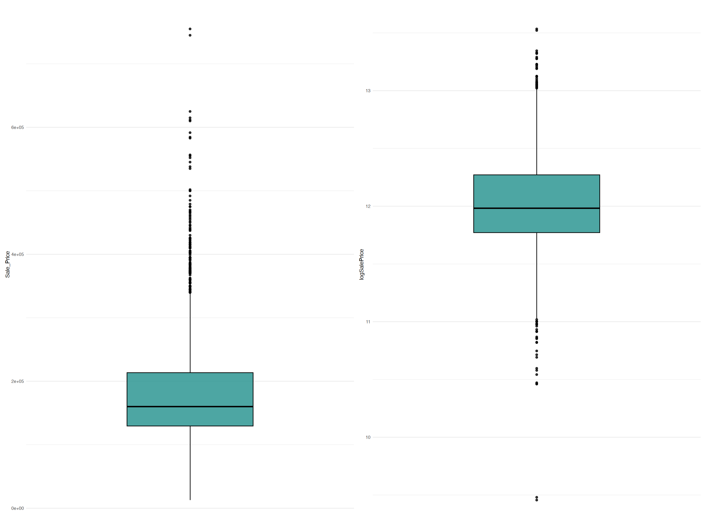

- 手动进行简单的对数转换

```r
# 用随机数创建示例数据
df <- data.table(x = runif(5), y = runif(5, 10, 20))
df

# 对y进行对数转换
df[, y := log(y)]
df$y

# 用回归模型拟合数据后进行预测
yhat = predict(lm(y ~ x, df), df)
yhat

exp(yhat)
```

<table class='dataframe'>
<caption>A data.table: 5 x 2</caption>
<thead>
 <tr><th scope=col>x</th><th scope=col>y</th></tr>
 <tr><th scope=col>&lt;dbl&gt;</th><th scope=col>&lt;dbl&gt;</th></tr>
</thead>
<tbody>
 <tr><td>0.16287878</td><td>16.01323</td></tr>
 <tr><td>0.17030617</td><td>13.71607</td></tr>
 <tr><td>0.03883123</td><td>19.62250</td></tr>
 <tr><td>0.23552246</td><td>10.14073</td></tr>
 <tr><td>0.67070117</td><td>13.95870</td></tr>
</tbody>
</table>

```js
       1        2        3        4        5 
2.695238 2.692759 2.736655 2.670984 2.525687 

       1        2        3        4        5 
14.80905 14.77237 15.43527 14.45419 12.49948 
```

- 管道`ppl('targettrafo')`可以在重采样和benchmark比较时，  
  简单地将数据转换嵌入进去
  - 只需要指定2个参数即可
    - `targetmutate.trafo`：  
    用于在训练期间对目标应用变换
    - `targetmutate.inverter`：  
    用于在预测期间应用变换以反转原始变换
- 也就是说，在训练和预测时都用转换后的数据，  
  但是在返回结果的时候是将数据反转回来的

```r
glrn_log_lm_robust <- as_learner(
 ppl(
  'targettrafo',
  graph = glrn_lm_robust,
  targetmutate.trafo = function(x) log(x),
  targetmutate.inverter = function(x){
   list(response = exp(x$response))
  }
 )
)
glrn_log_lm_robust$id <- 'lm_robust_logtrafo'

bmr_new <- benchmark(
 benchmark_grid(
  tsk_ames, 
  glrn_log_lm_robust,
  rsmp_cv3
 )
)

bmr$combine(bmr_new)
bmr$aggregate(measure = msr_mae)[, .(learner_id, regr.mae)]
```

<table class='dataframe'>
<caption>A bmr_aggregate: 5 x 2</caption>
<thead>
 <tr><th scope=col>learner_id</th><th scope=col>regr.mae</th></tr>
 <tr><th scope=col>&lt;chr&gt;</th><th scope=col>&lt;dbl&gt;</th></tr>
</thead>
<tbody>
 <tr><td>Baseline          </td><td>56159.11</td></tr>
 <tr><td>XGB_enc_impact    </td><td>15959.01</td></tr>
 <tr><td>XGB_enc_onehot    </td><td>16374.55</td></tr>
 <tr><td>lm_robust         </td><td>16139.41</td></tr>
 <tr><td>lm_robust_logtrafo</td><td>15501.52</td></tr>
</tbody>
</table>

### 函数特征提取

- 本节关注相互依赖的特征
  - 因为这些特征单独存在没有用处，  
   但组合起来会提供有用信息
- 下图中
  - 变量x1、x2、x3是常规特征
  - 变量xt1，…，xt365是函数特征

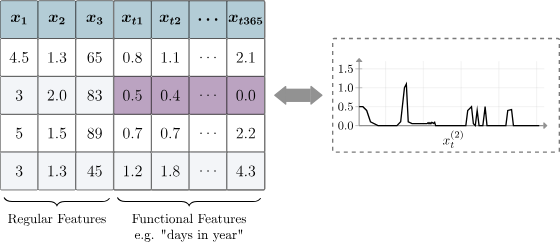

- 本节的示例数据
  - 在这个数据集中，每一行代表一栋房屋，  
   每个特征是给定时间厨房电器的总耗电量
  - 耗电量以2分钟为间隔进行测量，因此产生了720个特征

```r
energy_data <- mlr3data::energy_usage
head(energy_data)
```

<table class='dataframe'>
<caption>A data.table: 6 x 720</caption>
<thead>
 <tr><th scope=col>att1</th><th scope=col>att2</th><th scope=col>att3</th><th scope=col>att4</th><th scope=col>att5</th><th scope=col>att6</th><th scope=col>att7</th><th scope=col>att8</th><th scope=col>att9</th><th scope=col>att10</th><th scope=col>...</th><th scope=col>att711</th><th scope=col>att712</th><th scope=col>att713</th><th scope=col>att714</th><th scope=col>att715</th><th scope=col>att716</th><th scope=col>att717</th><th scope=col>att718</th><th scope=col>att719</th><th scope=col>att720</th></tr>
 <tr><th scope=col>&lt;dbl&gt;</th><th scope=col>&lt;dbl&gt;</th><th scope=col>&lt;dbl&gt;</th><th scope=col>&lt;dbl&gt;</th><th scope=col>&lt;dbl&gt;</th><th scope=col>&lt;dbl&gt;</th><th scope=col>&lt;dbl&gt;</th><th scope=col>&lt;dbl&gt;</th><th scope=col>&lt;dbl&gt;</th><th scope=col>&lt;dbl&gt;</th><th scope=col>...</th><th scope=col>&lt;dbl&gt;</th><th scope=col>&lt;dbl&gt;</th><th scope=col>&lt;dbl&gt;</th><th scope=col>&lt;dbl&gt;</th><th scope=col>&lt;dbl&gt;</th><th scope=col>&lt;dbl&gt;</th><th scope=col>&lt;dbl&gt;</th><th scope=col>&lt;dbl&gt;</th><th scope=col>&lt;dbl&gt;</th><th scope=col>&lt;dbl&gt;</th></tr>
</thead>
<tbody>
 <tr><td>0.7152669</td><td>0.7152669</td><td>0.7152669</td><td>0.7152669</td><td>0.7152669</td><td>0.7152669</td><td>0.7152669</td><td>0.7152669</td><td>0.7152669</td><td>0.7152669</td><td>...</td><td>0.5711418</td><td>0.5051663</td><td>0.5011082</td><td>0.5711418</td><td>0.5051663</td><td> 0.5011082</td><td> 0.5711418</td><td> 0.5751999</td><td> 0.7112089</td><td> 0.7112089</td></tr>
 <tr><td>0.2670886</td><td>0.2670886</td><td>0.2670886</td><td>0.2670886</td><td>0.2670886</td><td>0.2670886</td><td>0.2670886</td><td>0.2670886</td><td>0.2670886</td><td>0.2670886</td><td>...</td><td>0.2670886</td><td>0.2670886</td><td>0.2670886</td><td>0.2670886</td><td>0.2670886</td><td> 0.2670886</td><td> 0.2670886</td><td> 0.2670886</td><td> 0.2670886</td><td> 0.2670886</td></tr>
 <tr><td>0.4635391</td><td>0.4635391</td><td>0.4796599</td><td>0.4635391</td><td>0.4635391</td><td>0.4635391</td><td>0.4796599</td><td>0.4635391</td><td>0.4635391</td><td>0.4796599</td><td>...</td><td>0.4796599</td><td>0.4635391</td><td>0.4635391</td><td>0.4635391</td><td>0.4796599</td><td> 0.4635391</td><td> 0.4635391</td><td> 0.4635391</td><td> 0.4796599</td><td> 0.4635391</td></tr>
 <tr><td>0.5989330</td><td>0.5989330</td><td>0.5989330</td><td>0.5026779</td><td>0.5989330</td><td>0.5989330</td><td>0.5989330</td><td>0.5026779</td><td>0.5989330</td><td>0.5989330</td><td>...</td><td>0.5989330</td><td>0.5989330</td><td>0.5026779</td><td>0.5989330</td><td>0.5989330</td><td> 0.5989330</td><td> 0.5026779</td><td> 0.5989330</td><td> 0.5989330</td><td> 0.5989330</td></tr>
 <tr><td>0.3445082</td><td>0.3445082</td><td>0.2493033</td><td>0.3445082</td><td>0.3445082</td><td>0.3445082</td><td>0.3445082</td><td>0.2493033</td><td>0.3445082</td><td>0.3445082</td><td>...</td><td>0.3445082</td><td>0.3445082</td><td>0.3445082</td><td>0.3445082</td><td>5.9254138</td><td>10.8020196</td><td>13.1427906</td><td>10.8020196</td><td>11.3593466</td><td>10.5233566</td></tr>
 <tr><td>0.3728099</td><td>0.2765897</td><td>0.2287661</td><td>0.2765897</td><td>0.3728099</td><td>0.2765897</td><td>0.2765897</td><td>0.3246998</td><td>0.2287661</td><td>0.2765897</td><td>...</td><td>0.3770731</td><td>0.3070396</td><td>0.3070396</td><td>0.3292495</td><td>0.3070396</td><td> 0.3070396</td><td> 0.3770731</td><td> 0.3770731</td><td> 0.4693166</td><td> 0.5171402</td></tr>
</tbody>
</table>

- 为了确认哪些特征是有用的，  
  先对第一个样本将2分钟间隔的连续时间点上的电力消费量做图
- 由于每个单独的特征无法提供有用的信息，  
  不可能将720个特征都用来建模，  
  也无法选择最佳的特征变量子集
- 可以提取曲线中有用的信息：
  - 最大使用功率
  - 总使用功率
  - 峰值数量
  - 其他曲线中的有用特征

```r
# 加载绘图包
# library(ggplot2)

# 对2分钟间隔的连续时间点上的电力消费量做图
ggplot(
 data.frame(y = as.numeric(energy_data[1, ])),
    aes(y = y, x = 1:720)
) +
  geom_line() + 
  theme_minimal() +
  labs(x = '2-Minute Interval', y = 'Power Consumption')
```

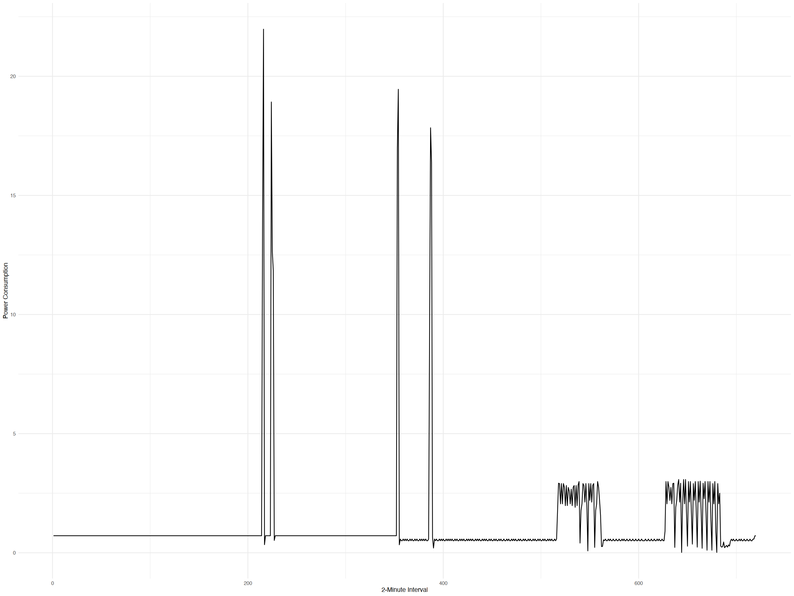

- 编写一个R6类的函数用于提取  
  提取功耗的均值、最小值、最大值和方差，  
  然后删除原有的特征变量
-

```r
PipeOpFuncExtract <- R6::R6Class(
 # 定义一个新类`PipeOpFuncExtract`
 'PipeOpFuncExtract',
 # 选择继承自`PipeOpTaskPreprocSimple`
 inherit = mlr3pipelines::PipeOpTaskPreprocSimple,
 # 定义一个私有方法
 private = list(
  # 定义函数用来变量提取
  .transform_dt = function(dt, levels) {
   # 选择所有'att'开头的特征变量
   ffeat_names <- paste0('att', 1:720)
   # 
   ffeats <- dt[, ..ffeat_names]
   # 提取功耗均值，最小值，最大值，反差
   dt[, energy_means := apply(ffeats, 1, mean)]
   dt[, energy_mins := apply(ffeats, 1, min)]
   dt[, energy_maxs := apply(ffeats, 1, max)]
   dt[, energy_vars := apply(ffeats, 1, var)]
   # 删除原有的特征变量
   dt[, (ffeat_names) := NULL]
   # 返回数据集
   return(dt)
  }
 )
)
```

- 测试`PipeOp`是否按预期工作

```r
# 合并房屋和功耗数据集（原本是同一批样本）
tsk_ames_ext <- cbind(ames, energy_data)
# 创建`Task`，并更改id
tsk_ames_ext <- as_task_regr(tsk_ames_ext, 'Sale_Price', 'ames_ext')
# 移除那些有问题的特征（本章开头筛选出来的）
tsk_ames_ext$select(setdiff(tsk_ames_ext$feature_names, to_remove))

# 创建`PipeOpFuncExtract`类的实例并命名id
func_extractor <- PipeOpFuncExtract$new('energy_extract')
# 用创造的实例处理`tsk_ames_ext`
tsk_ames_ext <- func_extractor$train(list(tsk_ames_ext))[[1]]

# 查看第一个样本的
tsk_ames_ext$data(
 1,
 c('energy_means', 'energy_mins', 'energy_maxs', 'energy_vars')
)
```

<table class='dataframe'>
<caption>A data.table: 1 x 4</caption>
<thead>
 <tr><th scope=col>energy_means</th><th scope=col>energy_mins</th><th scope=col>energy_maxs</th><th scope=col>energy_vars</th></tr>
 <tr><th scope=col>&lt;dbl&gt;</th><th scope=col>&lt;dbl&gt;</th><th scope=col>&lt;dbl&gt;</th><th scope=col>&lt;dbl&gt;</th></tr>
</thead>
<tbody>
 <tr><td>1.061558</td><td>0.01426834</td><td>21.97755</td><td>3.708473</td></tr>
</tbody>
</table>

- 接下来用benchmark比较这些管道的模型效果
  - 通过添加合并后的电力消耗信息可以让模型拟合的更好

```r
learners <- list(
 lrn_baseline, 
 lrn('regr.rpart'), 
 glrn_xgb_impact,
 # 这个是之前构建失败的，这里就没用它了
    # glrn_rf_impute_oor, 
    glrn_lm_robust, 
    glrn_log_lm_robust
)

bmr_final <- benchmark(
 benchmark_grid(
 c(tsk_ames_ext, tsk_ames), 
 learners,
 rsmp_cv3)
)

# 整合结果
perf <- bmr_final$aggregate(measure = msr_mae)
# 对整合的结果排序后打印
perf[order(learner_id, task_id), .(task_id, learner_id, regr.mae)]
```

<table class='dataframe'>
<caption>A bmr_aggregate: 10 x 3</caption>
<thead>
 <tr><th scope=col>task_id</th><th scope=col>learner_id</th><th scope=col>regr.mae</th></tr>
 <tr><th scope=col>&lt;chr&gt;</th><th scope=col>&lt;chr&gt;</th><th scope=col>&lt;dbl&gt;</th></tr>
</thead>
<tbody>
 <tr><td>ames    </td><td>Baseline          </td><td>56159.11</td></tr>
 <tr><td>ames_ext</td><td>Baseline          </td><td>56159.11</td></tr>
 <tr><td>ames    </td><td>XGB_enc_impact    </td><td>15959.01</td></tr>
 <tr><td>ames_ext</td><td>XGB_enc_impact    </td><td>14537.98</td></tr>
 <tr><td>ames    </td><td>lm_robust         </td><td>16123.83</td></tr>
 <tr><td>ames_ext</td><td>lm_robust         </td><td>14969.29</td></tr>
 <tr><td>ames    </td><td>lm_robust_logtrafo</td><td>15510.96</td></tr>
 <tr><td>ames_ext</td><td>lm_robust_logtrafo</td><td>13903.53</td></tr>
 <tr><td>ames    </td><td>regr.rpart        </td><td>27979.09</td></tr>
 <tr><td>ames_ext</td><td>regr.rpart        </td><td>27689.78</td></tr>
</tbody>
</table>

## 并行化

### 简介

- 使用`parallel`包演示简单的并行化
  - `chunk.size`：处理区块

```r
# 加载R包并设置并行化参数
# library(parallel)
cores <- 4
cl <- makeCluster(cores)

# 创建一个简单的函数
x = 1:10000
f = function(y) sqrt(y + 1)

# 单个运行
system.time({parSapply(cl, x, f, chunk.size = 1)})
# 一个区块2500个数据运行
system.time({parSapply(cl, x, f, chunk.size = 2500)})
```

```js
   user  system elapsed 
  0.392   0.187   1.605 

   user  system elapsed 
  0.002   0.000   0.016 
```

### 学习器的并行化

- 构建一个随机森林学习器
  - 查看默认线程数可知为1个（无并行化）

```r
# 构建学习器学习器
lrn_ranger <- lrn('classif.ranger')
lrn_ranger$param_set$ids(tags = 'threads')

# 查看初始默认线程数
lrn_ranger$param_set$values$num.threads
```

```js
1
```

- 设置指定的线程数

```r
set_threads(lrn_ranger, n = 4)
lrn_ranger$param_set$values$num.threads
```

```js
4
```

- 查看可用的线程数

```r
availableCores()
```

```js
8
```

- 自动检测并设定最大可用线程数

```r
set_threads(lrn_ranger)
lrn_ranger$param_set$values$num.threads
```

```js
8
```

- 如果要控制默认使用的线程数量，  
  可在`.Rprofile`文件中如下设置

```r
# 设置最大4个
options(mc.cores = 4)
```

### 重采样和benchmark的并行化

- mlr3 利用 `future` 实现使用并行后端对重采样迭代进行并行化
  - 可通过 `plan()` 函数对此进行配置
  - 默认情况下，除非在 `future::plan()` 中指定参数 `workers`，  
   否则会使用机器的所有 CPU

```r
# 加载R包
# library(future)

# 计划为多核模式
future::plan('multisession')

# 重采样
tsk_sonar <- tsk('sonar')
lrn_rpart <- lrn('classif.rpart')
rsmp_cv3 <- rsmp('cv', folds = 3)
system.time({resample(tsk_sonar, lrn_rpart, rsmp_cv3)})
```

```js
   user  system elapsed 
  0.471   0.053   1.926 
```

- 一般来说，建议**仅对每次迭代至少运行几秒**的重采样考虑并行化
- 有两个 `mlr3` 选项可用于控制执行和粒度：
  - 如果`mlr3.exec_random`设置为`TRUE`（默认值），
   则在重抽样和基准测试中，  
   任务的顺序将被随机化；  
   适用于在运行基准测试或调参时遇到运行时间差异较大的情况
  - 选项 `mlr3.exec_chunk_size` 可用于  
   控制将多少个任务映射到单个 `future`，  
   默认值为 `1`；  
   此选项的值会传递给 `future_mapply()`，  
   并且 `future.scheduling` 始终设置为 `TRUE`
- 调整块大小在某些罕见情况下有助于减少并行化开销，  
  但在较大问题或较长运行时间的情况下不太可能有用

- 下图展示上面3折CV的重采样并行化流程：
  - 主进程调用`resample()`函数，该函数启动并行化过程，  
   并将计算任务分为三个部分用于三折交叉验证
  - 这些折被传递给三个worker，  
   每个worker在任务的相应子集上拟合模型，  
   并对留出的观测值进行预测
  - 预测结果（和训练好的模型）被传回主进程，  
   主进程将它们合并为一个`ResampleResult`

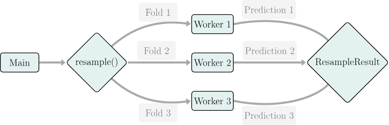

- 基准测试可以看作是多个独立重采样的集合，  
  其中任务、学习器和重采样策略的组合定义了要执行的一次重采样
- 可以选择以下两种方式之一：
  - 对所有重采样进行并行处理，并按顺序执行每个重采样（并行化外层循环）
  - 遍历所有重采样，并并行执行每个重采样（并行化内循环）

```pseudocode
foreach combination of (task, learner, resampling strategy) {
    foreach resampling iteration {
        execute(resampling, j)
    }
}
```

- `mlr3` 通过将所有实验展平到同一级别，  
  即 `benchmark()` 会遍历外层和内层循环迭代的笛卡尔积中的元素
  - 因此，无需决定是要并行化调参还是重采样，因为始终对两者都进行并行化
  - 这种方法使计算更加精细，  
   并允许 `future` 后端将任务分组为合适大小的块（取决于工作线程数），  
   还使该过程与并行化重采样完全相同

```r
# 创建benchmark设计
design <- benchmark_grid(
 tsks(c('sonar', 'penguins')),
 lrns(c('classif.featureless', 'classif.rpart')), 
 rsmp_cv3
)

# 设置并行化计算
future::plan('multisession')

# 执行并行化的benchmark比较
bmr <- benchmark(design)
```

### 调优的并行化

- 调优一般是迭代的过程
  - 每次迭代后，  
   大多数调优器会根据获得的性能值以某种方式进行自我调整
  - 随机搜索和网格搜索是例外
    - 它们并不根据过往结果选择配置
    - 对于这些调优器而言，所有评估都是相互独立的
    - 原则上可以完全并行化。
- 在`mlr3`中作为迭代benchmark测试来实现
  - `Tuner`提出一批学习器，  
   每个学习器的 param_set$values`具有不同的配置，  
   其中批次大小通常可以通过batch_size配置参数进行控制
  - 该批次会连同调优实例的重采样策略一起传递给`benchmark()`
- 由于每次对 `benchmark()` 的调用都依赖于先前的结果，  
  因此通常无法在比单个基准测试更高的级别上并行化调优
  - 相反，单个 `benchmark()` 评估由 `mlr3` 并行化，  
   就好像它们是无需调优的实验一样
  - 这意味着每个评估配置的单个重采样迭代都同时被并行化
- 为确保完全并行化，应确保 `batch_size` 乘以重采样迭代次数至少等于可用工作线程数
  - 如果期望运行时是均匀的，  
   即对单个学习器或管道进行调优，且没有任何对运行时有重大影响的超参数
    - 那么目标是工作线程数的倍数
- 一般来说，批次越大，并行化程度越高，而批次越小，则意味着更频繁地检查终止条件
- 无论是否使用并行化，终止条件仅在批次评估之间进行检查。
- 以下代码展示了随机搜索的并行执行
  - 终止条件设置为20次迭代
  - 采用中等批量大小，  
   其中36个重采样分割（每个分割有12种配置，共3种分割）在4个worker上并行评估
  - 批量大小设置为worker的倍数，以确保有效利用可用资源
- 注意：调优仅在给定批量大小的倍数之后才会终止
  - 在这种情况下，是在24次评估之后

```r
future::plan('multisession', workers = 4)

instance <- tune(
 tnr('random_search', batch_size = 12),
 tsk('penguins'),
 lrn('classif.rpart', minsplit = to_tune(2, 128)),
 rsmp('cv', folds = 3),
 term_evals = 20
)

instance$archive$n_evals
```

```js
24
```

- 结果的`24`是怎么来的？
  - `batch_size = 12`表示测试12组超参数
  - 每一组是不可拆分的，当`term_evals=20`时
    - 1组为12，没有超过20
    - 2折则有24组，超过了20
  - 当超过20的时候，不会进行下一折的计算，  
   但是每组中的超参数都会被测试
  - 更改`batch_size = 11`，结果为`22`
    - $11 \times 2 = 22 > 20$
  - 更改`term_evals = 37`，结果为`48`
    - $12 \times 3 =36 < 37$，故测试组 $(3+1) \times 12 = 48$
- 线程数的作用是什么？
  - 每一组的12个超参数平均分配到线程数（4）个，  
   每一个worker处理3个超参数
- CV的折数有什么关系？
  - 无论是3折还是30折，重采样都由相同的worker进行

- 虽然这里`term_evals`被设置为20，但是有时并不适用于其他情况
  - 例如`trm('perf_reached')`：  
   即使该批次的第一个配置产生的性能优于给定阈值，  
   其余11个配置仍会进行不必要的评估

### 嵌套重采样并行化

- 嵌套重采样在概念上可以在三个不同层次上并行化，每个层次对应不同粒度的任务：
  - **外部重采样的并行化**
    - 一项任务就是在外部重采样分割的相应训练集上对学习器进行调优
  - **在一次调优迭代中对所提出的一批超参数配置进行并行评估**
    - 一项任务可能是对这样一种配置进行交叉验证
  - **调优中内部重采样的并行化**
    - 一项任务即为单个配置的训练-预测-评分步骤

- 下面是嵌套重采样并行化的伪代码的简化版
  - 第二层中利用了`benchmark()`的功能：
    - 为每个提议的超参数配置创建一个`Learner`对象，  
    并且在最内层的for循环中，  
    所有学习器都在一个基准实验中进行重采样，  
    从而有效地在更细的粒度上  
    （提议点数乘以内部重采样迭代次数）  
    同时执行第二层和第三层
  - 因此，当在`mlr3`中对嵌套重采样进行并行化时，  
   只需要在两个选项中做出选择：
    - 对外部重采样进行并行化
    - 还是对内部基准测试进行并行化。

```pseudocode
# outer resampling, level 1:
for (i in seq_len(n_outer_splits)) {
 # tuning instance, in this example mainly represents the archive
 tuning_inst = ti(...)
 inner_task = get_training_task(task, outer_splits[[i]])
 # tuning loop, the details of which depend on the tuner being used
 # This does not correspond to a level:
 while (!tuning_inst$is_terminated) {
  proposed_points = propose_points(tuning_inst$archive, batch_size)
  # Evaluation of configurations, level 2:
  for (hp_configuration in proposed_points) {
   split_performances = numeric()
   # Inner resampling, level 3:
   for (j in seq_len(n_inner_splits)) {
   split_performances[j] = evaluate_performance(
    learner, 
    hp_configuration, 
    inner_task, 
    inner_splits[[j]]
   )
  }
   performance = aggregate(split_performances)
   update_archive(
    tuning_inst$archive, 
    configuration, 
    performance
   )
  }
  }
   evaluate_performance(
   learner, 
   tuning_inst$result, 
   task, outer_splits[[i]]
  )
}
```

- 下面用单程计算进重采样

```r
# 加载R包
#library(mlr3tuning)
# 设置为单程计算
future::plan('sequential')

# 构建学习器，标记`minsplit`标记
lrn_rpart <- lrn(
 'classif.rpart',
 minsplit  = to_tune(2, 128)
)

lrn_rpart_tuned <- auto_tuner(
 tnr('random_search', batch_size = 2),
 lrn_rpart, 
 rsmp('holdout'), 
 msr('classif.ce'), 
 2
)

rr <- resample(
 tsk('penguins'), 
 lrn_rpart_tuned, 
 rsmp('cv', folds = 5)
)
```

- 对于是否并行也可以选择不同的方法

```r
# 仅对外层重采样进行并行运算
# 第二个和第一个是一样的
# 因为如果不指定为'multisession'都默认为'sequential'
future::plan(list('multisession', 'sequential'))
future::plan('multisession')

# 仅对内层重采样进行并行运算
future::plan(list('sequential', 'multisession'))
```

- 在外部5重交叉验证中并行化内部顺序2重交叉验证时四个CPU的利用率
  - 任务标记为\[外部迭代次数\]-\[内部迭代次数\]


- 在外部使用顺序5折交叉验证对内部基准测试（由2次留出评估组成）进行并行化时，  
  四个核心的CPU利用率
  - 任务标记为\[外部迭代次数\]-\[内部迭代次数\]


- 在上述例子中，两种并行化方式都没有充分发挥四个核心的全部潜力
  - 通过对外循环进行并行化，所有结果在16秒后计算完成
  - 如果对内循环进行并行化，则在20秒后得到结果
  - 在这两种情况下，至少在某些时间段内，部分CPU核心处于空闲状态

- `mlr3`和`future`使得嵌套并行化的两个循环都能够实现并行化，  
  即使在不同的并行化后端上也可以，  
  这在一些分布式计算设置中可能会很有用
   对于这种嵌套并行化，可用核心的检测不起作用，  
   必须手动设置工作线程数
  - 这个示例将在本地机器上最多使用四个核心运行：
    - 首先，为外部循环生成两个新会话
    - 然后，这两个新会话各自再生成两个额外的会话，  
     以评估内部基准测试
    - 尽管在第5次外部重采样迭代运行时仍有2个核心处于空闲状态，  
     但这种方法将总运行时间缩短至12秒，  
     在这个示例中这是最优的

```r
future::plan(list(
  tweak('multisession', workers = 2),
  tweak('multisession', workers = 2)
))
```

### 预测的并行化

- 由于多个观测值的预测相互独立，单个学习器的预测可以并行化
- 当测试数据集非常大时，预测并行化可以缩短时间

```r
# 构建任务，学习器并训练模型
tsk_sonar <- tsk('sonar')
lrn_rpart <- lrn('classif.rpart')
lrn_rpart$train(tsk_sonar)

# 设置并行化线程数
future::plan('multisession', workers = 4)
# 启动预测并行化，只需要设置`Learner$parallel_predict = TRUE`即可
lrn_rpart$parallel_predict = TRUE

# 预测
prediction <- lrn_rpart$predict(tsk_sonar)
```

## 错误处理

### 简介

- 实际构建模型中会出现很多难以预料的问题：
  - 学习器无法处理缺失值而报错
  - 存在无法处理的观测值
  - 学习器无法收敛

- `lrn('classif.debug')`可以模拟机器学习中经常遇到的问题

```r
# 创建任务
tsk_penguins <- tsk('penguins')
# 创建模拟debug学习器
lrn_debug <- lrn('classif.debug')
lrn_debug
```

```js
-- <LearnerClassifDebug> (classif.debug): Debug Learner for Classification -----
* Model: -
* Parameters: list()
* Validate: <NULL>
* Packages: mlr3
* Predict Types: [response] and prob
* Feature Types: logical, integer, numeric, character, factor, and ordered
* Encapsulation: none (fallback: -)
* Properties: hotstart_forward, internal_tuning, marshal, missings, multiclass,
twoclass, validation, and weights
* Other settings: use_weights = 'use'
```

- 默认设置下，学习者会记住一个随机标签，  
  并在不发出任何条件信号的情况下持续预测该标签
  - 在以下代码中，让学习者在训练步骤中发出错误信号
  - `lrn('classif.debug')`也可以用于测试流程中如果发生错误时，  
   封装和回退学习器是否能够正常工作

```R
# 将发出错误信号的概率设置为`1`
lrn_debug$param_set$values$error_train <- 1
lrn_debug$train(tsk_penguins)
```

```js
Error in get_private(learner)$.train(task): Error from classif.debug->train()
```

### 封装（Encapsulation）

- 封装可确保截获信号条件（例如消息、警告和错误），  
  并将训练或预测步骤中引发的所有条件记录到学习器中，  
  而不会中断程序流程
  - 这意味着模型可用于拟合和预测，  
   并且任何条件都可以事后分析
  - 但是，根据错误发生的位置，实验结果**可能会缺少模型和/或预测**
- 每个`Learner`都有方法`Learner$encapsulate()`来控制训练或预测步骤的封装方式
- 第一种封装执行的方式由`evaluate`包提供
  - 该包计算R表达式并捕获和跟踪条件（输出、消息、警告或错误）
  - 不会让它们停止进程

```r
# `warning_train = 1`：将训练时触发警告的概率设置为100%
# `error_train = 1`：将训练时触发错误的概率设置为100%
lrn_debug <- lrn('classif.debug', warning_train = 1, error_train = 1)

# 设置封装方法和回退学习器
lrn_debug$encapsulate('evaluate', fallback = lrn('classif.featureless'))

# 训练模型
lrn_debug$train(tsk_penguins)
```

```js
WARN  [17:30:10.822] [mlr3] train: Warning from classif.debug->train()
ERROR [17:30:10.829] [mlr3] train: Error from classif.debug->train()
INFO  [17:30:10.836] [mlr3] Learner 'classif.debug' on task 'penguins' failed to train a model {learner: <LearnerClassifDebug/LearnerClassif/Learner/R6>, messages: (Warning from classif.debug->train(), Error from classif.debug->train())}
INFO  [17:30:10.841] [mlr3] Calling train method of fallback 'classif.featureless' on task 'penguins' with 344 observations {learner: <LearnerClassifFeatureless/LearnerClassif/Learner/R6>}
```

- 查看警告和错误的记录

```r
lrn_debug$log
lrn_debug$warnings
lrn_debug$errors
```

<table class='dataframe'>
<caption>A data.table: 2 x 3</caption>
<thead>
 <tr><th scope=col>stage</th><th scope=col>class</th><th scope=col>msg</th></tr>
 <tr><th scope=col>&lt;fct&gt;</th><th scope=col>&lt;ord&gt;</th><th scope=col>&lt;chr&gt;</th></tr>
</thead>
<tbody>
 <tr><td>train</td><td>warning</td><td>Warning from classif.debug-&gt;train()</td></tr>
 <tr><td>train</td><td><span style=white-space:pre-wrap>error  </span></td><td><span style=white-space:pre-wrap>Error from classif.debug-&gt;train()  </span></td></tr>
</tbody>
</table>

```js
'Warning from classif.debug->train()'

'Error from classif.debug->train()'
```

- 另一种封装方法在`callr`包中实现
- 与`evaluate`不同，计算在一个单独的R进程中处理
  - 这可以保护调用会话免受段错误的影响，  
   否则段错误会终止整个主R会话
- 不利的一面是，启动新进程会带来相对更多的计算开销

```r
# 设置封装方法为'callr'以及回退学习器
lrn_debug$encapsulate('callr', fallback = lrn('classif.featureless'))
# 将错误类型修改为段错误
lrn_debug$param_set$values <- list(segfault_train = 1)
# 训练模型并查看错误信息
lrn_debug$train(task = tsk_penguins)$errors
```

```js
ERROR [19:23:25.504] [mlr3] train: reached elapsed time limit
INFO  [19:23:25.509] [mlr3] Learner 'classif.debug' on task 'penguins' failed to train a model {learner: <LearnerClassifDebug/LearnerClassif/Learner/R6>, messages: `reached elapsed time limit`}
INFO  [19:23:25.513] [mlr3] Calling train method of fallback 'classif.featureless' on task 'penguins' with 344 observations {learner: <LearnerClassifFeatureless/LearnerClassif/Learner/R6>}
'reached elapsed time limit'
```

- 除了捕获错误，还可以设置一个超时时间（以秒为单位）
  - 这样学习器就不会无限期运行（例如，由于无法收敛），  
   而是在指定时间后终止
- 在使用 `callr` 封装时，这种方法最为可靠
  - 因为如果学习器陷入外部编译代码中，  
   `evaluate` 方法有时无法中断学习器
  - 如果学习器被中断，那么封装过程会将其记录为错误
  - 同样，超时时间可以针对训练和预测分别设置：

```r
lrn_debug$timeout <- c(train = 1e-5, predict = Inf)
lrn_debug$train(task = tsk_penguins)$errors
```

```r
WARN  [19:19:47.270] [mlr3] train: Warning from classif.debug->train()
ERROR [19:19:47.281] [mlr3] train: Error from classif.debug->train()
INFO  [19:19:47.289] [mlr3] Learner 'classif.debug' on task 'penguins' failed to train a model {learner: <LearnerClassifDebug/LearnerClassif/Learner/R6>, messages: (Warning from classif.debug->train(), Error from classif.debug->train())}
INFO  [19:19:47.295] [mlr3] Calling train method of fallback 'classif.featureless' on task 'penguins' with 344 observations {learner: <LearnerClassifFeatureless/LearnerClassif/Learner/R6>}
'Error from classif.debug->train()'
```

- 如果在训练过程中出现错误，那么将没有训练好的模型可供查询
- 或者如果在预测过程中出现错误，那么将没有预测结果可供分析

```r
# 这里模拟训练过程中出错时，没有模型被储存的情况
lrn('classif.debug', error_train = 1)$train(tsk_penguins)$model
```

```js
Error in get_private(learner)$.train(task): Error from classif.debug->train()
```

-

```r
# 这里模拟预测过程中出错时，有模型被储存的情况
lrn_debug <- lrn('classif.debug', error_predict = 1)$train(tsk_penguins)
lrn_debug$model

# 但预测是不能完成的
lrn_debug$predict(tsk_penguins)
```

```js
$response
[1] 'Adelie'

$pid
[1] 5913

$id
[1] '4461f9b7-8390-4e69-a17f-7db817b5b336'

$random_number
[1] 2403

$iter
[1] 1

attr(,'class')
[1] 'classif.debug_model'


Error in get_private(learner)$.predict(task): Error from classif.debug->predict()
```

### 回退学习器（Fallback Learners）

- 假设在重采样过程中，  
  模型训练的一次或多次迭代中出现了错误，  
  有三种方法可以继续实验：
  - 忽略出现失败的迭代
    - 这可能是实践中最常用的方法，但从统计学角度来看并不合理
    - 假设在试图评估一个模型的性能时，  
    在某些重采样划分中，  
    如果预测时出现训练期间未见过的因子水平，  
    该模型可能会出错，  
    从而导致模型无法处理这些情况并报错；  
    如果丢弃失败的迭代，尽管模型无法对一整类特征进行预测，  
    但它看起来仍会表现良好
  - 惩罚失败的学习器
    - 不忽略失败的迭代，  
    而是估算出最差的分数（由给定的`Measure`定义），  
    从而对失败的学习器进行严厉惩罚
    - 然而，对于许多问题来说过于苛刻
    - 而且对于某些度量，没有合理的数值可供估算
  - 使用回退学习器进行训练和预测
    - 训练一个基线学习器，并根据该模型进行预测，  
    而不是用最差的分数进行插补
- 推荐使用`lrn('classif.featureless')`或  
  `lrn('classif.featureless')`作为回退学习器

```r
# 设置模拟debug学习器为训练期间发生错误
lrn_debug <- lrn('classif.debug', error_train = 1)
# 使用'evaluate'方法并设置无特征分类学习器
lrn_debug$encapsulate('evaluate', fallback = lrn('classif.featureless'))
# 训练`Task`
lrn_debug$train(tsk_penguins)
```

```js
ERROR [20:27:27.572] [mlr3] train: Error from classif.debug->train()
INFO  [20:27:27.576] [mlr3] Learner 'classif.debug' on task 'penguins' failed to train a model {learner: <LearnerClassifDebug/LearnerClassif/Learner/R6>, messages: `Error from classif.debug->train()`}
INFO  [20:27:27.579] [mlr3] Calling train method of fallback 'classif.featureless' on task 'penguins' with 344 observations {learner: <LearnerClassifFeatureless/LearnerClassif/Learner/R6>}
```

- 查看训练结果
  - 由于训练发生了错误，因此没有任何模型被储存

```r
lrn_debug
lrn_debug$log
lrn_debug$model
```

```js
-- <LearnerClassifDebug> (classif.debug): Debug Learner for Classification -----
* Model: -
* Parameters: error_train=1
* Validate: <NULL>
* Packages: mlr3
* Predict Types: [response] and prob
* Feature Types: logical, integer, numeric, character, factor, and ordered
* Encapsulation: evaluate (fallback: LearnerClassifFeatureless)
* Properties: hotstart_forward, internal_tuning, marshal, missings, multiclass,
twoclass, validation, and weights
* Other settings: use_weights = 'use'
x Errors: Error from classif.debug->train()
```

<table class='dataframe'>
<caption>A data.table: 1 x 3</caption>
<thead>
 <tr><th scope=col>stage</th><th scope=col>class</th><th scope=col>msg</th></tr>
 <tr><th scope=col>&lt;fct&gt;</th><th scope=col>&lt;ord&gt;</th><th scope=col>&lt;chr&gt;</th></tr>
</thead>
<tbody>
 <tr><td>train</td><td>error</td><td>Error from classif.debug-&gt;train()</td></tr>
</tbody>
</table>

```js
NULL
```

- 没有模型储存的话，理应是无法预测才对
- 但是通过设置了回退学习器，预测依然可以通过`lrn('classif.featureless')执行

```r
prediction <- lrn_debug$predict(tsk_penguins)
prediction$score()
```

```js
classif.ce: 0.558139534883721
```

- 这次将错误发生几率降低到0.5

```r
# 设置模拟debug学习器，错误几率0.5
lrn_debug <- lrn('classif.debug', error_train = 0.5)
# 用`evaluate`方法封装信息，并设置回退学习器
lrn_debug$encapsulate('evaluate', fallback = lrn('classif.featureless'))

# benchmark比较两种方法
aggr <- benchmark(
 benchmark_grid(
  tsk_penguins,
  list(lrn_debug, lrn('classif.rpart')),
  rsmp('cv', folds = 20)
 )
)$aggregate(conditions = TRUE)

# 查看整合结果
aggr[, .(learner_id, warnings, errors, classif.ce)]
```

<table class='dataframe'>
<caption>A bmr_aggregate: 2 x 4</caption>
<thead>
 <tr><th scope=col>learner_id</th><th scope=col>warnings</th><th scope=col>errors</th><th scope=col>classif.ce</th></tr>
 <tr><th scope=col>&lt;chr&gt;</th><th scope=col>&lt;int&gt;</th><th scope=col>&lt;int&gt;</th><th scope=col>&lt;dbl&gt;</th></tr>
</thead>
<tbody>
 <tr><td>classif.debug</td><td>0</td><td>13</td><td>0.55866013</td></tr>
 <tr><td>classif.rpart</td><td>0</td><td> 0</td><td>0.05228758</td></tr>
</tbody>
</table>

- 如果只是查看某一个学习器的迭代中发生错误的结果，  
  可以进行如下操作

```r
rr <- aggr[learner_id == 'classif.debug']$resample_result[[1L]]
# 只看
rr$errors
```

<table class='dataframe'>
<caption>A data.table: 13 x 2</caption>
<thead>
 <tr><th scope=col>iteration</th><th scope=col>msg</th></tr>
 <tr><th scope=col>&lt;int&gt;</th><th scope=col>&lt;chr&gt;</th></tr>
</thead>
<tbody>
 <tr><td> 1</td><td>Error from classif.debug-&gt;train()</td></tr>
 <tr><td> 2</td><td>Error from classif.debug-&gt;train()</td></tr>
 <tr><td> 3</td><td>Error from classif.debug-&gt;train()</td></tr>
 <tr><td> 5</td><td>Error from classif.debug-&gt;train()</td></tr>
 <tr><td> 7</td><td>Error from classif.debug-&gt;train()</td></tr>
 <tr><td> 8</td><td>Error from classif.debug-&gt;train()</td></tr>
 <tr><td>10</td><td>Error from classif.debug-&gt;train()</td></tr>
 <tr><td>13</td><td>Error from classif.debug-&gt;train()</td></tr>
 <tr><td>14</td><td>Error from classif.debug-&gt;train()</td></tr>
 <tr><td>16</td><td>Error from classif.debug-&gt;train()</td></tr>
 <tr><td>18</td><td>Error from classif.debug-&gt;train()</td></tr>
 <tr><td>19</td><td>Error from classif.debug-&gt;train()</td></tr>
 <tr><td>20</td><td>Error from classif.debug-&gt;train()</td></tr>
</tbody>
</table>

## 日志记录（Logging）

- `mlr3`中使用`lgr`包控制输出的详细程度
  - `“warn”`：仅记录不会中断程序的警告
  - `“info”`：记录模型运行时间等信息以及警告信息
  - `“debug”`：用于调试的详细消息，以及信息和警告
- `mlr3`中默认log级别为 `"info"`，  
  这意味着仅显示提供信息或更严重级别的消息，  
  即 `"info"` 和 `"warn"`

```r
lgr::get_logger('mlr3')$set_threshold('debug')
lgr::get_logger('mlr3')$set_threshold('warn')
lgr::get_logger('mlr3')$set_threshold('info')
```

- 也可以针对特定R包进行设置

```r
lgr::get_logger('bbotk')$set_threshold('info')
```

- 将log输出到其他格式文件中
  - 以下以JSON文件为例

```r
# 生成一个唯一的临时文件路径
# 前缀为"mlr3log_"，扩展名固定为“.json”
tf <- tempfile('mlr3log_', fileext = '.json')

# 获取 mlr3 的log
logger <- lgr::get_logger('mlr3')

# 添加JSON格式的log输出器
logger$add_appender(lgr::AppenderJson$new(tf), name = 'json')

# 触发警告log
logger$warn('this is a warning from mlr3')
```

```js
WARN  [22:44:09.578] this is a warning from mlr3
```

```r
# 读取日志文件内容
x <- readLines(tf)
# 打印
cat(paste0(substr(x, 1, 71), '\n', substr(x, 72, nchar(x))))
```

```js
{"level":300,"timestamp":"2025-07-08 22:44:09","logger":"mlr3","caller"
:"eval","msg":"this is a warning from mlr3"}
```

```r
# 移除appender避免后续继续写入
logger$remove_appender('json')
```

- **注意：**
  - 在使用并行化和/或封装时，  
   日志可能会延迟、顺序错乱，  
   或者在出现某些错误时根本不存在
- 当需要立即访问日志消息时，例如在调试时，可以选择禁用 `future` 和封装
- 要启用 调试模式，设置 `options(mlr3.debug = TRUE)` 并确保学习器的 `Learner$encapsulate` 插槽设置为 `"none"`（默认值）或 `"evaluate"`
- 调试模式应**仅在调试期间启用**，而不应在生产环境中使用，  
  因为它会禁用并行化并导致意外的随机数生成器（RNG）行为，  
  从而无法实现可重复性

## >-------------

## 数据后端（Data Backends）

### 简介

- `Task`对象将其数据存储在一个抽象数据对象，即 `DataBackend` 中
- 数据后端提供了一个统一的API，用于检索数据子集或查询有关数据的信息
  - 无论数据在系统中是如何存储的
  - 默认后端通过 `DataBackendDataTable` 类使用 `data.table`，  
   作为一个非常快速高效的内存数据库
- 虽然将任务数据存储在内存中对于模型拟合时访问数据来说效率最高，  
  但存在两个主要缺点：
  - 即使只需要一小部分数据，例如在进行子采样时，完整的数据集也会占用内存  
  - 同时处理大型任务或多个任务，例如进行基准测试，这就会成为一个特别严重的问题
  - 在并行化过程中，需要将完整的数据传输给工作节点，这可能会增加开销
- 处理的方法有：
  - `DataBackendDplyr`：  
   为R包`dbplyr`提供接口，扩展了`dplyr`，  
   使其能够在许多流行的SQL数据库（如MariaDB、PostgresSQL或SQLite）上运行
  - `DataBackendDuckDB`：  
   用于通过 `duckdb` 连接的 DuckDB 数据库，  
   它是 SQLite 的一种快速、零配置替代方案。
  - `DataBackendDuckDB`：  
   用于Parquet文件，  
   这意味着数据无需转换为`DuckDB`的原生存储格式，  
   而是可以直接处理包含一个或多个以流行的`Parquet`格式存储的文件的目录
- **由于不是重点，本章略**

### 使用`DataBackendDplyr`的数据库

```r
# load data
requireNamespace('DBI')
requireNamespace('RSQLite')
requireNamespace('nycflights13')
data('flights', package = 'nycflights13')
dim(flights)
```

```r
# add column of unique row ids
flights$row_id = seq(nrow(flights))

# create sqlite database in temporary file
path = tempfile('flights', fileext = '.sqlite')
con = DBI::dbConnect(RSQLite::SQLite(), path)
tbl = DBI::dbWriteTable(con, 'flights', as.data.frame(flights))
DBI::dbDisconnect(con)

# remove in-memory data
rm(flights)
```

```r
# establish connection
con = DBI::dbConnect(RSQLite::SQLite(), path)

# select the 'flights' table
library(dplyr)
library(dbplyr)
tbl = tbl(con, 'flights')
```

```r
# 1. subset columns
keep = c('row_id', 'year', 'month', 'day', 'hour', 'minute', 'dep_time',
  'arr_time', 'carrier', 'flight', 'air_time', 'distance', 'arr_delay')
tbl = select(tbl, all_of(keep))

# 2. filter by missing
tbl = filter(tbl, !is.na(arr_delay))

# 3. select every other row
tbl = filter(tbl, row_id %% 2 == 0)

# 4. merge infrequent carriers
infrequent = c('OO', 'HA', 'YV', 'F9', 'AS', 'FL', 'VX', 'WN')
tbl = mutate(tbl, carrier = case_when(
  carrier %in% infrequent ~ 'other',
  TRUE ~ carrier))
```

```r
library(mlr3db)
backend_flights = as_data_backend(tbl, primary_key = 'row_id')
c(nrow = backend_flights$nrow, ncol = backend_flights$ncol)
```

```r
backend_flights$head()
```

```r
tsk_flights = as_task_regr(backend_flights, id = 'flights_sqlite',
  target = 'arr_delay')
rsmp_sub002 = rsmp('subsampling', ratio = 0.02, repeats = 3)
```

```r
rr = resample(tsk_flights, lrn('regr.rpart'), rsmp_sub002)
```

```r
measures = msrs(c('regr.rmse', 'time_train', 'time_predict'))
rr$aggregate(measures)
```

```r
measures = msrs(c('regr.rmse', 'time_train', 'time_predict'))
rr$aggregate(measures)
```

```r
rm(tbl)
DBI::dbDisconnect(con)
```

### 使用`DataBackendDuckDB`的`Parquet`文件

```r
path = system.file(file.path('extdata', 'spam.parquet'),
  package = 'mlr3db')
backend = as_duckdb_backend(path)
as_task_classif(backend, target = 'type')
```

### 扩展`mlr3`并定义新的`Measure`

- 过程
  - 找到要继承的正确类
  - 使用正确的属性初始化对象（`$initialize()`）
  - 实现执行实际计算的公共和私有方法
    - 下例中为私有方法 `$.score()`
- 下面定义一个评估器
  - 若真实值与预测值之间的差异小于真实值的一个标准差，  
   则将预测评分为 `1`，否则将预测评分为 `0`
  - $f(y, \hat{y}) = \frac{1}{n} \sum_{i=1}^n \mathbb{I}(|y_i - \hat{y}_i| < \sigma_y)$
    - $\sigma_y$：真实值的标准差
    - $\mathbb{I}$：指示函数
- 可以用下面函数表示

```r
# 自定义的函数
threshold_acc <- function(truth, response) {
 mean(ifelse(abs(truth - response) < sd(truth), 1, 0))
}

# 用随意的两组数据测试一下
threshold_acc(c(100, 0, 1), c(1, 11, 6))
```

```js
0.666666666666667
```

- 如果要在`mlr3`中使用的话，需要创建一个新的`R6Class`，并且继承于`Measure`
  - 由于上面例子适用于回归任务，所以继承于`MeasureRegr`
  - 在头两行命名了类 `MeasureRegrThresholdAcc`，  
   然后声明这是一个回归度量，它继承自 `MeasureRegr`
  - 通过声明其唯一ID为`"thresh_acc"`，  
   不需要任何外部包（`packages = character()`），  
   以及没有特殊属性（`properties = character()`）  
   来初始化该类
  - 传递损失函数的具体细节，即：  
   它衡量“响应”类型预测的质量，其值介于(0, 1)之间，  
   并且该损失函数以其最大值为优化目标（`minimize = FALSE`）
  - 将分数本身定义为一个名为 `.score` 的私有方法，  
   在这个方法中，将预测结果传递给刚刚定义的损失函数

```r
MeasureRegrThresholdAcc <- R6::R6Class('MeasureRegrThresholdAcc',
 # 继承`MeasureRegr`
 inherit = mlr3::MeasureRegr, 
 # 公共方法
 public = list(
  initialize = function() { # initialize class
  super$initialize(
   # 定义默认用于识别的ID
   id = 'thresh_acc', 
   # 依赖包：无
   packages = character(), 
   # 属性：无
   properties = character(),
   # 预测的种类：响应值'response'
   predict_type = 'response', 
   # 范围：0–1
   range = c(0, 1), 
   # 越大越好，无需最小化
   minimize = FALSE 
  )
 }
),
 # 私有方法
 private = list(
  # 定义评估方法
  .score = function(prediction, ...) {
   # 内容就是上述的函数
   threshold_acc = function(truth, response) {
    mean(ifelse(abs(truth - response) < sd(truth), 1, 0))
    }
   # 设置返回值
   return(threshold_acc(prediction$truth, prediction$response))
  }
 )
)
```

- 将上面定义的`Measure`实操

```r
tsk_mtcars <- tsk('mtcars')
split <- partition(tsk_mtcars)
lrn_featureless <- lrn('regr.featureless')$train(tsk_mtcars, split$train)
prediction <- lrn_featureless$predict(tsk_mtcars, split$test)
prediction$score(MeasureRegrThresholdAcc$new())
```

```js
thresh_acc: 0.727272727272727
```

```r
# 也可以直接把放到`mlr_measures`通过命名`id`直接调用
mlr3::mlr_measures$add('regr.thresh_acc', MeasureRegrThresholdAcc)
prediction$score(msr('regr.thresh_acc'))
```

## 扩展`mlr3`并定义新的`Learner`

- [Creating a new Learner](https://mlr3extralearners.mlr-org.com/articles/extending.html)

```r
# 加载R包
# library(mlr3)
# library(paradox)
# library(R6)
# library(mlr3misc)

LearnerRegrRpartSimple <- R6Class("LearnerRegrRpartSimple",
  inherit = LearnerRegr,
  public = list(
    initialize = function() {
      param_set = ps(
        cp             = p_dbl(0, 1, default = 0.01, tags = "train"),
        maxcompete     = p_int(0L, default = 4L, tags = "train"),
        maxdepth       = p_int(1L, 30L, default = 30L, tags = "train"),
        maxsurrogate   = p_int(0L, default = 5L, tags = "train"),
        minbucket      = p_int(1L, tags = "train"),
        minsplit       = p_int(1L, default = 20L, tags = "train"),
        surrogatestyle = p_int(0L, 1L, default = 0L, tags = "train"),
        usesurrogate   = p_int(0L, 2L, default = 2L, tags = "train"),
        xval           = p_int(0L, default = 10L, tags = "train")
      )
      param_set$set_values(xval = 10L)
      super$initialize(
        id = "regr.rpart_simple",
        feature_types = c("logical", "integer", "numeric", "factor", "ordered"),
        predict_types = "response",
        packages = "rpart",
        param_set = param_set,
        properties = c("weights", "missings", "importance"),
        label = "Regression Tree",
        man = "mlr3::mlr_learners_regr.rpart"
      )
    },
    importance = function() {
      if (is.null(self$model)) {
        stopf("No model stored")
      }
      # importance is only present if there is at least on split
      if (is.null(self$model$variable.importance)) {
        set_names(numeric())
      } else {
        sort(self$model$variable.importance, decreasing = TRUE)
      }
    }
  ),
  private = list(
    .train = function(task) {
      pv = self$param_set$get_values(tags = "train")
      pv$weights = private$.get_weights(task)
      
      invoke(
        rpart::rpart,
        formula = task$formula(),
        data = task$data(),
        .args = pv
      )
    },
    .predict = function(task) {
      pv = self$param_set$get_values(tags = "predict")

      # ensure same column order in train and predict
      newdata = mlr3extralearners:::ordered_features(task, self)
      response = invoke(predict, self$model, newdata = newdata, .args = pv)
      list(response = unname(response))
    }
  )
)
```

## `openML`：用于大规模benchmarking

### 简介

- 大规模（large-scale）
  - 意味着它们可能会使用许多数据集、度量标准和学习器
  - 数据集必须涵盖广泛的领域和问题类型，  
   因为只能针对基准研究中所使用的数据集类型得出结论
- `mlr3oml`
  - 为`mlr3`和OpenML提供一个借口
    - OpenML：用于上传和下载数据集的常用工具
- `mlr3batchmark`
  - 将`mlr3`和`batchtools`连接起来
    - `batchtools`：提供了高性能计算群集上管理和执行实验的方法

- 首先先进行简单的benchmark比较
  - 除了`german_credit`数据集，  
   其他两个数据集上随机森林的表现更优

```r
# ----------构建学习器
# 无特征值基线学习器
lrn_baseline <- lrn("classif.featureless", id = "featureless")

# 构建逻辑回归学习器
lrn_lr <- lrn("classif.log_reg")
# 构建用于逻辑回归的`GraphLearner`
# ppl("robustify", learner = lrn_lr)表示用于逻辑回归的管道
lrn_lr <- as_learner(ppl("robustify", learner = lrn_lr) %>>% lrn_lr)
# 识别id
lrn_lr$id <- "logreg"
# 封装及回退学习器
lrn_lr$encapsulate("try", fallback = lrn_baseline)

# 构建随机森林学习器
lrn_rf <- lrn("classif.ranger")
# 构建用于随机森林的`GraphLearner`
lrn_rf <- as_learner(ppl("robustify", learner = lrn_rf) %>>% lrn_rf)
# 识别id
lrn_rf$id <- "ranger"
# 封装及回退学习器
lrn_rf$encapsulate("try", fallback = lrn_baseline)

# 放到一个`list`里
learners <- list(lrn_lr, lrn_rf, lrn_baseline)

# ----------benchmark比较
# benchmark比较的实验设计
design <- benchmark_grid(
 tsks(c("german_credit", "sonar", "pima")),
 learners, 
 rsmp("cv", folds = 10)
)
# 执行benchmark比较
bmr <- benchmark(design)
# 查看结果
bmr$aggregate(msr("classif.acc"))[, .(task_id, learner_id, classif.acc)]
```

<table class="dataframe">
<caption>A bmr_aggregate: 9 x 3</caption>
<thead>
 <tr><th scope=col>task_id</th><th scope=col>learner_id</th><th scope=col>classif.acc</th></tr>
 <tr><th scope=col>&lt;chr&gt;</th><th scope=col>&lt;chr&gt;</th><th scope=col>&lt;dbl&gt;</th></tr>
</thead>
<tbody>
 <tr><td>german_credit</td><td>logreg     </td><td>0.7510000</td></tr>
 <tr><td>german_credit</td><td>ranger     </td><td>0.7670000</td></tr>
 <tr><td>german_credit</td><td>featureless</td><td>0.7000000</td></tr>
 <tr><td>sonar        </td><td>logreg     </td><td>0.7345238</td></tr>
 <tr><td>sonar        </td><td>ranger     </td><td>0.8076190</td></tr>
 <tr><td>sonar        </td><td>featureless</td><td>0.5333333</td></tr>
 <tr><td>pima         </td><td>logreg     </td><td>0.7708134</td></tr>
 <tr><td>pima         </td><td>ranger     </td><td>0.7708647</td></tr>
 <tr><td>pima         </td><td>featureless</td><td>0.6510253</td></tr>
</tbody>
</table>

### 使用OpenML获取数据

#### 数据集

- 可以通过网站或其REST API（`mlr3oml`接口）从OpenML中查找数据
- `list_oml_data()` 可用于根据特定属性筛选数据集，  
  例如根据特征数量、行数或分类问题中的类别数量进行筛选

```r
# 加载R包
# library(mlr3oml)

# 筛选数据mm
odatasets <- list_oml_data(
 # 特征量在10–20间
 number_features = c(10, 20),
 # 样本数量在45000–50000间
 number_instances = c(45000, 50000),
 # 分类级别为2个
 number_classes = 2
)

# 打印筛选出来的数据集
odatasets[
 NumberOfFeatures < 16,
 c(
  "data_id", 
  "name", 
  "NumberOfFeatures", 
  "NumberOfInstances"
 )
]
```

<table class="dataframe">
<caption>A data.table: 12 x 4</caption>
<thead>
 <tr><th scope=col>data_id</th><th scope=col>name</th><th scope=col>NumberOfFeatures</th><th scope=col>NumberOfInstances</th></tr>
 <tr><th scope=col>&lt;int&gt;</th><th scope=col>&lt;chr&gt;</th><th scope=col>&lt;int&gt;</th><th scope=col>&lt;int&gt;</th></tr>
</thead>
<tbody>
 <tr><td>  179</td><td>adult                                   </td><td>15</td><td>48842</td></tr>
 <tr><td> 1590</td><td>adult                                   </td><td>15</td><td>48842</td></tr>
 <tr><td>43898</td><td>adult                                   </td><td>15</td><td>48790</td></tr>
 <tr><td>45051</td><td>adult-test                              </td><td>15</td><td>48842</td></tr>
 <tr><td>45068</td><td>adult                                   </td><td>15</td><td>48842</td></tr>
 <tr><td>46468</td><td>Give-Me-Some-Credit-Sampled             </td><td>11</td><td>45000</td></tr>
 <tr><td>46518</td><td>Give-Me-Some-Credit-Sampled-Preprocessed</td><td>11</td><td>45000</td></tr>
 <tr><td>46553</td><td>Loan_Status                             </td><td>14</td><td>45000</td></tr>
 <tr><td>46554</td><td>Loan_Status                             </td><td>14</td><td>45000</td></tr>
 <tr><td>46563</td><td>Loan_Approval_Status_Classification     </td><td>14</td><td>45000</td></tr>
 <tr><td>46565</td><td>Loan_Approval_Status                    </td><td>14</td><td>45000</td></tr>
 <tr><td>46910</td><td>bank-marketing                          </td><td>14</td><td>45211</td></tr>
</tbody>
</table>

- `OMLData`对象包含有关数据集的元数据，不包含数据本身
  - 这意味着，无需将整个数据加载到内存中就可以查询有关数据集的信息  
  - 例如，数据的许可协议和维度
- 如果想处理实际数据，那么访问`$data` 字段将下载数据，  
  然后将 `data.table` 存储在 `OMLData`
  - 缓存：  
   在首次调用 `$data` 之后，  
   所有后续对 `$data` 的调用将被透明地重定向到内存中的 data.frame
  - 通过将选项 `mlr3oml.cache` 设置为 `TRUE` 或设置为用作缓存文件夹的特定路径，  
   许多对象可以永久缓存在本地文件系统上
- 查看`id`为`1590`的数据集

```r
# 选择数据集
odata <- odt(id = 1590)
odata

# 许可协议
odata$license

# 纬度
c(nrow = odata$nrow, ncol = odata$ncol)

# 下载部分切片
odata$data[1:5, 1:5]
```

```js
'Public'
nrow48842ncol15
INFO  [23:34:36.779] Retrieving ARFF {url: `https://api.openml.org/data/v1/download/1595261/adult.arff`, authenticated: `FALSE`}
```

<table class="dataframe">
<caption>A data.table: 5 x 5</caption>
<thead>
 <tr><th scope=col>age</th><th scope=col>workclass</th><th scope=col>fnlwgt</th><th scope=col>education</th><th scope=col>education.num</th></tr>
 <tr><th scope=col>&lt;int&gt;</th><th scope=col>&lt;fct&gt;</th><th scope=col>&lt;int&gt;</th><th scope=col>&lt;fct&gt;</th><th scope=col>&lt;int&gt;</th></tr>
</thead>
<tbody>
 <tr><td>25</td><td>Private  </td><td>226802</td><td>11th        </td><td> 7</td></tr>
 <tr><td>38</td><td>Private  </td><td> 89814</td><td>HS-grad     </td><td> 9</td></tr>
 <tr><td>28</td><td>Local-gov</td><td>336951</td><td>Assoc-acdm  </td><td>12</td></tr>
 <tr><td>44</td><td>Private  </td><td>160323</td><td>Some-college</td><td>10</td></tr>
 <tr><td>18</td><td>NA       </td><td>103497</td><td>Some-college</td><td>10</td></tr>
</tbody>
</table>

- 可以使用 `as_data_backend()` 函数转换为 `mlr3` 后端，然后再转换为任务

```r
# 转换后端
backend <- as_data_backend(odata)
# 创建`Task`
tsk_adult <- as_task_classif(backend, target = "class")
# 查看`Task`
tsk_adult
```

```js

-- <TaskClassif> (48842x15) ----------------------------------------------------
* Target: class
* Target classes: >50K (positive class, 24%), <=50K (76%)
* Properties: twoclass
* Features (14):
  * fct (8): education, marital.status, native.country, occupation, race,
  relationship, sex, workclass
  * int (6): age, capital.gain, capital.loss, education.num, fnlwgt,
  hours.per.week
```

- OpenML上的一些数据集包含既不应用作特征也不应用作目标的列
- 通常作为特征包含的列名可通过字段 `$feature_names` 访问，  
  可以相应地将它们分配给 `mlr3` 任务
- 虽然对于当前的数据集而言非必要操作，  
  因为所有非目标列都将被视为预测变量，  
  但为清晰起见，还是将其包含在内

```r
tsk_adult$col_roles$feature <- odata$feature_names
tsk_adult
```

```js
-- <TaskClassif> (48842x15) ----------------------------------------------------
* Target: class
* Target classes: >50K (positive class, 24%), <=50K (76%)
* Properties: twoclass
* Features (14):
  * fct (8): education, marital.status, native.country, occupation, race,
  relationship, sex, workclass
  * int (6): age, capital.gain, capital.loss, education.num, fnlwgt,
  hours.per.week
```

#### 任务

- OpenML任务构建在OpenML数据集之上
  - 额外指定目标变量，用于重采样的训练-测试分割等
- OpenML任务与`mlr3` `Task`对象不同，  
  **后者不包含有关重采样过程的信息**
- 与`mlr3`类似，OpenML有不同类型的任务，如回归和分类
- 与筛选数据集类似，任务可以使用`list_oml_tasks()`进行筛选

- 例子还是刚刚`id = 1590`的数据集

```r
# 将刚刚的数据集id传递给`data_id`参数以便于识别
adult_tasks <- list_oml_tasks(data_id = 1590)
```

- 由数据集创建的任务有很多
  - 这里选择`'Supervised Classification'`的任务

```r
adult_tasks[task_type == "Supervised Classification", task_id]
```

```js
1. 7592
2. 14947
3. 126025
4. 146154
5. 146598
6. 168878
7. 233099
8. 359983
9. 361515
10. 362136
```

- `otsk()`加载对象数据集，返回一个`OMLTask`对象

```r
# 选择任务
otask <- otsk(id = 359983)

# 查看任务
otask

# 查看完整数据
otask$data

# 查看数据集的划分
otask$task_splits %>% head()
```

```js
<OMLTask:359983>
 * Type: Supervised Classification
 * Data: adult (id: 1590; dim: 48842x15)
 * Target: class
 * Estimation: crossvalidation (id: 1; repeats: 1, folds: 10)


<OMLData:1590:adult> (48842x15)
 * Default target: class
```

<table class="dataframe">
<caption>A data.table: 6 x 4</caption>
<thead>
 <tr><th scope=col>type</th><th scope=col>rowid</th><th scope=col>repeat.</th><th scope=col>fold</th></tr>
 <tr><th scope=col>&lt;fct&gt;</th><th scope=col>&lt;int&gt;</th><th scope=col>&lt;int&gt;</th><th scope=col>&lt;int&gt;</th></tr>
</thead>
<tbody>
 <tr><td>TRAIN</td><td>32427</td><td>0</td><td>0</td></tr>
 <tr><td>TRAIN</td><td>13077</td><td>0</td><td>0</td></tr>
 <tr><td>TRAIN</td><td>15902</td><td>0</td><td>0</td></tr>
 <tr><td>TRAIN</td><td>17703</td><td>0</td><td>0</td></tr>
 <tr><td>TRAIN</td><td>35511</td><td>0</td><td>0</td></tr>
 <tr><td>TRAIN</td><td>44497</td><td>0</td><td>0</td></tr>
</tbody>
</table>

- 从`OMLTask`对象**提取**`Task`

```r
tsk_adult <- as_task(otask)
tsk_adult
```

```r
-- <TaskClassif> (48842x15) ----------------------------------------------------
* Target: class
* Target classes: >50K (positive class, 24%), <=50K (76%)
* Properties: twoclass
* Features (14):
  * fct (8): education, marital.status, native.country, occupation, race,
  relationship, sex, workclass
  * int (6): age, capital.gain, capital.loss, education.num, fnlwgt,
  hours.per.week
```

- 从`OMLTask`里**提取**`Resampling`

```r
resampling <- as_resampling(otask)
resampling
```

```js
-- <ResamplingCustom> : Custom Splits ------------------------------------------
* Iterations: 10
* Instantiated: TRUE
* Parameters: list()
```

- `tsk()`可以允许上面两个步骤一步到位

```r
tsk("oml", task_id = 359983)
```

```js
-- <TaskClassif> (48842x15) ----------------------------------------------------
* Target: class
* Target classes: >50K (positive class, 24%), <=50K (76%)
* Properties: twoclass
* Features (14):
  * fct (8): education, marital.status, native.country, occupation, race,
  relationship, sex, workclass
  * int (6): age, capital.gain, capital.loss, education.num, fnlwgt,
  hours.per.week
```

#### 任务集合

- OpenML任务集合是一个捆绑现有任务的容器对象
  - 这使得可以创建benchmark测试套件，  
   即满足特定质量标准的指定任务集合
- `OMLCollection`对象通过`ocl()`加载

```r
otask_collection <- ocl(id = 99)
otask_collection
```

```r
INFO  [01:38:51.539] Retrieving JSON {url: `https://www.openml.org/api/v1/json/study/99`, authenticated: `FALSE`}
<OMLCollection: 99> OpenML-CC18 Curated Class[...]
 * data:  72
 * tasks: 72
```

- 查看前五个任务

```r
otask_collection$task_ids[1:5] 
```

```js
[1]  3  6 11 12 14
```

- 任务集合可用于在 `mlr3` 中快速定义基准实验
- 使用 `as_tasks()`和 `as_resamplings()`  
  轻松构建基准测试套件中的所有任务和重采样

```r
tasks <- as_tasks(otask_collection)
resamplings <- as_resamplings(otask_collection)
```

- 进一步筛选数据
  - 进行一个包含六项任务的二分类实验，  
   我们可以将CC - 18数据集中的任务ID作为参数`task_id`来运行`list_oml_tasks()`
  - 既可以使用`list_oml_tasks()`的参数，  
   要求类别数量为`2`
  - 可以通过`list_oml_tasks()`的返回结果是`data.table`，  
   从而对生成的表格进行子集化处理

```r
binary_cc18 <- list_oml_tasks(
  # 上限6个任务
  limit = 6,
  # 用id选择任务
  task_id = otask_collection$task_ids,
  # 筛选二元分类的变量
  number_classes = 2
)
```

- 将选定的任务转换为`OMLTask`并提取`Task`和`Resampling`

```r
# 批量传递选择的id给`otsk()`
otasks <- lapply(binary_cc18$task_id, otsk)

# 提取`Task`和`Resampling`
tasks <- as_tasks(otasks)
resamplings <- as_resamplings(otasks)
```

- 设计benchmark测试

```r
# ----------这里是最开始的学习器管道
# 无特征值基线学习器
lrn_baseline <- lrn("classif.featureless", id = "featureless")

# 构建逻辑回归学习器
lrn_lr <- lrn("classif.log_reg")
# 构建用于逻辑回归的`GraphLearner`
# ppl("robustify", learner = lrn_lr)表示用于逻辑回归的管道
lrn_lr <- as_learner(ppl("robustify", learner = lrn_lr) %>>% lrn_lr)
# 识别id
lrn_lr$id <- "logreg"
# 封装及回退学习器
lrn_lr$encapsulate("try", fallback = lrn_baseline)

# 构建随机森林学习器
lrn_rf <- lrn("classif.ranger")
# 构建用于随机森林的`GraphLearner`
lrn_rf <- as_learner(ppl("robustify", learner = lrn_rf) %>>% lrn_rf)
# 识别id
lrn_rf$id <- "ranger"
# 封装及回退学习器
lrn_rf$encapsulate("try", fallback = lrn_baseline)

# 放到一个`list`里
learners <- list(lrn_lr, lrn_rf, lrn_baseline)


# benchmark设计
large_design <- benchmark_grid(
 tasks, 
 learners, 
 resamplings,
 paired = TRUE
)
# 查看前六个实验
large_design[1:6] 
```

```js
       task     learner resampling
     <char>      <char>     <char>
1: kr-vs-kp      logreg     custom
2: kr-vs-kp      ranger     custom
3: kr-vs-kp featureless     custom
4: breast-w      logreg     custom
5: breast-w      ranger     custom
6: breast-w featureless     custom
```

## 高性能计算集群上的benchmark测试

### 简介

- `batchtools` 提供了一个框架，  
  用于简化在这类站点上从R语言并行运行大量计算实验的过程
  - 它具有高度的灵活性，适用于各种计算实验，  
   包括机器学习、优化、模拟等


### 实验注册表设置

```r
library(batchtools)

# create registry
reg = makeExperimentRegistry(
  file.dir = "./experiments",
  seed = 1,
  packages = "mlr3verse"
)
```

```r
library(mlr3batchmark)
batchmark(large_design, reg = reg)
```

```r
reg
```

```r
job_table = getJobTable(reg = reg)
job_table = unwrap(job_table)
job_table = job_table[,
  .(job.id, learner_id, task_id, resampling_id, repl)
]

job_table
```

### 作业工作

```r
result = testJob(1, external = TRUE, reg = reg)
```

```r
cf = makeClusterFunctionsSlurm(template = "slurm-simple")
```

```r
reg$cluster.functions = cf
saveRegistry(reg = reg)
```

```r
ids = job_table$job.id
chunks = data.table(
  job.id = ids, chunk = chunk(ids, chunk.size = 5, shuffle = FALSE)
)
chunks[1:6] # first 6 jobs
```

```r
resources = list(ncpus = 1, walltime = 3600, memory = 8000)
```

```r
submitJobs(ids = chunks, resources = resources, reg = reg)

# wait for all jobs to terminate
waitForJobs(reg = reg)
```

### 工作监控、错误处理与结果收集

```r
getStatus(reg = reg)
```

```r
extra_design = benchmark_grid(tasks,
  lrn("classif.debug", error_train = 0.5), resamplings, paired = TRUE)

batchmark(extra_design, reg = reg)
```

```r
ids = findNotSubmitted(reg = reg)
submitJobs(ids, reg = reg)
```

```r
getStatus(reg = reg)
```

```r
error_ids = findErrors(reg = reg)
summarizeExperiments(error_ids, by = c("task_id", "learner_id"),
  reg = reg)
```

```r
ids = findExperiments(algo.pars = learner_id != "classif.debug",
  reg = reg)
bmr = reduceResultsBatchmark(ids, reg = reg)
bmr$aggregate()[1:5]
```

### 使用batchtools进行自定义实验

```r
reg = makeExperimentRegistry(
  file.dir = "./experiments-custom",
  seed = 1,
  packages = "mlr3verse"
)
```

```pseudocode
for (i in seq_along(tasks)) {
  addProblem(
    name = tasks[[i]]$id,
    data = list(task = tasks[[i]], resampling = resamplings[[i]]),
    fun = function(data, job, ...) data,
    reg = reg
  )
}
```

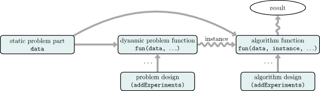

```r
addAlgorithm(
  "run_learner",
  fun = function(instance, learner, job, ...) {
    resample(instance$task, learner, instance$resampling)
  },
  reg = reg
)
```

```r
alg_des = list(run_learner = data.table(learner = learners))
addExperiments(algo.designs = alg_des, reg = reg)
summarizeExperiments()
```

```r
submitJobs(reg = reg)
```

```r
rr = loadResult(1, reg = reg)
as.data.table(rr)[1:5]
```

```r
bmr = reduceResults(c, reg = reg)
bmr$aggregate()[1:5]
```

### 统计分析

```r
library(mlr3benchmark)
bma = as_benchmark_aggr(bmr, measures = msr("classif.ce"))
bma$friedman_posthoc()
```

```r
autoplot(bma, type = "cd", ratio = 1/5)
```
