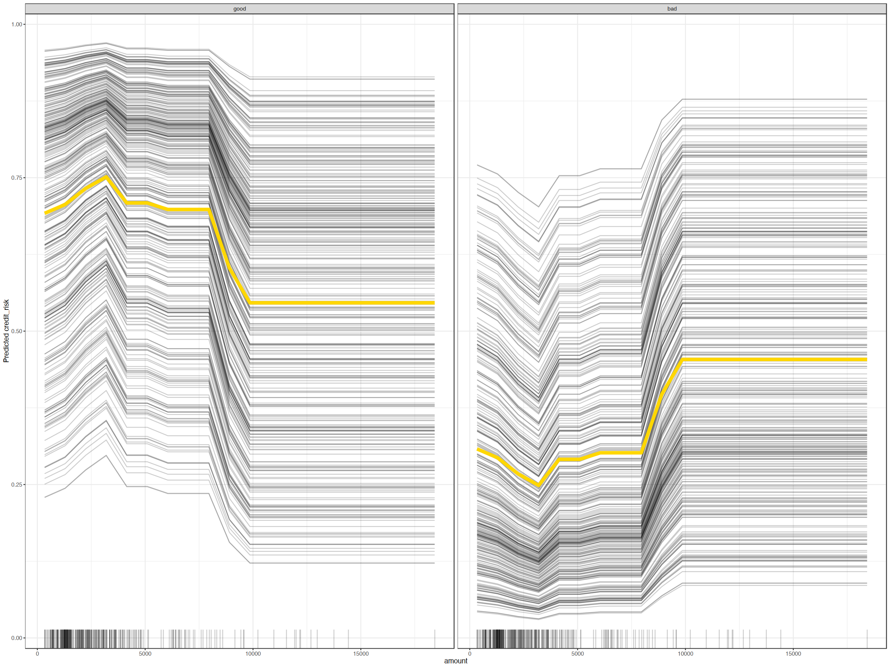
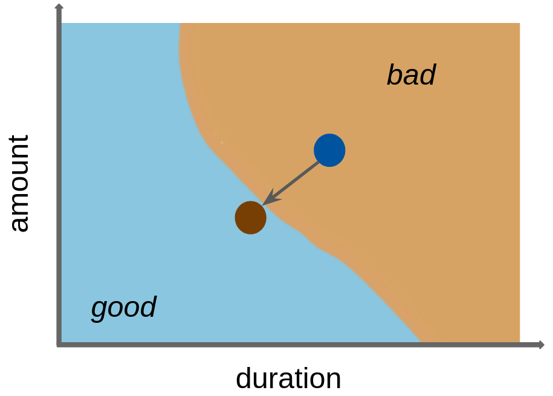
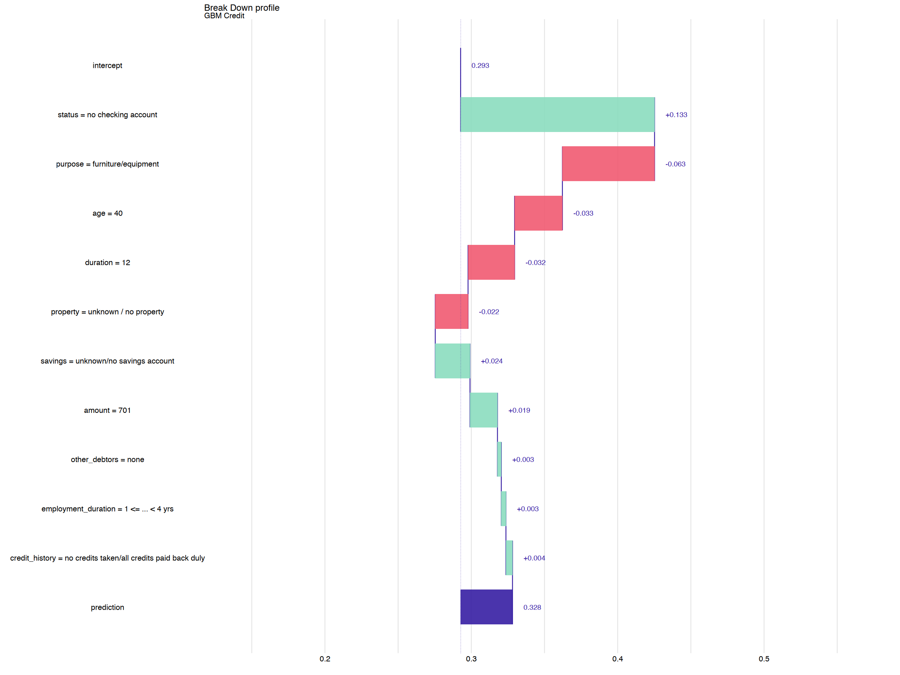

> - Cover Pic by [@Lin](https://www.pixiv.net/artworks/131650016)  

> [Applied Machine Learning Using mlr3 in R](https://mlr3book.mlr-org.com/)

## 简介

- 模型解释的方法
  - 为了全面了解一个模型，  
   确定哪些特征总体上最为重要，  
   或者这些特征如何影响预测结果
  - 如果（在数据或模型中）发现缺陷，  
   例如模型意外地依赖于某一特征，  
   需对模型进行改进
  - 为了理解和控制单个预测，  
   例如确定如果某个特征发生改变，  
   给定的预测可能会如何变化
  - 为了评估算法公平性，  
   检查模型是否对某些子群体或个体产生不利影响

## 示例学习器

- 以一个梯度提升机（GBM）为例，  
  该模型拟合了“german_credit”任务中一半的特征

```r
# 加载R包
# library(mlr3verse)

tsk_german <- tsk('german_credit')$
 select(
  cols = c(
   'duration', 
   'amount', 
   'age', 
   'status', 
   'savings', 
   'purpose',
   'credit_history', 
   'property', 
   'employment_duration', 
   'other_debtors'
  )
)
split <- partition(tsk_german)
lrn_gbm <- lrn('classif.gbm', predict_type = 'prob')
lrn_gbm$train(tsk_german, row_ids = split$train)
```

## `iml` 包

### 简介

- `iml`
  - 为各种与模型无关的解释方法实现了一个统一接口，  
   有助于分析和解释机器学习模型
  - 支持由 **任何** R 包拟合的机器学习模型（用于分类或回归），  
   特别是所有 `mlr3` 模型都通过将学习器包装在 Predictor 对象中来提供支持，  
   该对象统一了训练模型的输入输出行为
  - 此对象包含预测模型以及用于分析模型和生成所需解释的数据

```r
# 加载R包
# library(iml)

# 测试集的特征变量
credit_x <- tsk_german$data(
 rows = split$test,
 cols = tsk_german$feature_names
)
# 测试集的预测变量
credit_y <- tsk_german$data(
 rows = split$test,
 cols = tsk_german$target_names
)

# 构建一个预测器
predictor <- Predictor$new(lrn_gbm, data = credit_x, y = credit_y)
```

### 特征重要性（Feature Importance）

- 最流行的特征重要性方法之一是排列特征重要性（PFI）
  - 特征排列是指对数据集中单个特征的观测值进行随机打乱的过程
  - 这会消除该特征与目标变量以及所有其他特征之间的原始依赖结构，  
   同时保持该特征的边际分布
  - PFI衡量的是在排列某个特征之前（原始模型性能）和  
   之后（排列后模型性能）模型性能的变化
  - 如果某个特征不重要，那么排列该特征后模型性能的变化就会很小；  
   相反，如果该特征更为重要，我们预计模型性能会明显下降
  - 通常建议重复排列过程，并在多次重复中汇总性能变化，  
   以减少结果的随机性
- 在`iml`中运行PFI，需构建一个`FeatureImp`类的对象，并指定性能度量，
  - 这里我们使用分类误差
- 默认情况下，为缩短计算时间，  
  排列重复五次，并且在每次重复中，计算与分类误差变化相对应的重要性值
  - 在调用构造函数`$new()`时，  
   可以使用`n.repetitions`改变此设置，  
   本例中设置`n.repetitions = 100`
- `$plot()`方法展示五个所得重要性值的中位数（以点表示），  
  图中的误差线边界对应重要性值的5%和95%分位数
- 默认情况下，`FeatureImp`会将重排前后模型性能的**比率**作为重要性值进行计算；  
  在调用`$new()`时传入`compare = 'difference'`，则可以返回性能指标的**差值**

```r
importance <- FeatureImp$new(
 predictor, 
 loss = 'ce', 
 n.repetitions = 100
)
importance$plot() + theme_bw()
```


### 特征效应（Feature Effects）

- 通过分析当改变一个特征时预测如何变化，来描述一个特征对模型预测的贡献方式或程度
- 这些方法可以分为局部特征效应方法和全局特征效应方法
  - 全局特征效应方法：  
   是指当一个特征发生变化时，平均而言预测如何变化
  - 局部特征效应方法：  
   当一个特征值发生变化时，给定观测值的单个预测如何变化
  - 当局部效应存在异质性时，  
   即如果局部效应的变化在不同观测值之间有所不同，  
   局部特征效应方法可以揭示模型中的**相互作用**
- 个体条件期望（ICE）曲线（其他条件不变效应
  - 一种局部特征效应方法，  
   用于展示在改变某个感兴趣特征时，  
   单个观测值的预测结果如何变化，而所有其他特征保持不变
  - 构建方法：  
   选取单个观测值和感兴趣的特征，然后用另一个值替换该特征的值，  
   并绘制新的预测结果，随后对该特征的许多值重复此过程  
   （例如，在该特征值范围的等距网格上进行）
- 特征效应与线性模型中的回归系数 β 非常相似
  - 回归系数的解释为：  
   如果在其他所有特征保持不变的情况下，将此特征增加一个单位，预测值平均会增加 β”
  - 特征效应并不局限于线性效应，还可以应用于任何类型的预测模型

- 下例为对特征`amount`的效应的评估
  - 传递感兴趣的特征名称和特征效应方法，初始化`FeatureEffect`类的对象
  - 使用`'pdp+ice'`表示希望用部分依赖（PD）图（ICE曲线的平均值）来  
   可视化个体条件期望（ICE）曲线
- 下图中，黄色的部分依赖（PD）图和黑色的个体条件期望（ICE）曲线，  
  展示了信贷金额如何影响预测的信用风险
  - 如果金额大致小于10,000，那么平均而言，  
   预测信用状况良好的可能性很大
  - ICE曲线大致平行，这意味着在涉及金额的情况下，  
   似乎不存在强烈的相互作用
  - 建议始终将PD曲线和ICE曲线一起绘制，因为单独的PD图可能会掩盖异质性效应

```r
effect <- FeatureEffect$new(
 predictor, 
 feature = 'amount',
 method = 'pdp+ice'
)
effect$plot() + theme_bw()
```



### 代理模型（Surrogate Models）

#### 简介

- 可解释模型（如决策树或线性模型）可用作替代模型，以近似或模拟通常非常复杂的黑箱模型
- 用于训练替代模型的特征通常与用于训练黑盒模型的特征相同，  
  或者至少是具有相同分布的数据，  
  以确保输入空间具有代表性
  - 用于训练替代模型的目标是从黑盒模型获得的预测结果，  
   而不是基础数据的真实结果
  - 只有当替代模型很好地逼近黑盒模型时（即模型保真度较高时），  
   从替代模型得出的结论才有效
    - 测量并报告替代模型的逼近误差也很重要
- 用于训练黑盒模型的数据可能非常复杂或有限，  
  这使得直接在这些数据上训练一个表现良好的可解释模型具有挑战性
- 可以使用黑盒模型在输入空间的特定区域生成新的带标签数据，  
  利用这些数据来扩充原始数据
- 扩充后的数据可用于训练一个可解释模型，
  该模型能够捕捉并解释黑盒模型（在特定区域）学到的关系，  
  或者识别缺陷或意外行为。

#### 全局代理模型

- 初始化 `TreeSurrogate` 类会将条件推断树（`ctree()`）替代模型  
  应用于训练好的模型的预测结果
  - 该类提取由树替代模型创建的决策规则
  - `$plot()` 方法可视化每个终端节点预测结果的分布
- 下例中，向构造函数传入 `maxdepth = 2` 以构建具有两个二元分裂的树，  
  从而产生四个终端节点

```r
tree_surrogate <- TreeSurrogate$new(predictor, maxdepth = 2L)
```

- 首先需要检查代理模型是否准确地逼近预测模型
  - 可以通过比较树状代理模型的预测结果与黑箱模型的预测结果来进行评估
  - 例如，可以量化匹配预测的数量，  
   并衡量代理模型在预测黑箱GBM模型预测结果时的准确性
- 在输出结果中
  - 与黑盒模型相比，代理模型的预测准确率约为82%

```r
pred_surrogate <- tree_surrogate$predict(
 credit_x, 
 type = 'class'
)$.class
pred_surrogate <- factor(
 pred_surrogate, 
 levels = c('good', 'bad')
)
pred_gbm <- lrn_gbm$predict_newdata(credit_x)$response
confusion <- mlr3measures::confusion_matrix(
 pred_surrogate, 
 pred_gbm,
 positive = 'good'
)
confusion
```

```js
        truth
response good bad
    good  261  13
    bad    31  25
acc :  0.8667; ce  :  0.1333; dor :  16.1911; f1  :  0.9223 
fdr :  0.0474; fnr :  0.1062; fomr:  0.5536; fpr :  0.3421 
mcc :  0.4692; npv :  0.4464; ppv :  0.9526; tnr :  0.6579 
tpr :  0.8938 
```

- 通过绘制终端节点中的分割情况对上述结果作进一步解释，  
  结果中：
  - 图片展示由树替代模型识别的每个终端节点的预测结果分布
  - 前两个节点包含账户余额为正的申请  
   （status为'0 <= ... < 200 DM'、'... >= 200 DM'或'salary for at least 1 year'），  
   且期限小于或等于42个月（左上方），或超过42个月（右上方）
  - 底部节点包含没有支票账户或账户余额为负的申请人（status），  
   且期限小于或等于36个月（左下方）或超过36个月（右下方）

```r
tree_surrogate$plot() + theme_bw()
```


- 通过`$tree`字段访问训练好的树形代理，  
  该字段属于`TreeSurrogate`对象，  
  之后便能访问`partykit`中的所有方法

```r
partykit::print.party(tree_surrogate$tree)
```

```js
[1] root
|   [2] status in no checking account, ... < 0 DM
|   |   [3] credit_history in delay in paying off in the past, critical account/other credits elsewhere, existing credits paid back duly till now: *
|   |   [4] credit_history in no credits taken/all credits paid back duly, all credits at this bank paid back duly: *
|   [5] status in 0<= ... < 200 DM, ... >= 200 DM / salary for at least 1 year
|   |   [6] credit_history in delay in paying off in the past, critical account/other credits elsewhere, existing credits paid back duly till now: *
|   |   [7] credit_history in no credits taken/all credits paid back duly, all credits at this bank paid back duly: *
```

#### 局部代理模型

- 一般来说，要在整个特征空间中用可解释的替代模型准确逼近黑盒模型是非常困难的
  - 因此，局部替代模型聚焦于特征空间中围绕感兴趣点的一个小区域
- 局部替代模型构建如下：
  - 获取黑盒模型对给定数据集的预测结果
  - 根据观测值与我们所关注的点的接近程度，对该数据集中的观测值进行加权
  - 在加权数据集上使用黑箱模型的预测结果作为目标，拟合一个可解释的替代模型
  - 用代理模型解释我们感兴趣点的预测结果

- 下例中，选择一个样本并取名为`Charlie`为例
- 首先查看黑箱预测的结果
  - 以60.1%的概率预测类别为`'good'`

```r
# 选择样本
Charlie <- tsk_german$data(
 rows = 127L, 
 cols = tsk_german$feature_names
)
# 预测
gbm_predict <- predictor$predict(Charlie)
# 查看
gbm_predict
```

<table class='dataframe'>
<caption>A data.frame: 1 x 2</caption>
<thead>
 <tr><th scope=col>good</th><th scope=col>bad</th></tr>
 <tr><th scope=col>&lt;dbl&gt;</th><th scope=col>&lt;dbl&gt;</th></tr>
</thead>
<tbody>
 <tr><td>0.671859</td><td>0.328141</td></tr>
</tbody>
</table>

- 可以使用`LocalModel`来找出做出此预测的原因
  - 底层代理模型是局部加权L1惩罚线性回归模型，  
   这样每个类别只有预先定义数量的特征，  
   即k（默认值为3），会有非零系数
    - 因此这些特征就是k个最具影响力的特征
    - 本例中将`k = 2`
  - 还可以设置参数`gower.power`指定了局部模型的邻域大小  
   （默认值为`gower.power = 1`），  
   该值越小，模型就越关注靠近感兴趣点的点
    - 本例中将`gower.power = 0.1`
  - 此实现与局部可解释模型无关解释（LIME）密切相关

```r
predictor$class <- 'good' 
local_surrogate <- LocalModel$new(
 predictor, 
 Charlie, 
 gower.power = 0.1,
 k = 2
)
```

- 如果局部模型的预测结果与黑盒梯度提升机（GBM）模型的预测结果差异很大，  
  那么可能需要尝试更改 `k` 和 `gower.power` 参数
  - 这些参数可被视为局部代理模型的超参数，  
   为获得准确的局部代理模型，应对其进行调整
- 检查对Charlie的预测结果是否匹配：

```r
c(
 gbm = gbm_predict[[1]], 
 local = local_surrogate$predict()[[1]]
)
```

```js
      gbm     local 
0.6718590 0.6450047 
```

- 理想情况下，应该评估查理局部邻域内代理模型的保真度，  
  即局部代理模型对查理附近多个数据点的黑盒梯度提升机（GBM）模型预测的近似程度
  - 评估这种局部模型保真度的一种实用方法是，  
   在查理的局部邻域内生成人工数据点  
   （并可能应用基于距离的加权），  
   或者从原始数据中选择k个最近邻
- 为了便于说明，使用根据高尔距离从10个最近邻（包括查理）  
  计算出的平均绝对误差来量化近似误差
  - 针对查理的10个最近邻，  
   局部代理模型与黑箱模型的预测结果仅相差0.084，
   可以认为局部模型与黑箱模型之间有良好一致性

```r
# 提取最邻近的10个样本的id
ind_10nn <- gower::gower_topn(
 Charlie, 
 credit_x, 
 n = 10)$index[, 1]
# 用id索引数据
Charlie_10nn <- credit_x[ind_10nn, ]

# 预测器预测结果
gbm_pred_10nn <- predictor$predict(Charlie_10nn)[[1]]
# 代理模型预测结果
local_pred_10nn <- local_surrogate$predict(Charlie_10nn)[[1]]
# 计算平均绝对误差
mean(abs(gbm_pred_10nn - local_pred_10nn))
```

```js
[1] 0.08418002
```

- 预测影响结果影响最大的特征
  - `duration`和`status=no checking account`是重要的特征
  - 它们的影响均是负面的

```r
local_surrogate$results[, c('feature.value', 'effect')]
```

<table class="dataframe">
<caption>A data.frame: 2 x 2</caption>
<thead>
 <tr><th></th><th scope=col>feature.value</th><th scope=col>effect</th></tr>
 <tr><th></th><th scope=col>&lt;chr&gt;</th><th scope=col>&lt;dbl&gt;</th></tr>
</thead>
<tbody>
 <tr><th scope=row>duration</th><td>duration=12               </td><td>-0.005847644</td></tr>
 <tr><th scope=row>status=no checking account</th><td>status=no checking account</td><td>-0.092311934</td></tr>
</tbody>
</table>

### 夏普利值（Shapley Values）

- 沙普利值最初是在合作博弈论的背景下提出的，  
  用于研究如何在组成团队的参与者之间公平分配博弈的收益
- 在机器学习中，作为一种局部解释方法，  
  用于解释每个输入特征对单个观测值的最终模型预测的贡献
  - 参与者即特征
  - 应在各特征之间公平分配的收益，  
   指的是单个观测值的预测与平均预测之间的差异
  - 夏普利值估计了每个输入特征对单个观测值的最终预测贡献了多少  
   （在减去平均预测值之后）
- 与作为局部代理模型的惩罚线性模型相比，  
  夏普利值保证了预测在各个特征之间得到公平分配，  
  因为在计算每个特征的贡献时，也考虑了特征之间的**相互作用**
- 沙普利值经常被**误解**为从模型训练中移除特征后预测值之间的差异
  - 一个特征的沙普利值是通过考虑所有可能的特征子集，  
   并计算包含和不包含感兴趣特征时模型预测的差异来计算的
  - 它指的是在给定当前特征集的情况下，  
   一个特征对实际预测值与平均预测值之差的平均边际贡献
- 通过将`Predictor`和感兴趣的观测值传递给`Shapley`的构造函数，  
  可以计算夏普利值
  - 夏普利值的精确计算很耗时，  
   因为这涉及考虑所有可能的特征组合来计算某个特征的边际贡献，  
   因此，夏普利值的估计通常采用近似计算
  - 可以增大`sample.size`参数（默认值为`sample.size = 100`），  
   以获得对精确夏普利值更准确的近似
- 下面是对`Charlie`的夏普利值的计算及可视化
  - 实际预测值（0.63）表示模型对我们感兴趣的观测值的预测
  - 平均预测值（0.71）表示给定测试数据集上的平均预测值
  - 每个水平条是给定特征的夏普里值（phi）

```r
shapley <- Shapley$new(
 predictor, 
 x.interest = as.data.frame(Charlie),
 sample.size = 1000
)
shapley$plot() + theme_bw()
```


- 特征的夏普值（$\phi$）展示了如何在给定特征之间，  
  将`Charlie`信用良好的概率与数据集平均概率之间的差异进行公平分配
  - 如果所有夏普值（$\phi$）之和等于实际预测值与平均预测值之间的差异，  
   那么这种近似就足够好
- 在这里使用了`sample.size = 1000`，  
  使得查理的实际预测值（0.601）与  
  平均预测值（0.696）之间的预测差异达到 -0.09，  
  效果足够好
- 变量`purpose`对信用良好的概率具有最积极的影响，  
  预测概率增加了约5%
- 相比之下，变量`status`导致预测概率降低了超过10%

## `counterfactuals`包

### 简介

- `counterfactuals`包试图找出  
  对给定观测的输入特征进行尽可能小的改变，  
  从而导致不同的预测



### 假设分析法（What-If Method）

- 对于要解释的给定预测，反事实是数据集中具有所需预测的最接近的数据点
- 通常，可能存在许多可能的反事实数据点
- 一些早期的假设分析法仅生成单个、有点随意的反事实解释，  
  当反事实用于对模型的洞察或采取行动时可能会被视为有问题

- 可以使用假设分析方法来了解为使预测概率提高到75%，各特征需要如何变化
  - 使用`WhatIfClassif`对象和`Predictor`进行初始化，  
   并声明我们只想找到一个反事实（`n_counterfactuals = 1L`），  
   增加`n_counterfactuals`会返回指定数量的最接近感兴趣点的反事实
  - `$find_counterfactuals()`方法生成一个`Counterfactuals`类的反事实
    - 本例中将期望的预测概率设置在0.75到1之间（`desired_prob = c(0.75, 1)`）
  - `$evaluate(show_diff = TRUE)`方法表示需要如何改变特征以生成我们期望的类别
- 下例的输出结果中表示为了达到75%的信用良好概率，  
  各个特征需要做出的变化条件

```r
# 加载R包
# library(counterfactuals)

whatif <- WhatIfClassif$new(predictor, n_counterfactuals = 1L)
cfe <- whatif$find_counterfactuals(
 Charlie,
 desired_class = 'good', 
 desired_prob = c(0.75, 1)
)
data.frame(cfe$evaluate(show_diff = TRUE))
```

<table class="dataframe">
<caption>A data.frame: 1 x 15</caption>
<thead>
 <tr><th scope=col>age</th><th scope=col>amount</th><th scope=col>credit_history</th><th scope=col>duration</th><th scope=col>employment_duration</th><th scope=col>other_debtors</th><th scope=col>property</th><th scope=col>purpose</th><th scope=col>savings</th><th scope=col>status</th><th scope=col>dist_x_interest</th><th scope=col>no_changed</th><th scope=col>dist_train</th><th scope=col>dist_target</th><th scope=col>minimality</th></tr>
 <tr><th scope=col>&lt;dbl&gt;</th><th scope=col>&lt;dbl&gt;</th><th scope=col>&lt;chr&gt;</th><th scope=col>&lt;dbl&gt;</th><th scope=col>&lt;chr&gt;</th><th scope=col>&lt;chr&gt;</th><th scope=col>&lt;chr&gt;</th><th scope=col>&lt;chr&gt;</th><th scope=col>&lt;chr&gt;</th><th scope=col>&lt;chr&gt;</th><th scope=col>&lt;dbl&gt;</th><th scope=col>&lt;int&gt;</th><th scope=col>&lt;dbl&gt;</th><th scope=col>&lt;dbl&gt;</th><th scope=col>&lt;dbl&gt;</th></tr>
</thead>
<tbody>
 <tr><td>-10</td><td>6</td><td>NA</td><td>NA</td><td>NA</td><td>NA</td><td>NA</td><td>NA</td><td>NA</td><td>... &gt;= 200 DM / salary for at least 1 year</td><td>0.1178903</td><td>3</td><td>0</td><td>0</td><td>2</td></tr>
</tbody>
</table>

### 最小改变量（MOC）方法

- 生成多个通过人工生成的反事实，这些反事实可能与给定数据集中的观测值不相等。反事实的生成基于一个优化问题，该问题旨在生成满足以下条件的反事实：
  - 具有期望的预测结
  - 接近所关注的观测值
  - 只需要改变几个特征
  - 与给定数据集中的观测值源自相同的分布
- 在多目标优化反事实生成法（MOC）中，  
  所有四个目标通过一种多目标优化方法同时进行优化
  - 其他几种反事实方法依赖于单目标优化方法，  
   即多个目标被合并为一个单一目标，例如，使用加权和
    - 单目标方法引发了对目标适当加权的担忧，  
    并且无法考虑各个目标之间固有的权衡
    - 此外，它可能会将反事实搜索的解集限制为单个候选解
  - 多目标优化反事实生成法（MOC）返回一组相对于这四个目标而言  
   非支配的、因此同样良好的反事实（类似于帕累托前沿）

- 调用MOC方法与假设分析方法类似，但使用的是一个`MOCClassif()`对象
  - 将`epsilon`参数设置为0，  
   以便在优化过程中对预测值超出所需范围的反事实情况进行惩罚
  - 可以通过`fixed_features`参数禁止特定特征发生变化，  
   本例中限制`age`变量的变化
- 仅让多目标优化器运行30次以减少计算时间

```r
moc <- MOCClassif$new(
 predictor, 
 epsilon = 0, 
 n_generations = 30L,
 fixed_features = 'age'
)
cfe_multi <- moc$find_counterfactuals(
 Charlie,
 desired_class = 'good', 
 desired_prob = c(0.75, 1)
)
```

- 多目标方法并不能保证所有反事实样本都具有所需的预测结果，  
  因此使用 `$subset_to_valid()` 将反事实样本限制为感兴趣的那些

```r
cfe_multi$subset_to_valid()
cfe_multi
```

```js
3 Counterfactual(s) 
 
Desired class: good 
Desired predicted probability range: [0.75, 1] 
 
Head: 
     age amount                              credit_history duration
   <int>  <int>                                      <fctr>    <int>
1:    40    701 no credits taken/all credits paid back duly       12
2:    40   2418 no credits taken/all credits paid back duly        5
3:    40    701 no credits taken/all credits paid back duly        8
   employment_duration other_debtors              property             purpose
                <fctr>        <fctr>                <fctr>              <fctr>
1:    1 <= ... < 4 yrs          none unknown / no property furniture/equipment
2:    1 <= ... < 4 yrs          none unknown / no property furniture/equipment
3:    1 <= ... < 4 yrs          none unknown / no property furniture/equipment
                      savings                                     status
                       <fctr>                                     <fctr>
1: unknown/no savings account ... >= 200 DM / salary for at least 1 year
2: unknown/no savings account                        no checking account
3: unknown/no savings account                        no checking account
```

- 这种方法生成了3个反事实样本
  - 但由于这些样本是人工生成的，  
   因此不一定等同于基础数据集中的实际观测值
- `$get_freq_of_feature_changes()`方法
  - 返回计算的数值结果
-  `$plot_freq_of_feature_changes()` 方法
  - 该方法将可视化所有返回的反事实样本中特征变化的频率

```r
cfe_multi$get_freq_of_feature_changes()
cfe_multi$plot_freq_of_feature_changes()
```

```js
           duration              amount              status                 age 
          0.6666667           0.3333333           0.3333333           0.0000000 
     credit_history employment_duration       other_debtors            property 
          0.0000000           0.0000000           0.0000000           0.0000000 
            purpose             savings 
          0.0000000           0.0000000 
```


- 可视化`duration`和`amount`的二位ICE图
  - 预测值越高颜色越浅
  - 颜色和等高线表示当`duration和`amount`不同，  
   而所有其他特征设置为真实值时模型的预测值
  - 白点显示真实预测值，  
   黑点是仅对这两个特征进行改变的反事实值

```r
cfe_multi$plot_surface(
 # 因为只能是二维的，所以只能写2个
 feature_names = c('duration', 'amount')
) +
    theme(
  axis.text.x = element_text(
   angle = 15, 
   hjust = .7
  )
 )
```


## `DALEX`包

### 简介

- 方法类似于`iml`，但侧重于模型比较
- 该R包的逻辑假设：  拉氏视角
  - 探索模型的过程是迭代的，在连续的迭代中，  
   我们希望比较不同的视角，包括不同模型呈现/学习到的视角
- `DALEX` 包能与使用 `mlr3` 构建的任何分类和回归模型一起使用，  
  也可以与 R 中的其他框架一起使用
- 一旦熟悉了使用 DALEX 包的原理，就可以使用这个系列中的其他包，例如
  - `fairmodels`：用于检测和减轻偏差
  - `modelStudio`：用于交互式模型探索
  - `modelDown`：用于自动生成可解释机器学习（IML）模型文档
  - `survex`：用于解释生存模型
  - `treeshap`：用于分析基于树的模型
- 对模型的分析通常是一个交互式过程
  - 首先基于一个或多个性能指标对模型进行评估，这被称为**浅层分析**
  - 在随后的一系列步骤中，可以通过探索单个变量或变量对的重要性，  
   逐步深入到对选定变量与模型结果之间关系的深度分析，  
   从而系统地加深对模型的理解

- `DALEX` 也实现了一个包装器，为其功能提供了统一的接口
  - 对于使用 `mlr3` 包创建的模型，使用 `explain_mlr3()`，  
   它会创建一个 S3 `explainer` 对象
  - 该对象是一个列表，至少包含：
    - 模型对象
    - 将用于计算解释的数据集
    - 预测函数
    - 计算残差的函数
    - 模型名称/标签
    - 有关模型的其他附加信息

```r
# 加载R包
# library(DALEX)
# library(DALEXtra)

gbm_exp <- DALEXtra::explain_mlr3(
 # 学习器
 lrn_gbm,
 # 预测变量/特征变量
 data = credit_x,
 # 目的变量
 # 这里要转换成数值
 y = as.numeric(
  credit_y$credit_risk == 'bad'
 ),
 # 加一个类似于标题的模型标签
 label = 'GBM Credit',
 # 关闭输出中编码高亮
 colorize = FALSE
)

gbm_exp
```

```js
Preparation of a new explainer is initiated
  -> model label       :  GBM Credit 
  -> data              :  330  rows  10  cols 
  -> target variable   :  330  values 
  -> predict function  :  yhat.LearnerClassif  will be used (  default  )
  -> predicted values  :  No value for predict function target column. (  default  )
  -> model_info        :  package mlr3 , ver. 1.0.1 , task classification (  default  ) 
  -> predicted values  :  numerical, min =  0.03676402 , mean =  0.2926774 , max =  0.8648177  
  -> residual function :  difference between y and yhat (  default  )
  -> residuals         :  numerical, min =  -0.8589291 , mean =  -0.007828932 , max =  0.9025613  
  A new explainer has been created!  


Model label:  GBM Credit 
Model class:  LearnerClassifGBM,LearnerClassif,Learner,R6 
Data head  :
  age amount                              credit_history duration
1  67   1169     all credits at this bank paid back duly        6
2  25   1295 no credits taken/all credits paid back duly       12
  employment_duration other_debtors                                    property
1            >= 7 yrs          none                       unknown / no property
2              < 1 yr          none building soc. savings agr. / life insurance
              purpose                    savings              status
1 furniture/equipment             ... >= 1000 DM no checking account
2              others unknown/no savings account          ... < 0 DM
```

### 全局EMA

- 全局EMA旨在了解模型对一组观测值的平均表现
- 在`DALEX`中，用于全局层面分析的函数都以`model_`为前缀
- `model_performance()`
  - 检测任务类型并选择最合适的度量
  - 由于本例使用的是二分类，该函数会自动推荐  
   召回率、精确率、F1分数、准确率和AUC
  - 同样，默认的绘图方法也是根据任务类型选择的，  
   本例中选择的是ROC

```r
perf_credit <- model_performance(gbm_exp)
perf_credit
```

```js
Measures for:  classification
recall     : 0.393617 
precision  : 0.6607143 
f1         : 0.4933333 
accuracy   : 0.769697 
auc        : 0.815678

Residuals:
         0%         10%         20%         30%         40%         50% 
-0.85892907 -0.41538465 -0.30027241 -0.21133774 -0.16170458 -0.13283445 
        60%         70%         80%         90%        100% 
-0.08615409 -0.04690813  0.45116163  0.64841892  0.90256128 
```

- 可视化ROC曲线

```r
# 设置绘图风格
# Explanatory Model Analysis, EMA
old_theme <- set_theme_dalex('ema')
plot(perf_credit, geom = 'roc')
```


- 特征重要性方法可以通过 `model_parts()` 计算，然后绘制成图

```r
gbm_effect <- model_parts(gbm_exp)
head(gbm_effect)
```

<table class="dataframe">
<caption>A model_parts: 6 x 4</caption>
<thead>
 <tr><th></th><th scope=col>variable</th><th scope=col>permutation</th><th scope=col>dropout_loss</th><th scope=col>label</th></tr>
 <tr><th></th><th scope=col>&lt;chr&gt;</th><th scope=col>&lt;dbl&gt;</th><th scope=col>&lt;dbl&gt;</th><th scope=col>&lt;chr&gt;</th></tr>
</thead>
<tbody>
 <tr><th scope=row>1</th><td>_full_model_       </td><td>0</td><td>0.1843220</td><td>GBM Credit</td></tr>
 <tr><th scope=row>2</th><td>other_debtors      </td><td>0</td><td>0.1839434</td><td>GBM Credit</td></tr>
 <tr><th scope=row>3</th><td>property           </td><td>0</td><td>0.1863190</td><td>GBM Credit</td></tr>
 <tr><th scope=row>4</th><td>employment_duration</td><td>0</td><td>0.1892851</td><td>GBM Credit</td></tr>
 <tr><th scope=row>5</th><td>age                </td><td>0</td><td>0.1897268</td><td>GBM Credit</td></tr>
 <tr><th scope=row>6</th><td>savings            </td><td>0</td><td>0.1962698</td><td>GBM Credit</td></tr>
</tbody>
</table>

- `model_parts`函数中的``type``参数可让指定如何计算特征的重要性，方式包括：
  - `type = "difference"`：损失函数的差值
  - `type = "ratio"`：比例
  - `type = "raw"`：不进行任何变换

```r
plot(gbm_effect, show_boxplots = FALSE)
```


- 特征效应可以通过 `model_profile()` 计算
  - 默认情况下以PD图的形式绘制

```r
# 计算特征效应
gbm_profiles <- model_profile(gbm_exp)
# 输出结果
# 但这里只是类似于`head()`出来的上面部分
gbm_profiles
```

```js
Top profiles    : 
   _vname_    _label_ _x_    _yhat_ _ids_
1 duration GBM Credit   4 0.2219987     0
2 duration GBM Credit   5 0.2219987     0
3 duration GBM Credit   6 0.2219987     0
4 duration GBM Credit   7 0.2219987     0
5 duration GBM Credit   8 0.2219987     0
6 duration GBM Credit   9 0.2393805     0
```

- 绘制全局EMA图，可以发现
  - `age`在到40岁前都是负相关
  - `amount`在10000刀后是正相关，  
   10000刀以前是一个不稳定的U型相关
  - `duration`与较强的正相关

```r
plot(gbm_profiles) +
 theme(legend.position = 'top') +
 ggtitle('Partial Dependence for GBM Credit model','')
```


### 局部EMA

- 旨在了解模型对单个观测值的表现
- 在`DALEX`中，用于局部分析的函数都以`predict_`为前缀
- 再次使用`Charlie`进行以下示例。

```r
predict(gbm_exp, Charlie)
```

```js
bad: 0.328141025695372
```

- 分解（break down）图
  - 将模型的预测分解为可归因于不同解释变量的贡献
  - 使用 `predict_parts()` 计算得出的
- 下图中
  - 正归因以绿色显示
  - 负归因以红色显示
  - 紫色条形对应于被解释观测值的模型预测
  - 虚线对应于模型平均预测

```r
plot(
 predict_parts(
  gbm_exp, 
  new_observation = Charlie
 )
)
```



- `predict_parts()`函数还可通过设置`type = "shap"`，  
  使用SHAP算法绘制夏普值
  - 分解和SHAP方法的结果通常相似
  - 如果模型中存在许多复杂的相互作用，就会出现差异
- 计算夏普利值可能需要很长时间
  - 这个过程可以通过牺牲准确性来加快
  - 参数 `B` 和 `N` 可用于调整这种权衡
    - `N`：用于估计条件期望值的观测数量（默认值为500）
    - `B`：用于计算夏普利值的随机路径数量（默认值为25）

```r
plot(
 predict_parts(
  gbm_exp, 
  new_observation = Charlie, 
  type = 'shap'
 ),
 show_boxplots = FALSE
)
```


- 使用 `predict_profile()` 绘制ICE曲线

```r
plot(
 predict_profile(
  gbm_exp,  
  credit_x[30:40, ]
 )
)
```


## 注意事项

### 相关特征（Correlated Features）

- 如果特征之间存在相关性，那么在使用解释方法得出见解时应谨慎对待
- 在不考虑与其他特征相关性的情况下改变某个观测值的特征值，  
  会导致特征值出现不切实际的组合
- 由于这种特征组合也不太可能出现在训练数据中，  
  模型很可能会在这些区域进行外推
  - 这会扭曲基于改变单个特征值的方法的解释，  
   比如排列特征重要性（PFI）、部分依赖（PD）图和夏普值
- 在这种情况下，替代方法可能会有所帮助：
  - 用条件特征重要性替代排列特征重要性（PFI）
  - 用累积局部效应图替代部分依赖（PD）图
  - 用核夏普（KernelSHAP）方法替代夏普值

### 罗生门效应（Rashomon Effect）

- 从解释方法得出的解释可能具有模糊性
- 一种方法可能会给出多个同样合理但可能相互矛盾的解释
- 这种效应可能是由于超参数，基础数据集，  
  甚至初始随机种子的变化导致的

### 高维数据（High-Dimensional Data）

- 由于计算成本巨大，将现成的解释方法应用于高维数据集往往不可行
  - 诸如使用基于核的估计量的夏普利值等最新方法已被开发出来以帮助克服这一问题
- 另一个挑战是，为高维数据集生成的高维可解释机器学习输出可能会让用户应接不暇
  - 如果能够对特征进行有意义的分组，就可以应用分组版本的方法，例如分组特征重要性
