> - Cover Pic by [@bybao](https://www.pixiv.net/artworks/132241477)  

> [Applied Machine Learning Using mlr3 in R](https://mlr3book.mlr-org.com/)

## 简介

- `mlr3`中主要的包含4个**构建块**（building block）
  - `Task`
  - `Learner`
  - `Prediction`
  - `Measure`

- 部分可与`mlr3`框架配合使用的扩展任务表

| Task                                      | Package                              | Description                                                                                             |
| ----------------------------------------- | ------------------------------------ | ------------------------------------------------------------------------------------------------------- |
| Deterministic regression                  | `mlr3`                               | Point prediction of a continuous variable.                                                              |
| Deterministic single-label classification | `mlr3`                               | Prediction of a single class for each observation.                                                      |
| Probabilistic single-label classification | `mlr3`                               | Prediction of the probability of an observation falling into one or more mutually exclusive categories. |
| Cost-sensitive classification             | `mlr3` and `mlr3pipelines`           | Classification predictions with unequal costs associated with misclassifications.                       |
| Survival analysis                         | `mlr3proba`                          | Time-to-event predictions with possible ‘censoring’.                                                    |
| Density estimation                        | `mlr3proba`                          | Unsupervised estimation of probability density functions.                                               |
| Spatiotemporal analysis                   | `mlr3spatiotempcv` and `mlr3spatial` | Supervised prediction of data with spatial (e.g., coordinates) and/or temporal outcomes.                |
| Cluster analysis                          | `mlr3cluster`                        | Unsupervised estimation of homogeneous clusters of data points.                                         |

## 代价敏感分类（Cost-Sensitive Classification）

- 代价敏感分类的目标是使预期代价最小化
- 示例任务：`tsk('german_credit')`
- 背景：  假设试图计算借给某人5000美元，  
  一年后是否能盈利，前提是预计他们会偿还6000美元
- 为了进行这个计算，你需要预测这个人是否有良好的信用
  - 这是一个确定性分类问题，需要预测某人属于'好'或'坏'类别
  - 现在让考虑与每个预测和最终结果相关的一些潜在成本
    - 由于成本敏感分类是一个最小化问题，  
    假设成本越低，利润/积极结果就越高，  
    因此将利润记为负值，损失记为正值

```r
costs <- matrix(
 c(
  # 预测守信且真守信
  -1, # 赚1000
  # 预测失信但守信
  0, # 无得失，因为不会借
  # 预测守信但失信
  5, # 打水飘，亏5000
  # 预测失信且真失信
  0 # 无得失，因为不会借
 ), 
 nrow = 2, 
 dimnames = list(
  'Predicted Credit' = c('good', 'bad'),
  Truth = c('good', 'bad')
 )
)

costs
```

```js
                Truth
Predicted Credit good bad
            good -1   5  
            bad   0   0  
```

### 成本敏感度量

- `msr('classif.costs')`
  - `cost`传递成本计算矩阵

```r
# 加载R包
# library(mlr3verse)

# 任务
tsk_german <- tsk('german_credit')
# 评估器
msr_costs <- msr('classif.costs', costs = costs)
# 查看评估器
msr_costs
```

```js
-- <MeasureClassifCosts> (classif.costs): Cost-sensitive Classification --------
* Packages: mlr3
* Range: [-Inf, Inf]
* Minimize: TRUE
* Average: macro
* Parameters: normalize=TRUE
* Properties: weights
* Predict type: response
* Predict sets: test
* Aggregator: mean()
```

- 使用3种算法的学习器进行benchmark比较
  - 可以看到逻辑回归学习器表现最好，  
   因为有最低的成本

```r
learners <- lrns(
 c(
 'classif.log_reg', 
 'classif.featureless',
 'classif.ranger'
 )
)
bmr <- benchmark(
 benchmark_grid(
  tsk_german, 
  learners,
  rsmp('cv', folds = 3)
 )
)
bmr$aggregate(msr_costs)[, c(4, 7)]
```

<table class='dataframe'>
<caption>A bmr_aggregate: 3 x 2</caption>
<thead>
 <tr><th scope=col>learner_id</th><th scope=col>classif.costs</th></tr>
 <tr><th scope=col>&lt;chr&gt;</th><th scope=col>&lt;dbl&gt;</th></tr>
</thead>
<tbody>
 <tr><td>classif.log_reg    </td><td>0.1608225</td></tr>
 <tr><td>classif.featureless</td><td>0.7999317</td></tr>
 <tr><td>classif.ranger     </td><td>0.2218926</td></tr>
</tbody>
</table>

### 阈值调整

- 下图为不同概率判断阈值时，成本的曲线变化
  - 虽然默认的阈值是`0.5`，  
   但很显然，通过提高阈值可以降低成本

```r
prediction <- lrn(
 'classif.log_reg',
 predict_type ='prob'
)$train(tsk_german)$predict(tsk_german)

autoplot(
 prediction, 
 type = 'threshold', 
 measure = msr_costs
)
```

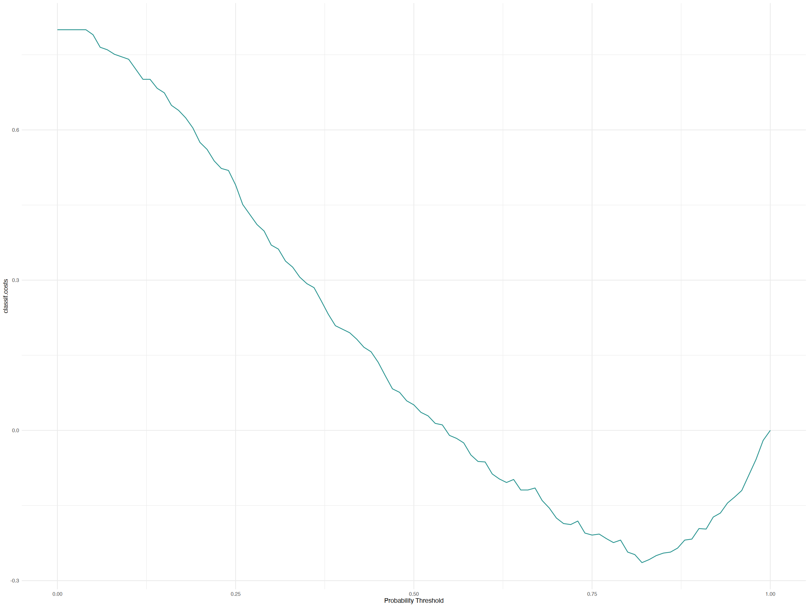

- 对`po('tunethreshold')`进行调优，  
  以自动确定最优阈值
  - 过使用`po('learner_cv')`进行内部重采样，  
   并使用`po('tunethreshold')`来寻找最佳阈值，  
   显著提高了模型性能，甚至有望实现盈利

```r
po_cv <- po(
 'learner_cv', 
 lrn(
  'classif.log_reg', 
  predict_type = 'prob'
 )
)
graph <- po_cv %>>% po('tunethreshold', measure = msr_costs)

learners <- list(as_learner(graph), lrn('classif.log_reg'))
bmr <- benchmark(
 benchmark_grid(
  tsk_german, 
  learners,
  rsmp('cv', folds = 3)
 )
)

bmr$aggregate(msr_costs)[, c(4, 7)]
```

<table class='dataframe'>
<caption>A bmr_aggregate: 2 x 2</caption>
<thead>
 <tr><th scope=col>learner_id</th><th scope=col>classif.costs</th></tr>
 <tr><th scope=col>&lt;chr&gt;</th><th scope=col>&lt;dbl&gt;</th></tr>
</thead>
<tbody>
 <tr><td>classif.log_reg.tunethreshold</td><td>-0.1270222</td></tr>
 <tr><td>classif.log_reg              </td><td> 0.1069962</td></tr>
</tbody>
</table>

## 生存分析（Survival Analysis）

### 简介

- 生存分析建模的关键在于，假设存在一个假设时间，  
  即如果马拉松运动员没有被删失，他们本应完成比赛的时间
  - 生存分析学习器的任务就是估计类似运动员在**未被**删失的情况下的  
   真实生存时间
- 从数学角度来看，假设用事件时间$Y$，  
  假设删失时间$C$，  
  观察到的结果时间$T=min(Y,C)$，
  事件指示符$Δ:=(T=Y)$以及通常的一些特征X来表示
- 学习器基于$(T,Δ)$进行训练，  
  但关键的是，要根据之前**未见过的特征**对Y进行预测
- 这意味着与分类和回归不同，学习器基于**两个变量**$(T,Δ)$进行训练
  - 在R语言中，这通常用一个`Surv`对象来表示
-  `mlr3` 只能讨论**右删失问题**

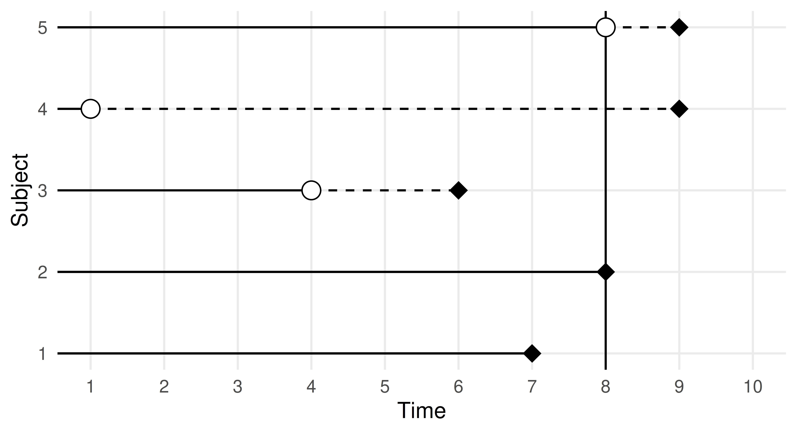

- 本例中，随机生成六个生存时间和六个事件指示符，  
  结果中带有`+`表示该结果被删失，  
  否则表示发生了感兴趣的事件

```r
# 加载R包
# library(survival)

# 随机生成数据，用`Surv`包装
Surv(runif(6), rbinom(6, 1, 0.5))
```

```js
[1] 0.33865314  0.82852654+ 0.20506836  0.05573181+ 0.48054274  0.44972267 
```

### TaskSurv

- 使用 `as_task_surv()` 创建生存任务，  
  并有额外参数：
  - `time`：时间
  - `event`：事件
  - `type`：目前只能为`'right'`且默认

```r
# 加载R包
# library(mlr3verse)
# library(mlr3proba)
# library(survival)

tsk_rats <- as_task_surv(
 survival::rats, 
 time = 'time',
 event = 'status', 
 type = 'right', 
 id = 'rats'
)

tsk_rats$head()
```

<table class='dataframe'>
<caption>A data.table: 6 x 5</caption>
<thead>
 <tr><th scope=col>time</th><th scope=col>status</th><th scope=col>litter</th><th scope=col>rx</th><th scope=col>sex</th></tr>
 <tr><th scope=col>&lt;dbl&gt;</th><th scope=col>&lt;dbl&gt;</th><th scope=col>&lt;int&gt;</th><th scope=col>&lt;dbl&gt;</th><th scope=col>&lt;chr&gt;</th></tr>
</thead>
<tbody>
 <tr><td>101</td><td>0</td><td>1</td><td>1</td><td>f</td></tr>
 <tr><td> 49</td><td>1</td><td>1</td><td>0</td><td>f</td></tr>
 <tr><td>104</td><td>0</td><td>1</td><td>0</td><td>f</td></tr>
 <tr><td> 91</td><td>0</td><td>2</td><td>1</td><td>m</td></tr>
 <tr><td>104</td><td>0</td><td>2</td><td>0</td><td>m</td></tr>
 <tr><td>102</td><td>0</td><td>2</td><td>0</td><td>m</td></tr>
</tbody>
</table>

- 绘制 Kaplan-Meier 图
  - 该图是训练集中平均观测值生存概率的非参数估计

```r
autoplot(tsk_rats)
```

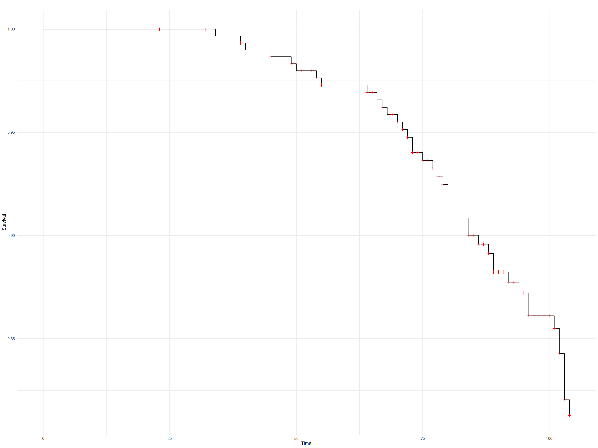

- 加载其他用于练习的任务

```r
as.data.table(mlr_tasks)[task_type == 'surv']
```

<table class='dataframe'>
<caption>A data.table: 10 x 15</caption>
<thead>
 <tr><th scope=col>key</th><th scope=col>label</th><th scope=col>task_type</th><th scope=col>nrow</th><th scope=col>ncol</th><th scope=col>properties</th><th scope=col>lgl</th><th scope=col>int</th><th scope=col>dbl</th><th scope=col>chr</th><th scope=col>fct</th><th scope=col>ord</th><th scope=col>pxc</th><th scope=col>dte</th><th scope=col>lt</th></tr>
 <tr><th scope=col>&lt;chr&gt;</th><th scope=col>&lt;chr&gt;</th><th scope=col>&lt;chr&gt;</th><th scope=col>&lt;int&gt;</th><th scope=col>&lt;int&gt;</th><th scope=col>&lt;list&gt;</th><th scope=col>&lt;int&gt;</th><th scope=col>&lt;int&gt;</th><th scope=col>&lt;int&gt;</th><th scope=col>&lt;int&gt;</th><th scope=col>&lt;int&gt;</th><th scope=col>&lt;int&gt;</th><th scope=col>&lt;int&gt;</th><th scope=col>&lt;int&gt;</th><th scope=col>&lt;int&gt;</th></tr>
</thead>
<tbody>
 <tr><td>actg   </td><td>ACTG 320                   </td><td>surv</td><td>1151</td><td>13</td><td></td><td>0</td><td>3</td><td>4</td><td>0</td><td>4</td><td>0</td><td>0</td><td>0</td><td>0</td></tr>
 <tr><td>gbcs   </td><td>German Breast Cancer       </td><td>surv</td><td> 686</td><td>10</td><td></td><td>0</td><td>4</td><td>4</td><td>0</td><td>0</td><td>0</td><td>0</td><td>0</td><td>0</td></tr>
 <tr><td>gbsg   </td><td>German Breast Cancer       </td><td>surv</td><td> 686</td><td>10</td><td></td><td>0</td><td>5</td><td>0</td><td>0</td><td>3</td><td>0</td><td>0</td><td>0</td><td>0</td></tr>
 <tr><td>grace  </td><td>GRACE 1000                 </td><td>surv</td><td>1000</td><td> 8</td><td></td><td>0</td><td>2</td><td>4</td><td>0</td><td>0</td><td>0</td><td>0</td><td>0</td><td>0</td></tr>
 <tr><td>lung   </td><td>Lung Cancer                </td><td>surv</td><td> 168</td><td> 9</td><td></td><td>0</td><td>6</td><td>0</td><td>0</td><td>1</td><td>0</td><td>0</td><td>0</td><td>0</td></tr>
 <tr><td>mgus   </td><td>MGUS                       </td><td>surv</td><td> 176</td><td> 9</td><td></td><td>0</td><td>0</td><td>6</td><td>0</td><td>1</td><td>0</td><td>0</td><td>0</td><td>0</td></tr>
 <tr><td>pbc    </td><td>Primary Biliary Cholangitis</td><td>surv</td><td> 276</td><td>19</td><td></td><td>0</td><td>5</td><td>5</td><td>0</td><td>7</td><td>0</td><td>0</td><td>0</td><td>0</td></tr>
 <tr><td>rats   </td><td>Rats                       </td><td>surv</td><td> 300</td><td> 5</td><td></td><td>0</td><td>2</td><td>0</td><td>0</td><td>1</td><td>0</td><td>0</td><td>0</td><td>0</td></tr>
 <tr><td>veteran</td><td>Veteran                    </td><td>surv</td><td> 137</td><td> 8</td><td></td><td>0</td><td>3</td><td>0</td><td>0</td><td>3</td><td>0</td><td>0</td><td>0</td><td>0</td></tr>
 <tr><td>whas   </td><td>Worcester Heart Attack     </td><td>surv</td><td> 481</td><td>11</td><td></td><td>0</td><td>4</td><td>3</td><td>0</td><td>2</td><td>0</td><td>0</td><td>0</td><td>0</td></tr>
</tbody>
</table>

### `LearnerSurv`，`PredictionSurv` 以及预测类型

- `mlr3proba`与`mlr3`的预测接口不同
  - 对于所有生存模型，只要有可能，  
   就会返回所有可能的预测类型
  - 如果一个模型能够计算出特定的预测类型，  
   它就会在`PredictionSurv`中返回
  - 做出这种设计决策的原因是，  
   所有这些预测类型都可以相互转换
    - 因此一次性返回所有类型在计算上比  
    重新运行模型以更改预测类型更简单
- 可预测的类型
  - `response`：预测的生存时间
  - `distr`：预测的生存分布，离散或连续分布均可
  - `lp`：通过将拟合系数与测试数据相乘计算得出的线性预测值
  - `crank`：连续风险排名

```r
tsk_rats <- tsk('rats')
split <- partition(tsk_rats)
prediction_cph <- lrn('surv.coxph')$
 train(tsk_rats,split$train)$
 predict(tsk_rats, split$test)
prediction_cph
```

```js
-- <PredictionSurv> for 99 observations: ---------------------------------------
 row_ids time status      crank         lp     distr
       2   49   TRUE -0.5700703 -0.5700703 <list[1]>
       9  104  FALSE -0.5470661 -0.5470661 <list[1]>
      10   91  FALSE -2.1443968 -2.1443968 <list[1]>
     ---  ---    ---        ---        ---       ---
     286  104  FALSE -1.0862016 -1.0862016 <list[1]>
     295  104  FALSE  1.4477346  1.4477346 <list[1]>
     296  104  FALSE  0.5571376  0.5571376 <list[1]>
```

#### `predict_type = 'response'`

- 从预测的结果看出，  
  预测的结果并不准确
  - 由于每个真实值都是删失时间，  
   预测结果是略有偏差还是糟糕透顶无法得知
  - 由于没有切实可行的方法来评估这些模型，  
   生存时间预测的实际用处不大

```r
# 加载R包
# library(mlr3extralearners)

# 选择支持向量机
prediction_svm <- lrn(
 # 生存问题的支持向量机
 'surv.svm', 
 # `type = 'regression'` 优化生存时间预测的算法
 type = 'regression', 
 # 通常应该先调优
 gamma = 1e-3
)$
 # 训练
 train(tsk_rats, split$train)$
 # 预测
 predict(tsk_rats, split$test)

# 查看结果
data.frame(
 pred = prediction_svm$response[1:3],
 truth = prediction_svm$truth[1:3]
)
```

<table class='dataframe'>
<caption>A data.frame: 3 x 2</caption>
<thead>
 <tr><th scope=col>pred</th><th scope=col>truth</th></tr>
 <tr><th scope=col>&lt;dbl&gt;</th><th scope=col>&lt;Surv&gt;</th></tr>
</thead>
<tbody>
 <tr><td>93.52197</td><td> 49, 1</td></tr>
 <tr><td>93.11679</td><td>104, 0</td></tr>
 <tr><td>92.91621</td><td> 91, 0</td></tr>
</tbody>
</table>
#### `predict_type = 'distr'`

- 与回归中最常见的确定性/点预测不同，  
  生存分析中，分布预测更为常见
-  `mlr3proba` 中的大多数生存模型默认会进行分布预测
  - 这些预测是使用 `distr6` 包实现的，  
   该包支持对生存曲线（定义为 $1− 累积分布函数$）进行可视化和评估

- 下面示例中提取前三个 `$distr` 预测，  
  并计算在 $t=77$ 时的生存概率
  - 预测的前三只老鼠在 $t=77$ 时存活的概率分别为  
   97.1%，97.0%和99.4%

```r
prediction_cph$distr[1:3]$survival(77)
```

```js
A matrix: 1 x 3 of type dbl
77 0.9708998 0.9702328 0.9939012
```

#### `predict_type = 'lp'`

- 线性预测值（lp），在学术写作中常写为$η$，  
  在计算上是最简单的预测方式，  
  并且在回归建模中有自然的类似形式
- 在拟合简单线性回归模型$Y = Xβ$时，我们在估计$β$的值，  
  然后估计出的线性预测值为$X\hat{β}$
  - 其中$\hat{β}$是估计出的系数
- 在简单生存模型中，线性预测值是相同的量（但估计方式略为复杂）
- `mlr3proba`中的学习器实现主要聚焦于机器学习，  
  这些模型中很少有简单的线性形式，  
  这意味着对于大多数此类模型无法计算线性预测值
- 在实际应用中，当用于预测时，  
  线性预测值是相对风险/连续排序预测的替代

#### `predict_type = 'crank'`

- 在生存分析中最为常见，也是最容易混淆的
  - 学术文献在生存分析中常常提到 **风险** 预测  
   （生存模型常被称为 *风险预测模型*），  
   却没有定义风险的含义
    - 通常，风险被定义为 $exp⁡(η)$，  
    因为这是简单线性生存模型中常见的量
    - 有时风险被定义为 $exp⁡(−η)$
    - 有时它可能是一个没有明确意义的任意量
  - 在 `mlr3proba` 为了避免混淆而定义了预测类型 `crank`
    - 它代表 **c**ontinuous（连续的）**rank**ing（排序）

- 下方输出的结果中：
  - 第3只老鼠的死亡风险最低（数值越小代表风险越低），  
   而第2只老鼠的死亡风险最高
  - 预测值之间的差距还表明，  
   第1只和第2只老鼠之间的风险差异  
   小于第2只和第3只老鼠之间的差异
  - 实际数值本身并无意义，  
   因此比较样本（或论文或实验）  
   之间的 `crank` 值并无意义。

```r
prediction_cph$crank[1:3]
```

```js
         1          2          3 
-0.5700703 -0.5470661 -2.1443968 
```

- **注意**：
  - 对于生存预测中'风险'的解释，不同的R包之间存在差异，  
   有时甚至同一包中的不同模型之间也有差异
  - 在`mlr3proba`中，对crank有一个统一的解释：  
   值越低，事件发生的风险越低；值越高，事件发生的风险越高

#### `MeasureSurv`

- 使用`MeasureSurv`对象进行评估
  - 这些对象通过`msr()`以常规方式构建
- 生存度量可分为
  - 判别措施：  
   量化模型是否能正确识别  
   一个观察结果的风险是否高于另一个；  
   评估crank和/或lp预测
  - 校准度量：  
   量化平均预测是否接近真实情况  
   （遗憾的是，在生存背景下，所有校准定义都不明确）；  
   评估`crank`和/或`lp`预测
  - 评分规则：  
   量化概率预测是否接近真实值；  
   评估`distr`预测
- 建议的评估方法
  - `distr`预测的质量：  
   综合生存布赖尔分数（ISBS）（`msr('surv.graf')`）
  - 模型的区分度：  
   使用一致性指数（`msr('surv.cindex')`）
  - 模型的校准度：  
   使用D校准（`msr('surv.dcalib')`）
- 全部用于生存任务的评估器

```r
as.data.table(mlr_measures)[
  task_type == 'surv', c('key', 'predict_type')]
```

<table class='dataframe'>
<caption>A data.table: 25 x 2</caption>
<thead>
 <tr><th scope=col>key</th><th scope=col>predict_type</th></tr>
 <tr><th scope=col>&lt;chr&gt;</th><th scope=col>&lt;chr&gt;</th></tr>
</thead>
<tbody>
 <tr><td>surv.brier        </td><td>distr   </td></tr>
 <tr><td>surv.calib_alpha  </td><td>distr   </td></tr>
 <tr><td>surv.calib_beta   </td><td>lp      </td></tr>
 <tr><td>surv.calib_index  </td><td>distr   </td></tr>
 <tr><td>surv.chambless_auc</td><td>lp      </td></tr>
 <tr><td>surv.cindex       </td><td>crank   </td></tr>
 <tr><td>surv.dcalib       </td><td>distr   </td></tr>
 <tr><td>surv.graf         </td><td>distr   </td></tr>
 <tr><td>surv.hung_auc     </td><td>lp      </td></tr>
 <tr><td>surv.intlogloss   </td><td>distr   </td></tr>
 <tr><td>surv.logloss      </td><td>distr   </td></tr>
 <tr><td>surv.mae          </td><td>response</td></tr>
 <tr><td>surv.mse          </td><td>response</td></tr>
 <tr><td>surv.nagelk_r2    </td><td>lp      </td></tr>
 <tr><td>surv.oquigley_r2  </td><td>lp      </td></tr>
 <tr><td>surv.rcll         </td><td>distr   </td></tr>
 <tr><td>surv.rmse         </td><td>response</td></tr>
 <tr><td>surv.schmid       </td><td>distr   </td></tr>
 <tr><td>surv.song_auc     </td><td>lp      </td></tr>
 <tr><td>surv.song_tnr     </td><td>lp      </td></tr>
 <tr><td>surv.song_tpr     </td><td>lp      </td></tr>
 <tr><td>surv.uno_auc      </td><td>lp      </td></tr>
 <tr><td>surv.uno_tnr      </td><td>lp      </td></tr>
 <tr><td>surv.uno_tpr      </td><td>lp      </td></tr>
 <tr><td>surv.xu_r2        </td><td>lp      </td></tr>
</tbody>
</table>

- 评估预测的结果
  - C指数>0.5，ISBS较低
  - 但是DCalib较高
- 然而，如果不与某些基线  
  （通常是Kaplan-Meier法）进行比较，  
  就很难确定任何生存模型的性能

```r
prediction_cph$score(msrs(c('surv.graf', 'surv.cindex', 'surv.dcalib')))
```

```js
  surv.graf surv.cindex surv.dcalib 
 0.07465018  0.79166669  2.19975256 
```

### 合成（Composition）

#### 简介

- 原生（native）：未经任何后处理的情况下做出的预测
- 合成（composed）：在后处理后返回的预测

#### 内部合成（Internal Composition）

- `mlr3proba` 在内部使用合成方式，  
  为每个学习器返回一个`'crank'`预测
  - 这是为了确保至少能依据一个标准（区分性能）  
   对所有模型进行有意义的benchmark测试
- `mlr3proba`使用以下规则来创建`"crank"`预测
  - 如果一个模型返回一个`'risk'`预测，  
   那么`crank = risk`（我们可能会将其乘以，以确保“低数值低风险”的解释）
  - 如果模型返回一个`response`预测值，那么 `crank = -response`
  - 如果一个模型返回一个`lp`预测值，那么 `crank = lp`  
   （如果需要，也可以 `crank = -lp`）
  - 如果一个模型返回一个`distr`预测，那么`crank`设置为累积风险函数的总和

#### 显式合成（Explicit Composition）与管道

- 预测类型的转换管道
  - `pipeline_crankcompositor()`：  
   将`"distr"`预测转换为`"crank"`
    - 每当生存模型返回预测结果时，  
    内部会使用该管道的一个版本，  
    这样每个模型都有一个`"crank"`预测类型——  
    所以只使用该管道来覆盖这些排名预测
  - `pipeline_distrcompositor()`：  
   将 `"lp"` 预测转换为 `"distr"`
    - 在实践中该管道更常见，  
    因为Cox或加速失效时间（AFT）类型的模型  
    总是返回一个线性预测值（`"lp"`），  
    但有时内部的`predict()`函数  
    并不提供转换为生存分布预测（`"distr"`）的功能
  - `pipeline_responsecompositor()`：  
   将 `"distr"` 预测转换为 `"response"`（生存时间）
    - 将预测的生存曲线汇总为一个单一数字（预期生存时间）
    - 如前所述，这对于评估生存机器学习模型的性能很少有用

- 在本示例中
  - 加载`rats`数据集
  - 删除因子列
  - 将数据划分为训练集和测试集
  - 围绕生存XGBoost加速失效时间（AFT）学习器  
   （`lrn("surv.xgboost.aft")`）  
   构建`distrcompositor`管道
    - 该学习器默认对`"lp"`、`"crank"`和`"response"`进行预测
- 管道中
  - 指定将使用Kaplan - Meier估计器（`estimator = "kaplan"`）估计基线分布，  
   并假设我们估计的分布采用AFT形式（`form = "aft"`）
  - 以通常的方式进行训练和预测
  - 在输出中可以看到`distr`预测

```r
# 加载R包
# library(mlr3verse)
# library(mlr3extralearners)

# 数据预处理
tsk_rats <- tsk('rats')$select(c('litter', 'rx'))
split <- partition(tsk_rats)

# 学习器
learner <- lrn('surv.xgboost.aft', nrounds = 10)
# 训练和预测
learner$
 train(tsk_rats, split$train)$
 predict(tsk_rats, split$test)

# `GraphLearner`：`lp` -> `distr`
graph_learner <- ppl(
 'distrcompositor',
 learner = learner,
 estimator = 'kaplan',
 form = 'aft',
 graph_learner = TRUE
)
# 训练和预测
graph_learner$
 train(tsk_rats, split$train)$
 predict(tsk_rats, split$test)
```

```js
-- <PredictionSurv> for 99 observations: ---------------------------------------
 row_ids time status     crank        lp response
       2   49   TRUE -5.671391 -5.671391 290.4381
       3  104  FALSE -5.671391 -5.671391 290.4381
       5  104  FALSE -5.671391 -5.671391 290.4381
     ---  ---    ---       ---       ---      ---
     295  104  FALSE -4.918093 -4.918093 136.7416
     298   92  FALSE -4.918093 -4.918093 136.7416
     299  104  FALSE -4.918093 -4.918093 136.7416


-- <PredictionSurv> for 99 observations: ---------------------------------------
 row_ids time status     crank        lp response     distr
       2   49   TRUE -5.671391 -5.671391 290.4381 <list[1]>
       3  104  FALSE -5.671391 -5.671391 290.4381 <list[1]>
       5  104  FALSE -5.671391 -5.671391 290.4381 <list[1]>
     ---  ---    ---       ---       ---      ---       ---
     295  104  FALSE -4.918093 -4.918093 136.7416 <list[1]>
     298   92  FALSE -4.918093 -4.918093 136.7416 <list[1]>
     299  104  FALSE -4.918093 -4.918093 136.7416 <list[1]>
```

- 从数学角度来看，上述的转换过程为
  - 假设我们估计的分布形式为 $S(t) = S_0(\frac{t}{\exp(\eta)})$
    -  $S$：生存函数
    - $S_0$：基线生存函数
    - $\eta$：是线性预测值
  - 使用XGBoost估计 $\eta$ 预测值 $\hat{\eta}$
  - 使用 Kaplan-Meier 估计器估计 $\hat{S}_0(t)$
  - 将这些整合为$S(t) = \hat{S}_0(\frac{t}{\exp(\hat{\eta})})$

### 总揽流程

- 下面是整体流程
  - 用ISBS，D校准和C指数来评估预测结果
  - 结果
    - XGBoost-AFT和Cox PH具有最佳的区分度
    - Kaplan-Meier基线具有最佳的校准度
    - Cox PH具有最佳的整体预测准确度（ISBS最低）

```r
# 设置随机数种子
# set.seed(42)
# 加载R包
# library(mlr3extralearners)

# 加载任务
tsk_grace <- tsk('grace')
# 随机挑选500个样本以减少演示例子耗时
tsk_grace$
 filter(
  sample(
   tsk_grace$nrow, 
   500
  )
 )
# 挑选评估器
msr_txt = c("surv.graf", "surv.cindex", "surv.dcalib")
measures <- msrs(msr_txt)

# 构建`GraphLearner`
graph_learner <- ppl(
  'distrcompositor',
  learner = lrn('surv.xgboost.aft', nrounds = 10),
  estimator = 'kaplan',
  form = 'aft',
  graph_learner = TRUE,
  scale_lp = TRUE
)
# 修改识别id
graph_learner$id = 'XGBoost-AFT'


bmr <- benchmark(
 benchmark_grid(
  tsk_grace, 
  # benchmark比较管道和2种基础学习器
  c(
   lrns(c('surv.coxph', 'surv.kaplan')), 
   graph_learner
  ),
  rsmp('cv', folds = 3)
 )
)
# 整合结果
bmr$aggregate(measures)[, c('learner_id', ..msr_txt)]
```

<table class="dataframe">
<caption>A bmr_aggregate: 3 x 4</caption>
<thead>
 <tr><th scope=col>learner_id</th><th scope=col>surv.graf</th><th scope=col>surv.cindex</th><th scope=col>surv.dcalib</th></tr>
 <tr><th scope=col>&lt;chr&gt;</th><th scope=col>&lt;dbl&gt;</th><th scope=col>&lt;dbl&gt;</th><th scope=col>&lt;dbl&gt;</th></tr>
</thead>
<tbody>
 <tr><td>surv.coxph </td><td>0.09897859</td><td>0.8421613</td><td>5.328825</td></tr>
 <tr><td>surv.kaplan</td><td>0.20225391</td><td>0.5000000</td><td>4.148996</td></tr>
 <tr><td>XGBoost-AFT</td><td>0.21336577</td><td>0.8371936</td><td>5.789641</td></tr>
</tbody>
</table>

## 密度估计（Density Estimation）

- 密度估计旨在估计生成单变量数据集的未知分布
  - 更简单地说，估计单个变量的概率密度（或质量）函数
- 与生存分析一样，密度估计在`mlr3proba`中实现
  - 因为两者都可以进行概率分布预测（因此得名“**mlr3proba**bilistic”）
- 无条件密度估计（即不使用任何协变量估计目标）被视为无监督任务，  
  这意味着真实情况永远是**未知**的

- `mlr3proba`包使用以下用于密度估计的对象对`mlr3`进行了扩展
  - `TaskDens`：密度问题任务
  - `LearnerDens`：密度学习器
  - `PredictionDens`：密度预测
  - `MeasureDens`：密度性能评估器

### `TaskDens`

- `as_task_dens()` 构建密度估计任务

```r
tsk_dens <- as_task_dens(data.table(x = rnorm(1000)))
tsk_dens
```

```js
-- <TaskDens> (1000x1) ---------------------------------------------------------
* Target:
* Properties: -
* Features (1):
  * dbl (1): x
```

- 查看自带的一些密度估计任务

```r
as.data.table(mlr_tasks)[task_type == 'dens', c(1:2, 4:5)]
```

<table class="dataframe">
<caption>A data.table: 2 x 4</caption>
<thead>
 <tr><th scope=col>key</th><th scope=col>label</th><th scope=col>nrow</th><th scope=col>ncol</th></tr>
 <tr><th scope=col>&lt;chr&gt;</th><th scope=col>&lt;chr&gt;</th><th scope=col>&lt;int&gt;</th><th scope=col>&lt;int&gt;</th></tr>
</thead>
<tbody>
 <tr><td>faithful</td><td>Old Faithful Eruptions</td><td>272</td><td>1</td></tr>
 <tr><td>precip  </td><td>Annual Precipitation  </td><td> 70</td><td>1</td></tr>
</tbody>
</table>

### `LearnerDens` 和 `PredictionDens`

- 密度学习器可能返回以下预测类型：
  - `distr`：概率分布
  - `pdf`：概率密度函数
  - `cdf`：累积分布函数
- 所有的学习器都会返回一个`distr`和`pdf`预测，  
  但只有部分学习器能够进行`cdf`预测

```r
# 直方图学习器
lrn_hist <- lrn('dens.hist')
# 训练和预测
prediction <- lrn_hist$
 train(tsk_dens, 1:900)$
 predict(tsk_dens, 901:1000)
# 设置区间
x <- seq.int(-2, 2, 0.01)
# 创建区间内每个点的概率密度dataframe
df <- data.frame(
 x = x, 
 y = prediction$distr$pdf(x)
)
# 可视化
ggplot(df, aes(x = x, y = y)) + 
 geom_line() + 
 theme_minimal()
```

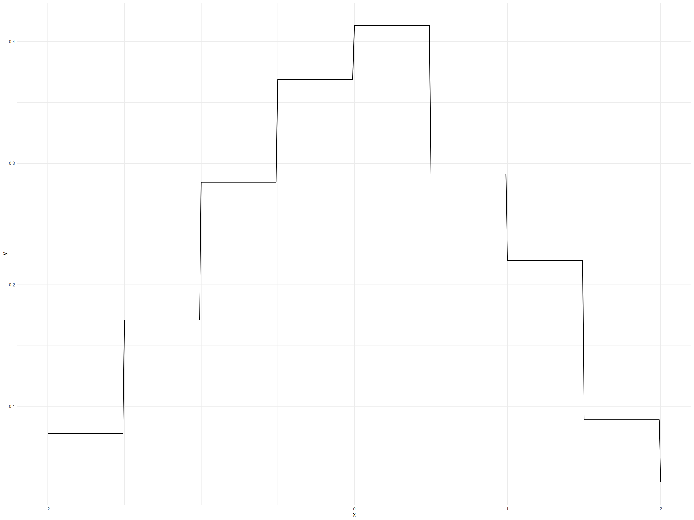

- `pdf`和`cdf`预测类型分别只是围绕`distr$pdf`和`distr$cdf`的简单包装器
- 这里可以发现
  - `pdf`和`cdf`都储存在`prediction`里
  - 也可从`Prediction$distr$pdf()`和  
   `Prediction$distr$cdf()`调用学习器重新计算
    - 结果是一致的

```r
prediction <- lrn_hist$
 train(tsk_dens, 1:10)$
 predict(tsk_dens, 11:13)
prediction
```

```js
-- <PredictionDens> for 3 observations: ----------------------------------------
 row_ids pdf       cdf
      11 0.0 1.0000000
      12 0.6 0.7617717
      13 0.4 0.4279775
```

```r
cbind(
 prediction$
  distr$
  cdf(tsk_dens$data()$x[11:13]),
 prediction$cdf[1:3]
)
```

<table class="dataframe">
<caption>A matrix: 3 x 2 of type dbl</caption>
<tbody>
 <tr><td>1.0000000</td><td>1.0000000</td></tr>
 <tr><td>0.7617717</td><td>0.7617717</td></tr>
 <tr><td>0.4279775</td><td>0.4279775</td></tr>
</tbody>
</table>

### `MeasureDens` 和总揽上述流程

- `mlr3proba` 中用于密度估计的唯一已实施度量是对数损失（logloss）
  - 其定义方式与分类中的定义相同，  
   即 $L(y) = -\log(\hat{f}_Y(y))$
    -  $\hat{f}_Y$：估计的概率密度函数

- 创建密度评估问题的评估器

```r
msr_logloss <- msr('dens.logloss')
msr_logloss
```

```js
-- <MeasureDensLogloss> (dens.logloss): Log Loss -------------------------------
* Packages: mlr3 and mlr3proba
* Range: [0, Inf]
* Minimize: TRUE
* Average: macro
* Parameters: eps=1e-15
* Properties: -
* Predict type: pdf
* Predict sets: test
* Aggregator: mean()
```

- 标准的评估器传递

```r
prediction$score(msr_logloss)
```

```js
dens.logloss: 11.9886309168503
```

- benchmark比较不同密度评估学习器

```r
# 加载R包
# library(mlr3extralearners)

# 任务
tsk_faithful <- tsk('faithful')
# 学习器
learners <- lrns(c('dens.hist', 'dens.pen', 'dens.kde'))
# 评估器
measure <- msr('dens.logloss')

# benchmark比较
bmr <- benchmark(
 benchmark_grid(
  tsk_faithful, 
  learners,
  rsmp('cv', folds = 3)
 )
)

# 结果整合
bmr$aggregate(measure)
```

```js
      nr  task_id learner_id resampling_id iters dens.logloss
   <int>   <char>     <char>        <char> <int>        <num>
1:     1 faithful  dens.hist            cv     3     1.115927
2:     2 faithful   dens.pen            cv     3     1.377325
3:     3 faithful   dens.kde            cv     3     1.026440
Hidden columns: resample_result
```

- 可视化3种学习器的性能
  - 复杂的惩罚密度估计器的表现并不优于基线直方图，  
   但核密度估计器至少在对数损失结果上更好

```r
autoplot(bmr, measure = measure)
```

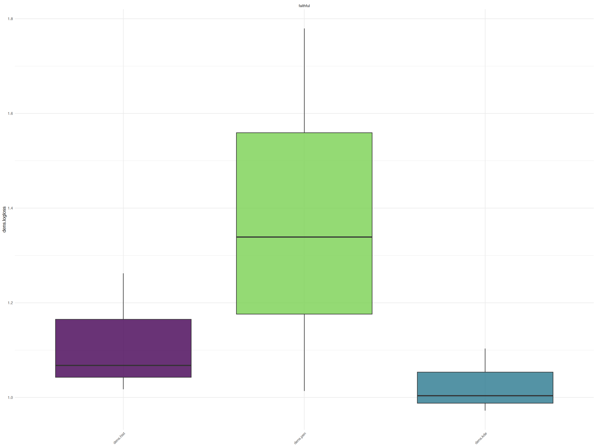

## 聚类分析（Cluster Analysis）

### 简介

- `mlr3cluster`使用以下用于聚类分析的对象对`mlr3`进行了扩展：
  - `TaskClust`：聚类任务
  - `LearnerClust`：聚类学习器的基类
  - `PredictionClust`：聚类预测结果的`Prediction`对象的特定类
  - `MeasureClust`：聚类性能评估器

### `TaskClust`

- 以`cluster`包自带的数据集`ruspini`为例

```r
# 加载R包
# library(mlr3verse)
# library(cluster)

# 创建聚类任务
tsk_ruspini <- as_task_clust(ruspini)
tsk_ruspini
```

```js
-- <TaskClust> (75x2) ----------------------------------------------------------
* Target:
* Properties: -
* Features (2):
  * int (2): x, y
```

```r
tsk_ruspini$data(1:3) 
```

<table class="dataframe">
<caption>A data.table: 3 x 2</caption>
<thead>
 <tr><th scope=col>x</th><th scope=col>y</th></tr>
 <tr><th scope=col>&lt;int&gt;</th><th scope=col>&lt;int&gt;</th></tr>
</thead>
<tbody>
 <tr><td> 4</td><td>53</td></tr>
 <tr><td> 5</td><td>63</td></tr>
 <tr><td>10</td><td>59</td></tr>
</tbody>
</table>

- 鲁西尼（Ruspini）数据集的分布情况

```r
autoplot(tsk_ruspini)
```

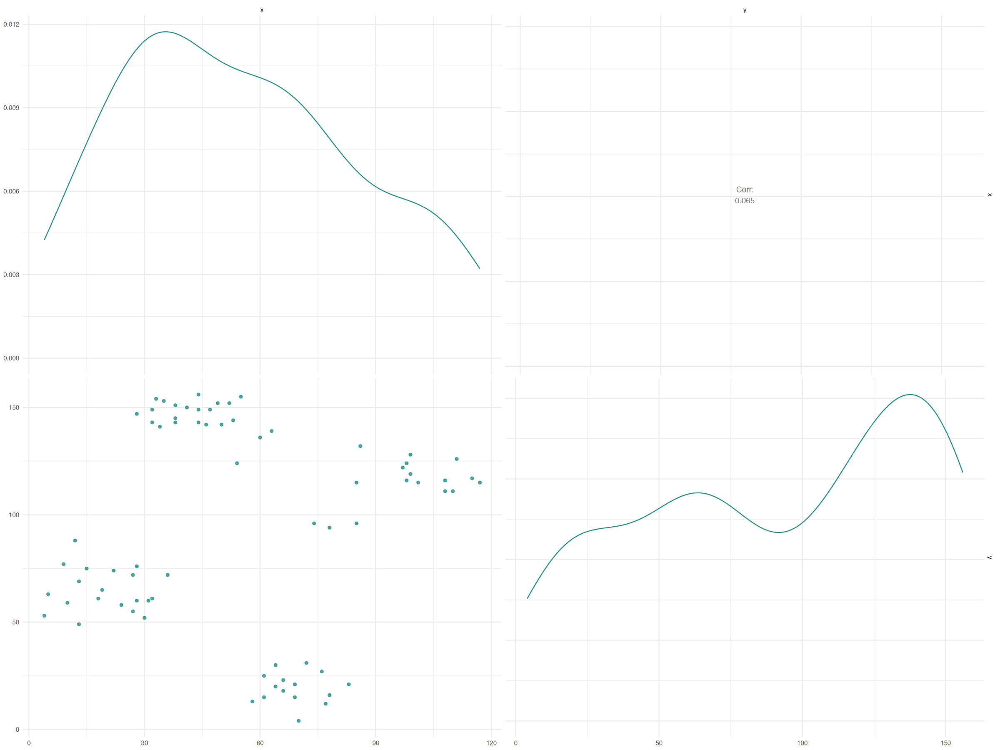

- 查看所有自带的聚类任务

```r
as.data.table(mlr_tasks)[task_type == 'clust', c(1:2, 4:5)]
```

<table class="dataframe">
<caption>A data.table: 2 x 4</caption>
<thead>
 <tr><th scope=col>key</th><th scope=col>label</th><th scope=col>nrow</th><th scope=col>ncol</th></tr>
 <tr><th scope=col>&lt;chr&gt;</th><th scope=col>&lt;chr&gt;</th><th scope=col>&lt;int&gt;</th><th scope=col>&lt;int&gt;</th></tr>
</thead>
<tbody>
 <tr><td>ruspini  </td><td>Ruspini   </td><td>75</td><td>2</td></tr>
 <tr><td>usarrests</td><td>US Arrests</td><td>50</td><td>4</td></tr>
</tbody>
</table>

### `LearnerClust` 和 `PredictionClust`

- 聚类学习器有两种`predict_types`
  - `'partition'`：对观测值所属聚类的估计
  - `'prob'`：一个观测值属于每个聚类的概率
- 与分类类似，  
  聚类学习器的预测类型要么是确定性的（`"partition"`），  
  要么是概率性的（`"prob"`）

- 下例中构建一个预测类型为 `"prob"` ，  
  且有3个聚类（`centers = 3`）的C均值聚类学习器，  
  在 `ruspini` 数据集上对其进行训练，  
  然后返回六个随机观测值的聚类分配（`$assignments`）

```r
lrn_cmeans <- lrn(
 'clust.cmeans', 
 predict_type = 'prob', 
 centers = 3
)
lrn_cmeans
```

```js
-- <LearnerClustCMeans> (clust.cmeans): Fuzzy C-Means Clustering Learner -------
* Model: -
* Parameters: centers=3
* Packages: mlr3, mlr3cluster, and e1071
* Predict Types: partition and [prob]
* Feature Types: logical, integer, and numeric
* Encapsulation: none (fallback: -)
* Properties: complete, fuzzy, and partitional
* Other settings: use_weights = 'error'
```

```r
lrn_cmeans$train(tsk_ruspini)
lrn_cmeans$assignments[sample(tsk_ruspini$nrow, 6)]
```

```js
[1] 2 1 1 1 3 2
```

- 由于聚类是无监督的，  
  对新数据使用`predict`通常**没有意义**，  
  不过使用`mlr3`接口仍有可能实现

```r
lrn_cmeans$
 train(tsk_ruspini, 1:30)$
 predict(tsk_ruspini, 31:32)
```

```js

-- <PredictionClust> for 2 observations: ---------------------------------------
 row_ids partition     prob.1     prob.2    prob.3
      31         3 0.01814044 0.01552007 0.9663395
      32         3 0.01177598 0.01002160 0.9782024
```

- 对整个数据集进行聚类，并且可视化聚类结果的分布

```r
prediction <- lrn_cmeans$
 train(tsk_ruspini)$
 predict(tsk_ruspini)
autoplot(prediction, tsk_ruspini)
```

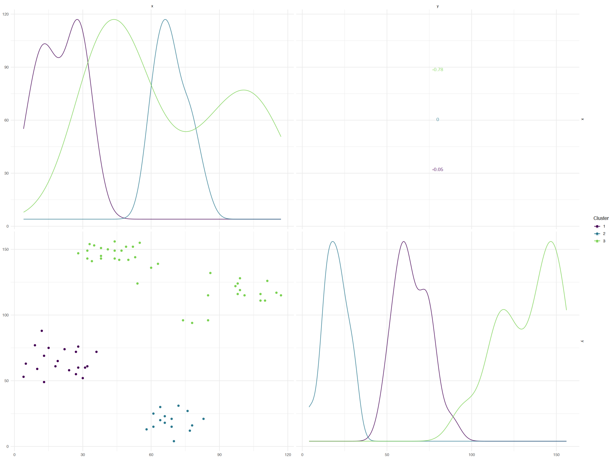

- 虽然有两种可能的预测类型，但有些学习器的“预测”永远没有意义
  - 例如在层次聚类中
- 在层次聚类中，目标是通过将大的簇分裂成较小的簇，  
  或将较小的簇合并成较大的簇，  
  来构建一个嵌套簇的层次结构
  - 最终结果是一棵树或树形图，  
   如果添加新的数据点，  
   该树或树形图可能会发生变化
- 为保持一致性，`mlr3cluster` 为层次聚类提供了  
  一个 `predict` 方法，但会给出一个警告：

```r
lrn_hclust <- lrn('clust.hclust', k = 2)
lrn_hclust$
 train(tsk_ruspini)$
 predict(tsk_ruspini)
```

```js
Warning message in warn_prediction_useless(self$id): "Learner 'clust.hclust' doesn't predict on new data and predictions may not make sense on new data."

-- <PredictionClust> for 75 observations: --------------------------------------
 row_ids partition
       1         1
       2         1
       3         1
     ---       ---
      73         1
      74         1
      75         1
```

- 查看聚类结果图
  - `ruspini`数据集层次聚类的树形图
  - y轴是点的相似度
  - x轴上相连的观测值越低，  
   它们的相似度就越高
  - 顶部的划分代表两个簇的分离

```r
autoplot(lrn_hclust) + 
 theme(axis.text = element_text(size = 5.5))
```

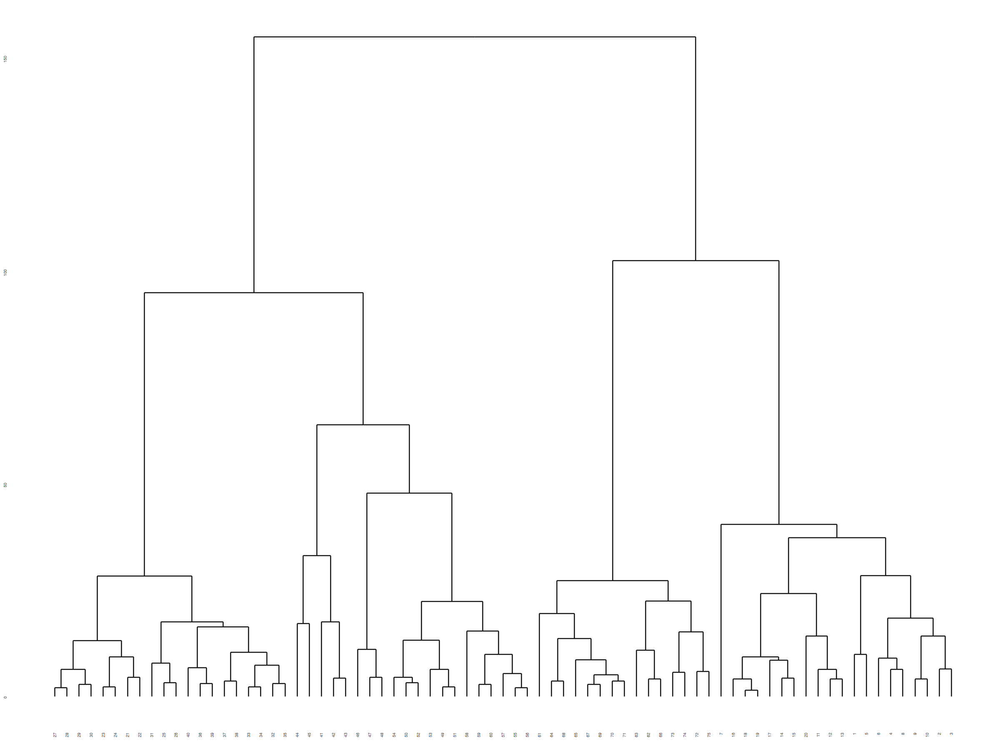

### `MeasureClust`

- 无监督任务在模型评估中没有可用于对比的真实数据
  - 仍然可以通过量化同一簇内对象的相关程度（簇内聚性）  
   以及不同簇之间的差异程度（簇分离性）来衡量簇分配的质量
- 两种常见的度量指标
  - 组内平方和（WSS）度量（`msr("clust.wss")`）
    - 计算观测值与质心之间的平方差之和，  
    这是对聚类凝聚性的一种量化（值越小表明聚类越紧密）
    - 轮廓系数量化了每个点属于其分配的聚类相对于相邻聚类的程度，  
    得分越接近 **1 表明聚类效果良好**，得分越接近 **-1 表明聚类效果不佳**
  - 轮廓系数（`msr("clust.silhouette")`）
    - 返回所有观测值的平均轮廓得分
    - 当只有单个聚类时，该度量简单地输出0

- 下面是对聚类结果的评估
  - 极高的加权平方和（WSS）以及中等的平均轮廓系数表明，  
   聚类还有更多工作要做

```r
measures <- msrs(c('clust.wss', 'clust.silhouette'))

prediction$score(measures, task = tsk_ruspini)
```

```js
       clust.wss clust.silhouette 
    5.115541e+04     6.413923e-01 
```

- 通常将无监督任务简化为定量指标可能**并无益处**（因为不存在真实值）
- 可视化可能是评估聚类质量更有效的工具

### 可视化

#### 聚类可视化

- 由于聚类是一项无监督任务，  
  可视化不仅对于评估模型至关重要，  
  对于确定学习器是否按预期完成任务也必不可少

- 很容易依赖聚类度量来评估聚类的质量，  
  但应该保持谨慎
  - 因为在模型之间进行选择可能取决于其他因素，  
   比如聚类是如何形成的
- 下例中用 `mlbench.spirals` 生成两条相互缠绕的螺旋线的数据

```r
# 生成数据
spirals <- mlbench::mlbench.spirals(
 n = 300, 
 sd = 0.01
)
# 构建任务
tsk_spirals <- as_task_clust(
 as.data.frame(spirals$x)
)
# 可视化数据
autoplot(tsk_spirals)
```

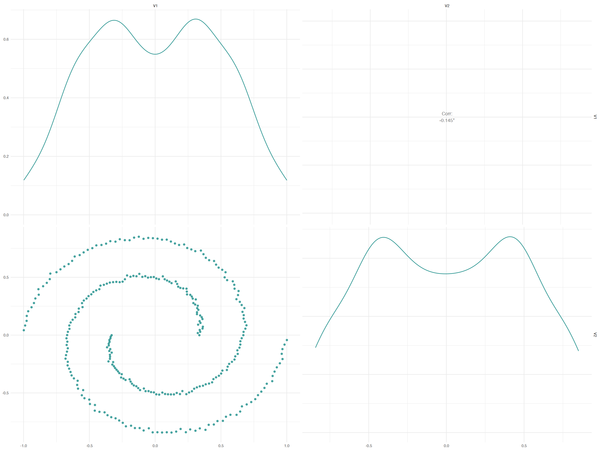

- 拟合模型并查看结果
  - K均值聚类给出了更高的平均轮廓系数，  
   因此我们可以得出结论，  
   具有两个质心的K均值学习器比DBSCAN方法是更好的选择

```r
# 学习器
learners <- list(
  lrn('clust.kmeans'),
  lrn('clust.dbscan', eps = 0.1)
)

# benchmark比较
bmr <- benchmark(
 benchmark_grid(
  tsk_spirals, 
  learners, 
  rsmp('insample')
 )
)

# 整合结果
bmr$aggregate(msr('clust.silhouette'))[, c(4, 7)]
```

```js
  learner_id   clust.silhouette
1 clust.kmeans 0.37244247      
2 clust.dbscan 0.02929844      
```

- 通过对聚类结果的可视化，可以看到两种聚类的差别
  - K均值聚类像对图像切了一半
  - DBSCAN则按曲线进行了区分
- **应该根据任务的需求结合可视化选择合适的聚类方法，**  
  **而并单纯非依赖于评估器给出的结果**

```r
# 加载R包
# library(patchwork)

# 提取K均值聚类和DBSCAN两种聚类的结果
# 转换成因子
pred_kmeans <- as.factor(
 bmr$
  resample_result(1)$
  prediction()$
  partition
 )
pred_dbscan <- as.factor(
 bmr$
  resample_result(2)$
  prediction()$
  partition
)
# 绘图
df_kmeans <- cbind(
 tsk_spirals$data(), 
 clust = pred_kmeans
)
df_dbscan <- cbind(
 tsk_spirals$data(), 
 clust = pred_dbscan
)
map <- aes(x = V1, y = V2, color = clust)
p_kmeans <- ggplot(df_kmeans, map) + 
 ggtitle('K-means')
p_dbscan <- ggplot(df_dbscan, map) + 
 ggtitle('DBSCAN')

p_kmeans + 
 p_dbscan + 
 plot_layout(guides = 'collect') & 
 geom_point() &
 theme_minimal() & 
 ggplot2::scale_colour_viridis_d(end = 0.8)
```

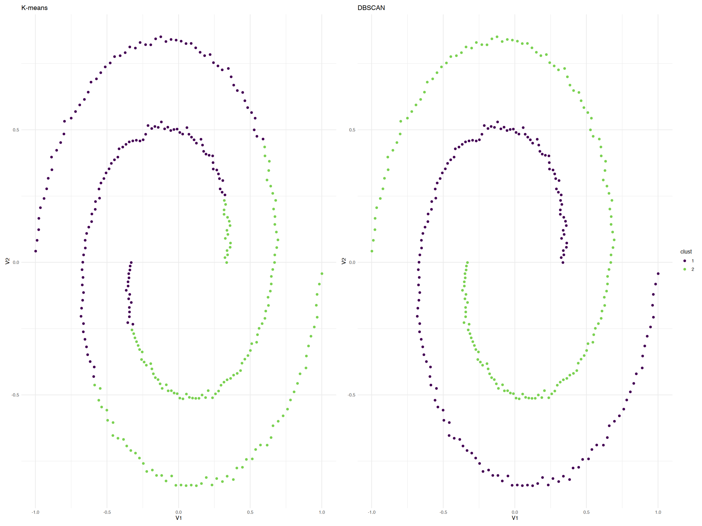

#### 主成分分析与轮廓系数图（Silhouette Plot）

- 在`mlr3viz`中实现的用于支持聚类学习器评估的两个最重要的图
  - 主成分分析（PCA）图
    - 机器学习中常用的一种降维方法
    - 用于减少数据集中的变量数量，  
    或可视化最重要的**成分**
      - 成分是数据集特征的线性变换
      - 方差越大（因此预测能力越强）的成分被认为越重要
    - 在聚类的背景下，通过将观测值相对于前两个成分进行绘图，  
    然后按聚类进行着色，可以可视化高维数据集，  
    并且预期会看到观测值分属于不同的组
  - 轮廓系数图
    - 通过可视化一个簇中的观测值在个体和群体层面上是否分布合理，  
    从而直观地评估估计簇的质量
    - 这些图包含一条虚线
      - 该虚线表示所有数据点的平均轮廓系数，  
     每个数据点的轮廓值由一个按其分配簇着色的条形表示
    - 如果给定簇的平均轮廓值低于平均轮廓系数线，  
    则意味着该簇定义不明确

- 下例的可视化结果中
  - PCA图
    - 模型通过前两个主成分将观测数据很好地分成了两个簇
  - 轮廓系数图
    - 很多观测值都在平均线以下且接近零，  
    说明聚类分配质量不是很好，  
    这意味着许多观测值很可能被分配到了错误的聚类中

```r
# 任务
tsk_usarrests <- tsk('usarrests')
# 学习器
prediction <- lrn('clust.kmeans')$
 train(tsk_usarrests)$
 predict(tsk_usarrests)

# PCA
autoplot(
 prediction, 
 tsk_usarrests, 
 type = 'pca'
)

# 轮廓系数
autoplot(
 prediction, 
 tsk_usarrests, 
 type = 'sil'
)
```

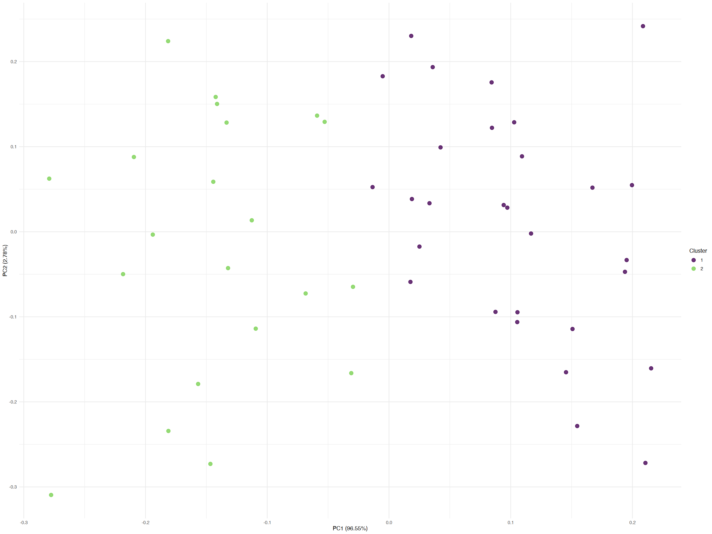
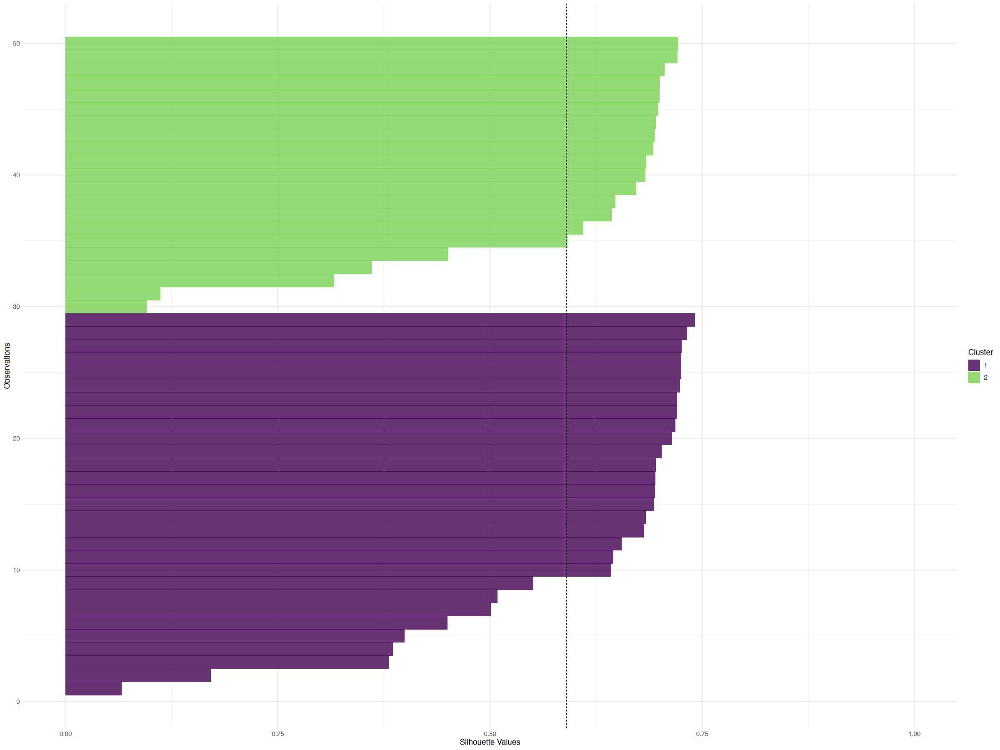

### 总揽上述流程

- 下面结果中
  - C均值算法和K均值算法都明显优于无特征的基线算法，  
   但若要确定这两种算法中哪一种更适合，  
   还需要结合可视化的进一步分析

```r
# 任务
tsk_usarrests <- tsk('usarrests')
# 学习器
learners <- list(
  lrn('clust.featureless'),
  lrn('clust.kmeans', centers = 4L),
  lrn('clust.cmeans', centers = 3L)
)
# 评估器
measures <- list(
 msr('clust.wss'), 
 msr('clust.silhouette')
)
# benchmark比较
bmr <- benchmark(
 benchmark_grid(
  tsk_usarrests, 
  learners,
  rsmp('insample')
 )
)
# 结果整合
bmr$aggregate(measures)[, c(4, 7, 8)]
```

```js
Superclass MeasureClust has cloneable=FALSE, but subclass MeasureClustFPC has cloneable=TRUE. A subclass cannot be cloneable when its superclass is not cloneable, so cloning will be disabled for MeasureClustFPC.

Superclass MeasureClust has cloneable=FALSE, but subclass MeasureClustSil has cloneable=TRUE. A subclass cannot be cloneable when its superclass is not cloneable, so cloning will be disabled for MeasureClustSil.

INFO  [23:38:54.167] [mlr3] Running benchmark with 3 resampling iterations
INFO  [23:38:54.220] [mlr3] Applying learner 'clust.featureless' on task 'usarrests' (iter 1/1)
INFO  [23:38:54.254] [mlr3] Applying learner 'clust.kmeans' on task 'usarrests' (iter 1/1)
INFO  [23:38:54.289] [mlr3] Applying learner 'clust.cmeans' on task 'usarrests' (iter 1/1)
INFO  [23:38:54.331] [mlr3] Finished benchmark
```

<table class="dataframe">
<caption>A bmr_aggregate: 3 x 3</caption>
<thead>
 <tr><th scope=col>learner_id</th><th scope=col>clust.wss</th><th scope=col>clust.silhouette</th></tr>
 <tr><th scope=col>&lt;chr&gt;</th><th scope=col>&lt;dbl&gt;</th><th scope=col>&lt;dbl&gt;</th></tr>
</thead>
<tbody>
 <tr><td>clust.featureless</td><td>355807.82</td><td>0.0000000</td></tr>
 <tr><td>clust.kmeans     </td><td> 34728.63</td><td>0.5012332</td></tr>
 <tr><td>clust.cmeans     </td><td> 47964.27</td><td>0.5319024</td></tr>
</tbody>
</table>

## 空间分析（Spatial Analysis）

### 简介

- 空间分析
  - 可以是任何其他机器学习任务（例如，回归或分类）的一个子集
  - 其定义是数据集中存在空间信息
    - 这些信息通常存储为坐标
    - 通常命名为`'x'`和`'y'`，  
    或者`'lat'`和`'lon'`  
    （分别代表“纬度”和“经度”）
- 空间分析是一项独特的任务
  - 由于 **自相关性** 的复杂性，空间数据必须谨慎处理
  - 自相关存在于空间数据中，  
   因为坐标中编码了隐含信息
    - 例如两个观测值（如城市、国家、大洲）是相距较近还是较远
    - 例如，假设要预测德国疾病爆发两个月后的病例数
      - 疫情从震中向外辐射，因此离德国较近的国家病例数会较多，  
     而较远的国家病例数会较少
      - 从空间角度查看数据，  
     可以清楚地看到附近观测值之间存在自相关的迹象
    - 在这个例子中自相关是呈辐射状的，  
    但在实际情况中**并非总是如此**

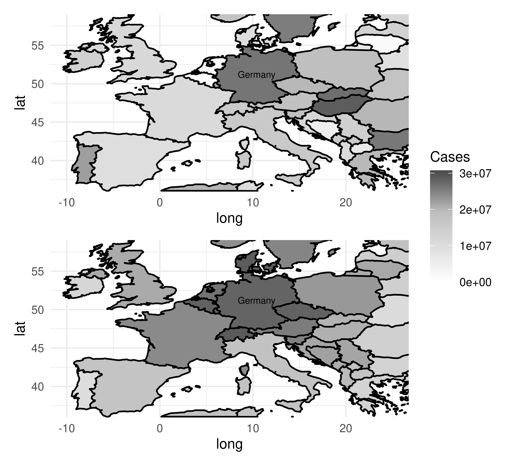

- `mlr3spatiotempcv` 中提供了额外的重采样方法，  
  以解决由于时空自相关导致的重采样过程中训练集和测试集的相似性问题

### `TaskClassifST` 和 `TaskRegrST`

- `TaskClassifST` 和 `TaskRegrST`为  
  时空任务的分类与回归任务
  - `coordinate_names`：坐标的特征名
  - `crs`：Coordinate Reference System

```r
# 加载R包
# library(mlr3spatial)
# library(mlr3spatiotempcv)

# 从`data.frame`创建任务对象
tsk_ecuador <- as_task_classif_st(
 ecuador, 
 id = 'ecuador_task',
 target = 'slides', 
 positive = 'TRUE',
 coordinate_names = c('x', 'y'), 
 crs = '32717'
)

# 从`sf`创建任务对象
data_sf <- sf::st_as_sf(
 ecuador, 
 coords = c('x', 'y'), 
 crs = '32717'
)
tsk_ecuador <- as_task_classif_st(
 data_sf, 
 target = 'slides',
 positive = 'TRUE'
)

tsk_ecuador
```

```js
-- <TaskClassifST> (751x11) ----------------------------------------------------
* Target: slides
* Properties: twoclass
* Features (10):
  * dbl (10): carea, cslope, dem, distdeforest, distroad, distslidespast,
  hcurv, log.carea, slope, vcurv
* Coordinates:
            X       Y
        <num>   <num>
  1: 712882.5 9560002
  2: 715232.5 9559582
  3: 715392.5 9560172
  4: 715042.5 9559312
  5: 715382.5 9560142
 ---                 
747: 714472.5 9558482
748: 713142.5 9560992
749: 713322.5 9560562
750: 715392.5 9557932
751: 713802.5 9560862
```

- 可以用正常的学习器进行建模分析

```r
lrn('classif.rpart')$
 train(tsk_ecuador)$
 predict(tsk_ecuador)
```

```js
-- <PredictionClassif> for 751 observations: -----------------------------------
 row_ids truth response
       1  TRUE     TRUE
       2  TRUE     TRUE
       3  TRUE     TRUE
     ---   ---      ---
     749 FALSE    FALSE
     750 FALSE    FALSE
     751 FALSE     TRUE
```

### 时空交叉验证（Spatiotemporal Cross-Validation）

- 如果将非空间重采样方法用于空间数据可能会出现什么问题，本例中：
  - `'NSpCV'`（非空间交叉验证）
    - 是来自`mlr3`的非空间重采样方法
  - `'SpCV'`（空间交叉验证）
    - 来自`mlr3spatiotempcv`
    - 针对空间数据进行优化的
- 结果展示`'NSpCV'`使决策树看起来比实际表现更好，其估计性能明显更高
  - 然而，这是由于数据中的自相关性导致的过度自信预测

```r
# 学习器
lrn_rpart <- lrn(
 'classif.rpart', 
 predict_type = 'prob'
)
# 普通的重采样
rsmp_nsp <- rsmp(
 'repeated_cv', 
 folds = 3, 
 repeats = 2, 
 id = 'NSpCV'
)
# 空间交叉验证重采样
rsmp_sp <- rsmp(
 'repeated_spcv_coords', 
 folds = 3, 
 repeats = 2,
 id = 'SpCV'
)

# benchmark比较
design <- benchmark_grid(
 tsk_ecuador, 
 lrn_rpart, 
 c(rsmp_nsp, rsmp_sp)
)
bmr <- benchmark(design)

# 结果整合
bmr$aggregate(msr('classif.acc'))[, c(5, 7)]
```

<table class="dataframe">
<caption>A bmr_aggregate: 2 x 2</caption>
<thead>
 <tr><th scope=col>resampling_id</th><th scope=col>classif.acc</th></tr>
 <tr><th scope=col>&lt;chr&gt;</th><th scope=col>&lt;dbl&gt;</th></tr>
</thead>
<tbody>
 <tr><td>NSpCV</td><td>0.676409</td></tr>
 <tr><td>SpCV </td><td>0.584237</td></tr>
</tbody>
</table>

- 由于潜在的空间自相关性，  
  应用非空间重采样**会导致训练集和测试集非常相似**
  - 因此，在模型训练所用的相同数据上进行测试，结果不会有太大差异
  - 为了得到真实的性能结果，应避免这种情况
- 空间方法考虑了自相关性，  
  测试数据与训练数据的相关性较低（尽管仍会存在一些关联）

- 下图中，通过 `autoplot()` 方法可以直观地看到：
  - 空间重采样方法，左图
    - 各个分区在空间上有明显的分隔
  - 非空间重采样方法，右图
    - 训练集和测试集的划分重叠较多（因此相关性更强）

```r
# 加载R包
# library(patchwork)

# 对重采样结果可视化
(autoplot(rsmp_sp, tsk_ecuador, fold_id = 1, size = 0.7) +
  ggtitle('Spatial Resampling') +
  autoplot(rsmp_nsp, tsk_ecuador, fold_id = 1, size = 0.7) +
  ggtitle('Non-spatial Resampling')) +
  plot_layout(guides = 'collect') &
  theme_minimal() &
  theme(axis.text = element_text(size = 4), legend.position = 'bottom')
```

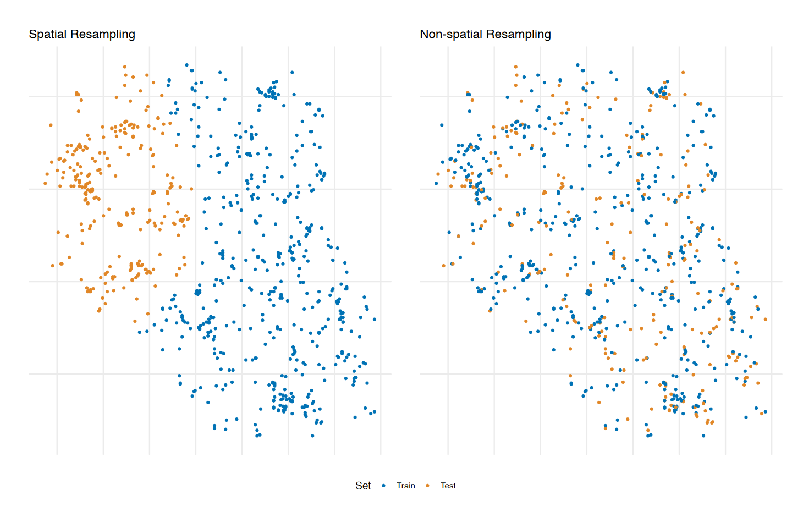

### `mlr3spatiotempcv`中其他重采样方法

- **Blocking**：  
  在二维或三维空间中创建矩形块
- **Buffering**：  
  创建缓冲区，去除训练集和测试集之间的观测数据
- **Spatiotemporal clustering**：  
  时空聚类 - 基于坐标（和/或时间点）的聚类
- **Feature space clustering**：  
  基于特征空间进行聚类，不一定基于时空。
- **Custom (partitioning)**：  
  按因子变量分组

- `mlr3spatiotempcv`也可以讨论**时空问题**

### 空间预测（Spatial Prediction）

- 进行时空预测，目标是在像素级别进行分类或回归预测，  
  即对由栅格图像的几何分辨率定义的一个区域进行预测
- 使用 `predict_spatial()`
  可以对以下任何空间数据类进行空间预测：
  - `stars`（来自 `stars` 包）
  - `SpatRaster`（来自 `terra` 包）
  - `RasterLayer`（来自 `raster` 包）
  - `RasterStack`（来自 `raster` 包）

- 下例中
  - 加载 `leipzig_points` 数据集进行训练，  
  - 并使用 `as_task_classif_st()` 将其转换为时空任务，
  - 同时加载 `leipzig_raster` 栅格数据
  - 这两个文件均作为示例数据包含在 `mlr3spatial` 中
  - 指定创建一个 `terra` 对象，  
   该对象可以使用内置绘图方法进行可视化

```r
# library(mlr3spatial)
# library(sf)
# library(terra, exclude = 'resample')

# 读取需要分析的示例数据
leipzig_vector <- sf::read_sf(
 system.file(
  'extdata',
  'leipzig_points.gpkg', 
  package = 'mlr3spatial'
 ),
 stringsAsFactors = TRUE
)

# 构建任务
tsk_leipzig <- as_task_classif_st(
 leipzig_vector, 
 target = 'land_cover'
)

# 读取示例的栅格数据
leipzig_raster <- terra::rast(
 system.file(
  'extdata', 
  'leipzig_raster.tif',
  package = 'mlr3spatial'
 )
)

# 构建学习器
lrn_ranger <- lrn('classif.ranger')$
 train(tsk_leipzig)

# 预测，但是使用`predict_spatial()`
prediction <- predict_spatial(
 leipzig_raster, 
 lrn_ranger,
 format = 'terra'
)

# 查看预测结果
prediction
```

```js
class       : SpatRaster 
size        : 206, 154, 1  (nrow, ncol, nlyr)
resolution  : 10, 10  (x, y)
extent      : 731810, 733350, 5692030, 5694090  (xmin, xmax, ymin, ymax)
coord. ref. : WGS 84 / UTM zone 32N (EPSG:32632) 
source      : file48064a40f583.tif 
categories  : categories 
name        : land_cover 
min value   :     forest 
max value   :      water 
```

- 可视化预测的结果
  - 森林（紫色）、牧场（蓝色）、城市（绿色）和水域（黄色）

```r
plot(
 prediction, 
 col = c(
 '#440154FF', 
 '#443A83FF', 
 '#31688EFF',
 '#21908CFF', 
 '#35B779FF', 
 '#8FD744FF', 
 '#FDE725FF'
 )
)
```

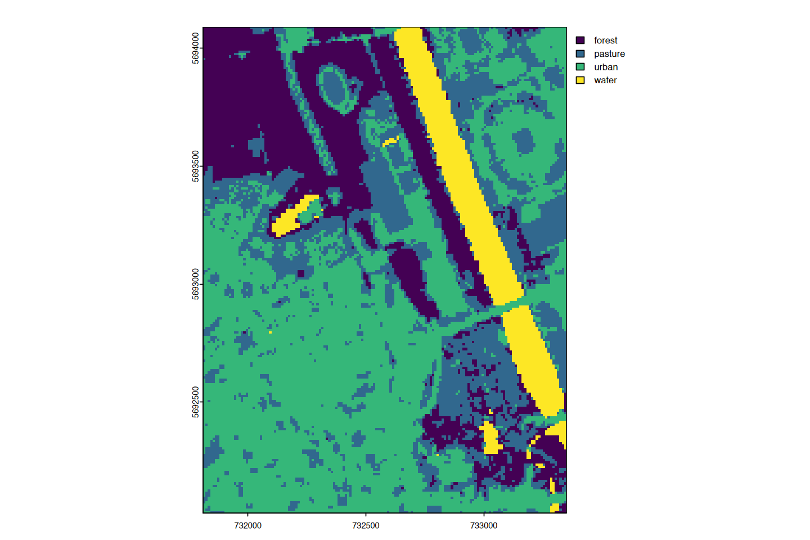
