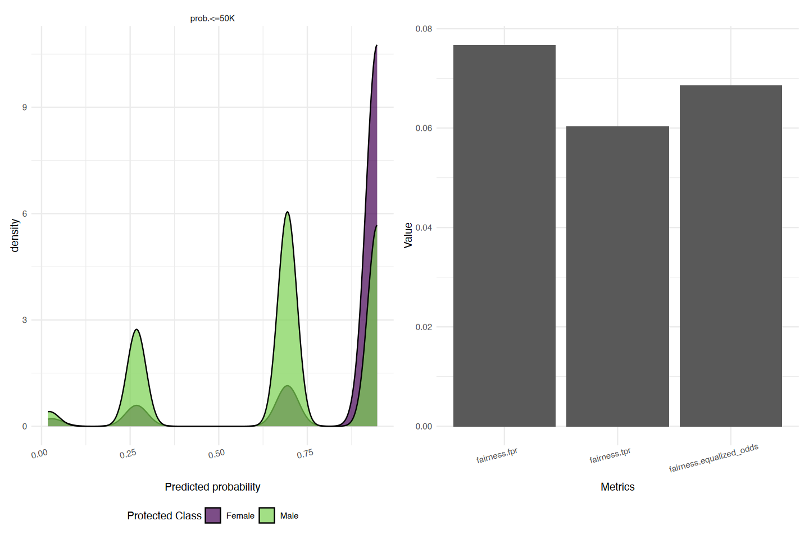
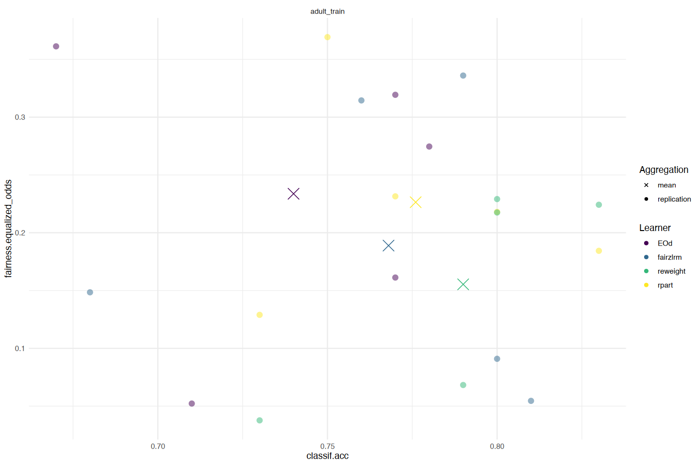

> - Cover Pic by [@スコッティ](https://www.pixiv.net/artworks/130732257)  

> [Applied Machine Learning Using mlr3 in R](https://mlr3book.mlr-org.com/)

## 简介

- 基于数据驱动模型的自动化决策系统正变得越来越普遍，但如果没有适当的审计，  
  这些模型可能会给个人，尤其是弱势群体带来负面后果
- 举一个现实世界的例子
  - 与其他种族群体相比，  
   历史和抽样偏差导致白人种族患者的医疗数据质量更高
  - 如果一个模型主要基于白人患者的数据进行训练，  
   那么该模型在给定的性能指标（例如分类错误）方面可能看起来 “很好”
  - 但实际上该模型可能在对白种人患者做出良好预测的同时，  
   却对其他患者做出错误甚至有害的预测
- 由于机器学习驱动的系统被用于具有重大影响力的决策，  
  因此不仅要从模型的稳健性和预测性能，还要从  
  潜在偏差方面，开发分析和评估这些模型的能力

## 示例数据

```r
# 加载R包
# library(mlr3fairness)

# 任务
tsk_adult_train <- tsk('adult_train')
tsk_adult_train
```

```js
-- <TaskClassif> (30718x13) ----------------------------------------------------
* Target: target
* Target classes: <=50K (positive class, 75%), >50K (25%)
* Properties: twoclass
* Features (12):
  * fct (7): education, marital_status, occupation, race, relationship, sex,
  workclass
  * int (5): age, capital_gain, capital_loss, education_num, hours_per_week
* Protected attribute: sex
```

## 偏差与公平性（Bias and Fairness）

- 在公平性的背景下，  
  **偏差**是指模型对待个体或群体方式上的差异
- 在成人数据集中，  
  与女性群体相比，  
  男性群体中的成年人年收入超过 5 万美元的可能性要大得多

```r
sex_salary <- table(
 tsk_adult_train$
  data(cols = c('sex', 'target')
 )
)
round(proportions(sex_salary), 2)
```

```js
        target
sex      <=50K >50K
  Female  0.29 0.04
  Male    0.46 0.21
```

- 卡方检验进一步验证了上述的结论
  - `p-value < 2.2e-16`

```r
chisq.test(sex_salary)
```

```js
Pearson's Chi-squared test with Yates' continuity correction

data:  sex_salary
X-squared = 1440.4, df = 1, p-value < 2.2e-16
```

- 本例子中，性别变量称为**敏感属性**（sensitive attribute）
- 群体公平性
  - 目标是确定在由敏感属性定义的各个群体之间，  
   决策是否公平
  - 任务中的敏感属性是通过`'pta'`  
   （protected attribute，受保护属性）来设置的

```r
tsk_adult_train$
 set_col_roles('sex', add_to = 'pta')

tsk_adult_train
```

```js
-- <TaskClassif> (30718x13) ----------------------------------------------------
* Target: target
* Target classes: <=50K (positive class, 75%), >50K (25%)
* Properties: twoclass
* Features (12):
  * fct (7): education, marital_status, occupation, race, relationship, sex,
  workclass
  * int (5): age, capital_gain, capital_loss, education_num, hours_per_week
* Protected attribute: sex
```

## 群体公平性概念（Group Fairness Notions）

- 如果模型做出的预测与敏感属性无关，  
  则称模型预测是**偏差转换的**（bias-transforming），  
  或者满足**独立性**（independence）
  - 偏差转换方法**不依赖**于标签，  
   有助于检测因不同总体基础比率而产生的偏差
- 如果模型所做的预测在**给定真实标签**的情况下与敏感属性无关，  
  则称该模型是**偏差保持的**（bias-preserving），  
  或满足**分离性**（separation）
  - 换句话说，该模型在每个组中做出的正确/错误预测数量应大致相同
  - 有几个指标属于这一类
    - 均衡几率（equalized odds）
      - 测试不同组之间的真阳性率（TPR）和假阳性率（FPR）是否相等
    - 偏差保持指标（用于测试分离性）
      - 测试模型在不同组中产生的错误是否相等，  
     但可能未考虑标签中的偏差
        - 例如，如果现实世界中的结果可能存在偏差，  
      比如不同种族群体的人被捕率不同
- 选择何种公平性概念将取决于模型的用途及其社会背景
  - 例如，如果一个模型用于预测某人是否有罪，  
   那么可能会更关注误报率或错误发现率，而非真阳性率
- 无论选择哪种指标，本质上都是将系统性偏差和偏见浓缩为几个数字，  
  而且所有指标都有局限性，  
  没有一个指标能够识别数据中可能存在的所有偏差
  - 例如，如果社会偏见导致  
   具有相同潜在能力的个体  
   在某个可观测数量（如学校考试成绩）上出现差异，  
   这些指标可能无法识别出存在的偏差

- 为了在实践中理解这些概念
  - 设 $A$ 为一个二元敏感群体，取值为 $0$ 和 $1$
  - 设 $M$ 为一个公平性度量指标
  - 为了衡量独立性，  
   只需计算这些值之间的差异，  
   并测试结果是否小于某个阈值 $ϵ$

$$
|\Delta_{M}| = |M_{A=0} - M_{A=1}| < \epsilon
$$

- 如果使用真实阳性率（TPR）作为指标 $M$，
  - 那么如果 $|\Delta_{M}| > \epsilon$ （例如 $\epsilon = 0.05$）
  - 可得出结论：  
   模型的预测违反了机会均等指标，  
   并且不满足分离性
- 如果选择准确率或阳性预测值（PPV）作为指标 $M$
  - 可得出结论：模型预测不满足独立性

- 在 `mlr3fairness` 中，  
  可以通过构建 `msr("fairness", base_measure, range)`，  
  从任何 Measure 构建一个公平性指标  
  选择的指标传递给 `base_measure`，
  以及该指标可能采用的范围（即基于基本指标的可能差异范围）
- 在`mlr3fairness`中实现了几个 `Measure`，简化了这一步骤
  - 这些度量标准名为 `fairness.<base_measure>`
  - 例如，真阳性率（TPR）：`msr("fairness.tpr")`

```r
fair_tpr <- msr(
 'fairness', 
 base_measure = msr('classif.tpr'),
 range = c(0, 1)
)
fair_tpr
```

```js
-- <MeasureFairness> (fairness.tpr) --------------------------------------------
* Packages: mlr3 and mlr3fairness
* Range: [0, 1]
* Minimize: TRUE
* Average: macro
* Parameters: list()
* Properties: requires_task
* Predict type: response
* Predict sets: test
* Aggregator: mean()
```

## 针对偏差审核模型（Auditing a Model For Bias）

- 有了敏感属性集和选定的公平性指标，  
  现在可以训练一个`Learner`并测试偏差
- 下例使用随机森林，  
  评估男性和女性两组之间的真阳性率绝对差异

```r
tsk_adult_test <- tsk('adult_test')
lrn_rpart <- lrn(
 'classif.rpart', 
 predict_type = 'prob'
)
prediction <- lrn_rpart$
 train(tsk_adult_train)$
 predict(tsk_adult_test)
prediction$
 score(fair_tpr, tsk_adult_test)
```

```js
fairness.tpr: 0.0603449540669074
```

- 当$ϵ$值为0.05时，可以得出模型存在偏差的结论
  - 然而，这个ϵ值是任意设定的，  
   应该根据具体情况来决定
- 除了使用公平性指标评估单个模型外，  
  这些指标还可用于更大规模的benchmark实验，  
  以比较多个模型之间的偏差

- 可视化可以帮助更好地理解组间差异或模型间差异
  - `fairness_prediction_density()`：绘制各子组在不同组级别上的密度
  - `compare_metrics()`：通过多个指标对预测进行评分
- 本例中，  
  该模型更倾向于预测女性观察对象的薪资较低
  - 这可能是由于数据中存在系统性偏见，  
   即由于社会偏见，女性更有可能薪资较低，  
   也可能是由于算法引入的偏差
  - 如右图所示，所有公平性指标都超过了0.05，  
   这支持了一种观点，  
   即算法可能引入了更多偏差  
   （同样要注意0.05这个阈值）

```r
# 加载R包
# library(patchwork)
# library(ggplot2)

p1 <- fairness_prediction_density(
 prediction, 
 task = tsk_adult_test
)
p2 <- compare_metrics(
 prediction,
 msrs(
  c(
   'fairness.fpr', 
   'fairness.tpr', 
   'fairness.eod'
  )
 ),
 task = tsk_adult_test
)

(p1 + p2) *
 theme_minimal() *
 scale_fill_viridis_d(end = 0.8, alpha = 0.8) *
 theme(
  axis.text.x = element_text(angle = 15, hjust = .7),
  legend.position = 'bottom'
  )
```



## 公平机器学习（Fair Machine Learning）

- `mlr3fairness` 提供了多种解决模型偏差的方法
  - 预处理数据：  
   在将基础数据传递给`Learner`之前，  
   会以某种方式对其进行预处理，  
   以解决数据中的偏差问题
  - 采用公平模型：  
   一些算法可以直接纳入公平性考量，  
   例如带有公平性约束的广义线性模型  
   （`lrn("classif.fairzlrm")`）
  - 后处理模型预测结果：  
   对预测应用启发式方法/算法，  
   以减轻预测中存在的偏差

- 可以使用`mlr3pipelines`集成预处理和后处理方案
- 在下面示例中
  - 第一个是使用`po("reweighing_wts")`进行预处理以平衡观测权重，  
   第二个是使用`po("EOd")`对预测结果进行后处理
    - 通过随机翻转特定预测来执行均衡优势公平性定义
  - 还将`lrn("classif.fairzlrm")`与其他方法进行benchmark比较

```r
# 方法0:用来被比较的基线学习器
lrn_rpart <- lrn('classif.rpart', predict_type = 'prob')
lrn_rpart$id <- 'rpart'
# 方法1
l1 <- as_learner(
 po('reweighing_wts') %>>% 
  lrn('classif.rpart')
)
l1$id <- 'reweight'
# 方法2
l2 <- as_learner(
 po('learner_cv', lrn('classif.rpart')) %>>%
  po('EOd')
)
l2$id <- 'EOd'
# 方法3
l3 <- as_learner(
 po('collapsefactors') %>>% 
  lrn('classif.fairzlrm')
)
l3$id <- 'fairzlrm'

# 构建任务
task <- tsk('adult_train')
# 设置敏感属性
task$set_col_roles('sex', 'pta')$
 filter(sample(task$nrow, 500))$
 select(setdiff(task$feature_names, 'education_num'))

# benchmark比较试验
lrns <- list(lrn_rpart, l1, l2, l3)
bmr <- benchmark(
 benchmark_grid(
  task, 
  lrns, 
  rsmp('cv', folds = 5)
 )
)
meas <- msrs(c('classif.acc', 'fairness.eod'))
# 整合结果
bmr$aggregate(meas)[,
  .(learner_id, classif.acc, fairness.equalized_odds)]
```

<table class="dataframe">
<caption>A bmr_aggregate: 4 x 3</caption>
<thead>
 <tr><th scope=col>learner_id</th><th scope=col>classif.acc</th><th scope=col>fairness.equalized_odds</th></tr>
 <tr><th scope=col>&lt;chr&gt;</th><th scope=col>&lt;dbl&gt;</th><th scope=col>&lt;dbl&gt;</th></tr>
</thead>
<tbody>
 <tr><td>rpart   </td><td>0.776</td><td>0.2264140</td></tr>
 <tr><td>reweight</td><td>0.790</td><td>0.1553630</td></tr>
 <tr><td>EOd     </td><td>0.740</td><td>0.2337308</td></tr>
 <tr><td>fairzlrm</td><td>0.768</td><td>0.1888915</td></tr>
</tbody>
</table>

- 可视化结果
  - 各折叠（圆点）以及跨折叠聚合（叉号）的学习器  
   在分类准确率（x轴）和均衡几率（y轴）方面的比较
- 重新加权方法似乎比其他方法产生的公平性指标略好，  
  尽管这种差异不太可能具有显著性
  - 在这种情况下，可以得出结论：  
   引入偏差缓解措施并没有提高算法公平性

```r
fairness_accuracy_tradeoff(
 bmr, 
 fairness_measure = msr('fairness.eod'),
 accuracy_measure = msr('classif.ce')
) +
 ggplot2::scale_color_viridis_d('Learner') +
 ggplot2::theme_minimal()
```


