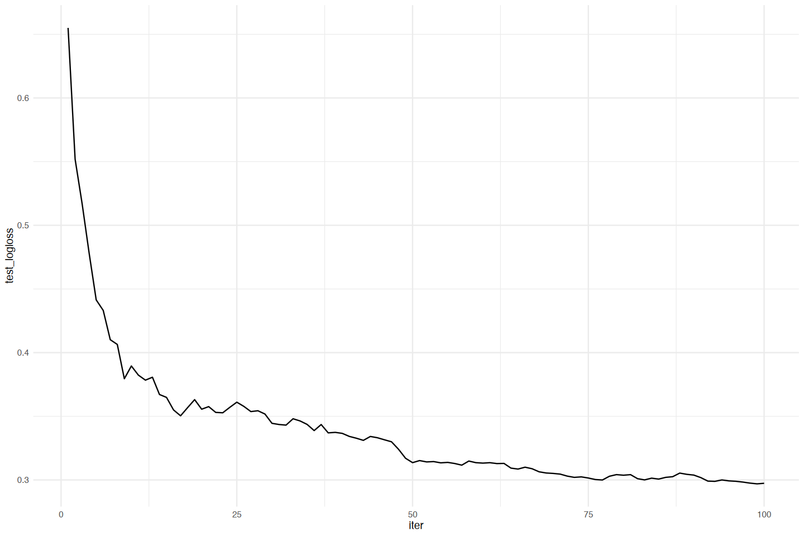
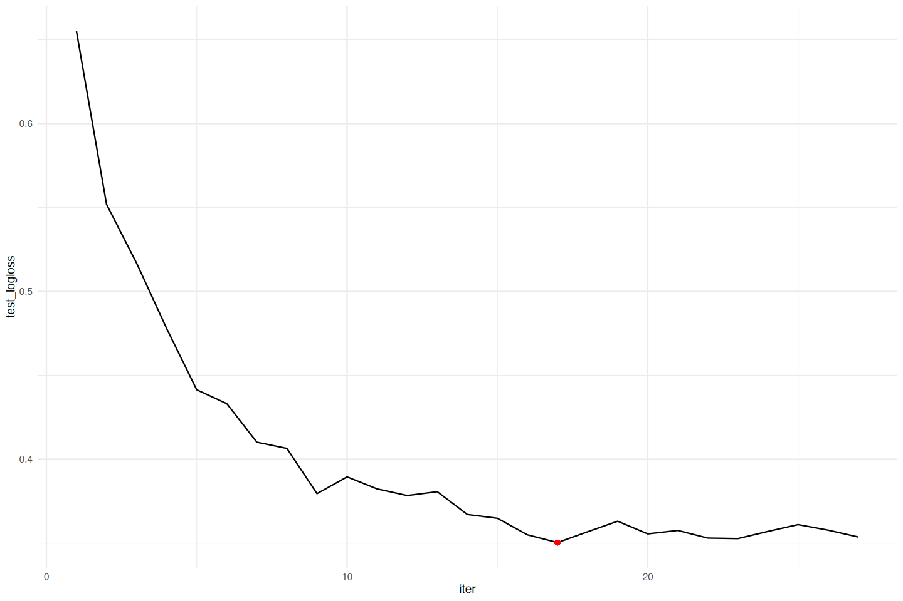
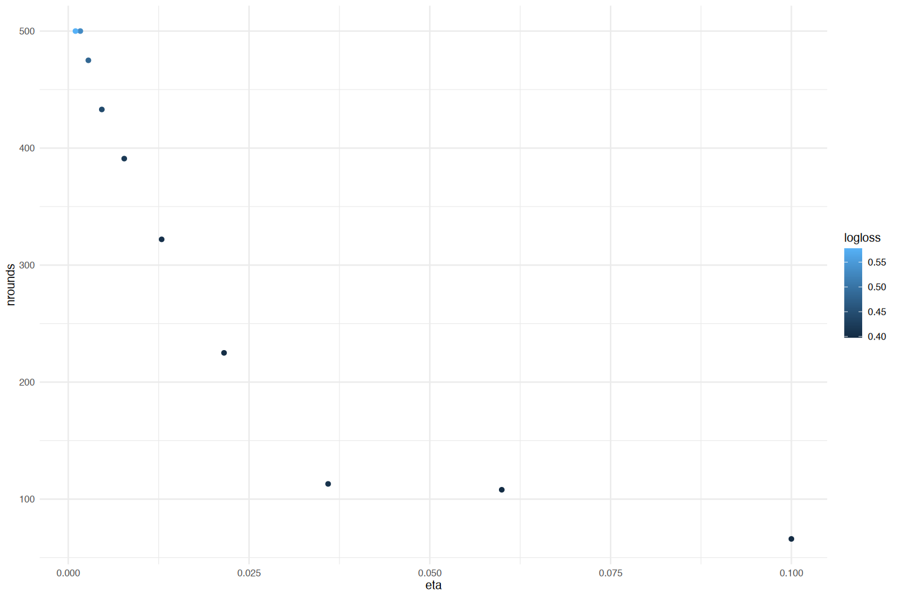

> - Cover Pic by [@灰色灰烬GREYASH](https://www.pixiv.net/artworks/131467447)  

> [Applied Machine Learning Using mlr3 in R](https://mlr3book.mlr-org.com/)

## 预测集与训练误差估计

- 评估一个完全训练好的模型通常需要对未见过的测试样本进行预测
- 当直接使用训练好的学习器进行预测时，  
  我们可以明确控制使用哪些样本

```r
# 任务
tsk_sonar <- tsk('sonar')
# 学习器
lrn_rf <- lrn('classif.ranger')
# 训练模型
lrn_rf$train(tsk_sonar, row_ids = 4:208)

# 预测(两种方法)
pred1 <- lrn_rf$predict(tsk_sonar, row_ids = 1:3)
pred2 <- lrn_rf$predict_newdata(tsk_sonar$data(1:3))
```

- 但是，当使用`resample()` 或 `benchmark()` 时，  
  默认行为是对重采样的**测试集**进行预测
- 也可以通过配置学习器的 `$predict_sets`，  
  对任务和数据的其他特定子集（即 **训练** 和 **内部验证** 数据）进行预测
- 接下来看看更复杂的 **内部验证** 选项

```r
# 默认的用于预测的数据集
lrn_rf$predict_sets
# 设置为训练测试都给用上
lrn_rf$predict_sets <- c('train', 'test')
# 再看看当前用于预测的数据集
lrn_rf$predict_sets

# 执行重采样
rr <- resample(tsk_sonar, lrn_rf, rsmp('cv', folds = 3))
```

```js
'test'
'train''test'
```

- 在重采样过程中，学习器在完成当前迭代的训练后，  
  将对所有请求的数据集生成预测
  - 为了获取这些预测
    - 既可以请求一个包含3个预测对象的列表（每个交叉验证折对应一个对象）
    - 也可以请求一个针对整个交叉验证的组合预测对象——  
    在这种情况下，该对象包含的预测行数与任务中的观测值数量相同

```r
# 请求列表
str(rr$predictions('test'))
str(rr$predictions('train'))

# 获取
rr$prediction('test') 
rr$prediction('train')
```

```js
List of 3
 $ :Classes 'PredictionClassif', 'Prediction', 'R6' <PredictionClassif> 
 $ :Classes 'PredictionClassif', 'Prediction', 'R6' <PredictionClassif> 
 $ :Classes 'PredictionClassif', 'Prediction', 'R6' <PredictionClassif> 

List of 3
 $ :Classes 'PredictionClassif', 'Prediction', 'R6' <PredictionClassif> 
 $ :Classes 'PredictionClassif', 'Prediction', 'R6' <PredictionClassif> 
 $ :Classes 'PredictionClassif', 'Prediction', 'R6' <PredictionClassif> 

[36m-- <PredictionClassif> for 208 observations: -----------------------------------
 row_ids truth response
       3     R        M
       4     R        R
       6     R        R
     ---   ---      ---
     200     M        M
     206     M        M
     207     M        M

-- <PredictionClassif> for 416 observations: -----------------------------------
 row_ids truth response
       1     R        R
       2     R        R
      10     R        R
     ---   ---      ---
     202     M        M
     204     M        M
     205     M        M
```

- 还可以将性能度量应用于重采样结果的特定数据集
- 对于一项指标，默认的预测数据集通常是测试集，  
  但也可以在此请求其他数据集
  - 如果为该指标请求了多个预测数据集，  
   那么在将其传入该指标之前，会先将这些数据集的预测结果合并，  
   然后该指标通常会对数据集中所有预测行计算一个聚合分数
- 在本例中，不出所料训练误差低于测试误差

```r
rr$aggregate(list(
  msr('classif.ce', predict_sets = 'train', id = 'ce_train'),
  msr('classif.ce', predict_sets = 'test', id = 'ce_test')
))
```

```js
 ce_train   ce_test 
0.0000000 0.2020014 
```

- 如果我们只想获取训练期间计算出的信息，  
  甚至可以将学习器配置为完全不进行任何预测
  - 例如对于那些已经（在其底层实现中）在训练期间产生泛化误差估计的学习器很有用
    - 比如使用袋外误差估计或验证分数
      - 前者仅适用于具有`'oob_error'`属性的学习器，  
     可以通过 `MeasureOOBError` 来访问
      - 后者适用于具有`'validation'`属性的学习器，  
     并实现为 `MeasureInternalValidScore`
- 下面使用随机森林的袋外误差对其进行评估
  - 由于不需要任何预测集，  
   因此可以使用 `ResamplingInsample`
    - 它将使用整个数据集进行训练

```r
lrn_rf$predict_sets <- NULL
rsmp_in <- rsmp('insample')
rr <- resample(
 tsk_sonar, 
 lrn_rf, 
 rsmp_in, 
 store_models = TRUE
)
msr_oob <- msr('oob_error')
rr$aggregate(msr_oob)
```

```js
oob_error 
0.1586538 
```

- 所有这些对于benchmark测试，调优，嵌套重采样，  
  以及任何其他内部涉及重采样的过程都以完全相同的方式工作，  
  并且要么生成预测结果，要么评估应用性能指标

- 下面通过调优随机森林的 `mtry.ratio` 参数  
  （使用简单的网格搜索）来说明这一点
  - 不是在某些测试数据上显式地进行预测并评估它们，  
   而是使用袋外（OOB）误差来评估 `mtry.ratio`
    - 这可以显著加快调优过程，  
    因为在这种情况下只拟合一个随机森林（仅进行训练），  
    并且我们可以从这个单一模型中获取袋外误差，  
    而无需拟合多个模型
  - 由于在集成中每棵树的训练过程中，  
   袋外观测值未被触及，  
   所以仍然能产生有效的性能估计

```r
# 设置带调优的超参数
lrn_rf$
 param_set$
 set_values(
  mtry.ratio = to_tune(0.1, 1)
)

# 进行实例调优
ti <- tune(
  task = tsk_sonar,
  tuner = tnr('grid_search'),
  learner = lrn_rf,
  resampling = rsmp_in,
  measure = msr_oob,
  term_evals = 10,
  store_models = TRUE
)

# 查看结果
ti$result
```

<table class='dataframe'>
<caption>A data.table: 1 x 4</caption>
<thead>
 <tr><th scope=col>mtry.ratio</th><th scope=col>learner_param_vals</th><th scope=col>x_domain</th><th scope=col>oob_error</th></tr>
 <tr><th scope=col>&lt;dbl&gt;</th><th scope=col>&lt;list&gt;</th><th scope=col>&lt;list&gt;</th><th scope=col>&lt;dbl&gt;</th></tr>
</thead>
<tbody>
 <tr><td>0.3</td><td>1.0, 0.3</td><td>0.3</td><td>0.1442308</td></tr>
</tbody>
</table>

## 验证

- 对于迭代训练，在训练过程中跟踪模型在验证数据上的性能表现可能很有意义
  - 可以将其用于简单的记录或事后分析，  
   但主要的应用场景是提前停止训练
  - 如果模型在训练数据上的性能持续提升，  
   但在验证数据上的性能趋于平稳或下降，  
   这就表明出现了过拟合
    - 此时我们应该停止迭代训练
  - 在训练过程中以在线方式处理这个问题，  
   要比通过传统的离线超参数调整从外部配置迭代次数高效得多
- 在传统方法中，需要反复使用不同的迭代次数来拟合模型  
  （并且无法利用有关连续进展的任何信息）

- 在`mlr3`中，  
  学习器可以具有  
  `'validation'`（验证）和  
  `'internal_tuning'`（内部调优）属性，  
  以表明它们是否可以使用验证集，  
  以及是否可以在内部优化超参数，例如通过提前停止
  - 要检查给定的学习器是否支持此功能，  
   只需访问其`$properties`字段。
  - 这类学习器的包括XGBoost，LightGBM或CatBoost等提升算法，  
   以及来自`mlr3torch`的深度学习模型

- 本节中在声纳数据集上训练XGBoost，  
  并跟踪其在验证集上的性能
- 为启用验证，需要配置验证数据的构建方式
  - XGBoost有一个特殊的`watchlist`参数
  - 但`mlr3`也通过学习器的`$validate`字段  
   提供了一个标准化的接口，该字段可以设置为：
    - `NULL`：  
    不使用验证数据（默认设置）
    - `'predefined'`：  
    用于使用任务中指定的验证数据
    - `'test'`：  
    将测试集用作验证数据，  
    这仅在与重采样和调优结合使用时有效
  - 如果将`$validate`字段设置为`'test'`，  
   将在训练期间泄露重采样测试集
    - 如果使用验证分数进行提前停止，这将导致有偏差的性能估计
    - 是否可取取决于具体情况：
      - 如果测试集用于在超参数优化期间评估参数配置（即它充当验证集），  
     那么这通常是可以的
     如果测试集的目的是提供无偏差的性能估计，  
     例如比较不同的学习器，那么这是不可取的

```r
tsk_sonar <- tsk('sonar')
lrn_xgb <- lrn('classif.xgboost')
lrn_xgb
```

```js
-- <LearnerClassifXgboost> (classif.xgboost): Extreme Gradient Boosting --------
* Model: -
* Parameters: nrounds=1000, nthread=1, verbose=0
* Validate: NULL
* Packages: mlr3, mlr3learners, and xgboost
* Predict Types: [response] and prob
* Feature Types: logical, integer, and numeric
* Encapsulation: none (fallback: -)
* Properties: hotstart_forward, importance, internal_tuning, missings,
multiclass, offset, twoclass, validation, and weights
* Other settings: use_weights = 'use'
```

- 下面将XGBoost学习器配置为使用其训练数据的1/3进行验证

```r
lrn_xgb$validate <- 1/3
```

- 接下来设置迭代次数（`nrounds`）和要跟踪的指标（`eval_metric`），并训练学习器
  - 训练任务中 1/3 的观测值将仅用于验证，  
   其余 2/3 用于训练
  - 如果在任务中启用了分层或分组，也会被继承

```r
lrn_xgb$param_set$set_values(
  nrounds = 100,
  eval_metric = 'logloss'
)
lrn_xgb$train(tsk_sonar)
```

- XGBoost学习器能够记录验证性能日志
  - 可以通过`$model`插槽访问该日志
  - 此信息在模型中的具体存储位置取决于特定的学习算法
    - 对于XGBoost，  
    该历史记录存储在`$evaluation_log`中

```r
tail(lrn_xgb$model$evaluation_log)
```

<table class='dataframe'>
<caption>A data.table: 6 x 2</caption>
<thead>
 <tr><th scope=col>iter</th><th scope=col>test_logloss</th></tr>
 <tr><th scope=col>&lt;dbl&gt;</th><th scope=col>&lt;dbl&gt;</th></tr>
</thead>
<tbody>
 <tr><td> 95</td><td>0.4774655</td></tr>
 <tr><td> 96</td><td>0.4785149</td></tr>
 <tr><td> 97</td><td>0.4804244</td></tr>
 <tr><td> 98</td><td>0.4785063</td></tr>
 <tr><td> 99</td><td>0.4797440</td></tr>
 <tr><td>100</td><td>0.4802833</td></tr>
</tbody>
</table>

- 对迭代次数及验证对数损失可视化

```r
lrn_xgb$model$evaluation_log %>%
    ggplot(aes(x = iter, y = test_logloss)) + 
    geom_line() +
    theme_minimal()
```



- 可以通过 `$internal_valid_scores` 字段访问此性能
  - 该字段是一个命名列表，可包含多个验证指标

```r
lrn_xgb$internal_valid_scores
```

```js
$logloss = 0.480283279483969
```

- 将 `validate` 字段设置为 `'predefined'`，  
  可以对验证数据进行如此精细的控制

```r
lrn_xgb$validate = 'predefined'
```

- 这使我们能够使用训练任务中定义的 `$internal_valid_task`
- 下面将验证任务设置为使用60个随机采样的ID，  
  并将它们从主要任务中移除

```r
# 随机采样60个
valid_ids <- sample(tsk_sonar$nrow, 60)
# 新建移除过这60个样本的验证任务
tsk_valid <- tsk_sonar$clone(deep = TRUE)
tsk_valid$filter(valid_ids)
tsk_sonar$filter(setdiff(tsk_sonar$row_ids, valid_ids))
# 定义用于内部验证的样本
tsk_sonar$internal_valid_task <- tsk_valid
```

- 可以查看用于内部验证的样本和训练用样本的个数

```r
c(tsk_sonar$internal_valid_task$nrow, tsk_sonar$nrow)
```

```js
[1]  60 148
```

- 训练模型
  - 学习器将在指定的额外任务上进行自我验证
  - `$internal_valid_task` 插槽始终在内部使用，  
   即使在 `learner$validate` 中设置了一个比率值，  
   它也只是自动构建（然后传递下去）

```r
lrn_xgb$train(tsk_sonar)
```

- 验证也能在`GraphLearner`中进行，  
  因为预处理`PipeOp`也处理验证任务
- 虽然`PipeOp`的训练逻辑应用于主要任务，  
  但预测逻辑应用于验证数据
  - 这确保了在XGBoost学习器在验证数据上  
   评估其性能时不会出现数据泄露

- 下例中构建`PipeOpPCA`并将其应用于带有验证任务的`tsk('sonar')`

```r
po_pca <- po('pca')
taskout <- po_pca$train(list(tsk_sonar))[[1]]
taskout$internal_valid_task
```

```js
-- <TaskClassif> (60x61): Sonar: Mines vs. Rocks -------------------------------
* Target: Class
* Target classes: M (positive class, 60%), R (40%)
* Properties: twoclass
* Features (60):
  * dbl (60): PC1, PC10, PC11, PC12, PC13, PC14, PC15, PC16, PC17, PC18, PC19,
  PC2, PC20, PC21, PC22, PC23, PC24, PC25, PC26, PC27, PC28, PC29, PC3, PC30,
  PC31, PC32, PC33, PC34, PC35, PC36, PC37, PC38, PC39, PC4, PC40, PC41, PC42,
  PC43, PC44, PC45, PC46, PC47, PC48, PC49, PC5, PC50, PC51, PC52, PC53, PC54,
  PC55, PC56, PC57, PC58, PC59, PC6, PC60, PC7, PC8, PC9
```

- 在`$train()`期间应用于`$internal_valid_task`的预处理，  
  等同于对其进行预测

```r
po_pca$predict(list(tsk_sonar$internal_valid_task))[[1L]]
```

```js
-- <TaskClassif> (60x61): Sonar: Mines vs. Rocks -------------------------------
* Target: Class
* Target classes: M (positive class, 60%), R (40%)
* Properties: twoclass
* Features (60):
  * dbl (60): PC1, PC10, PC11, PC12, PC13, PC14, PC15, PC16, PC17, PC18, PC19,
  PC2, PC20, PC21, PC22, PC23, PC24, PC25, PC26, PC27, PC28, PC29, PC3, PC30,
  PC31, PC32, PC33, PC34, PC35, PC36, PC37, PC38, PC39, PC4, PC40, PC41, PC42,
  PC43, PC44, PC45, PC46, PC47, PC48, PC49, PC5, PC50, PC51, PC52, PC53, PC54,
  PC55, PC56, PC57, PC58, PC59, PC6, PC60, PC7, PC8, PC9
```

- 这意味着，即使在复杂的图学习器中，跟踪验证性能也能发挥作用，  
  而如果只是简单设置XGBoost的`watchlist`参数是不可能实现的
- 下面将PCA算子与XGBoost衔接起来，  
  并将其转换为一个`GraphLearner`

```r
glrn <- as_learner(po_pca %>>% lrn_xgb)
```

- 虽然这样几乎就能奏效，但现在需要在两个层面上指定 $validate 字段：
- 对于`GraphLearner`本身，  
  即在`Task`进入`Graph`之前，验证数据是如何创建的
- 哪些具有`“validation”`属性的`PipeOp`实际上应该使用它

- 通过使用 `set_validate()` 可以简化此配置。当应用于 `GraphLearner` 时，我们可以指定参数 `validate`，它决定了**如何**创建验证数据，还可以选择性地指定参数 `ids`，它指定了**哪些** `PipeOp` 应该使用该数据
- 默认情况下，后者设置为  
  `Graph` 的 `$base_learner()`，  
  即最后一个学习器
  - 这意味着以下两个调用是等效的：

```r
set_validate(glrn, validate = 'predefined')
set_validate(glrn, validate = 'predefined', ids = 'classif.xgboost')
```

- 现在可以像之前一样训练`GraphLearner`，  
  并检查最终的验证指标
  - 该指标现在会加上相应`PipeOp`的ID作为前缀

```r
glrn$validate = 'predefined'
glrn$train(tsk_sonar)
glrn$internal_valid_scores
```

```js
$classif.xgboost.logloss = 0.427817946910121
```

- **注意**：
  - 由于单个`PipeOp`无法控制验证数据的生成方式，  
   只能控制是否使用验证数据，  
   因此其`$validate`字段只能设置为`NULL`或`'predefined'`
  - 这就是为什么在运行  
   `as_pipeop(lrn('classif.xgboost', validate = 0.3))`时会出错
  - 在`GraphLearner`中使用验证时，  
   **最好先构建不指定验证数据的学习器**，  
   然后使用`set_validate()`。

## 内部调优

- XGBoost不仅可以记录其验证性能，还可以对其进行监控，  
  以便提前停止训练
  - 即在训练期间对`nrounds`超参数进行内部调整
- 这由`'internal_tuning'`属性标记：

```r
'internal_tuning' %in% lrn_xgb$properties
```

```js
TRUE
```

- XGBoost可以通过指定`early_stopping_rounds`参数来  
  启用提前停止
  - 这也被称为**耐心值**，  
   它指定了在训练终止前，  
   验证损失在多少轮迭代中没有改善
- 用于提前停止的指标是传递给`eval_metric`的第一个值，  
  即对数损失

```r
lrn_xgb$param_set$set_values(
  early_stopping_rounds = 10,
  nrounds = 100
)
```

- 当训练学习器时，  
  可通过 `$internal_tuned_values` 字段  
  访问内部优化的 `nrounds`

```r
lrn_xgb$train(tsk_sonar)
lrn_xgb$internal_tuned_values
```

```js
$nrounds = 17
```

- 通过使用提前停止策略，在20次迭代后就能够终止训练
- 将验证损失随时间的变化进行可视化，最优的轮数用红色标记
  - 由于耐心值的设置，训练在之后仍持续了一段时间

```r
lrn_xgb$model$evaluation_log %>%
    ggplot(aes(x = iter, y = test_logloss)) + 
    geom_line() +
    # lrn_xgb$model$evaluation_log[17]
    geom_point(
     aes(x = 17, y = 0.3503711), 
     color = 'red'
 ) + 
    theme_minimal()
```



- 目前为止仅使用了XGBoost的提前停止实现来优化`nrounds`，  
  尚未调整任何其他超参数
  - 这就是`mlr3`发挥作用的地方，  
   因为它允许我们将学习器的内部调整与  
   通过`mlr3tuning`进行的（非内部）超参数调整相结合
- 将两个参数都标记为`to_tune()`，  
  但将`nrounds`标记为进行内部调整

```r
lrn_xgb$
 param_set$
 set_values(
  eta = to_tune(0.001, 0.1, logscale = TRUE),
  nrounds = to_tune(upper = 500, internal = TRUE)
)
```

- 通常可能希望使用相同的验证数据来优化`eta`和`nrounds`
  - 通过指定`validate`字段为`'test'`选项可以实现
  - 这意味着在每次重采样迭代中，  
   验证数据将设置为测试集，  
   同样也将用于评估参数配置（以调整`eta`）的数据

```r
lrn_xgb$validate = 'test'
```

- 将继续使用简单的网格搜索来调整XGBoost，  
  进行10次评估，并采用3折交叉验证进行内部重采样
- 在内部，这将使用10个不同的 `eta` 值来训练XGBoost，  
  同时将 `nrounds` 参数固定为500，即上述的上限
- 对于每个 `eta` 值，将执行带有早停法的3折交叉验证，  
  从而为每个 `eta` 值生成3个（可能不同的）早停的 `nrounds` 值
  - 这些值会根据聚合规则合并为单个值
  - 默认情况下设置为取平均值，  
   但在创建内部调优令牌时可以覆盖该规则

- 当通过`mlr3tuning`将内部调优与超参数优化相结合时，  
  需要指定两个性能指标：
  - 一个用于内部调优
  - 另一个用于`Tuner`
- 因此，即使存在默认值，  
  `mlr3`要求显式设置内部调优指标

- 有两种方法可以在两种类型的超参数优化中使用相同的指标：
  - `msr('internal_valid_scores', select = <id>)`
    - 最终验证分数
    - 由于一个学习器可能有多个内部验证分数，  
    该指标允许通过指定`select`参数来选择其中一个
    - 如果未指定此参数，将使用第一个验证指标
    - 我们还需要指定该指标是否应最小化
  - 将`eval_metric`和调优度量都设置为同一指标
    - 例如，`eval_metric = 'error'`且  
    `measure = msr('classif.ce')`
    - 有些学习器甚至允许将  
    验证指标设置为一个`mlr3::Measure`
    - 可以通过查看相应的文档来了解哪些学习器支持此功能
- 使用第一个选项的优势在于可以跳过预测步骤，  
  因为内部验证分数在训练过程中已经计算好了
- **注意**：
  - 使用 `GraphLearner` 时，  
   内部验证分数的名称会以相应 `PipeOp` 的 ID 为前缀
  - 因此 `select` 参数需要设置为  
    `'<pipeop id>.<measure id>'`

```r
tsk_sonar <- tsk('sonar')
lrn_xgb$predict_sets = NULL

ti <- tune(
 tuner = tnr('grid_search'),
 learner = lrn_xgb,
 task = tsk_sonar,
 resampling = rsmp('cv', folds = 3),
 measure = msr('internal_valid_score',
    select = 'logloss', minimize = TRUE),
 term_evals = 10L
)
```

- 调优结果包含为 `eta` 和 `nrounds` 找到的最佳配置

```r
ti$result_learner_param_vals[c('eta', 'nrounds')]
```

```js
$eta
[1] 0.1

$nrounds
[1] 66
```

- 下面展示如何从调优存档中提取不同的参数配置
  - 所有内部调优的参数都可以通过  
    `$internal_tuned_values` 访问
  - 这是一个列表列，  
   因为在内部有可能对多个参数进行调优
    - 例如在 `GraphLearner` 中
  - 提取 `eta` 的值（从对数尺度转换回原值）、`nrounds`（内部调优）和对数损失
  - 后者是在内部验证任务上评估的，  
   正如指定 `validate = "test"` 时，  
   这些任务对应于 `Resampling` 的测试集
- 通过可视化结果，可以看到两个调优参数之间的反比关系：  
  较小的步长（`eta`）需要更多的提升迭代次数（`nrounds`）

```r
d <- ti$archive$data

d <- data.table(
  eta = exp(d$eta),
  nrounds = unlist(d$internal_tuned_values),
  logloss = d$logloss
)

ggplot(data = d, aes(x = eta, y = nrounds, color = logloss)) +
  geom_point() + theme_minimal()
```



- 这同样适用于 `AutoTuner`
  - 它将在最终模型拟合时使用内部优化的`nrounds`以及  
   离线调优的`eta`
  - 这意味着在训练最终模型时  
   不进行验证或提前停止，会使用所有可用的数据

```r
at <- auto_tuner(
 tuner = tnr('grid_search'),
 learner = lrn_xgb,
 resampling = rsmp('cv', folds = 3),
 measure = msr('internal_valid_score',
 select = 'logloss', minimize = TRUE),
 term_evals = 10L
)

at$train(tsk_sonar)
```

- 在使用重采样的测试集进行验证时必须谨慎
  - 这样做是否可行取决于重采样的背景和目的
  - 如果重采样的目的是为了获得算法的无偏性能估计，  
   而其中一些算法会提前停止，另一些则不会，  
   **那么这样做是不行的**
  - 在这种情况下，前者相对于后者会有不公平的优势
- 下面的例子说明了这样一种情况，  
  即两个学习器之间的比较并不公平。

```r
lrn_xgb$
 param_set$
 set_values(
  eta = 0.1, 
  nrounds = 500, 
  early_stopping_rounds = 10
)
lrn_xgb$predict_sets = 'test'

design <- benchmark_grid(
 tsk_sonar, 
 list(lrn_xgb, lrn('classif.rpart')), 
 rsmp('cv', folds = 3)
)
bmr <- benchmark(design)

bmr$aggregate(msr('classif.ce'))
```

<table class='dataframe'>
<caption>A bmr_aggregate: 2 x 7</caption>
<thead>
 <tr><th scope=col>nr</th><th scope=col>resample_result</th><th scope=col>task_id</th><th scope=col>learner_id</th><th scope=col>resampling_id</th><th scope=col>iters</th><th scope=col>classif.ce</th></tr>
 <tr><th scope=col>&lt;int&gt;</th><th scope=col>&lt;list&gt;</th><th scope=col>&lt;chr&gt;</th><th scope=col>&lt;chr&gt;</th><th scope=col>&lt;chr&gt;</th><th scope=col>&lt;int&gt;</th><th scope=col>&lt;dbl&gt;</th></tr>
</thead>
<tbody>
 <tr><td>1</td><td>&lt;environment: 0x30f88fee8&gt;</td><td>sonar</td><td>classif.xgboost</td><td>cv</td><td>3</td><td>0.1828847</td></tr>
 <tr><td>2</td><td>&lt;environment: 0x30f86d388&gt;</td><td>sonar</td><td><span style=white-space:pre-wrap>classif.rpart  </span></td><td>cv</td><td>3</td><td>0.3124224</td></tr>
</tbody>
</table>

- 使用 `to_tune()` 虽然更方便，  
  但手动定义搜索空间在参数转换方面能提供更大的灵活性
  - 使用 `ps()` 函数手动指定搜索空间时启用内部调优
  - 将内部调优参数包含在 `search_space` 中，  
   但需要指定一个聚合函数并用  
    `'internal_tuning'` 标记它们

```r
search_space <- ps(
 eta = p_dbl(0.001, 0.1, logscale = TRUE),
 nrounds = p_int(
  upper = 500, 
  tags = 'internal_tuning',
  aggr = function(x) as.integer(mean(unlist(x)))
 )
)
```

- 这个搜索空间可以传递给`AutoTuner`，  
  然后优化将像以前一样继续进行

```r
at <- auto_tuner(
 tuner = tnr('grid_search'),
 learner = lrn_xgb,
 resampling = rsmp('cv', folds = 3),
 measure = msr('internal_valid_score',
 select = 'logloss', minimize = TRUE),
 search_space = search_space,
 term_evals = 10L
)

at$train(tsk_sonar)
```
