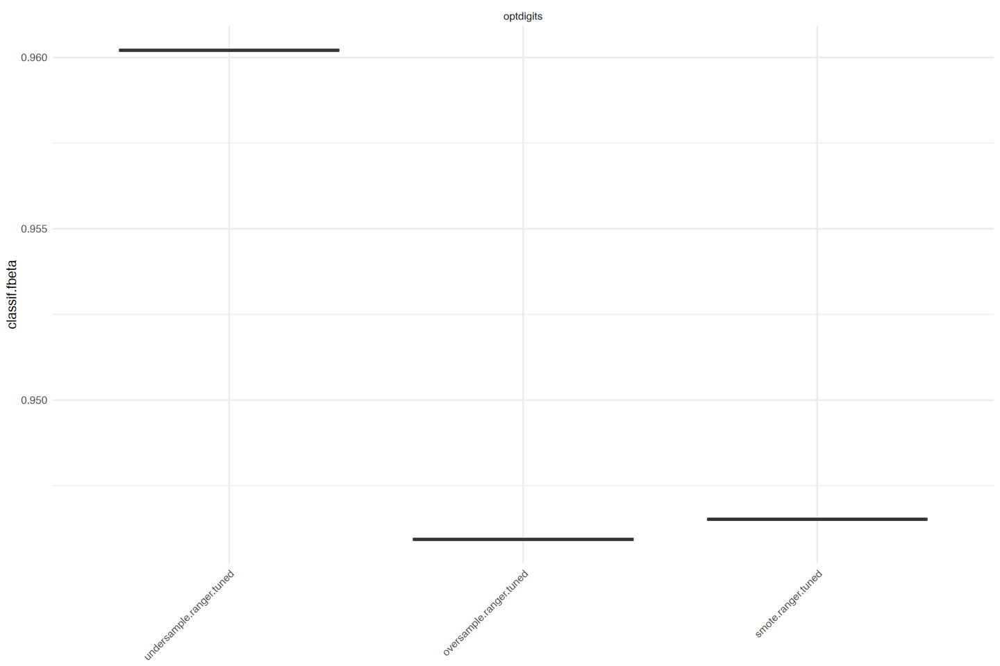
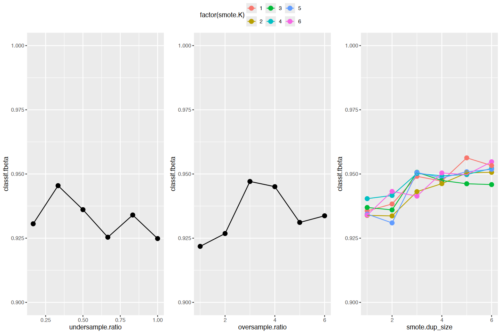

> - Cover Pic by [@Rafa](https://www.pixiv.net/artworks/131466322)  

> [Applied Machine Learning Using mlr3 in R](https://mlr3book.mlr-org.com/)
>
## 准备工作

- 使用网上的公开数据集

```r
library(mlr3verse)
library(mlr3learners)
library(OpenML)
set.seed(7832)
lgr::get_logger("mlr3")$set_threshold("warn")

ds <- listOMLDataSets(
 number.of.classes = 2,
 number.of.features = c(1, 100),
 number.of.instances = c(5000, 10000)
)
# select imbalanced data sets (without categorical features as SMOTE cannot handle them)
ds <- subset(
 ds, minority.class.size / number.of.instances < 0.2 &
 number.of.symbolic.features == 1
)

# pick one data set from list above
d <- getOMLDataSet(980)


data("optdigits", package = "mlr3data")
task <- as_task_classif(optdigits, target = "binaryclass", positive = "P")
```

## 数据轮廓

```r
pastecs::stat.desc(task$data())
```

<table class="dataframe">
<caption>A data.frame: 14 x 65</caption>
<thead>
 <tr><th></th><th scope=col>binaryclass</th><th scope=col>input1</th><th scope=col>input10</th><th scope=col>input11</th><th scope=col>input12</th><th scope=col>input13</th><th scope=col>input14</th><th scope=col>input15</th><th scope=col>input16</th><th scope=col>input17</th><th scope=col>...</th><th scope=col>input59</th><th scope=col>input6</th><th scope=col>input60</th><th scope=col>input61</th><th scope=col>input62</th><th scope=col>input63</th><th scope=col>input64</th><th scope=col>input7</th><th scope=col>input8</th><th scope=col>input9</th></tr>
 <tr><th></th><th scope=col>&lt;lgl&gt;</th><th scope=col>&lt;dbl&gt;</th><th scope=col>&lt;dbl&gt;</th><th scope=col>&lt;dbl&gt;</th><th scope=col>&lt;dbl&gt;</th><th scope=col>&lt;dbl&gt;</th><th scope=col>&lt;dbl&gt;</th><th scope=col>&lt;dbl&gt;</th><th scope=col>&lt;dbl&gt;</th><th scope=col>&lt;dbl&gt;</th><th scope=col>...</th><th scope=col>&lt;dbl&gt;</th><th scope=col>&lt;dbl&gt;</th><th scope=col>&lt;dbl&gt;</th><th scope=col>&lt;dbl&gt;</th><th scope=col>&lt;dbl&gt;</th><th scope=col>&lt;dbl&gt;</th><th scope=col>&lt;dbl&gt;</th><th scope=col>&lt;dbl&gt;</th><th scope=col>&lt;dbl&gt;</th><th scope=col>&lt;dbl&gt;</th></tr>
</thead>
<tbody>
 <tr><th scope=row>nbr.val</th><td>NA</td><td>5620</td><td>5.620000e+03</td><td>5.620000e+03</td><td>5.620000e+03</td><td>5.620000e+03</td><td>5.620000e+03</td><td>5.620000e+03</td><td>5.620000e+03</td><td>5.620000e+03</td><td>...</td><td>5.620000e+03</td><td>5.620000e+03</td><td>5.620000e+03</td><td>5.620000e+03</td><td>5.620000e+03</td><td>5.620000e+03</td><td>5.620000e+03</td><td>5.620000e+03</td><td>5.620000e+03</td><td>5.620000e+03</td></tr>
 <tr><th scope=row>nbr.null</th><td>NA</td><td>5620</td><td>3.228000e+03</td><td>5.020000e+02</td><td>5.300000e+01</td><td>2.170000e+02</td><td>1.111000e+03</td><td>3.652000e+03</td><td>5.429000e+03</td><td>5.607000e+03</td><td>...</td><td>1.288000e+03</td><td>1.611000e+03</td><td>2.250000e+02</td><td>3.940000e+02</td><td>1.494000e+03</td><td>3.714000e+03</td><td>5.303000e+03</td><td>4.277000e+03</td><td>5.458000e+03</td><td>5.610000e+03</td></tr>
 <tr><th scope=row>nbr.na</th><td>NA</td><td>   0</td><td>0.000000e+00</td><td>0.000000e+00</td><td>0.000000e+00</td><td>0.000000e+00</td><td>0.000000e+00</td><td>0.000000e+00</td><td>0.000000e+00</td><td>0.000000e+00</td><td>...</td><td>0.000000e+00</td><td>0.000000e+00</td><td>0.000000e+00</td><td>0.000000e+00</td><td>0.000000e+00</td><td>0.000000e+00</td><td>0.000000e+00</td><td>0.000000e+00</td><td>0.000000e+00</td><td>0.000000e+00</td></tr>
 <tr><th scope=row>min</th><td>NA</td><td>   0</td><td>0.000000e+00</td><td>0.000000e+00</td><td>0.000000e+00</td><td>0.000000e+00</td><td>0.000000e+00</td><td>0.000000e+00</td><td>0.000000e+00</td><td>0.000000e+00</td><td>...</td><td>0.000000e+00</td><td>0.000000e+00</td><td>0.000000e+00</td><td>0.000000e+00</td><td>0.000000e+00</td><td>0.000000e+00</td><td>0.000000e+00</td><td>0.000000e+00</td><td>0.000000e+00</td><td>0.000000e+00</td></tr>
 <tr><th scope=row>max</th><td>NA</td><td>   0</td><td>1.600000e+01</td><td>1.600000e+01</td><td>1.600000e+01</td><td>1.600000e+01</td><td>1.600000e+01</td><td>1.600000e+01</td><td>1.500000e+01</td><td>5.000000e+00</td><td>...</td><td>1.600000e+01</td><td>1.600000e+01</td><td>1.600000e+01</td><td>1.600000e+01</td><td>1.600000e+01</td><td>1.600000e+01</td><td>1.600000e+01</td><td>1.600000e+01</td><td>1.600000e+01</td><td>5.000000e+00</td></tr>
 <tr><th scope=row>range</th><td>NA</td><td>   0</td><td>1.600000e+01</td><td>1.600000e+01</td><td>1.600000e+01</td><td>1.600000e+01</td><td>1.600000e+01</td><td>1.600000e+01</td><td>1.500000e+01</td><td>5.000000e+00</td><td>...</td><td>1.600000e+01</td><td>1.600000e+01</td><td>1.600000e+01</td><td>1.600000e+01</td><td>1.600000e+01</td><td>1.600000e+01</td><td>1.600000e+01</td><td>1.600000e+01</td><td>1.600000e+01</td><td>5.000000e+00</td></tr>
 <tr><th scope=row>sum</th><td>NA</td><td>   0</td><td>1.107800e+04</td><td>5.909400e+04</td><td>6.631500e+04</td><td>5.909100e+04</td><td>4.640600e+04</td><td>1.172900e+04</td><td>7.750000e+02</td><td>2.400000e+01</td><td>...</td><td>3.237400e+04</td><td>3.143700e+04</td><td>6.738200e+04</td><td>6.503700e+04</td><td>3.777100e+04</td><td>1.176600e+04</td><td>1.428000e+03</td><td>7.752000e+03</td><td>7.770000e+02</td><td>1.800000e+01</td></tr>
 <tr><th scope=row>median</th><td>NA</td><td>   0</td><td>0.000000e+00</td><td>1.200000e+01</td><td>1.300000e+01</td><td>1.100000e+01</td><td>9.000000e+00</td><td>0.000000e+00</td><td>0.000000e+00</td><td>0.000000e+00</td><td>...</td><td>5.000000e+00</td><td>4.000000e+00</td><td>1.300000e+01</td><td>1.300000e+01</td><td>6.000000e+00</td><td>0.000000e+00</td><td>0.000000e+00</td><td>0.000000e+00</td><td>0.000000e+00</td><td>0.000000e+00</td></tr>
 <tr><th scope=row>mean</th><td>NA</td><td>   0</td><td>1.971174e+00</td><td>1.051495e+01</td><td>1.179982e+01</td><td>1.051441e+01</td><td>8.257295e+00</td><td>2.087011e+00</td><td>1.379004e-01</td><td>4.270463e-03</td><td>...</td><td>5.760498e+00</td><td>5.593772e+00</td><td>1.198968e+01</td><td>1.157242e+01</td><td>6.720819e+00</td><td>2.093594e+00</td><td>2.540925e-01</td><td>1.379359e+00</td><td>1.382562e-01</td><td>3.202847e-03</td></tr>
 <tr><th scope=row>SE.mean</th><td>NA</td><td>   0</td><td>4.133591e-02</td><td>7.244927e-02</td><td>5.339259e-02</td><td>6.387746e-02</td><td>7.967630e-02</td><td>5.228284e-02</td><td>1.254545e-02</td><td>1.400035e-03</td><td>...</td><td>6.697837e-02</td><td>7.511538e-02</td><td>5.799301e-02</td><td>6.637184e-02</td><td>7.757533e-02</td><td>5.399679e-02</td><td>1.892252e-02</td><td>4.477502e-02</td><td>1.396618e-02</td><td>1.206171e-03</td></tr>
 <tr><th scope=row>CI.mean</th><td>NA</td><td>   0</td><td>8.103436e-02</td><td>1.420285e-01</td><td>1.046701e-01</td><td>1.252245e-01</td><td>1.561963e-01</td><td>1.024946e-01</td><td>2.459392e-02</td><td>2.744609e-03</td><td>...</td><td>1.313035e-01</td><td>1.472552e-01</td><td>1.136887e-01</td><td>1.301145e-01</td><td>1.520776e-01</td><td>1.058546e-01</td><td>3.709545e-02</td><td>8.777633e-02</td><td>2.737911e-02</td><td>2.364561e-03</td></tr>
 <tr><th scope=row>var</th><td>NA</td><td>   0</td><td>9.602657e+00</td><td>2.949880e+01</td><td>1.602132e+01</td><td>2.293145e+01</td><td>3.567751e+01</td><td>1.536224e+01</td><td>8.845217e-01</td><td>1.101575e-02</td><td>...</td><td>2.521189e+01</td><td>3.170984e+01</td><td>1.890112e+01</td><td>2.475735e+01</td><td>3.382078e+01</td><td>1.638597e+01</td><td>2.012308e+00</td><td>1.126699e+01</td><td>1.096205e+00</td><td>8.176250e-03</td></tr>
 <tr><th scope=row>std.dev</th><td>NA</td><td>   0</td><td>3.098815e+00</td><td>5.431280e+00</td><td>4.002664e+00</td><td>4.788680e+00</td><td>5.973066e+00</td><td>3.919470e+00</td><td>9.404901e-01</td><td>1.049560e-01</td><td>...</td><td>5.021145e+00</td><td>5.631149e+00</td><td>4.347542e+00</td><td>4.975675e+00</td><td>5.815564e+00</td><td>4.047959e+00</td><td>1.418558e+00</td><td>3.356633e+00</td><td>1.046998e+00</td><td>9.042262e-02</td></tr>
 <tr><th scope=row>coef.var</th><td>NA</td><td> NaN</td><td>1.572066e+00</td><td>5.165294e-01</td><td>3.392139e-01</td><td>4.554396e-01</td><td>7.233683e-01</td><td>1.878031e+00</td><td>6.820070e+00</td><td>2.457719e+01</td><td>...</td><td>8.716511e-01</td><td>1.006682e+00</td><td>3.626070e-01</td><td>4.299598e-01</td><td>8.653059e-01</td><td>1.933497e+00</td><td>5.582841e+00</td><td>2.433473e+00</td><td>7.572881e+00</td><td>2.823195e+01</td></tr>
</tbody>
</table>

```r
table(task$truth())
```

```js
P    N 
 572 5048
```

## 不均衡数据的重采样

- 在`mlr3pipelines`中，有一个`class balancing`和一个`smote`管道操作符，  
- 可以与任何学习器结合使用
- 下面使用欠采样，过采样和SMOTE的`PipeOp`/`Graph`来控制类别不平衡的程度
- 将`PipeOp`/`Graph`应用于当前具有特定超参数值的`Task`，以观察类别平衡如何变化：

### 欠采样（undersampling）

- 对多类样本中重采样，减少多类样本数量

```r
# 欠采样
po_under <- po(
 # 管道类型
 "classbalancing",
 # 识别id
 id = "undersample", 
 # 调整类呗：结果保存在这里
 adjust = "major",
 # 参考类别：从这里抽
 reference = "major", 
 # 不对生成的任务中的行进行随机排列
 shuffle = FALSE, 
 # 减少比例
 ratio = 1 / 6
)
# reduce majority class by factor '1/ratio'
table(
 po_under$
  train(list(task))$
  output$
  truth()
)
```

```js
  P   N 
572 841 
```

### 过采样（oversampling）

- 对少类样本重采样，增加少类样本数量

```r
# oversample majority class (relative to majority class)
po_over <- po(
 "classbalancing",
 id = "oversample", 
 adjust = "minor",
 reference = "minor", 
 shuffle = FALSE, 
 ratio = 6
)
# enrich minority class by factor 'ratio'
table(
 po_over$
  train(list(task))$
  output$
  truth()
)
```

```js
   P    N 
3432 5048 
```

### SMOTE

- 分析数量较少类别的样本数据，  
  基于插值来为少数类合成新样本，并添加到数据集
- 原始的SMOTE算法只接受数值型特征
  - 因此在运行 SMOTE 之前需要对数据进行预处理，  
   将整数转换为数值型，之后再进行逆向转换

```r
# SMOTE enriches the minority class with synthetic data
gr_smote <- po(
 "colapply", 
 id = "int_to_num",
 applicator = as.numeric, 
 affect_columns = selector_type("integer")) %>>%
  po("smote", dup_size = 6) %>>%
  po(
   "colapply", 
   id = "num_to_int",
   applicator = function(x){
    as.integer(round(x, 0L))
   },
   affect_columns = selector_type("numeric")
)
# enrich minority class by factor (dup_size + 1)
table(
 gr_smote$
  train(task)[[1L]]$
  truth()
)
```

```js
   P    N 
4004 5048 
```

## 构建 `AutoTuner`

- 构建管道

```r
# 随机森林基础学习器
learner <- lrn("classif.ranger", num.trees = 50)

# 将3种不均衡重采样方法连接随机森林学习器
# 欠采样
learner_under <- as_learner(po_under %>>% learner)
learner_under$id <- "undersample.ranger"
# 过采样
learner_over <- as_learner(po_over %>>% learner)
learner_over$id <- "oversample.ranger"
# SMOTE
learner_smote <- as_learner(gr_smote %>>% learner)
learner_smote$id <- "smote.ranger"
```

- 定义搜索空间，以便调整类别不平衡方法的超参数

```r
# 对
search_space_under <- ps(undersample.ratio = p_dbl(1 / 6, 1))
search_space_over <- ps(oversample.ratio = p_dbl(1, 6))
search_space_smote <- ps(
 smote.dup_size = p_int(1, 6),
 smote.K = p_int(1, 6),
  # makes sure we use numbers to the power of two to better explore the parameter space
 .extra_trafo = function(x, param_set) {
  x$smote.K = round(2^(x$smote.K))
  x
 }
)
```

- 使用`auto_tuner()`构建`AutoTuner`
- 以基于3折交叉验证，使用`F-beta Score`作为性能指标来调整图
  - 为了降低运行时间，仅为不平衡校正方法定义搜索空间
  - 也可以通过使用学习器的超参数扩展搜索空间，  
   来联合调整学习器的超参数以及不平衡校正方法
- SMOTE有两个超参数`K`和`dup_size`
  - `K`会改变SMOTE算法的行为
  - `dup_size`将影响过采样率
- 为了关注过采样率对性能的影响，  
  本例中将把`K = 2`的SMOTE与`K = 4`的SMOTE视为不同的不平衡校正方法
- 因此，本例中对欠采样，过采样以及每种SMOTE变体使用  
  具有5种不同超参数配置的网格搜索进行调优

```r
inner_cv3 <- rsmp("cv", folds = 3)
measure <- msr("classif.fbeta")

learns <- list(
 auto_tuner(
  tuner = tnr("grid_search", resolution = 6),
  learner = learner_under,
  resampling = inner_cv3,
  measure = measure,
  search_space = search_space_under
 ),
 auto_tuner(
     tuner = tnr("grid_search", resolution = 6),
     learner = learner_over,
     resampling = inner_cv3,
     measure = measure,
     search_space = search_space_over
 ),
 auto_tuner(
     tuner = tnr("grid_search", resolution = 6),
     learner = learner_smote,
     resampling = inner_cv3,
     measure = measure,
     search_space = search_space_smote
 )
)
```

## Benchmark测试

- `AutoTuner` 是一个经过完全调优的 `Graph`，其行为类似于普通的学习器
- 本例调优时使用3折CV
- 我们使用 `benchmark()` 函数，  
  基于留出法进行外部评估，来比较经过调优的类别不平衡流水线图：

```r
outer_holdout <- rsmp("holdout")
design <- benchmark_grid(
 tasks = task,
 learners = learns,
 resamplings = outer_holdout
)
print(design)
```

```js
        task                  learner resampling
      <char>                   <char>     <char>
1: optdigits undersample.ranger.tuned    holdout
2: optdigits  oversample.ranger.tuned    holdout
3: optdigits       smote.ranger.tuned    holdout
```

```r
lgr::get_logger("bbotk")$
 set_threshold("warn")
bmr <- benchmark(design, store_models = TRUE)
```

## 可视化benchmark测试结果

```r
bmr$aggregate(measure)
autoplot(bmr, measure = measure)
```

<table class="dataframe">
<caption>A bmr_aggregate: 3 x 7</caption>
<thead>
 <tr><th scope=col>nr</th><th scope=col>resample_result</th><th scope=col>task_id</th><th scope=col>learner_id</th><th scope=col>resampling_id</th><th scope=col>iters</th><th scope=col>classif.fbeta</th></tr>
 <tr><th scope=col>&lt;int&gt;</th><th scope=col>&lt;list&gt;</th><th scope=col>&lt;chr&gt;</th><th scope=col>&lt;chr&gt;</th><th scope=col>&lt;chr&gt;</th><th scope=col>&lt;int&gt;</th><th scope=col>&lt;dbl&gt;</th></tr>
</thead>
<tbody>
 <tr><td>1</td><td>&lt;environment: 0x171203760&gt;</td><td>optdigits</td><td>undersample.ranger.tuned</td><td>holdout</td><td>1</td><td>0.9602122</td></tr>
 <tr><td>2</td><td>&lt;environment: 0x1711e4030&gt;</td><td>optdigits</td><td>oversample.ranger.tuned </td><td>holdout</td><td>1</td><td>0.9459459</td></tr>
 <tr><td>3</td><td>&lt;environment: 0x1711c8298&gt;</td><td>optdigits</td><td><span style=white-space:pre-wrap>smote.ranger.tuned      </span></td><td>holdout</td><td>1</td><td>0.9465241</td></tr>
</tbody>
</table>



## 可视化调优路径

- 当``store_models = TRUE``时，  
  允许 `benchmark()` 函数存储调优过程中计算出的每个模型
- 因此可以绘制子采样迭代中最优学习器的调优路径：

```r
# 加载绘图R包
library(ggplot2)

# 提取所有的模型
bmr_data_learners <- as.data.table(bmr)$learner

# 欠采样
utune_path <- bmr_data_learners[[1]]$
 model$
 tuning_instance$
 archive$
 data
utune_gg <- ggplot(
 utune_path, 
 aes(
  x = undersample.ratio, 
  y = classif.fbeta
 )
) +
  geom_point(size = 3) +
  geom_line() + ylim(0.9, 1)

# 过采样
otune_path <- bmr_data_learners[[2]]$
 model$
 tuning_instance$
 archive$
 data
otune_gg <- ggplot(
 otune_path, 
 aes(
  x = oversample.ratio, 
  y = classif.fbeta
 )
) +
  geom_point(size = 3) +
  geom_line() + ylim(0.9, 1)

# SMOTE
stune_path <- bmr_data_learners[[3]]$
 model$
 tuning_instance$
 archive$
 data
stune_gg <- ggplot(
 stune_path, 
 aes(
  x = smote.dup_size,
  y = classif.fbeta, 
  col = factor(smote.K)
 )
) +
  geom_point(size = 3) +
  geom_line() + ylim(0.9, 1)

# 合并图像
library(ggpubr)
ggarrange(utune_gg, otune_gg, stune_gg, common.legend = TRUE, nrow = 1)
```


