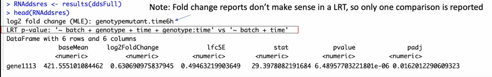

> - Cover Pic by [@Rvoid_0](https://www.pixiv.net/artworks/129206493)

> 内容来自[DnA lab short read sequencing workshop-Multifactor Designs in DESeq2](https://www.youtube.com/watch?v=X6p3E-QTcUc)以及个人的额外补充

## 交互作用

### 2X2设计

#### 设计矩阵

- 这里的实验设计， `~ Genotype + Treatment + Genotype:Treatment`
- 其中
  - Genotype：1，2
  - Treatment：Control，Treatment
  - 原视频中首字母都是小写，为了看的更清晰我改成了首字母大写
  - 在读取meta data之后，要factor一下，并且按照对比的顺序设定levels
- 查看研究设计矩阵的代码

```r
model.matrix(~ Genotype + Treatment + Genotype:Treatment, data = meta_dt)
```


- 图形直观查看设计矩阵
  - 输出的是图片，内容大致如下

```r
vd <- ExploreModelMatrix::VisualizeDesign(sampleData = colData(dds), 
                      designFormula = ~ Genotype + Treatment + Genotype:Treatment)
vd$plot
```

<table class="dataframe">
<caption>A tibble: 2 x 3</caption>
<thead>
 <tr><th scope=col>Genotype</th><th scope=col>Con</th><th scope=col>Treatment</th></tr>
 <tr><th scope=col>&lt;dbl&gt;</th><th scope=col>&lt;chr&gt;</th><th scope=col>&lt;chr&gt;</th></tr>
</thead>
<tbody>
 <tr><td>1</td><td>(Intercept) +
 Time8h</td><td>(Intercept) +
 TreatmentTreatment +
 Genotype2.TreatmentTreatment</td></tr>
 <tr><td>2</td><td>(Intercept)           </td><td>(Intercept) +
 TreatmentTreatment                                  </td></tr>
</tbody>
</table>


- 解释
  - Genotype 1 Control：对照
  - Genotype 2 Treatment：Genotype 1接受处理；
    - 与Genotype 1 Control的差值，为蓝色箭头
      - 表示在经过处理后，与Genotype 1 Control的差值
  - Genotype 2 Control：Genotype 2型的对照；
    - 与Genotype 1 Control的差值，为红色箭头
      - 表示在未经过任何处理，单纯由于genotype影响的情况
  - Genotype 2 Treatment：Genotype 2型接受处理；
    - 与Genotype 2 Control的差值，为深蓝色箭头
      - 表示在经过处理后，与Genotype 2 Control的差值
    - 如果不存在交互作用，那么它和Genotype 2 Control的差值理应相同，
    即差值为蓝色箭头
    - 交互作用，即**实际的差值和理论的差值的差**
      - 检验交互作用，就是**实际的差值和理论的差值的差是否为0**
      - 即，**深蓝色箭头（实际）-蓝色箭头（理论）是否为0**

#### contrast参数中的项名

- `contrast`中的项名不是自定义的，而是根据矩阵生成的
- 通过`resultsNames()`查看所有的项名

```r
resultsNames(dds)
```

#### 对交互作用的检验

- 直接对交互项检验即可
  - 这里是和`~1`比的
  - `~1`就是截距项，  
   就是和Genotype 1 Control进行差值对比，  
   检验上述交互项代表的实际与理论差值是否为0

```r
results(dds, contrast = c("Genotype2.TreatmentTreatment"))
```

#### 对Genotype 2实际效果的验证

- 交互项 = 实际 - 理论，  
  那么简单的等式移项就可以得到，实际 = 交互 + 理论
- 对Genotype 2实际效果，即为深蓝色箭头

```r
results(dds, contrast = list(c("Treatment_Treatment_vs_Control","Genotype2.TreatmentTreatment")))
```

- 这里最终可以看到
  - 第一行中的公式中出现了加号
  - 即最终的取值是list中的向量包含的两个项的和
  - list中最多包含两个向量
    - 第一个向量是比较项
    - 第二个向量是被比较项
    - 当没有输入第二个向量的时候，即为与`~1`截距项比较


### Con，A，B，A+B设计

#### 设计矩阵

- meta data格式


- 实验设计， `~ Treatment1 + Treatment2 + Treatment1:Treatment2`

## 更复杂的实验设计

### 2组X多时间节点

- 2种细胞（Control，Mutant） 在4个时间点（0，6，12，24h）的基因表达


- 分析思路
  - 时间点两两比较
    - 6h vs 0h
    - 12h vs 0h
    - 24h vs 0h
    - 12h vs 6h
    - 24h vs 12h
    - 24h vs 12h
    - 问题
      - 没有充分利用时间序列的信息，得到的结果不全面
  - 充分利用时间序列的本质，跨越全部时间段进行多组比较
    - 在本例中，2种**对比设计**（用以区别实验设计）
      - 简化版模型：不考虑细胞种类的影响
      - 全面版模型：考虑细胞种类的影响

### 对比设计

- 首先得判断是否有必要使用全面版模型，因此需要做一个简单对比
- 在`DESeqDataSetFromMatrix()`中还是要填写完整的实验设计
  - `~ Batch + Genotype + Time + Genotype:Time`

```r
dds <- DESeqDataSetFromMatrix(
 countData = countMatrix,
 colData = metaData,
 design = ~ Batch + Genotype + Time + Genotype:Time)
```

- 由于存在多levels的比较，  
  正如t检验用于双样本，ANOVA适用于多样本一样，  
  Wald检验用于双样本，而LRT用于多样本
  - `test = "wald`是默认的，改用LRT需要声明一下
  - 要注意：`reduced`中填写**简化后**保留的变量，而并非要剔除的变量s

#### 简化版模型

```r
dds_full <- DESeq(dds, test = "LRT", reduced = ~ Batch + Time)
```



- 结果中的`baseMean`，`log2FoldChange`等结果均无实际意义
- 这里主要关注的是统计量`stat`以及p值`pval`

## 原视频

<iframe width="100%" height="468" src="https://www.youtube.com/embed/X6p3E-QTcUc" title="Multifactor Designs in DESeq2" frameborder="0" allow="accelerometer; autoplay; clipboard-write; encrypted-media; gyroscope; picture-in-picture; web-share" allowfullscreen></iframe>
