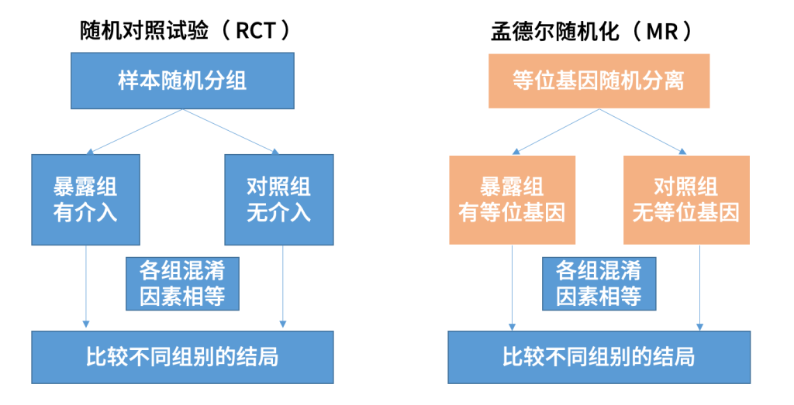
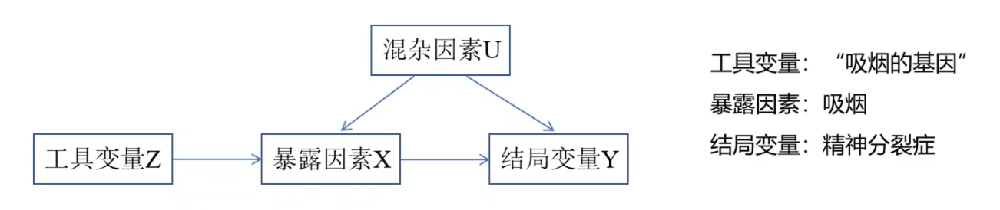
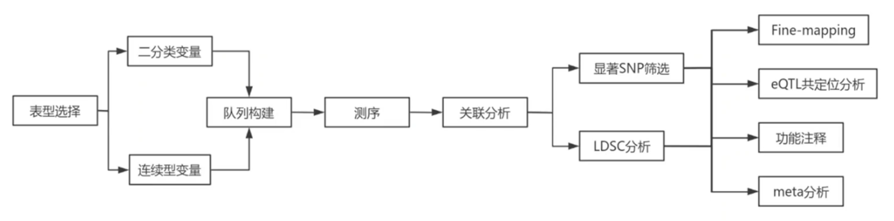
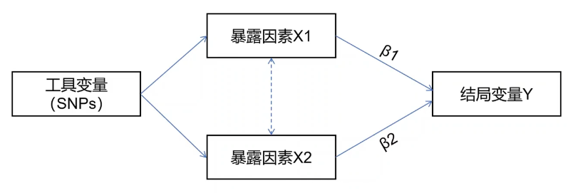
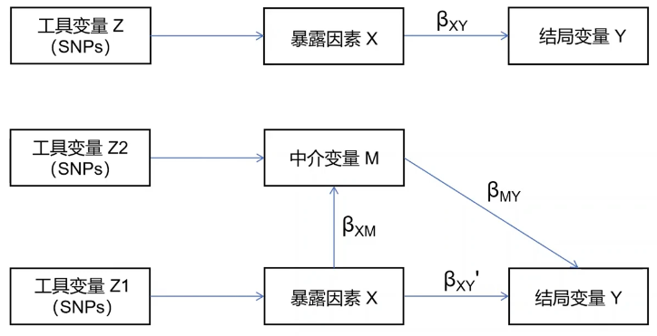
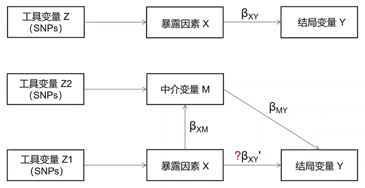

> - Cover Pic by [@笠木梨Ceey](https://www.pixiv.net/artworks/129969798)

## 参考

> [Mendelian randomization with GWAS summary data](https://mrcieu.github.io/TwoSampleMR/index.html)
> [Mendelian Randomization Tutorial](https://andrewslabucsf.github.io/MR-tutorial/)
> [【bilibili】2022.05孟德尔随机化操作](https://www.bilibili.com/video/BV1LV4y1b7v5/?spm_id_from=333.337.search-card.all.click&vd_source=81a4751dfe3d7ad0a41ae3e1e47211cf)
> [【bilibili】孟德尔随机化傻瓜教程之概念介绍](https://www.bilibili.com/video/BV1bUHVePE3K/?spm_id_from=333.337.search-card.all.click&vd_source=81a4751dfe3d7ad0a41ae3e1e47211cf)
> [【bilibili】孟德尔随机化 - 从入门到实践 | 自学 | 小白 | 代码 | 原理](https://www.bilibili.com/video/BV1Xm411k7ug/?spm_id_from=333.337.search-card.all.click&vd_source=81a4751dfe3d7ad0a41ae3e1e47211cf)
> [知乎专栏-孟德尔随机化研究](https://zhuanlan.zhihu.com/c_1230814311636668416)
> [孟德尔随机化系列之一：基础概念 Mendelian randomization I](https://gwaslab.org/2021/06/24/mr/)
> [孟德尔随机化系列之二：两样本MR – TwoSampleMR](https://gwaslab.org/2021/11/14/twosamplemr/)

## ------ 理论部分 ------

## 孟德尔随机化的原理基础

### 简介

- 排除内生性因素的干扰，确定暴露（等位基因有无）与结局是否存在因果关系


> [【bilibili】孟德尔随机化傻瓜教程之概念介绍](https://www.bilibili.com/video/BV1bUHVePE3K/?spm_id_from=333.337.search-card.all.click&vd_source=81a4751dfe3d7ad0a41ae3e1e47211cf)


- **暴露因素**  
  影响结局的任何因素或特征,可以是内部因素的的也可以是外部因素的,内部因素比如外貌、体型等生物学特征,外部因素比如饮酒、吸烟等生生活方式或一些环境因素等
- **结局变量**  
  结局是与研究的问题相关的一个定量或定性的拍旨标,如肾小球滤过率水平、糖尿病等
- **混杂因素**  
  同时影响着暴露与结局的其他因素。
- **反向因果**  
  当暴露与结果之间的关联不是由于暴露导致结果果变化,而是由于结果导致暴露变化时,则发生反向因果关系。

### GWAS



### 工具变量

- 调节 **工具变量（instrumental variables, IV）** 的影响
  - 定义
    - 与X相关
    - 与被忽略的混淆因素无关
    - 与Y无关
  - 变异基因Z
    - 与暴露因素X相关
    - 与Y没有直接因果关系
    - 变异基因Z与结果Y相关，只能通过X对Y的因果关系被观察到

### 工具变量的假设

#### 假设

1. 相关性假设：工具变量与暴露密切相关
2. 独立性假设：工具变量与任何影响暴露-结局关联的混杂因素均不相关
3. 排他性假设：除非借助与暴露的关联，否则工具变量不会影响结局
4. MR：工具变量（基因位点）之间是相互独立的

#### 违反假设的机制

- 生物学机制
  - 多效性（pleiotropy）
  - 渠化（canalization）
- 非孟德尔式遗传
  - 连锁不平衡（linkage disequilibrium, LD）
    - 指分属两个或两个以上基因座位的等位基因同时出现在一条染色体上的几率，  
    高于随机出现的频率
    - 只要两个基因不是完全独立地遗传，就会表现出某种程度的连锁
  - 效应修正（effect modification）
- 群体效应（population effects）
  - 人群分层（population stratification）
  - 确定性效应（ascertainment effect）

#### 工具变量的挑选

- 首先确定和暴露有相关性的工具变量
- 再确定挑选的工具变量与结局是不相关的，相关的工具变量需要剔除（假设3）

### 二阶最小二乘法（two-stage least squares，2SLS）

- 第一阶段回归：遗传IV对暴露的回归
  - 计算暴露在IV上的拟合值
- 第二阶段回归：第一阶段暴露的拟合值对结局的回归
  - 因果估计的效应量就是是该第二阶段的回归系数，  
   用于反映由于暴露量单位变化而导致的结局变化
  - 对于单个IV：  
    2SLS估计与比率估计（Wald ratio estimation）相同
  - 对于多个IV：  
    2SLS估计量可以看作是单个工具变量计算出的比率估计值的加权平均值，  
    其中权重由第一阶段回归中工具变量的相对强度确定
- 假设
  - $k$个工具变量，下标 $i = 1,2,...$
  - 总人数$N$，下标 $k = 1,2,...$
  - 每个个体暴露值 $X_i$ ，结局 $Y_i$
  - 假定每个工具变量遵循加性模型，$g_{ik}$ 为第 $i$ 个个体在第 $k$ 个工具变量上的基因型
- 第一阶段回归
  - 构建工具变量对X的线性回归模型

$$
x_{i}= \alpha_{0}+ \sum\limits_k\alpha_kg_{ik} + \epsilon_{X_{i}}
$$

- 因此拟合值 $\hat{x}_i$ 有
  - 其实无非就是用工具变量对变量X进行调整而已

$$
\hat{x}_{i}= \hat{\alpha}_{0}+ \sum\limits_k\hat{\alpha}_kg_{ik}
$$

- 第二阶段回归

$$
y_{i}= \beta_{0}+ \beta_1\hat{x}_{i}+ \epsilon
_{Y_i}
$$

- 在等式中的误差项的方差齐性下

$$
y_{i}= \beta_{0}+ \beta_1x_{i}+ \epsilon^{'}_{Y_i}
$$

- 2SLS估计量的渐近方程

$$
\hat{\sigma}^2(X^TG(G^TG)^{-1}G^TX)^{-1}=\hat{\sigma}^2(\hat{X}^T\hat{x})
^{-1}
$$

## 孟德尔随机化种类

### 双样本孟德尔随机化

- 最基础的孟德尔随机化方法

### 双向孟德尔随机化

- 将双样本孟德尔随机化的暴露-结局颠倒，重新做一次

### 多变量孟德尔随机化

#### 基本概念

- 多种暴露相关的遗传变异来估计没中暴露和单一结局之间的因果关系
- 使用条件
  - 很难找到SNP只与一种暴露因素相关，但可以找到SNP与一些相互关联的暴露因素相关
  - 与暴露相关的SNP中有很多斗鱼某个或者某几个混杂因素相关
- 工具变量的SNP至少与一种暴露因素相关

> [【bilibili】一个视频让你学会多变量孟德尔随机化实操！](https://www.bilibili.com/video/BV1NM4JeWEmf/)


#### 多效性

- 一个SNP与多种表型相关
  - 垂直多效性：SNP与一种表型相关，继而影响另一种表型
  - 水平多效性：SNP与两种或多种表型独立相关
- 在双样本孟德尔随机化（单变量）分析中，出现SNP具有潜在的水平多效性时，  
  多变量孟德尔随机化可以对其进行调整，并将该表型作为额外暴露进行分析

### 中介孟德尔随机化

#### 基本概念

- 评估一个中介变量在暴露因素和结局之间的中介作用
- 成立假设
  - 每个变量之间没有混杂因素
  - 暴露不会造成额外的混杂因素
  - 暴露和中介之间没有相互作用

#### 多变量中介孟德尔随机化

1. 计算**暴露与结局**双样本孟德尔随机化，得到总效应$\beta_{XY}$
2. 计算**暴露与中介**双样本孟德尔随机化，得到总效应$\beta_{XM}$
3. 计算**暴露+中介与结局**双样本孟德尔随机化，得到调整后的$\beta_{XY}'$和$\beta_{MY}$
4. 计算

- 中介效应：$a = \beta_{XM} \beta_{MY}$
- 中介占比：$b = \frac{a}{\beta_{XY}}$

 > [【bilibili】一节课学会中介孟德尔随机化实操!生信小白快来!!!](https://www.bilibili.com/video/BV1vYtTerEd6)


#### 分步双样本孟德尔随机化

- 适用于暴露到结局的直接效应是不知道的情况
- 多变量中介孟德尔随机化的结果中中介效应不显著可以用这个
- 多变量中介孟德尔随机化中，**暴露和中介没有相同的工具变量时**只能用这个

1. 分别进行3次孟德尔随机化

- 计算**暴露与结局**双样本孟德尔随机化，得到总效应$\beta_{XY}$
- 计算**暴露与中介**双样本孟德尔随机化，得到总效应$\beta_{XM}$
- 计算**中介与结局**双样本孟德尔随机化，得到总效应$\beta_{MY}$

2. 计算

- 中介效应：$a = \beta_{XM} \beta_{MY}$
- 直接效应：$\beta_{XY}' = \beta_{XY} - \beta_{XM} \beta_{MY}$
- 中介占比：$b = \frac{a}{\beta_{XY}}$

 > [【bilibili】一节课学会中介孟德尔随机化实操!生信小白快来!!!](https://www.bilibili.com/video/BV1vYtTerEd6)


#### 系数乘积检验法

- 检验 $a = \beta_{XM} \beta_{MY}$ 是否具有显著性
  - 通过查看 $a$ 的95%置信区间是否跨0确定
- 计算标准误差：$S_{M}= \sqrt{\beta_{SM}^{2} S_{XM}^{2}+\beta_{MY}^{2} S_{MY}^{2}}$
- 用$S_M$计算95%置信区间
- 计算统计量Z：$Z = \frac{a}{S_{M}}$

## 数据

### GWAS数据库

1. PGC ([https://www.med.unc.edu/pgc/](https://www.med.unc.edu/pgc/))：精神病学的基因组学
2. SSGAC ([https://www.thessgac.org/](https://www.thessgac.org/))：社会科学的基因组学
3. CTG ([https://ctg.cncr.nl/software/summary_statistics](https://ctg.cncr.nl/software/summary_statistics))
4. IEU ([https://gwas.mrcieu.ac.uk/](https://gwas.mrcieu.ac.uk/))
5. GWAS Catalog (<https://www.ebi.ac.uk/gwas/>)

### IEU OpenGWAS project API

- 使用前需要在[IEU OpenGWAS project](https://api.opengwas.io/profile/)注册API `<token>`
- 将获取到的API写在`.RENVIRON`文件中，位置一般在`home`(~)下，没有就vim创建
- 添加`OPENGWAS_JWT=<token>`
- 初始的Trial等级：100 per 10 minutes，  
  填写完个人信息后可以变成Standard等级：100000 per 10 minutes

### 注意点

- 大部分GWAS数据来源于欧洲样本
- 暴露和结局的样本群体至少为**同一人种**
- 双样本MR的暴露于结局数据不存在或存在少量可接受范围内的样本重叠（**样本独立性**）

### 数据构成

- 不同的数据的标签是不一样的
  - SNP id (rs...)：单核苷酸多态性id
  - Effect allele; Alternative allele：效应位点
  - Other allele; Reference allele：非效应位点
  - Effect，Beta，b，OR（对于二分类变量，$\beta = \text{ln}(OR)$）：  
   回归系数，表示效应位点对结局的正负影响
  - Se：标准误差
  - EAF：效应等位基因频率
  - P：关联性的p值

### 工具变量的获取

- GWAS原文
- 已经发表的MR文章中获取
- R program提取

## 分析流程

 1. 获取暴露与结局的GWAS数据
 2. 选择工具变量
 3. 去除连锁不平衡
 4. 数据协同
 5. MR分析
 6. 敏感性分析：评价分析结果的稳健性

- 异质性检验
  - 检验暴露和结局的样本是否存在异质性
  - 当存在异质性时，应该剔除导致偏移的SNP
  - 但是对于IVW的MR主要检验方法而言是可以接受的
- 多效性检验
  - 检验SNP是否对多种遗传性状产生影响

 1. 结果可视化

## ------ 实操部分 ------

## 数据来源及分析流程

- 随便找的3个GWAS数据
  - 暴露X：1型糖尿病，GCST90475661
  - 中介M：CKD，GCST90478532
  - 结局Y：FGF23，GCST90469223

## 导入包

```r
library(MendelianRandomization)
library(TwoSampleMR)
library(readr)
library(tidyverse)
```

## 读取数据

- `TwoSampleMR`包只有IEU的API，实际上下载到本地的情况肯定会更多

```r
# DM1: x
x <- read_tsv('Data/DM1/GCST90475661.tsv')
# FGF23: m
m <- read_tsv('Data/FGF23/GCST90469223.tsv')
# CKD: y
y <- read_tsv('Data/CKD/GCST90478532.tsv')
```

- 随便看看

```r
head(x,3); head(m, 3); head(y, 3)
```

## 预处理

### Odds Ratio转换beta

```r
calcuBeta <- function(x){
    x <- x %>%
        mutate(
            beta = log(odds_ratio),
            standard_error = (ci_upper - ci_lower)/(qnorm(0.95)*2)
        ) %>%
    return(x)
}
```

```r
x <- calcuBeta(x)
y <- calcuBeta(y)
```

### 格式整理

- 编一个函数，后面看的清楚
- 也可以跳过直接调用`format_data()`

```r
fmt_data <- function(
        x, 
        type = 'exposure',
        snp_col = 'rsid'
    ){

    args <- list(
        dat = x,
        beta_col = 'beta',
        pval_col = 'p_value',
        se_col = 'standard_error',
        eaf_col = 'effect_allele_frequency',
        effect_allele_col = 'effect_allele',
        other_allele_col = 'other_allele',
        type = type,
        snp_col = snp_col
    )
    
    formatted <- do.call(format_data, args)
    return(formatted)

}
```

- 格式整理

```r
x_fmt <- fmt_data(
    x,
 type = 'exposure'
)

m.exp_fmt <- fmt_data(
    m,
    type = 'exposure',
    snp_col = "rs_id"
)

m.oc_fmt <- fmt_data(
    m,
    type = 'outcome',
    snp_col = "rs_id"
)

y_fmt <- fmt_data(
    y,
 type = 'outcome'
)
```

- 简单查看结果

```r
head(x_fmt); head(m.exp_fmt); head(m.oc_fmt); head(y_fmt)
```

### ID重命名便于区分

```r
x_fmt$exposure <- 'x'
m.exp_fmt$exposure <- 'm'
m.oc_fmt$outcome <- 'm'
y_fmt$outcome <- 'y'
```

### 筛选SNP

- 如果GWAS只用一次的话，**筛选SNP**可以放在**格式整理**之前
- 如果以后可能作为结局数据使用的话，可以先**格式整理**好，  
  因为结局是**不可以筛选**SNP的

```r
x_filted <- subset(x_fmt, pval.exposure  < 5e-06)
m.exp_filted <- subset(m.exp_fmt, pval.exposure  < 5e-06)
```

## 去除连锁不平衡

### 去除部分

- 编一个函数，也可以直接调用`ieugwasr::ld_clump()`
- 这里是本地去除连锁不平衡的方法

```r
ldClump <- function(
        x,
        clump_kb = 10000,
        clump_r2 = 0.001,
        clump_p = 1,
        pop = 'EUR',
        bfile = 'Data/1kg.v3/EUR', 
        plink_bin = plinkbinr::get_plink_exe()
    ){
    clumped <- ieugwasr::ld_clump(
        dplyr::tibble(
            rsid = x$SNP,
            pval = x$pval.exposure
        ),
        clump_kb = clump_kb,
        clump_r2 = clump_r2,
        clump_p = clump_p,
        pop = pop,
        bfile = bfile, 
        plink_bin = plink_bin
    )
    return(clumped)
}
```

```r
x_clumped <- ldClump(x_filted)
m.exp_clumped <- ldClump(m.exp_filted)
```

### 保留去除后的结果

```r
x_pick <- semi_join(x_filted, x_clumped, by = c("SNP" = "rsid"))
m.exp_pick <- semi_join(m.exp_filted, m.exp_clumped, by = c("SNP" = "rsid"))
```

## 双样本孟德尔随机化

### X to Y

```r
y4x_pick <- semi_join(y_fmt, x_clumped, by = c("SNP" = "rsid"))
```

```r
harmo_x2y <- harmonise_data(x_pick, y4x_pick)
res_mr_x2y <- mr(harmo_x2y)
```

```r
res_mr_x2y
```

### X to M

```r
m4x_pick <- semi_join(m.oc_fmt, x_clumped, by = c("SNP" = "rsid"))
```

```r
harmo_x2m <- harmonise_data(x_pick, m4x_pick)
res_mr_x2m <- mr(harmo_x2m)
```

```r
res_mr_x2m
```

### M to Y

```r
y4m_pick <- semi_join(y_fmt, m.exp_clumped, by = c("SNP" = "rsid"))
```

```r
harmo_m2y <- harmonise_data(m.exp_pick, y4m_pick)
res_mr_m2y <- mr(harmo_m2y)
```

```r
res_mr_m2y
```

## 多变量孟德尔随机化

### 去除合并X和M的连锁不平衡

- 合并

```r
xm_pick <- bind_rows(x_pick, m.exp_pick)
xm_pick <- subset(xm_pick, SNP %in% unique(xm_pick$SNP))
```

- 去除连锁不平衡

```r
xm_pick_clumped <- ldClump(xm_pick)
xm_pick_clumped
```

- 将去除连锁不平衡的筛选结果初步保存

```r
y4xm_pick <- semi_join(y_fmt, xm_pick_clumped, by = c("SNP" = "rsid")) %>% 
    distinct(SNP, .keep_all = T)
x4xm_pick <- semi_join(x_fmt, xm_pick_clumped, by = c("SNP" = "rsid")) %>% 
    distinct(SNP, .keep_all = T) 
m.exp4xm_pick <- semi_join(m.exp_fmt, xm_pick_clumped, by = c("SNP" = "rsid")) %>% 
    distinct(SNP, .keep_all = T)
```

- 为了确保选择的SNP一样，取一个交集重新筛选一遍

```r
common_snp <- y4xm_pick %>%
    inner_join(x4xm_pick, by = 'SNP') %>%
    inner_join(m.exp4xm_pick, by = 'SNP') %>%
    select(SNP)

y4xm_pick <- semi_join(y_fmt, common_snp, by = 'SNP') %>% 
    distinct(SNP, .keep_all = T)
x4xm_pick <- semi_join(x_fmt, common_snp, by = 'SNP') %>% 
    distinct(SNP, .keep_all = T) 
m.exp4xm_pick <- semi_join(m.exp4xm_pick, common_snp, by = 'SNP') %>% 
    distinct(SNP, .keep_all = T)
```

### 协同数据

```r
harmo_x4xm <- harmonise_data(x4xm_pick, y4xm_pick)
harmo_m.exp4xm <- harmonise_data(m.exp4xm_pick, y4xm_pick)
```

### 转换成MendelianRandomization包的输入格式

- 转换输入的数据

```r
xm2y_input <- mr_mvinput(
    bx = cbind(harmo_x4xm$beta.exposure, harmo_m.exp4xm$beta.exposure),
    bxse = cbind(harmo_x4xm$se.exposure, harmo_m.exp4xm$se.exposure),
    by = y4xm_pick$beta.outcome,
    byse = y4xm_pick$se.outcome
)
```

- 确保数据长度一致，不然后续分析会报错

```r
glimpse(xm2y_input)
```

### Multivariable MR-Egger method

```r
res_xm2y_egger <- mr_mvegger(xm2y_input)
res_xm2y_egger
```

### Multivariable inverse-variance weighted method

```r
res_xm2y_ivwme <- mr_mvivwme(xm2y_input)
res_xm2y_ivwme
```

### Multivariable median-based method

```r
res_xm2y_median <- mr_mvmedian(xm2y_input)
res_xm2y_median
```

### Multivariable inverse-variance weighted method with measurement error

```r
res_xm2y_median <- mr_mvmedian(xm2y_input)
res_xm2y_median
```

## Mediation Mendelian Randomization

- 简单回顾上系数计算及检验的方法
- 多变量法

 1. 计算**暴露与结局**双样本孟德尔随机化，得到总效应$\beta_{XY}$
 2. 计算**暴露与中介**双样本孟德尔随机化，得到总效应$\beta_{XM}$
 3. 计算**暴露+中介与结局**双样本孟德尔随机化，得到调整后的$\beta_{XY}'$和$\beta_{MY}$
 4. 计算

- 中介效应：$a = \beta_{XM} \beta_{MY}$
- 中介占比：$b = \frac{a}{\beta_{XY}}$
- 分步法

 1. 分别进行3次孟德尔随机化

- 计算**暴露与结局**双样本孟德尔随机化，得到总效应$\beta_{XY}$
- 计算**暴露与中介**双样本孟德尔随机化，得到总效应$\beta_{XM}$
- 计算**中介与结局**双样本孟德尔随机化，得到总效应$\beta_{MY}$

 2. 计算

- 中介效应：$a = \beta_{XM} \beta_{MY}$
- 直接效应：$\beta_{XY}' = \beta_{XY} - \beta_{XM} \beta_{MY}$
- 中介占比：$b = \frac{a}{\beta_{XY}}$
- 系数检验
  - 检验 $a = \beta_{XM} \beta_{MY}$ 是否具有显著性
    - 通过查看 $a$ 的95%置信区间是否跨0确定
  - 计算标准误差：$S_{M}= \sqrt{\beta_{SM}^{2} S_{XM}^{2}+\beta_{MY}^{2} S_{MY}^{2}}$
  - 用$S_M$计算95%置信区间
  - 计算统计量Z：$Z = \frac{a}{S_{M}}$

### 多变量法

#### Beta

```r
(betaXY_mvm <- res_mr_x2y[3,7])
(betaXM_mvm <- res_mr_x2m[3,7])
# 唯一的区别就在这里：是否用多变量调整过的中介-结局
(betaMY_mvm <- res_xm2y_ivwme@Estimate[2]) 
(a_mvm <- betaXM_mvm * betaMY_mvm)
(b_mvm <- a_mvm / betaXY_mvm)
(direct_mvm <- 1 - b_mvm)
```

#### SE

```r
(seXM_mvm = res_mr_x2m[3,8])
(seMY_mvm = res_xm2y_ivwme@StdError[2])
```

#### P value

```r
(S_mvm = sqrt(betaXM_mvm^2*seXM_mvm^2+betaMY_mvm^2*seMY_mvm^2))
(Z_mvm = a_mvm / S_mvm)
(P_mvm = 2 * pnorm(q = abs(Z_mvm), lower.tail = F))
```

#### CI

```r
(a_mvm_lower <- a_mvm - S_mvm)
(a_mvm_upper = a_mvm + S_mvm)
(b_mvm_lower = a_mvm_lower/betaXY_mvm) 
(b_mvm_upper = a_mvm_upper/betaXY_mvm) 
```

### 分步法

#### Beta

```r
(betaXY_2step <- res_mr_x2y[3,7])
(betaXM_2step <- res_mr_x2m[3,7])
# 唯一的区别就在这里：是否用多变量调整过的中介-结局
(betaMY_2step <- res_mr_m2y[3,7])
(a_2step <- betaXM_2step * betaMY_2step)
(b_2step <- a_2step / betaXY_2step)
```

#### SE

```r
(seXM_2step = res_mr_x2m[3,8])
(seMY_2step = res_mr_m2y[3,8])
```

#### P value

```r
(S_2step = sqrt(betaXM_2step^2*seXM_2step^2+betaMY_2step^2*seMY_2step^2))
(Z_2step = a_2step / S_2step)
(P_2step = 2 * pnorm(q = abs(Z_2step), lower.tail = F))
```

#### CI

```r
(a_2step_lower <- a_2step - S_2step)
(a_2step_upper = a_2step + S_2step)
(b_2step_lower = a_2step_lower/betaXY_2step) 
(b_2step_upper = a_2step_upper/betaXY_2step) 
```
