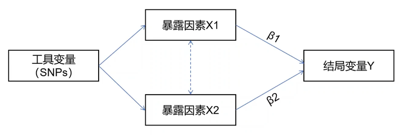

> - Cover Pic by [@笠木梨Ceey](https://www.pixiv.net/artworks/130128385)

## 参考
>
> [【bilibili】一个视频让你学会多变量孟德尔随机化实操！](https://www.bilibili.com/video/BV1NM4JeWEmf/)

## 简介

### 基本概念

- 多种暴露相关的遗传变异来估计没中暴露和单一结局之间的因果关系
- 使用条件
  - 很难找到SNP只与一种暴露因素相关，但可以找到SNP与一些相互关联的暴露因素相关
  - 与暴露相关的SNP中有很多斗鱼某个或者某几个混杂因素相关
- 工具变量的SNP至少与一种暴露因素相关

> [【bilibili】一个视频让你学会多变量孟德尔随机化实操！](https://www.bilibili.com/video/BV1NM4JeWEmf/)


### 多效性

- 一个SNP与多种表型相关
  - 垂直多效性：SNP与一种表型相关，继而影响另一种表型
  - 水平多效性：SNP与两种或多种表型独立相关
- 在双样本孟德尔随机化（单变量）分析中，出现SNP具有潜在的水平多效性时，  
  多变量孟德尔随机化可以对其进行调整，并将该表型作为额外暴露进行分析

## MVMR包
>
> <https://github.com/WSpiller/MVMR>

```r
# 安装
install.packages(
 "MVMR", 
 repos = c("https://mrcieu.r-universe.dev", "https://cloud.r-project.org")
)

# 载入
library(MVMR)
```

## 读取数据

```r
# 读取vcf
x1 <- VariantAnnotation::readVcf('x1.vcf.gz')
x2 <- VariantAnnotation::readVcf('x2.vcf.gz')
x3 <- VariantAnnotation::readVcf('x3.vcf.gz')
y <- VariantAnnotation::readVcf('y.vcf.gz')

# 数据转换
x1 <- gwasvcf_to_TwoSampleMR(vcf = x1)
x2 <- gwasvcf_to_TwoSampleMR(vcf = x2)
x3 <- gwasvcf_to_TwoSampleMR(vcf = x3)
y <- gwasvcf_to_TwoSampleMR(vcf = y)
```

## 数据预处理

### 筛选p值

```r
x1 <- subset(x1, pval.exposure < 5e-08)
x2 <- subset(x2, pval.exposure < 5e-08)
x3 <- subset(x3, pval.exposure < 5e-08)
```

### 去除连锁不平衡

- 在线去除连锁不平衡

```r
x1_clumped <- clump_data(
 x1,
 clump_kb = 10000,
 clump_r2 = 0.001,
 clump_p1 = 1,
 clump_p2 = 1,
 pop = 'EUR' # 样本人种，'EUR'为欧洲
)

x2_clumped <- clump_data(
 x2,
 clump_kb = 10000,
 clump_r2 = 0.001,
 clump_p1 = 1,
 clump_p2 = 1,
 pop = 'EUR' # 样本人种，'EUR'为欧洲
)

x3_clumped <- clump_data(
 x3,
 clump_kb = 10000,
 clump_r2 = 0.001,
 clump_p1 = 1,
 clump_p2 = 1,
 pop = 'EUR' # 样本人种，'EUR'为欧洲
)
```

- 本地去除连锁不平衡

> [Running local LD operations](https://mrcieu.github.io/ieugwasr/articles/local_ld.html)

- 需要下载LD数据库： <http://fileserve.mrcieu.ac.uk/ld/1kg.v3.tgz>

```r
x1_clumped <- ieugwars::ld_clump(
 dplyr::tibble(
  rsid = x1$SNP,
  pval = x1$pval.exposure
 ),
 clump_kb = 10000,
 clump_r2 = 0.001,
 clump_p = 1,
 pop = 'EUR',
 bfile = '1kg.v3/EUR', # kg.v3解压后的文件，注意路径是绝对还是相对
 plink_bin = plinkbinr::get_plink_exe()
)

x2_clumped <- ieugwars::ld_clump(
 dplyr::tibble(
  rsid = x2$SNP,
  pval = x2$pval.exposure
 ),
 clump_kb = 10000,
 clump_r2 = 0.001,
 clump_p = 1,
 pop = 'EUR',
 bfile = '1kg.v3/EUR', # kg.v3解压后的文件，注意路径是绝对还是相对
 plink_bin = plinkbinr::get_plink_exe()
)

x3_clumped <- ieugwars::ld_clump(
 dplyr::tibble(
  rsid = x3$SNP,
  pval = x3$pval.exposure
 ),
 clump_kb = 10000,
 clump_r2 = 0.001,
 clump_p = 1,
 pop = 'EUR',
 bfile = '1kg.v3/EUR', # kg.v3解压后的文件，注意路径是绝对还是相对
 plink_bin = plinkbinr::get_plink_exe()
)
```

### 修改暴露名称

- 一般默认是'exposure'，但是多变量情况下应该进行修改以区分不同暴露

```r
x1_clump$id.exposure <- 'x1'
x2_clump$id.exposure <- 'x2'
x3_clump$id.exposure <- 'x3'
```

### 保存结果

```r
readr::write_csv(x1_clump, 'x1_clump.csv')
readr::write_csv(x2_clump, 'x2_clump.csv')
readr::write_csv(x3_clump, 'x3_clump.csv')
```

### 提取SNP和p值

```r
x1_snp <- x1_snp %>% dplyr::select(SNP, pval.exposure)
x2_snp <- x2_snp %>% dplyr::select(SNP, pval.exposure)
x3_snp <- x3_snp %>% dplyr::select(SNP, pval.exposure)
```

### 合并暴露并去重

```r
x_bind <- bind_rows(x1, x2, x3)
x_bind <- x_bind[!duplicated(x_bind$SNP),]
colnames(x_bind) <- c('rsid', 'pval')
```

### 重新去除连锁不平衡

- 在线去除连锁不平衡

```r
x_bind_clumped <- clump_data(
 x_bind,
 clump_kb = 10000,
 clump_r2 = 0.001,
 clump_p1 = 1,
 clump_p2 = 1,
 pop = 'EUR' # 样本人种，'EUR'为欧洲
)
```

- 本地去除连锁不平衡

```r
x_bind_clumped <- ieugwars::ld_clump(
 x_bind,
 clump_kb = 10000,
 clump_r2 = 0.001,
 clump_p = 1,
 pop = 'EUR',
 bfile = '1kg.v3/EUR', # kg.v3解压后的文件，注意路径是绝对还是相对
 plink_bin = plinkbinr::get_plink_exe()
)
```

### 为暴露挑选SNP

```r
# 挑选
x1_pick <- inner_join(x1_clump, x_bind_clumped, by = 'SNP')
x2_pick <- inner_join(x2_clump, x_bind_clumped, by = 'SNP')
x3_pick <- inner_join(x3_clump, x_bind_clumped, by = 'SNP')

# 合并
x_pick <- bind_rows(x1_pick, x2_pick, x3_pick)
```

### 筛选结局SNP

```r
# 筛选
y_filted <- inner_join(x_bind, y, by = 'SNP')

# 规整数据
y_filted <- format_data(
 dat = y_filted,
 type = "outcome",
 snps = x_bind$SNP,
 snp_col = "SNP",
 beta_col = "beta.exposure",
 pval_col = "pval.exposure",
 se_col = "se.exposure",
 eaf_col = "eaf.exposure",
 effect_allele_col = "effect_allele.exposure",
 other_allele_col = "other_allele.exposure",
 samplesize_col = "samplesize.exposure",
 ncase_col = "ncase.exposure",
 ncontrol_col = "ncontrol.exposure",
 id_col = "id.exposure"
)
y_filted$id.outcome = "y"
```

### 协调暴露与结局数据

- `mv_harmonise_data()`处理后是一个列表的形式

```r
mvharmo <- mv_harmonise_data(x_pick, y_filted)
```

### 转换为MendelianRandomization包的格式

```r
mvharmo_summmary <- cbind(mvharmo[["outcome_beta"]],
                     mvharmo[["exposure_beta"]][,1],
                     mvharmo[["exposure_beta"]][,2],
                     mvharmo[["exposure_beta"]][,3],
                     mvharmo[["exposure_se"]][,1],
                     mvharmo[["exposure_se"]][,2],
                     mvharmo[["exposure_se"]][,3],
                     mvharmo[["outcome_se"]])

mvharmo_summmary = data.frame(mvharmo_summmary)

mvmr_input <- mr_mvinput(
 bx = cbind(
  SummaryStats$X2, 
  SummaryStats$X3, 
  SummaryStats$X4
 ),
 bxse=cbind(
  SummaryStats$X5, 
  SummaryStats$X6, 
  SummaryStats$X7
 ),
 by = SummaryStats$X1,
 byse = SummaryStats$X8
)
```

## MR分析

### IVW

```r
res_ivm <- mr_mvivw(
 mvmr_input,
 model = "default",
 correl = FALSE,
 distribution = "normal",
 alpha = 0.05
)
```

### Egger

```r
res_ivm <- mr_mvegger(
 mvmr_input,
 model = "default",
 correl = FALSE,
 distribution = "normal",
 alpha = 0.05
)
```

### F值计算

```r
F_dt <- format_mvmr(
 BXGs = mvharmo[["exposure_beta"]],
 BYG = mvharmo[["outcome_beta"]],
 seBXGs = mvharmo[["exposure_se"]],
 seBYG = mvharmo[["outcome_se"]],
 RSID = rownames(mvharmo[["exposure_beta"]])
)
Fval <- strength_mvmr(r_input = F_dt, gencov = 0)
```

### 异质性检验

```r
res_pleio <- pleiotropy_mvmr(r_input = F_dt, gencov = 0)
```
