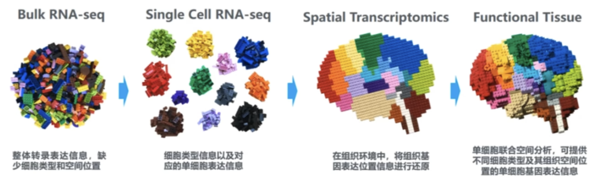
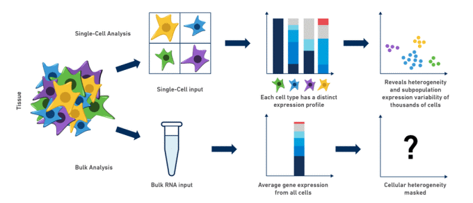

> - Cover Pic by [@void_0](https://www.pixiv.net/artworks/128293940)

## 参考
>
> [【bilibili】一节课学会中介孟德尔随机化实操!生信小白快来!!!](https://www.bilibili.com/video/BV1vYtTerEd6)

## 简介

### 原理

- 评估一个中介变量在暴露因素和结局之间的中介作用
- 成立假设
  - 每个变量之间没有混杂因素
  - 暴露不会造成额外的混杂因素
  - 暴露和中介之间没有相互作用

### 多变量中介孟德尔随机化

- 适用于暴露到结局的直接效应是不知道的情况

1. 计算**暴露与结局**双样本孟德尔随机化，得到总效应$\beta_{XY}$
2. 计算**暴露与中介**双样本孟德尔随机化，得到总效应$\beta_{XM}$
3. 计算**暴露+中介与结局**双样本孟德尔随机化，得到调整后的$\beta_{XY}'$和$\beta_{MY}$
4. 计算

- 中介效应：$a = \beta_{XM} \beta_{MY}$
- 中介占比：$b = \frac{a}{\beta_{XY}}$

 > [【bilibili】一节课学会中介孟德尔随机化实操!生信小白快来!!!](https://www.bilibili.com/video/BV1vYtTerEd6)

### 分步双样本孟德尔随机化

1. 分别进行3次孟德尔随机化

- 计算**暴露与结局**双样本孟德尔随机化，得到总效应$\beta_{XY}$
- 计算**暴露与中介**双样本孟德尔随机化，得到总效应$\beta_{XM}$
- 计算**中介与结局**双样本孟德尔随机化，得到总效应$\beta_{MY}$

2. 计算

- 中介效应：$a = \beta_{XM} \beta_{MY}$
- 直接效应：$\beta_{XY}' = \beta_{XY} - \beta_{XM} \beta_{MY}$
- 中介占比：$b = \frac{a}{\beta_{XY}}$

 > [【bilibili】一节课学会中介孟德尔随机化实操!生信小白快来!!!](https://www.bilibili.com/video/BV1vYtTerEd6)

### 系数乘积检验法

- 检验 $a = \beta_{XM} \beta_{MY}$ 是否具有显著性
  - 通过查看 $a$ 的95%置信区间是否跨0确定
- 计算标准误差：$S_{M}= \sqrt{\beta_{SM}^{2} S_{XM}^{2}+\beta_{MY}^{2} S_{MY}^{2}}$
- 用$S_M$计算95%置信区间
- 计算统计量Z：$Z = \frac{a}{S_{M}}$
