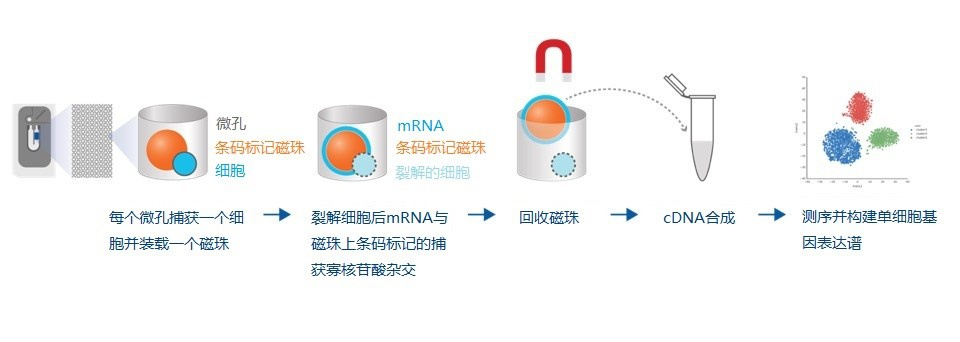
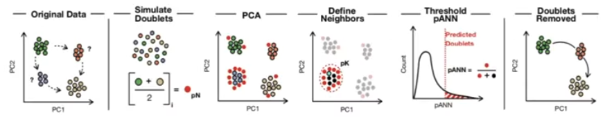
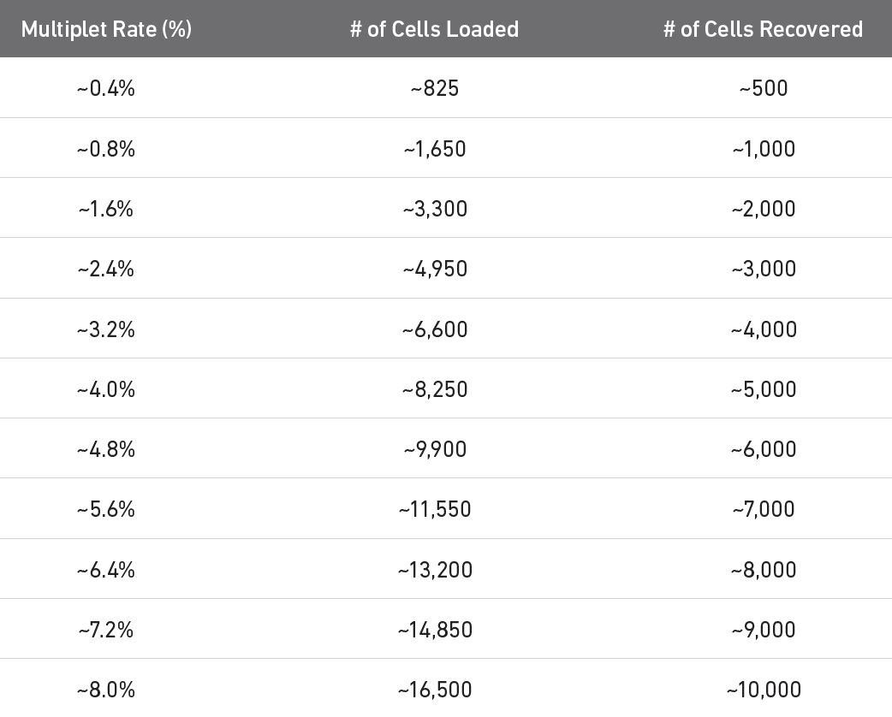

> - Cover Pic by [@void_0](https://www.pixiv.net/artworks/128293940)

> [Getting Started with Seurat](https://satijalab.org/seurat/articles/get_started_v5_new)  
> [【bilibili】单细胞数据分析/入门必看/标准分析流程/实战为主/保姆级教程/生物信息学/R语言/生信分析/单细胞/转录组/单细胞测序](https://www.bilibili.com/video/BV1Ct421j7X3/?share_source=copy_web&vd_source=fbb2b05d6e2142f9abfeb1ed8be0304d)  
> [Introduction to single-cell RNA-Seq and Seurat | Bioinformatics for beginners](https://youtu.be/xbX49h7BiUU?si=eJQeIcHCc5-xIkz9)  

## -----理论部分-----

## 简介

- 传统的转录组是在多细胞基础上进行，  
  仅计算了均值，丢失了细胞间异质性的信息
- 单细胞转录组

> [【bilibili】单细胞数据分析/入门必看/标准分析流程/实战为主/保姆级教程/生物信息学/R语言/生信分析/单细胞/转录组/单细胞测序](https://www.bilibili.com/video/BV1Ct421j7X3/?share_source=copy_web&vd_source=fbb2b05d6e2142f9abfeb1ed8be0304d)


- 10X Genomics 10X的基本技术原理:1个油滴=1个凝胶支微珠=1个RNA-Seq

> [Aksomics-单细胞测序](https://www.aksomics.com/services/scrna-seq/scrnaseq.html)


- BD RhapsodyBD的基本技术原理:1个微孔=1个单细胞=1个磁珠=1个RNA-Seq

> [Aksomics-单细胞测序](https://www.aksomics.com/services/scrna-seq/scrnaseq.html)


## 双细胞

### 简介

- **双细胞**：一个液滴或一个微孔中包含了2个或多个细胞
  - 同源双细胞：转录相同的细胞（**不**容易检测）
  - 异源双细胞：转率不同的细胞（容易检测）
- `DoubletFinder`原理

 1. 从现有单细胞数据中**人为产生双细胞**
 2. 将人工产生的doublets与真实细胞**混合**在一起
 3. 用**PCA距离矩阵**寻找每个单元的artificial k最近邻（nearest neighbors, NN）的比例
 4. 根据预期的双细胞数量进行排序和计算pANN阈值

- `DoubletFinder`参数

| 参数   | 作用          | 调参技巧                               |
| ---- | ----------- | ---------------------------------- |
| pCs  | 选择用于计算的主成分数 | 通常与下游分析保持一致，一般取10 - 30             |
| pK   | 控制双细胞识别灵敏度  | 通过paramSweep自动寻找最佳值，BCmetric峰值即为最优 |
| pN   | 生成伪双细胞的比例   | 默认0.25即可，过高会引入噪声                   |
| nExp | 预期双细胞数量     | 根据实验细胞数计算，调整同源双细胞比例后更准确            |

> [DoubletFinder: Detect doublets in single-cell RNA-Seq data in R | Detailed workflow tutorial](https://youtu.be/NqvAS4HgmrE?si=laoseA5ByhXfuTYX)


- 10x官网提供的Exp

> [What is the maximum number of cells that can be profiled?](https://kb.10xgenomics.com/hc/en-us/articles/360001378811-What-is-the-maximum-number-of-cells-that-can-be-profiled)


### 建议

- DoubletFinder**不适用于聚合**的单细胞RNA测序数据
- **不建议在合并数据上**运行（不同样本的细胞类型比例可能不同，且合并后的对象可能体积较大）
- 应分别在**不同样本**上运行
- 输入数据应**清除低质量**细胞
- 去除**低**RNA UMIs、**高**线粒体读取百分比以及标记基因**无信息**的细胞簇

- 预测的双细胞不一定都是双细胞,不同的算法得出的结果也会有有差异
  - 因此,要考虑是否真的需要去除双细胞

- 也可以不移除双细胞
  - 具体可以通过预测为双细胞的点是否在聚类结果的图中是否特别离群来判断要不要移除双细胞

## 术语

- **UMI**  
  独特分子标识符，即分子标签，可用于检测和量化独特的转录本。
- **Features**  
  基因
- **Barcodes**  
  单细胞测序实验使用短DNA条形码“标签”来识别源自同一细胞的读数。
- **Count Matrix/Feature-Barcode Matrix/Gene-Barcode Matrix**  
  一个计数矩阵，代表每个细胞条形码内每个特征的独特观测数量。
- **Doublets**  
  两个细胞被包裹在一个反应体积中时的情况。

## Seurat层级结构

> [Seurat v5: structure and main workflow easily explained!](https://www.youtube.com/watch?v=FgPPXLxZAwM)

- assays
  - 在`Layer`中能够储存多种测序的结果
    - RNA：原始数据及处理后的数据
    - SCT：SCTransform转换后的数据
    - integrated：合并的数据
  - 除了RNA，还有能有ATAC assay，ADT assay（CITE-seq）等
- meta.data
  - 元数据，可以将各种细胞样本信息输入进去，同时在后续的分析中也有部分结果会保存在meta.data当中
- reductions
  - 应用过的降维方法的列表
    - pca
    - tsne
    - umap
- graphs
  - 用于聚类和其他分析的图列表
- clusters
  - 聚类的结果
- commands
  - 用于生成该对象的命令记录
- misc
  - 存储不适合其他插槽的任意信息
  - 可用于存储额外的分析结果或自定义注释

## 细胞注释

### 基于标记的注释

#### 简介

- 根据已知标记基因的特征表达对细胞或细胞簇进行标记
- 标记基因与细胞类型之间的已知关系可从以下数据库中获取，例如：
  - MSigDB
  - PanglaoDB
  - **CellMarker**
  - 文献中手动获取
- 优势
  - 这些方法只会将标签分配给与已知标记物相关的细胞，而其他细胞将保持未标记状态。
- 缺点
  - 并非所有细胞类型都容易获取标记物
  - 标记基因或基因集（一组标记基因）应在特定细胞或细胞簇中特异性且持续表达
  - 一旦收集到相关且足够多的标记基因集，这些方法就能很好地发挥作用
  - 这些方法在注释主要细胞类型方面效果更好，但可能无法有效区分亚型

#### 工具

- AUCell
  - 用于估计曲线下面积
  - 单细胞
  - 由于在单细胞水平上检测率较低，因此每种细胞类型都需要多种标记物来进行标记基因集富集分析
- SCINA
  - 期望最大化、高斯混合模型
  - 单细胞
  - 同时对细胞进行聚类和注释；对错误标记基因的纳入具有稳健性
- GSEA/GSVA
  - 富集检验
  - 细胞簇
  - 标记基因列表必须重新格式化为GMT格式
   标记物在聚类中必须都在同一方向上差异表达

### 基于参考的注释

#### 简介

- 将标签从一个参考细胞或细胞簇（来自专家注释的单细胞RNA测序数据）转移到查询数据（待注释数据）中足够相似的细胞或细胞簇上
- 参考单细胞数据来源于诸如
  - 基因表达综合数据库（GEO）
  - 单细胞表达图谱
  - 细胞图谱项目
- 优势
  - 已分配标签的准确性以及避免对新细胞类型进行错误标记
- 缺陷
  - 只有在高质量且相关的带注释参考单细胞数据可用的情况下，该方法才可行
  - 如果参考数据不完整或匹配度不佳，一些工具的准确性会较低

#### 工具

- singleCell Net
  - 相对表达基因对 + 随机森林
  - 单细胞
  - 比其他方法慢10到100倍；准确率高
- scmap-cluster
  - 一致相关性
  - 单细胞
  - 现有最快的方法；平衡误报和漏报；包含网络界面，可用于大型预构建参考集或自定义参考集
- scmap-cell
  - 近似最近邻
  - 单细胞
  - 将单个细胞分配给参考中最近邻的细胞；可绘制细胞轨迹；快速且可扩展
- singleR
  - 层次聚类 + 斯皮尔曼相关性
  - 单细胞
  - 包含大型标记参考；无法扩展到≥10000个细胞的数据集；包含带有标记数据库的网络界面
- Scikit-learn
  - k近邻、支持向量机、随机森林、最近均值分类器和线性判别分析
  - 多种对象
  - 需要专业知识来正确设计和适当地训练分类器，同时避免过度训练

### `SingleR`包
>
> [Pokédex for Cell Types](https://bioconductor.org/packages/release/data/experiment/vignettes/celldex/inst/doc/userguide.html)
>
### 安装

```r
if (!require("BiocManager", quietly = TRUE))
    install.packages("BiocManager")

BiocManager::install("SingleR")
```

### 工作原理

- 将每个细胞的RNA表达与参考数据的不同细胞种类进行spearman相关性检测
- 根据检测结果打出分数
- 根据最高分选出最相关的细胞种类

### 三种注释策略

#### 策略1：使用参考特定标签

- 未处理批次效应
- 在每个参考中计算分数时，由于噪声导致精度损失
- 分类存在技术性的差异导致错误的风险

#### 策略2：跨参考比较分数

- 不同参考文献中标签缺乏一致性，使得解读变得复杂

#### 策略3：使用协同标签

- 假设存在协同了的标签
- 映射过程也存在丢失有关生物学状态（例如激活状态、疾病状况）的相关信息的风险，  
  如果在本体中该状态没有明显的对应项

## -----R中的基本操作-----

- 考虑到实际情况，操作以多样本为主
- 单样本无非就是没有数据融合和整合而已

## 安装官方推荐的包

- `Seurat`包

```r
install.packages('Seurat')
```

- `Seurat-wrappers`包
  - 提供`Seurat`包的补充功能

```r
options(timeout=300); remotes::install_github('satijalab/seurat-wrappers')
```

- `Signac`
  - 单细胞染色质数据分析

```r
install.packages('Signac')
```

- `SeuratData`
  - 自动加载预先打包为 Seurat 对象的数据集

```r
remotes::install_github("satijalab/seurat-data", quiet = TRUE)
```

- `Azimuth`
  - 跨多个器官和组织的scRNA-seq和scATAC-seq查询的局部注释

```r
# Note: you may need to update some packages prior to installing Azimuth; from a fresh R session run:
update.packages(oldPkgs = c("withr", "rlang"))
# 这之前补个包
if (!require("BiocManager", quietly = TRUE)){
 install.packages("BiocManager")
}
BiocManager::install("glmGamPoi")
# You can install Azimuth from GitHub with:
if (!requireNamespace('remotes', quietly = TRUE) {
  install.packages('remotes')
}
remotes::install_github('satijalab/azimuth', ref = 'master')
```

## 数据

### 种类

- 一般在ncbi上的GEO database搜索关键词就能获取数据
- 数据格式
  - X10
    - 10X Genomics的标准文件格式
    - 3个文件
      - barcodes.tsv.gz
      - features.tsv.gz \/ genes.tsv.gz
      - matrix.mtx.gz
    - 不可解压
  - H5
    - 存储大规模数据的二进制文件格式
    - 可以保存矩阵，表格，图像等
  - RDS
    - R的数据文件格式存储表达矩阵
    - 包含信息
      - **assays**  
     表达矩阵
        - **counts**  
      原始数据
        - **data**  
      `Normalize()` 规范化后的数据
        - **scale.data**  
      `Scale()` 缩放后的数据
      - **SCT**  
     `SCT`方式标准化后的数据
      - **meta.data**  
     细胞的样本注释信息（对照，给药等）
      - **active.assay**  
     默认的矩阵名
      - **active.ident**  
     默认的细胞来源信息
  - CSV \/ TXT
    - 存取单细胞测序的表达矩阵或元数据

- 如果数据不止scRNA-seq的结果，并且存在处理其他seq的数据的情况时，  
  应该经常确认是否默认调用的是`RNA`的数据

```r
DefaultAssay(ifnb_harmony)
# 如果不是`RNA`，应该修改
# DefaultAssay(ifnb_harmony) <- 'RNA'
```

### 读取

#### X10

- 网上的教程会说需要给每个样本单独创建文件夹，然后拖进去再去掉前缀
  - **其实不用**

```r
dt_x10 <- ReadMtx(
 mtx = 'matrix.mtx.gz',
 features = 'features.tsv.gz',
 cells = 'barcodes.tsv.gz'
)
dt <- CreateSeuratObject(counts = dt_x10)
```

#### H5

```r
dt_h5 <- Read10X_h5(
 filename = 'H5file.h5', 
 use.names = T, 
 unique.features = T
)
```

#### RDS

- 读取数据

```R
dt <- readRDS('RDSfile.rds')
```

- 获取内部信息`GetAssayData()`
  - 当不指定`@assays$RNA`的时候，默认使用`@assays$SCT, layer = 'counts`

```r
# 简单提取
GetAssayData(object = dt@assays$RNA, layer = 'counts')
GetAssayData(object = dt@assays$SCT, layer = 'data')
GetAssayData(object = dt@assays$RNA, layer = 'data')

# 转换为矩阵
as.matrix(GetAssayData(object = dt@assays$RNA, layer = 'counts'))[1:20,1:20]
```

- 修改默认提取信息`DefaultAssay()`

```r
# 提取RNA而不是默认的SCT
DefaultAssay(dt) <- 'RNA'
```

- 修改默认的细胞来源信息`Idents()`

```r
Idents(dt) <- "WhereIFrom"
```

#### CSV \/ TXT

```r
dt_txt <- fread('TXTfile.txt')
dt <- CreateSeuratObject(counts = dt_txt)
```

## 创建SeuratObject

- `SeuratObject`作为一个容器，里面可以保存所有的数据，分析结果以及分析流程记录

```r
dt <- CreateSeuratObject(counts = dt)
```

- 如果读取的数据是以**Seurat v5**之前的版本创建的，可以用这个转换成v5版本

```r
dt <- SeuratObject::UpdateSeuratObject(dt)
```

## 数据融合（多样本）

- 注意融合（merge）与整合（integrate）的**区别**
- **单样本无需融合**

```r
# sampleList id 就是样本分组名
dt <- merge(dt[1], y = dt[-1], add.cell.ids = sampleList)
```

- 最好排个序

```r
dt$orig.ident <- factor(dt$orig.ident, levels = YourOrder)
```

## 质量控制

### 影响因素

- 在创建`Seurat`对象以后，会自动计算
  - 独特基因数量`nFeature_RNA`
  - 基因表达计数`nCount_RNA`
- 对`nFeature_RNA`和`nCount_RNA`进行过滤
  - 过高代表了双细胞的存在
  - 过低表示空液滴或者低质量细胞
- 除此以外，也可以计算线粒体基因，核糖体基因的表达比例
  - 这些代表了细胞正处于异常状态
    - 低质量或者濒死细胞中表现的细胞膜破损导致的细胞质mRNA流出
    - 线粒体或核糖体本身被破坏导致的内部mRNA污染
    - 细胞处于应激受损状态，所以导致过量表达
- 一些样本可能会有红细胞的污染，可以计算红细胞基因比例来去除
- 也可以自定义管家基因来判断

```r
# 线粒体RNA比例
dt[["percent.mt"]] <- PercentageFeatureSet(dt, pattern = '^MT-')

# 核糖体RNA比例
dt[['percent.rb']] <- PercentageFeatureSet(dt, pattern = '^RP[SL]')

# 筛选红细胞比例
HB.genes <- c("HBA1","HBA2","HBB","HBD","HBE1","HBG1","HBG2","HBM","HBQ1","HBZ")
HB.genes <- CaseMatch(HB.genes, rownames(dt))
dt[['percent.genes']] <- PercentageFeatureSet(dt, features = HB.genes)
```

- 可以通过查看两个变量的相关性查看样本细胞是否正常

```r
# 期待不相关
FeatureScatter(dt, "nCount_RNA", "percent.mt", group.by = "orig.ident")
# 期待强相关
FeatureScatter(dt, "nCount_RNA", "nFeature_RNA", group.by = "orig.ident")
```

### 筛选

- 使用`subset()`函数可以过滤出合适的细胞
  - 过滤的阈值没有具体规定，可以说全凭感觉和喜好了哈
- 这里的是官方教程对`pmbc`测序的时候用的

```r
dt <- subset(
 dt, 
 subset = nFeature_RNA > 200 & 
  nFeature_RNA < 2500 & 
  percent.mt < 5
)
```

- 如果用`DoubletFinder`包去除双细胞的话，  
  可以不用在这里设置`nFeature_RNA`或`nCount_RNA`的上限值

## 归一化

- 对于机器学习而言，使用归一化是基本中的基本
- 后面的降维和聚类都需要归一化过的数据
- 默认的方法是`logNormalize`
  - $X' = log(count \times 10000)$
  - 这里的**10,000**是默认的比例因子，可以在`scale.factor`参数更换

```r
dt <- NormalizeData(
 dt，
 normalization.method = "LogNormalize", 
 scale.factor = 10000
)
```

## 寻找高变基因

- 高变基因，即在细胞间表达差异很大的基因
- 聚焦于高变基因可以凸显数据中的生物学信号，并且减少噪声干扰
- 默认方法就是`vst`，通过固有的均值-方差建模找出高变基因
- 从这里开始，后续分析中都默认输入高变基因来计算

```r
pbmc <- FindVariableFeatures(
 pbmc, 
 selection.method = "vst", 
 nfeatures = 2000
)
```

- 可以提取最高变的基因

```r
# 选择差异最大的10个高变基因
top10 <- head(FindVariableFeatures(dt), 10)
# 生成显示top10高变基因的散点图，其中高变的用默认的红色标记
LabelPoints(
 # VariableFeaturePlot(dt)是不带label的散点图
 plot = VariableFeaturePlot(dt), 
 points = top10,
 repel = TRUE
)
```

## 缩放

- 缩放也是机器学习重要的步骤
- 后续的降维和聚类都需要用到缩放的数据

```r
# 仅缩放高变基因
dt <- ScaleData(
 dt,
 features = VariableFeatures(dt) # 默认是仅对高变基因进行缩放
)
# 缩放全部基因
dt <- ScaleData(
 dt,
 features = rownames(dt) # 默认是仅对高变基因进行缩放
)
```

## PCA降维

- 使用PCA的目的是给后续的分析选择合适的维度
  - UMAP或者T-SNE的维度确定都依赖PCA降维的结果
- PCA分析

```R
dt <- RunPCA(
 dt,
 features = VariableFeatures(dt)
)
```

- PCA结果可视化

```r
# [['索引']]可以越过层级
dt[["pca"]]
```

- 确定拐点
  - 我的差不多是以20为拐点

```r
ElbowPlot(dt, ndims = 50)
```

```r
# 打印前5个维度，前5个基因
print(dt[["pca"]], dims = 1:5, nfeatures = 5)
```

- 结果图

```r
# 维度散点分布图
DimPlot(dt, reduction = 'pca', dims = c(1,2))
# 维度mark基因气泡图
VizDimLoadings(dt, dims = 1:4, reduction =  'pca', nfeatures = 20)
# 热图
DimHeatmap(dt, dims = 1:4, cells = 500, balanced = T, nfeatures = 30, ncol = 2)
```

## 聚类

- 方法是KNN
- 刚刚确定拐点是20，所以这里 `dims = 1:20`

```r
dt <- FindNeighbors(dt, dims = 1:20)
```

## 确定细胞簇

- @ 这部分方法很多

> [Findclusters-resolution怎么选](https://juejin.cn/post/7171079516092596231)
>
### 分别作图查看法

- 创建不同分辨率的情况来筛选，我这里创造了 0.1–1 的 10个分辨率
- 分辨率越高，生成的细胞簇就越多

```r
dt <- FindClusters(dt, resolution = seq(0.1, 1, by=0.1))
```

```r
for (i in seq(0.1, 1, by = 0.1) %>% as.character()){
 DimPlot(dt, group.by = paste('RNA_snn_res.',i,sep=''), label = T)
}
```

### 使用`clustree`包

- 通过

```r
clustree(dt, prefix = 'RNA_snn_res.') + coord_flip()
DimPlot(dt, group.by = 'RNA_snn_res.0.6', label = T)
```

### 分配簇

```r
# 分配
dt$seurat_clusters <- 'RNA_snn_res.0.6'
Idents(dt) <- 'seurat_clusters'

# 直接这样也行
# dt$seurat_clusters <- 'RNA_snn_res.0.6'
```

## 非线性降维

- 非线性降维的目的和PCA降维的**目的**是不同的
  - 非线性降维用于可视化来探索结果，  
   是将多维的细胞数据降维成二维数据以便可视化
  - PCA降维的目的是为了对细胞聚类，确定细胞簇
  - 基于PCA降维的结果，可以给非线性降维提供合适的维度

- **所以我们知道了什么？**
  - PCA对于聚类和非线性降维是**必须**的
  - PCA和聚类是**必须**的，用来划分单细胞种类
  - 非线性降维不是必须的，但是**通常都会做**
  - 聚类和非线性降维是**没有关系**的
  - 在非线性降维的平面图上标注各个细胞簇可以更好查看**聚类结果的合理性**

- 提供UMAP和t-SNE两种方法，**UMAP**比t-SNE更优
- 两种可以都做了，因为结果保存在`SeuratObject`的不同位置

```r
# dims = 1:20 是默认值
dt <- RunUMAP(dt, dims = 1:20)
dt <- RunTSNE(dt, dims = 1:20)
```

- 如何选择`dims`?
  - 这里的`dims`和PCA的`dims`是没有关系的，  
   不需要一样，但肯定是小于PCA的`dims`的
  - 根据PCA的`ElbowPlot()`结果，选择肘部左右的维度就行

## 去除双细胞

- 多样本数据需要分割数据成`list`，  
  并且接下来的步骤中要用`lapply()`进行列表操作

```r
dt <- SplitObject(dt)
```

- 寻找最佳pK值

```r
sweep.res <- paramSweep(dt, PCs = 1:20, sct = FALSE)
sweep.stats <- summarizeSweep(sweep.res, GT = FALSE)
sweep.bcmvn <- find.pK(sweep.stats)

pK <- bcmvn_pbmc %>% 
  filter(BCmetric == max(BCmetric)) %>% # 要找BCmetric时的最大的pK
  select(pK) %>%
pK <- as.numeric(as.character(pK[[1]]))
```

- 查看生成的pK与BCmetric的曲线图
  - 上面代码运行的时候会自动生成，  
   所以不需要特地去做这个图，除非想改造一下

```r
ggplot(sweep.bcmvn, aes(pK, BCmetric, group = 1)) +
  geom_point() +
  geom_line()
```

```r
# 设定推测的双细胞占比，这里是8%，也有7.5%，7.6%的
dblpct <- 0.008 
# 另一种算法：按每增加1000个细胞，双细胞比率增加千分之8来计算
# dblpct <- ncol(dt) * 8 * 1e-6 

homotypic.prop <- modelHomotypic(dt@meta.data$seurat_clusters)
nExp_poi <- round(dblpct * nrow(dt@meta.data))
nExp_poi.adj <- round(nExp_poi*(1-homotypic.prop))
```

- 得运算两次，第一次是

```r
dt <- doubletFinder(
 dt, 
 PCs = 1:20, 
 pN = 0.25, 
 pK = pK, 
 nExp = nExp_poi,
 reuse.pANN = NULL, 
 sct = FALSE
)

dt <- doubletFinder(
 dt, 
 PCs = 1:20, 
 pN = 0.25, 
 pK = pK, 
 nExp = nExp_poi.adj,
 reuse.pANN = {dt@meta.data}[length(dt@meta.data), 
 sct = FALSE
)
```

- 筛选数据

```r
dt <- subset(dt, subset = {dt@meta.data}[length(dt@meta.data)] == "Singlet")
```

## 数据整合（多样本）

- 对于多样本数据而言，需要对多个样本进行整合
- **整合integrate而不是融合merge**

- 对于融合的数据而言，  
  只是列表变成了一个单独的`seuratObject`，  
  但是所有的操作都是按样本（一般是Layer，分层）分开来运算的

- **整合就是混合成一个矩阵一起分析吗？**
  - 答案是**NO**
  - 整合应该理解为使用一种**去除批次效应的算法后**的数据
    - 简单而言，模拟一种情况：  
    这些不同的样本测定的条件是一样的，  
    基因表达的不同仅仅来自于生物体的内部因素或者有人为控制的刺激干预
  - 混合成一个矩阵，称之为**混层**（Join Layers）

```r
dt <- IntegrateLayers(
  object = dt, 
  method = HarmonyIntegration,
  orig.reduction = "pca", 
  new.reduction = "harmony",
  verbose = FALSE
)
```

- **什么时候混层？**
  - 在`IntegrateLayers()`后如果没有其他操作就可以混层
  - 形象点就是：
    - 不混层，分析就是每个层各自做各自的事情，  
    类似于`lapply()`对列表中的多个dataframe进行相同操作，  
    结果也是分别保存
    - 混层，就是把列表中矩阵融合成一个大的dataframe，  
    然后用`dplyr`包整列整行，或者分组地批量操作，  
    但终究所有的操作都是针对一个大的dataframe
  - 这个时候需要使用`JoinLayers()`进行对混层

```r
# 仅对RNA数据的混合
dt[['RNA']] <- JoinLayers(dt[['RNA']])

# 确认目前使用的是否是RNA数据，如果是可以直接混层，如果不是也可以指定为RNA后再操作
DefaultAssay(dt) # 当有多种数据的时候，最好先确认下assay
DefaultAssay(dt) <- 'RNA' # 修改当前的assay
dt <- JoinLayers(dt) # 直接混层
```

- 重新分层的方法

```r
dt <- split(dt, f = 'orig.ident')
```

- 注意不要用成`SplitObject()`了，这个是切分成`list`的
  - 切了再用`merge()`弄回来也行，不过何必呢？

```r
# ！！！注意不是这个！！！
dt <- splitObject(dt, split.by = 'orig.ident')
```

## 寻找差异性表达基因

#### 混合层

```r
dt[['RNA']] <- JoinLayers(dt[['RNA']])
```

### `FindAllMarkers()`
>
> [Gene expression markers for all identity classes](https://satijalab.org/seurat/reference/findallmarkers)

- 迭代地将每个集群与所有其他集群进行比较，为每个集群单独生成标记基因列表

```r
FindAllMarkers(
 dt,
 # 制定分类的群组，一般不需要，因为会按照聚类的结果去比较
 # group.by = 'orig.ident',
 # 测试限制在那些平均而言在两组细胞之间显示出至少X倍差异（对数尺度）的基因
 logfc.threshold = 0.25, 
 # 仅测试在两个群体中任一群体内至少有min.pct比例的细胞中检测到的基因
 min.pct = 0.1, 
 # 仅返回阳性标记
 only.pos = FALSE,
 # 检验方法
 test.use = 'wilcox',
 slot = 'data'
)
```

- 一般默认的`slot`是`data`，但有的测定方法`test.use`是要用到`counts`的

### `FindConservedMarkers()`

- 寻找不受条件影响的（干预/对照）保守的差异基因
- `ident.1`和`ident.2`填写聚类的编号，可以多对多，例如  
  `ident.1 = c(1,2,3), ident.2 = c(4,5,6,7,8)`
- `ident.2 = NULL`（默认）表示将`ident.1`与之以外的样本进行对比
- `grouping.var = 'orig.ident'`可以使比较在每个组中进行

```r
clust2_mkr <- FindConservedMarkers(
    dt,
    ident.1 = 2,
    # ident.2 = NULL的情况下是用ident.1和剩余所有簇进行比较（把其他簇当成1个簇）
    ident.2 = NULL, 
    grouping.var = 'orig.ident'
)

head(clust2_mkr)
```

- 下面可以看到每组中的结果，前缀是`orig.ident`
- `p_val`：比较结果的p值
- `avg_log2FC`：平均log2 fold change
- `pct.1`： 在`ident.1`样本中的占比
- `pct.2`：在`ident.2`样本中的占比

<table class="dataframe">
<caption>A data.frame: 6 x 22</caption>
<thead>
 <tr><th></th><th scope=col>3dpi_p_val</th><th scope=col>3dpi_avg_log2FC</th><th scope=col>3dpi_pct.1</th><th scope=col>3dpi_pct.2</th><th scope=col>3dpi_p_val_adj</th><th scope=col>6dpi_p_val</th><th scope=col>6dpi_avg_log2FC</th><th scope=col>6dpi_pct.1</th><th scope=col>6dpi_pct.2</th><th scope=col>6dpi_p_val_adj</th><th scope=col>...</th><th scope=col>1dpi_pct.1</th><th scope=col>1dpi_pct.2</th><th scope=col>1dpi_p_val_adj</th><th scope=col>MOCK_p_val</th><th scope=col>MOCK_avg_log2FC</th><th scope=col>MOCK_pct.1</th><th scope=col>MOCK_pct.2</th><th scope=col>MOCK_p_val_adj</th><th scope=col>max_pval</th><th scope=col>minimump_p_val</th></tr>
 <tr><th></th><th scope=col>&lt;dbl&gt;</th><th scope=col>&lt;dbl&gt;</th><th scope=col>&lt;dbl&gt;</th><th scope=col>&lt;dbl&gt;</th><th scope=col>&lt;dbl&gt;</th><th scope=col>&lt;dbl&gt;</th><th scope=col>&lt;dbl&gt;</th><th scope=col>&lt;dbl&gt;</th><th scope=col>&lt;dbl&gt;</th><th scope=col>&lt;dbl&gt;</th><th scope=col>...</th><th scope=col>&lt;dbl&gt;</th><th scope=col>&lt;dbl&gt;</th><th scope=col>&lt;dbl&gt;</th><th scope=col>&lt;dbl&gt;</th><th scope=col>&lt;dbl&gt;</th><th scope=col>&lt;dbl&gt;</th><th scope=col>&lt;dbl&gt;</th><th scope=col>&lt;dbl&gt;</th><th scope=col>&lt;dbl&gt;</th><th scope=col>&lt;dbl&gt;</th></tr>
</thead>
<tbody>
 <tr><th scope=row>C1orf194</th><td>3.656848e-169</td><td>5.582241</td><td>0.818</td><td>0.049</td><td>1.338443e-164</td><td>2.867431e-234</td><td>5.778323</td><td>0.926</td><td>0.064</td><td>1.049509e-229</td><td>...</td><td>0.927</td><td>0.194</td><td>1.462696e-198</td><td>4.405871e-239</td><td>4.471342</td><td>0.968</td><td>0.180</td><td>1.612593e-234</td><td>3.656848e-169</td><td>1.762348e-238</td></tr>
 <tr><th scope=row>OMG</th><td>5.807800e-158</td><td>5.997568</td><td>0.756</td><td>0.041</td><td>2.125713e-153</td><td>7.773242e-222</td><td>5.832163</td><td>0.857</td><td>0.048</td><td>2.845084e-217</td><td>...</td><td>0.390</td><td>0.031</td><td> 2.023912e-78</td><td>1.312786e-226</td><td>4.724586</td><td>0.820</td><td>0.059</td><td>4.804927e-222</td><td> 5.529663e-83</td><td>5.251143e-226</td></tr>
 <tr><th scope=row>C9orf24</th><td>2.431279e-160</td><td>5.367758</td><td>0.812</td><td>0.056</td><td>8.898725e-156</td><td>1.055259e-207</td><td>5.072022</td><td>0.931</td><td>0.096</td><td>3.862354e-203</td><td>...</td><td>0.880</td><td>0.142</td><td>1.120115e-198</td><td>9.418606e-226</td><td>4.209846</td><td>0.928</td><td>0.151</td><td>3.447304e-221</td><td>2.431279e-160</td><td>3.767442e-225</td></tr>
 <tr><th scope=row>FAM183A</th><td>5.815296e-140</td><td>4.987162</td><td>0.710</td><td>0.043</td><td>2.128456e-135</td><td>1.509409e-216</td><td>5.463419</td><td>0.883</td><td>0.063</td><td>5.524586e-212</td><td>...</td><td>0.833</td><td>0.141</td><td>1.790443e-171</td><td>3.856198e-190</td><td>3.870463</td><td>0.846</td><td>0.134</td><td>1.411407e-185</td><td>5.815296e-140</td><td>6.037634e-216</td></tr>
 <tr><th scope=row>C20orf85</th><td>2.866906e-161</td><td>5.505593</td><td>0.835</td><td>0.065</td><td>1.049316e-156</td><td>5.231875e-204</td><td>5.392041</td><td>0.957</td><td>0.121</td><td>1.914919e-199</td><td>...</td><td>0.944</td><td>0.246</td><td>7.929550e-195</td><td>6.860743e-185</td><td>3.769995</td><td>0.920</td><td>0.253</td><td>2.511100e-180</td><td>2.866906e-161</td><td>2.092750e-203</td></tr>
 <tr><th scope=row>DYNLRB2</th><td>4.212733e-164</td><td>5.389558</td><td>0.767</td><td>0.036</td><td>1.541902e-159</td><td>4.912858e-195</td><td>5.488527</td><td>0.736</td><td>0.030</td><td>1.798155e-190</td><td>...</td><td>0.817</td><td>0.095</td><td>1.238847e-185</td><td>6.966579e-202</td><td>3.902018</td><td>0.854</td><td>0.114</td><td>2.549838e-197</td><td>4.212733e-164</td><td>2.786632e-201</td></tr>
</tbody>
</table>

### `FindMarkers()`

- [Gene expression markers of identity classes](https://satijalab.org/seurat/reference/findmarkers)
- 比较 **特定的两个集群**（或一个集群与其他集群的组合），找出在目标集群中差异表达的基因
  - 其实`FindAllMarkers()`可以做到一样的事情，这个不是很常用

```r
mkr_clust2v3 <- FindMarkers(
 ifnb_harmony, 
 ident.1 = 2, 
 ident.2 = 3
)
```

### 组合样本及细胞簇

- 在注释了细胞簇以后（**确定细胞簇**），可以进行样本+细胞簇的比较
- 首先组合成一个新的列

```r
# 组合
dt$TypeCondi <- paste0(ifnb_harmony$type,'_', ifnb_harmony$condition)

# 有必要的话可以因子化并排序
dt$TypeCondi <- factor(dt$TypeCondi, levels = YourOrder)

# 可在meta.data查看
# dt$meta.data

# 定义默认的Idents
Idents(dt) <- dt$TypeCondi
```

- 之后用`FindAllMarkers()`还是`FindMarkers()`都随意

### 查看标记某基因的表达量的聚类结果图

- `FeaturePlot()`中制定`features`即可
- 因为`features`是复数，提示了可以按需输入多个感兴趣的 基因
- `min.cutoff = 'q10'`：表达量小于q10的基因不给颜色；只能填入分位数

```r
# 就看一个
FeaturePlot(dt, features = c('C1orf194'), min.cutoff = 'q10')
# 看两个以上
FeaturePlot(dt, features = c('C1orf194','OMG'), min.cutoff = 'q10')
FeaturePlot(dt, features = c('NDRG1','OMG'), min.cutoff = 'q10',label = TRUE, ncol = 1)
```

## 确定细胞簇

### 细胞Markers已知

- 如果已知包含哪些细胞以及它们的Marker基因，  
  可以结合上述的用`FeaturePlot()`生成的聚类结果图来看各个细胞簇属于哪种细胞

- 首先需要将细胞的聚类结果`Ident`替换名称
- （这里`DataFromIFNB`就是dt，由于是特定的数据集的东西所以区分一下）

```r
DataFromIFNB <- RenameIdents(DataFromIFNB, `3` = 'CD16 Mono')
```

- 如果meta数据里面已经有注释了（实际上一手数据根本不会有哈）

```r
Idents(dt) <- dt@meta.data$aColOfAnnotations
```

### 细胞Markers未知

- 如果不用现有一些结论提供的细胞Markers的话，需要先找出差异基因再来注释
  - 这也是我把【确定细胞簇】放到【寻找差异性表达基因】后面的原因

#### 单注释数据集注释

```r
hpca <- HumanPrimaryCellAtlasData()
pred <- SingleR(test = dt,
        ref = hpca,
        labels = hpca$label.main)
dt$singleR.labels <- pred$labels[match(rownames(dt@meta.data), rownames(pred))]
```

#### 多注释数据集注释

##### 策略1：使用参考特定标签

```r
# 调取参考数据集
hpca <- celldex::HumanPrimaryCellAtlasData()
dice <- celldex::DatabaseImmuneCellExpressionData()

# 给基因名按数据集添加前缀以做区分
hpca$label.main <- paste0('HPCA.', hpca$label.main)
dice$label.main <- paste0('DICE.', dice$label.main)

# 注意：intersect只能两个数据，x和y
# 3个数据的时候要两两intersect
shared <- GenomicRanges::intersect(rownames(hpca), rownames(dice))
# shared <- GenomicRanges::intersect(rownames(shared), rownames(set3))

# 合并参考数据集
combined <- cbind(hpca[shared,], dice[shared,])

# 检查一下combined中是否存在基因，有的数据库基因不相同，导致空基因会报错的
combined 

# 注释
pred <- SingleR(
        test = GetAssayData(dt, slot = 'counts'),
        ref = combined,
        labels = combined$label.main)

dt$singleR.labels <- pred$labels[match(rownames(dt@meta.data), rownames(pred))]
```

##### 策略2：跨参考比较分数

```r
# 调取参考数据集
hpca <- celldex::HumanPrimaryCellAtlasData()
dice <- celldex::DatabaseImmuneCellExpressionData()

# 如果直接调用策略1中的hpca和dice的话，记得去掉前缀
# hpca$label.main <- gsub('HPCA\\.','', hpca$label.main)
# dice$label.main <- gsub('DICE\\.','', dice$label.main)

# 注释
pred <- SingleR(test = GetAssayData(dt, slot = 'counts'),
        ref = list(HPCA = hpca, DICE = dice),
        labels = list(hpca$label.main, dice$label.main))

dt$singleR.labels <- pred$labels[match(rownames(dt@meta.data), rownames(pred))]
```

##### 策略3：使用统一标签

```r
# 调取参考数据集
# cell.ont 字符串，指定是否将细胞本体术语包含在 colData 中。若为 "nonna"，所有没有有效术语的样本将被丢弃；若为 "all"，所有样本将返回（可能带有 NA）术语；若为 "none"，则不添加术语。
hpca.ont <- celldex::HumanPrimaryCellAtlasData(cell.ont = 'nonna')
dice.ont <- celldex::DatabaseImmuneCellExpressionData(cell.ont = 'nonna')

# 筛选相同项目基因
shared <- GenomicRanges::intersect(rownames(hpca.ont), rownames(dice.ont))

# 不同于策略1，这里是分别保存而不是cbind
hpca.ont <- hpca.ont[shared,]
dice.ont <- dice.ont[shared,]

# 注释
pred <- SingleR(test = GetAssayData(dt, slot = 'counts'),
        ref = list(HPCA = hpca.ont, DICE = dice.ont),
        labels = list(hpca.ont$label.ont, dice.ont$label.ont))

dt$singleR.labels <- pred$labels[match(rownames(dt@meta.data), rownames(pred))]
```

- 运行这部分我会报错
  - 应该是`dice.ont <- celldex::DatabaseImmuneCellExpressionData(cell.ont = 'nonna')`有connection问题
  - 不过也懒得管了哈

```css
...
cacheError: failed to load resource  
name: EH3488  
title: DICE RNA-seq
...
```

#### 使用ATC注释

- ATC是一个在线细胞簇注释工具
- 将`FindAllMarkers()`的结果输出出来，复制到[ATC](http://xteam.xbio.top/ACT/index.jsp)的**Ordered up-regulated genes**中

```r
res_allmkr <- list()
for (i in unique(res_allmkr$cluster)){
    res_allmkr[[i]] <- paste(i,':',{res_allmkr %>% filter(cluster == i)}$gene %>% paste(collapse=","), sep = "")
}
res_allmkr %>%  paste(collapse = '\n') %>% cat()
```

- 下载注释结果，重命名为`clust.txt`（随便啥名）然后读取，合并

```r
clust <- read_delim("Clusters/clust.txt") %>% 
 mutate(across(3, ~ifelse(is.na(.), 'Unknown', .)))
dt@meta.data <- left_join(dt@meta.data, clust_roc[,2:3], by = c('seurat_clusters' = 'Cluster'))
```

- 弄到meta数据里然后把`Ident`改成`'Cell.Type'`

```r
Ident(dt) <- 'Cell.Type'
```

#### 查看注释结果

- 得分热图

```r
plotScoreHeatmap(pred)
plotDeltaDistribution(pred)
```

- 总结分类结果的列联表

```r
table(Assigned=pred$labels, Clusters=dt$seurat_clusters)
```

- 查看细胞注释得分

```r
grouping <- paste0(pred$labels,'.', pred$reference)
best_ref <- as.data.frame(split(pred, grouping))
```

- 查看参考数据集中marker种类

```r
metadata(pred$orig.results$HPCA)$de.genes
metadata(pred$orig.results$DICE)$de.genes
```

-

```r
colData(hpca.ont)
colData(dice.ont)

hpca.fle <- system.file("mapping","hpca.tsv", package = "celldex")
hpca.mapping <- read.delim(hpca.fle, header = F)
```

## 数据来源

- 样本取自成年人类肺外气道组织
  - GSM8162955_MOCK：未播种COVID-9病毒的细胞样本
  - GSM8162956_1dpi：播种COVID-9病毒的细胞样本后感染1天的细胞样本
  - GSM8162957_3dpi：播种COVID-9病毒的细胞样本后感染3天的细胞样本
  - GSM8162958_6dpi：播种COVID-9病毒的细胞样本后感染6天的细胞样本

## Functions

### Check Packages

```r
checkPack <- function(){

    options(timeout=300)

    if(!require(devtools)){
        install.packages('devtools')
    }else{
        library(devtools)
    }

    if(!require(patchwork)){
        install.packages('patchwork')
    }else{
        library(patchwork)
    }
    
    if(!require(Seurat)){
        install.packages('Seurat')
    }else{
        library(Seurat)
    }

    if(!require(SeuratWrappers)){
        remotes::install_github('satijalab/seurat-wrappers')
    }else{
        library(SeuratWrappers)
    }

    if(!require(tidyverse)){
        install.packages('tidyverse')
    }else{
        library(tidyverse)
    }

    if(!require(patchwork)){
        install.packages('patchwork')
    }else{
        library(patchwork)
    }

    if(!require(DoubletFinder)){
        remotes::install_github('chris-mcginnis-ucsf/DoubletFinder', force = TRUE)
    }else{
        library(DoubletFinder)
    }

    if(!require(harmony)){
        install.packages('harmony')
    }else{
        library(harmony)
    }

    if (!require('BiocManager', quietly = TRUE)){
        install.packages('BiocManager')
    }
        
    if(!require(SingleR)){
        BiocManager::install('SingleR')
    }else{
        library(SingleR)
    }
    
    if(!require(multtest)){
        BiocManager::install('multtest')
    }else{
        library(multtest)
    }

    if(!require(clustree)){
        install.packages('clustree')
    }else{
        library(clustree)
    }

    if(!require(metap)){
        install.packages('metap')
    }else{
        library(metap)
    }

    if(!require(SingleR)){
        BiocManager::install('SingleR')
    }else{
        library(SingleR)
    }

    if(!require(celldex)){
        BiocManager::install('celldex')
    }else{
        library(celldex)
    }

    if(!require(pheatmap)){
        install.packages('pheatmap')
    }else{
        library(pheatmap)
    }

    if(!require(DESeq2)){
        BiocManager::install('DESeq2')
    }else{
        library(DESeq2)
    }

if(!require(monocle3)){
        BiocManager::install(c('BiocGenerics', 'DelayedArray', 'DelayedMatrixStats',
                       'limma', 'lme4', 'S4Vectors', 'SingleCellExperiment',
                       'SummarizedExperiment', 'batchelor', 'HDF5Array',
                       'terra', 'ggrastr'))
        devtools::install_github('cole-trapnell-lab/monocle3')
    }else{
        library(monocle3)
    }

    if(!require(hdWGCNA)){
        BiocManager::install(c('WGCNA', 'UCell', 'GenomicRanges', 'GeneOverlap'))
        devtools::install_github('smorabit/hdWGCNA', ref='dev')
    }else{
        library(hdWGCNA)
        library(WGCNA)
    }

}
```

### 10X data to SeuratObject

```r
rdMtx <- function(
    sample, 
    path = 'Data',
    project = NULL,
    min.features = 200, 
    min.cells = 3
){

    args <- list(
        mtx = paste(path,'/',sample,'_matrix.mtx.gz',sep=''),
        features = paste(path,'/',sample,'_features.tsv.gz',sep=''),
        cells = paste(path,'/',sample,'_barcodes.tsv.gz',sep='')
    )

    matrix <- do.call(ReadMtx, args)

    matrix <- CreateAssay5Object(
        counts = matrix
    )

    args2 <- list(
        matrix,
        min.features = min.features, 
        min.cells = min.cells
    )

    if (!is.null(project)) args2$project <- project
    
    matrix <- do.call(CreateSeuratObject, args2)

    return(matrix)
}
```

### Get Samples and Names

```r
getSampleList <- function(path = 'Data'){
    sampleList <- lapply(
    list.files(
        path = paste(path, '/', sep=''), 
        pattern = '_features.tsv.gz'
    ),
    function(x) {
        regmatches(x, regexpr('^[^_]+_[^_]+', x))
    }
) %>%
    unlist()
}

getNameList <- function(path = 'Data'){
    nameList <- lapply(
    list.files(
        paste(path, '/', sep=''), 
        pattern = '_features.tsv.gz'
    ),
    function(x) {
        regmatches(x, regexpr('(?<=_)[^_]+(?=_)', x, perl = TRUE))
    }
) %>% 
    unlist()
}
```

### Combine local 10X data into one SeuratObject

```r
get10xData <- function(
    path = 'Data',
    min.features = 200, 
    min.cells = 3,
    merge = TRUE,
    JoinLayers = FALSE
){
    sampleList <- getSampleList()
    nameList <- getNameList()

    Sample_list <- list()
    for (i in sampleList){
        Sample_list <- append(
            Sample_list,
            rdMtx(
                i, 
                project = nameList[which(i == sampleList)], 
                min.features = min.features,
                min.cells = min.cells
            )
        )
    }

    if (merge == TRUE) Sample_list <- merge(Sample_list[[1]], y = Sample_list[-1], add.cell.ids = sampleList)

    if (JoinLayers == TRUE) Sample_list <- JoinLayers(Sample_list)

    return(Sample_list)
}
```

### Quality Control

```r
QuaCtr <- function(
    data,
    filter = TRUE,
    min.nFeature = NULL,
    max.nFeature = NULL,
    min.nCount = NULL,
    max.nCount = NULL,
    pct.mt = NULL,
    pct.hb = NULL,
    pct.rb = NULL
){
    # mitochondrial genes
    data[['percent.mt']] <- PercentageFeatureSet(data, pattern = '^MT-')
    # ribosomal genes
    data[['percent.rb']] <- PercentageFeatureSet(data, pattern = '^RP[SL]')
    # hemoglobin genes
    data[['percent.hb']] <- PercentageFeatureSet(
        data, 
        features = CaseMatch(
            c('HBA1','HBA2','HBB','HBD','HBE1','HBG1','HBG2','HBM','HBQ1','HBZ'), 
            rownames(data)
        )
    )

    if (filter == TRUE){
        if(!is.null(min.nFeature)) data <- subset(data, subset = nFeature_RNA > min.nFeature)
        if(!is.null(max.nFeature)) data <- subset(data, subset = nFeature_RNA < max.nFeature)
        if(!is.null(min.nCount)) data <- subset(data, subset = nCount_RNA > min.nCount)
        if(!is.null(max.nCount)) data <- subset(data, subset = nCount_RNA < max.nCount)
        if(!is.null(pct.mt)) data <- subset(data, subset = percent.mt < pct.mt) 
        if(!is.null(pct.hb)) data <- subset(data, subset = percent.hb < pct.hb) 
        if(!is.null(pct.rb)) data <- subset(data, subset = percent.rb < pct.rb)
    }

    return(data)
}
```

```r
ccDetect <- function(data){

    data <- CellCycleScoring(
        data,
        g2m.features = CaseMatch(
            search = cc.genes$g2m.genes, 
            match = rownames(data)
        ),
        s.features = CaseMatch(
            search = cc.genes$s.genes,
            match = rownames(data)
        )
    )

    data$CC.Difference <- data$S.Score - data$G2M.Score

    return(data)
}
```

```r
QuaCtrPlot <- function(
    data = data,
    group.by = 'orig.ident',
    plot.featrures = c('nFeature_RNA', 'nCount_RNA', 'percent.mt', 'percent.hb', 'percent.rb')
    ){

    plots <- list()

    for(i in 1:length(plot.featrures)){
        plots[[i]] = VlnPlot(
            data, 
            group.by= group.by, 
            pt.size = 0,
            features = plot.featrures[i]
        ) + 
        theme(axis.title.x = element_blank()) + 
        NoLegend()
    }

    violin <- wrap_plots(plots = plots, ncol = 2)
    
    print(violin)
    
    {FeatureScatter(data, 'nCount_RNA', 'nFeature_RNA', group.by = group.by) + geom_smooth( method='lm', color = 'pink')} /
        {FeatureScatter(data, 'nCount_RNA', 'percent.mt', group.by = group.by) + geom_smooth( method='lm', color = 'pink')}  / 
        {FeatureScatter(data, 'nCount_RNA', 'percent.hb', group.by = group.by) + geom_smooth( method='lm', color = 'pink')}  /
        {FeatureScatter(data, 'nCount_RNA', 'percent.rb', group.by = group.by) + geom_smooth( method='lm', color = 'pink')}  /
        {FeatureScatter(data, 'nCount_RNA', 'CC.Difference', group.by = group.by) + geom_smooth( method='lm', color = 'pink')}  

}
```

### Normalization, Find Variable Features, Scale data and PCA

```r
prepc <- function(
  data,
  normalization.method = 'LogNormalize',
  scale.factor = 10000,
  selection.method = 'vst',
  nfeatures = 2000,
  vars.to.regress = c('nCount_RNA', 'nFeature_RNA', 'percent.mt', 'percent.rb', 'percent.hb', 'CC.Difference'),
  scale.features = NULL,
  pca.plts = TRUE,
  VFplt = TRUE,
  VDLplt = TRUE,
  DPplt = TRUE,
  DHplt = TRUE,
  EPplot = TRUE,
  VFplt.n = 10,
  VizDimLoadings.dims = 1:2,
  ElbowPlot.ndims = 50,
  DimHeatmap.dims = 1:15,
  DimHeatmap.cells = 500
){

  data <- data %>%
    NormalizeData(
        normalization.method = normalization.method,
        scale.factor = scale.factor,
    ) %>%
    FindVariableFeatures(
        selection.method = selection.method,
        nfeatures = nfeatures
    ) %>% 
    ScaleData(
        vars.to.regress = vars.to.regress,
        features = scale.features
    ) %>%
    RunPCA()
  
  if (pca.plts == TRUE) {
    if(VFplt ==TRUE) print(VariableFeaturePlot(data) %>% LabelPoints(points = head(VariableFeatures(data), VFplt.n), repel = TRUE))
    if(VDLplt ==TRUE) print(VizDimLoadings(data, dims = 1:2, reduction = "pca"))
    if(DPplt ==TRUE) print(DimPlot(data, reduction = "pca"))
    if(DHplt ==TRUE) print(DimHeatmap(data, dims = DimHeatmap.dims, cells = DimHeatmap.cells, balanced = TRUE,ncol = 3))
    if(EPplot ==TRUE) print((ElbowPlot(data, ndims = ElbowPlot.ndims)))
  }

  return(data)
}
```

### Clustering and Find Clusters

```r
clustR <- function(
    data,
    reduction = 'pca',
    resolution = seq(0.1, 1, by = 0.1),
    reso.select.plt = TRUE,
    NLdim.final.plt = TRUE,
    clustreePlot = TRUE,
    multiDim = TRUE,
    Nldim.dims = 1:20,
    pca.plt = FALSE,
    tsne.plt = FALSE,
    umap.plt = TRUE,
    group.by = NULL,
    split.by = NULL,
    plt.dims = c(1:2),
    plt.label.size = 4,
    plt.repel = TRUE,
    plt.label = TRUE
    ){
    

    data <- data %>% 
        FindNeighbors(dims = Nldim.dims, reduction = reduction) %>%
        FindClusters(resolution = resolution) %>%
        RunTSNE(dims = Nldim.dims, reduction = reduction) %>%
        RunUMAP(dims = Nldim.dims, reduction = reduction) 

    if (reso.select.plt == TRUE){
        if(clustreePlot==TRUE) print(clustree(data, prefix = 'RNA_snn_res.') + coord_flip())
        if(multiDim==TRUE){
            snnresPlot <- list()
            for (i in resolution %>% as.character()){
                snnresPlot[[i]] <- DimPlot(data, group.by = paste('RNA_snn_res.',i,sep=''), label = T)
            }
            if (length(resolution) == 1) {
                print(snnresPlot[[1]])
            }else{
                print(wrap_plots(plots = snnresPlot, ncol = 2))
            }
        }
    }

    if (NLdim.final.plt == TRUE){
        args <- list(
            object = data,
            dims = plt.dims,
            label.size = plt.label.size,
            repel = plt.repel,
            label = plt.label
        )

        if(!is.null(group.by)) args$group.by <- group.by
        if(!is.null(split.by)) args$split.by <- split.by
        
        if(pca.plt){
            args$reduction <- 'pca'
            do.call(DimPlot, args) %>% print()
        } 

        if(tsne.plt){
            args$reduction <- 'tsne'
            do.call(DimPlot, args) %>% print()
        } 

        if(umap.plt){
            args$reduction <- 'umap'
            do.call(DimPlot, args) %>% print()
        } 
    }
    
    return(data)

}
```

```r
clustPlot <- function(
    data,
    pca = FALSE,
    tsne = FALSE,
    umap = TRUE,
    group.by = NULL,
    split.by = NULL,
    dims = c(1:2),
    label.size = 4,
    repel = TRUE,
    label = TRUE
){
    args <- list(
        object = data,
        dims = dims,
        label.size = label.size,
        repel = repel,
        label = label       
    )

    if(!is.null(group.by)) args$group.by <- group.by
    if(!is.null(split.by)) args$split.by <- split.by
    
    if(pca){
        args$reduction <- 'pca'
        do.call(DimPlot, args) %>% print()
    } 

    if(tsne){
        args$reduction <- 'tsne'
        do.call(DimPlot, args) %>% print()
    } 

    if(umap){
        args$reduction <- 'umap'
        do.call(DimPlot, args) %>% print()
    } 

}
```

### Non-linear dimensional reduction

```r
NLdimReduce <- function(
    data,
    Nldim.dims = 1:20,
    reduction = 'pca',
    pca.plt = FALSE,
    tsne.plt = TRUE,
    umap.plt = TRUE,
    group.by = NULL,
    split.by = NULL,
    plt.dims = c(1:2),
    plt.label.size = 4,
    plt.repel = TRUE,
    plt.label = TRUE
    ){
    

    data <- data %>% 
        RunTSNE(dims = Nldim.dims, reduction = reduction, reduction.name = paste('tsne.',reduction, sep = '')) %>%
        RunUMAP(dims = Nldim.dims, reduction = reduction, reduction.name = paste('umap.',reduction, sep = '')) 

    args <- list(
        object = data,
        dims = Nldim.dims,
        label.size = plt.label.size,
        repel = plt.repel,
        label = plt.label
    )

    if(!is.null(group.by)) args$group.by <- group.by
    if(!is.null(split.by)) args$split.by <- split.by
    
    if(pca){
        args$reduction <- 'pca'
        do.call(DimPlot, args) %>% print()
    } 

    if(tsne){
        args$reduction <- 'tsne'
        do.call(DimPlot, args) %>% print()
    } 

    if(umap){
        args$reduction <- 'umap'
        do.call(DimPlot, args) %>% print()
    } 


    return(data)

}
```

### Find doublets

```r
findDbl <- function(
    data,
    PCs = 1:20,
    sct = FALSE,
    num.cores = 1,
    GT = FALSE,
    pN = 0.25,
    dblpct = 0.008
){
    if (GT == TRUE){
        sweep.res <- paramSweep(data, PCs = PCs, sct = sct)
        gt.calls <- data@meta.data[rownames(sweep.res[[1]]), 'GT']
        sweep.stats <- summarizeSweep(sweep.res, GT = gt.calls)
        sweep.bcmvn <- find.pK(sweep.stats)
    }
    
    if (GT == FALSE){
        sweep.res <- paramSweep(data, PCs = PCs, sct = sct)
        sweep.stats <- summarizeSweep(sweep.res, GT = FALSE)
        sweep.bcmvn <- find.pK(sweep.stats)
    }

    pK <- sweep.bcmvn %>% 
    filter(BCmetric == max(BCmetric)) %>% 
    select(pK)
    pK <- as.numeric(as.character(pK[[1]]))

    homotypic.prop <- modelHomotypic(data@meta.data$seurat_clusters)
    nExp_poi <- round(dblpct * nrow(data@meta.data))
    nExp_poi.adj <- round(nExp_poi*(1-homotypic.prop))

    data <- doubletFinder(
        data, 
        PCs = PCs, 
        pN = pN, 
        pK = pK, 
        nExp = nExp_poi,
        reuse.pANN = NULL, 
        sct = sct
    )

    data <- doubletFinder(
        data, 
        PCs = PCs, 
        pN = pN, 
        pK = pK, 
        nExp = nExp_poi.adj,
        reuse.pANN = {data@meta.data %>% colnames()}[length(data@meta.data)-2], 
        sct = sct
    )

    return(data)
}
```

### Harmony

```r
hmny <- function(
    data
){
    data <- data %>% 
        IntegrateLayers(
            method = HarmonyIntegration,
            orig.reduction = 'pca', 
            new.reduction = 'harmony',
            verbose = FALSE
        ) 
    return(data)
}
```

### Find All Markers

```r
ClusterNSelect <- function(
    data,
    Nldim.dims = 1:20,
    resolution = 0.1,
    reso.select.plt = FALSE,
    min.pct = 0.1,
    only.pos = TRUE,
    test.use = 'roc',
    slot = 'data',
    avg_log2FC.threshold = 1
){
    data <- data %>% clustR(Nldim.dims = Nldim.dims, resolution = resolution, reso.select.plt = FALSE, NLdim.final.plt = FALSE)
    allMkr_roc <- FindAllMarkers(
        data,
        min.pct = min.pct,
        only.pos = only.pos,
        test.use = test.use,
        slot = slot
    ) 

    allMkr_roc %>% write_csv(paste0('Table/allMkr_roc_res', resolution, '.csv'))

    allMkr_roc.list <- list()
    for (i in unique(allMkr_roc$cluster)){
        allMkr_roc.list[[i]] <- paste(i,':',{allMkr_roc %>% filter(cluster == i, avg_log2FC > avg_log2FC.threshold)}$gene %>% paste(collapse=','), sep = '')
    }

    allMkr_roc.list %>%  paste(collapse = '\n') %>% writeLines(paste0('Table/allMkr_roc.list_res', resolution,'.txt'))

    cellClusters <- cellTable %>%
        left_join(allMkr_roc %>% filter(avg_log2FC > avg_log2FC.threshold), by =c('marker' = 'gene')) %>%
        filter(!is.na(myAUC)) %>%
        group_by(tissue_class, tissue_type, cell_name, cluster) %>%
        summarize(Markers = paste0(marker, collapse=','), marker_n = n())

    write_csv(cellClusters, paste0('Table/cellClusters_res', resolution, '.csv'))
}
```

## Library Packages

```r
checkPack()
```

## Load data

```r
dt.prep <- get10xData(path = 'Data', merge = TRUE, JoinLayers = FALSE)
sampleList <- getSampleList()
nameList <- getNameList()
dt.prep$orig.ident <- factor(dt.prep$orig.ident, levels = c('MOCK', '1dpi', '3dpi', '6dpi'))
```

## Quality Control

```r
dt.prep <- dt.prep %>% QuaCtr(filter = F)
```

## Normalization, Find Feature Variables, Scaling and PCA

```r
dt.prep <- dt.prep %>% prepc(vars.to.regress = NULL, pca.plts = FALSE) %>% ccDetect() %>% prepc(vars.to.regress = NULL)
QuaCtrPlot(dt.prep)
```

## Dim reduction

```r
dt.prep %>% clustR(
 Nldim.dims = 1:20, 
 resolution = seq(0.1, 1, by = 0.1), 
 NLdim.final.plt = FALSE
)
dt.prep <- dt.prep %>% 
 clustR(
  Nldim.dims = 1:20, 
  resolution = 0.7, 
  reso.select.plt = FALSE
 )
```

## Find Doublets

```r
dt.dbl <- SplitObject(dt.prep, split.by = 'orig.ident')
for (i in 1:length(dt)) {
    dt.dbl[[i]] <- findDbl(dt.dbl[[i]], PCs = 1:20)
    dt.dbl[[i]] <- subset(dt.dbl[[i]], !!sym(colnames(dt.dbl[[i]]@meta.data)[ncol(dt.dbl[[i]]@meta.data)]) == 'Singlet')
}
```

## Merge

```r
dt <- merge(dt.dbl[[1]], y = dt.dbl[-1], add.cell.ids = sampleList)
```

## Normalization, Find Feature Variables, Scaling and PCA

```r
dt <- dt %>% 
 prepc(vars.to.regress = NULL) %>% 
 ccDetect() %>% 
 prepc(vars.to.regress = NULL)
```

## Dim reduction

```r
dt %>% 
 clustR(
  Nldim.dims = 1:15, 
  resolution = seq(0.1, 1, by = 0.1), 
  NLdim.final.plt = FALSE
 )

dt <- dt %>% 
 clustR(
  Nldim.dims = 1:15, 
  resolution = 0.6, 
  reso.select.plt = FALSE
 )
```

## Harmony

```r
dt.hmy <- dt %>% hmny()
```

## Join Layers

```r
dt.hmy <- dt %>% JoinLayers()
```

## Dim reduction

```r
dt.hmy %>% clustR(reduction = 'harmony', Nldim.dims = 1:15, resolution = seq(0.1, 1, by = 0.1), NLdim.final.plt = FALSE)
dt.hmy <- dt.hmy %>% clustR(reduction = 'harmony', Nldim.dims = 1:15, resolution = 0.7, reso.select.plt = FALSE)
```

## Find Markers and cluster Identification

```r
allMkr_roc <- FindAllMarkers(
    dt.hmy,
    min.pct = 0.1,
    only.pos = TRUE,
    test.use = 'roc',
    slot = 'data'
)
```

```r
consMkr_roc <- lapply(X = dt$seurat_clusters %>% unique(), function(x){
    FindConservedMarkers(
        dt.hmy,
        ident.1 = x,
        test.use = 'roc',
        grouping.var = 'orig.ident'
    )
})
```

```r
allMkr_roc.list <- list()
for (i in unique(allMkr_roc$cluster)){
    allMkr_roc.list[[i]] <- paste(i,':',{allMkr_roc %>% filter(cluster == i)}$gene %>% paste(collapse=','), sep = '')
}
```

```r
allMkr_roc.list %>%  paste(collapse = '\n') %>% cat()
```

```r
consMkr_roc.list <- list()
for (i in dt.hmy$seurat_clusters %>% unique() %>% sort() %>% as.numeric()){
    consMkr_roc.list[[i]] <- paste(i,':',consMkr_roc[[i]] %>% rownames() %>% paste(collapse=','), sep = '')
    print(consMkr_roc.list[[i]])
}
```

```r
{DimPlot(
    dt.hmy,
    group.by = 'seurat_clusters',
    label.size = 10,
    repel = TRUE,
    label = TRUE,
    
) + labs(color = 'Clusters',title = 'Clusters')} & 
{DimPlot(
    dt.hmy,
    group.by = 'orig.ident',
    label.size = 8,
    repel = TRUE,
    label = TRUE
) + labs(color = 'Samples',title = 'Samples')} 
```

## Cell Markers

```r
cellTable <- read_csv('Clusters/Table.csv')
```

```r
for (i in 1:length(consMkr_roc)){
 left_join(cellTable, consMkr_roc[[i]] %>% 
  rownames_to_column(var = 'gene') %>% 
  filter(
   MOCK_avg_log2FC >0, 
   `1dpi_avg_log2FC` >0, 
   `6dpi_avg_log2FC` >0, 
   `6dpi_avg_log2FC` >0), 
   by =c('Cell marker' = 'gene')
  ) %>% 
  filter(!is.na(MOCK_myAUC)) %>% 
  group_by(`Cell name`) %>%
  summarize(
   Markers = paste0(`Cell marker`, collapse=','),
   n = n()
  ) %>%
  ungroup() %>%
  arrange(desc(n)) %>%
  mutate(cluster = i) %>%
  print()
}
```

```r
Cell.Type <- tibble(
    clust = dt.hmy$seurat_clusters %>% unique() %>% sort() ,
    Cell.Type = c(
        'Epithelial cell', #1
        'Early secretory cell', #2
        'Epithelial cell', #3
        'Basal cell', #4
        'Early secretory cell', #5
        'Basal cell', #6
        'Early secretory cell', #7
        'Basal cell', #8
        'Basal cell', #9
        'Epithelial cell', #10
        'Basal cell', #11
        'Epithelial cell' #12
    )
)

dt$Cell.Type <- left_join(
 dt[['seurat_clusters']], 
 Cell.Type, 
 by = c('seurat_clusters' = 'clust')
)$Cell.Type
```

```r
DimPlot(dt.hmy, reduction = 'umap', group.by = 'Cell.Type')
```

## Pseudo-bulk RNA-seq Analysis

```r
dt.hmy$my.group <- ifelse(dt.hmy$orig.ident %in% c('MOCK','1dpi'), 'CondiA', 'CondiB')
```

```r
dt.hmy$ind <- 1:nrow(dt.hmy@meta.data)
```

```r
dt.hmy$samp <- paste0(dt.hmy$my.group,'-',dt.hmy$ind)

dt.agg <- AggregateExpression(
    dt.hmy,
    group.by = c('Cell.Type', 'samp'),
    assays = 'RNA',
    slot = 'counts'
)
dt.pse <- t(dt.agg$RNA) %>% as.data.frame()
```

```r
rn.cellType <- gsub('_.*','',rownames(dt.pse))
```

```r
dt.split <- split.data.frame(
    dt.pse,
    f = gsub('_.*','',rownames(dt.pse)) %>% factor()
)

dt.split <- lapply(dt.split, function(x){
  rownames(x) <- gsub('.*_(.*)', '\\1', rownames(x))
  t(x)
})
```

```r
counts_bc <- dt.split$`Basal cell` + 1
meta_bc <- data.frame(samples = colnames(counts_bc)) %>%
    mutate(condition = ifelse(
        grepl('CondiA', samples), 'A','B')
    ) %>%
    column_to_rownames('samples')
dds <- DESeqDataSetFromMatrix(countData = counts_bc,
                       colData = meta_bc,
                       design = ~ condition)
```

```r
dds[rowSums(counts(dds)) >= 10,]
```

## Run DESeq2

```r
dds <- DESeq(dds)
```

## Generate results object

```r
res <- results(dds)
res
```

## Trajectory Analysis

```r
cds <- as.cell_data_set(dt.hmy)
cds <- cluster_cells(cds)
```

```r
plot_cells(cds,
           color_cells_by = 'Cell.Type',
           label_groups_by_cluster = FALSE,
           group_label_size = 10) +
  theme(legend.position = 'right') |
plot_cells(cds,
           color_cells_by = 'partition',
           label_groups_by_cluster = FALSE,
           group_label_size = 10) +
  theme(legend.position = 'right')
```

```r
cds <- learn_graph(cds, use_partition = FALSE)
plot_cells(cds,
           color_cells_by = 'Cell.Type',
           label_groups_by_cluster = FALSE,
           group_label_size = 10) +
  theme(legend.position = 'right')
cds <- order_cells(
 cds, reduction_method = 'UMAP', 
 root_cells = cds[,pData(cds)$Cell.Type == 'Basal cell'] %>% colnames()
)
```

```r
Idents(dt) <- dt$Cell.Type
dt$pseudotime <- pseudotime(cds)
```

```r
plot_cells(cds,
           color_cells_by = 'pseudotime',
           label_groups_by_cluster = FALSE,
           group_label_size = 10) +
  theme(legend.position = 'right') | 
plot_cells(cds,
           color_cells_by = 'Cell.Type',
           label_groups_by_cluster = FALSE,
           group_label_size = 10) +
  theme(legend.position = 'right')
as.data.frame(colData(cds)) %>%
    mutate(pseudotime = pseudotime(cds)) %>%
    ggplot(aes(pseudotime, reorder(Cell.Type, pseudotime, median), fill = Cell.Type)) +
  geom_boxplot() + 
  labs(x = 'Pseudotime', y = 'Cell Type') +
  theme(legend.position = 'none') +
  theme_bw() 
```

```r
cds_gt <- graph_test(cds, neighbor_graph = 'principal_graph', cores = 4)
```

```r
cds_gt %>% 
    filter(status == 'OK') %>%
    arrange(q_value) %>%
    head(10)
```

```r
FeaturePlot(
    dt.hmy, 
    features = cds_gt %>% 
        filter(status == 'OK') %>%
        arrange(q_value) %>%
        head(10) %>%
        rownames(),
    label = T   
) /
FeaturePlot(
    dt.hmy, 
    features = 'pseudotime',
    label = T   
)
```
