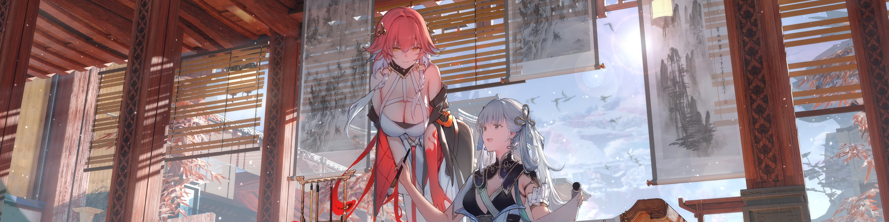

>
> - Cover Pic by [@超凶の狄璐卡](https://www.pixiv.net/artworks/121031925)

## Works

### 2025

(Bioinformatics)

- Using RNA-seq to explore the mechanism that how acupuncture effects on muscle.

### 2024

(Epidemiology)

- The important factors effecting on physical activity among young and middle-aged adults.
  - Using meta-analysis to find out the effective intervention components.
  - Using machine learning to find out the factors relating to acquirement of exercise habits.
